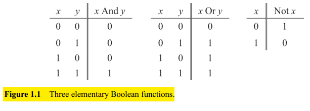
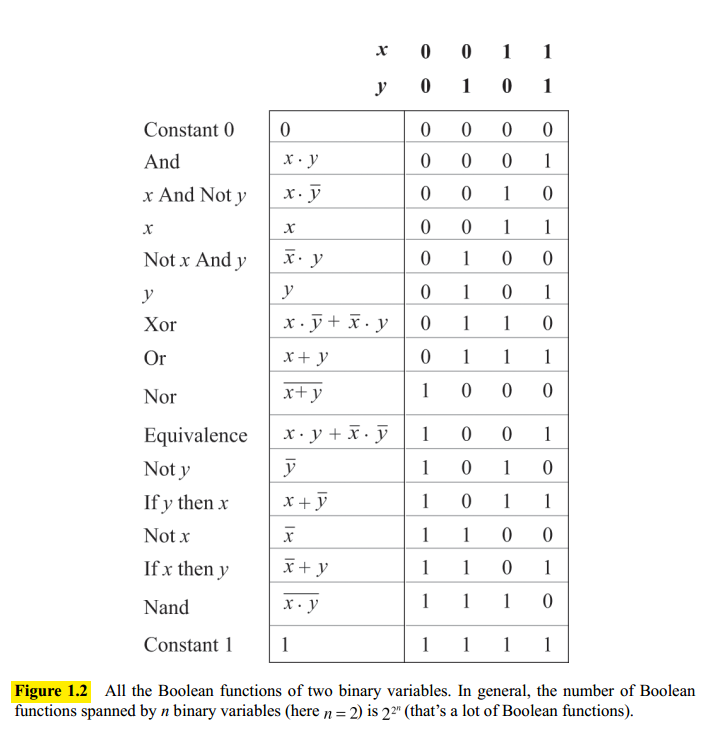
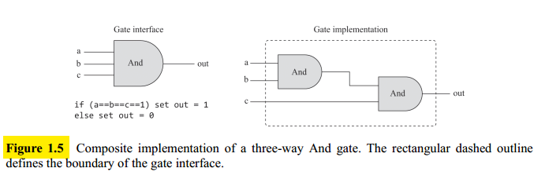
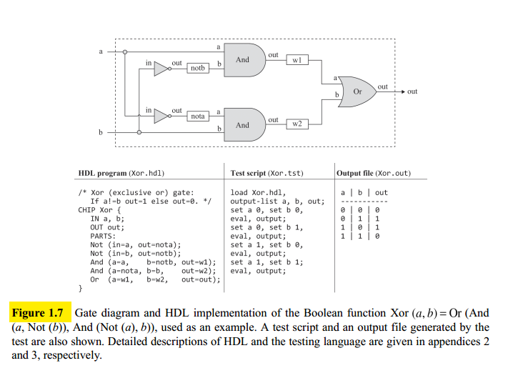
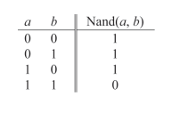
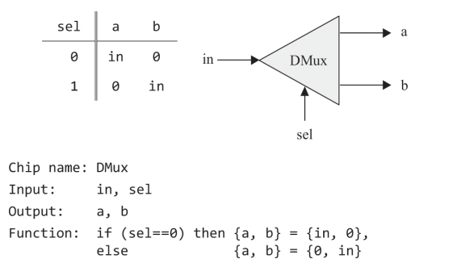
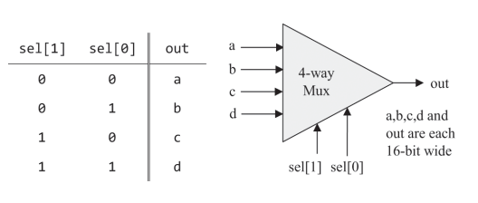

## Boolean Algebra

Boolean algebra manipulates two-state binary values. On Figure 1.1 we present three commonly used Boolean functions, also known as Boolean operators. These functions are named **And**, **Or**, and **Not**.

Figure 1.2 begs the question: What makes And, Or, and Not more interesting? A deeper answer is that various subsets of logical operators can be used for expressing any Boolean function, and {And, Or, Not} is one such subset. Also, any one of these three basic operators can be expressed using **Nand** gates only.

Every Boolean function can be defined using two alternative representations: **truth tables** or **boolean expressions**. Given a Boolean function of n variables represented by a Boolean expression, we can always construct from it the function’s truth table and vice-versa.

Note that every Boolean function can be represented by many different yet equivalent Boolean expressions. So the ability to **simplify a Boolean expression is the first step toward hardware optimization**.

## Logic Gates

A **gate** is a physical device that implements a simple Boolean function. Gates can be realized with any alternative technology permitting switching and conducting capabilities. Many hardware implementations of Boolean functions were created, including magnetic, optical, biological, hydraulic, pneumatic, quantum-based, and even domino-based mechanisms.

Today, gates are typically implemented as transistors etched in silicon, packaged as **chips**.

This means computer scientists don't have to worry about physical artifacts and can be content with the abstract notions of Boolean algebra and gate logic, trusting blissfully that someone else will realize them in hardware.

### Primitive and Composite Gates

Since all logic gates have the same input and output data types (0's and 1's), **they can be combined, creating composite gates of arbitrary complexity**. The right side of figure 1.5 gives the gate's internal architecture, or implementation, whereas the left side shows its interface.

Note that the interface of any given gate is unique, however it can be realized in many different ways. From an efficiency standpoint, the general rule is to try to use as few gates as possible.

To sum up, the art of logic design can be described as follows: Given a gate abstraction (also referred to as specification, or interface), find an efficient way to implement it using other gates that were already implemented.

## Hardware Construction

Today, hardware designers design the chip architecture using a formalism called **Hardware Description Language**, or HDL by writing an HDL program. While the tests are carried out using computer simulation.

The hardware designer will typically be interested in a variety of parameters such as speed of
computation, energy consumption and the overall cost implied by the implementation. All these parameters can be simulated.

After all tests and optimizations have been performed the final version of the HDL program can become the blueprint for the physical chip.

Figure 1.7, shows brief introduction to HDL, using an Xor gate example.

## Specification

**Not**: this gate outputs the opposite value of its input's value.

**And**: Returns 1 when both its inputs are 1, and 0 otherwise

**Or**: Returns 1 when at least one of its inputs is 1, and 0 otherwise

**Xor**: Also known as exclusive or, this gate returns 1 when exactly one of its inputs is 1, and 0 otherwise

**Nand**: realizes the following Boolean function:

**Multiplexer**: A multiplexer is a three-input gate (see figure 1.9). The multiplexer uses _sel_ to select and output the value of either $a$ or $b$.

**Demultiplexer**: takes a single input value and routes it to one of two possible outputs, according to a selector bit (see Figure 1.10).

### Multi-Bit Versions of Basic Gates

Computer hardware is often designed to process multi-bit values—for example 16-bit inputs.

**Multi-bit Not**: An n-bit Not gate applies the Boolean operation Not to every one of the bits in its n-bit input.

**Multi-bit And**: An n-bit And gate applies the Boolean operation And to every respective pair in its two n-bit inputs

**Multi-bit Or**: An n-bit Or gate applies the Boolean operation Or to every respective pair in its two n-bit inputs

**Multi-bit multiplexer**: An n-bit multiplexer operates exactly the same as a basic multiplexer, except that its inputs and output are n-bits wide

### Multi-Way Versions of Basic Gates

These are logic gates that can operate on more than two inputs, for example:

**Multi-way Or**: An m-way Or gate outputs 1 when at least one of its m input bits is 1, and 0 otherwise.

**Multi-way/Multi-bit multiplexer**: An $m$-way $n$-bit multiplexer selects one of its $m$ $n$-bit inputs, and outputs it to its $n$-bit output. The selection is specified by a set of $k$ selection bits, where $k = \log_2 m$. For example, a $4$-way multiplexer is shown on the following image:

