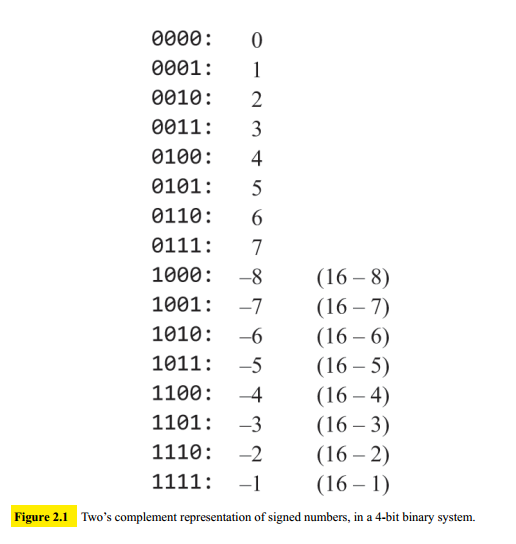
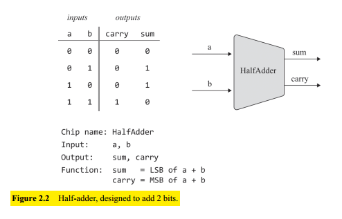
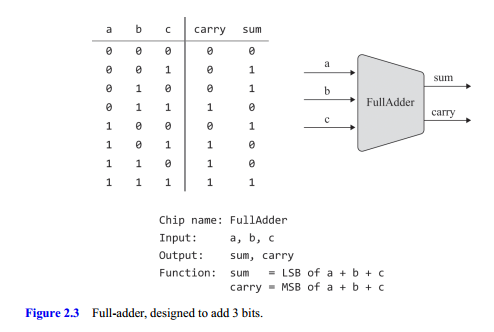
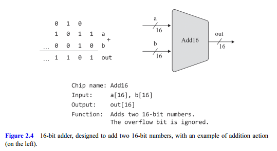
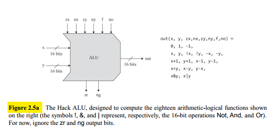
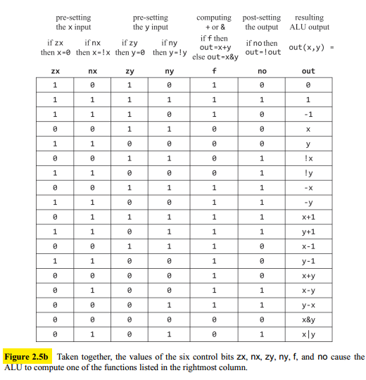

## Binary Addition

A pair of binary numbers can be added bitwise from right to left by adding the two rightmost bits (**lest significant** bits or LSB). Next, we add the resulting carry bit to the sum of the next pair of bits. We continue until the two left **most significan bits** (MSB) are added.

If the most significant bitwise addition generates a carry of 1, we have what is known as **overflow**.

## Signed Binary Numbers

We use **two's complement** (also known as radix complement) for representing signed numbers in binary code. Given a word size of $n$ bits, the two's complement for negative $x$ is given by the binary code of $2^n - x$.

The two’s complement representation has the following attractive properties:

- The system codes signed numbers, ranging from $-(2^{n-1})$ to $2^{n-1} - 1$
- The code of any nonnegative number begins with a $0$.
- The code of any negative number begins with a $1$.
- To obtain the binary code of $-x$ flip all the bits of x and add 1 to the result.
- Subtraction is handled as a special case of addition.

## Adders

**Half Adders**: adds two bits, outputs two bits.

**Full adder**: adds three bits, outputs two bits.

**Adder**: adds two $n$-bit numbers.

**Incrementer**: adds $1$ to a given number (_Spoiler: This will enable fetching the next instruction from memory, after executing the current one_).

## The Arithmetic Logic Unit

An **Arithmetic Logic Unit** is a chip designed to compute a set of arithmetic and logic operations. Exactly which operations an ALU should feature is a design decision. This ALU design is unique to the computer built in Nand to Tetris, named Hack.

As seen in figure 2.5a, the Hack ALU operates on two $16$-bit two's complement integers, denoted $x$ and $y$, and on six $1$-bit inputs, called **control bits**. These control bits tell the ALU which function to compute. The exact specification is given in figure 2.5b.

Note that each one of the six control bits is associated with a standalone, conditional micro-action. The six directives are to be performed in order:

1. We either set the $x$ and $y$ inputs to $0$, or not
2. We either negate the resulting values, or not
3. We compute either $+$ or $\&$ on the preprocessed values
4. We either negate the resulting value, or not.

All these settings, negations, additions, and conjunctions are $16$-bit operations.

Note that the ALU actually computes a total of sixty-four functions, since six control bits code that many possibilities. We’ve decided to focus on, and document, only eighteen of these possibilities, since these will suffice for supporting the instruction set of our target computer system
