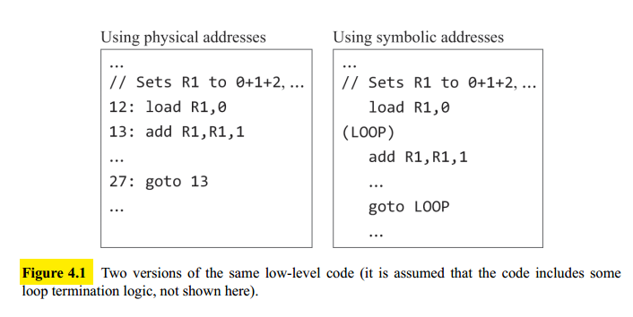
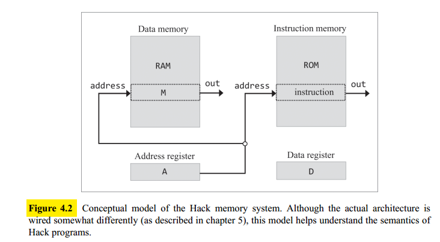

## Overview

### Hardware Elements

A machine language can be viewed as an agreed-upon formalism designed to manipulate a **memory** using a **processor** and a set of **registers**.

- **Memory**: refers to the collection of hardware devices that store data and instructions. It is a continuous sequence of cells, also referred to as **locations** or **memory registers**, each having a **unique address**.
- **Processor**: The processor, **Central Processing Unit**, or CPU, is a device capable of performing a fixed set of primitive operations: arithmetic, locical operation, memory access operations and control (branching) operations. It consists of an **ALU**, a set of **registers**, and gate logic that enables it to parse and execute binary instructions.
- **Registers**: moving data from the memory to the processor is relatively slow. For this reason, processors are normally equipped with several onboard registers inside the processor's chip that serves as high-speed local memory.

These registers fall into two categories: **data registers**, which hold data values, and **address registers**, which hold values that can be interpreted either as data values or as memory addresses.

### Languages

Machine language programs can be written in two ways: **binary** and **symbolic**. Symbolic machine languages are called **assembly languages**, and the programs that translate them into binary code are called **assemblers**.

The _syntax of an assembly language is tightly related to the low-level_ details of the target hardware: the available ALU operations, number and type of registers, memory size, and so on.

### Instructions

**Arithmetic and logical operations**: Every machine language features instructions for performing basic arithmetic operations:


**Memory access**: Every machine language features means for accessing and manipulating selected memory locations. This is typically done using an address register, $A$. For example, suppose we wish to set memory location $17$ to the value $1$. We can decide to do so using the two instructions `load A,17` followed by `load M,1`, where, by convention, $M$ stands for the memory register selected by $A$.

**Flow control**: To facilitate branching actions, machine languages feature several variants of conditional and unconditional goto instructions, as well as label declaration statements that mark the goto destinations (see Figure 4.1).



**Symbols**: code that uses symbolic references is much easier to write, debug and maintain. Also low-level code that mentions no physical addresses is said to be **relocatable**.

## The Hack Machine Language

### Background

Hack is a $16$-bit computer, meaning that the CPU and the memory units are designed to process, move, and store, chunks of $16$-bit values.

**Memory**: the Hack platform uses two distinct memory units: a **data memory** and an **instruction memory**.



The data memory (which we also call **RAM**) is a read/write device. So hack instructions can read data from, and write data to, selected RAM registers. The current data register is referred as $M$.

The instruction memory (which we also call **ROM**) is a read-only device, and programs are loaded into it. The current instruction register is referred as the **current instruction**.

**Registers**: Hack instructions are designed to manipulate three $16$-bit registers: a data register, denoted `D`, an address register, denoted `A`, and a selected data memory register, denoted `M`.

**Addresing**: The Hack instruction `@xxx` sets the `A ` register to the value `xxx`. This has two side effects:

- It makes the RAM register whose address is `xxx` the selected memory register
- It makes the value of the ROM register whose address is `xxx` the selected instruction

Which action to pursue is determined by the subsequent Hack instruction.

**Branching**: For example jo jump to instruction number $29$ we would use these two instructions: `@29`, `0;JMP`. The first instruction selects the `ROM[29]` register and the second one realizes an unconditional jump to execute said instruction. The Hack language also features **conditional branching**.

**Variables**: The `xxx` in the Hack instruction `@xxx` can be either a constant or a symbol. The use of symbols endows Hack assembly programs with the ability to use variables. For example `let x = 17` translates to:

```
@17
D=A
@x
```

Which basically selects the RAM register whose address is the value that is bound to the symbol `x`, and set this register to $17$. We assume that there is an agent who knows how to bind the symbols to addresses (the assembler).

On the following figure the show an example of the tranlation of pseudocode to our assembly language:


### The Hack Language Specification

The Hack machine language consists of two instructions, specified in figure 4.5.


#### The A-instruction

The A-instruction sets the A register to some $15$-bit value. The binary version consists of two fields: an operation code (_op-code_), which is $0$, followed by fifteen bits that code a nonnegative binary number.

The A-instruction is used for three different purposes:

- It's the only way to enter a constant into the computer.
- Sets the stage for a subsequent C-instruction that manipulates a selected RAM register.
- Sets the stage for a subsequent C-instruction that specifies a jump.

#### The C-instruction

The C-instruction answers three questions:

- What to compute (an ALU operation, denoted `comp`)
- Where to store the computed value (`dest`)
- What to do next (`jump`)

In the binary version, the leftmost bit is the C-instruction’s `op-code`, which is $1$. The next two bits are not used, and are set by convention to $1$.

##### Computation specification (`comp`)

The computed function is specified by the `a-bit` and the six `c-bits` comprising the instruction's `comp` field. This $7$-bit pattern can potentially code $128$ different calculations, of which only the twenty-eight listed in figure 4.5.

In the ALU the first input feeds from the `D` register, while the second ALU input feeds either
from the `A` register (when the `a-bit` is $0$) or from `M`, the selected data memory register (when the `a-bit` is $1$).

##### Destination specification (`dest`)

The ALU output can be stored in zero, one, two, or three possible destinations, simultaneously. The first and second `d-bits` code whether to store the computed value in the `A` register and in the `D` register, respectively. The third `d-bit` codes whether to store the computed value in `M`, the currently selected memory register.

##### Jump directive (`jump`)

The jump field of the C-instruction specifies what to do next. There are two possibilities:

- Fetch and execute the next instruction in the program, the default.
- Fetch and execute some other instruction.

In the latter case, we assume that the `A` register was already set to the address of the target instruction.

Whether or not to jump is determined jointly by the three `j-bits`. This gives eight possible jump
conditions, listed on figure 4.5.

### Symbols

Assembly instructions can specify memory locations (addresses) using either constants or symbols.

#### Predefined symbols

- `R0, R1, …, R15`: bound to the values $0$ to $15$.
- `SP, LCL, ARG, THIS, THAT`: bound to the values $0$, $1$, $2$, $3$, and $4$, respectively
- `SCREEN, KBD`: bound, respectively, to the values $16384$ and $24576$. Which are the base addresses of the screen memory map and the keyboard memory map.

#### Layer symbols

The syntax `(xxx)` binds the symbol `xxx` to the address of the next instruction in the program.

#### Variable symbols

Any symbol `xxx` appearing in a Hack assembly program that is not predefined and is not declared elsewhere using `(xxx)` is treated as a variable and is bound to a unique running number starting at $16$.

### Input/Output Handling

The Hack hardware platform can be connected to two peripheral I/O devices: a **screen** and a **keyboard**.

**Screen**: the computer interacts with a black-and-white screen organized as $256$ rows of $512$ pixels per row. So it is associated to a memory map stored in an $8$K memory block of $16$-bit words, starting at RAM address $16384$. Each row in the physical screen, starting at the screen's top-left corner, is represented in the RAM by $32$ consecutive $16$-bit words.

Note that we cannot access individual pixels/bits directly, we must fetch a complete $16$-bit word ($16$ pixels).

**Keyboard**: the computer can interact with a standard physical keyboard via a single-word memory map located at RAM address $24576$. When a key is pressed on the physical keyboard, its $16$-bit character code appears at `RAM[KBD]`. When no key is pressed, the code $0$ appears.
