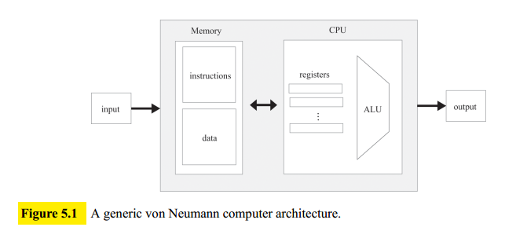
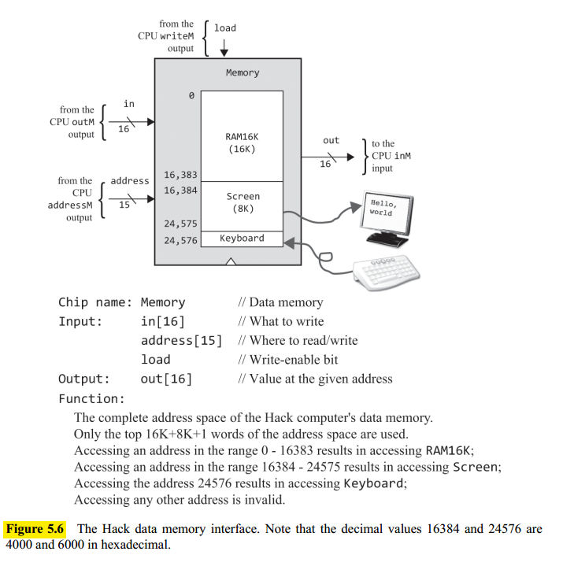
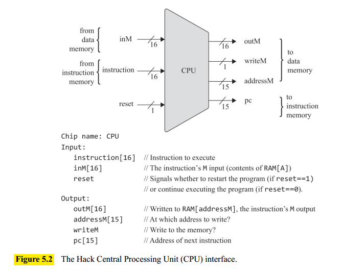
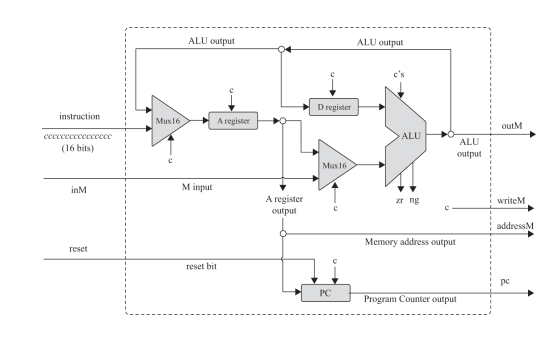
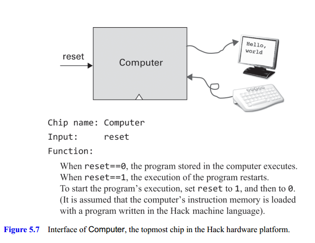
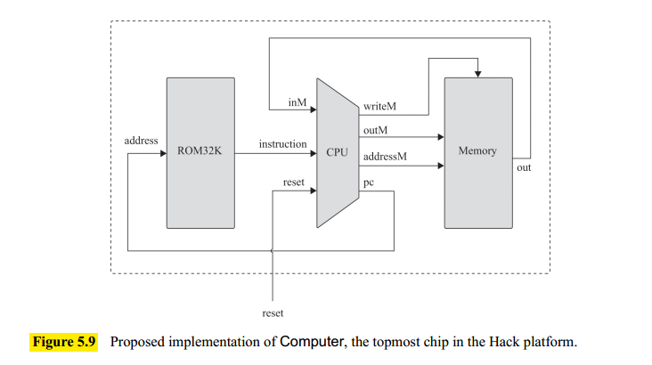

## Computer Architecture Fundamentals

A computer is based on a fixed hardware platform capable of executing a fixed repertoire of simple instructions which serves as building blocks. Moreover the logic of these programs is temporarily stored in the computer's memory, like data.

The **von Neumann architecture**, shown in figure 5.1, is based on a Central Processing Unit (CPU), interacting with a memory device, receiving data from some input device, and emitting data to some output device.

The term **Random Access Memory** derives from the important requirement that each randomly selected memory register can be reached instantaneously, that is, within the same cycle.

**Data memory**: High-level programs are designed to manipulate abstract artifacts like variables, arrays, and objects. Yet at the hardware level, these data abstractions are realized by binary values stored in memory registers.

**Intruction memory**: Before a high-level program can be executed on a target computer, it must first be translated into the machine language of the target computer. Each high-level statement is translated into one or more low-level instructions, which are then written as binary values to a file called the binary, or executable, version of the program. Before running a program, we must first load its binary version into the computer's instruction memory.

### Central Processing Unit

The Central Processing Unit (CPU) is in charge of executing the instructions of the program using three main elements: An Arithmetic Logic Unit (ALU), a set of registers, and a control unit.

**Arithmetic Logic Unit**: performs all the low-level arithmetic and logical operations.

**Registers**: stores interim values temporarily. It the processor's immediate memory. These registers serve various purposes:

- _Data registers_ store interim values
- _Address registers_ store values that are used to address the RAM
- _Program Counter_ tores the address of the instruction that should be fetched and executed nex
- _Instruction register_ stores the current instruction.

**Control**: A computer instruction is a structured package of micro-codes: sequences of one or more bits designed to tell different devices what to do. Before an instruction can be executed, it
must first be decoded into its micro-codes. Next, each micro-code is routed to its designated hardware device (ALU, registers, memory).

**Fetch-Execute**: In each cycle of the program's execution, the CPU fetches a binary machine instruction from the instruction memory, decodes it, and executes it. It also figures out which instruction to fetch and execute next. This is called the **fetch-execute cycle**.

### Input and Output

Computers interact with a great variety of input and output (I/O) devices. So we use a key element: memory-mapped I/O. This mapping is done by allocating, for each I/O device, a designated area in the computer's memory that acts as its memory map. Then low-level computer programs can access any I/O device by manipulating its designated memory map.

Given the multitude of computer platforms, I/O devices, and different hardware and software vendors **standars** play a crucial role to realize these low-level interactions between the computer and the external devices.

Another necessary element is a **device driver program**, which is added to the computer's operating system. This program controls the way this data is actually rendered on, or generated by, the physical I/O device using the memory map.

## The Hack Hardware Platform: Specification

The Hack CPU consists of the ALU built in project 2 and three registers named Data register (D), Address register (A), and Program Counter (PC).

1. The `D` register is used solely for storing data values
2. The `A` register serves one of three different purposes:

- Storing a data value
- Selecting an address on the instruction memory
- Selecting an address on the data memory

### Central Processing Unit

The Hack CPU interface is shown in figure 5.2. The CPU expects to be connected to an instruction memory, from which it fetches instructions for execution, and to a data memory, from which it can read, and into which it can write, data values.

If the instruction input is an A-instruction, the CPU loads the $16$-bit instruction value into the A register.

If instruction is a C-instruction, then:

1. The CPU causes the ALU to perform the computation specified by the instruction
2. The CPU causes this value to be stored in the any of the A,D, or M destination registers specified by the instruction.

If one of the destination registers is `M`, the CPU's `outM` output is set to the ALU output, and the CPU's `writeM` output is set to $1$. Otherwise, `writeM` is set to $0$.

As long as the reset input is $0$, the CPU uses the ALU output and the jump bits of the current instruction to decide which instruction to fetch next. If reset is $1$, the CPU sets pc to $0$. This realizes the fetch step on the fetch-execute cycle.

The following figure shows its implementation:

### Computer

When the user sets the `reset` bit to $1$ and then to $0$, the computer starts executing the currently loaded program. This is referred as "booting the computer." (see Figure 5.7).

For example, when you boot up a PC or a cell phone, the device is set up to run a ROM-resident program. This program, in turn, loads the operating system’s kernel (also a program) into the RAM and starts executing it.

The following figure shows the Computer implemetation:

