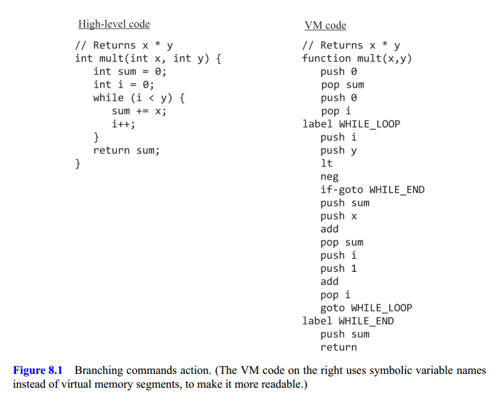
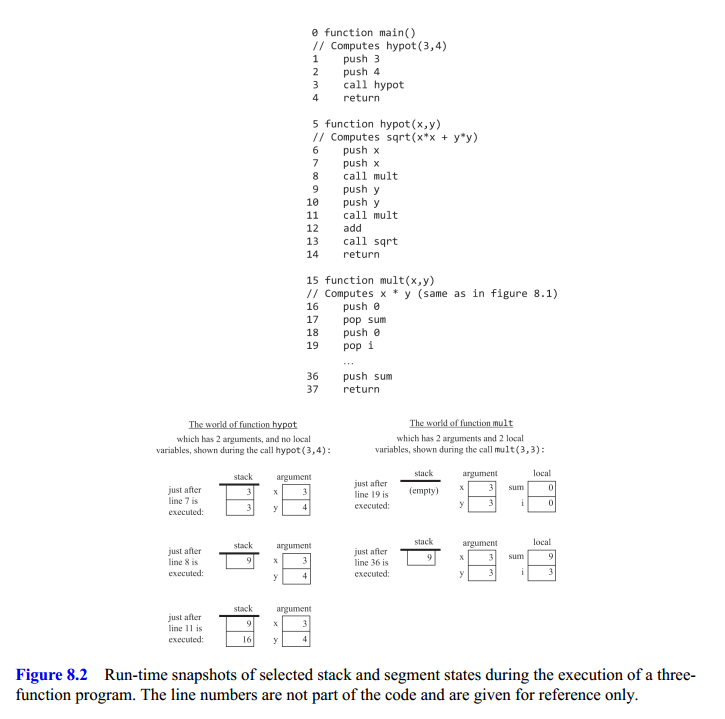
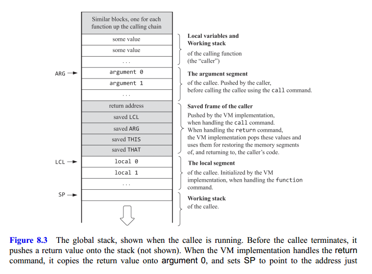
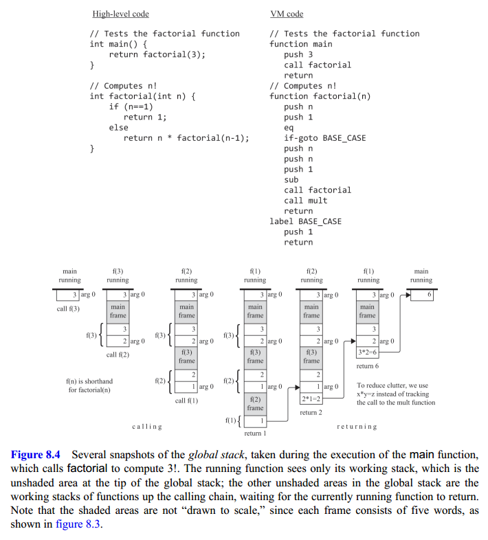
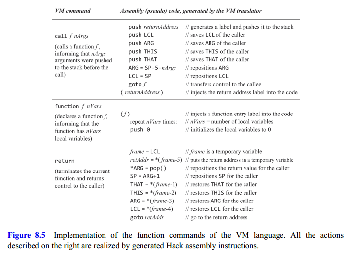

## High Level Magic

Whenever one function calls a function, someone must take care of the following:

1. Save the return address, which is the address within the caller's code to which execution must return after the callee completes its execution;
2. Save the memory resources of the caller
3. Allocate the memory resources required by the callee
4. Make the arguments passed by the caller available to the callee's code
5. Start executing the callee's code

When the callee terminates and returns a value, someone must take care of the following:

1. Make the callee's return value available to the caller's code
2. Recycle the memory resources used by the callee
3. Reinstate the previously saved memory resources of the caller
4. Retrieve the previously saved return address
5. Resume executing the caller's code, from the return address onward.

## Branching

The VM language supports two forms of branching:

**Unconditional branching** is effected using a `goto symbol` command, which means: jump to execute the command just after the label symbol command in the code.

**Conditional branching** is effected using the `if-goto symbol` command, whose semantics is:

- Pop the topmost value off the stack.
- If it's not false, jump to execute the command just after the label symbol command.
- Otherwise, execute the next command in the code.

Consider a function that receives two arguments, $x$ and $y$, and returns the product $xy$. This can be done by adding $x$ repetitively to a local variable, say $\text{sum}$, $y$ times, and then returning sum's value (see Figure 8.1.)



Notice how the Boolean condition `!(i < y)` implemented as:

```
push i
push y
lt
ng
```

Is pushed onto the stack just before the `if-goto WHILE_END` command.

## Functions

The only difference between applying a primitive operation and invoking a function is the keyword call preceding the latter. Both require the caller to set the stage by pushing arguments onto the stack, both operations are expected to consume their arguments, and both operations are expected to push return values onto the stack

Figure 8.2 shows a VM program that computes the function $\sqrt{x^2 + y^2}$.



The bottom part of figure 8.2 shows that during run-time, each function sees a private world, consisting of its own working stack and memory segments.

We use the term **calling chain** to refer, conceptually, to all the functions that are currently involved in the program's execution. Each function in the calling chain waits for the function that it called to return. Thus, the only function that is truly active in the calling chain is the last one.

Functions normally use `local` and `argument` variables. These variables are temporary: the memory segments that represent them must be allocated when the function starts executing and can be discarded when the function returns. This memory management task is complicated by the requirement that function calling is allowed to be **arbitrarily nested, as well as recursive**.

The property that makes this housekeeping task tractable is the linear nature of the call-and-return logic. Assume that the current function is `foo`. Suppose that at some point `foo` wants to call another function, `bar`, for its effect. At this point we have to put `foo`'s execution on hold until bar will terminate its execution. Now, putting `foo`'s working stack on hold is not a problem: because the stack grows only in one direction, the working stack of bar will never override previously pushed values.

But how can we save `foo`'s memory segments? If we wish to put these segments on hold, we can push their pointers onto the stack and pop them later. We use the term **frame** to refer, collectively, to the set of pointer values needed for saving and reinstating the function's state.

As shown in figure 8.3, when handling the call functionName command, the VM implementation pushes the caller’s frame onto the stack. At the end of this housekeeping, we are ready to jump to executing the callee's code. We use the function’s name to create a unique symbolic label that marks where the function starts. Thus we can generate assembly code that effects a `goto functionName`.



Returning from the callee to the caller when the former terminates can be done by:

1. Saving the return address just before control is transferred to executing the caller.
2. Retrieving the return address and jumping to it just after the callee returns.

But where shall we save the return address? We can have the VM translator plant a label right after the instruction `call foo` and push this label onto the stack. When we later encounter a `return` command in the VM code, we can pop the previously saved return address off the stack—let's call it `returnAddress`— and effect the operation `goto returnAddress `.

We now turn to give a step-by-step illustration of how the VM implementation supports the function call-andreturn action in Figure 8.4.



Each call operation is implemented by saving the frame of the caller on the stack and jumping to execute the callee.

Each return operation is implemented by

1. Using the most recently stored frame for getting the return address within the caller’s code and reinstating its memory segments.
2. Copying the topmost stack value (the return value) onto the stack location associated with `argument 0`
3. Jumping to execute the caller's code from the return address onward.

Figure 8.5. shows the steps taken when calling and returning from a function:



## VM Specification, Part II

### Branching Commands

`label LABEL`: Labels the current location in the function’s code. Only labeled locations can be jumped to.

`goto LABEL`: Effects an unconditional `goto` operation, causing execution to continue from the location marked by the label.

`if-goto LABEL`: Effects a conditional goto operation. The stack's topmost value is popped; if the value is not zero, execution continues from the location marked by the label; otherwise, execution continues from the next command in the program.

### Function Commands

`function functionName nVars`: Marks the beginning of a function named `functionName`.

`call functionName nArgs`: Calls the named function.

`return`: Transfers execution to the command just following the call command.
