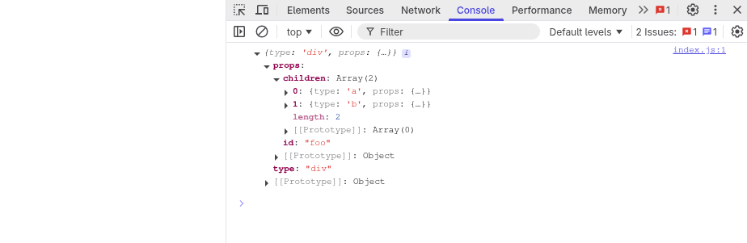

## Review

We’ll use this React app, just three lines of code. The first one defines a React element. The next one gets a node from the DOM. The last one renders the React element into the container.

```jsx
const element = <h1 title="foo">Hello</h1>;
const container = document.getElementById("root");
ReactDOM.render(element, container);
```

**Let’s remove all the React specific code and replace it with vanilla JavaScript.**

On the first line we have the element, defined with JSX. It isn’t even valid JavaScript, so in order to replace it with vanilla JS, first we need to replace it with valid JS.

JSX is transformed to JS by build tools like `Babel`. The transformation is usually simple: replace the code inside the tags with a call to `createElement`, passing the tag name, the props and the children as parameters.

`React.createElement` creates an object from its arguments. Besides some validations, that’s all it does. So we can safely replace the function call with its output.

```html
<html>
  <head>
    <script
      crossorigin
      src="https://unpkg.com/react@18/umd/react.production.min.js"
    ></script>
    <script
      crossorigin
      src="https://unpkg.com/react-dom@18/umd/react-dom.production.min.js"
    ></script>
  </head>
  <body>
    <script>
      const setup = () => {
        // Create an h1 element using Reacts API
        // This is equivalent to creating an element using JSX, and then having
        // whichever build tool compile it to javascript syntax, as follows:
        const element = React.createElement("h1", { title: "foo" }, "Hello");
        const root = document.getElementById("root");

        // Update the DOM
        ReactDOM.render(element, root);
      };
      window.onload = setup;
    </script>
    <div id="root"></div>
  </body>
</html>
```


And this is what an element is, an object with two properties: type and props (well, it has more, but we only care about these two).

- The `type` is a string that specifies the type of the DOM node we want to create, it’s the `tagName` you pass to `document.createElement` when you want to create an HTML element. It can also be a function.
- `props` is another object, it has all the keys and values from the `JSX` attributes. It also has a special property: `children`.
- `children` in this case is a string, namely `Hello`, but it’s usually an array with more elements. That’s why elements are also trees.

The other piece of React code we need to replace is the call to `ReactDOM.render`. `render` is where React changes the DOM, so let’s do the updates ourselves.

We can re-implement this same logic without using React.

```html
<html>
  <head>
    <title>Reakt Review</title>
  </head>
  <body>
    <script>
      const setup = () => {
        // Create an h1 element using only the DOMs API
        const element = {
          type: "h1",
          props: {
            title: "foo",
            children: "Hello",
          },
        };
        const root = document.getElementById("root");

        // We follow the same pattern
        // 1. Create the h1 element
        const h1Node = document.createElement(element.type);

        // 2. Add the props to the node
        h1Node["title"] = element.props.title;

        // 3. Add the children to the node, in this case a simple text element
        const textNode = document.createTextNode("");
        textNode["nodeValue"] = element.props.children;

        // 4. Update the DOM by adding each element to the DOM
        h1Node.appendChild(textNode);
        root.appendChild(h1Node);
      };
      window.onload = setup;
    </script>
    <div id="root"></div>
  </body>
</html>
```

First we create a node\* using the element type, in this case `h1`. Then we assign all the element props to that node. Here it’s just the title.

_\* To avoid confusion, I’ll use “element” to refer to React elements and “node” for DOM elements._

Then we create the nodes for the children. We only have a string as a child so we create a text node.

Using textNode instead of setting `innerText` will allow us to treat all elements in the same way later. Note also how we set the `nodeValue` like we did it with the `h1` title, it’s almost as if the string had props: `{nodeValue: "hello"}`.

Finally, we append the `textNode` to the `h1` and the `h1` to the `root`.


## The `createElement` Function

Let’s start again with another app. This time we’ll replace React code with our own version of React. We’ll start by writing our own `createElement`.

As we saw in the previous step, an element is an object with `type` and `props`. The only thing that our function needs to do is create that object.

```typescript
import type { Element } from "@reakt/types";

export const createElement = <T>(
  type: Element<T>["type"],
  props: Element<T>["props"],
  // Children is always an array
  ...children: Element[]
) => {
  return {
    type,
    props: {
      ...props,
      children,
    },
  };
};
```

We use the spread operator for the `props` and the rest parameter syntax for the `children`, this way the children prop will always be an array.

For example, `createElement("div")` returns:

```json
{
  "type": "div",
  "props": { "children": [] }
}
```

The children array could also contain primitive values like strings or numbers. So we’ll wrap everything that isn’t an object inside its own element and create a special type for them: `TEXT_ELEMENT`.

_React doesn’t wrap primitive values or create empty arrays when there aren’t children, but we do it because it will simplify our code_

```typescript
const createTextElement = (text: string) => {
  return {
    type: "TEXT_ELEMENT",
    props: {
      nodeValue: text,
      children: [],
    },
  };
};

export const createElement = <T>(
  type: Element<T>["type"],
  props: Element<T>["props"],
  // Children is always an array
  ...children: Element[]
) => {
  return {
    type,
    props: {
      ...props,
      children: children.map((child) =>
        typeof child === "object" ? child : createTextElement(child),
      ),
    },
  };
};
```

Now, if we were to create a typical `React` component within our example app as follows:

```tsx
// index.js
// biome-ignore lint/correctness/noUnusedImports: Very much important so we can call Reakt.createElement when this is bundled
import * as Reakt from "reakt";

const Element = (
  <div id="foo">
    <a href="https://github.com/albamr09">bar</a>
    <b />
  </div>
);

// This outputs the result from calling Reakt.createElement!!
console.log(Element);
```

```html
// index.html
<html>
  <head>
    <title>Create Element</title>
    <script src="index.js" type="module"></script>
  </head>
  <body>
    <div id="root"></div>
  </body>
</html>
```

We would see the following when we open `index.html`


