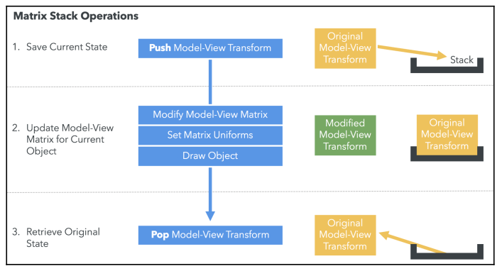
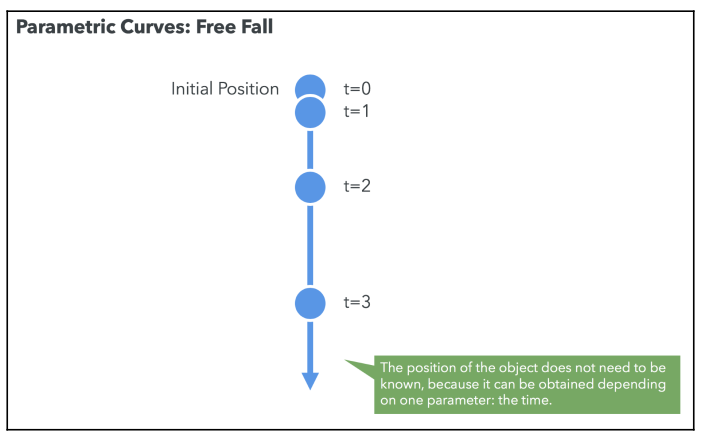
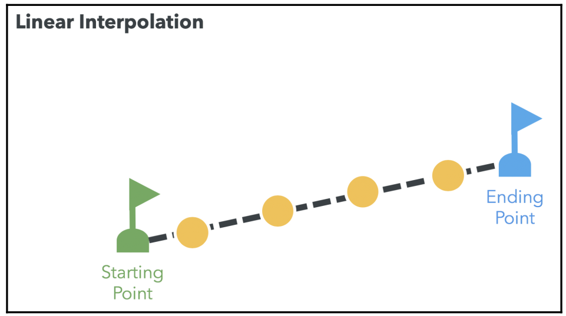
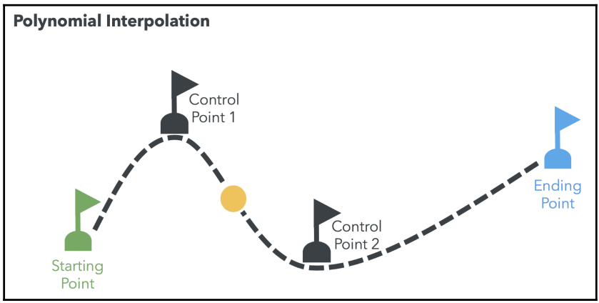
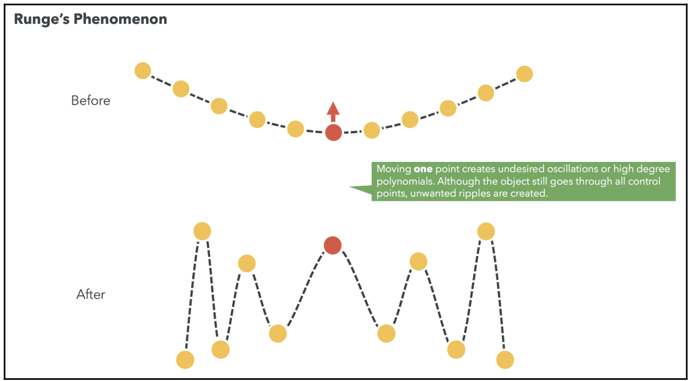
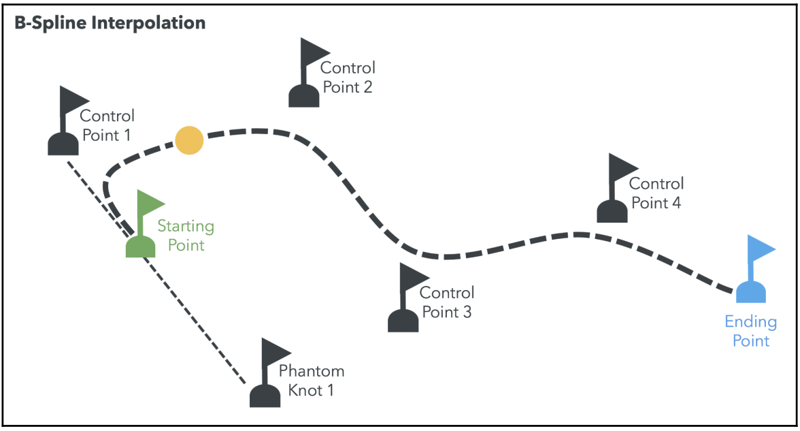

## WebGL Matrix Naming Conventions

Before we go any further, let's take a moment to quickly summarize some of the conventions around matrix-naming:

- **World Matrix**: Sometimes referred to as the Model matrix, this is a matrix that takes the vertices of a model and moves them to world space.
- **Camera Matri**x: This matrix positions the camera in the world. You can also think of it as the World matrix for the camera.
- **View Matrix**: This matrix moves everything else in the world in front of the camera. As we've seen, this is the inverse of the Camera matrix.
- **Projection Matrix**: This is the matrix that converts a frustum of space into clip space. You can also think of it as the matrix returned by your matrix math library's perspective or orthographic function.
- **Local Matrix**: The matrix is used in scene graphs, where the matrix, at any particular node on the graph, is used before multiplying with any other nodes.

## Scene graph

This is a data structure, commonly used by vector-based graphics-editing applications and modern computer games, that arranges the logical and often spatial representation of a graphical scene. A scene graph is a collection of nodes in a graph or tree structure.

## Matrix Stacks

A **matrix stack** provides a way to apply local transforms to individual objects in our scene while preserving global transforms.

The matrix stack works at each rendering cycle, it requires calculating the scene matrices to react to camera movements. The update is done in the following steps:

1. Global Transform: Update the model-view matrix for each object and push it to the stack. This allows us to recover the original matrix once we’ve applied local transforms.
2. Local Transform: Update Model-View matrix for each object in the scene by multiplying the original Model-View matrix by a matrix that represents the rotation, translation, and/or scaling of each object in the scene.
3. Recover the original matrix for the stack.
4. Repeat the process for each object on the scene.

The following diagram shows this procedure for one object:

## Animating a 3D scene

Animating a scene is nothing more than applying the appropriate local transformations to the objects in the scene. For instance, if we want to move a cone and a sphere, each one of them will have a corresponding local transformation that will describe its location, orientation, and scale.

We should address when to apply these transforms. If we calculate the position to apply to the cone and sphere in our example every time we call the render function, this would imply that the animation rate would depend on the speed of our rendering cycle. A slow rendering cycle would produce choppy animations and too fast a rendering cycle would create the illusion of objects jumping from one side to the other without smooth transitions.

### The requestAnimationFrame Function

One of the advantages of leveraging this function is that it is designed to call the rendering function (whatever function we indicate) only when the browser/tab window is in focus.

## Parametric Curves

There are many situations where we don't know the exact position of an object at a given time, but we do know an equation that describes its movement. These equations are known as **parametric curves**. The following diagram shows the parametric equation that describes the free-fall motion:

$$
\begin{aligned}
h = H_0 + V_0t - \frac{1}{2}gt^2
\end{aligned}
$$

where $g$ is the gravity at $9.8 m/s$, $V_0$ is the initial velocity, $H_0$ is the initial position, $t$ is the time and $h$ is the position at $t$.

## Optimizing Batch Performance

WebGL 2 adds some interesting features, such as **geometry-instancing**. This feature allows us to render the same instance of a single mesh with differing shader attributes using instancing and only one render call. Though instancing is limited, as it’s based on the same mesh only, it’s still a great way to improve performance if you have to draw the same meshes multiple times, especially if combined with shaders.

## Interpolation

Interpolation greatly simplifies a 3D objects’ animation. Unlike parametric curves, it is not necessary to define the position of the object as a function of time. When interpolation is used, we only need to define control points or knots. The set of control points describes the path that a particular animate object will follow.

### Linear Interpolation

This method requires that we define the starting and ending points of the location of our object, along with the number of interpolating steps. The object will move on the line determined by the starting and ending point:

### Polynomial Interpolation

This method allows us to determine as many control points as we want. The object will move from the starting point to the ending point and will pass through each one of the control points in between

While using polynomials, an increasing number of control points can produce undesired oscillations on the object's path described by this technique. This is known as **Runge's phenomenon**.

### B-Splines

This method is similar to polynomial interpolation with the difference that the control points are outside of the object's path. In other words, the object does not pass through the control points as it moves. B-splines also respond better to Runge's phenomenon:

