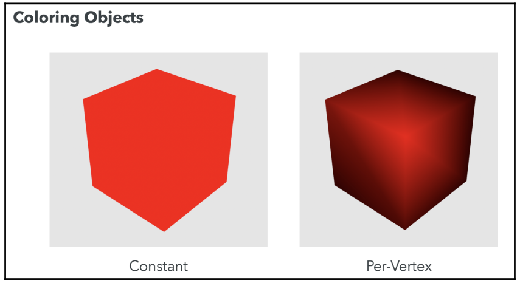
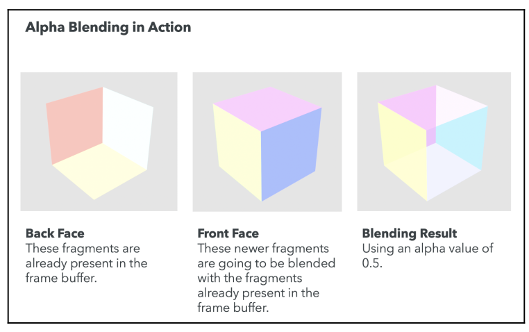

## Using Colors in WeblGL

WebGL supplies a fourth attribute to the RGB model. This attribute is called the alpha channel. The extended model then is known as the RGBA model, where A stands for alpha. The alpha channel contains a value between the range of $0.0$ to $1.0$.

A completely opaque color will have an alpha value of $1.0$, whereas a completely transparent color will have an alpha value of $0.0$. This is the general case, but as we will see, we need to take other factors into account when we obtain translucent colors.

## Using Colors in Objects

### Constant Coloring

To obtain a constant color, we store the desired color in a uniform that is passed to the fragment shader. This uniform is usually called the object's diffuse material property. We can also combine object normals and light-source information to obtain a Lambert coefficient. We can use the Lambert coefficient to proportionally change the reflecting color depending on the angle on which the light hits the object.

### Per-Vertex Coloring

To implement per-vertex coloring, we need to define an attribute that stores the color for the vertex in the vertex shader:

```
in vec4 aVertexColor;
```

The next step is to assign the aVertexColor attribute to a varying so that it can be passed to the fragment shader. Remember that varyings are automatically interpolated. Therefore, each fragment will have a color that is the weighted result of its contributing vertices.



If we want our color map to be sensitive to lighting conditions, we can multiply each vertex color by the diffuse component of the light. The result is then assigned to the varying that will transfer the result to the fragment shader.

### Per-Fragment Coloring

We can also assign a random color to each pixel of the object we are rendering.

## Use of Color in Lights

### Scalability Problem

Given the desire to use more than one light in our scene, we need to define and map the number of appropriate uniforms of the lighting model of choice. If we have four properties per light (ambient, diffuse, specular, and location), we need to define four uniforms for each light. If we want to have three lights, we need to write, use, and map twelve uniforms! We need to resolve this complexity before it gets out of hand.

### How Many Uniforms Can We Use

To find out the limit for your WebGL implementation, you can query WebGL using the `gl.getParameter` function with these constants:

```
gl.MAX_VERTEX_UNIFORM_VECTORS
gl.MAX_FRAGMENT_UNIFORM_VECTORS
```

### Simplifying the Problem

In order to simplify the problem, we can assume that the ambient component is the same for all of the lights. This will reduce the number of uniforms—one fewer uniform for each light.

### Using Uniform Arrays to Handle Multiple Lights

As we've seen, handling light properties with individual uniforms makes the code verbose and difficult to maintain. Fortunately, ESSL provides several mechanisms we can use to solve the problem of handling multiple lights. One of them is **uniform arrays**.

This technique allows us to handle multiple lights by introducing enumerable arrays of vectors in the shaders. This allows us to calculate light contributions by iterating through the light arrays in the shaders.

```c
uniform vec3 uPositionLight[3];
```

It’s important to note that ESSL does not support dynamic initialization of uniform arrays.
We could try something such as this, but will not work:

```c
uniform int numLights;
uniform vec3 uPositionLight[numLights];
```

However, this construct is valid:

```c
const int numLights = 3;
uniform vec3 uPositionLight[numLights];
```

To map these variables on javascript:

```javascript
const lightPosition1 = [0, 7, 3];
const lightPosition2 = [2.5, 3, 3];
const lightPosition3 = [-2.5, 3, 3];

const location = gl.getUniformLocation(program, "uPositionLight");

// The values are concatenated on a single flat array
gl.uniform3fv(location, [
  ...lightPosition1,
  ...lightPosition2,
  ...lightPosition3,
]);
```

### Directional Point Lights

In this section, we will combine directional and positional lights creating a **directional point light**, commonly referred to as a **spot light**.


The trick to creating these lights is to subtract the light-direction vector from the normal for each vertex. The resulting vector will create a different Lambert coefficient that will reflect into the cone generated by the light source. On the following excerpts we show a practical example of how a sportlight could be implemented. On the first place we have the vertex shader whose responsability it is to compute:

- The rays, `vRay`, for each light source. This is the vector between the position of the light and the position of the vertex (after is has been transformed by the model view).
- The "modified" normal, `vTransformedNormals`. This stores the normals after the ligth direction vector has been substracted from it.

We will use both of these vectors to compute the lambert term on the fragment shader.

```c
#version 300 es

const int numLights = 3;

uniform mat4 uModelViewMatrix;
uniform mat4 uNormalMatrix;
uniform mat4 uProjectionMatrix;

uniform vec3 uLightPositions[numLights];
uniform vec3 uLightDirections[numLights];

in vec3 aPos;
in vec3 aNormal;

out vec3 vRay[numLights];
out vec3 vTransformedNormals[numLights];

void main(void) {
  vec4 vertex = uModelViewMatrix * vec4(aPos, 1.0);


  vec3 normal = vec3(uNormalMatrix * vec4(aNormal, 1.0));

  // Iterate over each light
  for(int i = 0; i < numLights; i++) {
    // Define each ray as the vector berween the light and the vertex
    vec4 lightPosition = uModelViewMatrix * vec4(uLightPositions[i], 1.0);
    vRay[i] = vertex.xyz - lightPosition.xyz;
    // Transform the direction of the light
    vec3 directionLight = vec3(uNormalMatrix * vec4(uLightDirections[i], 1.0));
    // Transform the normal by substracting the direction of each light
    vTransformedNormals[i] = normal - directionLight;
  }

  gl_Position = uProjectionMatrix * vertex;
}
```

Here we have the fragment shader where we compute the final color. This color is made up from two main sources:

- Ambient light
- Diffuse light: these light is computed taking into account a number of lights given `numLights`. For each one we incrementally modify the final diffuse light, `Id`.

Note that for each of these diffuse lights we apply the [Lambertian Reflection Model](../03#lambertian-reflection-model), where we compute the final color as the product of the color of the light, the color of the material and finally the cosine of the angle between the light source (`vRay`) and the normal of the surface (that is the `lamberTerm`). In this case, instead of the normal of the surface we use our transformed normal, `vTransformedNormals`.

```c
#version 300 es

precision mediump float;

const int numLights = 3;

uniform vec4 uLightColors[numLights];
uniform vec4 uMaterialAmbient;
uniform vec4 uMaterialDiffuse;

uniform vec4 uLightAmbient;
uniform float uLightCutOff;

in vec3 vRay[numLights];
in vec3 vTransformedNormals[numLights];

out vec4 fragColor;

void main(void) {

  vec4 Ia = uLightAmbient * uMaterialAmbient;
  vec4 Id = vec4(0.0);

  // Iterate over each light
  for(int i = 0; i < numLights; i++) {
    // Define the normalized transformed normal per each light, as we
    // have modified the surface normal with the light's direction
    vec3 N = normalize(vTransformedNormals[i]);
    vec3 L = normalize(vRay[i]);
    // Cosine of angle between light and surface
    float lambertTerm = dot(N, -L);
    // If cosine is bigger than cutoff (the angle is less than an implicit
    // threhsold imposed but that cutoff) then we update the
    // sum of the diffuse color
    if (lambertTerm > uLightCutOff) {
      Id += uLightColors[i] ** uMaterialDiffuse ** lambertTerm;
    }
  }

  fragColor = vec4(vec3(Ia + Id), 1.0);
}
```

One other thing to note is the `uLightCutOff`. This variable allows us to create a spotlight, it basically defines the minimum value of the cosine of the angle between the light source and the normal. This cosine is maximized when the light is perpendicular to the surface, and minimized when the light is perpendicular. So with the `uLightCutOff` we are kind of saying what is the maximum angle we allow between the light and the surface.

#### Attenuation Factor

However we can use this threshold as the variable to define an **attenuation**. For example by computing the final color as follows:

```
if (lambertTerm > uLightCutOff) {
  Id += uLightColors[i] ** uMaterialDiffuse ** pow(lamberTerm, 10.0 * uLightCutOff);
}
```

So now the effect of lamberTerm is not as straight forward, and it does not increasig "linearly" but by the means of a power function:

$$
\begin{aligned}
f(x) = \text{lambert term}^{10 \text{cutoff}}
\end{aligned}
$$

This is illustrated of the following figure:


## Use of Color in the Scene

### Transparency

The first approach to render transparent objects is to use **polygon stippling**. This technique consists of discarding some fragments so that you can see through the object. OpenGL supports polygon stippling through the glPolygonStipple function. This function is not available in WebGL. You could try to replicate this functionality by dropping some fragments in the fragment shader using the ESSL discard command. More commonly, we can use the alpha channel information to obtain translucent objects. However, modifying the alpha values does not produce transparency automatically.

Creating transparency corresponds to altering the fragments that we’ve already written to the framebuffer. On a scene where there is one translucent object in front of an opaque object (from our camera view) we need to be able to see the opaque object through the translucent object. Therefore, the fragments that overlap between the far and near objects need to be combined somehow to create the transparency effect.

To properly render transparent surfaces, we need to learn about two important WebGL concepts: **depth testing** and **alpha blending**.

### Updated Rendering Pipeline

Depth testing and alpha blending are two optional stages for fragments once they've been processed by the fragment shader.

If the depth test is not activated, all the fragments are automatically available for alpha blending. If the depth test is enabled, those fragments that fail the test will automatically be discarded by the pipeline and will no longer be available for any other operation. This means that discarded fragments will not be rendered.

The following diagram shows the order in which depth testing and alpha blending are performed:


## Depth Testing

Each fragment that has been processed by the fragment shader carries an associated depth value. Though fragments are two-dimensional since they're rendered on the screen, the depth value keeps the information of how far the fragment is from the camera (screen).

Depth values are stored in a special WebGL buffer named **depth buffer** or **z-buffer**. The $z$ comes from the fact that $x$ and $y$ values correspond to the screen coordinates of the fragment, while the $z$ value measures distance perpendicular to the screen.

After the fragment has been calculated by the fragment shader, it becomes available for depth testing. This only occurs if the depth test is enabled.

```javascript
gl.enable(gl.DEPTH_TEST);
```

The depth test takes the depth value of a fragment into consideration and compares it to the depth value for the same fragment coordinates already stored in the depth buffer. The depth test determines whether that fragment is accepted for further processing in the rendering pipeline.

In normal circumstances, when the depth test is enabled, only those fragments with a lower depth value than the corresponding fragments present in the depth buffer will be accepted.

Depth testing is a commutative operation with respect to the rendering order. This means that no matter which object gets rendered first, as long as depth testing is enabled, we will always have a consistent scene.

### Depth Function

In some applications, we may be interested in changing the default behavior of depth testing, which discards fragments with a higher depth value than those fragments in the depth buffer. For that purpose, WebGL provides the `gl.depthFunc(function)` method.

This method has only one parameter, the `function` to use:

| Parameter     | Description                                                                                                          |
| ------------- | -------------------------------------------------------------------------------------------------------------------- |
| `gl.NEVER`    | The depth test always fails.                                                                                         |
| `gl.LESS`     | Only fragments with a depth lower than current fragments on the depth buffer will pass the test                      |
| `gl.LEQUAL`   | Fragments with a depth less than or equal to corresponding current fragments in the depth buffer will pass the test. |
| `gl.EQUAL`    | Only fragments with the same depth as current fragments on the depth buffer will pass the test                       |
| `gl.NOTEQUAL` | Only fragments that do not have the same depth value as fragments on the depth buffer will pass the test.            |
| `gl.GEQUAL`   | Fragments with greater or equal depth value will pass the test.                                                      |
| `gl.GREATER`  | Only fragments with a greater depth value will pass the test.                                                        |
| `gl.ALWAYS`   | The depth test always passes.                                                                                        |

The depth test is disabled by default in WebGL. When enabled, if no depth function is set, the `gl.LESS` function is selected by default.

## Alpha Blending

Alpha blending is enabled using the following line of code:

```javascript
gl.enable(gl.BLEND);
```

For each available fragment, the alpha blending operation reads the color from the framebuffer by the appropriate fragment coordinates and creates a new color based on a linear interpolation between the previously calculated color in the fragment shader and the color from the framebuffer.

### The Blending Function

With blending enabled, the next step is to define a blending function. This function will determine how fragment colors from the object (source) are combined with the fragment colors present in the framebuffer (destination).

We combine source and destination colors as follows:

```javascript
color = S ** sW + D ** dW;
```

Where:

- `S`: source color (`vec4`)
- `D`: destination color (`vec4`)
- `sW`: source scaling factor
- `dW`: destination scaling factor
- `S.rgb`: RGB components of the source color
- `S.a`: Alpha component of the source color
- `D.rgb`: RGB components of the destination color
- `D.a`: Alpha component of the destination color

It's important to note that the rendering order will determine the source and the destination fragments.

If a sphere is rendered first, it will then become the destination of the blending operation because the sphere fragments are stored in the framebuffer at the time that the cone is rendered. In other words, alpha blending is a non-commutative operation with respect to rendering order:


### Separate Blending Functions

It is also possible to determine how the RGB channels are going to be combined independently from the alpha channels. For that, we use the `gl.blendFuncSeparate` function.

We define two independent functions this way:

```
color = S.rgb ** sW.rgb + D.rgb ** dW.rgb;
alpha = S.a ** sW.a + D.a ** dW.a;
```

More precisely:

- `S.rgb`: RGB components of the source color
- `sW.rgb`: is the source scaling factor (only RGB)
- `S.a`: Alpha component of the source color
- `sW.a`: is the source scaling factor for the source alpha value
- `D.rgb`: RGB components of the destination color
- `sW.rgb`: is the destination scaling factor (only RGB)
- `D.a`: Alpha component of the destination color
- `sD.a`: is the source scaling factor for the destination alpha value

Then, we could have something such as the following:

```
color = S.rgb ** S.a + D.rgb ** (1.0 - S.a);
alpha = S.a ** 1.0 + D.a ** 0.0;
```

This would be translated into code as follows:

```
gl.blendFuncSeparate(gl.SRC_ALPHA, gl.ONE_MINUS_SRC_ALPHA, gl.ONE, gl.ZERO);
```

### The Blend Equation

We could have a case where we do not want to interpolate the source and destination fragment colors with scale or add operations. For example, we may want to subtract one from the other. In this case, WebGL provides the `gl.blendEquation` function.

This function receives one parameter that determines the operation on the scaled source and destination fragment colors. For example, `gl.blendEquation(gl.FUNC_ADD)` is calculated as such:

```
color = S ** sW + D ** dW;
```

And, `gl.blendEquation(gl.FUNC_SUBTRACT)` corresponds to the following:

```
color = S ** sW - D ** dW;
```

There is a third option, `gl.blendEquation(gl.FUNC_REVERSE_SUBTRACT)`, that corresponds to the following:

```
color = D** dw - S ** sW;
```

As expected, you can define the blending equation separately for the RGB channels and for the alpha channel. For that, we use the `gl.blendEquationSeparate` function.

### WebGL Alpha-Blending API

| WebGL function                                     | Description                                                                                                |
| -------------------------------------------------- | ---------------------------------------------------------------------------------------------------------- |
| `gl.enable/disable(gl.BLEND)`                      | Enable/disable blending                                                                                    |
| `gl.blendFunc(sW, dW)`                             | Specify pixel arithmetic                                                                                   |
| `gl.blendFuncSeparate(sW_rgb, dW_rgb, sW_a, dW_a)` | Specify pixel arithmetic for RGB and alpha components separately                                           |
| `gl.blendEquation(mode)`                           | Specify the equation used for both the RGB blend equation and the alpha blend equation                     |
| `gl.blendEquationSeparate(modeRGB, modeAlpha)`     | Set the RGB blend equation and the alpha blend equation separately.                                        |
| `gl.blendColor(red, green, blue, alpha)`           | Set the blend color.                                                                                       |
| `gl.getParameter(name)`                            | Just like with other WebGL variables, it is possible to query blending parameters using `gl.getParameter`. |

### The Blend Color

WebGL provides the `gl.CONSTANT_COLOR` and `gl.ONE_MINUS_CONSTANT_COLOR` scaling factors. These scaling factors can be used with `gl.blendFunc` and `gl.blendFuncSeparate`. However, we need to first establish the blend color. We do so by invoking `gl.blendColor`.

### Alpha Blending Modes

Depending on the parameter selection for sW and dW, we can create different blending modes.

#### Additive Blending

Additive blending simply adds the colors of the source and destination fragments, creating a lighter image. We obtain additive blending by writing the following:

```
gl.blendFunc(gl.ONE, gl.ONE);
```

This assigns the weights for source and destination fragments `sW` and `dW` to $1$. The color output will be as follows:

```
color = S ** 1.0 + D ** 1.0;
color = S + D;
```

#### Substractive Blending

Similarly, we can obtain subtractive blending by writing the following:

```
gl.blendEquation(gl.FUNC_SUBTRACT);
gl.blendFunc(gl.ONE, gl.ONE);
```

This will change the blending equation to the following:

```
color = S ** 1.0 - D ** 1.0;
color = S - D;
```

#### Multiplicative Blending

We obtain multiplicative blending by writing the following:

```
gl.blendFunc(gl.DST_COLOR, gl.ZERO);
```

This will be reflected in the blending equation as the following:

```
color = S ** D + D ** 0.0;
color = S * D;
```

The result will always be a darker blending

#### Interpolative Blending

If we set `sW` to `S.a` and `dW` to `1 - S.a`, then we get the following:

```
color = S ** S.a + D **(1 - S.a);
```

This will create a linear interpolation between the source and destination color using the
source alpha color, `S.a`, as the scaling factor. In code, this is translated as the following:

```
gl.blendFunc(gl.SRC_ALPHA, gl.ONE_MINUS_SRC_ALPHA);
```

Interpolative blending allows us to create a transparency effect as long as the destination fragments have passed the depth test. As expected, this requires that the objects be rendered from back to front.

## Creating Transparent Objects

We've learned that in order to create transparency, we need to:

- Enable alpha blending and select the interpolative blending function
- Render the faces of objects back to front

How do we create transparent objects when there is nothing to blend them against? In other words, if there’s only one object, how can we make it transparent? One solution is to use **face-culling**. Face-culling allows us to only render the back or front face of an object.

Similar to other options in the pipeline, culling is disabled by default. We enable it by calling the following:

```
gl.enable(gl.FACE_CULLING);
```

To render only the back faces of an object, we call `gl.cullFace(gl.FRONT)` before we call `drawArrays` or `drawElements`. Similarly, to render only the front face, we use `gl.cullFace(gl.BACK)` before the draw call.

The following diagram summarizes the steps needed to create a transparent object with alpha blending and face-culling:


