## Creating and Uploading a Texture

Unlike traditional native OpenGL applications, browsers load textures "upside down". As a result, many WebGL applications set textures to be loaded with the $Y$ coordinate flipped by:

```javascript
gl.pixelStorei(gl.UNPACK_FLIP_Y_WEBGL, true);
```

Creating textures follows the same pattern as using buffers:

- Create a new texture

```javascript
const texture = gl.createTexture();
```

- Bind it to make it the current texture. The first parameter indicates the type of texture we're binding.

```javascript
gl.bindTexture(gl.TEXTURE_2D, texture);
```

- Pass the texture contents

```javascript
// From DOM
const image = document.getElementById("texture-image");
gl.texImage2D(gl.TEXTURE_2D, 0, gl.RGBA, gl.RGBA, gl.UNSIGNED_BYTE, image);

// From Image
const texture = gl.createTexture();
const image = new Image();
image.src = "texture-file.png";

image.onload = () => {
  gl.bindTexture(gl.TEXTURE_2D, texture);
  gl.texImage2D(gl.TEXTURE_2D, 0, gl.RGBA, gl.RGBA, gl.UNSIGNED_BYTE, image);
  gl.texParameteri(gl.TEXTURE_2D, gl.TEXTURE_MAG_FILTER, gl.NEAREST);
  gl.texParameteri(gl.TEXTURE_2D, gl.TEXTURE_MIN_FILTER, gl.NEAREST);
  gl.bindTexture(gl.TEXTURE_2D, null);
};
```

- Set the filter mode or other texture parameters. We'll see what filters are later on, the simplest ones are the following:

```javascript
gl.texParameteri(gl.TEXTURE_2D, gl.TEXTURE_MAG_FILTER, gl.NEAREST);
gl.texParameteri(gl.TEXTURE_2D, gl.TEXTURE_MIN_FILTER, gl.NEAREST);
```

- Unbind the texture

```javascript
gl.bindTexture(gl.TEXTURE_2D, null);
```

When we no longer need the texture we can remove it and free up the associated memory as follows:

```javascript
gl.deleteTexture(texture);
```

## Using Texture Coordinates

Before we apply our texture to our surface, we need to figure out which part of the texture maps onto which part of the surface. We do this through another vertex attribute known as texture coordinates.

WebGL forces all of the texture coordinates into a $0$ to $1$ range, where $(0, 0)$ represents the top left-hand side corner of the texture and $(1, 1)$ represents the bottom right-hand side corner.


This comes in handy because if the texture coordinates were defined in terms of pixels, then the mapping would be dependent on the resolution of the image.

The process of laying out textures and generating texture coordinates is called **unwrapping**.

### Polygon Mesh

A **polygon mesh** is a collection of vertices, edges, and faces that defines the shape of a polyhedral object in 3D computer graphics and solid

### Texture Coordinates

Texture coordinates also have a common symbolic representation. Unfortunately, it's not consistent across all 3D software applications. OpenGL and WebGL refer to these coordinates as $s$ and $t$ for the $x$ and $y$ components, respectively. However, DirectX and many popular modeling packages refer to them as $u$ and $v$ (so they are usually referred to as "UVs").

## Using Textures in a Shader

We'll want to include a two-element vector attribute in our vertex shader that will map to our texture coordinates:

```c
in vec2 aVertexTextureCoords;
```

We need to add a new uniform to the fragment shader that uses a type we haven't seen before: sampler2D. The sampler2D uniform is what allows us to access the texture data in the shader:

```c
uniform sampler2D uSampler;
```

The following code shows how to associate a texture with a specific sampler uniform:

```javascript
gl.activeTexture(gl.TEXTURE0);
gl.bindTexture(gl.TEXTURE_2D, texture);
gl.uniform1i(program.uSampler, 0);
```

First off, we are changing the active texture with `gl.activeTexture`. Next, we bind the texture we wish to use, which associates it with the currently active texture, `TEXTURE0`. Finally, we tell the sampler uniform which texture it should be associated with. Here, we give it $0$ to indicate that the sampler should use `TEXTURE0`.

To use our texture in the fragment shader by return the value of the texture as the fragment color:

```c
texture(uSampler, vTextureCoord);
```

`texture` takes in the sampler uniform we wish to query and the coordinates to lookup, and returns the color of the texture image at those coordinates as `vec4`. If the image has no alpha channel, `vec4` will still be returned with the alpha component always set to $1$.

## Texture Filter Modes

If you were to zoom in on a texture you would see that it begins to alias, where we can see that jagged edges develop around the WebGL logo.

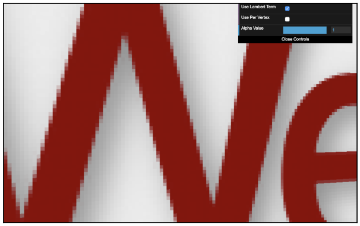

Why do we see these artifacts in the first place? In the fragment shader the texture coordinates provided by the vertex shader are interpolated (as they are `varying` variables). In a perfect situation, the texture would display at a 1:1 ratio on screen, meaning each pixel of the texture
would take up exactly one pixel on screen. In this scenario, there would be no artifacts:

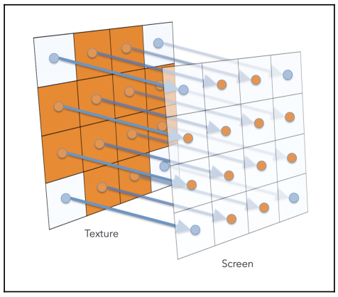

The reality of 3D applications, however, is that textures are almost never displayed at their native resolution. We refer to these scenarios as **magnification** and **minification**.

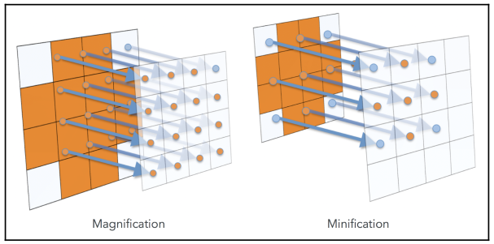

When a texture is magnified or minified, there can be some ambiguity about what color the texture sampler should return, for example:

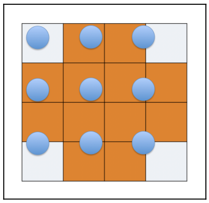

Texture filtering allows us to control how textures are sampled and achieve the look we want. We change the currently bound texture's filter mode by:

```javascript
gl.texParameteri(gl.TEXTURE_2D, gl.TEXTURE_MAG_FILTER, gl.NEAREST);
gl.texParameteri(gl.TEXTURE_2D, gl.TEXTURE_MIN_FILTER, gl.NEAREST);
```

Note that different textures can have different filters.

### Nearest

Textures using the **NEAREST** filter always return the color of the texel whose center is nearest to the sample point. With this mode, textures will look pixilated up close:

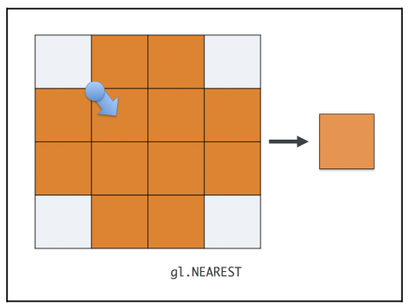

### Linear

Returns the weighted average of the four pixels whose centers are nearest to the sample point. Also known as **bilinear filtering**.

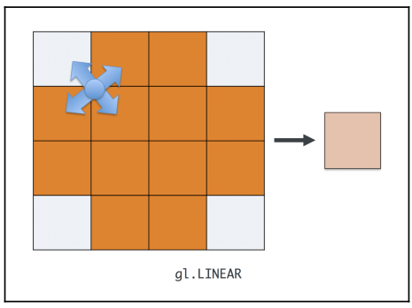

The graphics hardware has to read four times as many pixels per fragment, so it is slower.

### Mipmapping

A problem arises when sampling minified textures. In cases where we use **LINEAR** filtering and the sample points are so far apart, we can completely miss some details of the texture.

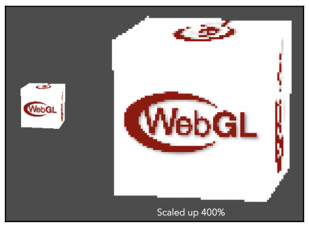

To avoid this, graphics cards can utilize a **mipmap chain**. Mipmaps are scaled-down copies of a texture, with each copy being exactly half the size of the previous one.


With these chains, graphics hardware can choose the copy of the texture that most closely matches the size of the texture on screen.

- **NEAREST_MIPMAP_NEAREST**: select the mipmap that most closely matches the size of the texture on screen and samples from it using the NEAREST algorithm.
- **LINEAR_MIPMAP_NEAREST**: selects the mipmap that most closely matches the size of the texture on screen and samples from it using the LINEAR algorithm.
- **NEAREST_MIPMAP_LINEAR**: selects two mipmaps that most closely match the size of the texture on screen and samples from both of them by using the NEAREST algorithm. The color returned is a weighted average of those two samples.
- **LINEAR_MIPMAP_LINEAR**: selects two mipmaps that most closely match the size of the texture on screen and samples from both of them using the LINEAR algorithm. The color returned is a weighted average of those two samples (also known as **trilinear filtering**).

#### Generating Mipmaps

We have to create mipamps for every texture:

```javascript
gl.generateMipmap(gl.TEXTURE_2D);
```

This insttruction has to be called after the texture has been populated with the image.

To provide the mipmaps manually we use:

```javascript
gl.texImage2D(
  gl.TEXTURE_2D,
  1,
  gl.RGBA,
  gl.RGBA,
  gl.UNSIGNED_BYTE,
  mipmapImage
);
```

By passing a number other than 0 as the second parameter we are creating the first mipmap level.

In order to use mipmaps with a texture in WebGL 1, mipmaps need to satisfy some dimension restrictions. Namely, the texture width and height must both be Powers of Two (POT). This does not apply for WebGL 2.

## Texture Wrapping

Texture wrapping describes the behavior of the sampler when the texture coordinates fall outside the range of $0$ and $1$. The wrapping mode can be set independently for both the S and T coordinates:

```javascript
gl.texParameteri(gl.TEXTURE_2D, gl.TEXTURE_WRAP_S, gl.CLAMP_TO_EDGE);
gl.texParameteri(gl.TEXTURE_2D, gl.TEXTURE_WRAP_T, gl.CLAMP_TO_EDGE);
```

### CLAMP_TO_EDGE

This wrap mode rounds any texture coordinates greater than $1$ down to $1$; any coordinates lower than $0$ are rounded up to $0$, clamping the values to the $(0, 1)$ range. Visually, this has the effect of repeating the texture's border pixels indefinitely once the coordinates go out of the $(0, 1)$ range.


### REPEAT

This is the default wrap mode. It ignores the integer part of the texture coordinate. This creates the visual effect of the texture repeating as you move outside of the $(0, 1)$ range.

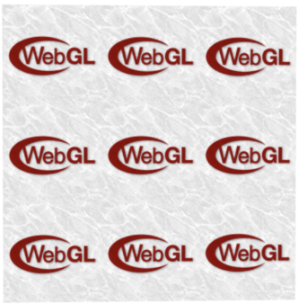

### MIRRORED_REPEAT

If the coordinate's integer portion is even, the texture coordinates will be the same as they were with REPEAT. If the integer portion of the coordinate is odd, the resulting coordinate is $1$ minus the fractional portion of the coordinate. This results in a texture that "flip-flops" as it repeats.

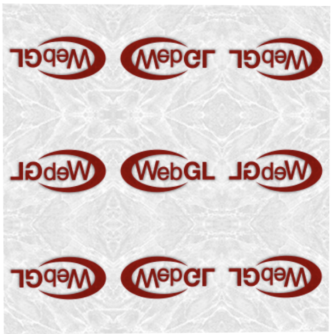

## Using Multiple Textures

There are times when we may want to have multiple textures contribute to a fragment. In such cases, we can use WebGL's ability to access multiple textures in a single draw call, commonly referred to as **multi-texturing**.

When talking about exposing a texture to a shader as a sampler uniform, we used the following code:

```javascript
gl.activeTexture(gl.TEXTURE0);
gl.bindTexture(gl.TEXTURE_2D, texture);
```

We use it to tell the WebGL state machine which texture we're going to use in subsequent texture functions. If we want to attach a different texture to the second texture unit, we would use gl.TEXTURE1 instead.

It may be more convenient to specify the texture unit programmatically or find a need to refer to a texture unit above $31$. In such situations, you can always substitute `gl.TEXTURE0 + i` for
`gl.TEXTUREi`, as in the following example:

```javascript
gl.TEXTURE0 + 2 === gl.TEXTURE2;
```

Accessing multiple textures in a shader is as simple as declaring multiple samplers:

```javascript
uniform sampler2D uSampler;
uniform sampler2D uOtherSamp
```

When setting up your draw call, tell the shader which texture is associated with which sampler by providing the texture unit to `gl.uniform1i`.

```javascript
// bind the first texture
gl.activeTexture(gl.TEXTURE0);
gl.bindTexture(gl.TEXTURE_2D, texture);
gl.uniform1i(program.uSampler, 0);
// bind the second texture
gl.activeTexture(gl.TEXTURE1);
gl.bindTexture(gl.TEXTURE_2D, otherTexture);
gl.uniform1i(program.uOtherSampler, 1);
```

## Cube Maps

A cube map is a cube of textures. Six individual textures are created, each assigned to a different face of the cube. The graphics hardware can sample them as a single entity, by using a 3D texture coordinate.

The faces of the cube are identified by the axis they face and whether they are on the positive or negative side of that axis:

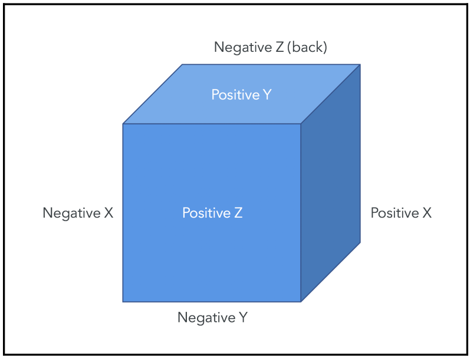

Cube mapping introduces a few new texture targets that indicate we are working with cube maps. These targets also indicate which face of the cube map we're manipulating:

- `TEXTURE_CUBE_MAP`
- `TEXTURE_CUBE_MAP_POSITIVE_X`
- `TEXTURE_CUBE_MAP_NEGATIVE_X`
- `TEXTURE_CUBE_MAP_POSITIVE_Y`
- `TEXTURE_CUBE_MAP_NEGATIVE_Y`
- `TEXTURE_CUBE_MAP_POSITIVE_Z`
- `TEXTURE_CUBE_MAP_NEGATIVE_Z`

Cube maps are created like a normal texture, but binding and property manipulation happen with the `TEXTURE_CUBE_MAP` target:

```javascript
const cubeTexture = gl.createTexture();
gl.bindTexture(gl.TEXTURE_CUBE_MAP, cubeTexture);
gl.texParameteri(gl.TEXTURE_CUBE_MAP, gl.TEXTURE_MAG_FILTER, gl.LINEAR);
gl.texParameteri(gl.TEXTURE_CUBE_MAP, gl.TEXTURE_MIN_FILTER, gl.LINEAR);
```

When uploading the image data for the texture, you need to specify the side that you are manipulating:

```javascript
gl.texImage2D(
  gl.TEXTURE_CUBE_MAP_POSITIVE_X,
  0,
  gl.RGBA,
  gl.RGBA,
  gl.UNSIGNED_BYTE,
  positiveXImage
);
gl.texImage2D(
  gl.TEXTURE_CUBE_MAP_NEGATIVE_X,
  0,
  gl.RGBA,
  gl.RGBA,
  gl.UNSIGNED_BYTE,
  negativeXImage
);
gl.texImage2D(
  gl.TEXTURE_CUBE_MAP_POSITIVE_Y,
  0,
  gl.RGBA,
  gl.RGBA,
  gl.UNSIGNED_BYTE,
  positiveYImage
);
```

Exposing the cube map texture to the shader is done in the same way as a normal texture, just with the cube map target:

```javascript
gl.activeTexture(gl.TEXTURE0);
gl.bindTexture(gl.TEXTURE_CUBE_MAP, cubeTexture);
gl.uniform1i(program.uCubeSampler, 0);
```

However, the uniform type within the shader is specific to cube maps:

```javascript
uniform samplerCube uCubeSampler;
```

When sampling from the cube map, you also use a cube map-specific function:

```javascript
texture(uCubeSampler, vCubeTextureCoords);
```

The 3D coordinates you provide are normalized by the graphics hardware into a unit vector, which specifies a direction from the center of the "cube." A ray is traced along that vector, and where it intersects the cube face is where the texture is sampled:

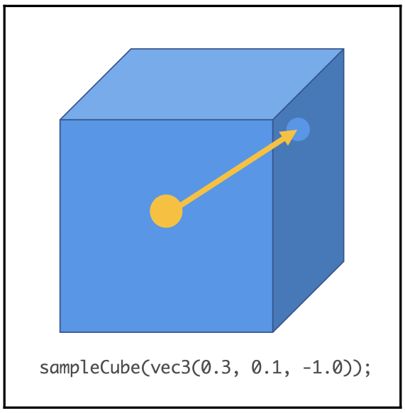
