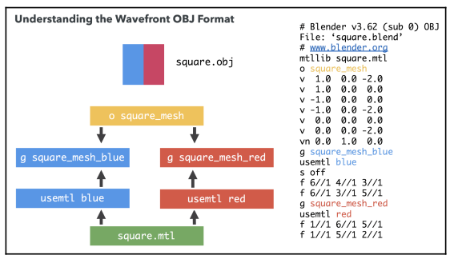

## Understanding the OBJ Format

There are several types of definitions in an OBJ file. Let's cover them line-by-line with a simple example. We are going to dissect a sample square.obj file that we will export from the Blender file called `square.blend`. This file represents a square divided into two parts, one painted red and the other painted blue, as shown in the following diagram:



When we export Blender models to an OBJ format, the resulting file normally starts with a comment:

```
# Blender v2.62 (sub 0) OBJ
File: 'squares.blend'
# www.blender.org
```

Next, we will usually find a line referring to the Material Template Library that this OBJ file is using.

```
mtllib square.mtl
```

There are several ways that geometries can be grouped into entities in an OBJ file. We can find lines starting with the prefix `o`, followed by the object name, or by the prefix `g`, followed by the group name:

```
o squares_mesh
```

```
g squares_mesh_blue
```

After object declaration, the following lines will refer to vertices, `v`, optionally to vertex normals, `vn`, and texture coordinates, `vt`. It’s important to note that vertices are shared by all groups in an object in the OBJ format. That is, you will not find lines referring to vertices when defining a group, because it's assumed that all vertex data was defined when the object was defined:

```
v 1.0 0.0 -2.0
v 1.0 0.0 0.0
v -1.0 0.0 0.0
v -1.0 0.0 -2.0
v 0.0 0.0 0.0
v 0.0 0.0 -2.0
vn 0.0 1.0 0.0
```

In our case, we have instructed Blender to export group materials. This means that each part of the object that has a different set of material properties will appear in the OBJ file as a group. We are defining an object with two groups (`squares_mesh_blue` and `squares_mesh_red`) and two corresponding materials (blue and red):

```
g squares_mesh_blue
```

If materials are being used, the line after the group declaration will be the material that's being used for that group. It's assumed that the material properties for this material are defined in the MTL file.

```
usemtl blue
```

The lines that begin with the prefix s refer to smooth shading across polygons.

```
s off
```

The lines that start with f refer to faces. There are different ways to represent faces.

### Vertex

In this configuration, every face element corresponds to a vertex index. Depending on the number of indices per face, you could have triangular, rectangular, or polygonal faces. However, we have instructed Blender to use triangular faces to create the OBJ file. Otherwise, we would need to decompose the polygons into triangles before we could call `drawElements`.

```
f i1 i2 i3...
```

### Vertex/Texture Coordinate

In this combination, every vertex index appears to be followed by a forward slash and texture coordinate index.

```
f i1/t1 i2/t2 i3/t3...
```

### Vertex/Texture Coordinate/Normal

Here is a normal index that has been added as the third element in the configuration.

```
f i1/t1/n1 i2/t2/n2 i3/t3/n3...
```

### Vertex/Normal

There can also be cases where normals are defined but texture coordinates are not. In this case, the second part of the face configuration is missing:

```
f i1//n1 i2//n2 i3//n3...
```

Note that faces are defined using indices. In our example, we have defined a square divided into two parts. Here, we can see that all of the vertices share the same normal, which has been identified with index `1`.

```
f 6//1 4//1 3//1
f 6//1 3//1 5//1
```
