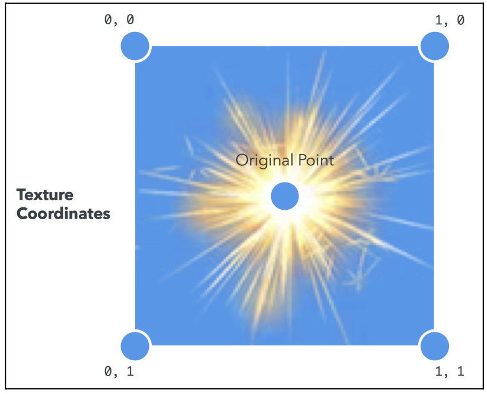

## Post-Processing

**Post-processing** is the process of adding effects by re-rendering the image of the scene with a shader that alters the final image. Some examples include the following:

- Grayscale
- Sepia tone
- Inverted colors
- Film grain
- Blur
- Wavy/dizzy effect

The basic technique for creating these effects is:

1. Create a framebuffer with the same dimensions as the canvas and have the entire scene rendered to it at the beginning of the draw cycle.
2. A quad is rendered to the default framebuffer using the texture that makes up the framebuffer's color attachment.
3. The shader used during the rendering of the quad is what contains the post-process effect. This shader can transform the color values of the rendered scene.

### Creating the Framebuffer

Since the texture will be exactly the same size as the canvas, and since we're rendering it as a full-screen quad, we've created a situation where the texture will be displayed at exactly a 1:1 ratio on the screen. **This means that no filters need to be applied and that we can use NEAREST filtering with no visual artifacts.**

### Creating the Geometry

```javascript
// 1. Define the geometry for the full-screen quad
const vertices = [-1, -1, 1, -1, -1, 1, -1, 1, 1, -1, 1, 1];
const textureCoords = [0, 0, 1, 0, 0, 1, 0, 1, 1, 0, 1, 1];

// 2. Create and bind VAO
const vao = gl.createVertexArray();
gl.bindVertexArray(vao);
// 3. Init the buffers
const vertexBuffer = gl.createBuffer();
gl.bindBuffer(gl.ARRAY_BUFFER, vertexBuffer);
gl.bufferData(
  gl.ARRAY_BUFFER,
  new Float32Array(vertices),
  // Configure instructions for VAO
  gl.STATIC_DRAW
);
gl.enableVertexAttribArray(program.aVertexPosition);
gl.vertexAttribPointer(program.aVertexPosition, 3, gl.FLOAT, false, 0, 0);
const textureBuffer = gl.createBuffer();
gl.bindBuffer(gl.ARRAY_BUFFER, textureBuffer);
gl.bufferData(gl.ARRAY_BUFFER, new Float32Array(textureCoords), gl.STATIC_DRAW);
// Configure instructions for VAO
gl.enableVertexAttribArray(program.aVertexTextureCoords);
gl.vertexAttribPointer(program.aVertexTextureCoords, 2, gl.FLOAT, false, 0, 0);
// 4. Clean up
gl.bindVertexArray(null);
gl.bindBuffer(gl.ARRAY_BUFFER, null);
```

### Setting up the Shader

```c
#version 300 es

precision mediump float;

in vec2 aVertexPosition;
in vec2 aVertexTextureCoords;

out vec2 vTextureCoords;

void main(void) {
    vTextureCoords = aVertexTextureCoords;
    gl_Position = vec4(aVertexPosition, 0.0, 1.0);
}
```

Notice that unlike the other vertex shaders we've worked with so far, this one doesn't use any matrices. That's because the vertices we declared in the previous step are **pretransformed**. Our vertex positions are already mapped to a $[-1, 1]$ range; therefore, no transformation is needed because they will map perfectly to the viewport bounds when we render.

The fragment shader is where most of the interesting operations happen. The fragment shader will be different for every post-process effect. Let's look at a simple **grayscale effect**:

```c
#version 300 es

precision mediump float;

uniform sampler2D uSampler;
in vec2 vTextureCoords;
out vec4 fragColor;

void main(void) {
    vec4 frameColor = texture(uSampler, vTextureCoords);
    float luminance = frameColor.r * 0.3 + frameColor.g * 0.59 + frameColor.b* 0.11;
        fragColor = vec4(luminance, luminance, luminance, frameColor.a);
}
```

## Point Sprites

A **particle effect** is a generic term for any special effect created by rendering groups of particles (displayed as points, textured quads, or repeated geometry) that are difficult to represent by a single geometric model.

One very efficient way of rendering particles is to use **point sprites**. You must render vertices with the [`POINTS`](../02/#drawelements-modes) primitive type, then each vertex will be rendered as a single pixel on screen.

A point stype is created by setting the `gl_PointSize` value in the vertex shader. If it's set to a number greater than one, the point is rendered as a quad that always faces the screen (also known as a **billboard**). The quad is centered on the original point and has a width and height equal to the `gl_PointSize` in pixels:


When the point sprite is rendered, it also generates texture coordinates for the quad, covering a simple $[0, 1]$ range from the upper left to the lower right:



The texture coordinates are accessible in the fragment shader by the built-in `vec2 gl_PointCoord`. Combining these properties gives us a simple point sprite vertex shader that looks like this:

```c
#version 300 es

precision mediump float;

uniform mat4 uModelViewMatrix;
uniform mat4 uProjectionMatrix;
uniform float uPointSize;

in vec4 aParticle;

out float vLifespan;

void main(void) {
  gl_Position = uProjectionMatrix * uModelViewMatrix * vec4(aParticle.xyz, 1.0);

  vLifespan = aParticle.w;

  gl_PointSize = uPointSize * vLifespan;
}
```

The corresponding fragment shader looks like this:

```c
#version 300 es

precision mediump float;

uniform sampler2D uSampler;

in float vLifespan;

out vec4 fragColor;

void main(void) {
  vec4 texColor = texture(uSampler, gl_PointCoord);
  fragColor = vec4(texColor.rgb, texColor.a * vLifespan);
}
```

## Normal Mapping

With **normal mapping**, the surface normals are replaced by normals that are encoded in a texture that give the appearance of a rough or bumpy surface. Note that the actual geometry is not changed when using a normal map – only how it's lit changes.


The texture used to store the normals is called a **normal map**, and it's typically paired with a specific diffuse texture


The normal map contains custom-formatted color information that can be interpreted by the shader at runtime as a **fragment normal**. A fragment normal is a three-component vector that points away from the surface. The normal texture encodes the three components of the normal vector into the three channels of the texture's texel color.

### Tangent Space

The normals that have been encoded are typically stored in **tangent space**, as opposed to world or object space. The tangent space is a special basis that is **attached to the surfacee**, so instead of using thw world's $x$, $y$ and $z$ we define the following three vectors:

- **Tangent vector**: the vector that is tangent (thus parallel) to the surface in a given point, by definition this vector is perpendicular to the normal vector. Defines the $\text{x-axis}$ with respect to the Tangent Space.
- **Bitangent or binormal vector**: the vector that is parallel to the surface and perpendicular to the tangent vector. This vector is also perpendicular to the normal vector. Defines the $\text{y-axis}$ with respect to the Tangent Space.
- **Normal vector**: the vector that is perpendicular to the surface in a given point. Defines the $\text{z-axis}$ with respect to the Tangent Space.


If we want apply the [Phong](../03#phong-reflection-model) or [Lambertian light model](../03#lambertian-reflection-model), we have to transform whatever vectors (e.g. light direction vector, eye vector, etc.) from world space to tangent space. In order to do this, first note that the tangent world is defined by the ordered basis formed by the **tangent vector**, the **bitangent vector** and the **normal vector**. These vectors are pairwise orthogonal and thus they form an **orthonormal basis** $\\{T, B, N\\}$ for the tangent space.

#### Transforming a Vector from World Space to Tangent Space

A vector $V_w$ in world space is defined as

$$
V_w = v_x i + v_y j + v_z k
$$

where $i, j, k$ are the world-space basis vectors. To express $V_w$ in tangent space we need to change the basis from the world basis $\\{i, j, k\\}$ to $\\{T, B, N\\}$. So, we want to express $V_w$ as:

$$
V_w = x' \textbf{T} + y' \textbf{B} + z'\textbf{N}
$$

That means we have to find the components $(x', y', z')$. This can be re-written as

$$
V_w =
\begin{bmatrix}
v_x \\
v_y \\
v_z \\
\end{bmatrix} =
\begin{bmatrix}
T_x & B_x & N_x \\
T_y & B_y & N_y \\
T_z & B_z & N_z \\
\end{bmatrix} \begin{bmatrix}
x' \\
y' \\
z' \\
\end{bmatrix}
$$

That is

$$
V_w = TBN \cdot V_t
$$

Where $V_t$ is the vector in **tangent space**. Thus, if we solve for $V_t$

$$
V_t = TBN^{-1} V_w
$$

Since $TBN$ is an **orthonormal matrix**, its inverse is just its transpose:

$$
V_t = TBN^T V_w
$$

### Normal Mapping on our Shaders

So how do we translate these operations to our shaders. First of all we have to define the normals and the tangents for the geometry (i.e. the triangle) as attributes to our vertex shader (here we denote them as `aNormal` and `aTangent`). Also note we transform this vectors using the `uNormalMatrix` to apply the local transformations over the model.

Next we use these two vectors to obtain the bitangent by computing their cross product, the result is stored on `bitangent`. With these three vectors we can now define our transformation matrix `tbnMatrix`.

```c

...

uniform mat4 uModelViewMatrix;
uniform mat4 uNormalMatrix;
uniform mat4 uProjectionMatrix;

in vec3 aNormal;
in vec3 aTangent;

...

void main(void) {

    ...

    vec3 transformedNormal = vec3(uNormalMatrix * vec4(aNormal, 1.0));
    vec3 tansformedTangent = vec3(uNormalMatrix * vec4(aTangent, 1.0));
    vec3 bitangent = cross(transformedNormal, tansformedTangent);
    mat3 tbnMatrix = mat3(
      tansformedTangent.x, bitangent.x, transformedNormal.x,
      tansformedTangent.y, bitangent.y, transformedNormal.y,
      tansformedTangent.z, bitangent.z, transformedNormal.z
    );

    ...
}
```

From here on we can use the `tbnMatrix` to transform the light direction vector (denoted `lightRay`) and the eye direction vector (denote `eyeRay`). As you can see we store the resulting values as varyings so they can be interpolated and used on the fragment shader, as we'll see later.

```c

...

uniform mat4 uModelViewMatrix;
uniform mat4 uNormalMatrix;
uniform mat4 uProjectionMatrix;

uniform vec3 uLightPosition;

in vec3 aPosition;

...

void main(void) {
    vec4 vertex = uModelViewMatrix * vec4(aPosition, 1.0);

    ...

    vec3 lightRay = vertex.xyz - uLightPosition;
    vec3 eyeRay = -vertex.xyz;

    vTangentLightRay = lightRay * tbnMatrix;
    vTangentEyeRay = eyeRay * tbnMatrix;

    ...
}
```

The last things needed are the usual, we compute the vertex position by multipliying by the projection matrix and we also store the texture coordinates as a varying:

```c

...

in vec2 aTextureCoords;

...

void main(void) {

    ...

    vTextureCoords = aTextureCoords;

    gl_Position = uProjectionMatrix * vertex;

    ....
}
```

On our fragment shader we use the transformed ligth ray as well as the transformed eye ray to apply both the [Phong](../03#phong-reflection-model) and the [Lambertian light model](../03#lambertian-reflection-model).

```c
#version 300 es

precision mediump float;

const float SHININESS = 8.0;

uniform sampler2D uSampler;
uniform sampler2D uNormalSampler;

uniform vec4 uLightDiffuse;
uniform vec4 uLightAmbient;
uniform vec4 uMaterialAmbient;

in vec2 vTextureCoords;
in vec3 vTangentLightRay;
in vec3 vTangentEyeRay;

out vec4 fragColor;

// Transforms the normal stored inside the texture from a range of [0, 1] to a range of [-1, 1]
vec3 transformNormal() {
  return 2.0 * (texture(uNormalSampler, vTextureCoords).rgb - 0.5);
}

void main(void) {

  // Ambient color
  vec4 Ia = uLightAmbient * uMaterialAmbient;

  // Diffuse color
  vec4 textureColor = texture(uSampler, vTextureCoords);
  vec3 N = normalize(transformNormal());
  vec3 L = normalize(vTangentLightRay);
  float lambertTerm = dot(N, -L);
  vec4 Id = textureColor * uLightDiffuse * lambertTerm;

  // Specular color
  vec3 R = reflect(L, N);
  float Is = pow(clamp(dot(R, vTangentEyeRay), 0.0, 1.0), SHININESS);

  fragColor = Ia + Id + Is;
}
```

### Compute Tangents

As we have said, our tangent space is defined by three vectors: the **normal vector**, the **bitangent vector** and the **tangent vector**. The normal vector is defined by the vertices, the bitangent vector is defined as the cross product of the normal vector and the tangent vector. But where does the tangent vector come from?

First of all, for every 3D vertex there is infinite tangent and bitangent vectors, as the following image shows there exists in fact a tangent plane.


So in order to properly calculate the most useful tangent space, we want our tangent space to be aligned such that the $x$ axis (the tangent) corresponds to the $u$ direction in the normal map and the $y$ axis (bitangent) corresponds to the $v$ direction in the normal map. See the following image


We will assume $T$ is the tangent and $B$ is the bitangent, and $P_0$ is our target vertex, that is part of the triangle ($P_0$,$P_1$,$P_2$). We want to calculate the tangent and bitangent such that:

- $T$ is alidned with $u$ and $B$ is aligned with $v$
- $T$ and $B$ lay in the tangent plane.

The point is we already assumed that $T$ and $B$ lay in the same plane and corresponds to $U$ and $V$ now if we can know their values we can cross product and the third vector to construct a transformation matrix from world to tangent space.


Given that we know that any 2D vector can be written as a linear combination of two independent vectors and since we already have the triangle points (edges), shown in the above image. We can write:

$$
E_1 = (u_1 - u_0)T + (v_1 - v_0) B
$$

$$
E_2 = (u_2 - u_0)T + (v_2 - v_0)B
$$

The above equation can be written in a matrix form,

$$
\begin{bmatrix}
E_{1x} & E_{1y} & E_{1z} \\
E_{2x} & E_{2y} & E_{2z} \\
\end{bmatrix} =
\begin{bmatrix}
\Delta u_1 & \Delta v_1 \\
\Delta u_2 & \Delta v_2
\end{bmatrix}
\begin{bmatrix}
T_x & T_y & T_z \\
B_x & B_y & B_z
\end{bmatrix}
$$

By solving the matrixs equation we can determine $T$ and $B$ values we can construct a transformation matrix.
