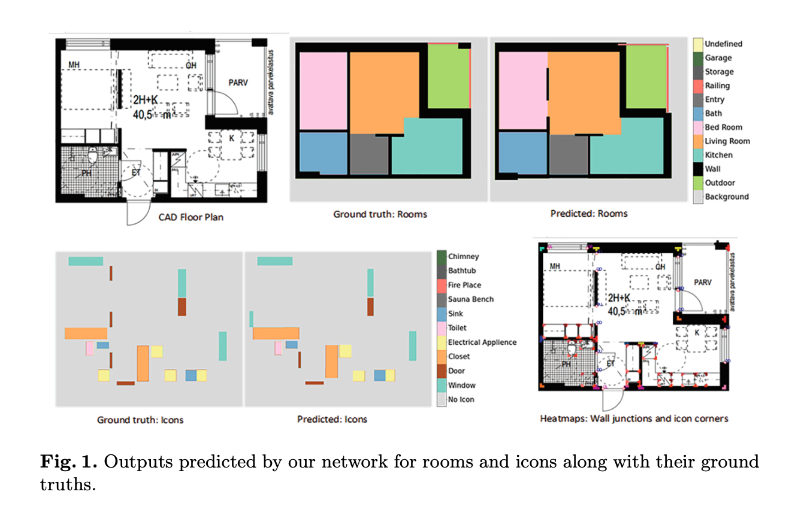
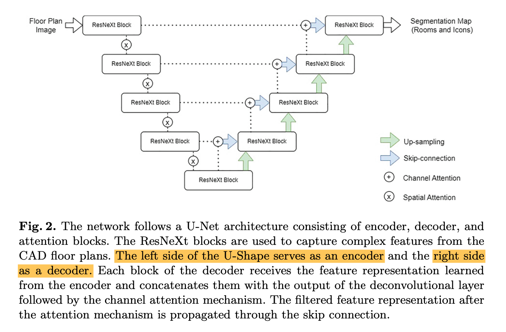
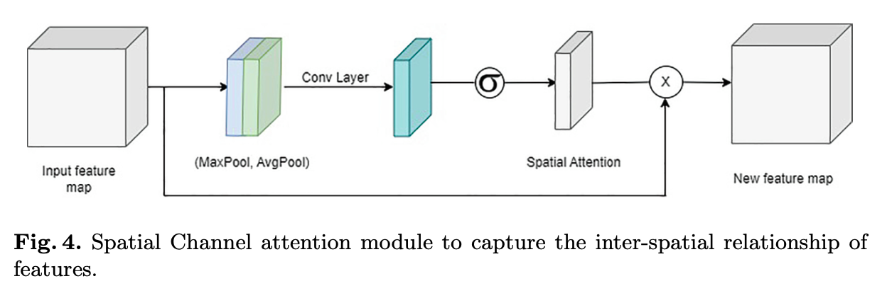

[Source](https://link.springer.com/chapter/10.1007/978-3-031-41498-5_12)

## Introduction

We develop a multi-task deep attention network to recognize room-boundary and room-type elements in CAD floor plans.



## Related Work

- Heuristic:
  - [Semi-automatic delineation of regions in floor plans](https://ieeexplore.ieee.org/document/602062)
  - [A complete system for the analysis of architectural drawings](https://link.springer.com/article/10.1007/PL00010901)
  - [Variations on the analysis of architectural drawings](https://ieeexplore.ieee.org/document/619869)
- DL based:
  - [Parsing floor plan images](https://ieeexplore.ieee.org/document/7986875)
  - [Raster-to-Vector: Revisiting Floorplan Transformation](https://ieeexplore.ieee.org/abstract/document/8237503)
  - [Apartment Structure Estimation Using Fully Convolutional Networks and Graph Model](https://sci-hub.se/10.1145/3210499.3210528)
  - [Deep Floor Plan Recognition Using a Multi-Task Network with Room-Boundary-Guided Attention](https://arxiv.org/pdf/1908.11025)
  - [The Direction-Aware, Learnable, Additive Kernels and the Adversarial Network for Deep Floor Plan Recognition](https://arxiv.org/pdf/2001.11194)
  - [Residential floor plan recognition and reconstruction](https://openaccess.thecvf.com/content/CVPR2021/papers/Lv_Residential_Floor_Plan_Recognition_and_Reconstruction_CVPR_2021_paper.pdf)

## Method

# FPNet Architecture Summary

## Problem Statement

FPNet addresses automated floor plan analysis - taking architectural floor plan images and automatically identifying room types (bedroom, kitchen, bathroom, etc.) and structural elements (doors, windows, walls, fixtures).

## Overall Architecture: U-Net Structure

The network follows a **U-Net architecture**, which has a characteristic U-shape consisting of:

- **Left side (Encoder)**: Progressively reduces image size while increasing feature depth
- **Right side (Decoder)**: Progressively increases image size back to original resolution
- **Skip connections**: Direct pathways connecting encoder and decoder at corresponding levels



## Encoder: Feature Extraction and Downsampling

The encoder transforms a single floor plan image into multiple feature representations at different levels of abstraction and spatial resolution. Think of it like creating a pyramid of increasingly "smart" but smaller representations of the original image.

### How It Works

#### Progressive Downsampling with Max-Pooling

Max-pooling is a downsampling operation that reduces image size by taking the maximum value in small regions.

```
Original 4×4 region:        After 2×2 max-pooling:
[1  3  2  8]                    [3  8]
[2  3  1  4]          →         [7  9]
[5  1  7  9]
[0  2  6  1]
```

The 2×2 max-pooling operation divides the input into non-overlapping $2 \times 2$ blocks, then it takes the maximum value from each block and results in an output that's half the width and half the height. For example:

- _Level 1_: Input image $512 \times 512$ → after max-pool → $256 \times 256$
- _Level 2_: $256 \times 256$ → after max-pool → $128 \times 128$
- _Level 3_: $128 \times 128$ → after max-pool → $64 \times 64$
- _Level 4_: $64 \times 64$ → after max-pool → $32 \times 32$
- _Level 5_: $32 \times 32$ → after max-pool → $16 \times 16$

Each level captures information at a different scale of detail.

#### Feature Channel Doubling

On this paper, **spatial size** refers to the width and height dimensions. Whilst the **channels** refer to the depth dimension, like having multiple layers of information for each pixel position. For example:

- _Input_: $512 \times 512 \times 3$ ($3$ channels - RGB)
- _Level 1_: $256 \times 256 \times 64$ ($64$ channels of basic features like edges)
- _Level 2_: $128 \times 128 \times 128$ ($128$ channels of more complex patterns)
- _Level 3_: $64 \times 64 \times 256$ ($256$ channels of high-level concepts)
- _Level 4_: $32 \times 32 \times 512$ ($512$ channels of very abstract features)

Think of channels as different "filters" or "feature detectors." If you have 256 channels at a particular layer, you have 256 different types of feature maps, each highlighting different aspects:

- Channel $1$: Might highlight vertical edges
- Channel $2$: Might highlight horizontal edges
- Channel $3$: Might highlight corners
- Channel $100$: Might highlight door-like patterns
- Channel $256$: Might highlight bathroom fixtures

**Why Double Channels?**

- As spatial size decreases, we lose spatial detail
- We compensate by increasing the number of different types of features we track
- More channels = more capacity to represent complex patterns

#### Multi-Level Processing Implementation

At each encoder level, the following sequence occurs:

```
Input → ResNeXt Block → Spatial Attention → Max-Pooling → Next Level
   ↓
Skip Connection to Decoder
```

- $5$ levels total in the encoder
- Each level processes features at a different scale
- Skip connections are created at each level to preserve information for the decoder
- Spatial attention is applied between ResNeXt blocks at each level

Example of Multi-Scale Representations:

- _Level 1_ ($256 \times 256$): Detects basic lines, corners, small details
- _Level 2_ ($128 \times 128$): Recognizes door frames, window outlines
- _Level 3_ ($64 \times 64$): Identifies room boundaries, wall segments
- _Level 4_ ($32 \times 32$): Understands room layouts, spatial relationships
- _Level 5_ ($16 \times 16$): Captures overall floor plan structure, building layout

### ResNet and ResNeXt Blocks

#### ResNet Background

In deep neural networks, when you train the network, information flows backward to update weights. In very deep networks (many layers), this information gets weaker and weaker as it travels backward, like a whisper in a long telephone chain. Eventually, the early layers barely get updated, so they don't learn properly.

ResNet solution - Residual Connections:

```
Traditional Block:          ResNet Block:
Input → Layer1 → Layer2     Input → Layer1 → Layer2 → Add
                                ↓              ↑
                                └──────────────┘
                                (Skip Connection)
```

How Skip Connections Work:

- The input is added directly to the output of the processing layers
- If layers learn nothing useful, they can output zeros, and the skip connection passes the input unchanged
- This creates "highways" for gradients to flow backward during training
- Even in very deep networks, early layers can still receive strong training signals

Why This Prevents Vanishing Gradients:

- Gradients can flow directly through skip connections
- They don't have to pass through every layer sequentially
- Early layers get direct feedback about their contribution to the final result

#### ResNeXt

ResNeXt blocks are advanced building blocks for deep networks that improve upon traditional ResNet blocks. What the traditional RedNet does:

```
Input → Conv → BN → ReLU → Conv → BN → Add with Input
```

What ResNeXt does - Multiple Parallel Pathways:

```
Input Feature Map (64×64×256)
          ↓
    Split into 32 groups of 8 channels each
          ↓
Path 1: Process group 1 (64×64×8) → Conv layers → Output 1 (64×64×8)
Path 2: Process group 2 (64×64×8) → Conv layers → Output 2 (64×64×8)
Path 3: Process group 3 (64×64×8) → Conv layers → Output 3 (64×64×8)
...
Path 32: Process group 32 (64×64×8) → Conv layers → Output 32 (64×64×8)
          ↓
    Concatenate all outputs
          ↓
Combined Output (64×64×256) ← This is 8×32 = 256 channels
          ↓
    Add original input (residual connection)
          ↓
Final Output (64×64×256) → Goes to Spatial Attention Module
```

Where the **cardinality** is the number of parallel paths (e.g. $32$ parallel paths). Each path applies the same type of operations (convolutions) but with different learned parameters:

- Path $1$ might learn to detect horizontal lines
- Path $2$ might learn to detect vertical lines
- Path $3$ might learn to detect corners
- Path $32$ might learn to detect curved elements

The aggregated output becomes input to the spatial attention module. Then to max-pooling for the next encoder level. Also sent via skip connection to the corresponding decoder level.

### Spatial Attention in Encoder

Applied between ResNeXt blocks, spatial attention helps the network focus on the most informative spatial regions, stated simply it creates a "spotlight map" that tells the network where to focus in the image.



#### How It Works

##### 1. Create Two Summary Maps

Given a $64 \times 64 \times 256$ feature maps (which comes from the ResNeXt block) we generate:

- Averate summary ($64 \times 64 \times 1$): For each pixel location we average all the $256$ channels. This would encode overall activity at each location.
- Max summary ($64 \times 64 \times 1$): For each pixel location we take the highest of all $256$ channels. This would encode peak activity at each location.

You can think of it like this:

- You have $256$ different detectors looking at each pixel
- Average summary: "How active are detectors on average at this pixel?"
- Max summary: "What's the strongest detection at this pixel?"

##### 2. Combine the summary

```
Average Summary (64×64×1) ─┐
                           ├─ Stack together → Combined (64×64×2)
Max Summary (64×64×1) ─────┘
```

Now you have a 2-layer summary showing both average and peak activity at each location.

##### 3. Learn What's Important

```
Combined Summary (64×64×2) → 4×4 Convolution → Attention Map (64×64×1)
                                    ↓
                              Apply Sigmoid (makes values 0-1)
```

Where the convolution learns:

- "When I see this pattern of average + max activity, this location is important"
- "When I see that pattern of average + max activity, this location is not important"

The result is an **attention map** where:

- Bright spots (close to 1) = "Pay attention here!"
- Dark spots (close to 0) = "Ignore this area"

##### 4. Apply the "Spotlight"

```
Original Features (64×64×256) × Attention Map (64×64×1) = Focused Features (64×64×256)
```

For example:

```
At pixel location (10, 15):
- Original features: [value1, value2, value3, ..., value256]
- Attention weight: 0.9 (high attention)
- Result: [0.9×value1, 0.9×value2, 0.9×value3, ..., 0.9×value256]

At pixel location (30, 45):
- Original features: [value1, value2, value3, ..., value256]
- Attention weight: 0.1 (low attention)
- Result: [0.1×value1, 0.1×value2, 0.1×value3, ..., 0.1×value256]
```

## Decoder: Upsampling and Reconstruction

The decoder reconstructs full-resolution segmentation maps from the compressed encoder features.

### How Upsampling Works

1. **Bilinear interpolation**: Gradually increases spatial resolution at each decoder level
2. **Progressive reconstruction**: Each level adds more spatial detail
3. **Feature combination**: Combines upsampled features with skip connection features from encoder

### Final Output Layer

- **1×1 convolution**: Maps feature channels to class predictions
- **Two output heads**: Separate segmentation maps for rooms and icons

## Feature Types and Their Importance

### Low-Level Features (Early Encoder Layers)

- **What they are**: Basic visual elements like edges, corners, textures
- **Characteristics**: High spatial resolution, low semantic meaning
- **Examples**: Wall edges, door frames, line intersections

### High-Level Features (Deep Encoder/Decoder Layers)

- **What they are**: Complex semantic concepts learned through deep processing
- **Characteristics**: Low spatial resolution, high semantic meaning
- **Examples**: "This region looks like a kitchen layout," "This pattern suggests a bathroom"

### Why Both Are Needed

- **High-level features**: Provide semantic understanding and context
- **Low-level features**: Provide precise spatial localization and boundary details
- **The challenge**: High-level features know WHAT things are, low-level features know WHERE they are precisely

## Channel Attention: Smart Feature Combination

### The Problem with Simple Concatenation

When combining encoder features with decoder features through skip connections, not all information is equally useful. Low-level features contain much background noise and irrelevant details.

### Channel Attention Solution

**How It Works:**

1. **Global context extraction**: Uses Global Average Pooling to capture semantic information from high-level features
2. **Attention vector creation**: Applies 1×1 convolution + batch normalization + softmax to create channel weights
3. **Feature weighting**: Multiplies low-level features by attention weights to emphasize relevant channels
4. **Feature fusion**: Adds the weighted low-level features to high-level features

**Effect**:

- Suppresses irrelevant background information in low-level features
- Emphasizes channels that contain architecturally relevant information
- Creates better fusion between semantic understanding and spatial precision

## Training Objective: Multi-Task Learning

### Two Parallel Tasks

1. **Room Segmentation**: Classify pixels as background, different room types, or walls
2. **Icon Segmentation**: Classify pixels as different architectural elements (doors, windows, fixtures)

### Loss Function

- **Base loss**: Cross-entropy loss for each segmentation task
- **Multi-task weighting**: Uses homoscedastic uncertainty to automatically balance the two losses
- **Uncertainty learning**: The network learns optimal weights between tasks rather than manual tuning

### Mathematical Formulation

$$
L_S = - \sum_{i = 1}^C y_i \log(p_i)
$$

Where:

- $y_i$ is the true label for element i
- $p_i$ is the predicted probability
- $C$ is the number of classes
- Applied separately to both room and icon segmentation tasks

## Model Output

### Two Segmentation Maps

1. **Room segmentation map**: Each pixel classified as:
   - Background, walls, or specific room types (kitchen, bedroom, bathroom, etc.)
2. **Icon segmentation map**: Each pixel classified as:
   - Empty space or specific architectural elements (doors, windows, toilet, sink, etc.)

### Output Resolution

- Same resolution as input image
- Pixel-level predictions for both tasks simultaneously
