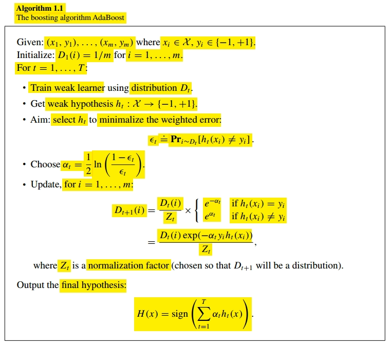
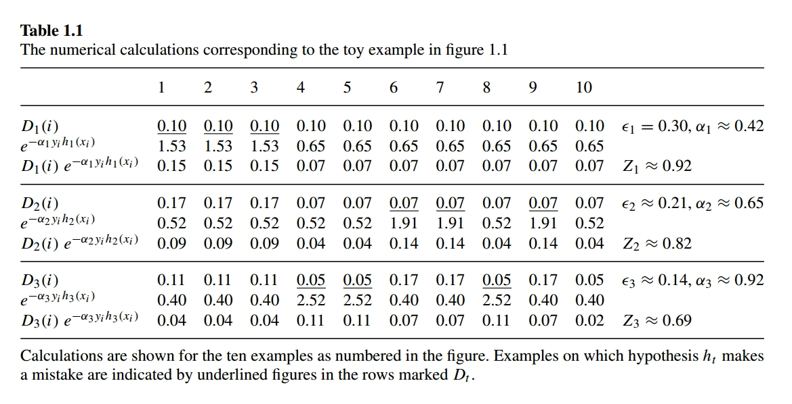
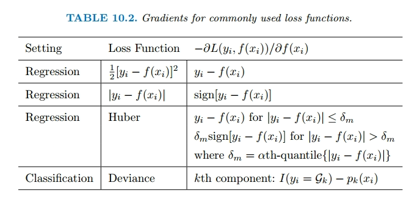
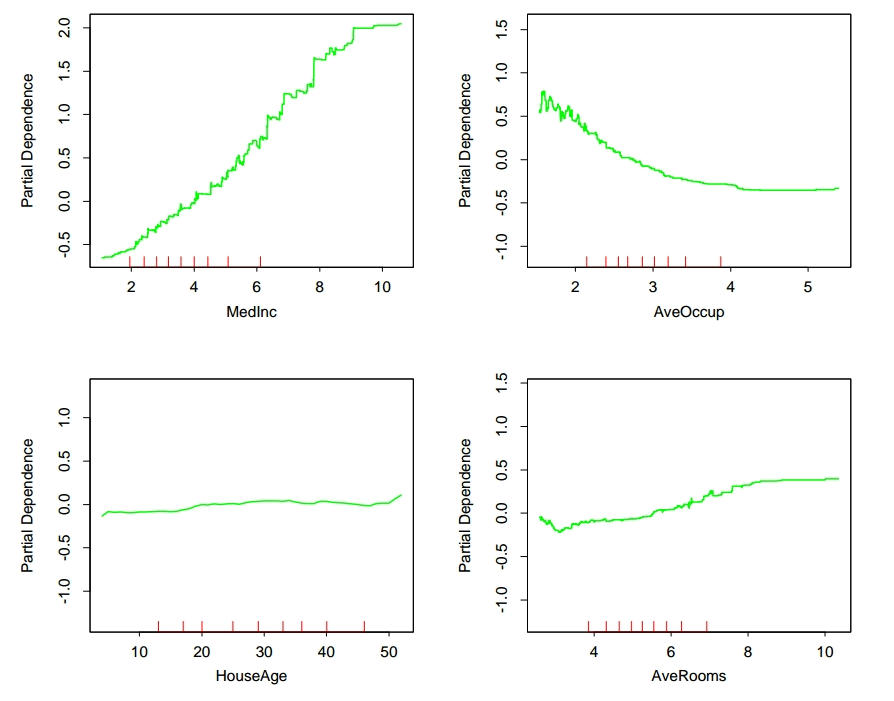
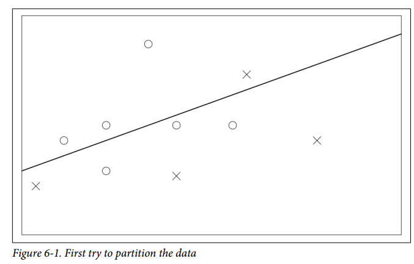
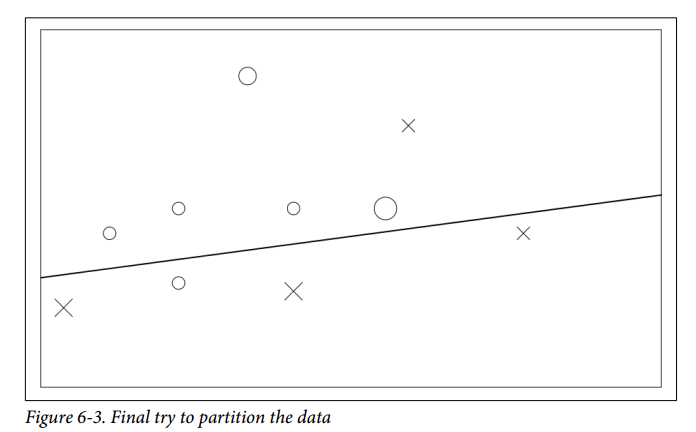

## Boosting

### Regression Trees

Boosting regression trees, often referred to as gradient boosting machines:


What is the idea behind this procedure? Given the current model, we fit a decision tree to the residuals $r_i$ from the model rather than the outcome $Y$.

Each of these trees can be rather small, with just a few terminal nodes, determined by the parameter $d$.

By fitting small trees to the residuals, we slowly improve $\hat{f}$ in areas where it does not perform well.

The shrinkage parameter $\lambda$ slows the process down even further.

Boosting has three tuning parameters:

- The number of trees $B$: boosting can overfit if $B$ is too large.
- The shrinkage parameter $\lambda$: this controls the rate at which boosting learns.
- The number $d$ of splits in each tree, which controls the complexity of the ensemble.

## Ada Boost

### Definition

AdaBoost, also known as Adaptive Boosting, is a machine learning algorithm that combines multiple weak classifiers to create a strong classifier. Let's break down the AdaBoost algorithm using the pseudocode shown in:



1. **Initialization**: AdaBoost starts by initializing the weights of all training examples equally $D_1(i) = \frac{1}{N}$ for $i = 1, 2, \cdots, N$.
2. **Iterative Process** for $t = 1, \cdots, T$:
3. AdaBoost iterates through rounds, where each round involves training a weak classifier $h_t: \mathcal{X} \rightarrow \{-1, +1\}$ on the data $D_t$.
4. The algorithm adjusts the weights of the training examples based on the performance of the weak classifier: $D_{t+1} = \frac{D_t(i) \cdot e^{-\alpha_ty_th_t(x_t)}}{Z_t}$, where $Z_t$ is a regularization term and $\alpha_t$ is the weight of $h_t$ on the final ensemble model based on its accuracy.
5. **Combining Classifiers**:
6. After multiple rounds, AdaBoost combines all the weak classifiers into a final strong classifier.
7. The final classifier makes predictions based on a weighted voting system using the predictions of the individual weak classifiers: $H(x) = sign(\sum_{t=1}^T \alpha_t h_t(x))$
8. **Predictions**: When making predictions on new data, AdaBoost uses the combined classifier to predict the class label based on the weighted votes of the weak classifiers

### Characteristics

The weak learning assumption means that we assume each weak classifier makes errors that are not too close to random guessing. So the the error $\epsilon_t$ is at most $\frac{1}{2} - \gamma$ for some small positive constant $\gamma$.

It can be proven that the training error of the c ombined classifier drops exponentially fas as a function of the number of weak classifiers combined, but it says nothing about the behaviour of its generalization error computed over the test data.

### Toy Example

To illustrate how AdaBoost works, let us look at the tiny toy learning problem shown in the following picture:


##### Round 1

On round $1$, we assign equal weights to all the examples. So $D1_(i) = \frac{1}{n} = \frac{1}{10}$.

The hypothesis $h_1$ classifies incorrectly three points, so its error is $\epsilon_1 = 0.3$, so it follows that the weight assigned to this first model is $\alpha_1 = 0.42$.



##### Round 2

When constructing $D_2$ we increment the weight of the three points misclassified by $h_1$. And we define a new hypothesis $h_2$ over this data, where we can see that it classifies correctly the three points misclassified by $h_1$ however it still classifies incorrectly three other points.

The error of this model is $\epsilon_2 = 0.21$ and thus the weight of this model is defined as $\alpha_2 = 0.65$.

##### Round 3

We modify the weights of the data taking into account the three points previously misclassified, augmenting their weight and decresing the weight of those correctly classified.

This classifier misses none of the points misclassified by $h_1$ and $h_2$.

##### Final Round

The combined classifier $H$ is defined as a weighted vote between $h_1$, $h_2$ and $h_3$ where the weights are given by $\alpha_1$, $\alpha_2$ and $\alpha_3$.


## Boosting Trees

### Variable Space Partitioning

Partitioning the predictor variable space into regions in boosting trees involves recursively splitting the data based on predictor variables to create distinct regions with associated constant values for making predictions.

1. **Starting Point**: entire predictor variable space is considered as one large region, $R_1$.
2. Decision Making: At each step, a decision tree algorithm finds the best split based on a predictor variable $x_j$ and a split point $s$ that minimizes a certain criterion. This split divides region $R_j$ into two subregions $R_{left}$ and $R_{right}$.
3. **Splitting Criteria**: it can be represented as $(j, s) = arg \min_{j, s} [\sum_{x_i \in R_{left}} L(y_i, f(x_i)) + \sum_{x_i \in R_{right}} L(y_i, f(x_i)]$
4. **Recursive Process**: This process is repeated recursively for each resulting subregion until a stopping criterion is met.
5. **Terminal Nodes**: The final regions, or terminal nodes, are denoted as $R_J$ and are assigned constant values $\gamma_j$ representing the prediction for data points falling into that region.
6. **Constant Assigment**: Each terminal node is associated with a constant value, resulting in a piecewise constant function, such that each tree can be denoted as: $T(x; \Theta) = \sum_{j=1}^J \gamma_j I(x \in R_j)$ where $I(\cdot)$ is the indication function and $\Theta = \{R_j, \gamma_j\}_1^J$ are the parameters.
7. **Prediction**:
8. When making predictions for new data points, the algorithm determines the region $R_j$ that the data point belongs to based on the predictor variables.
9. The prediction for that data point is then based on the constant value $\gamma_j$ assigned to the corresponding region.

### Optimization Problem

So as we have seen the optimization problem is defined, on a simplified manner, as follows:

$$
\begin{aligned}
\hat{\Theta} = \arg \min_{\Theta} \sum_{j=1}^J \sum_{x_i \in R_j} L(y_i, \gamma_j)
\end{aligned}
$$

This is a combinatorial problem that we usually aproximate using suboptimal solutions.

- Finding $\gamma_j$ given $R_j$: we usually define $\hat{\gamma}_j = \overline{y}_j$ for regression problems.
- Finding $R_j$: this is the difficult part. We usually resort to a greedy, top-down recursive partitioning algorithm to find $R_j$.

### Boosting Trees

In boosting trees, terminal-node trees refer to the individual decision trees that make up the ensemble model. Each terminal-node tree is denoted as $T(x; \Theta_m)$ where $\Theta_m = \{R_{jm}, \gamma_{jm}\}_1^{J_m}$.

The boosted tree model is an additive model, where each tree is added sequentially to improve the overall prediction. The model can be expressed as

$$
\begin{aligned}
f_M(x) = \sum_{m=1}^M T(x; \Theta_m)
\end{aligned}
$$

where $M$ represents the total number of trees in the ensemble.

#### Optimization Problem

The optimization problem for boosting trees involves finding the optimal regions and constants for each tree in the ensemble model.

##### Optimization Objective

The goal is to minimize the empirical risk:

$$
\begin{aligned}
\hat{\Theta} = arg \min_{\Theta} \sum_{x_i \in R_j} L(y_i, \gamma_j)
\end{aligned}
$$

Where $L(y_i, \gamma_i)$ represents the loss incurred for pedicting the target value $y_i$ with constant $\gamma_j$ in region $R_j$.

##### Finding Optimal Consants

Given the regions $R_{jm}$ finding the optimal constant in $\gamma_j$ in each regions involves minimizing the loss function for the data points within that region:

$$
\begin{aligned}
\hat{\gamma}_{jm} = arg \min_{\gamma_{jm}} \sum_{x_i \in R_{jm}} L(y_i, f_{m - 1}(x_i) + \gamma_{jm})
\end{aligned}
$$

$$
\begin{aligned}
\hat{\gamma}_{jm} = arg \min_{\gamma_{jm}} \sum_{x \in R_{jm}} L(y_i, f_{m - 1}(x_i) + T(x_i; \Theta_m))
\end{aligned}
$$

Finding the regions is difficult, and even more difficult than for a single tree.

##### Solution for Regression Trees

For regressions trees the solution for boosted trees consists on choosing the regression tree that best predicts the current residuals $y_i - f_{m-1}(x_i)$ and $\hat{\gamma}_{jm}$

##### Solution for Classification Trees

For two-class classification and exponential loss, it gives rise to the AdaBoost method. It can be showin that given $R_{jm}$ the solution is:

$$
\begin{aligned}
\hat{\gamma}_{jm} = \log \frac{\sum_{x_i \in R_{jm}} w_i^{(m)} I(y_i = 1)}{\sum_{x_i \in R_{jm}} w_i^{(m)} I(y_i = -1)}
\end{aligned}
$$

### Appendix

#### Greedy Top-Down Recurisve Partitioning Algorithm

A greedy, top-down recursive partitioning algorithm is a method used in decision tree construction to recursively split the predictor variable space into regions in a step-by-step manner.

1. **Greedy Approach**: at each step, it makes the best split based on the available data without considering the impact of future splits.
2. **Top Down Process**: starts at the top with the entire predictor variable space considered as one region. It then recursively divides this space into smaller regions
3. **Recursive Partitioning**: At each step the predictor variable space is divided into two or more subregions based on a splitting criterion. This process continues recursively for each resulting subregion until a stopping criterion is met.

## Gradient Boosting

### Numerical Optimization via Gradient

Imagine you have a machine learning model that makes predictions, but it's not perfect. Gradient boosting is like a smart way to teach this model to make better predictions over time.

Instead of trying to fix all the prediction errors at once, gradient boosting focuses on correcting one error at a time. It does this by looking at the direction where the error is the steepest and making adjustments to improve the prediction in that direction.

By repeating this process step by step, the model gradually gets better at making predictions, leading to more accurate results.

So if you have the following function you want to optimize:

$$
\begin{aligned}
L(f) =  \sum_{i=1}^N L(y_i, f(x_i))
\end{aligned}
$$

where $f \in \mathbb{R}^N$ is the prediction function and its evaluation at each instance $x_i$ are the parameteres we want to optimize:

$$
\begin{aligned}
f = \{f(x_1), \cdots, f(x_i), \cdots, f(x_n)\}
\end{aligned}
$$

Therefore the optimization problem with respect to $f$ can be summarized as follows:

$$
\begin{aligned}
\hat{f} = \arg \min_f L(f)
\end{aligned}
$$

Solving this entire problem at once may be challenging. To make it easier, numerical optimization procedures break down this big problem into smaller pieces, represented by component vectors. Each component vector addresses a specific aspect of the problem. So:

$$
\begin{aligned}
f_{M} = \sum_{m = 0}^M h_m, h_m \in \mathbb{R}^N
\end{aligned}
$$

where $f_M$ represents the final model or prediction function obtained after M iterations or steps of the boosting algorithm.

Here $f_m$ represents the model at iteration $m$, whereas $h_m$ represents the increment to the model at iteration $m$ It is the component vector added to the current model to move towards the optimized solution. Each $h_m$ is induced based on the current parameter vector $f_{m-1}$ and contributes to the overall model improvement.

Here is a simple layout of how the algorithm optimizes:

- At the beginning of the gradient boosting process, the initial model $f_0$ is set to an initial guess.
- As the algorithm progresses through iterations ($m = 1, 2, \cdots, M$), each step involves updating the model based on the gradient information to reduce errors in predictions. Numerical optimization methods differ in their prescriptions for computing each increment vector $h_m$.

### Steepest Descent

Steepest descent is a method used in optimization to find the minimum value of a function. This method chooses $h_m = \rho_m g_m$ where $\rho_m$ is a scalar and $g_m$ is the gradient of $L(f_{m-1})$, that is, the cost function evaluated at values predicted by the "previous model".

The components of the gradient $g_m$ are defined as follows:

$$
\begin{aligned}
g_{im} = \left[\frac{\delta L(y_i, f(x_i))}{\delta f(x_i)}\right]_{f_m(x_i) = f_{m-1}(x_i)}
\end{aligned}
$$

The step length (kinda like the learning rate):

$$
\begin{aligned}
\rho_m = \arg \min_{\rho} L(f_{m-1} - \rho g_m)
\end{aligned}
$$

Thus, at each step, the predictor is updated as follows:

$$
\begin{aligned}
f_m = f_{m - 1} - \rho_m g_m \in \mathbb{R}^N
\end{aligned}
$$

This updates $f_m$ towards the direction of maximum descent at $L(f_{m-1})$, which is why this is often interpreted as a greedy algorithm.

### Gradient Boosting

Gradient Boosting aims to create a strong predictive model by combining multiple weak models. It starts with a simple model and gradually enhances it to minimize errors.

At each iteration, a new tree model is fit to the negative gradient of the loss function. The predictions from these trees guide the model towards better predictions. Using squared error to measure closeness, this leads us to:

$$
\begin{aligned}
\tilde{\Theta}_m = \arg \min_{\Theta} \sum_{i=1}^N (-g_{im} - T(x_i; \Theta))^2
\end{aligned}
$$

This measures how close each prediction $T(x_i; \Theta)$ is to the gradient $-g_{im}$.

The negative gradient of the loss function represents the direction in which the model's predictions need to be adjusted to reduce errors. By fitting a new tree to this negative gradient, the model learns how to correct its predictions to move closer to the actual target values. That is at each iteration, the new tree model focuses on capturing the errors or residuals of the current ensemble model.

While the exact regions where the new tree makes corrections may not match perfectly with the original model's regions, they are close enough to serve the same purpose of improving the model's accuracy. Here the original model is the ensemble model.

The following figure summarizes the gradients for commonly used loss functions:



### Implementations of Gradient Boosting

Algorithm $10.3$ presents the generic gradient tree-boosting algorithm for regression. Specific algorithms are obtained by inserting different loss criteria $L(y,f(x))$.


- Start with an initial model $f_0(x)$ that minimizes the loss function $L(y, f(x))$.
- For each boosting round $m = 1, \cdots, M$:
  - Calculate the negative gradient for each data point

$$
\begin{aligned}
r_{im} = -\left[\frac{\delta L(y_i, f(x_i))}{\delta f(x_i)}\right]_{f(x_i) = f_{m-1}(x_i)}
\end{aligned}
$$

- Fit a regression tree to the gradients $r_{im}$, which gives us the regions $R_{jm}, j = 1, 2, \cdots, J_m$
- The step length $\gamma$ is determined by minimizing the loss using the previous model ($f_{m-1}$):

$$
\begin{aligned}
\gamma_{jm} = \arg \min_{\gamma} \sum_{x_i \in R_{jm}} L(y_i, f_{m-1}(x_i) + \gamma)
\end{aligned}
$$

- Update the model by adding a new tree to the ensemble $f_m(x) = f_{m-1}(x) + \gamma T(x; \Theta_m)$, where $T(x; \Theta)$ is the new tree model with parameters $\Theta_m$ that corrects the errors in the previous model.
- The output of the ensemble model is defined as $\hat{f}(x) = f_M(x)$, that is as the sum of the weaker models.

#### Step Length

The step length $\gamma$ is crucial in determining how much each new tree should contribute to the ensemble model. It controls the impact of the new tree on the overall model's predictions.

The line search aims to find the value of γ that minimizes the loss function:

$$
\begin{aligned}
L(f_{m-1} - \gamma g_m)
\end{aligned}
$$

This means finding the optimal step length that results in the smallest possible loss when updating the model with the new tree. By minimizing the loss function with respect to $\gamma$, the algorithm is essentially performing a form of gradient descent.

#### Characteristics

Two basic tuning parameters are the number of iterations $M$ and the sizes of each of the constituent trees
$J_m, m = 1, 2, \cdots, M$.

The original implementation of this algorithm was called MART for "multiple additive regression trees".

## Interpretability

### Importance of Predictor Variables

We attempt to discuss the relevance of predictor variables in a statistical modeling technique called boosting.

#### Decision Trees

We define the following as a measure of relevance for each predictor variable $X_{\mathcal{l}}$:

$$
\begin{aligned}
I_{\mathcal{l}}^2(T) = \sum_{t = 1}^{J - 1} \hat{i}^2_t I(v(t) = \mathcal{l})
\end{aligned}
$$

This equation calculates the relevance of each predictor variable based on the squared improvements in error risk within the internal nodes of the tree. Let's split each part of the equation:

- The term $\hat{i}^2_t$ represents the squared improvement in error risk at node $t$ when splitting on the $X_{\mathcal{l}}$ predictor variable.
- The variable $v(t)$ indicates which predictor variable is used for the split at node $t$.
- Each improvement is weighted by the indicator function $I(v(t) = \mathcal{l})$, which checks if the splitting variable at node $t$ is the predictor variable of interest $X_{\mathcal{l}}$. This weighting ensures that only the improvements related to the predictor variable $X_{\mathcal{l}}$ are considered in the calculation.
- We sum these improvements over the $J - 1$ internal nodes on the tree, which are not terminal nodes.

#### Additive Models

This importance measure is easily generalized to additive tree expansions:

$$
\begin{aligned}
I_{\mathcal{l}}^2 = \frac{1}{M}\sum_{m = 1}^{M} I_{\mathcal{l}}^2(T_m)
\end{aligned}
$$

Due to the stabilizing effect of averaging, this measure turns out to be more reliable than the measure computed only over one tree.

### Partial Dependence Plots

Partial dependence functions, by isolating the effects of selected variables, provides an interpretable analysis of their impact on the model's predictions, overcoming the challenges of information overload in high-dimensional spaces. Let's define the partial dependency of $f(X)$ on $X_S$,

$$
\begin{aligned}
f_S(X_S) = \mathbb{E}_{X_C}[f(X_S, X_C)]
\end{aligned}
$$

where:

- $X_S$ is the subset of variables we want to study.
- $X_C$ is the complement set, that is the rest of variables.
- $E_{X_C}$ denotes the expectation operator with respect to the variables in the complement set $X_C$. It averages the model's output over the variables in the complement set.
- $f$ represents the model.
- $f_S(X_S)$ represents the relationship between the subset of variables $X_S$ and the model's output.

The average can be estimated as follows:

$$
\begin{aligned}
\overline{f}_S(X_S) = \frac{1}{N} \sum_{i=1}^N f(X_S, x_{i\mathcal{C}})
\end{aligned}
$$

We simply iterate over every data point on the training set, such that $x_{i\mathcal{C}}$ refers to the values of the variables in the complement set $X_C$ for the $i$th data point.

Previously we measured the effects of $X_S$ after accounting for the effects of the other variables $X_C$ on $F(X)$, they were **not** the effect of $X_S$ on $f(X)$ ignoring the effects of $X_C$, that is given by:

$$
\begin{aligned}
\tilde{f}_S(X_S) = \mathbb{E}(f(X_S, X_C)|X_S)
\end{aligned}
$$

Thus $\tilde{f}_S(X_S) = \overline{f}_S(X_S)$ only if $X_S$ and $X_C$ are independent.

#### Example

If we assume a purely additive effect, where the overall prediction is the sum of two components:

$$
\begin{aligned}
f(X) = h_1(X_S) + h_2(X_C)
\end{aligned}
$$

This implies that the effect of $X_S$ on the prediction is independent of the other variables in $X_C$. However if the prediction is defined as:

$$
\begin{aligned}
f(X) = h_1(X_S) \cdot h_2(X_C)
\end{aligned}
$$

Then this implies that the effect of $X_S$ on the prediction is dependent on the values of the variables in $X_C$.

#### Representation

Owing to the limitations of computer graphics, and human perception, the size of the subsets $X_S$ must be small ($l \approx 1, 2, 3$).

## Examples

### California Housing

The dataset consists of information from $20,460$ neighborhoods in California. The target variable ($Y$) is the median house value in each neighborhood.

Predictor variables include demographic factors like median income (MedInc), housing density (House), average occupancy (AveOccup), location coordinates (longitude and latitude), and house attributes like average number of rooms (AveRooms) and bedrooms (AveBedrms). There are thus a total of eight predictors, all numeric.

We fit a gradient boosting model using the MART procedure, with $J = 6$ terminal nodes.

The test error is seen to decrease monotonically with increasing $M$, more rapidly during the early stages and then leveling off to being nearly constant as iterations increase. Thus, the choice of a particular value of $M$ is not critical, as long as it is not too small.


The next figure displays the relative variable importances for each of the eight predictor variables.


Not surprisingly, median income in the neighborhood is the most relevant predictor. Longitude, latitude, and average occupancy all have roughly half the relevance of income, whereas the others are somewhat less influential

On the following graphs we show single-variable partial dependence plots on the most relevant nonlocation predictors.



Note that the plots are not strictly smooth as a consequence of using tree-based models.

The hash marks at the base of each plot delineate the deciles of the data distribution of the corresponding variables. So for example, $90%$ of the data have a `MedInc` value of less than $6$.

The partial dependence of median house value on median income is monotonic increasing. House value is generally monotonic decreasing with increasing average occupancy, except perhaps for average occupancy rates less than one.

Median house value is seen to have a very weak partial dependence on house age that is inconsistent with its importance ranking. This suggests that this weak main effect may be masking stronger interaction effects with other variables.

The next graph shows the two-variable partial dependence of the fitted model on joint values of longitude and latitude:


There is a very strong dependence of median house value on the neighborhood location in California. It can be viewed as representing an extra premium one pays for location. This premium is seen to be relatively large near the Pacific coast especially in the Bay Area and Los Angeles–San Diego. In the northern, central valley, and southeastern desert regions of California, location costs considerably less.

## Practice

### Boosting

Just like random forest, GBM is an ensemble method.

Imagine a data set just $10$ examples and two numeric predictor variables, and we are trying to learn to distinguish between two possible classes: circle or cross.

The very simplest decision tree we can make has just one node; I will represent it with a straight line in the following diagrams.



It scored $60\%$: six right, four wrong.

What we do now is train another very simple tree, but first we modify the training data to give the four rows it got wrong a higher weight. How much of a higher weight? That is where the "gradient" bit of GBM comes in.

In the next figure the circles and crosses for the wrong items are bigger, and our next tree pays more attention to them.


It got a different three items wrong so it still scores $60\%$.

So, for our third tree, we tell it those four are more important; the one it has got wrong twice in a row is the biggest of all.



If we stop training here, we end up with three weak models that scored $60\%$, $60\%$, and $80\%$, respectively. However, at least one of each of those three trees got every training row correct. You can see how they can work together to cover each other's weaknesses.

GBM naturally focuses attention on the difficult rows in your training data, the ones that are hard to learn. That is good, but it can also be bad. If there is one outlier that each tree keeps getting wrong it is going to get boosted and boosted until it is bigger than the whole universe. This is bad when the data is a mistake instead of an outlier, as it distorts the model's accuracy.

The mysterious? Well, unlike (simple) decision trees, which can be really good at explaining their thinking, it becomes a bit of a black box.

### Parameters

- `n_trees`: how many trees to make.
- `max_depth`: how deep are the trees allowed to be.
- `learn_rate`: controls the speed at which the model learns
- `learn_rate_annealing`: allows you to have the learn_rate start high, then gradually get lower as trees are added.
- `min_rows`: how many examples are needed to make a leaf node. Low number might lead to overfitting.
- `min_split_improvement`: controls how much error improvement must be to perform a split.
- `histogram_type`: what type of histogram to use for finding optimal split points.
- `nbins`: For numerical columns, build a histogram of (at least) this many bins, then split at the best point.
- `nbins_cat`: For categorical columns, build a histogram of (at most) this many bins, then split at the best point.
- `build_tree_one_node`: Run on one node only.

### Building Energy Efficiency: Default GBM

This data set deals with the heating/cooling costs of various house designs.

```python
from h2o.estimators.gbm import H2OGradientBoostingEstimator
m = H2OGradientBoostingEstimator(model_id="GBM_defaults", nfolds=10)
m.train(x, y, train)
```

Fifty trees were made, each of depth $5$. On cross-validation data, the MSE (mean squared error) is $2.462$, and $R^2$ is $0.962$. Under “Variable Importances” (shown next), which can be seen with `h2o.varimp(m)` you will see it is giving `X5` way more importance than any of the others; this is typical for GBM models.


How about on the unseen data? `m.model_performance(test)` is saying MSE is $2.318$, better than on the training data.

### Building Energy Efficiency: Tuned GBM

I decided to start, this time, with a big random grid search. The hyperparameters tuned are the following:

- `max_depth`: The default is $5$, and we tried $5,10,15,20,25,30,40,50,60,75,90$. The ninth best model was `max_depth=75`, so high values may not be bad, as such, but they don’t appear to help.
- `min_rows`
- `sample_rate`
- `col_sample_rate`
- `nbins`

What about ntrees? Instead of trying to tune it, we set it high ($1000$) and used early stopping.

More model results just confirmed the first impression: `min_rows` of $1$ (or $2$) is effective with max_depth of $5$, but really poor with higher values. `min_rows` of $10$ is effective with any value of `max_depth`, but possibly $10$ to $20$ is best. Curiously `min_rows` of $5$ is mediocre. A `sample_rate` of $0.9$ or $0.95$ looks best, while there is still no clarity for `col_sample_rate` or `nbins`.

Let's see how it does on the test data, we obtain a MSE of $1.640$. This is way better than the default GBM’s
2.462, and also way better than the best tuned random forest model from the previous chapter.

### MNIST: Default GBM

It is a multinomial classification, trying to look at the $784$ pixels of a handwritten digit, and say which of $0$ to $9$ it is.

```python
m = h2o.estimators.H2OGradientBoostingEstimator(model_id="GBM_defaults")
m.train(x, y, train, validation_frame=valid)
```

The confusion matrix on the training data (h2o.confusionMatrix(m)) shows an error rate of $2.08\%$, while on the validation data it is a bit higher at $4.82\%$. MSE is $0.028$ and $0.044$, respectively. So we have a bit of overfitting on the training data, but not too much.

On the test data the error this time is $4.44\%$ (MSE is $0.048$); in other words, the validation and test sets are giving us similar numbers, which is good.

### MNIST: Tuned GBM

As usual, the first thing I want to do is switch to using early stopping, so I can then give it lots of trees to work with, with the following parameters:

```
stopping_tolerance = 0.001,
stopping_rounds = 3,
score_tree_interval = 10,
ntrees = 400
```

Just using this, with all other default settings, had some interesting properties

- Training classification score was perfect after 140 trees.
- Validation score was down to $2.83\%$.
- The MSE and logloss of both the training data and validation data continued to fall, and so did the validation classification score.
- Relative runtime kept increasing. That is, each new tree is taking longer.

It finished up with 360 trees, with a very respectable $2.17\%$ error on the validation data.

How can we improve that further? We know there is a lot of examples and variables, so we expect that lower sample ratios will be more effective.

In terms of the `learn_rate` we know low is slower, but better… and we have a lot of data. So we use a high (quick) `learn_rate` for the first grid or two, then lower it later on, once we start to home in on the best parameters.

This is going to be a random grid search, because we are going to use a lot of parameters.

The first discovery was that a high `max_depth` was very slow and no better than a shallow one. Also `min_rows=1` seemed poor. We also found that `max_depth=20` was distinctly worse than `max_depth=5`. We also noticed that `min_rows=10` seemed to be doing best, though it was less clear. Reducing the three sample rates to $1$ did seem to help, though there was not enough data to draw a confident conclusion.

So, another try. We'll leave `max_depth` and `min_rows` at their defaults, and just concentrate on testing sampling rates.

There was not that much clarity in the parameters, but the best two had `col_sample_rate` of $0.8$ and `sample_rate` of $0.95$, whereas `sample_rate=0.5` was only chosen once, but was the worst of the nine. The default model with just early stopping added, would have come second best in the grid measured on classification error, but fourth on MSE, and seventh on logloss, whereas the “tuned” model is top on all metrics, so we have more confidence in selecting it.

As a final step, we ran the chosen model on the test data and got an error rate of $2.33\%$. This compares to $4.44\%$ with the default settings.
