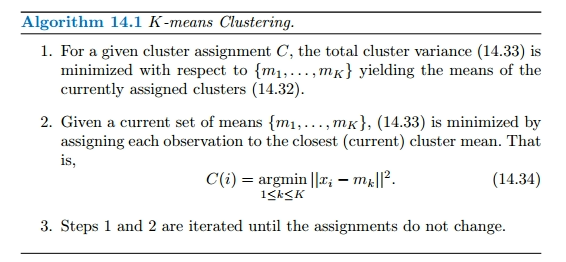
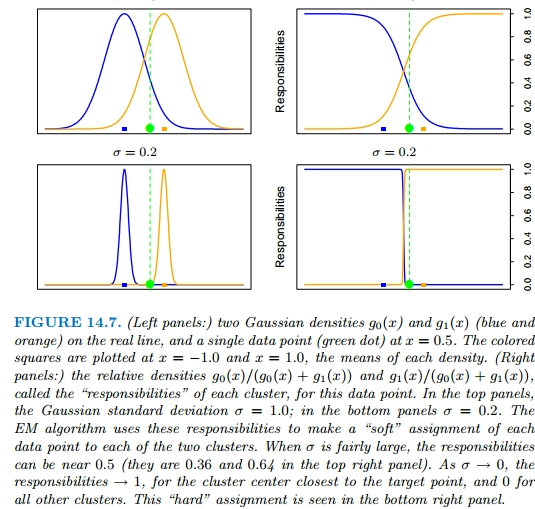
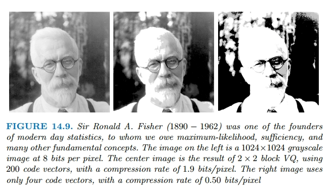
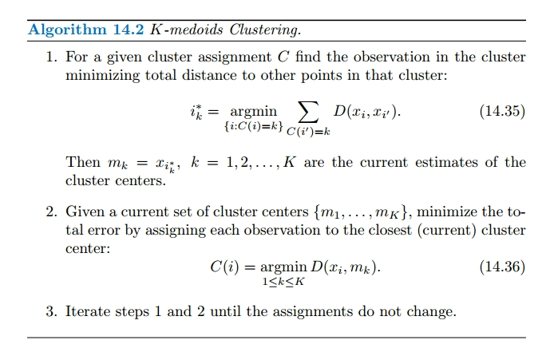
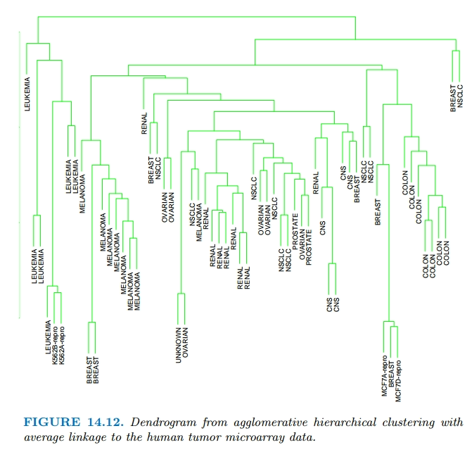
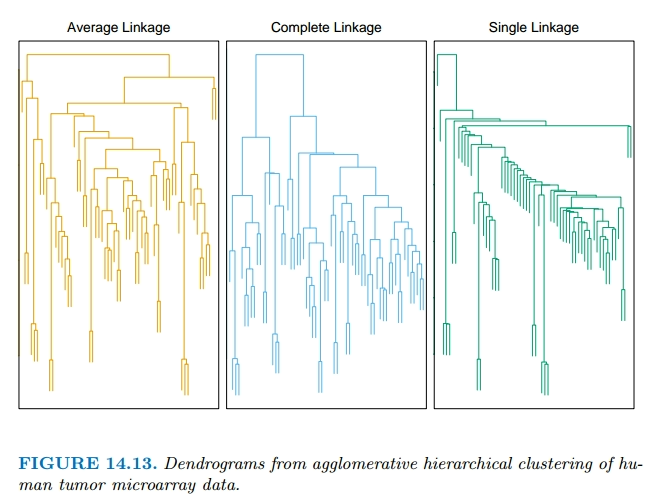

## Introduction

In this chapter we address unsupervised learning. In this case one has a set of $N$ observations $(x_1,x_2, \cdots ,x_N)$ of a random vector $X$ having joint density $\text{Pr}(X)$. The goal is to directly infer the properties of this probability density without the help of a supervisor or
teacher providing correct answers or degree-of-error for each observation.

Principal components, multidimensional scaling, self-organizing maps, and principal curves try to find simpler patterns in complex data. They look for lower-dimensional structures in the data that capture where most of the data points lie. By doing this, they help us understand how variables are related to each other and if they can be thought of as being controlled by a smaller group of underlying factors.

Cluster analysis looks for groups or clusters in the data that are like little "bumps" or "peaks" where the data is most concentrated, that is convex regios of the $X$-space that contain modes of $\text{Pr}(X)$. It helps us see if the data can be divided into different types or categories. Mixture modeling aims for the same thing. Association rules try to find simple rules or patterns that describe where the data is most concentrated, especially when dealing with data that has many features and is either present or absent (binary-valued).

In unsupervised learning, where we don't have clear outcomes to compare against. We often have to rely on guesswork and intuition to decide if the results make sense or not. This uncertainty has led to many different methods being proposed, but ultimately, it's hard to know for sure which one is the best since there's no straightforward way to check their effectiveness.

## Cluster Analysis

### Proximity Matrices

Sometimes the data is represented directly in terms of the proximity (alikeness or affinity) between pairs of objects. This type of data can be represented by an $N \times N$ matrix $D$, where $N$ is the number of objects, and each element $d_{ij}$ records the proximity between the $j$th and $j$th objects. This matrix is then provided as input to the clustering algorithm.

Most algorithms assume symmetric dissimilarity matrices, so if the original matrix $D$ is not symmetric it must be replaced by $\frac{(D + D^T)}{2}$.

### Dissimilarities Based on Attributes

Since most of the popular clustering algorithms take a dissimilarity matrix as their input, we must first construct pairwise dissimilarities between the observations. By far the most common
choice is squared distance:

$$
\begin{aligned}
d_j(x_{ij}, x_{i'j}) = (x_{ij} - x_{i'j})^2
\end{aligned}
$$

where $j$ denotes the attribute and $i, i'$ denotes the instance.

We first discuss alternatives in terms of the attribute type:

#### Quantitative variables

Measurements of this type of variable or attribute are represented by continuous real-valued numbers. One way to do this is by looking at the absolute difference between them:

$$
\begin{aligned}
d(x_i, x_{i'}) = l(|x_i - x_{i'}|)
\end{aligned}
$$

Alternatively, clustering can be based on the correlation

$$
\begin{aligned}
\rho (x_i, x_{i'}) = \frac{\sum_{j} (x_{ij} - \overline{x}_i)(x_{ij} - \overline{x}_i)}{\sqrt{\sum_{j} (x_{ij} - \overline{x}_i)^2 \sum_j(x_{ij} - \overline{x}_i)^2}}
\end{aligned}
$$

#### Ordinal Variables

Error measures for ordinal variables are generally defined by replacing their $M$ original values with:

$$
\begin{aligned}
\frac{i - \frac{1}{2}}{M}, i = 1, \cdots, M
\end{aligned}
$$

in the prescribed order of their original values. They are then treated as quantitative variables on this scale.

#### Categorical variables

If the variable assumes $M$ distinct values, these can be arranged in a symmetric $M \times M$ matrix with elements:

$$
\begin{aligned}
m_{ij} = \begin{cases}
0 & x_{i} = x_{j} \\
1 & x_{i} \neq x_{j} \\
\end{cases}
\end{aligned}
$$

### Object Dissimilarity

Next we define a procedure for combining the $p$-individual attribute dissimilarities $d_j(x_{ij},x_{i'j}), j = 1,2, \cdots, p$ into a single overall measure of dissimilarity $D(x_i, x_i')$.

This is nearly always done by means of a weighted average:

$$
\begin{aligned}
D(x_i, x_{i'}) = \sum_{j=1}^p w_j d_j(x_{ij}, x_{i'j})
\end{aligned}
$$

where:

$$
\begin{aligned}
\sum_{j=1}^p w_j = 1
\end{aligned}
$$

Here $w_j$ is a weight assigned to the $j$th attribute regulating the relative influence of that variable in determining the overall dissimilarity between objects.

If the goal is to discover natural groupings in the data, some attributes may exhibit more of a grouping tendency than others. Variables that are more relevant in separating the groups should be assigned a higher influence in defining object dissimilarity. Giving all attributes equal influence
in this case will tend to obscure the groups to the point where a clustering algorithm cannot uncover them.

Specifying an appropriate dissimilarity measure is far more important in obtaining success with clustering than choice of clustering algorithm.

### Clustering Algorithms

Clustering algorithms fall into three distinct types:

- **Combinatorial algorithms**: work directly on the observed data with no direct reference to an underlying probability model.
- **Mixture modeling**: supposes that the data is an i.i.d sample from some population described by a probability density function.
- **Mode seeking**: take a nonparametric perspective, attempting to directly estimate distinct modes of the probability density function

#### Combinatorial Algorithms

Each observation is uniquely labeled by an integer $i \in {1, \cdots, N}$. One seeks the particular encoder $C^*(i)$ that assigns the $i$th observation to the $k$th cluster that satisfies the required goal based on the dissimilarities $d(x_i, x_{i'})$. The "parameters" of the procedure are the individual cluster assignments for each of the $N$ observations. These are adjusted so as to minimize a "loss" function.

Since the goal is to assign close points to the same cluster, a natural loss function would be:

$$
\begin{aligned}
W(C) = \frac{1}{2} \sum_{k=1}^K \sum_{C(i) = k}\sum_{C(i') = k} d(x_i, d_{i'})
\end{aligned}
$$

This measure tells us how close together the things in the same group are. It is sometimes referred to as the "within cluster" point scatter. The total point scatter is given by:

$$
\begin{aligned}
T = \frac{1}{2} \sum_{i=1}^N\sum_{i'=1}^N d_{ii'} = \frac{1}{2}\sum_{k=1}^K\sum_{C(i) = k} \left(\sum_{C(i') = k} d_{ii'} +  \sum_{C(i') \neq k} d_{ii'}\right)
\end{aligned}
$$

This basically divides, for each $i$th instance on cluster $k$, so $C(i) = k$, the distances into two categories, distances to instances on the same cluster $\sum_{C(i') = k} d_{ii'}$, and distances to instances on a different cluster $\sum_{C(i') \neq k} d_{ii'}$. That is:

$$
\begin{aligned}
T = W(C) + B(C)
\end{aligned}
$$

where $B(C)$ is the between-cluster point scatter:

$$
\begin{aligned}
B(C) = \frac{1}{2} \sum_{k=1}^K \sum_{C(i) = k} \sum_{C(i')\neq k} d_{ii'}
\end{aligned}
$$

So, minimizing $W(C)$ is equivalent to maximizing $B(C)$ given $W(C) = T - B(C)$.

Cluster analysis by combinatorial optimization is straightforward in principle. One simply minimizes $W$ or equivalently maximizes $B$ over all possible assignments of the $N$ data points to $K$ clusters. Unfortunately, such optimization by complete enumeration is feasible only for very small data sets.

For this reason, practical clustering algorithms are able to examine only a very small fraction of all possible encoders $k = C(i)$. The goal is to identify a small subset that is likely to contain the optimal one, or at least a good suboptimal partition. Such feasible strategies are based on iterative greedy descent. An initial partition is specified. At each iterative step, the cluster assignments are changed in such a way that the value of the criterion is improved from its previous value. Clustering algorithms of this type differ in their prescriptions for modifying the cluster assignments at each iteration. When the prescription is unable to provide an improvement, the algorithm terminates with the current assignments as its solution. However, these algorithms converge to local optima which may be highly suboptimal when compared to the global optimum.

#### K-Means

The K-means algorithm is one of the most popular iterative descent clustering methods, which uses the squared Euclidean distance. So the within point-scatter can be written as:

$$
\begin{aligned}
W(C) = \frac{1}{2} \sum_{k=1}^K\sum_{C(i) = k}\sum_{C(i')=k} ||x_i - x_{i'}||^2
\end{aligned}
$$

$$
\begin{aligned}
= \sum_{k=1}^K N_k \sum_{C(i) = k} ||x_i - \overline{x}_k||^2
\end{aligned}
$$

where $\overline{x}_k$ is the mean vector associated with the $k$th cluster and $N_k = \sum_{i=1}^N I(C(i) = k)$ is the number of instances on the $k$th cluster. Therefore the goal is to group the $N$ observations into $K$ clusters in a way that minimizes the average difference between each observation and the mean of its cluster.

$$
\begin{aligned}
C^* \min_{C} \sum_{k=1}^K N_k \sum_{C(i) = k} ||x_i - \overline{x}_k||^2
\end{aligned}
$$

can be obtained by noting that for any set of observations $S$:

$$
\begin{aligned}
\overline{x}_S = \arg \min_{m} \sum_{i \in S} ||x_i - m||^2
\end{aligned}
$$

That is we defined the centroid for $S$ as the point $m$ that minimizes the sum of distances for each instance on $S$. Hence we can obtain $C^*$ by solving the enlarged optimization problem:

$$
\begin{aligned}
\min_{\{C, m_k\}^K_1} \sum_{k=1}^K N_k \sum_{C(i) = k} ||x_i - m_k||^2
\end{aligned}
$$

Where for each cluster $k$, we search for the encoder $C$ and the optimal centroid $m_k$. Thus the optmimization process can be performed in two steps as seen in Algorithm 14.1. On (1) we obtain the optimal centroids $m_i, i = 1, \cdots, K$, and on (2) we try to find the best encoder $C$ given the set of centroids $\{m_1, \cdots, m_K\}$.

#### Gaussian Mixtures as Soft K-means Clustering

The K-means clustering procedure is closely related to the EM algorithm for estimating a certain Gaussian mixture model.

The E-step of the EM algorithm assigns "responsibilities" for each data point based in its relative density under each mixture component (cluster). While the M-step recomputes the component density parameters based on the current responsibilities. Where the relative density is a monotone function of the euclidean distance between the data point and the mixture center. Hence in this setup EM is a "soft" version of K-means clustering, making probabilistic (rather than deterministic) assignments of points to cluster centers.

As $\sigma^2$ tends to $1$, these probabilities become $0$ and $1$, and the two methods coincide:

#### Vector Quantization

Vector quantization (VQ) is a technique used in data compression, particularly in the compression of digital signals or images. It involves representing a large set of data points (vectors) by a smaller set of representative values, called codewords or centroids. These centroids are selected from the original data set and are used to approximate the original data. By replacing groups of similar data points with these representative values, vector quantization can significantly reduce the amount of data needed to represent the information while minimizing the loss of quality.

In this example of vector quantization, given an image of $1024\times 1024$ pixels we start by dividing the image into small blocks of $2\times 2$. Each block, which contains four pixels, is treated like a tiny picture of its own. Each of the $512 \times 512$ blocks of four numbers is regarded as vector in $\mathbb{R}^4$. Then, using K-means clustering, we group these blocks together based on their similarity.

The clustering process is called the **encoding step**, and the collection of centroids is called the **codebook**. Why do we expect VQ to work at all? The reason is that for typical everyday images like photographs, many of the blocks look the same. What we have described is known as lossy compression, since our images are degraded versions of the original.

#### K-Medoids

The K-Means algorithm can be generalized for use with arbitrarily defined dissimilarities $D(x_i, x_{i'})$. The process of finding the centers of the clusters stays similar, but the way we measure similarity can change. This makes the algorithm versatile and applicable to various types of data. This gives way to the K-medoids algorithm:

#### Practical Issues

In order to apply K-means or K-medoids one must select the number of clusters $K^*$ and an initialization.

The latter can be defined by specifying an initial set of centers $\{m_1,\cdots,m_K\}$ or $\{i_1, \cdots,i_K\}$ or an initial encoder $C(i)$. A choice for the number of clusters $K$ depends on the goal. For data segmentation $K$ is usually defined as part of the problem.

Data-based methods for estimating $K^*$ typically examine the withincluster dissimilarity $W_K$ as a function of the number of clusters $K$. The corresponding values generally decrease with increasing $K$. Thus cross-validation techniques, so useful for model selection in supervised learning, cannot be utilized in this context.

As we increase the number of clusters, the solution quality will improve because more natural groups will be captured separately. So, if we keep adding more clusters beyond the true number ($K > K^*$), some estimated clusters will start to split the real groups. However, splitting a group that's already close together won't improve the solution as much as properly separating two distinct groups.

To the extent this scenario is realized, there will be a sharp decrease in successive differences in criterion value, $W_K − W_{K+1}$, at $K = K^**$. That is, $\{W_K − W_{K+1} |K < K^**\} \geq \{W_K − W_{K+1} |K \geq K^**\}$. An estimate $\hat{K}**$ for $K^*$ is then obtained by identifying a “kink” in the plot of $W_K$ as a function of $K$.

The recently proposed Gap statistic compares the shape of a curve based on our data to a curve we'd get if the data were spread out evenly. We're looking for a point where there's a big gap between these two curves. This point tells us the best number of clusters for our data. If $G(K)$ is the Gap curve at $K$ clusters, the formal rule for estimating $K^*$ is:

$$
\begin{aligned}
K^* = \text{argmin}_{K} \{K | G(K) \geq G(K + 1 - s'_{K + 1}) \}
\end{aligned}
$$

where $s_K$ is the standard deviation. The following figure shows and example on how to choose the optimal number of clusters:

#### Hierarchical Clustering

As the name suggests, they produce hierarchical representations in which the clusters at each level of the hierarchy are created by merging clusters at the next lower level. At the lowest level, each cluster contains a single observation. At the highest level there is only one cluster containing all of the data.

Strategies for hierarchical clustering divide into two basic paradigms: agglomerative (bottom-up) and divisive (top-down). Each level of the hierarchy represents a particular grouping of the data into disjoint clusters of observations. The entire hierarchy represents an ordered sequence of such groupings. It is up to the user to decide which level (if any) actually represents a "natural" clustering

A dendrogram provides a highly interpretable complete description of the hierarchical clustering in a graphical format. Cutting the dendrogram horizontally at a particular height partitions the data into disjoint clusters represented by the vertical lines that intersect it. The height at which we cut represents the level of similarity required to form a cluster. Generally, groups that merge at higher levels in the dendrogram are considered more significant clusters. However, it's essential to be cautious when interpreting dendrograms because different clustering methods or slight changes in the data can lead to different dendrogram structures.

Also, dendrogram interpretations are only valid if the data truly exhibits the hierarchical structure imposed by the clustering algorithm. This can be assesed using the _cophenetic correlation coefficient_, it measures the correlation between the _cophenetic dissimilarities_ $C_{ii'}$ and the distances between observations in the original data $d_{ii'}$. The _cophenetic dissimilarity_ $C_{ii'}$ between two observations $(i, i')$ is the intergroup dissimilarity at which observations $i$ and $i'$ are first joined together in the same cluster.

##### Agglomerative Clustering

Agglomerative clustering starts with each observation as its own cluster. Then, at each step, it merges the two closest clusters together until there's only one big cluster left. To measure dissimilarity between two clusters, let's call them $G$ and $H$. We look at all the pairs of observations, one from $G$ and one from $H$, and find the dissimilarity between them.

_Single linkage_ (SL) or nearest neighbour agglomerative clustering chooses the closest pair of observations between the two clusters as the measure of dissimilarity between the clusters:

$$
\begin{aligned}
d_{SL}(G, H) = \min_{i \in G, i' \in H} d_{ii'}
\end{aligned}
$$

_Complete linkage_ (CL) or furthest-neighbor technique agglomerative clustering measures the dissimilarity between two clusters as the distance the pair of observations that are the farthest apart.

$$
\begin{aligned}
d_{CL}(G, H) = \max_{i \in G, i' \in H} d_{ii'}
\end{aligned}
$$

_Group average_ (GA) clustering uses the average dissimilarity between the groups:

$$
\begin{aligned}
d_{GA}(G, H) = \frac{1}{N_G N_H} \sum_{i \in G} \sum_{i \in H} d_{ii'}
\end{aligned}
$$

where $N_G$ and $N_H$ are the respective number of observations in each group.

If the data shows clear clusters that are close together and distinct from each other, all three methods—single linkage, complete linkage, and average linkage—will give similar results. However, if the data doesn't exhibit this pattern, the results of the three methods will differ. Single linkage tends to join clusters even if just one pair of observations is close together, which can lead to long chains of connections between clusters. This phenomenon is known as _chaining_.

Complete linkage will tend to produce compact clusters with small diameters because it considers two groups close only if all the observations in their combined set are similar. Sometimes it may violate the rule that observations within a cluster should be closer to each other than to observations in other clusters.

Group average clustering strikes a balance between single and complete linkage. It tries to make clusters compact while keeping them relatively far apart. However, its outcome can be affected by how the dissimilarities between observations are measured. Changing the measurement scale can change the clustering result. In contrast, single and complete linkage methods are not affected by such changes in scale.

##### Divisive Clustering

Divisive clustering starts with the entire dataset as one cluster and then splits it into smaller clusters step by step. This method isn't as widely studied as agglomerative clustering, but it has been explored, especially in engineering contexts like compression.

One potential advantage of divisive clustering is when you want to divide the data into only a few clusters. Divisive methods can be used recursively with techniques like K-means or K-medoids to split clusters into smaller ones. However the way you begin the splitting process at each step can influence the final outcome.

A method has been developed to overcome this limitations. The divisive algorithm, proposed by Macnaughton Smith et al. (1965), is defined as:

1. Puts all observations in one big cluster called $G$.
2. It picks the observation that's farthest on average from all the others and makes it the first member of a new cluster called $H$.
3. At each successive step that observation in $G$ whose average distance from those in $H$, minus that for the remaining observations in $G$ is largest, is transferred to $H$.
4. This continues until there are no more observations in $G$ that are closer to those in $H$.

This splitting procedure is repeated for each new cluster formed at the previous level, creating a hierarchical structure. Kaufman and Rousseeuw (1990) suggest choosing the cluster with the largest diameter for splitting at each level, but another option is to pick the one with the largest average dissimilarity among its members.

## Evaluation Metrics

### Formal Limitations of Clustering

Jon Kleinberg proposes three axioms that highlight the characteristics that a grouping problem should exhibit and can be considered "good".

1. **Scale Invariance**: indicates that a clustering algorithm should not modify its results when all distances between points are scaled by the factor determined by a constant $\alpha$.
2. **Richness**: the clustering function must be flexible enough to produce any arbitrary partition/clustering of the input data set.
3. **Consistency**: the clustering results do not change if the distances within clusters decrease and/or the distances between clusters increase.

Given the above three axioms, Kleinberg proves the following theorem: For every $n \geq 2$, there is no clustering function $f$ that satisfies scale invariance, richness, and consistency. Since the three axioms cannot hold simultaneously, clustering algorithms can be designed to violate one of the axioms while sarisfying the other two.

- $k$-cluster stopping condition: Stop merging clusters when we have $k$ clusters (violates the richness axiom).
- Distance $r$ stopping condition: Stop merging clusters when the nearest pair of clusters are farther than $r $ (violates scale invariance).
- Scale-$\epsilon$ stopping condition: Stop merging clusters when the nearest pair of clusters are farther than a fraction $\epsilon$ the maximum pairwise distance $\Delta$. (consistency is violated).

### Methods for Clustering Evaluation

When analyzing clustering results, several aspects must be taken into account for the validation of the algorithm results:

- Determining the clustering tendency in the data (i.e. whether non-random structure really exists).
- Determining the correct number of clusters.
- Assessing the quality of the clustering results without external information.
- Comparing the results obtained with external information.
- Comparing two sets of clusters to determine which one is better.

The first three issues are addressed by **internal or unsupervised validation**, because there is no use of external information. The fourth issue is resolved by **external or supervised validation**. Finally, the last issue can be addressed by both supervised and unsupervised validation techniques.

#### Null Hypothesis Testing

One of the desirable characteristics of a clustering process is to show whether data exhibits some tendency to form actual clusters. In this case, the null hypothesis $H_0$ is the randomness of data and, when the null hypothesis is rejected, we assume that the data is significantly unlikely to be random.

One of the difficulties of null hypothesis testing in this context is determining the statistical distribution under which the randomness hypothesis can be rejected. Jain and Dubes propose three alternatives:

- Random plot hypothesis $H_0$: all proximity matrices of order $n \times n$ are equally likely.
- Random label hypothesis $H_0$: all permutations of labels of $n$ objects are equally likely.
- Randon position hypothesis $H_0$: all sets of $n$ locations is some region of a $d$-dimensional space are equally likely.

### Internal Validation

Internal validation methods (or internal indices) make it possible to establish the quality of the clustering structure without having access to external information. In general, two types of internal validation metrics can be combined:

- Cohesion measures: evaluates how closely the elements of the same cluster are to each other.
- Separation measures: quantify the level of separation between clusters.

Internal indices are usually employed in conjunction with two clustering algorithm families: hierarchical clustering algorithms and partitional algorithms. For partitional algorithms, metrics based on the proximity matrix, as well as metrics of cohesion and separation, such as the silhouette coefficient, are often used. For hierarchical algorithms, the cophenetic coefficient is the most common.

#### Partitional Methods

In general, the internal validation value of a set of $K$ clusters can be decomposed as the sum of the validation values for each cluster:

$$
\begin{aligned}
\text{general validity} = \sum_{i=1}^K w_i \text{validity}(C_i)
\end{aligned}
$$

This measure of validity can be cohesion, separation, or some combination of both. Quite often, the weights that appear in the previous expression correspond to cluster size. The individual measures of cohesion and separation are defined as follows:

$$
\begin{aligned}
\text{cohesion}(C_i) = \sum_{x \in C_i, y \in C_i} \text{proximity}(x, y)
\end{aligned}
$$

$$
\begin{aligned}
\text{separation}(C_i, C_j) = \sum_{x \in C_i, y \in C_j} \text{proximity}(x, y)
\end{aligned}
$$

It should be noted that the cohesion metric defined above is equivalent to the cluster SSE [Sum of Squared Errors]:

$$
\begin{aligned}
SSE(C_i) = \sum_{x \in C_i} d(c_i, x)^2 = \frac{1}{2m_i} \sum_{x \in C_i} \sum_{y \in C_i} d(x, y)^2
\end{aligned}
$$

Likewise, we can maximize the distance between clusters using a separation metric. This approach leads to the between group sum of squares, or SSB:

$$
\begin{aligned}
SSB = \sum_{i = 1}^K m_i d(c_i, c)^2 = \frac{1}{2K} \sum_{i=1}^K \sum_{j = 1}^K \frac{m}{K} d(c_i, c_j)^2
\end{aligned}
$$

where $c_i$ is the mean of the $i$th cluster and $c$ is the overall mean.

Instead of dealing with separate metrics for cohesion and separation, there are several metrics that try to quantify the level of separation and cohesion in a single measure:

- The Calisnki-Harabasz coefficient: it is a measure based on the internal dispersion of clusters and the dispersion between clusters. We would choose the number of clusters that maximizes the CH.

$$
\begin{aligned}
CH = \frac{\frac{SSB_M}{M - 1}}{\frac{SSE_M}{M}}
\end{aligned}
$$

- The Dunn index is the ratio of the smallest distance between data from different clusters and the largest distance between clusters. Again, this ratio should be maximized:

$$
\begin{aligned}
D = \min_{1 < i < k} \left\{\min_{1 < j < k, i\neq j} \left\{\frac{\delta (C_i, C_j)}{\max_{1 < l < k} \{\Delta (C_l)\}}\right\}\right\}
\end{aligned}
$$

- The Xie-Beni score was designed for fuzzy clustering, but it can applied to hard clustering. It is a ratio whose numerator estimates the level of compaction of the data within the same cluster and whose denominator estimates the level of separation of the data from different clusters:

$$
\begin{aligned}
XB = \frac{\sum_{i=1}^N \sum_{k=1}^M u^2_{ik} ||x_i - C_k||^2}{N_{t \neq s} \min (||C_t - C_s||^2)}
\end{aligned}
$$

- The Ball-Hall index is a dispersion measure based on the quadratic distances of the cluster points with respect to their centroid

$$
\begin{aligned}
BH = \frac{SSE_M}{M}
\end{aligned}
$$

- The Hartigan index is based on the logarithmic relationship between the sum of squares within the cluster and
  the sum of squares between clusters:

$$
\begin{aligned}
H = \log \left(\frac{SSB_M}{SSE_M}\right)
\end{aligned}
$$

- The Xu coefficient takes into account the dimensionality $D$ of the data, the number $N$ of data examples, and the sum of squared errors $SSE_M$ form $M$ clusters:

$$
\begin{aligned}
X_u = D \log_2 \left(\sqrt{\frac{SSE_M}{DN^2}}\right) + \log M
\end{aligned}
$$

- The silhouette coefficient is the most common way to combine the metrics of cohesion and separation in a single measure. Its computation is divided into four steps:
  1. Compute the average intracluster distance for each example $i$: $a(i) = \frac{1}{|C_a|} \sum_{j \in C_a, i \neq j} d(i, j)$
  2. Compute the minimum intercluster distance for each example $i$: $b(i) = \min_{C_b \neq C_a} \frac{1}{|C_b|} \sum_{j \in C_b} d(i, j)$
  3. Compute the silhouette coefficient for each example $i$: $s(i) = \frac{b(i) - a(i)}{max(a(i), b(i))}$
  4. Compute the silhouette puntuation as the average of the silhouette coefficients: $S = \frac{1}{n} \sum_{i = 1}^n s(i)$

The silhouette is defined in the interval $[-1, 1]$. Positive values indicate a high separation between clusters, negative values are an indication that the clusters are mixed with each other. When the silhouette
coefficient is zero, it is an an indication that the data are uniformly distributed throughout the Euclidean space.

Unfortunately, one of the main drawbacks of the silhouette coefficient is its high computational complexity.

Cohesion and separation metrics are not the only validation method available for partitional clustering techniques. In fact, cohesion and separation metrics do not perform well when it comes to analyzing results obtained by algorithms based on density analysis.

One way to validate clustering is by comparing the actual proximity matrix with an ideal version based on the provided clustering by the algorithm. If we reorder rows and columns so that all examples of the same cluster appear together, the ideal proximity matrix has a block diagonal structure. High correlation between the actual and ideal proximity matrices indicates that examples in the same cluster are close to each other, although it may not be a good measure for density-based clustering.

Imagine you have a table where each row and column represents a data point, and the cells contain numbers indicating how similar or close those data points are to each other. Now, if you group similar data points together into clusters, you can rearrange the rows and columns of the table so that all the data points within each cluster are together. When you do this, the table will have a diagonal pattern where each cluster forms a block of closely related data points. This diagonal pattern is what we mean by a "block diagonal structure" in the context of a proximity matrix.

Unfortunately, the mere construction of the whole proximity matrix is computationally expensive.

#### Hierarchical Methods

##### Cophenetic Correlation Coefficient

The cophenetic distance between two examples is the proximity at which an agglomerative hierarchical clustering algorithm puts the examples in the same cluster for the first time. The cophenetic correlation coefficient (CPCC) is defined as he correlation between the entries of the cophenetic matrix $P_c$ containing cophenetic distances, and the proximity matrix $P$, containing similarities. The cophenetic correlation coefficient is then defined as:

$$
\begin{aligned}
\text{CPCC} = \frac{\sum_{i < j} (d_{ij} - \overline{d})(d_{ij}^** - \overline{d}^**)}{\sqrt{\sum_{i < j} (d_{ij} - \overline{d})^2 \sum_{i < j}(d_{ij}^** - \overline{d}^**)}}
\end{aligned}
$$

where $d_{ij}$ is the distance between the example pair $(i, j)$, $d_{ij}^**$ is their cophenetic distance, $\overline{d}$ is the average of the distances in the proximity matrix and $d_{ij}^**$ is the average of the cophenetic distances in the cophenetic matrix.

$$
\begin{aligned}
\overline{d} = \frac{\sum_{i < j} d_{ij}}{2(n^2 - n)}
\end{aligned}
$$

$$
\begin{aligned}
\overline{d}^** = \sqrt{\frac{\sum_{i < j} (d_{ij} - d_{ij}^**)^2}{\sum_{i < j} (d_{ij}^*)^2}}
\end{aligned}
$$

The cophenetic correlation coefficient is a value in the interval $[−1, 1]$. High CPCC values indicate a high level of similarity between the two matrices, an indication that the clustering algorithm has been able to identify the underlying structure of its input data.

##### Hubert Statistic

First, concordance are discordance are defined for pairs of examples. A pair $(i, j)$ is concordant when $((v_{p_i} < v_{c_i}) \\& (v_{p_j} < v_{c_j}))$ or $((v_{p_i} > v_{c_i}) \\& (v_{p_j} > v_{c_j}))$. And it is said to be discordant when $((v_{p_i} < v_{c_i}) \\& (v_{p_j} > v_{c_j}))$ or $((v_{p_i} > v_{c_i}) \\& (v_{p_j} < v_{c_j}))$. Therefore, a pair is neither concordant nor discordant if $v_{p_i} = v_{c_i}$ or $v_{p_j} = v_{c_j}$.

Let $S_+$ and $S_-$ be the number of concordant and discordant pairs, respectively. Then, the Hubert coefficient is defined as:

$$
\begin{aligned}
\gamma = \frac{S_+ - S_-}{S_+ + S_-}
\end{aligned}
$$

The Hubert statistic is between $-1$ and $1$. It has been mainly used to compare the results of two hierarchical clustering algorithms. A higher Hubert $\gamma$ value corresponds to a better clustering of data.

### External Validation

External validation proceeds by incorporating additional information in the clustering validation process, i.e. external class labels for the training examples. We want to compare the result of a clustering algorithm
$C = \{C_1, C_2, \cdots, C_m\}$ to a potentially different partition of data $P = \{P_1, P_2, \cdots, P_s\}$ which might represent the expert knowledge of the analyst (his experience or intuition), prior knowledge of the data in the form of class labels, the results obtained by another clustering algorithm, or simply a grouping considered to be "correct".

In order to carry out this analysis, a contingency matrix must be built to evaluate the clusters detected by the algorithm that encompasses the following data:

- $TP$: The number of data pairs found in the same cluster, both in $C$ and in $P$.
- $FP$: The number of data pairs found in the same cluster in $C$ but in different clusters in $P$.
- $FN$: The number of data pairs found in different clusters in $C$ but in the same cluster in $P$.
- $TN$: The number of data pairs found in different clusters, both in $C$ and in $P$.

#### Matching Sets

Several measures can be defined to measure the similarity between the clusters in $C$, obtained by the clustering algorithm, and the clusters if $P$, corresponding to our prior (external) knowledge:

- Precision: $Pr = \frac{TP}{TP + FP}$
- Recall: $R = \frac{TP}{TP + FN}$
- F-measure: $F_{\alpha} = \frac{1 + \alpha}{\frac{1}{Pr} + \frac{\alpha}{R}}$

Quite often, precision and recall are evenly combined with an unweighted harmonic mean ($\alpha = 1$):

$$
\begin{aligned}
F = \frac{2 \cdot Pr \cdot R}{Pr + R}
\end{aligned}
$$

- Purity: evaluates whether each cluster contains only examples from the same class:

$$
\begin{aligned}
U = \sum_{i} p_i (\max_j \frac{p_{ij}}{p_i})
\end{aligned}
$$

where $p_i = \frac{n_i}{n}$, $p_j = \frac{n_j}{n}$ and $p_{ij} = \frac{n_{ij}}{n}$. Where $n_{ij}$ are the number of examples belonging to the class $i$ found in the cluster $j$ and $n_i$ is the number of examples in the cluster $i$.

#### Peer-to-peer Correlation

A second family of measures for external validation are based on the correlation between pairs, i.e. they seek to measure the similarity between two partitions under equal conditions, such as the result of a grouping process for the same set, but by means of two different methods $C$ and $P$.

- The Jaccard Coefficient: $J = \frac{TP}{TP + FP + FN}$
- The Rand Coefficient: $Rand = \frac{TP + TN}{M}$
- The Folkes and Mallows coefficient: $FM = \sqrt{\frac{TP}{TP + FP} \cdot \frac{TP}{TP + FN}}$
- The Hubert statistical coefficient: $\Gamma = \frac{1}{M} \sum_{i=1}^{n - 1} \sum_{j = i + 1}^{n} X_{ij} Y_{ij}$

Where $n_{ij}$ are the number of examples belonging to the class $i$ found in the cluster $j$ and $n_i$ is the number of examples in the cluster $i$.

#### Measures Based on Information Theory

This family includes basic measures such as entropy and mutual information, as well as their respective normalized variants.

- Entropy: $H = - \sum_{i} p_i \left(\sum_{j} \frac{p_{ij}}{p_i} \log \frac{p_{ij}}{p_i}\right)$
- Mutual Information: $MI = \sum_{i} \sum_{j} p_{ij} \log \frac{p_{ij}}{p_i p_j}$

Where $p_{ij} = \frac{n_{ij}}{n}$ and $p_i = \frac{n_i}{n}$.

### Hyperparameter Tuning

Even though external validation metrics can help us evaluate whether the obtained clusters closely match the underlying categories in the training data, which the clustering algorithm tries to identify without externally-provided class labels, those metrics cannot address other issues such as the right number of clusters for our current data set.

Hyperparameter tuning tries to determine, for the different possible values of the parameters in $P_{alg}$ , which set of parameter values is the most suitable for our particular clustering problem. We could proceed in the following way:

- When the algorithm does not include the number of clusters $n_c$ among its parameters, we run the algorithm with different values for its parameters so that we can determine their largest range for which $n_c$ remains constant. Later, we choose as parameter values the values in the middle of this range.
- When the algorithm parameters Palg include the desired number of clusters $n_c$, we run the algorithm for a range of values for $n_c$. For each value of $n_c$, we run the algorithm multiple times using different sets of values (i.e. starting from different initial conditions) and choose the value that optimizes our desired validation metric.

When we just want to determine the “right” number of clusters, $n_c$, plotting the validation results for different values of $n_c$ can sometimes show a relevant change in the validation metric, commonly referred to as a "knee" or "elbow".

Hyperparameter tuning can then be seen as a combinatorial optimization problem using different strategies:

- Grid Search: is based on a systematic exploration of the hyperparameter space.
- Random Search: chooses parameter configurations at random.
- Smart Search techniques try to optimize the problem of searching for hyperparameter values. Different strategies can be implemented, such as Bayesian optimization using Gaussian processes and evolutionary optimization using genetic algorithms or evolution strategies.
