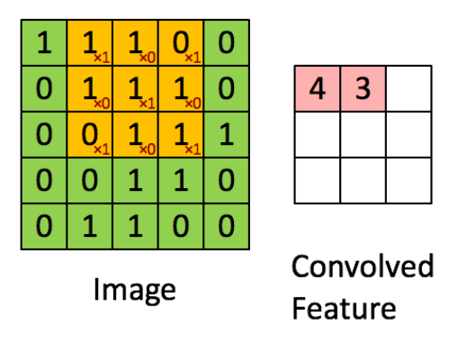
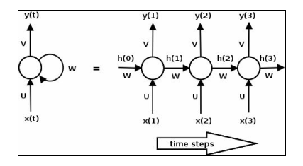
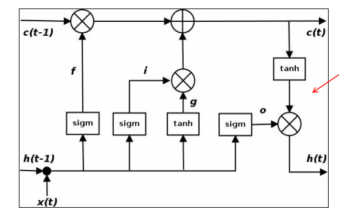
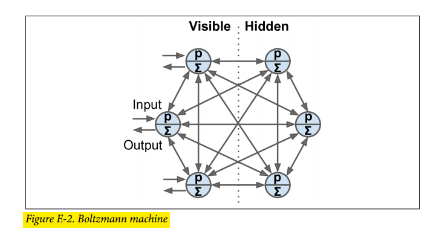
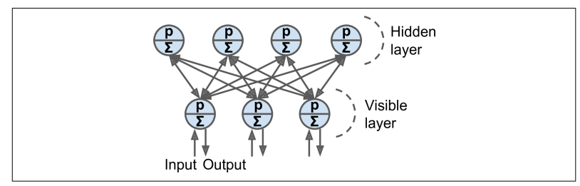
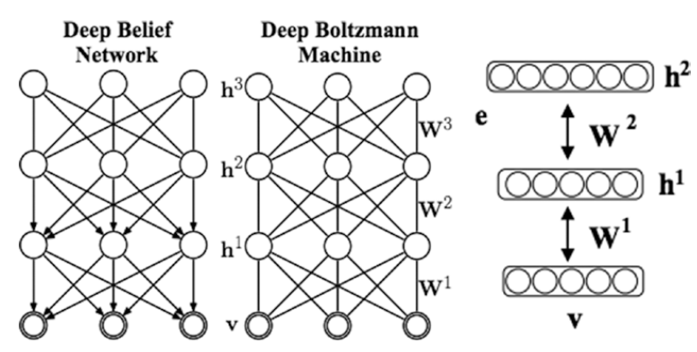
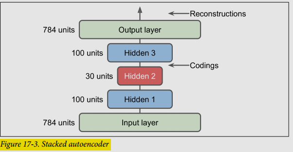
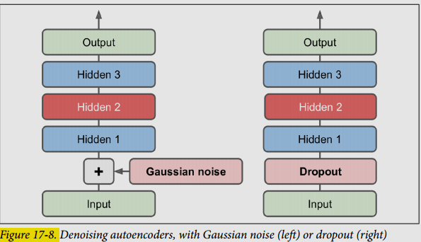
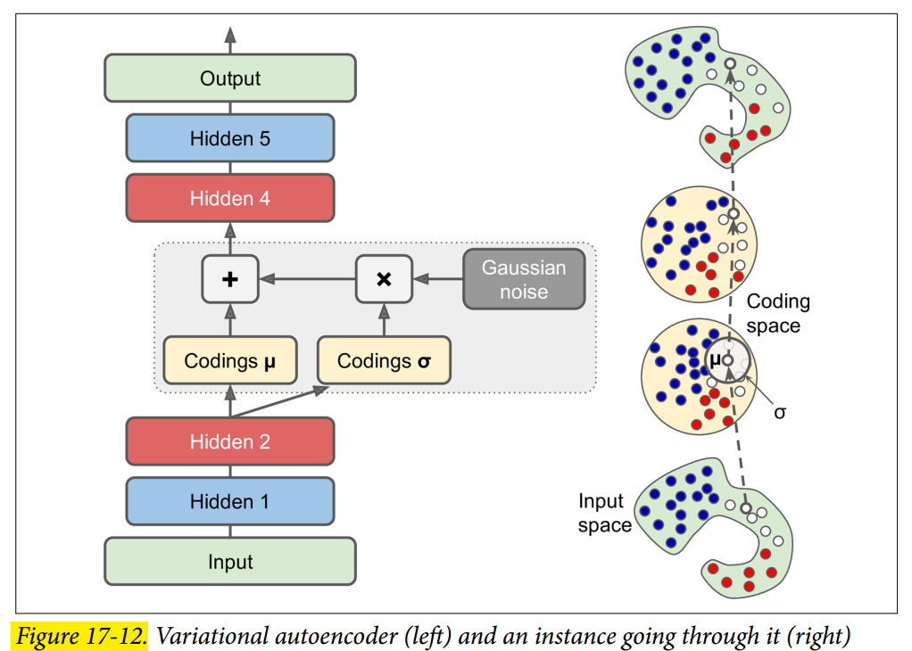

## Convolutional Nets

### Deep convolutional neural network

A deep convolutional neural network (DCNN) consists of many neural network layers.

Two different types of layers, **convolutional** and **pooling**, are typically alternated

### Local receptive fields

If we want to preserve spatial information, we represent each image with a matrix of pixels.

**Convolution operation**: To **encode the local structure** is to connect a **submatrix of adjacent input neurons** (pixels) into one single hidden neuron belonging to the next layer. That single hidden neuron represents one **local receptive field**.

We can encode more information by having **overlapping submatrices**.

A **feature map** is the result of applying the convolution on the input data, on the previous example the matrix on the right would be one feature map.

The **kernel size** is the size of each the submatrices, in the previous example $3 \times 3$.

The **stride** is the number of elements between each submatrix. With a stide of $1$ we obtain the following result:

This convolutional layer is usually followed by a non-linear activation function (e.g. ReLU).

### Shared weights and bias

To detect the same feature independently from its location on the input we define the same weights for all the neurons on a layer. This way we force the neural net to search for relevant features everywhere on the input data, instead of searching for features on specific places on the input image.

### Pooling Layer

It consists on using the spatial contiguity of the output from a single feature map and **aggregate the values into a single output**. On the following image **max pooling** is being performed.

Other common pooling operation is **average pooling**.

### An example of DCNN — LeNet

It is a family of ConvNets trained for recognizing MNIST handwritten characters with robustness to simple geometric transformations and to distortion.

It is defined as follows:

- On the **low-layers** we alternate **convolution operations** with **max-pooling operations**. (using carefully chosen local receptive fields and and shared weights).
- On higher levels are fully connected layers based on a traditional **MLP with hidden layers** and **softmax** as the output layer.

### Understanding the power of deep learning

Deep networks always outperform the simple network and the gap is bigger when the number of examples provided for training is progressively reduced.

## Recurrent Neural Nets

### SimpleRNN cells

RNN cells incorporate this dependence by having a **hidden state**, or memory. The value of the hidden state is a function of the value of the hidden state at the previous time step and the value of the input at the current time step.

$$
\begin{aligned}
h_t = \phi(h_{t-1}, x_t)
\end{aligned}
$$

where $h_t$ and $h_{t-1}$ are the values of the hidden states at the time steps $t$ and $t-1$ and $x_t$ is the values of the input at time $t$. **Note that the equation is recursive**

At time $t$ the cell has an input $x_t$ and an output $y_t$. Part of the output $y_t$ (the hidden state $h_t$) is fed back into the cell for use at a later time step $t+1$. On the previous image we show the behaviour of a single cell unrolled.

Notice that the weight matrices $U$, $V$, and $W$ are shared across the steps. We can also describe the computations within an RNN in terms of equations:

$$
\begin{aligned}
h_t = tanh(Wh_{t-1} + Ux_t)
\end{aligned}
$$

$$
\begin{aligned}
y_t = sofmax(Vh_t)
\end{aligned}
$$

### RNN topologies

RNNs can be arranged in many ways to solve specific problems.

In the basic topology, all input sequences are of the same length and an output is produced at each time step.

Another example of a many to many RNN could be a machine translation network shown on the **many-to-many** topology. These take in a sequence and produces another sequence. For example, the input could be a sequence in English and the output could be the translation in Spanish.

Other variants are the **one-to-many network**, an example of which could be an image captioning network, where the input is an image and the output a sequence of words.

Similarly, an example of a **many-to-one network** could be a network that does sentiment analysis of sentences, where the input is a sequence of words and the output is a positive or negative sentiment.

### Vanishing and exploding gradients

Training the RNN involves backpropagation, where the gradient at each output depends not only on the current time step, but also on the previous ones, this process is called **backpropagation through time** (BPTT).

During backpropagation (shown by dotted lines), the gradients of the loss with respect to the parameters $U$, $V$, and $W$ are computed at each time step and the parameters are updated with the sum of the gradients.

The following equation shows the gradient of the loss with respect to $W$:

$$
\begin{aligned}
\frac{\delta L}{\delta W} = \sum_t \frac{\delta L_t}{\delta W}
\end{aligned}
$$

Let us now look at what happens to the gradient of the loss at the last time step ($t=3$)

$$
\begin{aligned}
\frac{\delta L_3}{\delta W} = \frac{\delta L_3}{\delta y_3} \frac{\delta y_3}{\delta h_2} \frac{\delta h_2}{\delta_W}
\end{aligned}
$$

The previous equation is simply deriving by applying the chain rule, where:

1. The loss function $L_3$ is defined as a function of $y_3$,
2. Then $y_3 = softmax(Vh_2)$
3. And finally $h_2 = tanh(Wh_1 + Ux_1)$

The gradient of the hidden state $h_2$ with respect to $W$ can be further decomposed as the sum of the gradient of each hidden state with respect to the previous one.

$$
\begin{aligned}
\frac{\delta L_3}{\delta W} = \sum_{t=0}^2 \frac{\delta L_3}{\delta y_3} \frac{\delta y_3}{\delta h_2} \frac{\delta h_2}{\delta h_t}\frac{\delta h_t}{\delta_W}
\end{aligned}
$$

Finally, each gradient of the hidden state with respect to the previous one can be further decomposed as the product of gradients of the current hidden state against the previous one.

$$
\begin{aligned}
\frac{\delta L_3}{\delta W} = \sum_{t=0}^2 \frac{\delta L_3}{\delta y_3} \frac{\delta y_3}{\delta h_2} \left(\prod_{j=t+1}^2 \frac{\delta h_j}{\delta h_{j-1}}\right)\frac{\delta h_t}{\delta_W}
\end{aligned}
$$

For example for $t = 3$:

$$
\begin{aligned}
\frac{\delta L_4}{\delta W} = \frac{\delta L_4}{\delta y_4} \frac{\delta y_4}{\delta h_3} \left(\prod_{j=4}^2 \frac{\delta h_j}{\delta h_{j-1}}\right)\frac{\delta h_4}{\delta_W}
\end{aligned}
$$

$$
\begin{aligned}
\frac{\delta L_4}{\delta W} = \frac{\delta L_4}{\delta y_4} \frac{\delta y_4}{\delta h_3} \left(\frac{\delta h_4}{\delta h_3}\frac{\delta h_3}{\delta h_2}\frac{\delta h_2}{\delta h_1}\right)\frac{\delta h_4}{\delta_W}
\end{aligned}
$$

On general:

$$
\begin{aligned}
\frac{\delta L_i}{\delta W} = \sum_{t=0}^i \frac{\delta L_i}{\delta y_i} \frac{\delta y_i}{\delta h_{i-1}} \left(\prod_{j=t+1}^i \frac{\delta h_j}{\delta h_{j-1}}\right)\frac{\delta h_i}{\delta_W}
\end{aligned}
$$

Consider the case where the individual gradients of a hidden state with respect to the previous one is less than one. As we backpropagate across multiple time steps, the product of gradients get smaller and smaller, leading to the problem of **vanishing gradients**.

Similarly, if the gradients are larger than one, the products get larger and larger, leading to
the problem of **exploding gradients**.

The effect of vanishing gradients is that the gradients from steps that are far away do not contribute anything to the learning process, so the RNN ends up not learning long range dependencies.

While there are a few approaches to minimize the problem of vanishing gradients, such as:

1. Proper initialization of the $W$ matrix
2. Using a ReLU instead of tanh layers
3. Pre-training the layers using unsupervised methods

**The most popular solution is to use the LSTM or GRU architectures.**

### Long short term memory — LSTM

The LSTM is a variant of RNN that is capable of learning long term dependencies.

The line across the top of the diagram is the cell state c, and represents the internal memory of the unit.

The line across the bottom is the hidden state.

Also, $i$, $f$, and $o$ are the input, forget, and output gates.

The forget gate defines how much of the previous state $h_{t-1}$ you want to allow to pass through.

The input gate defines how much of the newly computed state for the current input $x_t$ you want to let through.

The output gate defines how much of the internal state you want to expose to the next layer.

The internal hidden state $g$ is computed based on the current input $x_t$ and the previous hidden state $h_{t-1}$.

Such that:

$$
\begin{aligned}
i = \sigma(W_ih_{t-1} + U_ix_t)
\end{aligned}
$$

$$
\begin{aligned}
f = \sigma(W_fh_{t-1} + U_fx_t)
\end{aligned}
$$

$$
\begin{aligned}
o = \sigma(W_oh_{t-1} + U_ox_t)
\end{aligned}
$$

$$
\begin{aligned}
g = \tanh(W_gh_{t-1} + U_gx_t)
\end{aligned}
$$

$$
\begin{aligned}
c_t = (c_{t-1} \otimes f) \oplus (g \otimes i)
\end{aligned}
$$

$$
\begin{aligned}
h_t = tanh(c_t) \otimes o
\end{aligned}
$$

One thing to realize is that an LSTM is a drop-in replacement for a SimpleRNN on the recurrent neural network.

### Gated recurrent unit — GRU

This type of cell has two gates, an **update gate** $z$, and a **reset gate** $r$.

The update gate defines how much previous memory to keep around.

The reset gate defines how to combine the new input with the previous memory.

The following equations define the gating mechanism in a GRU:

$$
\begin{aligned}
z = \sigma(W_zh_{t-1} + U_z x_t)
\end{aligned}
$$

$$
\begin{aligned}
r = \sigma(W_rh_{t-1} + U_r x_t)
\end{aligned}
$$

$$
\begin{aligned}
c_t = tanh(W_c(h_{t-1} \otimes r) + U_cx_t)
\end{aligned}
$$

$$
\begin{aligned}
h_t = (z \otimes c) \oplus ((1 - z) \otimes h_{t-1})
\end{aligned}
$$

GRU and LSTM have comparable performance, while GRUs are faster to train and need less data to generalize in situations where there is enough data, an LSTM's greater expressive power may lead to better results.

## Boltzmann Based Networks

### Boltzmann Machines

They are fully connected artificial neural networks, but they are based on **stochastic neurons**. The working of Boltzmann Machine is mainly inspired by the **Boltzmann Distribution** which says that the current state of the system depends on the energy of the system and the temperature at which it is currently operating. These neurons output $1$ with some probability, given by the following equation:

$$
\begin{aligned}
p(s_i^{\text{next step}} = 1) \sigma\left(\frac{\sum_{j=1}^N w_{i,j}s_j + b_i}{T}\right)
\end{aligned}
$$

Where:

- $s_j$ is the $j$th neuron's state ($0$ or $1$).
- $w_{i,j}$ is the connection weight between the $i$th and $j$th neurons. Note that $w_{i,i}$ = 0.
- $b_i$ is the ith neuron’s bias term.
- $N$ is the number of neurons in the network.
- $T$ is a number called the network’s temperature; the higher the temperature, the more random the output.
- $\sigma$ is the logistic function.

Hence to implement these as Neural Networks, we use the **Energy Models**. The energy term was equivalent to the deviation from the actual answer. The higher the energy, the more the deviation. It has been thus important to train the model until it reaches a low-energy point.

The nodes in Boltzmann Machines are simply categorized as visible and hidden nodes. The visible nodes take in the input. The same nodes which take in the input will return back the reconstructed input as the output.

The energy function of the Boltzmann machine is defined as follows:

$$
\begin{aligned}
E(v, h) = - \sum_{i} v_ib_i - \sum_k h_kb_k - \sum_{i, j}v_iv_jw_{i,j} \sum_{i,k}v_ih_kw_{i, k} - \sum_{k,l}h_kh_kw_{k,l}
\end{aligned}
$$

Where $v$ are the visible units, $h$ as the hidden units $b$ is the bias and $w_{i, j}$ are the weights between units $i$ and $j$.

The probability of a joint configuration over both the visible unit and the hidden unit is as follows:

$$
\begin{aligned}
p(v,h) = \frac{e^{-E(v,h)}}{\sum\_{m, n} e^{-E(m, n)}}
\end{aligned}
$$

And, for example, the probability distribution of visible units is obtained by marginalizing out hidden units:

$$
\begin{aligned}
p(v) = \frac{\sum_h e^{-E(v,h)}}{\sum\_{m, n} e^{-E(m, n)}}
\end{aligned}
$$

This can now be utilized to sample visible units.

Training a Boltzmann machine means finding the parameters that will make the network approximate the training set’s probability distribution. So we have to obtain the parameters tha maximize the likelihood of the observed data. The traning algorithm runs as described:

- Obtain the log likelihood function of visible units, by marginalizing the hidden units:

$$
\begin{aligned}
l(v|w) = \log p(v|w) = \log \sum_h e^{-E_{v, h}} - \log \sum_{m, n} e^{-E_{m, n}}
\end{aligned}
$$

- Take the derivative of the log likelihood function as a function of $w$:

$$
\begin{aligned}
\frac{\delta l(v|w)}{\delta w} = \frac{\delta \log \sum_h e^{-E_{v, h}}}{\delta \sum_h e^{-E_{v, h}}} \cdot \frac{\delta \sum_h e^{-E_{v, h}}}{\delta w} - \frac{\delta \log \sum_h e^{-E_{v, h}}}{\delta \sum_{m,n} e^{-E_{m, n}}} \cdot \frac{\delta \sum_{m,n} e^{-E_{m, n}}}{\delta w}
\end{aligned}
$$

$$
\begin{aligned}
= \frac{1}{\sum_h e^{-E_{v, h}}} \cdot \sum_h \frac{\delta e^{-E_{v,h}}}{\delta w} - \frac{1}{\sum_{m,n} e^{-E_{m, n}}} \cdot \sum_{m,n} \frac{\delta e^{-E_{m,m}}}{\delta w}
\end{aligned}
$$

$$
\begin{aligned}
= \frac{1}{\sum_h e^{-E_{v, h}}} \cdot \sum_h -e^{-E_{v,h}} \frac{\delta E_{v,h}}{\delta w} - \frac{1}{\sum_{m,n} e^{-E_{m, n}}} \cdot \sum_{m,n} -e^{E_{m,m}} \frac{\delta E_{m,m}}{\delta w}
\end{aligned}
$$

$$
\begin{aligned}
= -\sum_h \frac{e^{-E_{v,h}}}{\sum_h e^{-E_{v, h}}} \frac{\delta E_{v,h}}{\delta w} + \sum_{m,n} \frac{e^{E_{m,m}}}{\sum_{m,n} e^{-E_{m, n}}} \frac{\delta E_{m,m}}{\delta w}
\end{aligned}
$$

We know that:

$$
\begin{aligned}
p(h|v) = \frac{p(v, h)}{p(v)} = \frac{\frac{e^{-E_{v, h}}}{\sum_{m,n} e^{-E_{m, n}}}}{\frac{\sum_h e^{-E_{v, h}}}{\sum_{m,n} e^{-E_{m, n}}}}
\end{aligned}
$$

By removing both $\sum_{m,n} e^{-E_{m, n}}$, we obtain:

$$
\begin{aligned}
 = \frac{e^{-E_{v, h}}}{\sum_h e^{-E_{v, h}}}
\end{aligned}
$$

Such that:

$$
\begin{aligned}
= -\sum_h p(h|v) \frac{\delta E_{v,h}}{\delta w} + \sum_{m,n} p(m,n) \frac{\delta E_{m,m}}{\delta w}
\end{aligned}
$$

And by de definition of the expected value $\mathbb{E}(x) = \sum_x x p(x)$:

$$
\begin{aligned}
= - \mathbb{E}_{p(h|v)}[\frac{\delta E_{v,h}}{\delta w}] + \mathbb{E}_{p(m,n)}[\frac{\delta E_{m,m}}{\delta w}]
\end{aligned}
$$

Computing these expectations is in general an **intractable problem**. he general approach for solving this problem is to use [Markov chain Monte Carlo](https://towardsdatascience.com/monte-carlo-methods-and-simulations-explained-in-real-life-modeling-insomnia-f49685b321d0) (MCMC) to approximate these quantities:

$$
\begin{aligned}
\frac{\delta l(v|w)}{\delta w} = -{\langle s_i, s_j\rangle}_{p(h_{data}|v_{data})} + {\langle s_i, s_j\rangle}_{p(h_{model}|v_{model})}
\end{aligned}
$$

Here $\langle\cdot, \cdot\rangle$ denotes the expectation.

### Restricted Boltzmann Machines

An RBM is a Boltzmann machine that only has connections between visible and hidden units.

The energy function of the RBM is defined as follows:

$$
\begin{aligned}
E(v, h) = - \sum_i v_ib_i - \sum_k h_kb_k - \sum_{i,k} v_i h_k w_{i,k}
\end{aligned}
$$

#### Contrastive Divergence

This is a very efficient training algorithm for Boltzmann machines. Here is how it works:

1. For each training instance $x$, the algorithm starts by feeding it to the network by setting the state of the visible units to $x_1, \cdots, x_n$.
2. Compute the state of the hidden units by applying the output formula for a hidden neuron (see ), which gives us the vector $h$, where $h_i$ is the output of the ith neuron.
3. Next you compute the state of the visible units, by applying the same stochastic equation, which gives you vector $x'$.
4. Once again you compute the state of the hidden units, which gives you a vector $h'$.

Now you can update each connection weight by applying:

$$
\begin{aligned}
w_{i, j} = w_{i, j} + \eta (xh^T - x'h'^T)
\end{aligned}
$$

The great benefit of this algorithm is that it does not require waiting for the network to reach thermal equilibrium.

### Deep Belief Nets

A Deep Belief Net is an RBM where several layers of RBMs can be stacked. Such that the hidden units of the first-level RBM serve as the visible units for the second-layer RBM.

You can train DBNs one layer at a time using Contrastive Divergence, starting with the lower layers.

Their lower layers learn low-level features in the input data, while higher layers learn high-level features. Thus it learns information in a hierarchical way.

Just like RBMs, DBNs are fundamentally unsupervised, but you can also train them in a semi-supervised manner by adding some visible units to represent the labels.

The following describes the training process:

1. RBM 1 is trained without supervision.
2. RBM 2 is trained with RBM 1’s hidden units as inputs without supervision
3. RBM 3 is trained using RBM 2’s hidden units as inputs, as well as extra visible units used to represent the target labels

One advantage of this semisupervised approach is that you don't need much labeled training data.

DBNs can also work in reverse. If you activate one of the label units, the signal will propagate up to the hidden units of RBM 3, then down to RBM 2, and then RBM 1, and a new instance will be output by the visible units of RBM 1.

This **generative capability** of DBNs is quite powerful. For example, it has been used to automatically generate captions for images, and vice versa: first a DBN is trained (without supervision) to learn features in images, and another DBN is trained (again without supervision) to learn features in sets of captions (e.g., "car" often comes with "automobile"). Then an RBM is stacked on top of both DBNs and trained with a set of images along with their captions; it learns to associate high-level features in images with high-level features in captions. Next, if you feed the image DBN an image of a car, the signal will propagate through the network, up to the top-level RBM, and back down to the bottom of the caption DBN, producing a caption. Due to the stochastic nature of RBMs and DBNs, the caption will keep changing randomly

A DBN, however, suffers from the following problems:

- Inference in DBNs is a problem because of the "explaining away" effect
- A DBN can only use greedy retraining and no joint optimization over all layers

#### Deep Boltzmann Machines

The distinction between DBM and DBN from the previous section is that DBM information flows on bidirectional connections in the bottom layers.

You can also train a DBM using contrastive divergence.

## Autoencoders

### Autoencoders

An autoencoder is a type of artificial neural network used to learn efficient codings of unlabeled data (unsupervised learning).

An autoencoder learns two functions:

- An **encoding function** that transforms the input data
- A **decoding function** that recreates the input data from the encoded representation.

The autoencoder learns dense representations (encoding) for a set of data.

We can force the network to learn useful features adding different types of constraints, for example:

- Defining the dense representation such that is has a lower dimensionality than the input data.
- Adding noise to the input data ([Denoising Autoencoders](#denoising-autoencoders)).

_The number of neurons in the output layer must be equal to the number of inputs._

The outputs are often called the **reconstructions** because
The cost function contains a **reconstruction loss** that penalizes the model when the reconstructions are different from the inputs.

- **Undercomplete autoencoder**: the internal representation has a lower dimensionality than the input data.
- **Overcomplete autoencoder**: the internal representation has a higher dimensionality than the input data.

#### Stacked Autoencoders

**Stacked autoencoders** are said to be autoencoders that have multiple hidden layers.

#### Tying weights

An autoencoder with **tied weights** has decoder weights that are the transpose of the encoder weights

This reduces the number of parameters of the model, thus speeds up training and limits the risk of overfitting.

#### Convolutional Autoencoders

Used with image data.

- The encoder is a regular CNN composed of convolutional layers and pooling layers. It reduces the spatial dimensionality of the inputs (i.e., height and width) while increasing the depth (i.e., the number of feature maps).
- The decoder must do the reverse (upscale the image and reduce its depth back to the original dimensions).

#### Recurrent Autoencoders

Used with sequential data.

- The **encoder** is typically a sequence-to-vector RNN, which compresses the input sequence down to a single vector.
- The **decoder** is a vector-to-sequence RNN that does the reverse

#### Denoising Autoencoders

We want to add noise to the input data, and then train the network to be able to recover the original noise-free inputs.

The noise can be pure Gaussian noise added to the inputs, or it can be randomly switched-off inputs, just like in dropout.

#### Sparse Autoencoders

A sparse autoencoder is an autoencoder whose training criterion involves a sparsity penalty.

In most cases, we would construct our loss function by penalizing activations of hidden layers so that only a few nodes are encouraged to activate when a single sample is fed into the network.

#### Variational Autoencoders

They are probabilistic autoencoders as well as generative models.

1. Instead of directly producing a coding for a given input, the encoder produces a mean coding $\mu$ and a standard deviation $\sigma$.
2. The actual coding is then sampled randomly from a Gaussian distribution with mean $\mu$ and standard deviation $\sigma$.
3. After that the decoder decodes the sampled coding normally.

### Generative Adversarial Networks

GANs are composed of two neural networks:

- A **generator** that tries to generate data that looks similar to the training data
- A **discriminator** that tries to tell real data from fake data. Takes either a fake image from the generator or a real image from the training set as input, and **must guess whether the input image is fake or real**.

Each training iteration is divided into two phases:

1. We train the discriminator. A batch of data where half are real real images and the other half are fake images produced by the generator. The labels are set to $0$ for fake images and $1$ for real images, and the discriminator is trained on this labeled batch for one step. Backpropagation only optimizes the weights of the discriminator.
2. We train the generator: we only add fake images to the data, and all the labels are set to $1$ (real). We want the generator to produce images that the discriminator will believe to be real. Backpropagation only affects the weights of the generator.

The generator and the discriminator compete against each other during training.

#### The Difficulties of Traning GANs

It has been demonstrated that a GAN can only reach a single [Nash equilibrium](https://en.mdpedia.org/wiki/Nash_equilibrium) (we assume the training process to be finished): that’s when the generator produces perfectly realistic images, and the discriminator is forced to guess ($50\%$ real, $50\%$ fake). Nothing guarantees that the equilibrium will ever be reached.

The biggest difficulty is called **mode collapse**: this is when the generator’s outputs gradually become less diverse. Such that the generator gets very good at generating data of a concrete kind, good enough to fool the discriminator, however it progressively start representing data of another kind and then forgets about the previous class of data.

Moreover, because the generator and the discriminator are constantly pushing against each other, their parameters may end up **oscillating** and becoming unstable. And since many factors affect these complex dynamics, GANs are very **sensitive to the hyperparameters**.

There are some techniques that aim to avoid this behaviour like: experience replay and mini-batch discrimination.

- **Experience replay**: stores images on a buffer and the discriminator uses the images on this buffer as input for fake images. Old images are then progressively replaces by newer images.
- **Mini-batch discrimination**: it measures how similar are images on the batch, the discriminator uses this statistic to decide whether to reject the whole batch or not.

#### Deep Convolutional GANs

These are GANs **based on deeper convolutional** nets for larger images.

#### Progressive Growing of GANs

- It begins by generating images at low resolution, such as $4 \times 4$ pixels.
- The model is first trained on low-resolution images. Once training stabilizes at this resolution, additional layers are added to the generator and discriminator to allow for the generation of higher-resolution images.
- After adding new layers, there is usually a transition phase where the model is trained on a mixture of images at the old and new resolutions. This gradual transition allows the model to adapt to the increased resolution without destabilizing the training process.
- Once the training stabilizes at the new resolution, the transition phase ends, and the model continues to train exclusively on images at the higher resolution.

Increasing the resolution progressively allows the model to learn to capture both global and local features of the images more effectively.

#### Style GANs

What sets StyleGANs apart is the introduction of "style" into the generation process. In traditional GANs, the generator takes random noise as input and directly generates images. In StyleGANs, the generator learns to separate the "content" of the image (e.g., facial features) from the "style" (e.g., lighting, color, texture). This allows for more fine-grained control over the generated images.

The StyleGAN generator and discriminator models are trained using the progressive growing GAN training method.

StyleGANs consist of two main components: a mapping network and a synthesis network.

- The **mapping network** takes as input a latent vector (random noise) and maps it to an intermediate latent space, which controls the style of the generated image.
- The **synthesis network** then takes the intermediate latent representation and generates the final image.

