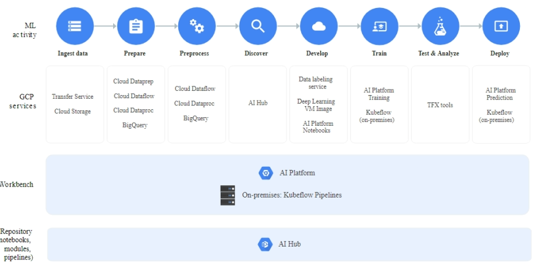
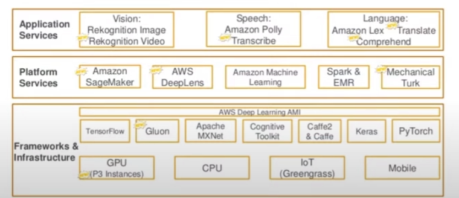

## Características

- IT Services Catalog
- Global network access
- Instant elasticity
- Chargeback
- Common IT-resouces pool

## Capacidades

- SaaS (Software as a Service): Se utiliza/alquila un servicio concreto, p.ej. One Drive.
- PaaS (Platform as a Service): Permite tener entornos preconfigurados para poder ejecutar ciertos conjuntos de aplicaciones.
- IaaS (Infraestructure as a Service): Se da acceso a la infraestructura, tal que te permite utilizarla para ejecutar los servicios que tu convengas.

## Modelos de Despliegue

Como modelos de despliegue tenemos:

- Private Cloud: se cierra el acceso para que sólo la propia infraestructura tenga acceso.
- Community Cloud: conjunto de nubes públicas que comparten recursos.
- Hybrid Cloud: tiene parte pública y tiene parte a la que se restringe el acceso.
- Public Cloud: permite el acceso desde la nube pública de internet.

## Google Cloud Platform

A continuación mostramos el ciclo completo de desarrollo de soluciones ML, y las herramientas de GCP asociadas y disponibles para cada una de ellas:

En la fase de desarrollo se definen varias herramientas:

- Data labeling service: se encarga del etiquetamiento correcto de los datos de forma semiautomática.
- Deep Learning VM Image: proporciona imágenes virtuales sobre las cuales llevar a cabo el procesamiento.
- API Platform Notebook

## AWM Machine Learning

La estructura se divide en tres bloques, de menor a mayor abstracción:

- Infraestructura
- Plataformas
- Servicios

[How to use Amazon SageMaker](https://www.youtube.com/watch?v=mDNhBLpT8Xg)
