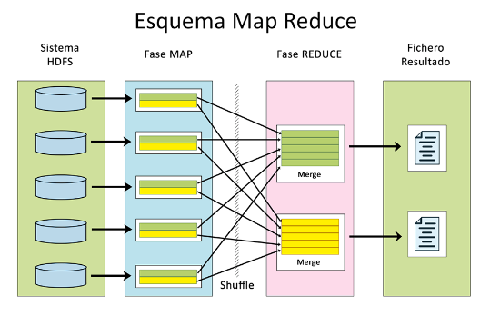
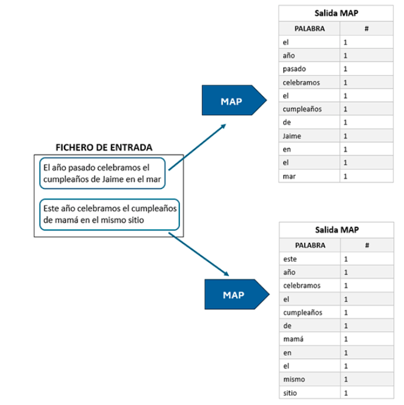
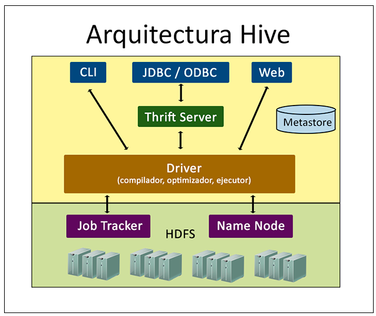
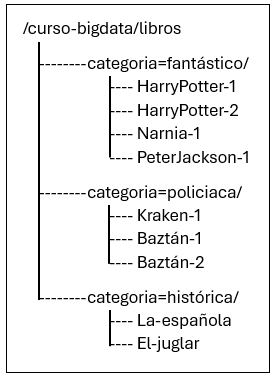
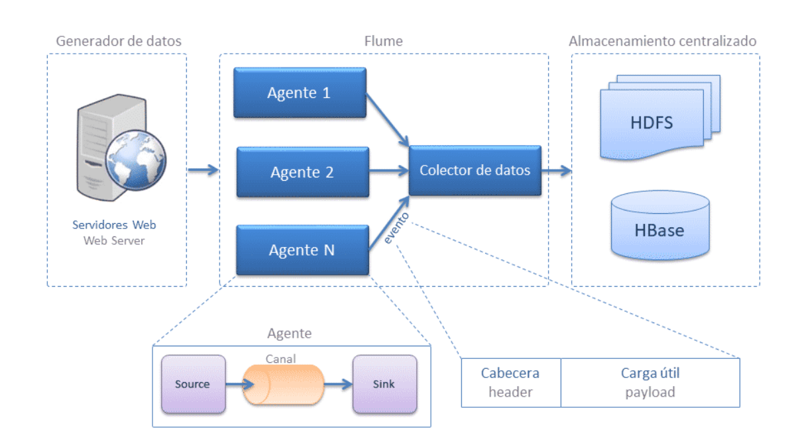
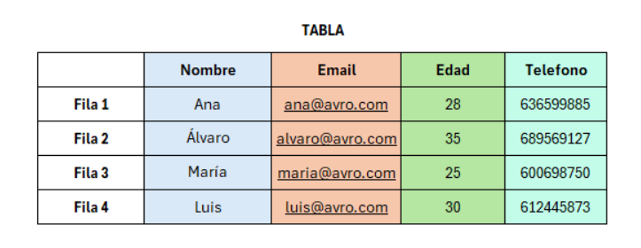

## Introducción a Big Data

### Origen e Historia

Los orígenes de los datos masivos se remontan a los años 60 y 70, cuando estábamos apenas comenzando con los primeros centros de datos y las bases de datos relacionales.

En el 2005, la gente se dio cuenta de la cantidad de datos que estábamos generando en plataformas online. Fue entonces cuando salió a la luz Hadoop, un sistema diseñado para guardar y analizar grandes cantidades de datos. También en esa época, las bases de datos NoSQL (No Solo SQL) hicieron sus primeras apariciones.

Los frameworks de código abierto como Hadoop (y más recientemente, Spark) provocaron que manejar y guardar esta cantidad de datos fuese más sencillo y barato. Desde entonces la cantidad de datos sigue creciendo, con la diferencia de que ahora no sólo somos nosotros mismos los que generamos los datos si no que también las máquinas toman parte.

Con la llegada del Internet de las cosas (IoT), hay cada vez más objetos conectados a la red recopilando datos sobre cómo usamos las cosas y el rendimiento de los productos. Y no podemos olvidar el auge del aprendizaje automático, que está generando aún más datos.

La magia del Cloud Computing ha ampliado las posibilidades del Big Data. En la nube, los desarrolladores pueden escalar cosas de forma ágil y rápida. Además, las bases de datos de gráficos son cada vez más populares e importantes, mostrando toneladas de datos de forma rápida y completa.

### Diferencias entre Big Data, Machine Learning e Inteligencia Artificial

El machine learning está dentro de la inteligencia artificial, sin embargo, no toda inteligencia artifical es machine learning. De la misma forma podemos ver cómo el concepto de Big Data no está dentro de la inteligencia artificial, sino que tiene otras características.


Aquella parte donde confluyen Machine Learning y Big data recibe el nombre de **Big Data Analytics**, un concepto relacionado con el dato puesto al servicio del entrenamiento de modelos con el fin de analizar patrones en los datos, predecir comportamientos, etc.

Big Data Analytics proporciona los datos que la IA y el ML necesitan para aprender y mejorar. La IA y el ML pueden utilizarse para analizar grandes conjuntos de datos y encontrar patrones y conocimiento oculto. Este conocimiento puede utilizarse para mejorar los procesos de negocio, desarrollar nuevos productos y servicios y tomar mejores decisiones. Por ejemplo:

- **Análisis de clientes**: para comprender mejor sus necesidades y preferencias.
- **Detección de fraude**: al analizar las transacciones, se pueden extraer diferentes métricas y detectar así actividades fraudulentas.
- **Desarrollo de nuevos productos**: Podemos identificar las distintas necesidades de los clientes y crear nuevos productos que las satisfagan.

### Las cinco "V" del Big Data

El concepto de las V's del Big Data ha evolucionado con el tiempo, comenzando con 3 V's: **Volumen**, **Velocidad** y **Variedad** y ampliándose a 5 con **Valor** y **Veracidad** y, en algunos casos, hasta 7 V's: **Variabilidad** y **Visualización**.

- **Volumen**: Se refiere a la enorme cantidad de datos generados y recopilados.
- **Variedad**: Hace referencia a la diversidad de tipos de datos (datos estructurados y datos no estructurados).
- **Velocidad**: Se refiere a la velocidad a la que se generan, procesan y analizan los datos.
- **Veracidad**: Relacionada con la calidad y la confiabilidad de los datos.
- **Valor**: capacidad para convertir los datos en valor significativo para la toma de decisiones y la obtención de información.

### Desafíos del Big Data

- **Infraestructuras para los datos**: la gestión y el almacenamiento de los datos pueden ser costosos y complicados. Es necesario crear infraestructuras robustas y escalables.
- **Velocidad de procesamiento**: El análisis en tiempo real y la capacidad de procesar datos rápidamente son fundamentales en muchos casos.
- **Veracidad de los datos**: Los datos deben proceder de fuentes confiables que aseguren una toma de decisiones correcta.
- **Privacidad y seguridad**: Con la creciente adquisición de los datos la privacidad de los usuarios y la seguridad de la información pueden estar amenazadas. Esto deriva en la implantación de leyes y normas que regulen la privacidad y seguridad de los datos.
- **Elevados costos**: Implementar y mantener infraestructuras y tecnologías de Big Data puede conllevar una importante inversión.
- **Profesionales especializados**: Existe una demanda creciente de profesionales con habilidades en el manejo, limpieza y análisis de datos masivos. La escaseza de los mismos puede suponer un desafío.
- **Interoperabilidad**: La integración de diferentes sistemas y tecnologías puede resultar difícil y ser un verdadero desafío especialmente cuando se trabaja con conjuntos de datos provenientes de diversas fuentes y en diferentes formatos.
- **Gobernanza**: Gestionar y gobernar los datos de forma eficaz es un reto importante para las empresas que gestionan conjuntos masivos de datos.

### Aplicaciones y casos de uso

- **Salud**: Poder mejorar la atención al paciente, desarrollar nuevos medicamentos y tratamientos, y prevenir enfermedades con antelación.
- **Finanzas**: La detección del fraude, gestionar los riesgos de la concesión de créditos y blanqueo de capitales y tomar decisiones de inversión.
- **Marketing**: Comprender el comportamiento de los clientes, personalizar las recomendaciones y mejorar las campañas de marketing.
- **Transporte**: La optimización de rutas, mejorar la seguridad y reducir el tráfico.
- **Gobierno**: las campañas electorales, creación de planes de fidelización político-social.

### Beneficios del Big Data

- **Toma de decisiones**: Las empresas pueden tomar mejores decisiones al proporcionarles más información mediante la explotación de los datos.
- **Mejora de la eficiencia**: La eficiencia de los procesos de automatización pueden llevar a mejorar la productividad y reducir costos.
- **Innovación**: Para la innovación de las estrategias o en la creación de nuevos productos el Big Data puede proporcionar nuevas ideas y perspectivas.

## El Núcleo de Hadoop

### Fundamentos y Herramientas del Ecosistema de Hadoop

La naturaleza de los datos masivos hace que la utilización de sistemas de almacenamiento y procesamiento tradicionales, como las bases de datos relaciones, sea inviable.

El ecosistema de Hadoop es un entorno software que permite alamcenar, procesar y analizar este tipo de datos de forma eficiente.

#### La Evolución de Hadoop

A principio de los 2000 e inspirado por las innovaciones en sistemas distribuidos de Google (Google File System y el modelo de programación MapReduce), Doug Cutting desarrolla una alternativa en código abierto a estas tecnologías.

Inicialmente se crearon dos partes:

- **Hadoop Distributed File System** (HDFS): una manera de almacenar grandes cantidades de datos.
- **MapReduce**: un sistema para procesar estes datos distribuidos.

Tras el éxito de Hadoop surgieron otros proyectos como Hive, Pig y Sparkk que ampliaron lo que se podía hacer con Hadoop. En la actualidad Hadoop es un estándar en el Big Data y es utilizado en muchas industrias diferentes.

#### Características de Hadoop

##### Código Abierto

El código fuente de Hadoop se encuentra disposible públicamente, lo cual fomenta innovación ya que distintos desarrolladores pueden trabajar en mejorar el software.

##### Distribuido

Se trata de una plataforma de computación distribuida que ha sido diseñada para poder manejar grandes volúmenes de datos en múltiples nodos de un clúster de servidores. De tal manera que Hadoop puede distribuir la carga de trabajo y los datos entre varios nodos. Esto permite procesamiento en paralelo y escalable.

##### Escalable

La escalabilidad de Hadoop se puede entender en dos dimensiones:

- **Escalabilidad Horizontal**: se añaden más nodos al clúster para aumentar la capacidad de almacenamiento y de procesamiento cuando la demanda así lo requiere.
- **Escalabilidad Vertical**: se puede aumentar la capacidad de CPU, memoria y almacenamiento de nodos individuales para majera tareas más grandes o complejas.

##### Tolerante a Fallos

Se ha diseñado Hadoop de tal manera que se mantiene la disponibilidad del servicio y la integridad de los datos incluso cuando ocurren fallos en el hardware o en el software del sistema. Esta tolerancia se obtiene mediante:

- La replicación de datos.
- La autorecuperación.
- La monitorización constante del estado del clúster.

#### Estructura de Hadoop

En 2006 se ceden los dos componentes que formaban Hadoop a Apache Software Foundation. En 2012 se publica la versión 1.0 y seguidamente en 2013 se publica la versión 2.0 en la cual se introduce `Yarn` como gestor de recursos y se desacoplan los módulos `HDF` y `MapReduce`. Finalmente en 2017 se publica la versión 3.0.

Actualmente Hadoop se conforma de los siguientes componentes principales:

- **Hadoop Distributed System** (HDF): sistema distribuido de almacenamiento primario de datos. Este divide los datos en bloques y los distribuye en varios nodos del clúster para garantizar la tolerancia a fallos y la escalabilidad.
- **MapReduce**: proporciona un modelo de programación y procesamiento distribuido para realizar operaciones en conjuntos de datos distribuidos almacenados en HDF. Este divide las tareas en dos fases:
  - Map: Los datos se procesan y se filtran en tareas más pequeñas que se ejecutan de forma paralela en diferentes nodos del clúster.
  - Reduce: los resultados intermedios de las tareas de combinan y se procesan para producir el resultado final.
- **Yet Another Resource Negotiator** (YARN): es el administrados e recursos del clúster. Se encarga de gestionar recursos de procesamiento (CPU, memoria). También permite la programación dinámica de tareas y la adminitración eficiente de recursos.

### Sistema de Ficheros Distribuidos

#### ¿Qué es Hadoop Distributed File System (HDFS)?

Hadoop crea una capa de abstracción en forma de sistema de ficheros único. Tal que se encarga de almacenar los datos en varios nodos manteniendo sus metadatos.

##### Sistema Distribuido

En este sistema de ficheros los ficheros de dividen en bloques de un mismo tamaño (normalmente 128MB, pero es configurable) y se distribuyen en los nodos del clúster. Cada uno de los bloques se replicará en varios nodos para que el sistema sea tolerante a fallos. Para este tipo de sistemas no es óptimo que los ficheros tengan un tamaño pequeño.

Por ejemplo, si tenemos un fichero de 800MB, lo dividiríamos en siete bloques. Seis serán de 128MB y el último será de 32MB

##### Escalabilidad Horizontal

La escalabilidad horizontal se implementa aumentando el espacio por medio de discos duros o añadiendo más nodos al sistema. Este tipo de escalabilidad es más sencilla que la escalabilidad vertical ya que consiste en añadir hardware básico.

##### Estructura Jerárquica

Decimos que HDFS es jerárquico, ya que existe una jerarquía de directorios y ficheros.

##### Arquitectura y componentes

Sigue una arquitectura maestro-esclavo con dos componentes principales: NameNodes y DataNodes.

###### NameNode

Almacena los metadatos de HDFS, incluyendo información acerca de la estructura de directorios, los permisos en los archivos y la ubicación física de los bloques de datos.

En un clúster HDFS sólo hay un NameNode, y su disponibilidad es crucial, si este no es accesible este supone un error crítico en el sistema. Por ello, a partir de Hadoop 2 es posible configurar un NameNode secundario en espera, o más de uno a partir de Hadoop 3. Estes nodos toman el control si se detecta algún fallo en el nodo primario. Es importante que los nodos esten sincronizados y que tengan los mismos metadatos que el nodo primario.

###### DataNode

Este tipo de nodos son los encargados de almadenar los datos y de recuperar los bloques de datos que conforman los archivos así como de gestionar el almacenamiento del nodo. Además deben informar periódicamente del estado de los bloques al NameNode.

La pérdida de un DataNode no afecta significativamente a la integridad del sistema, pero la pérdida de muchos podría afectar a la disposibilidad y a la redundancia de los datos.

#### Escritura en HDFS

1. Cliente solicita la escritura al NameNode
2. NameNode asigna bloques consultando su tabla de metadatos para determinar qué DataNodes deben contener los bloques del archivo. Devuelve esta lista de DataNodes al cliente.
3. Escritura de datos en DataNodes por parte del cliente.
4. Confirmación al NameNode por parte de los DataNodes.
5. El NameNode actualiza su tabla de metadatos con la nueva información acerta de la ubicación de los bloques de datos del archivo.

#### Lectura en HDFS

1. Cliente solicita la lectura de un archivo al NameNode.
2. El NameNode consulta su tabla de metadatos y devuelve la ubicación del archivo al cliente.
3. El cliente solicita los bloques de datos a los DataNodes donde están almacenados y estes devuelven los bloques.
4. El cliente reconstruye el archivo a partir de los bloques.
5. El NameNode actualiza su tabla de metadatos con nueva información acerca de la ubicación de los bloques de datos del archivo.

#### Comandos de HDFS

##### Listar Ficheros

| Comando                       | Descripción                                                                        |
| ----------------------------- | ---------------------------------------------------------------------------------- |
| `hdfs dfs -ls /`              | Lista todos los ficheros y directorios para el path /                              |
| `hdfs dfs -ls -h /`           | Lista los ficheros con su tamaño en formato legible                                |
| `hdfs dfs -ls -R /`           | Lista todos los ficheros y directorios recursivamente (con subdirectorios)         |
| `hdfs dfs -ls /file*`         | Lista todos los ficheros que cumplen el patrón (ficheros que comienzan con 'file') |
| `hadoop fs -stat «type:%F» /` | Imprime estadísticas del fichero o directorio en el formato indicado               |

##### Leer y Escribir Ficheros

| Comando                                     | Descripción                                                             |
| ------------------------------------------- | ----------------------------------------------------------------------- |
| `hdfs dfs -text /app.log`                   | Imprime el fichero en modo texto por la terminal                        |
| `hdfs dfs -cat /app.log`                    | Muestra el contenido del fichero en la salida estándar                  |
| `hdfs dfs -appendToFile /home/file1 /file2` | Añade el contenido del fichero local 'file1' al fichero en HDFS ‘file2’ |

##### Cargar y Descargar Ficheros

| Comando                                       | Descripción                                                                                                                                      |
| --------------------------------------------- | ------------------------------------------------------------------------------------------------------------------------------------------------ |
| `hdfs dfs -put /home/file1 /hadoop`           | Copia el fichero 'file1' del sistema de ficheros local a HDFS en la carpeta "hadoop"                                                             |
| `hdfs dfs -put -f /home/file1 /hadoop`        | Copia el fichero 'file1' del sistema de ficheros local a HDFS y lo sobreescribe en el caso de que ya exista                                      |
| `hdfs dfs -put -l /home/file1 /hadoop`        | Copia el fichero 'file1' del sistema de ficheros local a HDFS. Fuerza replicación 1 y permite al DataNode persistir los datos de forma perezosa. |
| `hdfs dfs -put -p /home/file1 /hadoop`        | Copia el fichero 'file1' del sistema de ficheros local a HDFS. Mantiene los tiempos de acceso, de modificación y propietario original            |
| `hdfs dfs -get /file1 /home/`                 | Copia el fichero 'file1' de HDFS al sistema de ficheros local                                                                                    |
| `hdfs dfs -copyToLocal /file1 /home/`         | Copia el fichero 'file1' de HDFS al sistema de ficheros local (igual que el anterior)                                                            |
| `hdfs dfs -moveFromLocal /home/file1 /hadoop` | Copia el fichero 'file1' del sistema de ficheros local a HDFS y luego lo borra del sist. ficheros local                                          |

##### Gestión de Ficheros

| Comando                                         | Descripción                                                                                                        |
| ----------------------------------------------- | ------------------------------------------------------------------------------------------------------------------ |
| `hdfs dfs -cp /hadoop/file1 /hadoop1`           | Copia el fichero al directorio destino en HDFS                                                                     |
| `hdfs dfs -cp -p /hadoop/file1 /hadoop1`        | Copia el fichero al directorio destino en HDFS conservando tiempos de acceso y de modificación, propietario y modo |
| `hdfs dfs -rm /hadoop/file1`                    | Elimina el fichero 'file1' de HDFS y lo envía a la papelera                                                        |
| `hdfs dfs -rm -r /hadoop`                       | Elimina el directorio y su contenido en HDFS                                                                       |
| `hdfs dfs -rm -R /hadoop`                       | Elimina el directorio y su contenido en HDFS                                                                       |
| `hdfs dfs -rmr /hadoop`                         | Elimina el directorio y su contenido en HDFS                                                                       |
| `hdfs dfs -rm -skipTrash /file1`                | Elimina el fichero sin dejarlo en la papelera                                                                      |
| `hdfs dfs -mkdir /hadoop2`                      | Crea un directorio en HDFS                                                                                         |
| `hdfs dfs -touchz /hadoop3`                     | Crea un fichero en HDFS con tamaño 0                                                                               |
| `hadoop fs -getmerge -nl /file1 /file2 /output` | Concatena los ficheros file1 y file2 en el fichero destino /output                                                 |

##### Gestión de Permisos

| Comando                                   | Descripción                                        |
| ----------------------------------------- | -------------------------------------------------- |
| `hdfs dfs -checksum /hadoop/file1`        | Muestra la información checksum del fichero        |
| `hdfs dfs -chmod 775 /hadoop/file1`       | Cambia los permisos del fichero en HDFS            |
| `hdfs dfs -chmod -R 755 /hadoop`          | Cambia los permisos de los ficheros recursivamente |
| `hdfs dfs -chown hadoop:hadoop /file1`    | Cambia el propietario y el grupo del fichero       |
| `hdfs dfs -chown -R hadoop:hadoop /file1` | Cambia el propietario y el grupo recursivamente    |
| `hdfs dfs -chgrp hadoop /file1`           | Cambia el grupo del fichero                        |

##### Gestión de Administración

| Comando                         | Descripción                                                                                                                                       |
| ------------------------------- | ------------------------------------------------------------------------------------------------------------------------------------------------- |
| `hdfs dfs -df /hadoop`          | Muestra la capacidad y el espacio libre y usado del sistema de ficheros                                                                           |
| `hdfs dfs -df -h /hadoop`       | Muestra la capacidad y el espacio libre y usado del sistema de ficheros en formato legible                                                        |
| `hadoop version`                | Muestra la versión de Hadoop                                                                                                                      |
| `hdfs fsck /`                   | Comprueba el estado de salud del sistema de ficheros                                                                                              |
| `hdfs dfsadmin -safemode leave` | Deshabilita el modo seguro del NameNode                                                                                                           |
| `hdfs namenode -format`         | Formatea el NameNode                                                                                                                              |
| `hadoop fs -test -e filename`   | Si el path existe en HDFS, devuelve 0                                                                                                             |
| `hadoop fs -setrep -w 3 /file1` | Cambia el factor de replicación de un fichero a 3. Si se indica un directorio, cambia el factor de replicación de todos los ficheros que contiene |

### Yarn: Gestión de Recursos

#### Por Qué Surge YARN?

YARN se encarga de administrar y asignar recursos a las diversas aplicaciones que se ejecutan en el clúster de Hadooop. Algunos de los objetivos principales de YARN son la escalabilidad, la eficiencia y la capacidad de ejecutar múltiples frameworks de procesamiento de datos no sólo MapReduce.

En la verisón 1, MapReduce contaba con un administrador de recursos y un planificador interno. YARN permite separar la gestión de recursos de la lógica de programación. Anteriormente se presentaban muchas limitaciones al no admitir apliaciones que siguiesen el modelo MapReduce (como el análisis de grafos) y era necesario transladar los datos a otras plataformas. A partir de Hadoop 2 la utilización de otros frameworks (Giraph para análisis de datos, Storm para análisis de datos en tiempo real, etc) es transparente.

Esto permite una mejor utilización de los recursos del clúster y una mayor flexibilidad en la ejecución de aplicaciones.

#### Arquitectura y Componentes

YARN consta de tres componentes principales: **Resource Manager**, **Node Manager** y **Application Master**.


##### Resource Manager

Se trata del maestro del clúster y se encarga de aceptar las solicitudes de recursos de las aplicaciones, negociar los recursos con los nodos y asignar recursos a la aplicaciones mediante un planificador. Cabe destacar que este planificador no ofrece garantías de ejecución de la aplicaciones ni las monitoriza.

Existe un segundo componente denominado **gestor de aplicaciones** que se encarga de aceptar las peticiones de trabajos, negocial el contenedor para la ejecutación de la aplicación y proporcionar, en caso de error, el reinicio de los trabajos.

##### Node Manager

Se ejecutan en cada nodo y son los encargados de administrar los recursos locales (CPU, almacenamiento, memoria) y reportar su disponibilidad al Resource Manager. También gestiona el lanzamiento y la supervisión de los contenedores que ejecutan las tareas de las aplicaciones y mapean las variables de entorno necesarias, descargan las dependencias y los servicios necesarios para crar los procesos.

##### Application Master

Se crea y ejecuta para cada aplicación dentro de un contenedor. Es el responsable de negociar los recursos con el Resouce Manager y de supervisar el progreso de la aplicación.

#### Secuencia de trabajo en Hadoop YARN

1. El cliente envía una aplicación YARN al Resource Manager
2. El Resource Manager reserva recursos en contenedores para la ejecución de la aplicación
3. El Application Manager se registra con el Resource Manager y solicita los recursos necesarios para la aplicación
4. El Application Manager notifica al Node Manager la ejecución de los contenedores asignados
5. La aplicación YARN se ejecuta en le contenedor correspondiente
6. El Application Master supervisa la ejecución y reporta el estado al Resource Manager y al Application Manager
7. Al finalizar la ejecución el Application Manager notifica al Resource Manager

#### Federación en Hadoop YARN

La federación en Hadoop YARN pemite la conexión de múltiples clústeres YARN para formar un clúster lógico único. De esta manera podemos lograr una gestión centralizada de recursos lo cual simplifica su administración.

Una de las ventajas clave es el escalamiento horizontal sin límites dados por el tamaño del clúster. Por lo tanto, se facilita la ejecución de trabajos de gran embergadura y distribuidos.

## Programación MapReduce

### El paradigma de programación MapReduce: Hadoop Streaming

#### ¿Qué es MapReduce?

El flujo de procesamiento de MapReduce se divide en dos etapas: **Map** y **Reduce** las cuales se ejecutan de manera distribuida en distintos nodos de procesamiento mientras que un proceso central denominado **Job Tracker** controla su ejecución.

#### Fases de Map Reduce

1. **Map**: Los datos de entrada se subdividen en bloques independientes que son procesados de forma paralela por los mappers. Normalmente Hadoop intenta ejecutar los mappers en los nodos donde se encuentran los datos sobre los que va a trabajar (**data locality**). Esto reduce los tiempos de acceso a los datos y la necesidad de transferencia de datos entre nodos.
2. **Shuffle & sort**: los datos intermedios de los mappers se ordenan. Este proceso comienza mientras las tareas map están en progreso, a medida que van terminando. No es necesario esperar a que todas terminen.
3. **Reduce**: comienza cuando todos los datos han sido ordenados en **Shuffle & sort**. Recibe como entrada estes datos ordenados estructurados como pares clave valor agrupados por clave. Cada reducer toma los valores asociados a una clave y los agrega/procesa y devuelve el resultado como salida que se puede almacenar en HDFS o en otro sistema.
4. Generalmente se concatenan varias fases de mapper-reducer para completar una tarea.



#### Hadoop Streaming

Hadoop Streaming se trata de una utilidad que permite ejecutar aplicaciones en Hadoop escritas en cualquier lenguaje, a pesar de que Hadoop este escrito en Java. Este proporciona un interfaz de entrada y de salida (stdin/stdout) que es consumida por las aplicaciones, tal que existe una pasarela de datos que actúa como comunicación entre Hadoop y la aplicación.


En la imagen anterior se muestra el flujo de un trabajo MapReduce.

1. Se leen los datos de entrada y se produce una lista de pares clave-valor.
2. Se proporcionan los datos en este formato a un mapper externo a través del canal estándar de entrada.
3. Se devuelve el resultado de los mapper en el mismo formato a través del canal estándar de salida.
4. Se proporcionan los datos procesados por los mapper al reducer externo a través de la entrada estándar.
5. Se devuelve el resultado del reducer a través de stdout.
6. Finalmente se almacena el resultado del reducer, bien en HDFS o en otro sistema externo.

Como podemos ver en todas las fases del proceso de mantiene siempre la estructura de pares clave-valor.

#### Ejemplo Práctico de MapReduce

Para ejemplificar MapReduce planteamos el siguiente problema: queremos obtener la frecuencia de cada palabra en un documento.


- **Map**: dividimos el proceso en dos mappers (idealmente cada proceso mapper se debería de ejecutar en el nodo en el cual se encuentra el bloque de datos). Estes se encargan de obtener la frecuencia de las palabras en la "porción de texto" sobre el que trabajan.



- **Shuffle & Sort**: se ordenan y se agrupan los valores por la clave, donde la clave en nuestro caso es la palabra y el valor su frecuencia.


- **Reduce**: se ejecuta un reducer por cada clave presente en el resultado, que agrupa (en nuestro caso suma) los valores bajo cada clave, es decir las frecuencias asociadas a la palabra.


#### Optimización: Combiners y Partitioner

MapReduce cuenta con dos componentes para optimizar el procesamiento denominados **combiners** y **partitioners**.

1. **Combiners**: agrupan los resultados de cada mapper antes de llegar a la frase de shuffle and sort con el objetivo de reducir el tamaño de los datos que se le proporcionan al reducer.
2. **Partitioners**: se utilizan para determinar cómo se distribuyen los datos a cada reducer. Por defecto Hadoop distribuye la carga de trabajo de manera uniforme entre los reducers, pero se puede personalizar utilizando los **partitioners**.

### Programación MapReduce con lenguajes de alto nivel: Hive

#### Introducción a Apache Hive

**Hive** fue creado por Facebook en el año 2007. Se trata de una abstracción sobre Hadoop, que permite utilizar su lenguaje de consulta, **HiveQL**, para generar de manera automática programas MapReduce.

#### Arquitectura de Apache Hive

##### Cliente

Existen varias maneras de interactuar con Hive:

- Interfaz Web
- Su interfaz de línea de comandos (CLI), Beeline
- **HiveServer**: un servidor Thrift de Hive que permite acceder a través de JDBC, ODBC o Thrift API.

##### Catálogo Centralizado: Metastore

Hive almacena los metadatos (esquemas de las tablas, tipos de datos, etc) en un catálogo centralizado denominado **Metastore**, que se trata de una base de datos relacional. Existen tres tipos de configuraciones:

- **Embedded Metastore**: se integra el código en el mismo proceso que el programa Hive y la base de datos. Generalmente utilizado en entornos de prueba.
- **Local Metastore**: se ejecuta de manera local pero en un proceso distinto.
- **Remote Metastore**: se configura en remote, tal que se desliga el metastore del resto de procesos. Generalmente se utiliza en entornos de producción.

##### Driver de Gestión

Es el encargado de gestionar una consulta HiveQL durante todo su ciclo de vida.

##### HiveQL Parser

Se encarga de transformar las consultas en HiveQL a programas MapReduce.

##### Optimizador y Planificador de Consultas

- **Optimizador de Consultas**: reorganiza la consulta para poder optimizarla mediante técnicas como el filtrado anticipado.
- **Planificador de Consultas**: decide cómo y cuándo se ejecutan las consultas.

##### Motor de Ejecución

Se encarga de ejecutar la tarea de consulta de forma distribuida y paralela en los nodos del cluster de Hadoop.

##### Almacenamiento de Datos

Los datos deben estar almacenados en HDFS y generalmente se almacenan en un formato aceptado por bases de datos relacionalales (p.ej. csv) o formatos que se integran con Hive como Parquet o Avro.



#### Estructura Interna

Hive impone sobre HDFS una estructura propia que llamaremos esquema o Schema, la cual es almacenada en su propia base de datos (metastore).

##### Tipos de Datos

Hive soporta tipos de datos primitivos: **STRING**, **INT**, **BOOLEAN** y otros tipos de datos como **DATE**, así como tipos de datos compuestos:

- **ARRAY**: son grupos de elementos del mismo tipo.
- **MAP**: define elementos clave-valor: `{1: "flor, 2: "hoja", 3: "perro", 4: "gato}`
- **STRUCT**: permite crear objetos: `{"animal": "perro", "tipo": "mamífero", "numero_patas": 4}`

##### Estructura de Datos

###### Tablas

Las tablas están compuestas por filas y columnas y tienen esquemas bien definidos, pero tienen una estructura lógica que se corresponde con una carpeta en HDFS. Existen dos tipos de tablas:

- **Tabla Interna (o gestionada)**: son tablas gestionadas por Hive. Cuando se crea una tabla interna automáticamente se crea un carpeta en HDFS y Hive controla tanto la tabla como sus datos. Si esta tabla se borra también se borra la carpeta en HDFS.

```
 -- creación tabla interna
CREATE TABLE libros (
     id INT,
     titulo STRING,
     autor STRING,
     categoria STRING);
)
ROW FORMAT DELIMITED
FIELDS TERMINATED BY ','
STORED AS TEXTFILE;
```

- **Tabla externa**: se trata de una tabla populada con datos ya existentes en HDFS. Su estructura se define en la Metastore y si borramos la tabla no se borra su contenido en HDFS. Esta opción es útil cuando compartimos datos entre distintas herramientas.

```
-- creación tabla externa
CREATE EXTERNAL TABLE libros_externa (
     id INT,
     titulo STRING,
     autor STRING,
     categoria STRING);
)
ROW FORMAT DELIMITED
FIELDS TERMINATED BY ','
STORED AS TEXTFILE
LOCATION '/curso-bigdata/externa/libros';
```

En la tabla anterior se indica la ubicación de los datos utilizando `LOCATION`. El término `STORED AS` indica el formato del fichero en el que residen los datos.

##### Particiones

Las **particiones** son subdivisiones en una tabla Hive que permite la optimización de las consultas eliminando valores irrelevantes. Las subdivisiones se realizan en base a los valores de las columnas, por ejemplo si tenemos una variable nominal se podría particionar la tabla según las distintas categorías. Existen dos tipos de particiones:

- **Particiones estáticas**: son definidas por parte del usuario pero no cambian en el tiempo.
- **Particiones dinámicas**: Hive se ocupa de crear automáticamente las particiones basándose en los valores de la columna especificada.



```
-- creación tabla con particiones
CREATE TABLE libros_particion (
     id INT,
     titulo STRING,
     autor STRING,
)
PARTITIONED BY (categoria STRING);

-- insertar datos
INSERT INTO TABLE libros_particion PARTITION (categoria=Fantástico) VALUES
 (1, 'Harry Potter y la Piedra Filosofal', 'J.K. Rowling');
 (2, 'Harry Potter y la Cámara Secreta', 'J.K. Rowling');
-- etc
```

##### Buckets

Los buckets son otra técnica de división de datos, estes están identificados mediante un par 'clave, valor' que distribuye los datos según una función hash. El objetivo principal para utilizar buckets es optimizar las consultas, sobre todo cuando estas son de tipo JOIN o unión.

Podemos realizar los buckets bien de forma dinámica o estática. La diferencia radica en la elección de la columna que especifiquemos en la cláusula `CLUSTERED BY`.

```
-- creación tabla con buckets
CREATE TABLE prestamos (
     id INT,
     libro_id INT,
     fecha_prestamo STRING,
     socio_id INT,
)
CLUSTERED BY (libro_id) INTO 5 BUCKETS;
```

## Inyección/Extracción y Serialización/Deserialización de los Datos

### Apache Flume

#### Las Fuentes de datos

Las empresas buscan tener todos sus datos centralizados, sean de la naturaleza que sean. Tal que existirá una única fuente de verdad o Single Source of Truth que permite la consistencia de los datos. Bajo esta premisa nacen los conceptos de Data Lake y Data Warehouse.

En un **Data Warehouse** los datos deberán adaptarse a una estructura definida antes de poder ser guardados. Se utilizan los procesos **ETL** de Extracción, Transformación y Carga para adaptar los datos y su formato a la estructura definida antes de volcarlos.

En un **Data Lake** los datos se guardan tal cual se reciben, pero pueden ser transformados antes de su extracción. Este utiliza procesos **ELT** en los que primero se realiza la carga y cuando queramos extraer información útil de dichos datos, realizaremos una transformación en caso de ser necesario.

#### Batch vs Streaming

El **Procesamiento Batch** se da cuando los datos a procesar se encuentran en un almacén de datos estático y estes son finitos, tal que se escogen y procesan por lotes.

El **Procesamiento Streaming** es el procesamiento sobre datos que fluyen a través de un sistema, conforme se van añadiendo al mismo. Estes datos no son finitos y la toma de decisiones sobre ellos se hace en tiempo real.

A continuación mostramos las diferencias entre los dos tipos de procesamiento:

|                              | Procesamiento Batch                                                               | Procesamiento Streaming                                                                                      |
| ---------------------------- | --------------------------------------------------------------------------------- | ------------------------------------------------------------------------------------------------------------ |
| Hardware                     | Los recursos deben ser capaces de procesar y almacenar grandes conjuntos de datos | Los datos tienen menor tamaño, por lo que los requisitos computacionales y el almacenamiento puede ser menor |
| Latencia                     | La latencia puede ser de minutos, horas o días.                                   | La latencia debe ser en segundos o milisegundos.                                                             |
| Tamaño del conjunto de datos | Grandes lotes de datos.                                                           | Un paquete de datos o varios de ellos, siempre de tamaño menor.                                              |
| Análisis                     | Cálculo complejo y análisis en un marco temporal más amplio.                      | Informes o cálculos simples sobre los datos.                                                                 |

#### Herramientas para la Inyección y Extracción de Datos

A continuación comentaremos las herramientas que nos permiten la ingesta y extracción de los datos de forma masiva.

##### Apache Scoop

Está pensado para la transferencia de datos desde un almacén estructurado a otro y utiliza procesamiento por lotes. Sin embargo, desde junio de 2021 el proyecto Sqoop dejó de tener continuidad.

##### Apache Flume

Flume es un software para la ingesta de datos masivos en streaming. Fue presentado por Cloudera en el año 2010 y posteriormente se incorporó bajo licencia Apache como Open Source a la Fundación Apache.

Flume está basado en el flujo de datos en streaming de eventos sencillos y permite la lectura y escritura de múltiples fuentes de datos. Además de ello, Flume tiene mecanismos que aseguran la fiabilidad y confiabilidad de los datos.

###### Ventajas

- Puede manejar **grandes volúmenes de datos** eficientemente distribuyendo la carga entre múltiples agentes.
- Presenta una **gran flexibilidad**, ya que nos permite recoger datos de diversas fuentes sin atender a su formato.
- Se **integra perfectamente** con el Ecosistema Hadoop.
- Presenta **tolerancia a fallos**.

###### Desventajas

- Puede resultar difícil configurar los parámetros adecuados para los agentes. Esto puede derivar en un fenómeno conocido como Backpressure que ocurre cuando el volumen de datos entrantes supera a la cantidad de datos que pueden ser consumidos por Flume dando lugar a pérdida de eventos y por lo tanto de información, para evitar esto hay que configurar adecuadamente a los agentes.
- Está estrechamente ligado a la ingesta de datos en Hadoop, para la ingesta en otro tipo de sistemas podemos utilizar herramientas como Kafka.
- No ofrece herramientas para el monitoreo y diagnóstico de errores de forma clara para el usuario.

#### Arquitectura de Apache Flume

##### Agentes

Se trata de un conjunto de componentes independientes que dirigen los eventos desde la entrada a la salida. Además los agentes pueder recibir y enviarse datos entre sí. Un agente está compuesto de tres componentes fundamentales:

- **Source**: es el punto de entrada de datos de un agente. Cada source es configurada para leer datos desde un lugar o ubicación específica y enviarlos al channel del agente.
- **Channels**: es el lugar temporal donde los datos llegan desde el source y se procesan o no, dependiendo del caso de uso, para transmitirlos al destino final (sink).
- **Sinks**: Son los encargados de leer los datos de los canales y enviarlos al siguiente componente del sistema, que será u otro agente, o el destino final. Si los datos son consumidos por los sinks se eliminan de los canales.



##### Eventos

Se trata de una unidad de "dato". El dato es extraído por la fuente, enviado y procesado por el canal y consumido por el sink o sumidero.

Un evento se compone de dos partes:

- **Cabecera**: registra información de metadata mediante pares clave-valor
- **Datos**: son almacenados en forma de array en el cuerpo de un evento.

##### Flujo de Datos

El flujo de datos describe el recorrido de los eventos desde el comienzo hasta el destino final.

### Apache Avro

#### Serialización/Deserialización

La **serialización** de un objeto consiste en la conversión de dicho objeto a un formato que puede ser transmitido y almacenado de forma eficiente (p.ej. binario o JSON). La conversión inversa se denomina **deserialización**.

Este proceso se lleva a cabo por los siguientes motivos:

- **Almacenamiento**: generalmente queremos almacenar los datos de una forma eficiente (minimizando su tamaño).
- **Transmisión**: en sistemas distribuidos es necesario el paso de datos entre sistemas, por lo tanto necesitamos que los datos esten en un formato que optmice su envío y asegure la reconstrucción de los datos.
- **Intercambio de datos**: La serialización y deserialización permite intercambiar información manteniendo la integridad de los datos, independientemente del lenguaje de programación.

#### La Evolución de los Formatos

Apache Avro pertenece a la Fundación Apache y se integra perfectamente con el ecosistema Hadoop. Avro es un formato que contiene tanto los datos como el **esquema** que deben de seguir los datos.

En comparación con JSON, este no fuerza al uso de un esquema de los datos y su tamaño aumenta cuando existen claves repetidas.

Avro specifica dos formas de llevar a cabo la serialización:

- **Binaria**: resulta en ficheros más pequeños.
- **JSON**: mejor para depurar y para comunicación en entornos web.

Avro specifica un orden de datos estándar.

#### Estructura

Un fichero está conformado por dos componentes:

- Cabecera: contiene metadatos acerca del esquema de los datos entre otras cosas.
- Uno o más bloques que pueden contener metadatos o datos. En todo fichero hay al menos un bloque de metadatos (ver Block 1 en la siguiente imagen).


Avro sigue un formato basado en filas, tal que se agupan los datos en grupos de filas.

#### La Evolución de los Esquemas

Avro se puede adaptar a la evolución de los esquemas. En concreto tenemos dos tipos de esquema:

- Esquema de **escritura**: se utiliza en la serialización.
- Esquema de **lectura**: se utiliza en la deserialización.

Existen los siguientes tipos de compatibilidad:

- **Compatibilidad hacia delante**: un nuevo esquema puede leer datos escritos con un esquema anterior.
- **Compatibilidad hacia atrás**: un esquema antiguo puede leer datos escritos con un nuevo esquema.
- **Compatibilidad completa**: combina la compatibilidad hacia delante y hacia atrás.

Para asegurar la compatibilidad de los esquema tenemos diversas reglas:

- Al añadir campos estes siempre deben de tener un valor por defecto.
- Sólo se pueden eliminar campo si estes no son necesarios para las aplicaciones que leen/escriben el esquema.

#### Ventajas

- La compresión de los datos es automática
- Está totalmente tipado
- Los ficheros contienen tanto los datos como la definición del esquema
- Los datos pueden ser procesado por casi cualquier lenguaje
- Permite la evolución sencilla de la definición del esquema de los datos
- Permite el paso de datos entre sistemas escritos en distintos lenguajes

#### Ejemplo de Esquema

Vamos a ver cómo definir un esquema para los siguientes datos, uno está almacenado como un archivo CSV, mientras que el otro está definido como un fichero JSON.

```csv
name, email, age
Ana,ana@avro.com,34
Juan,juan@avro.com,28
Alvaro,alvaro@avro.com,35
Maria,maria@avro.com,25
Luis,luis@avro.com,30
```

```JSON
[
     {"name": "David", "email": "david@avro.com", "age": 28},
     {"name": "Pablo", "email": "pablo@avro.com", "age": 31},
     {"name": "Ines", "email": "ines@avro.com", "age": 34}
]
```

Definimos un esquema que define un objeto, en concreto un usuario. Por lo tanto, el esquema será de tipo record. Los esquemas se escriben en formato JSON, y hay que indicar por cada campo el nombre de éste y el tipo de datos asociado.

```JSON
{
     "type": "record",
     "name": "User",
     "fields": [
         {"name": "name", "type": "string"},
         {"name": "email", "type": "string"},
         {"name": "age", "type": "int"},
     ]
}
```

### Apache Parquet

#### Formato Columnar

Los formatos que habíamos estado tratando guardan los datos en filas (CSV, Avro, JSON), los formatos de archivos columnares guardan los datos en columnas. Lo formatos más populares son Apace Parquet y Apache OCR.

Por ejemplo, dada la siguiente tabla:



La siguiente imagen nos ilustra las diferencia entre guardarla en formato fila y en formato columna:


##### Ventajas

El formato columnar presenta ventajas a la hora de llevar a cabo agrupaciones en grandes conjuntos de datos. Si utilizamos el formato basado en filas deberemos de recorrer toda la tabla, sin embargo con el formato columnar sólo es necesario leer el campo por el cual se lleva a cabo la agrupación.

Por el mismo motivo este tipo de formato puede suponer menos costes (p.ej. si están alojados en el cloud). Generalmente no sólo se cobra por el almacenamiento si no también por la consulta y el uso de los datos. Tal que si sólo queremos consultar una columna, con un formato basado en filas de nuevo deberemos de consultar la fila completa, mientras que el formato columnar nos permite sólo obtener el campo consultado.

#### Apache Parquet

Parquet es un tipo de fichero en formato columnar diseñado para realizar consultas eficientes sobre las columnas. Además permite estructuras complejas de datos anidados y ofrece esquemas de compresión muy eficientes. Por ello es popular en campos como el Big Data, ya que a parte de su eficiencia reduce costes.

Parquet está sostenido y mantenido en la Fundación Apache y, por tanto, está disponible para cualquier proyecto bajo licencia Apache.

##### Estructura de un Fichero Parquet

Los ficheros Parquet tienen una **estructura jerarquizada**: encabezado, metadatos y grupos de filas.

- **Encabezado**: contiene información necesaria para la lectura del fichero. **Magic number** se trata de un número al final y al principio del fichero que asegura que está completo y no corrupto.
- **Metadatos**: contienen información sobre los datos; el esquema de las columnas, tipos de datos, algunas estadísticas y otros datos relevantes.
- **Grupos de filas**: contienen los datos organizados por columnas. Cada grupo de filas tiene un subconjunto de la tabla, donde las columnas de cada grupo de filas se dividen en páginas, que son las unidades más pequeñas de almacenamiento. La subdivisión en páginas tiene como fin mejorar la eficiencia ya que admiten la compresión individual. Podemos encontrar páginas de datos, índices o de diccionario.
- **Esquema**: define la estructura de los datos y los tipos de datos de cada columna. En caso de que los datos estén anidados también define la jerarquía de estos.


