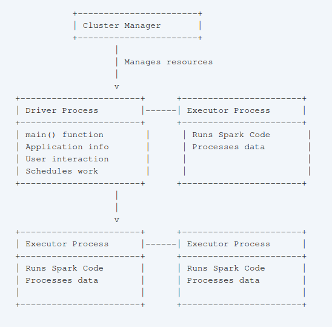

## Introduction To Apache Spark

### Key Features of Apache Spark

- **Unified Platform**: Spark offers a single platform for diverse data processing tasks, enabling developers to use the same engine and APIs for different types of data analysis, like processing data in batches, running SQL queries, handling real-time data streams, and even machine learning.
- **Rich Libraries**: Spark includes a collection of built-in and external libraries, such as Spark SQL for structured data processing, MLlib for machine learning, Spark Streaming and Structured Streaming for stream processing, and GraphX for graph analytics.
- **Designed for Big Data**: Spark addresses the challenges of processing massive datasets, driven by changes in hardware towards multi-core processors and the explosion in data volume and storage capabilities.

### History and Evolution

- **Origins**: Spark originated in 2009 at UC Berkeley's AMPlab as a research project aimed at overcoming the limitations of Hadoop MapReduce for iterative algorithms.
- **Early Focus**: Initial releases concentrated on batch applications and interactive data science using Scala and Shark (a SQL engine).
- **Expansion**: Spark adopted a "standard library" approach, expanding with libraries like MLlib, Spark Streaming, and GraphX.
- **Open Source Development**: In 2013, Spark became part of the Apache Software Foundation, leading to active development and widespread adoption.
- **Recent Developments**: Recent releases have focused on refining structured APIs such as DataFrames and Datasets for enhanced optimisation

### Architecture of Apache Spark

- **Cluster Management**: Spark uses a cluster manager, such as standalone, YARN, or Mesos, to manage cluster resources.
- **Application Structure**: A Spark application consists of a driver process and multiple executor processes.
  - **Driver Process**: The driver runs the `main()` function, maintains application information, interacts with the user, and schedules tasks across executors.
  - **Executor Processes**: Executors execute Spark code on data partitions distributed across the cluster.



Spark supports multiple language APIs, including Python, Java, Scala, R, and SQL [5]. Developers can write applications in their preferred language.

### Core Concepts and APIs

#### Core Concepts

- Unified Analytics Engine: Spark provides a consistent set of APIs for various data processing tasks, including batch processing, SQL queries, streaming computation, and machine learning.
- Computing Engine Focus: Spark primarily processes data loaded from diverse storage systems, rather than functioning as permanent storage itself.
- Parallel Processing: Spark leverages parallel processing to efficiently analyse massive datasets, addressing the challenges posed by the shift to multi-core processors and the explosion of data.
- Lazy Evaluation: Spark optimises execution plans before processing, delaying action until triggered.

#### APIs

- **SparkSession**: The entry point for interacting with Spark functionality, managing the Spark application and providing access to various APIs.
- **DataFrames**: The primary structured API representing tabular data in rows and columns
  - **Partitions**: Data is divided into partitions for parallel processing across executors
  - **Transformations**: Operations that define modifications to a DataFrame without altering the original data, including narrow transformations that operate within partitions and wide transformations that involve shuffling data across partitions.
  - **Actions**: Actions trigger the execution of transformations and return results
- **Datasets**: A type-safe version of the structured API in Java and Scala, enabling compile-time checks for data types
- **Resilient Distributed Datasets (RDDs)**: Spark's lower-level API, providing more control over data partitioning and manipulation but less commonly used in modern Spark applications
- **Structured Streaming**: A high-level API that allows applying batch-like operations to streaming data
- **MLlib**: Spark's machine learning library, offering algorithms for classification, regression, clustering, and deep learning

### Running Spark Applications and Ecosystem

- **Spark-submit**: A command-line tool for submitting Spark applications to a cluster, allowing for resource specification, execution parameters, and command-line arguments.
- **Spark Ecosystem and Packages**: A wide range of third-party packages expands Spark's functionality and integrates with various systems.

### Conclusion

Spark provides a powerful and versatile platform for tackling big data challenges across various domains. Its unified engine, rich libraries, and intuitive APIs empower developers to efficiently process, analyse, and extract insights from large datasets.

## Programming Spark Applications

### Chapter 3: Building and Running a Spark Application

Spark applications can be built and run in different ways:

- **Interactive Mode with Spark Shell**: This method is suitable for quick prototyping and interactive data exploration. Spark provides a shell interface for Scala, Python, and R, allowing users to execute commands and get immediate feedback. This interactive mode is excellent for learning Spark APIs, testing code snippets, and performing ad-hoc data analysis.
- **IDE for Application Development**: For developing more complex applications, Integrated Development Environments (IDEs) like Eclipse and IntelliJ are popular choices. These IDEs provide features like code completion, debugging, and project management, making it easier to develop, test, and deploy Spark applications.

#### Building Spark Jobs with Maven

Building Spark jobs is slightly more intricate than building standard applications. This complexity arises because Spark applications often need to be executed on a cluster of machines, requiring Spark dependencies to be available on all nodes. There are two primary methods for building Spark jobs:

- **Building with Maven**: Maven is a widely used build tool in the Java ecosystem, and it is officially recommended for packaging Spark applications. Maven simplifies the build process by managing dependencies, compiling code, and packaging it into a JAR file. Developers can include Spark dependencies through Maven Central, a public repository for Java libraries. Maven can also package Spark and its dependencies into a single executable JAR file, making it easier to deploy and run on a cluster.
- **Building with Other Build Systems**: While Maven is the recommended build tool, Spark supports building a "fat JAR" file that contains all its dependencies. This fat JAR can be used with other build systems like Sbt, Gradle, or even custom build scripts. The process usually involves building the Spark assembly JAR using Sbt and then including it in the build path of the other build system. This approach allows developers to use their preferred build tools while still ensuring that all necessary dependencies are included.

Steps to build a Spark Job with **Maven**:

- Create a new directory and generate the Maven template. The example shows building a Java Spark job:

```bash
mkdir example-java-build/; cd example-java-build
mvn archetype:generate \
    -DarchetypeGroupId=org.apache.maven.archetypes \
    -DgroupId=spark.examples \
    -DartifactId=JavaWordCount \
    -Dfilter=org.apache.maven.archetypes:maven-archetype-quickstart
cp ../examples/src/main/java/spark/examples/JavaWordCount.java \
JavaWordCount/src/main/java/spark/examples/JavaWordCount.java
```

- Update Maven `pom.xml` to include Spark version and JDK version information. Add the following code between the <project> tags:

```xml
<dependencies>
    <dependency>
        <groupId>junit</groupId>
        <artifactId>junit</artifactId>
        <version>4.11</version>
        <scope>test</scope>
    </dependency>
    <dependency>
        <groupId>org.spark-project</groupId>
        <artifactId>spark-core_2.11</artifactId>
        <version>2.0.0</version>
    </dependency>
</dependencies>
<build>
    <plugins>
        <plugin>
            <groupId>org.apache.maven.plugins</groupId>
            <artifactId>maven-compiler-plugin</artifactId>
            <configuration>
                <source>1.7</source>
                <target>1.7</target>
            </configuration>
        </plugin>
    </plugins>
</build>
```

- Build the JAR file:

```bash
mvn package
```

- Run the Spark job:

```bash
SPARK_HOME="../"
SPARK_EXAMPLES_JAR="./target/JavaWordCount-1.0-SNAPSHOT.jar"
java -cp ./target/JavaWordCount-1.0-SNAPSHOT.jar:../../core/target/spark-core-assembly-1.5.2.jar spark.examples.JavaWordCount local[1] ../../README
```

### Chapter 4: Creating a SparkSession Object

#### Understanding the SparkSession Object

The SparkSession object acts as the primary entry point for interacting with Spark functionalities. Introduced in Spark 2.0.0, it represents a connection to a Spark cluster, which can be either local for development and testing or remote for distributed processing on a cluster of machines. The SparkSession provides a unified interface for various Spark components and operations:

- **Unified Entry Point**: Before SparkSession, developers had to interact with multiple context objects like SparkContext, SQLContext, and HiveContext for different functionalities. SparkSession encapsulates these contexts, providing a single entry point for all Spark operations, simplifying the development process.
- **Dataset and DataFrame Creation**: SparkSession enables the creation of Datasets and DataFrames, which are high-level abstractions for representing structured data in Spark. Datasets are type-safe, providing compile-time type checking, while DataFrames offer a schema-based view of the data.
- **SQL Execution**: SparkSession facilitates the execution of SQL queries against data in Spark. It allows users to register DataFrames as temporary views and then run SQL queries against those views, providing a familiar way to interact with data.
- **RDD Access**: While Datasets and DataFrames are the preferred abstractions in Spark 2.0.0 and later, SparkSession still provides access to the underlying RDDs (Resilient Distributed Datasets). Developers can obtain the SparkContext from the SparkSession to work with RDDs when necessary.

#### Working with Datasets, DataFrames, and RDDs

Spark provides different abstractions for representing and manipulating data:

- **Datasets and DataFrames**: These are high-level, schema-based abstractions introduced in Spark 2.0.0. Datasets provide type safety and compile-time checking, while DataFrames are untyped but offer a schema-based view of the data. Both Datasets and DataFrames offer a rich API for data manipulation, including filtering, sorting, grouping, aggregation, and joining operations. They are built on top of RDDs and leverage Catalyst, Spark's query optimizer, to optimize execution plans for better performance.
- **RDDs**: RDDs are the fundamental data structure in Spark, representing an immutable, partitioned collection of data distributed across the cluster. RDDs provide low-level control over data and operations, allowing developers to implement custom data processing logic. They are useful for complex computations that cannot be efficiently expressed using Dataset or DataFrame APIs. RDDs follow lazy evaluation, meaning that transformations on RDDs are not executed immediately but are computed only when an action requiring the results is called.

The choice of abstraction depends on the specific use case and the level of control required. Datasets and DataFrames are generally preferred for most data manipulation tasks due to their higher-level API, performance optimizations, and ease of use. RDDs are suitable for situations demanding low-level control or when dealing with unstructured data.

#### Building a SparkSession Object

Scala and Python:

```java
val sparkSession = new SparkSession.builder.master(master_path).appName("application name").config("optional configuration parameters").getOrCreate()
```

- It's recommended to read values from the environment with reasonable defaults for flexibility in changing environments.
- `spark-shell/pyspark` automatically creates the SparkSession object and assigns it to the spark variable.
- Access the SparkContext object using spark.sparkContext.

### Chapter 5: Loading and Saving Data in Spark

Spark offers flexible mechanisms for loading and saving data from various sources and formats:

- **Loading Data into RDDs**: Data can be loaded into RDDs from various sources, including local collections, text files, CSV files, sequence files, and external databases like HBase. SparkContext provides functions like `parallelize()`, `textFile()`, `sequenceFile()`, and `newAPIHadoopRDD()` to load data into RDDs.
- **Saving Data from RDDs**: RDDs can be saved to different formats like text files, sequence files, and object files. Functions like `saveAsTextFile()`, `saveAsObjectFile()`, and `saveAsSequenceFile()` are used to save RDD data.
- **Loading and Saving Data with Datasets and DataFrames**: Datasets and DataFrames provide more streamlined and efficient methods for data loading and saving. SparkSession's read API supports reading data from various formats like CSV, JSON, Parquet, Avro, and JDBC. Similarly, the write API allows saving data to different formats.

### Chapter 6: Manipulating Your RDD

Spark offers a rich set of operations for manipulating data in RDDs, Datasets, and DataFrames:

- **Transformations**: Transformations are operations that create new RDDs, Datasets, or DataFrames from existing ones without changing the original data. Common transformations include `map()`, `filter()`, `flatMap()`, `reduceByKey()`, `groupByKey()`, and `sortByKey()`.
- **Actions**: Actions are operations that trigger computations on RDDs, Datasets, or DataFrames and return results to the driver program. Examples of actions include `count()`, `collect()`, `reduce()`, `take()`, and `saveAsTextFile()`.
- **Shared States and Accumulators**: While distributed computation in Spark generally discourages shared states, accumulators provide a safe mechanism for aggregating values from different partitions across the cluster. Accumulators are write-only variables that can be used to count events or sum values from different parts of the data.
- **Broadcast Variables**: Broadcast variables enable efficient sharing of read-only data across the cluster. Instead of sending the data to every task, Spark broadcasts the data once to each executor node, making it available to all tasks running on that node.

**Example: Parsing CSV Files with Error Handling (Scala)**

```java
import org.apache.spark.SparkConf
import org.apache.spark.SparkContext
import org.apache.spark.SparkFiles
import org.apache.spark.api.java.JavaSparkContext
import au.com.bytecode.opencsv.CSVReader
import java.io.StringReader

object LoadCsvWithCountersExample {

  def main(args: Array[String]) {

    val sc = new SparkContext("local", "Chapter 6")
    println(s"Running Spark Version ${sc.version}")

    val invalidLineCounter = sc.accumulator(0)
    val invalidNumericLineCounter = sc.accumulator(0)

    val inFile = sc.textFile("/Volumes/sdxc-01/fdps-vii/data/Line_of_numbers.csv")

    val splitLines = inFile.flatMap(line => {

      try {
        val reader = new CSVReader(new StringReader(line))
        Some(reader.readNext())
      } catch {
        case _ => {
          invalidLineCounter += 1
          None
        }
      }
    })

    val numericData = splitLines.flatMap(line => {

      try {
        Some(line.map(_.toDouble))
      } catch {
        case _ => {
          invalidNumericLineCounter += 1
          None
        }
      }
    })

    val summedData = numericData.map(row => row.sum)
    println(summedData.collect().mkString(","))
    println("Errors: " + invalidLineCounter + "," + invalidNumericLineCounter)
  }
}
```

This example demonstrates the use of accumulators to count invalid lines and lines with invalid numeric data. It also utilises `flatMap()` to handle parsing errors and filter out invalid lines.

**Example: Word Frequency Analysis (Python)**

```python
from pyspark.context import SparkContext
from pyspark.conf import SparkConf
from operator import add

print("Running Spark Version %s" % (sc.version))
conf = SparkConf()
print(conf.toDebugString())

## Read and process Barack Obama's speeches
lines = sc.textFile("sotu/2009-2014-BO.txt")
word_count_bo = lines.flatMap(lambda x: x.split(' ')). \
    map(lambda x: (x.lower().rstrip().lstrip().rstrip(',').rstrip('.'), 1)). \
    reduceByKey(add)

word_count_bo.count()  # 6658 without lower, 6299 with lower, rstrip, lstrip 4835

## Read and process Abraham Lincoln's speeches
lines = sc.textFile("sotu/1861-1864-AL.txt")
word_count_al = lines.flatMap(lambda x: x.split(' ')). \
    map(lambda x: (x.lower().rstrip().lstrip().rstrip(',').rstrip('.'), 1)). \
    reduceByKey(add)

word_count_al.count()

## Sort word counts for Barack Obama's speeches
word_count_bo_1 = word_count_bo.sortBy(lambda x: x[1], ascending=False)

## Print top 10 most frequent words
for x in word_count_bo_1.take(10):
    print(x)

## Filter out common words
common_words = [...]
word_count_bo_clean = word_count_bo_1.filter(lambda x: x not in common_words)
word_count_al_clean = word_count_al.filter(lambda x: x not in common_words)

## Find words spoken by Obama but not Lincoln
for x in word_count_bo_clean.subtractByKey(word_count_al_clean).sortBy(lambda x: x[1], ascending=False).take(15):
    print(x)
```

This example illustrates reading text files, splitting into words, calculating word frequencies, sorting, filtering, and comparing word usage between two sets of speeches.

### Chapter 9: Foundations of Datasets/DataFrames – The Proverbial Workhorse for Data Scientists

Spark supports multiple programming languages, including Scala, Java, Python, and R. This multilingual capability allows developers to use the language they are most comfortable with for different parts of a Spark application. This approach, known as polyglot programming, offers several advantages:

- **Leveraging Existing Skills**: Developers can use their existing language skills to work with Spark without having to learn a new language.
- **Using Specialized Libraries**: Different languages have different strengths and specialized libraries. Polyglot programming allows developers to use the most suitable language and libraries for specific tasks within a Spark application.
- **Code Reusability**: Code written in one language can often be reused or adapted for use in other languages, promoting code sharing and reducing development time.
- Spark encourages polyglot programming by providing consistent APIs across different languages, making it easy to switch between languages and integrate code written in different languages.

## Librerías/Componentes de Spark

### Spark SQL

Spark SQL is an important feature in the Spark ecosystem that allows integration with different data sources and other subsystems, such as visualization. Spark SQL is not meant to replace SQL databases, but rather to complement Spark's data wrangling and input capabilities by providing a versatile query interface for Spark data. This ability to scale complex data operations is only valuable if the results can be used flexibly, which is what Spark SQL achieves.

#### Spark SQL Architecture

Spark SQL's architecture is layered, with each layer performing specific functions.

- The bottom layer is the data access layer, which works with multiple formats and typically utilizes a distributed filesystem such as HDFS.
- The computation layer leverages the distributed processing power of the Spark engine, including its streaming capabilities, and typically operates on RDDs (Resilient Distributed Datasets).
- The Dataset/DataFrame layer provides the API for interacting with the data.
- Spark SQL sits on top of this layer, providing data access for various applications, dashboards, and BI tools.

This architecture allows Spark to leverage the vast knowledge base of SQL among data professionals and use it to query Spark data.

#### Spark SQL Evolution

Prior to Spark 2.0, SchemaRDD was at the heart of Spark SQL. It essentially attached a schema to an RDD, enabling SQL queries to be run on RDDs. However, with Spark 2.0, Datasets became the primary way to work with data. Datasets offer the advantages of both RDDs and strong typing, providing a more robust and efficient way to handle data. In languages like Python and R, which lack compile-time type checking, Datasets and DataFrames are merged and referred to as DataFrames.

#### Spark SQL Programming

Spark 2.0 introduced `sparkSession`, which replaced `sqlcontext`, `hivecontext`, and other components. The `sparkSession` instance has a versatile `read` method capable of handling various data formats like CSV, Parquet, JSON, and JDBC. This method allows you to specify format-related options such as headers and delimiters.

To use Spark SQL, you first need to create a Dataset by reading data from a source and informing Spark about its structure and types. You can then apply SQL statements to query the data. To create a view that can be queried using SQL, you can use the `createOrReplaceTempView` method. You can then use SQL statements to filter, join, and aggregate data within these views.

#### Example Workflow

A typical Spark SQL workflow involves:

- Defining a case class to represent the data structure.
- Reading the data file using `sparkSession.read`, specifying options like `header` and `inferSchema`.
- Creating a Dataset with the case class as its element type.
- Creating a temporary view using `createOrReplaceTempView` for SQL access.
- Running SQL queries on the view using `spark.sql`.
- Displaying and analyzing the results using methods like `show`, `head`, and `orderBy`

#### Important Points

- Spark 2.0 simplified Spark SQL by introducing Datasets and `sparkSession`.
- You can start the Spark shell with the `-deprecation` flag to receive messages about deprecated methods.
- The read method can infer schema automatically using the `inferSchema` option.
- Use `createOrReplaceTempView` to avoid the `TempTableAlreadyExists` exception.
- Spark SQL enables complex queries involving multiple tables and various operations like filtering, joining, and aggregation.

#### Code Examples in Spark SQL

**Example 1: Loading a CSV File into a Dataset**

```java
case class Employee(EmployeeID : String,   LastName : String, FirstName : String, Title : String,   BirthDate : String, HireDate : String,   City : String, State : String, Zip : String, Country : String,   ReportsTo : String)
// ... ...
val filePath = "/Users/ksankar/fdps-v3/"
println(s"Running Spark Version ${sc.version}")
// val employees = spark.read.option("header","true"). csv(filePath + "data/NW-Employees.csv").as[Employee]
println("Employees has "+employees.count()+" rows")
employees.show(5)
employees.head()
```

This code snippet first defines a case class called `Employee` representing the structure of the employee data. Then, it sets a `filePath` variable pointing to the directory containing the data files. The code then uses the `spark.read.csv` method to read the CSV file into a Dataset called `employees`. The `option("header", "true")` tells Spark that the first row of the CSV file contains column headers. The `.as[Employee]` part specifies that the Dataset should be composed of `Employee` objects. Finally, the code prints the number of rows in the Dataset, displays the first $5$ rows using `show(5)`, and retrieves the first row using `head()`.

**Example 2: Creating a View and Running SQL Queries**

```java
employees.createOrReplaceTempView("EmployeesTable")
var result = spark.sql("SELECT * from EmployeesTable")
result.show(5)
result.head(3)
// employees.explain(true)

result = spark.sql("SELECT * from EmployeesTable WHERE State = 'WA'")
result.show(5)
result.head(3)
// result.explain(true)
```

This code creates a temporary view called "`EmployeesTable`" from the employees Dataset using `createOrReplaceTempView`. This view enables you to query the Dataset using SQL statements. The first `spark.sql` statement selects all columns from the "`EmployeesTable`" view. The second query filters the results to include only employees from the state of Washington (`WHERE State = 'WA'`). Both queries use `show(5)` to display the first $5$ rows of the result and `head(3)` to retrieve the first $3$ rows.

**Example 3: Handling Multiple Tables and Joins**

```java
// ... ...
val orders = spark.read.option("header","true").
option("inferSchema","true").
csv(filePath + "data/NW-Orders.csv").as[Order]
println("Orders has "+orders.count()+" rows")
orders.show(5)
orders.head()
orders.dtypes
// ... ...
// // Now the interesting part //
result = spark.sql("SELECT OrderDetailsTable.OrderID, ShipCountry, UnitPrice, Qty, Discount FROM OrdersTable INNER JOIN OrderDetailsTable ON OrdersTable.OrderID = OrderDetailsTable.OrderID")
result.show(10)
result.head(3)
// // Sales By Country //
result = spark.sql("SELECT ShipCountry, SUM(OrderDetailsTable.UnitPrice ** Qty ** Discount) AS ProductSales FROM OrdersTable INNER JOIN OrderDetailsTable ON OrdersTable.OrderID = OrderDetailsTable.OrderID GROUP BY ShipCountry")
result.count()
result.show(10)
result.head(3)
result.orderBy($"ProductSales".desc).show(10) // Top 10 by Sales
```

This example demonstrates loading the "`Orders`" table, creating a view, and then performing joins and aggregations. It first reads the "`NW-Orders.csv`" file into an orders Dataset. Notably, it uses the `option("inferSchema", "true")` option, which tells Spark to automatically infer the schema for the data. This eliminates the need to define a case class beforehand.

The code then executes two SQL queries. The first query performs an inner join between the "`OrdersTable`" and "`OrderDetailsTable`" based on the common "`OrderID`" column and selects specific columns from the joined result. The second query calculates total sales (`SUM(OrderDetailsTable.UnitPrice ** Qty ** Discount)`) per country, groups the results by "`ShipCountry`", and orders the final output by "`ProductSales`" in descending order to show the top $10$ countries by sales.

### Machine Learning with Spark ML Pipelines

This section provides a summary of Spark's capabilities for Machine Learning (ML), focusing on ML Pipelines and the transition from MLlib to ML APIs. It covers various ML algorithms, data transformation techniques, and the concept of pipelines for streamlined ML workflows.

#### Spark for Machine Learning

Spark is attractive for ML due to its ability to handle massive computations. Spark 2.0.0 onwards, Spark is considered a leading platform for building ML algorithms and applications.

Spark's ML capabilities are primarily accessed through the `org.apache.spark.ml` package for Scala and Java, and `pyspark.ml` for Python. Spark supports a wide array of ML algorithms, including basic statistics, linear regression, classification, clustering, recommendation systems, dimensionality reduction, feature extraction, and more.

#### ML Pipelines: Addressing the Data Pipeline in ML

Before Spark 1.6.0, the MLlib APIs operated on RDDs, but they lacked support for the data pipelines inherent in ML. With the introduction of DataFrames and Datasets, MLlib evolved into the ML pipeline framework, offering more capabilities and addressing the entire ML workflow.

MLlib APIs are now in maintenance mode and will eventually be deprecated. While you should use ML APIs going forward, some functionalities might require using MLlib and converting the output RDD to a DataFrame for further processing with ML APIs.

A typical ML process involves several steps:

1. Data Acquisition: Obtain data from internal or external sources, ensuring anonymity and removal of personally identifiable information (PII).
2. Data Transformation: Convert raw data into a usable format, for example, transforming a CSV file into a DataFrame.
3. Feature Extraction: Extract relevant features from the data, such as separating text into words or normalizing them.
4. Data Splitting: Divide the data into training and testing sets, using appropriate strategies based on data characteristics like time series or class imbalance.
5. Model Training:

- Fit the training data to different ML models.
- Tune hyperparameters for optimal performance.
- Select the best-performing model for the specific problem.

6. Model Evaluation: Assess the model's performance using the test data.
7. Model Deployment: Implement the trained model in a production environment for real-time predictions.

ML pipelines in Spark address all stages of this workflow.

#### Structure of Spark ML APIs

Spark ML APIs have a specific structure that can be challenging to navigate initially. Familiarity with this structure is key to effectively utilizing Spark for ML tasks. The source material provides a diagram to illustrate this, recommending a deeper understanding of the pipeline concept to enhance proficiency in using Spark ML classes.

#### Code Examples from Spark Machine Learning

##### Basic Statistics with Spark Datasets

This code snippet shows how to load car mileage data from a CSV file, compute basic statistics using Spark Datasets, and calculate the correlation and covariance between specific variables:

```java
val spark = SparkSession.builder
  .master("local")
  .appName("Chapter 11")
  .config("spark.logConf","true")
  .config("spark.logLevel","ERROR")
  .getOrCreate()

println(s"Running Spark Version ${spark.version}")

val filePath = "/Users/ksankar/fdps-v3/"

val cars = spark.read.option("header","true").option("inferSchema","true")
  .csv(filePath + "data/car-data/car-milage.csv")

println("Cars has "+cars.count()+" rows")

cars.show(5)

cars.printSchema()

// Computing statistics

cars.describe("mpg","hp","weight","automatic").show()

var cor = cars.stat.corr("hp","weight")
println("hp to weight : Correlation = %2.4f".format(cor))

var cov = cars.stat.cov("hp","weight")
println("hp to weight : Covariance = %2.4f".format(cov))

cor = cars.stat.corr("RARatio","width")
println("Rear Axle Ratio to width : Correlation = %2.4f".format(cor))

cov = cars.stat.cov("RARatio","width")
println("Rear Axle Ratio to width : Covariance = %2.4f".format(cov))
```

1. SparkSession Creation: The code starts by creating a SparkSession, which is the entry point for Spark applications.
2. Data Loading: The `spark.read.csv()` method loads data from the specified CSV file into a DataFrame named cars. The `option("header","true")` indicates that the first row contains column headers, and `option("inferSchema","true")` instructs Spark to automatically infer the data types for each column.
3. Basic Statistics: The `describe()` method computes summary statistics like `count`, `mean`, `standard deviation`, `min`, and `max` for the specified columns ("mpg", "hp", "weight", "automatic").
4. Correlation and Covariance: The `stat.corr()` and `stat.cov()` methods are used to calculate the correlation and covariance between pairs of variables ("hp" and "weight", "RARatio" and "width").

##### Linear Regression with Data Transformation and Model Evaluation

This code example demonstrates a linear regression model using Spark ML Pipelines. It includes data transformation, feature extraction, splitting data into training and testing sets, fitting the model, making predictions, and evaluating the model:

```java
// Data Transformation and Feature Extraction
val cars1 = cars.na.drop()

val assembler = new VectorAssembler()
assembler.setInputCols(Array("displacement", "hp", "torque", "CRatio", "RARatio", "CarbBarrells", "NoOfSpeed", "length", "width", "weight", "automatic"))
assembler.setOutputCol("features")

val cars2 = assembler.transform(cars1)
cars2.show(40)

// Data Split
val train = cars2.filter(cars1("weight") <= 4000)
val test = cars2.filter(cars1("weight") > 4000)
test.show()
println("Train = "+train.count()+" Test = "+test.count())

// Linear Regression Model
val algLR = new LinearRegression()
algLR.setMaxIter(100)
algLR.setRegParam(0.3)
algLR.setElasticNetParam(0.8)
algLR.setLabelCol("mpg")

val mdlLR = algLR.fit(train)
println(s"Coefficients: ${mdlLR.coefficients} Intercept: ${mdlLR.intercept}")

val trSummary = mdlLR.summary
println(s"numIterations: ${trSummary.totalIterations}")
println(s"Iteration Summary History: ${trSummary.objectiveHistory.toList}")
trSummary.residuals.show()
println(s"RMSE: ${trSummary.rootMeanSquaredError}")
println(s"r2: ${trSummary.r2}")

// Predictions
val predictions = mdlLR.transform(test)
predictions.show()

// Model Evaluation
val evaluator = new RegressionEvaluator()
evaluator.setLabelCol("mpg")
val rmse = evaluator.evaluate(predictions)
println("Root Mean Squared Error = "+"%6.3f".format(rmse))

val mse = evaluator.evaluate(predictions)
println("Mean Squared Error = "+"%6.3f".format(mse))
```

1. Data Preprocessing:

- `cars.na.drop()` removes rows with missing values (NA).
- `VectorAssembler` combines multiple input columns into a single vector column named "features", which is required for many ML algorithms.

2. Data Splitting: The data is split into training and test sets based on the "weight" column.
3. Linear Regression:

- A `LinearRegression` object is created and configured with parameters like maximum iterations (`setMaxIter`), regularization parameter (`setRegParam`), and elastic net parameter (`setElasticNetParam`).
- The model is trained using the `fit()` method on the training data.
- Model coefficients, intercept, and training summary are printed.

4. Predictions: Predictions are made on the test data using the `transform()` method, adding a "predictions" column to the resulting DataFrame.
5. Model Evaluation:

- A `RegressionEvaluator` is used to calculate RMSE and MSE.
- The `evaluate()` method calculates the metrics based on the "mpg" label column and the predicted values.

##### Classification with Decision Tree, Data Transformation and Model Evaluation

This example demonstrates a classification task using a decision tree algorithm. It involves data loading, transformation, feature extraction, model training, prediction, and evaluation:

```java
// Loading Data
val filePath = "/Users/ksankar/fdps-v3/"
val passengers = spark.read.option("header","true").option("inferSchema","true")
  .csv(filePath + "data/titanic3_02.csv")
println("Passengers has "+passengers.count()+" rows")
passengers.show(5)
passengers.printSchema()

// Data Transformation and Feature Extraction
val passengers1 = passengers.select(
  passengers("Pclass"),
  passengers("Survived").cast(DoubleType).as("Survived"),
  passengers("Gender"),
  passengers("Age"),
  passengers("SibSp"),
  passengers("Parch"),
  passengers("Fare")
)

passengers1.show(5)

val indexer = new StringIndexer()
indexer.setInputCol("Gender")
indexer.setOutputCol("GenderCat")

val passengers2 = indexer.fit(passengers1).transform(passengers1)
passengers2.show(5)

val passengers3 = passengers2.na.drop()
println("Orig = "+passengers2.count()+" Final = "+ passengers3.count() + " Dropped = "+ (passengers2.count() - passengers3.count()))

val assembler = new VectorAssembler()
assembler.setInputCols(Array("Pclass", "GenderCat", "Age", "SibSp", "Parch", "Fare"))
assembler.setOutputCol("features")
val passengers4 = assembler.transform(passengers3)
passengers4.show(5)

// Data Split
val Array(train, test) = passengers4.randomSplit(Array(0.9, 0.1))
println("Train = "+train.count()+" Test = "+test.count())

// Decision Tree Model
val algTree = new DecisionTreeClassifier()
algTree.setLabelCol("Survived")
algTree.setImpurity("gini")
algTree.setMaxBins(32)
algTree.setMaxDepth(5)

val mdlTree = algTree.fit(train)
println("The tree has %d nodes.".format(mdlTree.numNodes))
println(mdlTree.toDebugString)
println(mdlTree.toString)
println(mdlTree.featureImportances)

// Predictions
val predictions = mdlTree.transform(test)
predictions.show(5)

// Model Evaluation
val evaluator = new MulticlassClassificationEvaluator()
evaluator.setLabelCol("Survived")
evaluator.setMetricName("accuracy")

val accuracy = evaluator.evaluate(predictions)
println("Test Accuracy = %.2f%%".format(accuracy*100))
```

1. Data Loading: The Titanic passenger data is loaded from a CSV file.
2. Data Transformation and Feature Extraction:

- Relevant columns are selected.
- `StringIndexer` converts the categorical "Gender" column into a numerical "GenderCat" column.
- Rows with missing values are dropped.
- `VectorAssembler` combines selected features into a "features" vector column.

3. Data Splitting: The data is split into training and test sets using `randomSplit()`.
4. Decision Tree Model:

- A `DecisionTreeClassifier` is created and configured with parameters like label column, impurity measure ("gini"), maximum bins, and maximum depth.
- The model is trained using the `fit()` method.
- Model details like the number of nodes, tree structure, and feature importances are printed.

5. Predictions: Predictions are made on the test data.
6. Model Evaluation:

- A `MulticlassClassificationEvaluator` is used to calculate the accuracy of the model.

##### Clustering with K-means, Data Transformation and Model Evaluation

This example illustrates K-means clustering:

```java
// Loading data
// ... (Code for loading data, similar to previous examples)

// Data Transformation and Feature Extraction
val assembler = new VectorAssembler()
assembler.setInputCols(Array("X", "Y"))
assembler.setOutputCol("features")
val data1 = assembler.transform(data)
data1.show(5)

// Clustering Model (K=2)
var algKMeans = new KMeans().setK(2)
var mdlKMeans = algKMeans.fit(data1)

// Predictions
var predictions = mdlKMeans.transform(data1)
predictions.show(3)
predictions.write.mode("overwrite").option("header","true").csv(filePath + "data/cluster-2K.csv")

// Model Evaluation and Interpretation (K=2)
var WSSSE = mdlKMeans.computeCost(data1)
println(s"Within Set Sum of Squared Errors (K=2) = %.3f".format(WSSSE))

println("Cluster Centers (K=2) : " + mdlKMeans.clusterCenters.mkString("<", ",", ">"))
println("Cluster Sizes (K=2) : " + mdlKMeans.summary.clusterSizes.mkString("<", ",", ">"))

// Clustering Model (K=4)
algKMeans = new KMeans().setK(4)
mdlKMeans = algKMeans.fit(data1)

// Model Evaluation and Interpretation (K=4)
WSSSE = mdlKMeans.computeCost(data1)
println(s"Within Set Sum of Squared Errors (K=4) = %.3f".format(WSSSE))

println("Cluster Centers (K=4) : " + mdlKMeans.clusterCenters.mkString("<", ",", ">"))
println("Cluster Sizes (K=4) : " + mdlKMeans.summary.clusterSizes.mkString("<", ",", ">"))

predictions = mdlKMeans.transform(data1)
predictions.show(30)
predictions.write.mode("overwrite").option("header","true").csv(filePath + "data/cluster-4K.csv")
```

1. Data Loading: Data with two dimensions (X and Y) is loaded.
2. Data Transformation: `VectorAssembler` creates a "features" vector column.
3. Clustering Model:

- A `KMeans` object is created and the number of clusters ($K$) is set.
- The model is trained using the `fit()` method.

4. Predictions: Cluster assignments for each data point are predicted.
5. Model Evaluation:

- The `computeCost()` method calculates the Within Set Sum of Squared Errors (WSSE), which is a measure of cluster cohesion.
- Cluster centers and cluster sizes are printed.

6. Running with Different K: The code runs the clustering with K=2 and K=4, comparing the WSSE and cluster characteristics to illustrate the effect of choosing different values for K.

##### Recommendation with ALS, Data Transformation and Model Evaluation

This example demonstrates a recommendation system using the Alternating Least Squares (ALS) algorithm

```java
// Loading data
// ... (Code for loading data from text files, using RDDs and DataFrames)

// Data Transformation and Feature Extraction
// ... (Code for transforming data using RDDs and DataFrames)

// Data Splitting
val Array(train, test) = ratings3.randomSplit(Array(0.8, 0.2))
println("Train = "+train.count()+" Test = "+test.count())

// Recommendation Model
val algALS = new ALS()
algALS.setItemCol("product")
algALS.setRank(12)
algALS.setRegParam(0.1)
algALS.setMaxIter(20)
val mdlReco = algALS.fit(train)

// Predicting Using the Model
val predictions = mdlReco.transform(test)
predictions.show(5)
predictions.printSchema()

// Model Evaluation and Interpretation
val pred = predictions.na.drop()
println("Orig = "+predictions.count()+" Final = "+ pred.count() + " Dropped = "+ (predictions.count() - pred.count()))

val evaluator = new RegressionEvaluator()
evaluator.setLabelCol("rating")
var rmse = evaluator.evaluate(pred)
println("Root Mean Squared Error = "+"%.3f".format(rmse))

var mse = evaluator.evaluate(pred)
println("Mean Squared Error = "+"%.3f".format(mse))
mse = pred.rdd.map(r => rowSqDiff(r)).reduce(_+_) / predictions.count().toDouble
println("Mean Squared Error (Calculated) = "+"%.3f".format(mse))
```

1. Data Loading: MovieLens data is loaded from text files using RDDs and then converted to DataFrames.
2. Data Transformation: The data is transformed to a suitable format for the recommendation algorithm.
3. Data Splitting: The data is split into training and test sets.
4. Recommendation Model:

- An `ALS` object is created and configured with parameters like rank, regularization parameter, and maximum iterations.
- The model is trained on the training data.

5. Predictions: Predictions are made on the test data.
6. Model Evaluation:

- Rows with NaN predictions are dropped to address the cold start problem.
- RMSE and MSE are calculated using a `RegressionEvaluator`.
- MSE is also calculated manually for demonstration purposes.

### GraphX

This summary provides an introduction to graph processing and the Spark GraphX framework.

#### Introduction to Graph Processing

Graph processing involves analysing and manipulating graph structures, which consist of vertices (nodes) connected by edges. This field has long been crucial in industries like logistics, transportation, and social networking, with applications ranging from route optimisation to social network analysis.

The importance of graph processing has surged with the rise of the internet, social media, and large datasets. Applications now include analysing research collaborations, understanding social behaviour in animal populations, and investigating financial networks like the Panama Papers.

#### Graph Processing Systems

There are two main categories of graph-based systems:

- **Graph processing systems** excel at executing complex algorithms on large graph datasets. Examples include Spark GraphX, Pregel BSP, and GraphLab.
- **Graph databases**, like AllegroGraph, Titan, Neo4j, and RDF stores, are designed for efficient graph-based queries.

Organisations with extensive graph-based applications often employ both a graph database and a graph processing system as part of a larger data processing workflow

#### Challenges of Graph Processing

Traditional relational database systems struggle with complex graph algorithms due to their iterative and recursive nature, which often span the entire graph. Partitioning data across multiple systems, common in database systems, is suboptimal for graph algorithms, particularly for "long-tail" graphs with many sparsely connected nodes.

Frameworks like MapReduce, based on data parallelism and disk-based partitioning, also face challenges in efficiently representing and processing graphs, especially when dealing with the numerous edge cuts inherent in long-tail graphs.

#### Spark GraphX

Spark GraphX addresses these challenges by offering graph parallelism over data parallelism and utilising Spark's data-distributed RDD mechanism. This approach combines the strengths of both data and graph parallelism, enabling efficient processing of complex graph algorithms on large datasets.

GraphX provides various partitioning and storage schemes to optimise performance and allows for tuning based on specific application requirements and data characteristics. While GraphX excels at computation, the new GraphFrames API integrates DataFrames with graphs to facilitate powerful graph queries.

##### GraphX Architecture

GraphX is built on top of Spark and leverages its distributed processing capabilities, algorithms, and versioned computation graph. Some machine learning algorithms within Spark also utilise GraphX APIs.
GraphX offers a rich computational model, built-in algorithms, and APIs for developing custom algorithms. It provides functionalities for:

- Graph creation
- Structure queries
- Attribute transformers
- Structure transformers
- Connection mining primitives

##### GraphX Computational Model

GraphX uses a property graph model, where:

1. Vertices are connected by edges.
2. Both vertices and edges can have arbitrary objects as properties, accessible to the APIs.
3. It is a directed multigraph, meaning edges have direction, and multiple edges can exist between vertices.

This model supports various graph types, including bipartite and tripartite graphs. Each vertex consists of a unique ID (64-bit integer) and a property object, while edges comprise source and destination vertex IDs and a property object.

##### Building Graphs with GraphX

There are four ways to create a graph in GraphX:

- Loading an edge list file using `GraphLoader.edgeListFile(...)`.
- Loading edge tuples from RDDs using `fromEdgeTuples()`.
- Creating a graph from a list of edges using `fromEdges()`.
- Creating a graph using edge and vertex RDDs.

The last method offers flexibility, especially when manipulating user-defined objects for vertices and edges

##### GraphX API Landscape

The GraphX APIs are organized into different categories:

- Objects: Edge, EdgeRDD, and others reside under org.apache.spark.graphx.
- Graph Object: Contains APIs like triplets, persist, subgraph, etc..
- Graph Algorithms: Separated under the GraphOps object to distinguish algorithms from graph implementation.
- Analytic Functions: Functions like SVD++, ShortestPath, and others are located under lib

##### Structural APIs

GraphX provides structural APIs for analysing graph structure, such as:

- numEdges and numVertices for getting the number of edges and vertices.
- triplets for accessing edge and connected vertex information together.
- inDegrees and outDegrees for retrieving incoming and outgoing edge counts for vertices.
- subgraph for extracting subgraphs based on edge and vertex property predicates.

##### Community Detection and Analysis

GraphX offers algorithms for exploring network connections and communities, with applications in areas like fraud detection and security. Some key algorithms include:

- `triangleCount` for identifying and counting triangles within the graph, useful for spam detection and community ranking.
- `connectedComponents` for finding groups of vertices connected by paths.
- `stronglyConnectedComponents` for identifying communities with bidirectional connections between all members

##### GraphX Algorithms

GraphX includes various built-in algorithms for graph analysis:

| Algorithm Type             | GraphX Method/Exmaple                                  |
| -------------------------- | ------------------------------------------------------ |
| Graph-Parallel Computation | `aggregateMessages(), Pregel()`                        |
| PageRank                   | `PageRank(), staticPageRank(), personalizedPageRank()` |
| Shortest Paths and SVD++   | `ShortestPaths(), SVD++`                               |
| Label Propagation (LPA)    | `LabelPropagation()`                                   |

PageRank is a prominent algorithm for ranking the importance of vertices, with variations for static iterations, dynamic convergence, and personalized ranking based on a specified vertex.

##### Graph Parallel Computation APIs

GraphX provides two primary APIs for implementing custom graph algorithms:

- aggregateMessages(): A versatile API for aggregating information from neighbouring edges and vertices, operating similarly to a MapReduce paradigm on the graph.
- Pregel(): A more general API that encompasses aggregateMessages() and offers greater flexibility in algorithm design.

##### Partition Strategies

Efficient partitioning of large graphs is crucial for performance in distributed processing. GraphX offers different partition strategies to address the challenges of long-tail graphs and minimise communication overhead:

- Edge cut: Partitions vertices across machines, with communication cost proportional to the number of edges cut.
- Vertex cut: Partitions edges, potentially duplicating vertices, with cost proportional to the number of machines spanned by each vertex.

GraphX defaults to a vertex cut strategy to mitigate hotspot issues caused by uneven distribution of connections. It offers four main strategies: RandomVertexCut, CanonicalRandomVertexCut, EdgePartition1D, and EdgePartition2D.

#### Case Study: AlphaGo Tweet Analytics

The source provides a case study applying GraphX to analyse a retweet network of tweets related to the AlphaGo project. It outlines a data pipeline for collecting, processing, and analysing tweets to understand user rankings, locations, time zones, and follower-followee relationships.

The case study demonstrates the process of modelling the retweet network as a graph, defining vertices as users, edges as retweets, and creating objects to store user and tweet attributes. It then showcases using GraphX to create the graph from the processed tweet data and apply algorithms like PageRank to analyse user influence within the retweet network.

#### Code Examples in the GraphX Source

##### Building a Simple Graph

The source demonstrates building a graph representing a "Giraffe Graph" with two strongly connected groups (cliques) linked by a weak connection.

###### Defining Vertices and Edges

The first step involves defining the vertices and edges, along with their associated properties:

```java
case class Person(name:String,age:Int)
val defaultPerson = Person("NA",0)
val vertexList = List( (1L, Person("Alice", 18)), (2L, Person("Bernie", 17)), (3L, Person("Cruz", 15)), (4L, Person("Donald", 12)), (5L, Person("Ed", 15)), (6L, Person("Fran", 10)), (7L, Person("Genghis",854)) )
val edgeList = List( Edge(1L, 2L, 5), Edge(1L, 3L, 1), Edge(3L, 2L, 5), Edge(2L, 4L, 12), Edge(4L, 5L, 4), Edge(5L, 6L, 2), Edge(6L, 7L, 2), Edge(7L, 4L, 5), Edge(6L, 4L, 4) )
```

- `case class Person(name:String,age:Int)`: Defines a case class to represent a person with attributes for name and age. This will be used as the vertex property.
- `defaultPerson`: Creates an instance of Person with default values, used for vertices not explicitly defined in vertexList but present in edgeList.
- `vertexList`: A list of tuples, where each tuple represents a vertex. The first element of the tuple is the vertex ID (a long integer), and the second is a Person object.
- `edgeList`: A list of Edge objects, where each Edge represents a connection between two vertices. The Edge constructor takes the source vertex ID, destination vertex ID, and an integer representing "betweenness centrality" as arguments.

###### Creating RDDs and the Graph

Next, the code creates RDDs from the vertex and edge lists and constructs the graph:

```java
val vertexRDD = sc.parallelize(vertexList)
val edgeRDD = sc.parallelize(edgeList)
val graph = Graph(vertexRDD, edgeRDD,defaultPerson)
```

- `sc.parallelize(...)`: The parallelize method of the SparkContext (sc) creates an RDD from the provided list.
- `Graph(vertexRDD, edgeRDD, defaultPerson)`: This constructs the graph using the vertex RDD, edge RDD, and the `defaultPerson` object for handling missing vertices.

##### Structural APIs

The source presents examples using structural APIs to query the graph:

```java
graph.numEdges
graph.numVertices
val vertices = graph.vertices
vertices.collect.foreach(println)
val edges = graph.edges
edges.collect.foreach(println)
val triplets = graph.triplets
triplets.take(3)
triplets.map(t=>t.toString).collect().foreach(println)
```

- `numEdges` and `numVertices`: These methods return the number of edges and vertices in the graph, respectively.
- `vertices` and `edges`: These properties provide access to the RDDs containing the vertices and edges of the graph.
- `collect`: This action retrieves all elements of an RDD to the driver program.
- `foreach(println)`: Iterates through the collected elements and prints each one.
- `triplets`: This property returns an RDD of EdgeTriplet objects, each representing an edge along with its source and destination vertices and their properties.
- `take(3)`: Retrieves the first three elements of the RDD.
- `map(t => t.toString)`: Transforms each EdgeTriplet into a string representation.

###### Extracting Subgraphs

The source demonstrates extracting subgraphs based on edge and vertex properties:

```java
val inDeg = graph.inDegrees
inDeg.collect()
val outDeg = graph.outDegrees
outDeg.collect()
val allDeg = graph.degrees
allDeg.collect()
val g1 = graph.subgraph(epred = (edge) => edge.attr > 4)
g1.triplets.collect.foreach(println)
val g2 = graph.subgraph(vpred = (id, person) => person.age > 21)
g2.triplets.collect.foreach(println)
```

- `inDegrees`, `outDegrees`, `degrees`: These methods calculate the incoming, outgoing, and total degrees for each vertex, respectively.
- `subgraph(epred = ..., vpred = ...)`: This method creates a subgraph by applying predicates to filter edges and vertices.
  - `epred` is a function that takes an Edge object and returns a boolean indicating whether to include the edge.
  - `vpred` is a function that takes a vertex ID and its corresponding property object and returns a boolean indicating whether to include the vertex.

##### Community Detection

The source shows examples of using GraphX algorithms for community detection:

```java
val cc = graph.connectedComponents()
cc.triplets.collect
graph.connectedComponents.vertices.map(_.swap).groupByKey.map(_._2).collect
cc.vertices.map(_._2).collect.distinct.size
cc.vertices.groupBy(_._2).map(p=>(p._1,p._2.size)).sortBy(x=>x._2,false).collect()
val ccS = graph.stronglyConnectedComponents(10)
ccS.triplets.collect
ccS.vertices.map(_.swap).groupByKey.map(_._2).collect
ccS.vertices.map(_._2).collect.distinct.size
val triCounts = graph.triangleCount()
val triangleCounts = triCounts.vertices.collect
```

- `connectedComponents()`: This algorithm finds groups of vertices connected by paths, returning a new graph where each vertex is assigned the ID of its connected component.
- `stronglyConnectedComponents(10)`: This algorithm identifies strongly connected components, where bidirectional paths exist between all members. The argument 10 specifies the maximum number of iterations.
- `triangleCount()`: This algorithm counts the number of triangles each vertex participates in.

These code snippets showcase various operations on the resulting graphs, such as collecting triplets, grouping vertices, and counting connected components.

##### PageRank Calculation

```java
val ranks = graph.pageRank(0.1).vertices
ranks.collect().foreach(println)
val topVertices = ranks.sortBy(_._2,false).collect.foreach(println)
```

- `pageRank(0.1)`: This algorithm calculates the PageRank for each vertex in the graph. The argument 0.1 specifies the damping factor.
- `sortBy(_._2, false)`: Sorts the PageRank results in descending order based on the PageRank value `(_._2)`.

##### Aggregate Messages API

The source provides examples using the aggregateMessages() API to perform computations on the graph:

###### Finding the Oldest Follower

```java
val oldestFollower = graph.aggregateMessages[Int](
  edgeContext => edgeContext.sendToDst(edgeContext.srcAttr.age),
  (x,y) => math.max(x,y)
)
oldestFollower.collect()
```

- `aggregateMessages[Int](...)`: This API aggregates values from neighbouring vertices and edges. It takes two functions as arguments:
- `sendMsg`: A function that operates on each edge context (EdgeContext) and sends messages to either the source or destination vertex. In this case, it sends the age of the source vertex (srcAttr.age) to the destination vertex using sendToDst.
- `mergeMsg`: A function that combines messages received at each vertex. Here, it uses math.max to determine the oldest age among the received messages.

###### Finding the Oldest Followee

```java
val oldestFollowee = graph.aggregateMessages[Int](
  edgeContext => edgeContext.sendToSrc(edgeContext.dstAttr.age),
  (x,y) => math.max(x,y)
)
oldestFollowee.collect()
```

This example is similar to the previous one but uses `sendToSrc` to send the age of the destination vertex (dstAttr.age) to the source vertex.

###### Calculating In-Degree and Out-Degree

```java
var iDegree = graph.aggregateMessages[Int](
  edgeContext => edgeContext.sendToDst(1),
  (x,y) => x+y
)
iDegree.collect()
graph.inDegrees.collect()

val oDegree = graph.aggregateMessages[Int](
  edgeContext => edgeContext.sendToSrc(1),
  (x,y) => x+y
)
oDegree.collect()
graph.outDegrees.collect()
```

These examples demonstrate implementing the `inDegrees` and `outDegrees` functionality using the `aggregateMessages()` API. They send a message of 1 to either the destination (for in-degree) or source (for out-degree) vertex for each edge and then sum the messages received at each vertex using `x + y`.

##### AlphaGo Tweet Analytics

We present a case study using GraphX to analyse a retweet network of tweets related to the AlphaGo project. The provided code snippets focus on data loading and transformation to create the graph:

###### Loading Data and Creating a DataFrame

```java
import org.apache.spark.SparkContext
import org.apache.spark.SparkConf
import org.apache.spark.graphx._
println(new java.io.File( "." ).getCanonicalPath)
println(s"Running Spark Version ${sc.version}")
val df = sqlContext.read.format("com.databricks.spark.csv").option("header", "false").option("inferSchema", "true").option("delimiter","|").load("file:/Users/ksankar/fdps-v3/data/reTweetNetwork-small.psv")
df.show(5)
df.count()
case class User(name:String, location:String, tz : String, fr:Int,fol:Int)
case class Tweet(id:String,count:Int)
val graphData = df.rdd
println("--- The Graph Data ---")
graphData.take(2).foreach(println)
```

- Import statements: Import necessary classes from Spark and GraphX.
- Print statements: Print the current directory and Spark version.
- `sqlContext.read...`: Reads the data from a pipe-separated value (PSV) file into a DataFrame using the spark-csv package.
- `case class User(...)` and `case class Tweet(...)`: Define case classes to represent user and tweet data.
- `graphData = df.rdd`: Extracts the underlying RDD from the DataFrame.

###### Mapping Data to Vertices and Edges

```java
val vert1 = graphData.map(row => (row(3).toString.toLong,User(row(4).toString,row(5).toString,row(6).toString,row(7).toString.toInt,row(8).toString.toInt)))
println("--- Vertices-1 ---")
vert1.count()
vert1.take(3).foreach(println)
val vert2 = graphData.map(row => (row(9).toString.toLong,User(row(10).toString,row(11).toString,row(12).toString,row(13).toString.toInt,row(14).toString.toInt)))
println("--- Vertices-2 ---")
vert2.count()
vert2.take(3).foreach(println)
val vertX = vert1.++(vert2)
println("--- Vertices-combined ---")
vertX.count()
val edgX = graphData.map(row => (Edge(row(3).toString.toLong,row(9).toString.toLong,Tweet(row(0).toString,row(1).toString.toInt))))
println("--- Edges ---")
edgX.take(3).foreach(println)
```

- `vert1` and `vert2`: These variables use map transformations on the graphData RDD to extract user data from different columns of the data and create RDDs of vertices.
- `vertX = vert1.++(vert2)`: Combines the two vertex RDDs.
- `edgX`: Uses a map transformation to extract tweet data and create an RDD of edges.

###### Creating the Graph and Running Algorithms

```java
val rtGraph = Graph(vertX,edgX)
val ranks = rtGraph.pageRank(0.1).vertices
println("--- Page Rank ---")
ranks.take(2)
println("--- Top Users ---")
val topUsers = ranks.sortBy(_._2,false).take(3).foreach(println)
val topUsersWNames = ranks.join(rtGraph.vertices).sortBy(_._2._1,false).take(3).foreach(println)
println("--- How Big ? ---")
rtGraph.vertices.count
rtGraph.edges.count
println("--- How many retweets ? ---")
val iDeg = rtGraph.inDegrees
val oDeg = rtGraph.outDegrees
iDeg.sortBy(_._2,false).take(3).foreach(println)
oDeg.sortBy(_._2,false).take(3).foreach(println)
println("--- Max retweets ---")
val topRT = iDeg.join(rtGraph.vertices).sortBy(_._2._1,false).take(3).foreach(println)
val topRT1 = oDeg.join(rtGraph.vertices).sortBy(_._2._1,false).take(3).foreach(println)
```

- `rtGraph = Graph(vertX, edgX)`: Constructs the graph from the vertex and edge RDDs.
- `pageRank(0.1)`: Calculates PageRank.
- `sortBy(...)`: Sorts results.
- `join(...)`: Joins RDDs to combine data.
- `inDegrees` and `outDegrees`: Calculate in-degree and out-degree values.

## Configuración, monitorización y optimización de Spark

### Monitoring Spark Applications

This document explains how to monitor Spark applications using logs and the Spark UI. It covers the different components involved in a Spark application and what to monitor to ensure its smooth execution.

#### What to monitor

When monitoring a Spark application, it's essential to monitor the following:

- Processes: Monitor processes running your application at the level of CPU usage, memory usage etc.
- Query Execution: Keep track of jobs, tasks and other aspects of query execution.

#### Monitoring the Driver and Executors

- Importance: The driver holds the application's state and executors run individual jobs. It's crucial to monitor both to ensure their stability.
- Metrics System: Spark provides a configurable metrics system based on the Dropwizard Metrics Library to monitor driver and executor states.
- Configuration: The metrics system can be configured using a configuration file located at $SPARK_HOME/conf/metrics.properties.
- Output Sinks: The metrics can be output to various sinks, including cluster monitoring solutions like Ganglia.

#### Monitoring Queries and Tasks

- Granular Monitoring: Spark allows you to monitor individual queries, jobs, stages, and tasks.
- Performance Tuning: This granular information helps you with performance tuning and debugging.

#### Spark Logs

- Detailed Monitoring: Spark logs offer a detailed way to monitor applications, highlighting strange events or errors that might cause job failures.
- Integrated Logging: If you use the application template provided in this book, your application logs will appear alongside Spark's logs. This makes it easy to correlate the two.
- Changing Log Level: You can change Spark's log level to adjust the detail of the logs.
- Log Location: Logs are either printed to standard error in local mode or saved to files by your cluster manager when running Spark on a cluster.
- Benefits of Log Collection: Collecting logs helps you debug issues and can be referenced in the future if an application crashes.

#### Spark UI

- Visual Monitoring: The Spark UI provides a visual interface for monitoring running applications and viewing metrics about your Spark workload.
- Accessibility: Each Spark Context launches a web UI, by default on port 4040, accessible via your web browser. Multiple applications will launch web UIs on increasing port numbers (4041, 4042...).
- UI Tabs: The UI includes tabs for Jobs, Stages, Storage, Environment, SQL, and Executors, providing information on the corresponding aspects of your Spark application.

Example: This document walks through an example using the SQL tab to trace a query execution, providing a visual representation of the job, stages and tasks. The example shows how to:

- Navigate to the SQL tab in the Spark UI after running a SQL query.
- Interpret aggregate statistics about the query, such as submission time, duration, and number of jobs.
- Understand the Directed Acyclic Graph (DAG) of Spark stages, where each blue box represents a stage of Spark tasks, forming a job.
- Examine each stage to understand its function.
- Analyse the job's execution in the Jobs tab, breaking down stages and tasks.
- Click individual stages to view detailed information about their execution.
- Review the Summary Metrics section, which provides statistics about various metrics.
- Examine per-executor details to identify any struggling executors.
- Access and understand the more detailed metrics by clicking "Show Additional Metrics."

Other Tabs:

- Storage: Shows information about cached RDDs/DataFrames on the cluster, helpful for seeing if data has been evicted from the cache.
- Environment: Shows information about the runtime environment, including Scala, Java, and configured Spark properties.
- Configuration: You can configure the Spark UI using network configurations and behaviour settings. Refer to the relevant table on Spark UI Configurations in the Spark documentation.

#### Spark REST API

- Programmatic Access: The Spark REST API offers programmatic access to Spark's status and metrics.
- Location: The REST API is available at http://localhost:4040/api/v1.
- Purpose: The REST API enables the building of visualisations and monitoring tools on top of Spark.
- Data: It exposes similar information to the web UI, except for SQL-related information.
- Use: The API is valuable for building custom reporting solutions. For a list of API endpoints, consult the relevant table on REST API Endpoints in the Spark documentation.

#### Spark UI History Server

- Post-Execution Access: The Spark UI History Server provides access to the Spark UI and REST API even after an application ends or crashes.
- Requirement: The application must be configured to save an event log using spark.eventLog.enabled and spark.eventLog.dir settings.
- Usage: Once events are logged, you can run the history server as a standalone application to reconstruct the web UI. Some cluster managers and cloud services configure logging automatically and run a history server by default.
- Additional Configurations: You can further configure the history server, details of which can be found in the Spark History Server Configurations table in the Spark documentation.

#### Debugging and Spark First Aid

The source outlines various issues and their possible solutions that you might encounter when working with Spark, such as:

- Spark Jobs Not Starting: This section explains potential reasons why your Spark jobs may not be starting and offers possible solutions. These include verifying network configurations, resource allocation, and cluster setup.
- Errors Before Execution: This part focuses on debugging errors that occur even before your Spark job starts execution. The source suggests scrutinising your code for errors, checking network connectivity, and troubleshooting library or classpath issues.
- Errors During Execution: The document addresses issues arising during the execution of a Spark job. It recommends checking for data consistency, schema correctness, and logic errors in your code.
- Slow Tasks or Stragglers: This section focuses on identifying and addressing slow tasks, often termed "stragglers." The source attributes these to uneven data distribution, skewed keys, or hardware problems. It suggests solutions like repartitioning data, increasing memory allocation, and identifying problematic executors.
- Slow Aggregations: This section focuses on slow aggregations, recommending solutions such as increasing partitions, executor memory, and optimising data handling, specifically related to null values.
- Slow Joins: Similar to slow aggregations, this section deals with slow join operations. It suggests exploring different join types, optimising join order, and using broadcast joins when possible.
- Slow Reads and Writes: This part addresses slow input/output (I/O) operations, particularly with network file systems. It suggests enabling speculation to mitigate transient issues, ensuring adequate network bandwidth, and utilising locality-aware scheduling.
- Driver OutOfMemoryError or Driver Unresponsive: This section explains the critical issue of driver failure due to insufficient memory. It suggests avoiding collecting large datasets to the driver, controlling broadcast join sizes, and optimising memory usage.
- Executor OutOfMemoryError or Executor Unresponsive: This section deals with executor failures due to memory issues. It recommends increasing executor memory, optimising data partitioning and null value handling, and using Java monitoring tools to identify problematic objects.
- Unexpected Nulls in Results: This part focuses on unexpected null values, recommending validating data formats, using accumulators to count parsing errors, and ensuring that transformations result in valid query plans.
- No Space Left on Disk Errors: This section addresses disk space issues, suggesting increasing storage capacity, repartitioning data to avoid skew, and managing log and shuffle files.
- Serialization Errors: This part explains serialization errors, typically encountered with custom logic using UDFs or RDDs. It suggests ensuring that all required data and code can be serialized and properly registering classes when using Kryo serialization.

#### Code Examples

The source provides one code example to demonstrate how to use the Spark UI for monitoring and debugging. Here is the code snippet and an explanation:

```python
## in Python
spark.read\
  .option("header", "true")\
  .csv("/data/retail-data/all/online-retail-dataset.csv")\
  .repartition(2)\
  .selectExpr("instr(Description, 'GLASS') >= 1 as is_glass")\
  .groupBy("is_glass")\
  .count()\
  .collect()
```

This code snippet performs a series of operations on a CSV file using PySpark, Spark's Python API:

- `spark.read.option("header", "true").csv(...)`: This line reads a CSV file located at `/data/retail-data/all/online-retail-dataset.csv`, specifying that the file has a header row.
- `.repartition(2)`: The data is repartitioned into two partitions. This action is explicitly taken to demonstrate how the number of partitions affects task distribution in the Spark UI.
- `.selectExpr("instr(Description, 'GLASS') >= 1 as is_glass")`: This line adds a new column named `is_glass`. It uses the `instr` function to check if the `Description` column contains the word "GLASS". If the word is found, the `is_glass` column is set to `True`; otherwise, it's set to `False`.
- `.groupBy("is_glass").count()`: The data is grouped by the `is_glass` column, and the count for each group is calculated.
- `.collect()`: This action collects the results of the count operation to the driver node.

### Optimising Spark Application Performance

This note summarises ways to improve the performance of Spark applications based on the source document. It covers both indirect enhancements and direct performance enhancements.

#### Indirect Performance Enhancements

These are enhancements you can apply to improve Spark jobs generally, rather than focusing on specific jobs or stages.

##### Design Choices

The choices you make when designing your applications can significantly impact performance. Here are a few things to consider:

- Choice of language: Spark's Structured APIs perform similarly across languages like Scala, Java, Python, and R. However, if custom transformations are needed, using Scala or Java is recommended for UDFs as they offer better performance and type safety compared to Python or R.
- Using DataFrames/SQL/Datasets: These offer better performance compared to RDDs due to Spark's SQL engine optimisations. If you have to use UDFs, Scala or Java will perform better than Python or R.
- Object Serialisation in RDDs: Kryo serialisation is recommended over Java serialisation as it's more compact and efficient. Register the classes you want to serialise with Kryo

##### Cluster Configurations

Optimising cluster configurations can yield significant performance gains. Monitoring machine performance is crucial, especially in shared cluster environments. Consider the following:

- Resource Allocation: Dynamic allocation allows applications to adjust resources based on workload, enabling efficient resource sharing in a cluster.
- Scheduling: Using scheduler pools for parallel job execution and dynamic allocation or setting max-executor-cores can optimise resource usage.

##### Data at Rest

Efficient data storage is key to fast data reads. Opting for structured binary formats and utilising features like data partitioning can optimise read performance. Here are some points to consider:

- File Format: Use structured, binary formats like Apache Parquet as they are faster to parse than formats like CSV.
- Splittable File Types: Use splittable file types like gzip, bzip2, or lz4 (especially when compressed) for parallel data reads. Avoid non-splittable formats like ZIP or TAR.
- Table Partitioning: Partition data based on frequently used filter keys like date or customer ID to improve query performance by reducing data reads.
- Bucketing: Bucketing "pre-partitions" data based on potential joins or aggregations, enhancing performance and stability by ensuring consistent data distribution.
- Number of Files: Aim for a balance between the number and size of files. Too many small files increase overhead while fewer large files limit parallelism. An ideal size for files is a few tens of megabytes.
- Data Locality: Spark can schedule tasks close to data blocks if the storage system supports locality hints (like HDFS), reducing network overhead.
- Statistics Collection: Collecting statistics on tables (both table-level and column-level) allows the cost-based optimizer to make informed decisions for operations like joins and aggregations.

##### Shuffle Configurations

The external shuffle service can improve performance by allowing nodes to read shuffle data from remote machines even when those machines are busy. Consider tuning shuffle configurations like the number of concurrent connections per executor. Using Kryo serialisation for RDD-based jobs and optimising the number of shuffle partitions can also enhance performance.

##### Memory Pressure and Garbage Collection

Excessive garbage collection can hinder performance. Strategies for mitigating this include:

- Using Structured APIs: Structured APIs reduce memory pressure by avoiding the creation of JVM objects.
- Monitoring Garbage Collection: Track garbage collection frequency and duration by adding JVM options like -verbose:gc -XX:+PrintGCDetails -XX:+PrintGCTimeStamps to the spark.executor.extraJavaOptions configuration.
- Garbage Collection Tuning: Tune garbage collection based on insights from the gathered statistics. The Spark documentation provides detailed guidance on tuning parameters.

#### Direct Performance Enhancements

These enhancements focus on specific Spark jobs or stages and may require individual inspection and optimisation.

##### Parallelism

Increasing parallelism is a key strategy for speeding up stages that process substantial amounts of data. Aim for at least 2-3 tasks per CPU core. Adjust the spark.default.parallelism and spark.sql.shuffle.partitions properties accordingly.

##### Improved Filtering

Filtering data as early as possible in the data processing pipeline significantly reduces the amount of data processed, improving performance. Utilise push-down predicates to filter data at the source level. Leveraging partitioning and bucketing also facilitates efficient filtering.

##### Repartitioning and Coalescing

Repartitioning, which incurs a shuffle, can improve data balancing across the cluster. However, coalescing, which merges partitions on the same node, is a more efficient option when reducing the number of partitions as it avoids a shuffle. Repartitioning can be beneficial before joins or caching.

##### Custom Partitioning

While rarely necessary, custom partitioning at the RDD level provides granular control over data organisation across the cluster, potentially optimising performance and stability.

###### User-Defined Functions (UDFs)

Minimising the use of UDFs is recommended as they introduce overhead by requiring data representation as JVM objects. Prioritise the use of Structured APIs for efficient transformations. Explore options like Vectorized UDFs for Python, which process data in batches using Pandas data frames.

###### Temporary Data Storage (Caching)

Caching stores frequently accessed datasets in memory or on disk, reducing the need to recompute them. However, consider the cost of serialisation, deserialization, and storage when deciding whether to cache. Caching is particularly beneficial for iterative operations or when reusing datasets multiple times.

Spark offers various storage levels for caching, each with different performance characteristics. Refer to Table 19-1 in the source for details on the available storage levels.

##### Joins

Understanding the different types of joins and their execution mechanisms is crucial for optimisation. Prefer equi-joins as they are easily optimised by Spark. Strategically filtering data and ordering joins can also improve performance. Use broadcast join hints to guide Spark's query planning. Minimise the use of Cartesian joins or full outer joins as they can often be replaced with more efficient filtering-style joins.

##### Aggregations

Optimise aggregations by filtering data beforehand and ensuring sufficient parallelism. When using RDDs, choose aggregation methods like reduceByKey over groupByKey for improved speed and stability.

##### Broadcast Variables

Broadcast variables can improve performance by distributing read-only copies of large datasets used across multiple UDF calls to all nodes, reducing data transfer overhead. This technique is beneficial for datasets like lookup tables or machine learning models.

#### Code Examples

The provided source document offers two code examples that focus on:

- Registering classes for Kryo serialisation: This snippet demonstrates how to configure Spark to use Kryo for object serialisation in RDD transformations, which can be more efficient than the default Java serialisation.
- Caching a DataFrame: This example illustrates how to use the `cache()` method to store a DataFrame in memory for faster access in subsequent operations, showcasing a simple performance optimisation technique.

##### Code Example 1: Registering Classes for Kryo Serialisation

```java
conf.registerKryoClasses(Array(classOf[MyClass1], classOf[MyClass2]))
```

This code snippet, presented in the context of optimising object serialisation in RDDs, demonstrates how to register specific classes (`MyClass1` and `MyClass2`) with the Kryo serialiser. Kryo is a more efficient serialisation library compared to Java's default serialisation mechanism, offering both compactness and speed advantages.

To enable Kryo serialisation, you need to set the `spark.serializer` configuration property to `org.apache.spark.serializer.KryoSerializer`. After enabling Kryo, you can register the classes you'll be working with using the `registerKryoClasses` method on the `SparkConf` object.

By registering these classes, you instruct Kryo to handle their serialisation and deserialization, potentially leading to improved performance in RDD transformations that involve these custom data types.

##### Code Example 2: Caching a DataFrame

```python
## in Python
## Original loading code that does **not** cache DataFrame
DF1 = spark.read.format("csv")\
  .option("inferSchema", "true")\
  .option("header", "true")\
  .load("/data/flight-data/csv/2015-summary.csv")
DF2 = DF1.groupBy("DEST_COUNTRY_NAME").count().collect()
DF3 = DF1.groupBy("ORIGIN_COUNTRY_NAME").count().collect()
DF4 = DF1.groupBy("count").count().collect()
DF1.cache()
DF1.count()
## in Python
DF2 = DF1.groupBy("DEST_COUNTRY_NAME").count().collect()
DF3 = DF1.groupBy("ORIGIN_COUNTRY_NAME").count().collect()
DF4 = DF1.groupBy("count").count().collect()
```

This code example demonstrates the use of caching to optimise the repeated use of a DataFrame.

- Initial DataFrame Loading: The first code block loads a DataFrame (`DF1`) from a CSV file. Three subsequent DataFrames (`DF2`, `DF3`, and `DF4`) are derived from `DF1`, each performing a `groupBy` and `count` operation. Without caching, these operations would repeatedly read and parse the original CSV file, leading to redundant work.
- Caching the DataFrame: The second code block introduces the `cache()` method applied to DF1. This instructs Spark to store the DataFrame in memory after its first computation. The `count()` action is used to trigger the caching process as caching is a lazy operation in Spark.
- Benefit of Caching: The final code block re-executes the groupBy and count operations for `DF2`, `DF3`, and `DF4`. Due to caching, these operations now access the DataFrame from memory, significantly reducing processing time by avoiding the repeated file reads and parsing.

This example highlights how caching can substantially improve performance in scenarios where a dataset is reused multiple times. The `persist()` method, which provides more control over storage levels (memory, disk, or both), is also mentioned as an alternative to `cache()`.
