## Proveedores de soluciones: AWS

### Casos de Uso

#### Casos de Uso I: Consultas en un Data Lake de Amazon S3

En este caso en concreto, tenemos que se alamcenan los datos "en crudo" en un Bucket dentro de Amazon S3. Podemos utilizar las herramientas de **AWS Glue** que nos permiten estructurar y catalogar estes datos (ver la figura inferior).

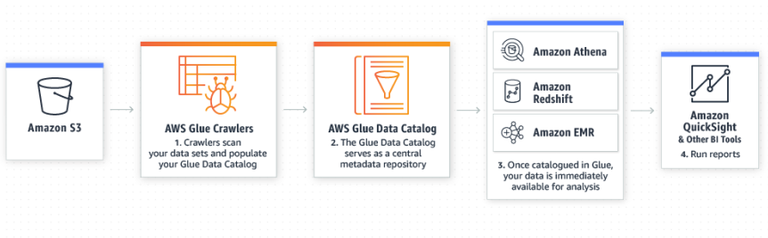

A partir del catálogo generado por AWS Glue podemos utilizar distintas herramientas como Amazon Athena, Amazon Redshift o Amazon EMR (basado en el esquema MapReduce) para analizar y hacer consultas sobre los datos.

Finalmente, Amazon posee otra herramienta: Amazon QuickSigth, que lleva a cabo reportes de manera automática sobre los datos.

#### Casos de Uso II: Análisis de Datos de Registros en su Almacén de Datos

Para este otro caso, tenemos como mayor diferencia que en lugar de utilizar como datos de entrada sólo un Bucket en AWS S3, podemos utilizar distintas fuentes de datos como Amazon Redshift, Amazon RDS o una base de datos relacional cualquiera ejecutándose dentro de Amazon EC2 (servicio de máquinas virtuales).

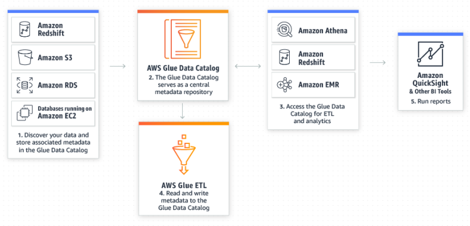

A partir de estas fuentes de datos utilizamos AWS Glue para catalogar los datos y para aplicar transformaciones si es necesario (AWS Glue ETL).

Los pasos siguientes son los mismos que para el caso anterior.

#### Casos de Uso III: Canalizaciones de ETL Determinadas por Eventos

Para este caso, lo que se ilustra es que podemos definir funciones/script AWS Lambda que son accionados por eventos (p.ej. inserción de nuevos datos). Estas funciones lambda pueden hacer que se cataloguen los nuevos datos, o pueden ejecutar un script ETL y almacenar el resultado en AWS S3 o Amazon Redshift.

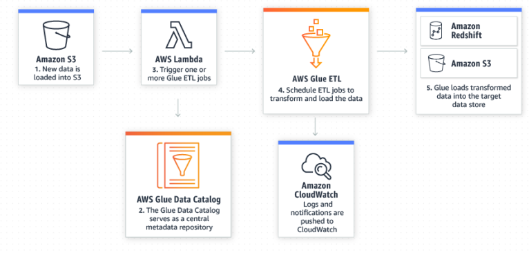

### Amazon Web Services

En la siguiente imagen se ilustra la secuencia de fases por las que pasan, o pueden pasar, los datos en AWS indicando las herramientas que podemos utilizar en cada una de las fases.

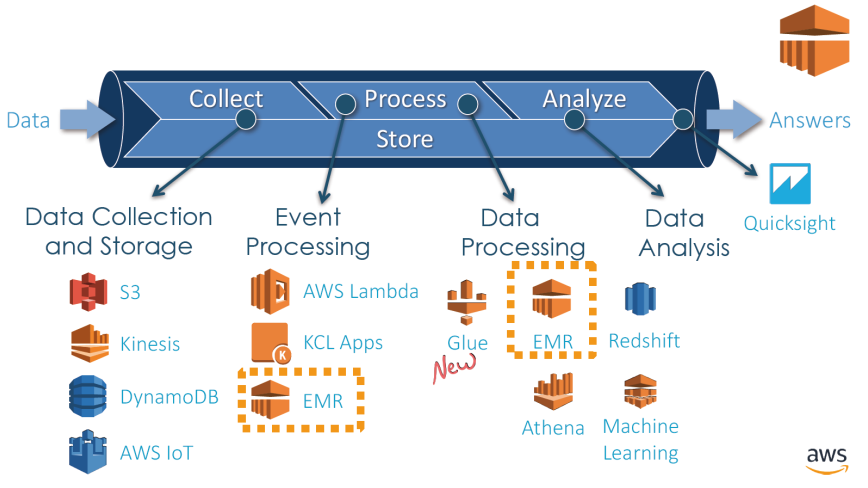

1. **Recolección y almacenamiento de datos**: Los datos pueden ser directamente almacenados mayormente en AWS S3. También tenemos el servicio Kinesis que se basa en streaming.
2. **Procesamiento de eventos**: El procesamiento de eventos puede conllevar el definir funciones lambda en Amazon AWS que accionen otras operaciones como vimos anteriormenete. También se puede aplicar EMR sobre los eventos, entre otros.
3. **Procesamiento de los datos**: como hemos visto en los casos de uso anteriores podemos utilizar AWS Glue para procesar (catalogar) los datos almacenados. También podemos utilizar EMR que se trata de un servicio basado en MapReduce y también tenemos la aplicabilidad de algoritmos de aprendizaje automático sobre los datos. Por otro lado podemos simplemente almacenar los datos en el Data Lake por defecto en AWS que es Amazon Redshift.
4. **Análisis de los datos**: fuera del alcance de esta asignatura.

En esta asignatura nos centraremos en el procesamiento de datos utilizando EMR.

#### Amazon EMR

Este servicio se ejecuta en un clúster Spark-Hadoop, por lo tanto podremos utilizar tanto Hadoop como Spark dentro del mismo. En la siguiente figura se ilustra cómo utilizar esta herramienta.

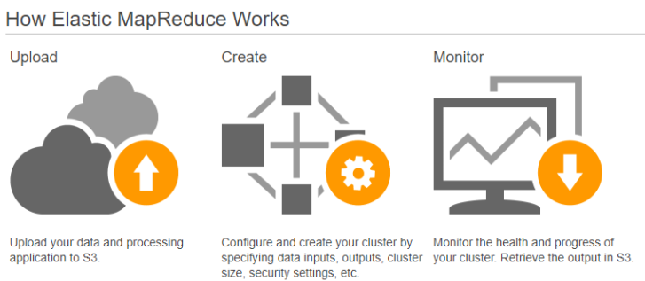

1. Subimos nuestros datos a un bucket en AWS S3.
2. Creamos un clúster EMR, configurado de la manera que se crea precisa.
3. Una vez creado podemos utilizar herramientas de monitorización para supervisar el clúster.

#### Spot Instances

Amazon EMR al final es una instancia de Amazon EC2 preconfigurada que simplifica considerablemente el proceso de configuración/instalación del clúster para poder utilizar Hadoop o Spark.

Las **spot instances** lo que nos permiten es definir estas máquinas virtuales de tal manera que sólo se ejecuten cuando es preciso, en lugar de estar ejecutándose de forma continua (ver la [documentación](https://aws.amazon.com/es/ec2/spot/use-case/emr/) para más información)

#### Amazon Kinesis

Se trata de un servicio que trabaja con datos en streaming que ofrece alta eficiencia es escalable y autogestionado. Como es de esperar está integrado con Amazon ERM y con otras soluciones de almacenamiento como son Amazon S3, Redshift, DynamoDB, etc.

##### Tipos

**Amazon Kinesis Video Streams**: los datos de entrada son datos multimedia, como son los vídeos. Una vez procesados con Kinesis estes pueden ser consumidos por otras herramientas de IA como son Amazon Rekognition Video, Amazon SageMaker, entre otros.

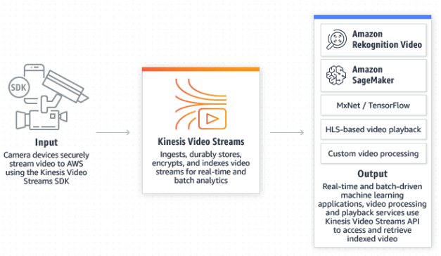

**Amazon Kinesis Data Streams**: trabaja sobre datos tanto estructurados como no estructurados, que, tras ser procesados pueden utilizarse como entrada para otras herramientas como **Amazon Kinesis Data Analytics**, **Spark on EMR**, **AWS Lambda**, entre otros.

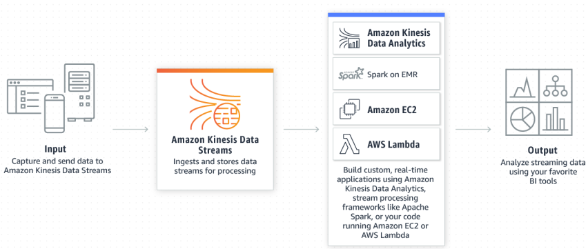

**Amazon Kinesis Data Firehose**: se trata de la evolución de la herramienta anterior que simplifica el procesamiento. Realmente se puede entender como un distribuidor de información que pude ser posteriormente almacenada en S3, Redshift o utilizada en herramientas como Elasticsearch Service.

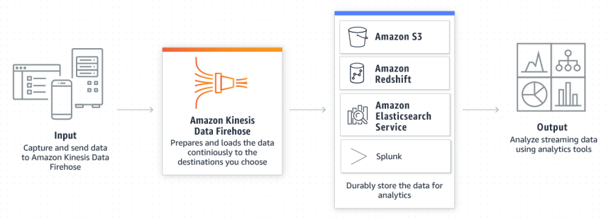

**Amazon Kinesis Data Analytics**: no se trata de otro tipo per se. Se trata de una herramienta que permite llevar a cabo análisis sobre los datos en tiempo real. Como podemos ver en la figura inferior, en la primera fase utilizamos los servicios de ingesta de datos en streaming de Kinesis (Amazon Kinesis Data Firehose, Amazon Kinesis Data Streams) que envían los datos a Amazon Kinesis Data Analytics para llevar a cabo el análisis.

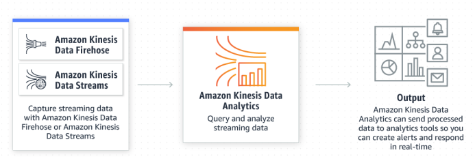

## Proveedores de soluciones: Microsoft Azure

En la siguiente imagen se muestra el flujo y la arquitecture que define Azure para el procesamiento y análisis de los datos. Como podemos ver se permite el procesado de los datos tanto por lotes como en streaming, partiendo de la misma fuente de datos pero utilizando distintos módulos para consumir los datos de esta fuente.

El resultado del procesamiento de los datos se guarda en una base de datos que puede ser accedida para llevar a cabo reportes, analíticas y visualizaciones.

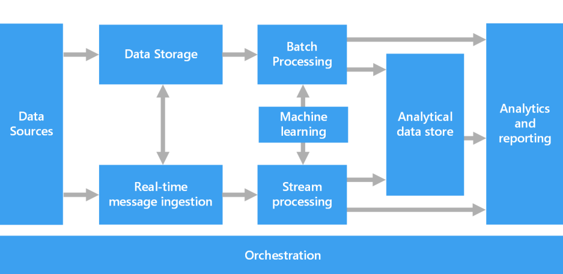

### Análisis de los datos

En la fase de análisis distinguimos varios procesos:

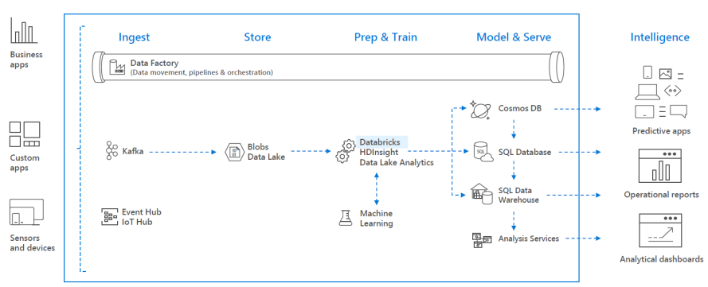

1. **Ingesta**: consiste en consumir los datos que obtenemos de nuestra fuente. Aquí podemos utilizar servicios como Kafka, Event Hug, IoT Hub, etc.
2. **Almacenamiento**: los datos que se consumen se almacenan en un _Data Lake_.
3. **Preparación y Entrenamiento**: en esta fase se procesan los datos, se analizan y se utilizan para entrenar los modelosde aprendizaje automático.
4. **Despliegue**: los modelos entrenados en la fase anterior se despliegan o se almacenan el resultado del análisis de los datos.
5. **Inteligencia**: Se utilizan tanto los datos analizados como los modelos finales entrenados para aplicaciones predictivas, reportes, dashboards, etc.

#### Servicios

Microsoft Azure ofrece una plétora de servicios para el análisis de los datos.

Por un lado tenemos servicios orientados al **almacenamiento** e ingesta de los datos:

- **SQL Data Warehouse**: es un servicio en la nube de Microsoft diseñado para almacenar y analizar grandes volúmenes de datos.
- **Data Factory**: es un servicio de integración de datos en la nube de Microsoft. Permite mover, transformar y organizar datos desde diferentes fuentes hacia un destino, como bases de datos o almacenes de datos, para su análisis.
- **Data Lake Store**: es un repositorio escalable y seguro en la nube para almacenar grandes volúmenes de datos no estructurados o estructurados.
- **Event Hubs**: permite la ingesta de datos en streaming.

Por otro lado tenemos servicios orientados al **análisis** de los datos:

- **Azure Databricks**: permite utilizar Spark para el análisis de datos.
- **HDInsight**: permite utilizar Spark, Hadoop, etc. para el análisis de datos. En lugar de utilizar toda la suite, podemos utilizar servicios más concretos que sólo incluyen un subconjunto de las herramientas:
  - _Apache Spark for Azure HDInsight_
  - _Apache Storm for Azure HDInsight_
  - _R Server for Azure HDInsigth_
- **Stream Analytics**: permite el análisis de datos en tiempo real.
- **Data Lake Analytics**: es un servicio de análisis distribuido bajo demanda que permite procesar grandes volúmenes de datos.

También permite el análisis de datos a través de **reportes**:

- **Power BI Embedded**: permite la creación de reportes visuales a traves de unos datos de entrada.
- **Azure Analysis Services**: es un servicio de modelado de datos en la nube que permite crear modelos semánticos para facilitar análisis avanzados y visualizaciones rápidas.

Finalmente tenemos servicios que trabajan sobre lo que podemos denominar **metadatos**:

- **Logs Analytics**: permite analizar los logs de los serivicios para extraer información.
- **Data Catalog**: permite analizar los datos fuente para categorizarlos/catalogarlos.

### HDInsight

Este servicio ofrece las siguientes herramientas:

- [Apache HBase](https://hbase.apache.org/)
- [Apache Hive](https://hive.apache.org/)
- [Apache Spark](https://spark.apache.org/)
- [Apache Storm](https://storm.apache.org/)
- [Apache Kafka](https://kafka.apache.org/)
- R

Ademas también permite la integración con terceros como **Datameer**, **atscale**, **cask**, **StreamSets**, etc.

### Escenarios de Uso

#### Streaming

En la siguiente figura se muestra el flujo de los datos para aplicaciones que trabajan sobre datos en streaming:

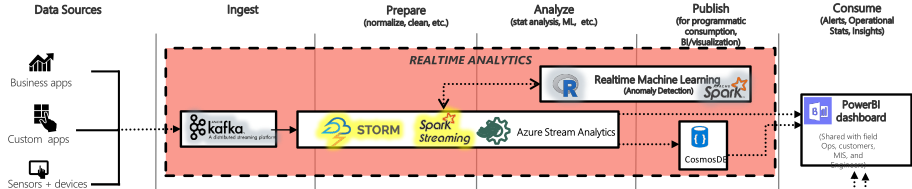

Distinguimos las siguientes fases:

- **Ingesta**: Los datos en tiempo real son capturados utilizando tecnologías como Apache Kafka, que actúa como un sistema de mensajería que garantiza la entrega y persistencia de los datos para su posterior procesamiento.
- **Preparación**: Los datos se limpian, normalizan y transforman en tiempo real mediante herramientas como Apache Storm o Spark Streaming, preparándolos para su análisis inmediato.
- **Análisis**: Los datos procesados son analizados utilizando herramientas de análisis en tiempo real, como Azure Stream Analytics, que permite realizar cálculos en vivo. Además, se pueden aplicar modelos de Machine Learning (por ejemplo, detección de anomalías) para extraer insights inmediatos.
- **Publicación**: Los resultados se almacenan en sistemas como CosmosDB para que puedan ser consultados rápidamente. También pueden ser enviados a dashboards o integrados en aplicaciones para su visualización.
- **Consumo**: Finalmente, las visualizaciones, alertas y estadísticas en tiempo real son compartidas mediante herramientas como Power BI, lo que permite a los usuarios tomar decisiones basadas en datos actualizados al instante.

#### Interactivo

Mientras que en la siguiente imagen se muestra el flujo de los datos para aplicaciones interactivas:

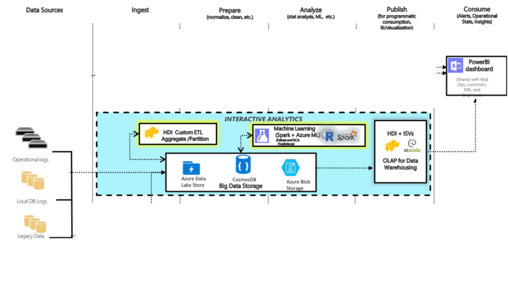

Distinguimos las siguientes fases:

- **Ingesta**: Los datos son capturados y enviados a sistemas de almacenamiento escalables como Azure Data Lake Store o Azure Blob Storage, donde se almacenan de manera estructurada o no estructurada.
- **Preparación**: Se utilizan herramientas como HDInsight (HDI) para realizar transformaciones ETL (Extraer, Transformar y Cargar), particionar los datos, y prepararlos para su análisis.
- **Análisis**: Se emplean tecnologías de Machine Learning y herramientas como Spark, integradas con Azure Machine Learning, para ejecutar modelos predictivos y realizar análisis estadísticos avanzados.
- **Publicación**: Los resultados del análisis pueden ser almacenados en sistemas como CosmosDB o usados para alimentar sistemas OLAP que permiten consultas rápidas para análisis exploratorios.
- **Consumo**: podemos visualizar los resultados utilizando Power BI

#### Por Lotes

Finalmente, en la siguiente figura tenemos el flujo de los datos para aplicaciones que trabajan sobre datos procesados por lotes:

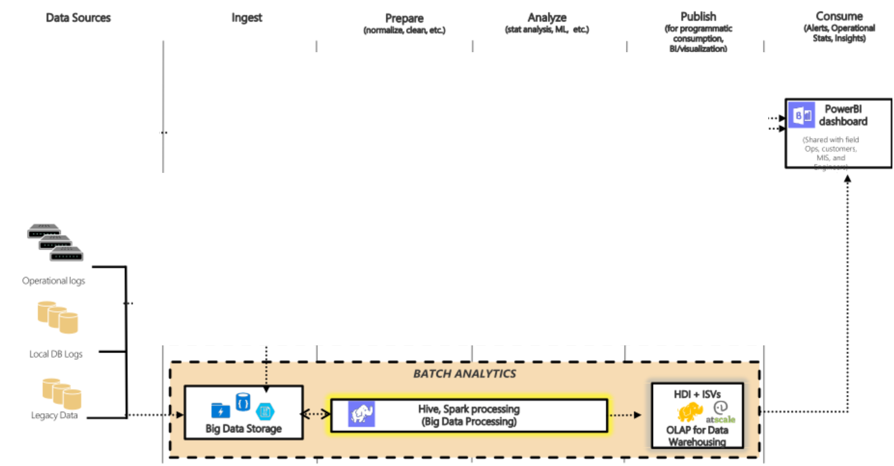

Distinguimos las siguientes fases:

- **Ingesta**: Los datos son capturados desde diversas fuentes, como bases de datos locales, datos heredados (legacy data) o sistemas de almacenamiento de grandes volúmenes. Estos datos se almacenan inicialmente en sistemas de Big Data Storage.
- **Preparación**: En esta etapa, los datos son limpiados, transformados y procesados en lotes utilizando herramientas como Hive o Spark. Estas tecnologías permiten realizar operaciones masivas y complejas, como la agregación o la combinación de grandes conjuntos de datos.
- **Análisis**: Los datos preparados son analizados utilizando técnicas de procesamiento masivo, como Big Data Processing, que facilita cálculos extensivos y personalizados.
- **Publicación**: Los resultados obtenidos del análisis batch se almacenan en sistemas como Data Warehousing o se integran con soluciones OLAP (Procesamiento Analítico en Línea) para que sean accesibles y listos para la consulta.
- **Consumo**: Los datos analizados se ponen a disposición de herramientas como Power BI o sistemas de reportes personalizados, lo que permite a los usuarios explorar y extraer insights de manera visual e interactiva.
