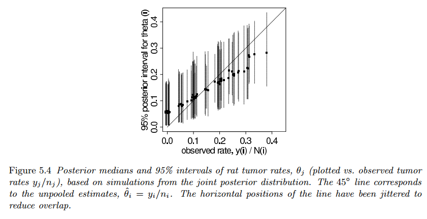
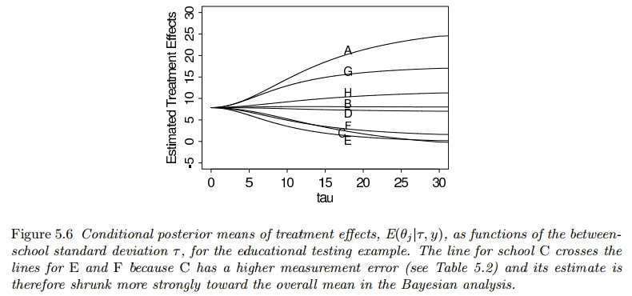
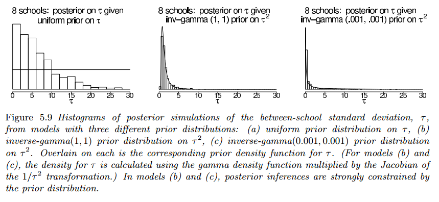

## Constructing a parametrized prior distribution

### Example

Suppose the aim is to estimate $\theta$, the probability of tumor in a population of female laboratory rats of type "F344" that receive a zero dose of the drug (control group).

It is natural to assume a [binomial model](#appendix) for the number of tumors, given $\theta$. For convenience, we select a prior distribution for $\theta$ from the conjugate family, $\theta \sim Beta(\alpha, \beta)$

### Analysis with a fixed prior distribution

From historical data, suppose we knew that the tumor probabilities $\theta$ among groups of female lab rats of type "F344" follow an approximate beta distribution, with known mean and standard deviation.

The use of a fixed prior distribution from historical data allows for the construction of a parameterized prior distribution, which in turn influences the posterior distribution for the current experiment.

Then, assuming a $Beta(\alpha, \beta)$ prior distribution for $\theta$ yields a $Beta(\alpha + 4, \beta + 10)$ posterior distribution for $\theta$.

### Approximate estimate of the population distribution using the historical data

Contrary to last section, typically, the mean and standard deviation of underlying tumor risks are not available, rather historical data is available from previous experiments on similar conditions.

In the $j$th historical experiment, let the number of rats with tumors be $y_j$ and the total number of rats be $n_j$. We model the $y_j$'s (probability that $p$ rats have tumor given a total of $n$ rats) as independent binomial data, given sample sizes $n_j$ and study-specific means $\theta_j$.

We can display the hierarchical model schematically as follows:

The observed sample mean and standard deviation of the 70 values $y_j$, $n_j$ are $0.136$ and $0.103$. If we set the mean and standard deviation of the population distribution to these values we can solve for $\theta$ and $\beta$.

The resulting estimate for $(\alpha, \beta)$ is $(1.4, 8.6)$. **This is not a Bayesian calculation because it is not based on any specified full probability model.**

### Appendix

- **Binomial model**: In probability theory and statistics, the binomial distribution with parameters $n$ and $p$ is the discrete probability distribution of the number of successes in a sequence of $n$ independent experiments ([Binomial Distribution](https://en.mdpedia.org/wiki/Binomial_distribution))

## Exchangeability and hierarchical models

### Exchangeability

When we have no additional data on the parameters, we assume exchangeability between them, such that $p(\theta_1, \cdots, \theta_J)$ is invariant to permutation of the indexes.

The simplest form of an exchangeable distribution has each of the parameters $\theta_j$ as an **independent** sample from a prior distribution governed by some unknown parameter vector $\phi$; thus:

$$
\begin{aligned}
p(\theta|\phi) = \prod_{j = 1}^J p(\theta_j|\phi)
\end{aligned}
$$

In general, $\phi$ is unknown, so our distribution for $\theta$ must average over our uncertainty in $\phi$:

$$
\begin{aligned}
p(\theta) = \int_{\phi} p(\theta|\phi)p(\phi) d \phi
\end{aligned}
$$

$$
\begin{aligned}
= \int_{\phi} \left(\prod_{j = 1}^J p(\theta_j|\phi)\right) p(\phi) d \phi
\end{aligned}
$$

This form, the mixture of independent identical distributions, is usually all that we need to
capture exchangeability in practice.

#### Example

We use a nonhierarchical example with exchangeability at the level of $y$ rather than $\theta$.

In this example, eight states in the United States were selected, and the divorce rate per $1000$ population in each state in $1981$ was recorded. Since you have no information to distinguish any of the eight states from the others, you must model them exchangeably.

However, you can't assign an exchangeable prior to the set of eight diverse states when there's specific information about one of them. For example, if we know that Nevada differentiates itself from the others because it divorce rate is known to be unusually high, that lets us know before even seeing the data (observed values), that there's a strong reason to believe that Nevada's divorce rate is higher than the other states.

This means that in a Bayesian analysis, the prior distribution should reflect this belief, assigning more probability mass to Nevada having a higher divorce rate in comparison to the other states.

### Exchangeability when additional information is available on the units

Sometimes obervations are partially or conditionally exchangeable. For example, when:

- In the case where observations can be grouped, a hierarchical model can be created. In this context, each group has unknown properties. The assumption of exchangeability allows for the use of a common prior distribution for these group properties, meaning that any group can be considered as a random sample of the same underlying population.

- If $y_i$ has additional information $x_i$ so that $y_i$ are not exchangeable but $(y_i, x_i)$ still are exchangeable, then we can make a joint model for $(y_i, x_i)$ or a conditional model for $y_i|x_i$.

In general, the usual way to model exchangeability with covariates is through conditional independence:

$$
\begin{aligned}
p(\theta_1, \cdots, \theta_J) = \int \left[ p(\theta_j|\phi,x_j)\right]p(\phi, x) d\phi
\end{aligned}
$$

whith $x = [x_1, \cdots, x_J]$

#### Example

Let's consider an example in the field of education where we want to analyze the test scores of students from different schools. We can view the test scores as observations that can be grouped by schools.

Let $y_{ij}$ be the test score of the student $i$ in school $j$, where $i = 1, 2, \cdots, n_j$ and $j = 1, 2, \cdots, J$ and $n_j$ are the number of students at school $j$.

##### Assumptions

- Each school $j$ has an unknown mean test score $\mu_j$.
- The mean test scores $\mu_j$ are assumed to follow a common distribution.
- \*Exchangeability: The test scores within each school are exchangeable, implying that any school could be considered a random sample from the overall population of schools.
- **Common prior distribution**: we assume a common prior distribution for the group mean test scores $\mu_j$ across schools.

##### Model Formulation

**Likelihood**: The likelihood of the test scores given the group mean and variance

$$
\begin{aligned}
p(y_{ij}|\mu_j, \sigma^2)
\end{aligned}
$$

**Prior**: Common prior distribution for the group mean test scores

$$
\begin{aligned}
p(\mu_j|\theta) \sim \mathcal{N}(\theta, \tau^2)
\end{aligned}
$$

where $\theta$ represents the overall mean test score and $\tau$ is the variance parameter.

**Hyperprior**: Prior distribution for the overall test score

$$
\begin{aligned}
p(\theta) \sim \mathcal{N}(\mu_0, \sigma_0^2)
\end{aligned}
$$

where $\mu_0$ is the prior mean and $\sigma_0^2$ is the prior variance.

##### Bayesian Inference

The posterior distribution of the group mean test scores and the overall mean test score can be obtained using Bayesian inference techniques, such as Markov Chain Monte Carlo (MCMC) sampling.

### Objections to exchangeable models

In statistical applications, it is common to raise objections to the assumption that different data or experiments are exchangeable. For example experiments may which may have been conducted at different times, with different subjects, and likely in different places.

Despite these differences, the text suggests that it might be acceptable to consider the data as if they were from the same distribution due to model ignorance.

### The full Bayesian Treatment of the hierarchical model

The true 'hierarchical' part of the models is that some parameters are not known and thus have their own prior distributions, denoted as $p(\phi)$. The Bayesian posterior distribution is of the vector $(\phi, \theta)$. The joint prior distribution is:

$$
\begin{aligned}
p(\phi, \theta) = p(\phi)p(\theta|\phi)
\end{aligned}
$$

and the joint posterior distribution (after seeing the data $y$) is:

$$
\begin{aligned}
p(\phi, \theta|y) \propto p(\phi, \theta)p(y|\phi, \theta)
\end{aligned}
$$

Given that $p(y|\phi, \theta)$ depends only on $\theta$:

$$
\begin{aligned}
= p(\phi, \theta)p(y|\theta)
\end{aligned}
$$

In order to create a joint probability distribution for $(\phi, \theta)$, we must assign a prior distribution to $\phi$.

It is often practical to start with a simple, relatively noninformative, prior distribution on $\phi$ and seek to add more prior information if there remains too much variation in the posterior distribution.

### Posterior predictive distributions

Hierarchical models are characterized both by parameters $\theta$ and hyperparameters, $\phi$, that parametrize the prior distribution over $\theta$.

There are two posterior predictive distributions that might be of interest:

- The distribution of future observations $\tilde{y}$ corresponding to an existing $j$ "group" described by $\theta_j$.
- The distribution of future observations $\tilde{y}$ corresponding to future $\theta_j$ (a "new group"), denoted by $\tilde{\theta}$, drawn from the superpopulation $p(\theta|\phi)$.

In the rat tumor example, future observations can be (1) additional rats from an existing experiment, or (2) results from a future experiment (explained by a different set of parameters $\theta$).
For (1) the posterior predictive draws $\tilde{y}$ are based on the posterior draws of $\theta_j$ ($p(\theta_j|y)$) for the existing experiment.

For (2) one must first draw $\tilde{\theta}$ for the new experiment from the population distribution, given the posterior draws of $\phi$, and then draw $\tilde{y}$ given the simulated $\tilde{\theta}$.

## Bayesian analysis of conjugate hierarchical models

### Analytic derivation of conditional and marginal distributions

Hierarchical models involve multiple levels of parameters and dependencies between them, making the analysis more intricate. The following steps are necessary to disentangle the relationships between parameters at different levels of the hierarchy and to estimate their distributions accurately.

- **Joint Posterior Density**: Combines the prior information (hyperprior distribution $p(\phi)$), the population distribution ($p(\theta|\phi)$), and the likelihood function $p(y|\theta)$ to form the joint posterior distribution.

$$
\begin{aligned}
p(\theta, \phi|y) \propto p(y|\theta)p(\theta|\phi)p(\phi)
\end{aligned}
$$

- **Conditional Posterior Density of the parameters**: Calculates the posterior distribution of $\theta$ given the hyperparameters $\phi$, allows us to understan how parameters interact and influence each other. This is usually done using [a priori conjugate distributions](https://es.mdpedia.org/wiki/Prior_conjugada).

$$
\begin{aligned}
p(\theta|\phi, y)
\end{aligned}
$$

- **Hyperparameter Estimation**: estimating $\phi$ through the Bayesian paradigm helps in updating our knowledge about the higher-level parameters based on the observed data. This step can be perfomed by integrating the joint posterior distribution over $\theta$ in to be able to marginalize $\phi$ conditionally on $y$.

$$
\begin{aligned}
p(\phi|y) = \int p(\theta, \phi|y)d\theta
\end{aligned}
$$

For many standard models the marginal posterior distribution of $\phi$ can be computed algebraically using the conditional probability formula:

$$
\begin{aligned}
p(\phi|y) = \frac{p(\theta, \phi|y)}{p(\theta|\phi, y)}
\end{aligned}
$$

### Drawing simulations from the posterior distribution

The following strategy is useful for simulating a draw from the joint posterior distribution $p(\theta, \phi|y)$

1. Draw the vector of hyperparameters, $\phi$, from its marginal posterior distribution, $p(\phi|y)$.
2. Draw the parameter vector $\theta$ from its conditional posterior distribution, $p(\theta|\phi, y)$. For the examples we consider in this chapter, the factorization $p(\theta|\phi, y) = \prod_j p(\theta_j|\phi, y)$ holds.
3. If desired, draw predictive values $\tilde{y}$ from the posterior predictive distribution.

The above steps are performed $L$ times in order to obtain a set of $L$ draws. From the joint posterior simulations of $\theta$ and $\tilde{y}$, we can compute the posterior distribution of any estimand or predictive quantity of interest.

### Application to the model for rat tumors

The data from experiments $j = 1, \cdots, J$, $J = 71$, are assumed to follow independent binomial distributions:

$$
\begin{aligned}
y_j \sim Bin(n_j, \theta_j)
\end{aligned}
$$

This models the probability of getting exactly $\theta_j$ successes in $n_j$ independent Bernoulli trials.

with the number of rats $n_j$ unknown. The parameters $\theta_j$ are assumed to be independent samples from a beta distribution:

$$
\begin{aligned}
\theta_j \sim Beta(\alpha, \beta)
\end{aligned}
$$

and we shall assign a noninformative hyperprior distribution to reflect our ignorance about the unknown hyperparameters $\alpha, \beta$. We defer the choice of noninformative hyperprior distribution, a relatively arbitrary and unimportant part of this particular analysis, until we inspect the integrability of the posterior density.

#### Joint, conditional, and marginal posterior distributions

The **joint posterior distribution** of all the parameters is:

$$
\begin{aligned}
p(\theta, \alpha, \beta|y) \propto p(\alpha, \beta)p(\theta|\alpha,\beta)p(y|\theta, \alpha, \beta)
\end{aligned}
$$

where $p(\alpha, \beta)$ is the hyperprior distribution ($p(\phi)$).

Then $p(\theta|\alpha,\beta)$ is the population distribution ($p(\theta|\phi)$). The pdf of $x \sim Beta(\alpha, \beta)$, ignoring the normalization constant, [is given by](https://en.mdpedia.org/wiki/Beta_distribution):

$$
\begin{aligned}
p(\theta|\alpha, \beta) \propto \frac{\Gamma(\alpha + \beta)}{\Gamma(\alpha)\Gamma(\beta)} x^{\alpha - 1} (1- x)^{\beta - 1}
\end{aligned}
$$

For $j = 1, \cdots, J$ i.i.d $\theta_j \sim Beta(\alpha, \beta)$:

$$
\begin{aligned}
p(\theta|\alpha, \beta) \propto \prod_{j=1}^J \theta_j^{\alpha - 1} (1- \theta_j)^{\beta - 1}
\end{aligned}
$$

And $p(y|\theta, \alpha, \beta)$ is the likelihood ($p(y|\theta)$). The pdf of $x \sim Bin(n, p)$ [is given by](https://en.mdpedia.org/wiki/Binomial_distribution):

$$
\begin{aligned}
p(x = k|n, p) \propto p^k (1 - p)^{n - k}
\end{aligned}
$$

For $j = 1, \cdots, J$ i.i.d $y_j \sim Bin(n_j, \theta_j)$:

$$
\begin{aligned}
p(y_j|n_j, \theta_j) \propto \theta_j^{y_j} (1 - \theta_j)^{n_j - y_j}
\end{aligned}
$$

Therefore we obtain:

$$
\begin{aligned}
\propto p(\alpha, \beta) \left(\prod_{j=1}^J \frac{\Gamma(\alpha + \beta)}{\Gamma(\alpha)\Gamma(\beta)}\theta_j^{\alpha - 1}(1 - \theta_j)^{\beta - 1}\right) \left(\prod_{j=1}^J \theta_j^{y_j}(1 - \theta_j)^{n_j - y_j}\right)
\end{aligned}
$$

The **conditional posterior density of** $\theta$ given the hyperparameters is defined using a [Beta-binomial conjugate prior (page 7)](https://compcogsci-3016.djnavarro.net/technote_betabinomial.pdf), therefore if:

$$
\begin{aligned}
y_i|n_j, \theta_j \sim Bin(n_j, \theta_j)
\end{aligned}
$$

$$
\begin{aligned}
\theta_j|\alpha,\beta \sim Beta(\alpha, \beta)
\end{aligned}
$$

then

$$
\begin{aligned}
\theta_j|\alpha, \beta, y_j, n_j \sim Beta(\alpha + y_j, \beta + n_j - y_j)
\end{aligned}
$$

which gives us the following [pdf for a Beta distribution](https://en.mdpedia.org/wiki/Beta_distribution) of i.i.d $\theta$:

$$
\begin{aligned}
p(\theta|\alpha, \beta, y) = \prod_{j=1}^J \frac{\Gamma(\alpha + y_j + \beta + n_j - y_j)}{\Gamma(\alpha + y_j)\Gamma(\beta + n_j - y_j)}\theta_j^{\alpha + y_j - 1}(1-\theta_j)^{\beta + n_j - y_j - 1}
\end{aligned}
$$

$$
\begin{aligned}
= \prod_{j=1}^J \frac{\Gamma(\alpha + \beta + n_j)}{\Gamma(\alpha + y_j)\Gamma(\beta + n_j - y_j)}\theta_j^{\alpha + y_j - 1}(1-\theta_j)^{\beta + n_j - y_j - 1}
\end{aligned}
$$

We can determine the **marginal posterior distribution of the hyperparameters** $(\alpha, \beta)$ by substituting on the previous equations on the following formula:

$$
\begin{aligned}
p(\phi|y) = \frac{p(\theta, \phi|y)}{p(\theta|\phi, y)}
\end{aligned}
$$

where $\phi = (\alpha, \beta)$, so:

$$
\begin{aligned}
p(\alpha, \beta|y) = \frac{p(\theta, \alpha, \beta|y)}{p(\theta|\alpha, \beta, y)}
\end{aligned}
$$

$$
\begin{aligned}
\propto \frac{p(\alpha, \beta) \left(\prod_{j=1}^J \frac{\Gamma(\alpha + \beta)}{\Gamma(\alpha)\Gamma(\beta)}\theta_j^{\alpha - 1}(1 - \theta_j)^{\beta - 1}\right) \left(\prod_{j=1}^J \theta_j^{y_j}(1 - \theta_j)^{n_j - y_j}\right)}{\prod_{j=1}^J \frac{\Gamma(\alpha + \beta + n_j)}{\Gamma(\alpha + y_j)\Gamma(\beta + n_j - y_j)}\theta_j^{\alpha + y_j - 1}(1-\theta_j)^{\beta + n_j - y_j - 1}}
\end{aligned}
$$

$$
\begin{aligned}
\propto p(\alpha, \beta) \frac{\prod_{j=1}^J \frac{\Gamma(\alpha + \beta)}{\Gamma(\alpha)\Gamma(\beta)}\theta_j^{\alpha - 1}(1 - \theta_j)^{\beta - 1} \theta_j^{y_j}(1 - \theta_j)^{n_j - y_j}}{\prod_{j=1}^J \frac{\Gamma(\alpha + \beta + n_j)}{\Gamma(\alpha + y_j)\Gamma(\beta + n_j - y_j)}\theta_j^{\alpha + y_j - 1}(1-\theta_j)^{\beta + n_j - y_j - 1}}
\end{aligned}
$$

$$
\begin{aligned}
\propto p(\alpha, \beta) \prod_{j=1}^J \frac{\frac{\Gamma(\alpha + \beta)}{\Gamma(\alpha)\Gamma(\beta)}\theta_j^{\alpha - 1}(1 - \theta_j)^{\beta - 1} \theta_j^{y_j}(1 - \theta_j)^{n_j - y_j}}{\frac{\Gamma(\alpha + \beta + n_j)}{\Gamma(\alpha + y_j)\Gamma(\beta + n_j - y_j)}\theta_j^{\alpha + y_j - 1}(1-\theta_j)^{\beta + n_j - y_j - 1}}
\end{aligned}
$$

$$
\begin{aligned}
\propto p(\alpha, \beta) \prod_{j=1}^J \left(\frac{\frac{\Gamma(\alpha + \beta)}{\Gamma(\alpha)\Gamma(\beta)}}{\frac{\Gamma(\alpha + \beta + n_j)}{\Gamma(\alpha + y_j)\Gamma(\beta + n_j - y_j)}}\frac{\theta_j^{\alpha - 1}(1 - \theta_j)^{\beta - 1} \theta_j^{y_j}(1 - \theta_j)^{n_j - y_j}}{\theta_j^{\alpha + y_j - 1}(1-\theta_j)^{\beta + n_j - y_j - 1}}\right)
\end{aligned}
$$

$$
\begin{aligned}
\propto p(\alpha, \beta) \prod_{j=1}^J \left(\frac{\Gamma(\alpha + \beta)\Gamma(\alpha + y_j)\Gamma(\beta + n_j - y_j)}{\Gamma(\alpha)\Gamma(\beta)\Gamma(\alpha + \beta + n_j)}\theta_j^{\alpha - 1 + y_j - \alpha - y_j + 1}(1-\theta_j)^{\beta - 1 + n_j - y_j - \beta - n_j + y_j + 1}\right)
\end{aligned}
$$

$$
\begin{aligned}
\propto p(\alpha, \beta) \prod_{j=1}^J \left(\frac{\Gamma(\alpha + \beta)\Gamma(\alpha + y_j)\Gamma(\beta + n_j - y_j)}{\Gamma(\alpha)\Gamma(\beta)\Gamma(\alpha + \beta + n_j)}\theta_j^{0}(1-\theta_j)^{0}\right)
\end{aligned}
$$

$$
\begin{aligned}
\propto p(\alpha, \beta) \prod_{j=1}^J \frac{\Gamma(\alpha + \beta)\Gamma(\alpha + y_j)\Gamma(\beta + n_j - y_j)}{\Gamma(\alpha)\Gamma(\beta)\Gamma(\alpha + \beta + n_j)}
\end{aligned}
$$

#### Choosing a standard parameterization and setting up a 'noninformative' hyperprior distribution

Because we have no immediately available information about the distribution of tumor rates in populations of rats, we seek a relatively diffuse hyperprior distribution for $(\alpha, \beta)$.

By reparameterizing the hyperparameters, we transform them into a space that may have more intuitive or meaningful interpretations. In this case, $logit(\frac{\alpha}{\alpha + \beta}) = \log(\frac{\alpha}{\beta})$ represents the log-odds of $\alpha$ relative to the total of $\alpha$ and $\beta$, providing a clear interpretation of the prior mean in the beta distribution for $\theta$. Similarly, $\log(\alpha + \beta)$ captures the logarithm of the "sample size," influencing the precision or spread of the distribution.

Also the logit transformation helps stabilize the numerical computations, especially when dealing with probabilities or proportions that are bounded between 0 and 1. By working in the logit space, we avoid issues related to extreme values or boundaries that can arise in the original parameter space. And transforming the hyperparameters can facilitate the specification of appropriate prior distributions.

One reasonable choice of diffuse hyperprior density is uniform on $(\frac{\alpha}{\alpha + \beta}, (\alpha + \beta)^{−1/2})$, which when multiplied by the appropriate Jacobian yields the following densities on the original scale,

$$
\begin{aligned}
p(\alpha, \beta) \propto (\alpha + \beta)^{-5/2}
\end{aligned}
$$

and on the natural transformed scale:

$$
\begin{aligned}
p(\log(\frac{\alpha}{\beta}), \log(\alpha + \beta)) \propto \alpha\beta(\alpha + \beta)^{-5/2}
\end{aligned}
$$

#### Computing the marginal posterior density of the hyperparameters

Now that we have established a full probability model for data and parameters, we compute the marginal posterior distribution of the hyperparameters.

The next figure shows a contour plot of the unnormalized marginal posterior density on a grid of values of $(\log(\frac{\alpha}{\beta}), \log(\alpha + \beta))$

To create the plot, we first compute the logarithm of the density function of $p(\alpha, \beta|y)$ with prior density $p(\alpha, \beta) \propto (\alpha + \beta)^{-5/2}$, multiplying by the Jacobian to obtain the density $p(\log(\frac{\alpha}{\beta}), \log(\alpha + \beta)|y)$

The most obvious features of the contour plot are (1) the mode is not far from the point estimate (as we would expect), and (2) important parts of the marginal posterior distribution lie outside the range of the graph.

We recompute the previous pdf in a different range $(\log(\frac{\alpha}{\beta}), \log(\alpha + \beta)) \in [-2.3, -1.3] \times [1, 5]$.

Figure $5.3b$ displays $1000$ random draws from the numerically computed posterior distribution.
The graphs show that the marginal posterior distribution of the hyperparameters, under this transformation, is approximately symmetric about the mode, roughly $(−1.75, 2.8)$. This corresponds to approximate values of $(\alpha, \beta) = (2.4, 14.0)$, which differs somewhat from the crude estimate obtained earlier.

Having computed the relative posterior density at a grid that covers the effective range of $(\alpha, \beta)$, we normalize by approximating the distribution as a step function over the grid
and setting the total probability in the grid to $1$.

#### Sampling from the joint posterior distribution of parameters and hyperparameters

We draw $1000$ random samples from the joint posterior distribution of $(\alpha, \beta, \theta_1, \cdots, \theta_J)$, as follows.

1. Simulate $1000$ draws of $(\log(\frac{\alpha}{\beta}), \log(\alpha + \beta))$ from their posterior distribution using the same discrete-grid sampling procedure used to draw $(\alpha, \beta)$ for Figure $3.3b$.
2. For $l = 1, \cdots, 1000$:
3. Transform the $l$th draw of $(\log(\frac{\alpha}{\beta}), \log(\alpha + \beta))$ to the scale $(\alpha, \beta)$ to yield a draw of the hyperparameters from their marginal posterior distribution.
4. For each $j = 1, \cdots, J$, sample $\theta_j$ from its conditional posterior distribution, $\theta_j|\alpha, \beta, y \sim Beta(\alpha + y_j, \beta + n_j − y_j)$.

#### Displaying the results

Figure $5.4$ shows posterior medians and $95\%$ intervals for the $\theta_j$’s, computed by simulation.

The results are superficially similar to what would be obtained based on a point estimate of the hyperparameters, which makes sense in this example, because of the fairly large number of experiments. But key differences remain, notably that posterior variability is higher in the full Bayesian analysis, reflecting posterior uncertainty in the hyperparameters.

## Normal model with exchangeable parameters

### Model definition

We now present a full treatment of a simple hierarchical model based on the normal distribution, with different means for each "group" but with known observation variance and a normal population distribution for the group means.

- Consider $J$ independent experiments. The **likelihood (sampling distribution)** is defined as:

$$
\begin{aligned}
y_{ij} | \theta_j \sim \text{N}(\theta_j, \sigma^2), \text{ for } i = 1, \cdots, n_j; j = 1, \cdots, J.
\end{aligned}
$$

where we label the sample mean of each group $j$ as:

$$
\begin{aligned}
\overline{y}_j = \frac{1}{n_j} \sum_{i = 1}^{n_j} y_{ij}
\end{aligned}
$$

and the sampling variance as:

$$
\begin{aligned}
\sigma^2_j = \frac{\sigma^2}{n_j}
\end{aligned}
$$

Here we assume that $\sigma$ is a know value.

We can then write the likelihood for each $\theta_j$ using the sufficient statistics, $\overline{y}_j$:

$$
\begin{aligned}
\overline{y}_j | \theta_j \sim \text{N}(\theta_j, \sigma_j^2)
\end{aligned}
$$

Sufficient statistics are summary statistics of the data that capture all the information about the parameter of interest. In this case, the sufficient statistic $\overline{y}_j$ represents the data summary for experiment $j$ that is used to estimate the parameter $\theta_j$. By using the sufficient statistic $\overline{y}_j$, the likelihood function for each $\theta_j$ is constructed based on the observed data in experiment $j$.

- The **prior distribution** over $\theta_j$, assuming the prior to be normal for the sake of conjugacy is defined as:

$$
\begin{aligned}
\theta_j|\mu, \tau \sim \text{N}(\theta_j|\mu, \tau^2)
\end{aligned}
$$

Assuming each $\theta_j$ to be independent we obtain the following joint distribution:

$$
\begin{aligned}
p(\theta_1, \cdots, \theta_J|\mu, \tau) = \prod_{j=1}^J \text{N}(\theta_j|\mu, \tau^2)
\end{aligned}
$$

and by process of marginalization:

$$
\begin{aligned}
p(\theta_1, \cdots, \theta_J) = \int \left[\prod_{j=1}^J \text{N}(\theta_j|\mu, \tau^2)\right]p(\mu, \tau) d(\mu, \tau)
\end{aligned}
$$

- The **hyperprior over the parameters** $\mu$ and $\tau$ is defined as a non-informative distribution (i.e. uniform density), such that:

$$
\begin{aligned}
p(\mu, \tau) = p(\mu|\tau)p(\tau) \propto p(\tau)
\end{aligned}
$$

We define a prior distribution over $\tau$. For our illustrative analysis, we use the uniform prior distribution $p(\tau) \propto 1$. Once an initial analysis is performed using the noninformative
'uniform' prior density, a sensitivity analysis with a more realistic prior distribution is often desirable.

### Inference

#### Joint posterior distribution

This distribution combines prior information (hyperprior distribution $p(\mu, \tau)$) the population distribution $p(\theta_j|\mu, \tau)$ and the likelihood function $p(y_{ij}|\theta_j)$. We define it as follows:

$$
\begin{aligned}
p(\theta, \mu, \tau|y)
\end{aligned}
$$

By Bayes Theorem (ignoring the normalization term):

$$
\begin{aligned}
\propto p(y|\theta) p(\theta|\mu, \tau) p(\mu, \tau)
\end{aligned}
$$

Here $p(y|\theta)$ is the likelihood function previously defined in terms of the sufficient statistics $\overline{y}_j$

$$
\begin{aligned}
\propto \left[\prod_{j=1}^J \text{N}(\overline{y}_j|\theta_j, \sigma_j^2)\right] p(\theta|\mu, \tau) p(\mu, \tau)
\end{aligned}
$$

and $p(\theta|\mu, \tau)$ is the prior, also previouly defined, such that:

$$
\begin{aligned}
\propto \left[\prod_{j=1}^J \text{N}(\overline{y}_j|\theta_j, \sigma_j^2)\right] \left[\prod_{j=1}^J \text{N}(\theta_j|\mu, \tau^2) p(y|\theta)\right] p(\mu, \tau)
\end{aligned}
$$

where we can ignore factors that depend only on $y$ and the parameters $\sigma_j$, which are assumed known for this analysis.

#### The conditional posterior distribution

The conditional posterior distribution calculates the posterior distribution of $\theta_j$ given the hyperparameters $\mu, \tau$. It allows us to understand how parameters intereact and influence each other. We define them for each $\theta_j$ as follows:

$$
\begin{aligned}
\theta_j | \mu, \tau, y \sim \text{N}(\hat{\theta}_j, V_j)
\end{aligned}
$$

where:

$$
\begin{aligned}
\hat{\theta}_j = \frac{\frac{1}{\sigma_j^2}\overline{y}_j + \frac{1}{\tau^2}\mu}{\frac{1}{\sigma_j^2} + \frac{1}{\tau^2}}
\end{aligned}
$$

and:

$$
\begin{aligned}
V_j = \frac{1}{\frac{1}{\sigma_j^2} + \frac{1}{\tau^2}}
\end{aligned}
$$

#### The marginal posterior distribution

This distribution allows us to estimate the hyperparameters $\mu$ and $\tau$ through the Bayesian paradigm. By the conditional rule we obtain:

$$
\begin{aligned}
p(\mu, \tau|y) \propto p(\mu, \tau)p(y|\mu, \tau)
\end{aligned}
$$

where:

$$
\begin{aligned}
\overline{y}_j | \mu, \tau \sim \text{N}(\mu, \sigma_j^2 + \tau^2)
\end{aligned}
$$

such that:

$$
\begin{aligned}
p(\mu, \tau|y) \propto p(\mu, \tau) \prod_{j=1}^J \text{N}(\overline{y}_j|\mu, \sigma^2_j + \tau^2)
\end{aligned}
$$

###### Posterior distribution of $\mu$ given $\tau$

We can further simplify by integrating over $\mu$, leaving a simple univariate numerical computation of $p(\tau|y)$, by the conditional rule:

$$
\begin{aligned}
p(\mu, \tau|y) = p(\mu | \tau, y) p(\tau|y)
\end{aligned}
$$

where:

$$
\begin{aligned}
\mu | \tau, y \sim \text{N}(\hat{\mu}, V_\mu)
\end{aligned}
$$

with:

$$
\begin{aligned}
\hat{\mu} = \frac{\sum_{j=1}^J \frac{1}{\sigma_j^2 + \tau^2}\overline{y}_j}{\sum_{j=1}^J \frac{1}{\sigma_j^2 + \tau^2}}
\end{aligned}
$$

and

$$
\begin{aligned}
V_{\mu}^{-1} = \sum_{j=1}^J \frac{1}{\sigma_j^2 + \tau^2}
\end{aligned}
$$

###### Posterior distribution $\tau$

We know from the previous section that:

$$
\begin{aligned}
p(\mu, \tau|y) = p(\mu | \tau, y) p(\tau|y)
\end{aligned}
$$

such that:

$$
\begin{aligned}
p(\tau|y) = \frac{p(\mu, \tau|y)}{p(\mu | \tau, y)}
\end{aligned}
$$

We previously defined $\mu | \tau, y \sim \text{N}(\hat{\mu}, V_\mu)$, therefore:

$$
\begin{aligned}
p(\tau|y) = \frac{p(\mu, \tau|y)}{\text{N}(\hat{\mu}, V_\mu)}
\end{aligned}
$$

We also defined $p(\mu, \tau|y) \propto p(\mu, \tau) \prod_{j=1}^J \text{N}(\overline{y}_j|\mu, \sigma^2_j + \tau^2)$:

$$
\begin{aligned}
\propto \frac{p(\tau) \prod_{j=1}^J \text{N}(\overline{y}_j|\mu, \sigma^2_j + \tau^2)}{\text{N}(\hat{\mu}, V_\mu)}
\end{aligned}
$$

### Simulation

For this model, computation of the posterior distribution of θ is most conveniently performed via simulation, following the factorization:

$$
\begin{aligned}
p(\theta, \mu, \tau|y) = p(\theta|\mu, \tau, y) p(\mu|\tau, y) p(\tau, y)
\end{aligned}
$$

### Posterior predictive distributions

To obtain a draw from the posterior predictive distribution of new data $\tilde{y}$ from the current batch of parameters, $\theta$, first obtain a draw from $p(\theta, \mu, \tau|y)$ and then draw the predictive data $\tilde{y}$ from the sampling distribution:

$$
\begin{aligned}
y_{ij} | \theta_j \sim \text{N}(\theta_j, \sigma^2), \text{ for } i = 1, \cdots, n_j; j = 1, \cdots, J.
\end{aligned}
$$

To obtain posterior predictive simulations of new data $\tilde{y}$ for $\tilde{J}$ new groups, perform the following three steps:

- Draw $(\mu, \tau)$ from their posterior distribution $p(\mu, \tau|y)$
- Draw $\tilde{J}$ new parameters $\tilde{\theta} = \tilde{\theta}_1, \cdots, \tilde{\theta}_{\tilde{J}}$ from the population distribution $p(\tilde{\theta}|\mu, \tau)$.
- Draw $\tilde{y}$ given $\tilde{\theta}$ from the sampling distribution.

## Example: parallel experiments in eight schools

### Inferences based on nonhierarchical models and their problems

Before fitting the hierarchical Bayesian model, we first consider two simpler nonhierarchical methods—estimating the effects from the eight experiments independently (separate estimates), and complete pooling—and discuss why neither of these approaches is adequate for this example.

Consider $\theta_1$, the effect in school $A$. The effect in school $A$ is estimated as $28.4$ with a standard error of $14.9$ under the separate analysis, versus a pooled estimate of $7.7$ with a standard error of $4.1$ under
the common-effect model.

**Note**: given a Normal distribution (symmetrical with respect to it mean) the probability that an estimate takes a value under the mean is $\frac{1}{2}$ (cumulative density function), as the $\mu$ serves as the midpoint of a Normal distribution such that half the area for the normal curve is contained under $[0, \mu]$.

The separate analyses of the eight schools imply the following posterior statement: 'the probability is $\frac{1}{2}$ that the true effect in $A$ is more than $28.4$' a doubtful statement, considering the results for the other seven schools. On the other hand, the pooled model implies the following statement: 'the probability is $\frac{1}{2}$ that the true effect in A is less than $7.7$,' which seems an inaccurate summary of our knowledge. As in the theoretical discussion of the previous section, neither estimate is fully satisfactory, and we would like a compromise that combines information from all eight experiments without assuming all the $\theta_j$'s to be equal. The Bayesian analysis under the hierarchical model provides exactly that.

### Posterior simulation under the hierarchical model

Consequently, we compute the posterior distribution of $\theta_1, \cdots, \theta_8$, based on the normal model presented in [Section 4](#hierarchical-normal-modeling). We draw from the posterior distribution for the Bayesian model by simulating the random variables $\tau$, $\mu$, and $\theta$, in that order, from their posterior distribution, as discussed at the end of the previous section. The sampling standard deviations, $\sigma_j$, are assumed known and equal to the values in Table 5.2, and we assume independent uniform prior densities on $\mu$ and $\tau$.

The marginal posterior density function, $p(\tau|y)$ from, is plotted in the next figure:

Values of $\tau$ near zero are mos plausible. In the normal hierarchical model, however, we learn a great deal by considering the conditional posterior distributions given $\tau$ (and averaged over $\mu$), that is $\mathbb{E}[\theta_j|\tau, y]$, averaging over $\mu$. This is displayed on the following image:

Comparing with the previous figure, which has the same scale on the horizontal axis, we see that for most of the likely values of $\tau$, that is for $\tau \approx 0$ the estimated effects for all the groups are relatively close together (when $\tau = 0$ you would guess they are clustered on the same point). However, as $\tau$ becomes larger, corresponding to more variability among schools, the estimates become more like the raw values shown on the first figure of this section.

The lines in the following figure show the conditional standard deviations, $sd(\theta_j|\tau, y)$, as a function of $\tau$. As $\tau$ increases, the population distribution allows the eight effects to be more different from each other, and hence the posterior uncertainty in each individual $\tau_j$ increases, approaching the standard deviations shown in the raw data in the limit of $\tau \rightarrow \infty$.

Contrary to what we saw with separate estimates and pooled estimates, for the likely values of $\tau$ (see figure for $p(\tau|y)$), the estimates in all schools are substantially less than $28$ points. For example, even at $\tau = 0$, the probability that the effect in school A is less than $28$ points is $\Phi[(28 − 14.5)/9.1] = 93\%$, where $\Phi$ is the standard normal cumulative distribution function.

Of substantial importance, we do not obtain an accurate summary of the data if we condition on the posterior mode of $\tau$ as it ignores the uncertainty associated with $\tau$ as conveyed by the full posterior distribution. In Bayesian statistics, the posterior distribution encapsulates both the most likely values of parameters as well as the uncertainty or variability in those estimates.

By only considering the mode (the peak or maximum) of the posterior distribution and neglecting its shape and spread, we may miss out on valuable information about the range of plausible values for τ and the associated uncertainty.

### Discussion

Table 5.3 summarizes the $200$ simulated effect estimates for all eight schools.

The Bayesian probability that the effect in school A is as large as $28$ points is less than $10\%$, which is substantially less than the $50\%$ probability based on the separate estimate for school A.

As an illustration of the simulation-based posterior results, $200$ simulations of school A's effect are shown in Figure 5.8a.

Having simulated the parameter $\theta$, it is easy to ask more complicated questions of this model. For example, what is the posterior distribution of $\max(\theta_j)$, the effect of the most successful of the eight coaching programs? Figure 5.8b displays a histogram of $200$ values from this posterior distribution and shows that only $22$ draws are larger than $28.4$. For another example, we can estimate $Pr(\theta_1 > \theta_3|y)$, the posterior probability that the coaching program is more effective in school A than in school C, by the proportion of simulated draws of $\theta$ for which $\theta_1 > \theta_3$; the result is $\frac{141}{200} = 0.705$.

To sum up, the Bayesian analysis of this example not only allows straightforward inferences about many parameters that may be of interest, but the hierarchical model is flexible enough to adapt to the data, thereby providing posterior inferences that account for the partial pooling as well as the uncertainty in the hyperparameters.

## Hierarchical modeling applied to a meta-analysis

### A normal approximation to the likelihood

If clinical trial $j$ (in the series to be considered for meta-analysis) involves the use of $n_{0j}$ subjects in the control group and $n_{1j}$ in the treatment group, giving rise to $y_{0j}$ and $y_{1j}$ deaths in control and treatment groups, respectively, then the usual sampling model involves two independent binomial distributions with probabilities of death $p_{0j}$ and $p_{1j}$, respectively.

For each study $j$, one can estimate $\theta_j$ by:

$$
\begin{aligned}
y_j = \log\left(\frac{y_{1j}}{n_{1j} - y_{1j}}\right) - \log\left(\frac{y_{0j}}{n_{0j} - y_{0j}}\right)
\end{aligned}
$$

with approximate sampling variance

$$
\begin{aligned}
\sigma_j^2 = \frac{1}{y_{1j}} + \frac{1}{n_{1j} - y_{1j}} + \frac{1}{y_{0j}} + \frac{1}{n_{0j} - y_{0j}}
\end{aligned}
$$

based on empirical logits. The estimated log-odds ratios $y_j$ and their estimated standard errors $\sigma_j^2$ are displayed as the fourth and fifth columns of Table 5.4.

### Goals of inference in meta-analysis

Our focus is on estimating meaningful parameters, and for this objective there appear to be three possibilities.

1. Complete pooling: we view the studies as identical replications of each other, in the sense we regard the individuals in all the studies as independent samples from a common population, with the same outcome measures and so on.
2. Separate estimates: the studies are so different that the results of any one study provide no information about the results of any of the others.
3. Bayesian analysis: we regard the studies as exchangeable but not necessarily either identical or completely unrelated.

The first potential estimand of a meta-analysis, or a hierarchically structured problem in general, is the mean of the distribution of effect sizes, since this represents the overall ‘average’ effect across all studies that could be regarded as exchangeable with the observed studies. Other possible estimands are the effect size in any of the observed studies and the effect size in another, comparable (exchangeable) unobserved study.

### What if exchangeability is inappropriate?

What if other information (in addition to the data $(n, y)$) is available to distinguish among the $J$ studies in a meta-analysis, so that an exchangeable model is inappropriate? In this situation, we can expand the framework of the model to be exchangeable in the observed data and covariates.

### A hierarchical model

Let $y_j$ represent generically the point estimate of the effect $\theta_j$ in the $j$th study, the sampling distribution is defined as:

$$
\begin{aligned}
y_j|\theta_j, \sigma_j \sim \text{N}(\theta_j, \sigma_j^2)
\end{aligned}
$$

where $\sigma_j$ represents the corresponding estimated standard error, which is assumed known without error.

At the second stage of the hierarchy, we again use an exchangeable normal **prior distribution**, with mean $\mu$ and standard deviation $\tau$, which are unknown hyperparameters.

$$
\begin{aligned}
\theta|\mu, \tau \sim \text{N}(\mu, \tau)
\end{aligned}
$$

Finally, a **hyperprior distribution** is required for $\mu$ and $\tau$. For this problem, it is reasonable to assume a noninformative or locally uniform prior density for $\mu$. We also assume a locally uniform prior density for $\tau$.

## Weakly Informative Priors

### Concepts relating to the choice of prior distribution

#### Improper limit of a prior distribution

Improper prior densities can, but do not necessarily, lead to proper posterior distributions.

#### Calibration

Posterior inferences can be evaluated using the concept of calibration of the posterior mean. For any parameter $\theta$, if we label the posterior mean as $\hat{\theta} = \mathbb{E}[\theta|y]$, we can define the miscalibration of the posterior mean as $\mathbb{E}[\theta|\hat{\theta}] - \hat{\theta}$.

We can judge the accuracy of our conclusions from Bayesian analysis by checking how close the average value we predict (the posterior mean) is to the true value.

Here's how it works:

- If we call our predicted average value $\hat{\theta}$, and we calculate how far off it is from the true value $\theta$, that's what we call the miscalibration of the prediction.
- If our initial guesses (prior distribution) are accurate and our data matches those guesses, then our predictions will be right on target, meaning the miscalibration will be zero.

These are models where the probabilities don't add up to $1$, which makes it impossible to draw a parameter $\theta$ from them. So, we need to expand our theory to deal with this. To see if our predictions are accurate in these cases, we need to imagine a "true" prior distribution where $\theta$ comes from, and compare it to the "inferential" prior distribution we actually use for our Bayesian analysis.

Let's take the example of the 8 schools model. Here, we consider an improper uniform distribution on $\tau$ (a parameter in the model) as a limit of uniform distributions on a range (from $0$ to a really large number $A$, which is getting bigger and bigger).

When we use this improper uniform distribution, our inferences tend to overestimate $\tau$. Let's see why:

- If both the "true" and "inferential" prior distributions are uniform on $(0, A)$, our miscalibration is zero. This means our predictions are accurate.
- Now, if we keep the "true" prior distribution as $U(0, A)$ but let the "inferential" prior distribution go to $U(0, \infty)$, our predictions tend to increase (because now we're including more and more extreme values of $\theta$), which leads to a positive miscalibration.

### Classes of noninformative and weakly informative prior distributions for hierarchical variance parameters

#### General considerations

We view any noninformative or weakly informative prior distribution as inherently provisional—after the model has been fit, one should look at the posterior distribution and see if it makes sense. If the posterior distribution does not make sense, this implies that additional prior knowledge is available that has not been included in the model, and that contradicts the assumptions of the prior distribution that has been used

#### Uniform prior distributions

When we're setting up our model, we often start with uniform priors. But we have to be careful about how we define the scale of this uniform distribution. One common situation is when we're dealing with parameters that must be positive, like variance parameters. Using a uniform prior on the logarithm of these parameters ($\log \tau$) might seem like a good idea, but it can lead to problems because the resulting posterior distribution becomes improper (doesn't add up to 1).

An alternative is trying to set up a range for our prior distribution, like $[-A, A]$ where $A$ is a really large number. This seems like a good idea to keep things in check, but there's a catch: the posterior distribution (our updated belief after looking at the data) can end up heavily influenced by the lower bound, $-A$, of our range. When we calculate the marginal likelihood $p(y|\tau)$ of our data given a certain parameter ($\tau$), it ends up approaching a fixed, non-zero value as $\tau$ gets really close to $0$. Because when we calculate the likelihood of our data given a parameter ($\tau$), it's like asking, "How likely is it that we'd see this data if our parameter τ were true?"

Now, imagine $\tau$ is getting really close to $0$. In many situations, this means we're saying there's almost no variability in our data. But even if $\tau$ is very close to $0$, the likelihood of observing our data isn't exactly $0$. There's still some chance, even if it's tiny, that we'd see our data just by random chance, even with very little variability. So, as $\tau$ approaches $0$, the likelihood doesn't drop to $0$ as well. Instead, it approaches a fixed, non-zero value.

Another option we can consider is using a uniform prior distribution directly on the parameter $\tau$ itself. This helps avoid some of the problems we discussed earlier because it keeps the total probability finite, especially near $\tau = 0$. However, there's a drawback to this approach. It tends to lean slightly towards positive values, because it allows for the possibility of very large values of $\tau$ as well.

When we're dealing with just one or two groups ($J = 1$ or $2$), using this uniform prior actually results in an improper posterior density. This means that our analysis essentially concludes that $\tau$ is infinite, and it doesn't do any pooling of data from different groups. In a way, this makes sense because it's hard to decide from just a few groups how much we should pool their data together. But from a Bayesian perspective, it's a bit awkward because we're making this decision before even looking at the data.

When we're dealing with these improper uniform prior distributions, we can think of them as being like the limit of certain types of weakly informative priors. For example, the uniform prior distribution on the logarithm of $\tau$ is basically like saying that $\tau$ follows a distribution where the probability decreases as $\tau$ gets bigger.

Sometimes, in Bayesian statistics, people suggest using a uniform prior distribution directly on $\tau^2$. This means that every possible value for $\tau^2$ is considered equally likely. However, we don't recommend this approach. It tends to have a bigger issue with miscalibration towards higher values compared to the other approaches we discussed earlier. Plus, using this uniform prior on τ squared requires us to have at least 4 groups for the analysis to work properly and give us a reasonable posterior distribution.

#### Inverse-gamma$(\epsilon, \epsilon)$ prior distributions

In the schools model, the parameter $\tau$ doesn't have any simple family of prior distributions that work well because its likelihood depends on all the data from all the groups in a complex way. However, there's a kind of distribution called the inverse-gamma family that works well in this situation. This means that if we use an inverse-gamma distribution as a prior for $\tau^2$, then after we collect our data and update our beliefs, the conditional distribution for $\tau^2$, $p(\tau^2|\mu, \theta, y)$ that we get is still an inverse-gamma distribution.

The inverse-gamma prior distribution is a way to set up our beliefs in a noninformative (or weakly informative) manner when we're dealing with certain types of data. We choose a parameter called alpha ($\alpha$) to control how informative the prior is. Now, here's the thing: If we set alpha to a very low value, like $1$ or $0.01$ or $0.001$, it's supposed to mean we're not putting much prior information into our model. But there's a problem: When we make alpha too small, the posterior distribution (our updated beliefs after looking at the data) can end up being improper, which means it doesn't add up to $1$. To avoid this, we need to set alpha to a reasonable value, not too small.

#### Half-Cauchy prior distributions

We're going to look at another type of distribution called the $t$ family, specifically the $\text{half}-t$ because our scale parameter ($\tau$) has to be positive. Now, we're interested in the $t$ family for this problem because it's pretty flexible and can cover a wide range of situations. Plus, we can use a neat trick called reparameterization to express it as a prior distribution for our scale parameter ($\tau$) in a way that works well with our model.

Here's why it's helpful: The half-Cauchy distribution has a wide peak around zero and just one parameter that we can adjust, which we'll call $A$. We can set $A$ to be a large value, and as it gets bigger and bigger (approaching infinity), the half-Cauchy distribution starts to look more like a uniform distribution on our parameter $\tau$.

When we set $A$ to a large but finite value, it means we're using a slightly informative prior distribution. Even though it's not completely flat, it's still pretty gentle, especially in the tails. This means that even if we have some prior beliefs, the data we collect can still have a big influence on our final results, especially if the data is strong.

So, we're going to use the half-Cauchy distribution for situations where we're estimating variance parameters from just a few groups. In these cases, our choices about our prior beliefs can really affect our results, so we want to use a prior distribution that's flexible and doesn't have a strong influence unless the data really supports it.

### Application to the 8-schools example

We demonstrate the properties of some proposed noninformative prior densities on the eight-schools example of [Section 5](./05_example_normal.md). Figure 5.9 displays the posterior distributions for the 8-schools model resulting from three different choices of prior distributions that are intended to be noninformative.

The first histogram (on the left) shows what we think about the parameter $\tau$ when we use a uniform prior distribution. The data suggest that $\tau$ could be anywhere below $20$, but there's a small chance it could be even larger. This makes sense because we only have data from $8$ groups, and it's hard to be sure about large values of $\tau$ with that little data.

Now, look at the second histogram (in the middle). Here, we've changed our prior to something called an $\text{inverse-gamma}(1, 1)$ distribution. This changes our conclusions. Now, our estimate for $\tau$ is lower, and we're more confident in our estimates for the individual group parameters ($\theta_j$'s). To understand why this happens, let's think about the shape of our prior distribution. With the inverse-gamma prior, it's concentrated in a narrow range, from $0.5$ to $5$. This means it's not giving much weight to really large or really small values of $\tau$. In comparison, the uniform prior seemed less informative, meaning it didn't strongly influence our conclusions.

The last histogram (on the right) in Figure 5.9 shows what happens when we use a different kind of prior distribution called $\text{inverse-gamma}(0.001, 0.001)$ for $\tau$ squared. This prior is very sharply peaked near zero, meaning it puts a lot of emphasis on very small values of $\tau$. Because of this, our conclusions from the data get distorted. Even though the data might suggest that $\tau$ could be larger, the prior is pulling our estimates towards smaller values. The reason this happens is because the likelihood for $\tau$, stays high near zero. So even though our data might suggest that larger values of $\tau$ are possible, the strong influence of the prior near zero pulls our estimates towards smaller values.

In this example, we're not considering two other options:

- Using a uniform prior distribution on the logarithm of $\tau$, which would result in an improper posterior density with a spike at $\tau = 0$, similar to the last histogram but even more pronounced.
- Using a uniform prior distribution directly on $\tau^2$, which would result in a posterior distribution similar to the first histogram, but with a slightly higher tail on the right side.

### Application for the 3-schools problem

The uniform prior distribution seems fine for the 8-school analysis, but problems arise if the number of groups $J$ is much smaller, in which case the data supply little information about the group-level variance, and a noninformative prior distribution can lead to a posterior distribution that is improper or is proper but unrealistically broad.

Figure 5.10 displays the inferences for $\tau$ based on two different priors. We start with a default uniform distribution, which means we're not favoring any particular values for our parameter $\tau$. This worked well when we had data from $8$ groups (as seen in Figure 5.9). But now, we're looking at a new dataset with only $3$ groups. Unfortunately, the resulting histogram (the left one in Figure 5.10) shows that the posterior distribution for $\tau$ has a really long tail on the right side. This means it's suggesting values of $\tau$ that are way too high to be reasonable.

This long tail is expected because we have such a small number of groups (if we had even fewer groups, the tail would be even longer, going on forever). Using this kind of posterior distribution can be a problem because it means we're not pooling the estimates of the school effects ($\theta_j$) as much as we should be.

The last histogram (on the right) in Figure 5.10 shows what happens when we use a different kind of prior distribution called a half-Cauchy. We set the scale parameter ($A$) of this prior to $25$. We chose this value to be a bit higher than what we expect for the standard deviation of the underlying $\theta_j$'s in our educational testing example. This way, our model only weakly constrains the parameter $\tau$. On the graph, you'll see a line that represents this prior distribution. It's highest for values of $\tau$ less than $50$ and gradually falls off beyond that. This means the prior puts more weight on smaller values of $\tau$ but still allows for larger values.

This half-Cauchy prior distribution would also perform well in the 8-schools problem; however it was unnecessary because the default uniform prior gave reasonable results. With only 3 schools, we went to the trouble of using a weakly informative prior, a distribution that was not intended to represent our actual prior state of knowledge about $\tau$ but rather to constrain the posterior distribution, to an extent allowed by the data.
