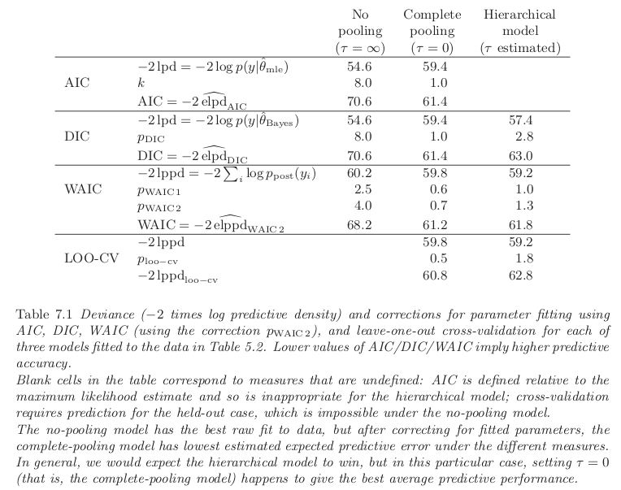

## Measures of Predictive Accuracy

### Point Prediction

In **point prediction** (predictive point estimation or point forecasting) a single value is reported as a prediction of the unknown future observation. Measures of predictive accuracy for point prediction are called **scoring functions**.

For example, the **mean squared error**:

$$
\begin{aligned}
\frac{1}{n} \sum_{i=1}^n (y_i - \mathbb{E}[y_i|\theta])^2
\end{aligned}
$$

or its weighted version:

$$
\begin{aligned}
\frac{1}{n} \sum_{i=1}^n \frac{(y_i - \mathbb{E}[y_i|\theta])^2}{\mathbb{V}[y_i|\theta]}
\end{aligned}
$$

These are easy to compute but they are less appropiated for models that are far from the normal distribution.

#### Probabilistic Prediction

In **probabilistic prediction** (probabilistic forecasting) the aim is to report inferences about
$\hat{y}$ in such a way that the full uncertainty over $\hat{y}$ is taken into account. These are called **scoring rules**. Examples include the quadratic, logarithmic, and zero-one scores

Good scoring rules for prediction are:

- Proper: the scoring rule encourages the decision maker to be honest when reporting their beliefs.
- Local: the scoring rule takes into account the fact that some predictions may be worse than others, and it adjusts accordingly.

For example the **log predictive density** or **log-likelihood**, $p(y|\theta)$, which is proportional to the mean squared error if the model is normal with constant variance.

Why not use the log posterior? The answer is that we are interested here in summarizing the fit of model to data, and for this purpose the prior is relevant in estimating the parameters but not inassessing a model's accuracy. We are not saying that the prior cannot be used in assessing a model's fit to data; rather we say that the prior density is not relevant in computing predictive accuracy.

### Predictive accuracy for a single data point

The best way to measure how well a model fits is by seeing how accurately it predicts outcomes in new data that it hasn't seen before (out-of-sample predictive performance), but that comes from the same process as the original data.

We label $f$ as the true model, $y$ as the observed data and $\tilde{y}$ as future data. The out-of-sample predictive fit for a new data point $\tilde{y}_i$ using logarithmic score is:

$$
\begin{aligned}
\log p_{\text{post}}(\tilde{y}_i) = \log \mathbb{E}_{\text{post}}[p(\tilde{y}_i|\theta)] =
\end{aligned}
$$

By the definition of the expected value for a random variable:

$$
\begin{aligned}
= \log \int p(\tilde{y}_i|\theta) p_{\text{post}}(\theta)d\theta
\end{aligned}
$$

where $p_{\text{post}}(\tilde{y}_i)$ is the predictive density for $\tilde{y}_i$ induced by the posterior distribution $p_{\text{post}}(\theta)$.

Note that we use $p_{\text{post}}$ and $\mathbb{E}_{\text{post}}$ to denote any probability or expectation that averages over the posterior distribution of $\theta$.

### Averaging over the distribution of future data

The future data $\tilde{y}_i$ are themselves unknown and thus we define the expected out-of-sample log predictive density. By the definition of expected value of the function $\log (x)$ over $\tilde{y}$ with respect to a function $f$ that describes the distribution of the data, we compute the **expected log predictive density** or elpd for a new data point as follows:

$$
\begin{aligned}
\mathbb{E}_f[\log p_{\text{post}}(\tilde{y}_i)] = \int \log (p_{\text{post}}(\tilde{y}_i)) f(\tilde{y}_i) d\tilde{y}
\end{aligned}
$$

In general we do not know the data distribution $f$. A natural way to estimate the expected out-of-sample log predictive density would be to plug in an estimate for $f$, but this will tend to imply too good a fit. For now we consider the estimation of predictive accuracy in a Bayesian context. One can define a measure of predictive accuracy for the $n$ data points taken one at a time:

$$
\begin{aligned}
\sum_{i=1}^n \mathbb{E}_f[\log(p_{\text{post}}(\tilde{y}_i))]
\end{aligned}
$$

This gives us the **expected log pointwise predictive density** for a new dataset.

Using a single-point measure instead of dealing with the entire set of predictions (the joint distribution $p_{\text{post}}(\tilde{y})$) allows us to connect it to cross-validation, which helps us approximate how well our model performs on new data based on the data we already have.

It is sometimes useful to consider predictive accuracy given a point estimate $\theta(\tilde{y})$ (sampled data point given the parameter $\theta$?). This gives us the **expected log predictive density** given $\hat{\theta}$:

$$
\begin{aligned}
\mathbb{E}_f[\log(p(\tilde{y}|\theta))]
\end{aligned}
$$

### Evaluating predictive accuracy for a fitted model

In practice the parameter $\theta$ is not known, so we cannot know the log predictive density $\log p(y|\theta)$, which tells us how well our model predicts new data based on $\theta$. So, instead of using $\theta$ directly, we use something called the posterior distribution, denoted as $p_{\text{post}}(\theta) = p(\theta|y)$. This distribution gives us a range of possible values for $\theta$ based on the data we have. From this distribution, we can summarize how accurately our model predicts new data. So we define the **log pointwise predictive density** or lppd as:

$$
\begin{aligned}
\log \prod_{i=1}^n p_{\text{post}}(y_i) = \sum_{i=1}^n \log \int p(y_i|\theta)p_{\text{post}}(\theta)d\theta
\end{aligned}
$$

To calculate this predictive density, we can use samples drawn from the posterior distribution $p_{\text{post}}(\theta)$ using simulation. These samples are labeled as $\theta_s$, where $s$ ranges from $1$ to $S$. So we define the **computed log pointwise predictive density** or computed lppd as:

$$
\begin{aligned}
\sum_{i=1}^n \log \left(\frac{1}{S}\sum_{s=1}^S p(y_i|\theta^s)\right)
\end{aligned}
$$

We basically compute the sample mean of the likelihood $p(y_i|\theta)$ for over all the $\{\theta^s\}_{s=1}^S$ We typically assume that the number of simulation draws $S$ is large enough to fully capture the posterior distribution.

The lppd of observed data y is an overestimate of the elppd for future data. Hence the plan is to start with lppd and then apply some sort of bias correction to get a reasonable estimate of elppd.

## Information criteria and cross-validation

### Estimating out-of-sample predictive accuracy using available data

Several methods are available to estimate the expected predictive accuracy without waiting for out-of-sample data.

- **Within-sample predictive accuracy**: A naive estimate of the expected log predictive density for new data is the log predictive density for existing data using the computed lppd. This summary is in general an overestimate of elppd because it is evaluated on the data from which the model was fit.
- **Adjusted within-sample predictive accuracy**: Given that lppd is a biased estimate of elppd, the next logical step is to correct that bias. Formulas such as AIC, DIC, and WAIC (all discussed below) give approximately unbiased estimates of elppd.
- **Cross-validation**: One can attempt to capture out-of-sample prediction error by fitting the model to training data and then evaluating this predictive accuracy on a holdout set. Cross-validation can be computationally expensive.

### Akaike information criterion (AIC)

In much of the statistical literature on predictive accuracy, inference for $\theta$ is summarized not by a posterior distribution $p_{\text{post}}$ but by a point estimate $\hat{\theta}$, typically the maximum
likelihood estimate. Out-of-sample predictive accuracy is then defined not by the expected log posterior predictive density (elppd) but by $\text{elpd}_{\hat{\theta}} = \mathbb{E}_f[\log p(\tilde{y}|\tilde{\theta}(y))]$.

Let $k$ be the number of parameters estimated in the model. AIC is defined as follows:

$$
\begin{aligned}
\hat{\text{elpd}}_{\text{AIC}} = -2 \log p(y|\hat{\theta}_{\text{mle}}) + 2k
\end{aligned}
$$

Subtracting $k$ from the log predictive density given the maximum likelihood estimate $\theta_{\text{mle}}$ is a correction to account for how much the fitting of $k$ parameters will increase predictive accuracy, purely by chance.

When we move beyond linear models with simple priors, just adding the number of fitted parameters $k$ to adjust the deviance isn't accurate. Informative priors and hierarchical structures typically decrease overfitting compared to simple estimation methods like least squares or maximum likelihood. In models with informative priors or hierarchical setups, the actual number of parameters depends heavily on the variance of the group-level parameter.

### Deviance Information Criterion (DIC) and Effective Number of Parameters

DIC is a somewhat Bayesian version of AIC making two changes, replacing the maximum likelihood estimate with the posterior mean $\hat{\theta}_{\text{Bayes}} = \mathbb{E}[\theta|y]$ and replacing $k$ with a data-based bias correction. The new measure of predictive accuracy is:

$$
\begin{aligned}
\hat{\text{elpd}}_{DIC} = \log p(y|\hat{\theta}_{\text{Bayes}}) - p_{\text{DIC}}
\end{aligned}
$$

where $p_{\text{DIC}}$ is the effective number of parameters, defined as:

$$
\begin{aligned}
p_{\text{DIC}} = 2 \left(\log p(y|\hat{\theta}_{\text{Bayes}}) - \mathbb{E}_{post}[\log p(y|\theta)]\right)
\end{aligned}
$$

where $\mathbb{E}_{post}[\log p(y|\theta)]$ is an average of $\theta$ over its posterior distribution. This is computed using simulation $\theta^s, s= 1, \cdots, S$ as:

$$
\begin{aligned}
\text{computed } p_{\text{DIC}} = 2 \left(\log p(y|\hat{\theta}_{\text{Bayes}}) - \frac{1}{S} \sum_{s=1}^S \log p(y|\theta^s)\right)
\end{aligned}
$$

When the average value of $\theta$ in the posterior distribution matches the highest point (mode), it leads to the maximum log predictive density. However, if the average value is significantly different from the mode, it can result in a negative value for $p_{\text{DIC}}$.

An alternative version of DIC uses a slightly different effective number of parameters:

$$
\begin{aligned}
p_{\text{DIC}_{\text{alt}}} = 2 \mathbb{V}_{\text{post}}[\log p(y|\theta)]
\end{aligned}
$$

Of these two measures, $p_{\text{DIC}}$ is more numerically stable but $p_{\text{DIC}_{\text{alt}}}$ has the advantage of always being positive. The actual quantity called DIC is defined in terms of the deviance rather than the log predictive density; thus:

$$
\begin{aligned}
\text{DIC} = -2 \log p(y|\hat{\theta}_{\text{Bayes}}) + 2p_{DIC}
\end{aligned}
$$

### Watanabe-Akaike or Widely Applicable Information Criterion (WAIC)

**WAIC** is a more fully Bayesian approach for estimating the out-of-sample expectation. Starting with the computed lppd and then adding a correction for effective number of parameters to adjust for overfitting. Two adjustments have been proposed:

$$
\begin{aligned}
p_{\text{WAIC}1} = 2 \sum_{n=1}^n \left(\log(\mathbb{E}_{\text{post}}[p(y_i|\theta)]) - \mathbb{E}_{\text{post}}[\log p(y_i|\theta)] \right)
\end{aligned}
$$

computed by replacing the expectations by averages over the $S$ posterior draws $\theta^s$:

$$
\begin{aligned}
\text{computed } p_{\text{WAIC}1} = 2 \sum_{n=1}^n \left(\log\left(\frac{1}{S}\sum_{s=1}^S p(y_i|\theta^s)\right) - \frac{1}{S}\sum_{s=1}^S \log p(y_i|\theta^s) \right)
\end{aligned}
$$

The other measure uses the variance of individual terms:

$$
\begin{aligned}
p_{\text{WAIC}2} = \sum_{i=1}^n \mathbb{V}_{\text{post}}[\log p(y_i|\theta)]
\end{aligned}
$$

To compute it we compute the posterior sample variance ($\mathbb{V}_{s=1}^S$) of the log predictive density for each data point $y_i$ and we sum over all the data points:

$$
\begin{aligned}
\text{computed } p_{\text{WAIC}2} = \sum_{i=1}^n \mathbb{V}_{s=1}^S[\log p(y_i|\theta^s)]
\end{aligned}
$$

We can then use either $p_{\text{WAIC}1}$ or $p_{\text{WAIC}2}$ as a bias correction:

$$
\begin{aligned}
\hat{\text{elppd}}_{\text{WAIC}} = \text{lppd} - p_{\text{WAIC}}
\end{aligned}
$$

As with $\text{AIC}$ and $\text{DIC}$, we define $\text{WAIC}$ so as to be on the deviance scale:

$$
\begin{aligned}
\text{WAIC} = -2\text{lppd} + 2p_{\text{WAIC}2}
\end{aligned}
$$

For a normal linear model with a large sample size, known variance, and a uniform prior distribution on the coefficients, $p_{\text{WAIC}1}$ and $p_{\text{WAIC}2}$ are roughly equal to the number of parameters in the model. In general, this adjustment approximates the number of "unconstrained" parameters in the model. A parameter is counted as $1$ if it's estimated without constraints or prior information, $0$ if it's fully constrained, or if all the information comes from the prior distribution, or a value in between if both the data and prior distributions provide information.

WAIC stands out because it averages over the whole posterior distribution rather than relying on a single point estimate, which is what AIC and DIC do. This makes WAIC more relevant when it comes to predicting new data in a Bayesian framework.

However, using WAIC requires dividing the data into $n$ parts, which can be challenging in certain data setups like time series or spatial data. AIC and DIC don't require this explicit partition, but they assume that residuals are independent given a point estimate $\hat{\theta}$, which may not fully capture posterior uncertainty.

### Effective Number of Parameters as a Random Variable

The number of parameters estimated in a model, as measured by $p_{\text{DIC}}$ and $p_{\text{WAIC}}$, can vary depending on the observed data.

Let's take a simple example: imagine a model where the data $y_1, \cdots, y_n$ follow a normal distribution with a mean parameter $\theta$ and a known standard deviation of $1$. The parameter $\theta$ is drawn from a uniform distribution between $0$ and infinity, meaning it's positive but otherwise not informative.

Now, consider two scenarios:

1. Imagine you have a bunch of data points, but they are all very close to zero. In this case, the model has to consider that the parameter $\theta$ could be anywhere from very small positive values up to infinity. However, since the data are all close to zero, they don't provide much information about where $\theta$ might lie. The only constraint is that $\theta$ has to be positive. Because the data don't give a strong indication of where $\theta$ might be, we say the effective number of parameters is roughly half. This is because half of the information about $\theta$ comes from the data, and the other half comes from the prior constraint that $\theta$ must be positive.
2. Now, imagine your data points are all large and positive. In this case, the constraint that $\theta$ must be positive doesn't really affect things much because the data already tell us that $\theta$ needs to be positive to explain those large positive values. Since the data provide most of the information about where $\theta$ might lie, we say the effective number of parameters is approximately $1$. This means that the data have a stronger influence on determining $\theta$ in this scenario.

This example shows that even with the same model and true parameters, the effective number of parameters can change depending on the observed data.

### Bayesian information criterion (BIC)

BIC is a way to decide between different models by considering both how well the model fits the data and how complex the model is. The formula for BIC is:

$$
\begin{aligned}
-2 \log (p(y|\hat{\theta})) + k \log(n)
\end{aligned}
$$

where $p(y|\hat{\theta})$ is the likelihood of the data given the estimated parameters, $k$ is the number of parameters in the model and $n$ is the sample size.

BIC aims to approximate the marginal probability density of the data under the model, which can be used for comparing models and estimating relative posterior probabilities. BIC tends to favor simpler models for large datasets because it penalizes complexity more, so a complicated model may perform well in predicting data but still have a high BIC due to the penalty for complexity.

Unlike AIC, which doesn't take the sample size into account, BIC penalizes complex models more as the sample size increases. Unlike AIC, DIC, and WAIC, BIC doesn't focus on predicting future data but rather on estimating the probability of the observed data under the model.

### Leave-one-out cross-validation

In Bayesian cross-validation, we split the data into two parts: a training set ($y_{\text{ytrain}}$) and a holdout set ($y_{\text{holdout}}$). We repeat this process multiple times, such that for each split:

- We train the model using the training set ($\text{ytrain}$). This gives us a distribution of possible parameter values called $p_{\text{train}}(\theta) = p(\theta|y_{\text{train}})$.
- Then, we use this trained model to make predictions on the holdout set ($y_\text{holdout}$).
- We evaluate the performance of our predictions using the log predictive density:

$$
\begin{aligned}
\log p_{\text{train}}(y_{\text{holdout}}) = \log \mathbb{E}_{\text{post}}[p_{\text{train}}(y_{\text{holdout}})] = \log \int p_{\text{pred}}(y_{\text{holdout}}|\theta)p_{\text{train}}(\theta)d\theta
\end{aligned}
$$

Assuming the posterior distribution $p(\theta|y_{\text{train}})$ is summarized by $S$ simulation draws $\theta^s$, we calculate the log predictive density as:

$$
\begin{aligned}
\log \left(\frac{1}{S} \sum_{s=1}^S p(y_{\text{holdout}}|\theta^s)\right)
\end{aligned}
$$

In LOOCV, we split the data into $n$ partitions, where each partition represents a single data point. Performing the analysis for each of the $n$ data points yields n different inferences $p_{\text{post}(-i)}$, each summarized by $S$ posterior simulations, $\theta^{is}$.

The Bayesian LOO-CV estimate of out-of-sample predictive fit is:

$$
\begin{aligned}
\text{lppd}_{\text{loo-cv}} = \sum_{i=1}^n \log (p_{\text{post}(-i)}(y_i))
\end{aligned}
$$

computed as:

$$
\begin{aligned}
\sum_{i=1}^n \log \left(\frac{1}{S} \sum_{s=1}^S p(y_i|\theta^{is})\right)
\end{aligned}
$$

Where $\theta^s$ represents the $S$ simulations under the posterior distribution $p(\theta|y_{-1})$.

Each prediction is conditioned on $n − 1$ data points, which causes underestimation of the predictive fit. For large $n$ the difference is negligible, but for small $n$ (or when using $k$-fold cross-validation) we can use a first order bias correction b by estimating how much better predictions would be obtained if conditioning on $n$ data points:

$$
\begin{aligned}
b = \text{lppd} - \overline{\text{lppd}}_{-i}
\end{aligned}
$$

where:

$$
\begin{aligned}
\overline{\text{lppd}}_{-i} = \frac{1}{n} \sum_{i=1}^n \sum_{j=1}^n \log p_{\text{post}(-i)}(y_j)
\end{aligned}
$$

computed as:

$$
\begin{aligned}
\frac{1}{n} \sum_{i=1}^n \sum_{j=1}^n \log \left(\frac{1}{S} \sum_{s=1}^S p(y_j|\theta^{is})\right)
\end{aligned}
$$

The bias-corrected Bayesian LOO-CV is then:

$$
\begin{aligned}
\text{lppd}_{\text{cloo-cv}} = \text{lppd}_{\text{loo-cv}} + b
\end{aligned}
$$

The bias correction $b$ is rarely used as it is usually small, but we include it for completeness.

We compute an estimate of the effective number of parameters as:

$$
\begin{aligned}
p_{\text{loo-cv}} = \text{lppd} - \text{lppd}_{\text{loo-cv}}
\end{aligned}
$$

or, using bias-corrected LOO-CV:

$$
\begin{aligned}
p_{\text{cloo-cv}} = \text{lppd} - \text{lppd}_{\text{cloo-cv}}
\end{aligned}
$$

$$
\begin{aligned}
= \overline{\text{lppd}}_{-i} - \text{lppd}_{\text{loo-cv}}
\end{aligned}
$$

CV, like WAIC, requires the data to be split into distinct and ideally independent pieces. This can be challenging for structured models where the data isn't easily divided. Additionally, CV can be computationally expensive, especially if the model needs to be re-fit for each fold. However, there are some shortcuts available, such as Leave-One-Out Cross-Validation (LOO-CV), which can efficiently approximate predictions using the full posterior distribution.

Under certain conditions, different information criteria (like AIC, DIC, and WAIC) have been shown to be equivalent to LOO-CV as the size of the dataset becomes very large. AIC is equivalent to LOO-CV when using maximum likelihood estimates. DIC is a variation of regularized information criteria that approximates LOO-CV using plug-in predictive densities. WAIC has been shown to be equivalent to Bayesian LOO-CV.

LOO-CV predicts the outcome for one data point using all other data points except that one. WAIC predicts the outcome for a data point using all observed data points. This difference becomes noticeable when dealing with small datasets or complex models, like hierarchical models. In regression or hierarchical models, LOO-CV focuses on predicting specific data points, while WAIC predicts outcomes based on all observed data. This distinction can be important in models where predictions at one point are only weakly influenced by other data points.

### Summary

All the different measures discussed above are based on adjusting the log predictive density of the observed data by subtracting an approximate bias correction. The measures differ both in their baseline measures of fit and in their adjustments.

AIC starts with the log predictive density of the data conditional on the maximum likelihood estimate $\hat{\theta}$, DIC conditions on the posterior mean $\mathbb{E}[\theta|y]$, and WAIC starts with the log predictive density, averaging over $p_{\text{post}}(\theta) = p(\theta|y)$. Of these three approaches, only WAIC is fully Bayesian and so it is our preference when using a bias correction formula. Cross-validation can be applied to any measure of fit; we use the log pointwise posterior predictive density as with WAIC.

## Model Comparison Based on Predictive Performance

### Example

On the [eight schools example](../02_models#example-parallel-experiments-in-eight-schools) we defined three separate models:

1. **No pooling**: Separate estimates for each of the eight schools, reflecting that the experiments were performed independently. This model has eight parameters: an estimate for each school.
2. **Complete pooling**: A combined estimate averaging the data from all schools into a single number, reflecting that the eight schools come from the same population. This model has only one, shared, parameter.
3. **Hierarchical model**: A Bayesian meta-analysis, partially pooling the eight estimates toward a common mean. This model has eight parameters but they are constrained through their hierarchical distribution and are not estimated independently; thus the effective number of parameters should be some number less than 8.

In the following table we show the performance metrics for each of the models using predivtive log densities and information criteria.

#### AIC

The log predictive density is higher—that is, a better fit—for the **no pooling model**. This makes sense: with no pooling, the maximum likelihood estimate is right at the data, whereas with complete pooling there is only one number to fit all $8$ schools. However, the ranking of the models changes after adjusting for the fitted parameters ($8$ for no pooling, $1$ for complete pooling), and the expected log predictive density is estimated to be the best (that is, AIC is lowest) for **complete pooling**. The last column of the table is blank for AIC, as this procedure is defined based on maximum likelihood estimation which is meaningless for the hierarchical model.

#### DIC

For both the **no-pooling** and **complete-pooling** models with their flat priors, DIC provides results similar to AIC. However, for the **hierarchical model**, DIC falls in between the two extremes: it fits the data better than complete pooling but not as well as no pooling, and it suggests an effective number of parameters closer to $1$ than to $8$. This indicates that the estimated school effects are mostly pooled back to their common mean. When considering the correction for fitting, complete pooling emerges as the winner, which aligns with the idea that the data support very little variation between groups.

#### WAIC

This Bayesian measure, similar to DIC, indicates slightly worse fit to observed data for each model. This is because the posterior predictive density has a wider distribution, resulting in lower density values at the mode compared to the predictive density conditional on the point estimate. However, the correction for the effective number of parameters is lower with WAIC compared to DIC. For models with **no pooling** and **hierarchical models**, the effective number of parameters ($p_{\text{WAIC}}$) is about half of what's estimated by DIC, suggesting that WAIC behaves as expected when there's only one data point per parameter. Conversely, for **complete pooling**, $p_{\text{WAIC}}$ is only slightly less than $1$, which aligns with expectations given the sample size of $8$. Overall, $p_{\text{WAIC}}$ is much less than pDIC for all three models, mainly because the WAIC already considers much of the uncertainty stemming from parameter estimation.

#### Cross Validation

For this example, it's impossible to cross-validate the **no-pooling** model because it would mean predicting the performance of one school using data from the other seven, which isn't feasible. This highlights a key difference from information criteria, which assume predictions for the same schools and can work even in the absence of pooling.

However, for the **complete pooling** and **hierarchical models**, we can directly perform leave-one-out cross-validation. In this setup, cross-validation predicts based only on information from other schools, while WAIC considers both the local observation and information from other schools. Although both methods predict unknown future data, they differ in the amount of information used. As the hierarchical prior becomes less informative (or more vague), the predictive performance estimates diverge further, with the difference approaching infinity when the hierarchical prior becomes uninformative, effectively yielding the no-pooling model.

#### Comparing the Three Models

In this dataset, the complete pooling model performs best in predicting new data. Surprisingly, setting the hierarchical variance $\tau$ to zero results in a better fit to the data compared to both no pooling and complete pooling models. However, despite this result, we still prefer the hierarchical model because we don't believe $\tau$ is truly zero.

For instance, the estimated effects in schools A and C show some differences, although they are not statistically significant. The data suggest that there might be no variation in effects between schools, but we are not entirely confident in this conclusion. Therefore, while the model with $\tau = 0$ performs well, we might consider using a more informative prior distribution for $\tau$ to better capture the uncertainty and avoid implausible scenarios.

In general, predictive accuracy measures are useful in parallel with posterior predictive checks to see if there are important patterns in the data that are not captured by each model.

### Evaluating Predictive Error Comparisons

When comparing models for their predictive accuracy, we face two main challenges: **statistical significance** and **practical significance**.

Statistical significance arises from the uncertainty in estimating how well a model predicts new data. This uncertainty is due to variation in individual prediction errors, which can affect the averages we calculate from any finite dataset. A practical estimate of related sampling uncertainty can be obtained by analyzing the variation in the expected log predictive densities $\hat{\text{elppd}}$ using parametric or nonparametric approaches.

In some cases, we can use scoring functions that are familiar to experts in a particular field to understand the significance of differences in predictive accuracy. However, in situations where there are no established measures like AUC, it can be challenging to interpret the significance of differences in log predictive probability between two models. One way to gauge the importance of such differences is by comparing them to simpler models.

Consider a scenario where we have two models for a survey of voters in an election: one model predicts a $50$/$50$ chance for each voter to support either party, while the other model correctly assigns probabilities of $0.4$ and $0.6$ to the voters. In this case, the improvement in log predictive probability from using the better model can be calculated. For instance, if we have $1000$ voters, the improvement would be $20$, but for only $10$ voters, the improvement would be just $2$. This aligns with our intuition: a clear improvement in prediction is more noticeable in a larger dataset than in a smaller one where noise might overshadow the improvement.

### Bias Induced by Model Selection

Cross-validation and information criteria are methods that adjust for using the data twice—once for building the model and again for evaluating its performance. They aim to provide unbiased estimates of how well a model predicts new data. However, when these methods are used to select a model from multiple options, the estimate of predictive performance for the chosen model can be biased because of the selection process.

When there are only a few models to compare, any bias introduced by the selection process is usually small. However, if there are many models to choose from, especially as the number of observations or predictors increases, the selection process can lead to significant overfitting. While it's possible to estimate and correct for this bias using additional cross-validation, it doesn't guarantee that the selected model will have the best predictive performance. Therefore, cross-validation and information criteria are better suited for understanding models rather than selecting the best one among many options.

### Challenges

The methods we have for measuring how well predictive models fit still have their flaws. AIC, DIC, and WAIC don't always work perfectly: AIC struggles with strong prior information, DIC gives odd results when the average of the posterior distribution isn't reliable, and WAIC can be tricky to use with structured data like spatial or network data. Cross-validation seems like a good alternative, but it can be slow to compute and doesn't always work well with dependent data.

Bayesian statisticians often don't rely solely on predictive error comparisons in their work because of various limitations. However, there are situations where comparing very different models is necessary, and in those cases, predictive comparisons can be valuable. Additionally, measures of effective numbers of parameters are useful for understanding statistical methods.

Currently, we prefer cross-validation because it's similar to WAIC in large samples. However, in finite cases with weak priors or strong outliers, Pareto-smoothed importance sampling LOO-CV is both computationally efficient and robust.

## Model Comparison Using Bayes Factors

### Example: A discrete example in which Bayes factors are helpful

In the genetics example we talked about earlier, we can use Bayes factors to help us make sense of things. Imagine we have two possible scenarios: $H_1$, where the woman is affected, and $H_2$, where she's not affected. We can represent these scenarios using some numbers. For example, let's say $\theta = 1$ means she's affected, and $\theta = 0$ means she's not.

Now, let's say before we look at any data, we're equally likely to believe either scenario. So, the odds of H2 compared to H1 are 1 to 1, that is $\frac{p(H_2)}{p(H_1)} = 1$.

Then, when we look at the data and find out the woman has two unaffected sons, the data is $4$ times more likely under $H_2$ than under $H_1$. That is $\frac{p(y|H_2)}{p(y|H_1)} = \frac{1.0}{0.25}$. The posterior odds are thus $\frac{p(H_2|y)}{p(H_1|y)} = 4$

This example is helpful for Bayes factors because the scenarios we're comparing make sense scientifically, and there are no other possible scenarios in between. Also, the way the data fits with each scenario makes sense and gives us clear results.

Bayes factors don't work as well for models that are continuous. For instance, if we're looking at something like the effectiveness of a treatment, which can vary along a scale, it doesn't make sense to assign a probability to it being exactly zero.

Similarly, if we're comparing different models in regression, like deciding which variables to include, it's better to have all the possible variables in our consideration. We can then use a prior distribution to decide how much to trust each variable, even if we think some might not have much impact. To show why Bayes factors struggle with continuous models, let's consider the example of the 8 schools problem, comparing the no-pooling and complete-pooling models.

== Example. A continuous example where Bayes factors are a distraction ==

Suppose we had analyzed the data from the 8 schools using Bayes factors for the discrete collection of previously proposed standard models, no pooling ($H_1$) and complete pooling ($H_2$):

$$
\begin{aligned}
H_1: p(y|\theta_1, \cdots, \theta_J) = \prod_{j=1}^J text{N}(y_j|\theta_j, \sigma_j^2), p(\theta_1, \cdots, \theta_J) \propto 1
\end{aligned}
$$

$$
\begin{aligned}
H_2: p(y|\theta_1, \cdots, \theta_J) = \prod_{j=1}^J text{N}(y_j|\theta_j, \sigma_j^2), \theta_1 = \cdots = \theta_J = \theta \propto 1
\end{aligned}
$$

If we try to use Bayes factors to pick or combine these models, we run into a problem. The Bayes factor, which is the ratio of how likely the data is under one model compared to another, isn't defined here. That's because the prior distributions we're using are improper, which means they don't behave properly in the calculations. Specifically, when we try to divide one function by another, we end up with $\frac{0}{0}$, which doesn't give us a clear answer.

So, if we want to stick with the idea of assigning probabilities to these two specific models, we have two options: either use proper prior distributions or carefully construct improper ones in a way that makes sense. However, no matter which route we take, the results won't be very satisfying.

More explicitly, suppose we replace the flat prior distributions in $H_1$ and $H_2$ by independent normal prior distributions, $\text{N}(0, A^2)$, for some large $A$. The resulting posterior distribution for the effect in school $j$ is:

$$
\begin{aligned}
p(\theta_j|y) = (1 - \lambda)p(\theta_j|y, H_1) + \lambda p(\theta_j|y, H_2)
\end{aligned}
$$

The Bayes factor, which compares how likely the data is under different models, is very sensitive to the prior variance, which is represented by $A^2$. As we increase $A$ (while keeping the data and prior odds fixed), the results tend to favor one model over the other more strongly. This means that Bayes factors can't be reliably used with non-informative prior densities, even if we carefully define them in certain ways.

Another problem with Bayes factors in this example is that they behave differently as we change the number of schools in the model. The results can vary significantly depending on how many schools are included, which doesn't make much sense from a scientific perspective.

So, if we were to use Bayes factors here, we'd likely run into issues during the model-checking stage, where we compare the model's predictions to what we know from real-world knowledge. Instead, it might be better to use a smoother, continuous family of models that bridges the gap between the extreme models. This continuous model doesn't assign discrete probabilities to extreme values that don't make scientific sense.
