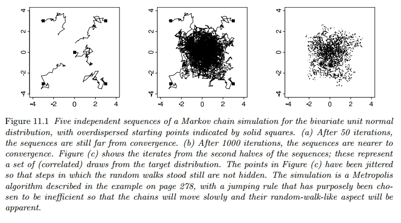
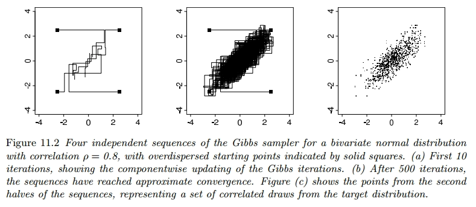
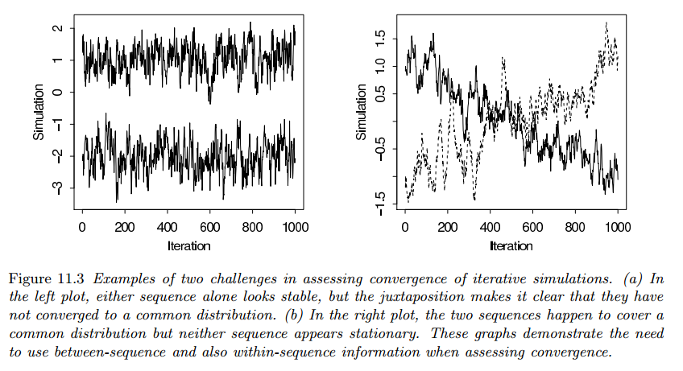
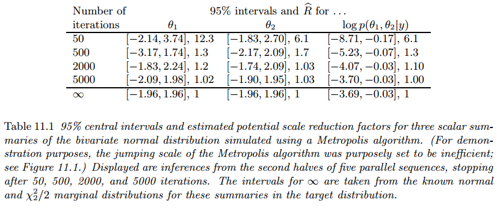

## Gibbs Sampler

### Introduction

Many smart techniques have been developed to create and sample from different types of posterior distributions. One common method is called Markov chain simulation, also known as **Markov chain Monte Carlo** (MCMC). It works by first drawing values of a parameter (usually denoted as $\theta$) from rough estimates of the distribution, and then adjusting those draws to better match the actual distribution we're interested in, called the posterior distribution, denoted as $p(\theta|y)$. The drawing process is done step by step, with each draw depending on the previous one, forming what's called a Markov chain.

Figure 11.1 shows a simple example of Markov chain simulation, using what's called a Metropolis algorithm. Imagine we have a parameter called $\theta$ that is a vector with two components, such that $\theta \sim \text{N}(0, I)$. Now, let's look at Figure 11.1a, which shows the early steps of this simulation. The picture represents all the possible values that $\theta$ can take, and each of the five squiggly lines shows the path taken by a random walk. These random walks start either near the center or at the edges of the distribution and move around based on a series of random steps.

In Figure 11.1b, we see the later stages of the same simulation. Each of the random walks has now traced a path throughout the entire space of possible $\theta$ values. They've settled into a common pattern, which matches the target distribution we're interested in.

Finally, in Figure 11.1c, we can use the information gathered from the second halves of these simulated random walks to make inferences about $\theta$.

In our use of Markov chain simulation, we create multiple separate sequences. Each sequence starts from a particular point, like $\theta_0$, and then we move step by step, drawing a new value $\theta_t$ from a transition distribution $T_t(\theta_t|\theta_{t−1})$, which depends on the previous draw. Markov chain simulation is used when it is not possible to sample $\theta$ directly from $p(\theta|y)$ instead we sample iteratively in such a way that at each step of the process we expect to draw from a distribution that becomes closer to $p(\theta|y)$.

Once the simulation algorithm has been implemented and the simulations drawn, it is absolutely necessary to check the convergence of the simulated sequences; for example, the simulations of Figure 11.1a are far from convergence and are not close to the target distribution.

### Gibbs Sampler

Imagine you have a $d$-dimensional parameter vector $\theta$ that's been split into smaller parts, such that $\theta = (\theta_1, \cdots, \theta_d)$. Each time the Gibbs sampler runs, it goes through each of the dimensions, one at a time, while keeping the rest fixed. So, if there are $d$ dimensions, there are $d$ steps in each iteration $t$.

At each iteration, we pick an order for the $d$ parts of $\theta$. Then, we go through each part one by one and we sample a new value for each part based on the current values of all the other parts. This continues for each part until we've updated all of them once, and then we start the process over again for the next iteration.

$$
\begin{aligned}
p(\theta_j|\theta_{-j}^{t-1}, y)
\end{aligned}
$$

where $\theta_{-j}^{t-1}$ represents all the components of $\theta$ except for $\theta_j$ at their current values:

$$
\begin{aligned}
\theta_{-j}^{t - 1} = (\theta_1^t, \cdots, \theta^t_{j - 1}, \theta_{j + 1}^{t - 1}, \theta_{d}^{t - 1})
\end{aligned}
$$

Thus, each subvector $\theta_j$ is updated conditional on the latest values of the other components of $\theta$, which are the iteration $t$ values for the components already updated and the iteration $t − 1$ values for the others.

Here, we illustrate the workings of the Gibbs sampler with a simple example.

#### Example: Bivariate Normal Distribution

Consider a single observation $(y_1, y_2)$ from a bivariate normally distributed population with unknown mean $\theta = (\theta_1, \theta_2)$ and known covariance matrix $\begin{bmatrix}1 & \rho \\ \rho & 1\end{bmatrix}$. With a uniform prior distribution on $\theta$, the posterior distribution is:

$$
\begin{aligned}
\begin{bmatrix}
\theta_1 \\
\theta_2 \\
\end{bmatrix} | y \sim \text{N}(\begin{bmatrix}
y_1 \\
y_2 \\
\end{bmatrix}, \begin{bmatrix}
1 & \rho \\
\rho & 1 \\
\end{bmatrix})
\end{aligned}
$$

We need the conditional posterior distributions, which, from the properties of the multivariate normal distribution, are:

$$
\begin{aligned}
\theta_1 |\theta_2, y \sim \text{N}(y_1 + \rho(\theta_2 - y_2), 1 - \rho^2)
\end{aligned}
$$

$$
\begin{aligned}
\theta_2 |\theta_1, y \sim \text{N}(y_2 + \rho(\theta_1 - y_1), 1 - \rho^2)
\end{aligned}
$$

The Gibbs sampler proceeds by alternately sampling from these two normal distributions. Figure 11.2 illustrates for the case $\rho = 0.8$, data $(y_1, y_2) = (0, 0)$, and four independent sequences started at $(\pm 2.5, \pm 2.5)$.

## Metropolis and Metropolis-Hastings Algorithms

### The Metropolis algorithm

The Metropolis algorithm is an adaptation of a random walk with an acceptance/rejection rule to converge to the specified target distribution. The algorithm proceeds as follows.

1. Draw a starting point $\theta_0$, for which $p(\theta_0|y) > 0$, from a starting distribution $p_0(\theta)$. The starting distribution might be based on an approximation or we may simply choose starting values dispersed around a crude approximate estimate.
2. For $t = 1, 2, \cdots$:

- Sample a proposal $\theta^\ast$ from a jumping distribution (or proposal distribution) at time $t$, $J_t(\theta^\ast|\theta^{t-1})$. For the Metropolis algorithm (but not the Metropolis-Hastings algorithm, as discussed later in this section), the jumping distribution must be symmetric.
- Calculate the ratio of the densities:

$$
\begin{aligned}
r = \frac{p(\theta^*|y)}{p(\theta^{t- 1}|y)}
\end{aligned}
$$

- Set:

$$
\begin{aligned}
\theta^t = \begin{cases}
\theta^* & \text{ with probability } \min(r, 1) \\
\theta^{t-1} \text{ otherwise }
\end{cases}
\end{aligned}
$$

The acceptance/rejection rule of the Metropolis algorithm can be stated as follows:

- If the jump increases the posterior density, set $\theta^t = \theta^\ast$;
- If the jump decreases the posterior density, set $\theta^t = \theta^\ast$ with probability equal to the density ratio, $r$, otherwise set $\theta_t = \theta^{t - 1}$ (with probability $1 - r$).

The Metropolis algorithm can thus be viewed as a stochastic version of a stepwise mode-finding algorithm, always accepting steps that increase the density but only sometimes accepting downward steps.

To use the algorithm, we need to calculate the ratio $r$ for every pair of $(\theta, \theta^\ast)$, and we also need to choose $\theta$ from the jumping distribution $J_t(\theta^\ast|\theta)$ for all $\theta$ and $t$. Additionally, we need to generate a random number for step ($c$) in the process.

Even if the jump isn't accepted and $\theta_t$ equals $\theta_{t-1}$, it still counts as a step in the algorithm.

#### Example: Bivariate Unit Normal Density with Normal Jumping Kernel

For simplicity, we illustrate the Metropolis algorithm with the simple example of the bivariate unit normal distribution. The target density is the bivariate unit normal, $p(\theta|y) = \text{N}(\theta|0, I)$. The jumping distribution is also bivariate normal, centered at the current iteration and scaled to $\frac{1}{5}$ the size: $J_t(\theta^\ast|\theta^{t−1}) = \text{N}(\theta^\ast|\theta^{t−1}, 0.22\cdot I)$.

At each step, it is easy to calculate the density ratio:

$$
\begin{aligned}
r = \frac{\text{N}(\theta^\ast|0, I)}{\text{N}(\theta^{t-1}|0, I)}
\end{aligned}
$$

It is clear from the form of the normal distribution that the jumping rule is symmetric. [Figure 11.1](#introduction) displays five simulation runs starting from different points. We have purposely set the scale of this jumping algorithm to be too small, relative to the target distribution, so that the algorithm will run inefficiently and its random-walk aspect will be obvious in the figure.

### Why does the Metropolis Algorithm Work?

The proof that the sequence of iterations $\theta_1, \theta_2, \cdots$ converges to the target distribution has two steps:

1. It is shown that the simulated sequence is a Markov chain with a unique stationary distribution.
2. It is shown that the stationary distribution equals the target distribution.

Except for trivial exceptions, the latter two conditions hold for a random walk on any proper distribution, and irreducibility holds as long as the jumping distributions Jt is eventually be able to jump to all states with positive probability.

1. To show (1) consider starting the algorithm at time $t − 1$ with a draw $\theta^{t−1}$ from the target distribution $p(\theta|y)$. Now consider any two such points $\theta_a$ and $\theta_b$, drawn from $p(\theta|y)$ and labeled so that $p(\theta_b|y) \geq p(\theta_a|y)$. The unconditional probability density of a transition from $\theta_a$ to $\theta_b$ is:

$$
\begin{aligned}
p(\theta^{t - 1} = \theta_a, \theta^t = \theta_b) = p(\theta_a|y)J_t(\theta_b|\theta_a)
\end{aligned}
$$

where the acceptance probability is $1$ because of our labeling of $a$ and $b$, and the unconditional probability density of a transition from $\theta_b$ to $\theta_a$ is:

$$
\begin{aligned}
p(\theta^t = \theta_a, \theta^{t-1} = \theta_b) = p(\theta_b|y)J_t(\theta_a|\theta_b) \left(\frac{p(\theta_a|y)}{p(\theta_b|y)}\right)
\end{aligned}
$$

$$
\begin{aligned}
= p(\theta_b|y)J_t(\theta_a|\theta_b)
\end{aligned}
$$

which is the same as the probability of a transition from $\theta_a$ to $\theta_b$, since we have required that $J_t(\cdot|\cdot)$ be symmetric.

Since their joint distribution is symmetric, $\theta^t$ and $\theta^{t−1}$ have the same marginal distributions, and so $p(\theta|y)$ is the stationary distribution of the Markov chain of $\theta$.

### The Metropolis-Hastings Algorithm

The Metropolis-Hastings algorithm generalizes the basic Metropolis algorithm presented above in two ways.

1. The jumping rules $J_t$ need no longer be symmetric.
2. To correct for the asymmetry in the jumping rule the ratio $r$ is replaced by a ratio of ratios:

$$
\begin{aligned}
r = \frac{\frac{p(\theta^\ast|y)}{J_t(\theta^\ast|\theta^{t-1})}}{\frac{p(\theta^{t-1}|y)}{J_t(\theta^{t-1}|\theta^\ast)}}
\end{aligned}
$$

Allowing asymmetric jumping rules can be useful in increasing the speed of the random walk.

### Relation Between the Jumping Rule and Efficiency of Simulations

The ideal Metropolis-Hastings jumping rule is simply to sample the proposal, $\theta^\ast$, from the target distribution; such that our jumping distribution is equal to the target distribution, $J(\theta^\ast|\theta) ≡ p(\theta^\ast|y)$. Then the ratio $r$ is always exactly $1$, so we always choose the new sampled $\theta^\ast$ to update $\theta^t$ instead of remaining with $\theta^{t-1}$.

A good jumping distribution has the following properties:

1. For any $\theta$, it is easy to sample from $J(\theta^\ast|\theta)$
2. It is easy to compute the ratio $r$
3. Each jump goes a reasonable distance in the parameter space (otherwise the random walk moves too slowly).
4. The jumps are not rejected too frequently (otherwise the random walk wastes too much time standing still).

## Using Gibbs and Metropolis as Building Blocks

### Interpretation of the Gibbs Sampler as a Special Case of the Metropolis-Hastings Algorithm

We first define iteration $t$ to consist of a series of $d$ steps, with step $j$ of iteration $t$ corresponding to an update of the subvector $\theta_j$ conditional on all the other elements of $\theta$. Then the jumping distribution, $J_{j,t}(\cdot|\cdot)$ is defined as follows:

$$
\begin{aligned}
J_{j, t}^{\text{Gibbs}}(\theta^*|\theta^{t-1}) = \begin{cases}
p(\theta_j^**|\theta_{-j}^{t-1}, y) & \text{ if } \theta_{-j}^** = \theta_{-j}^{t-1} \\
0 & \text{ otherwise}
\end{cases}
\end{aligned}
$$

Such that at step $j$ of iteration $t$ it only jumps along the $j$th subvector, and does so with the conditional posterior density of $\theta_j$ given $\theta_{-j}^{t - 1}$.

The only possible jumps are to parameter vectors $\theta^\ast$ that match $\theta^{t-1}$ on all components other than the $j$th. Under this jumping distribution, the ratio at the $j$th step of iteration t is:

$$
\begin{aligned}
r = \frac{\frac{p(\theta^\ast|y)}{J_{j, t}^{\text{Gibbs}}(\theta^\ast|\theta^{t-1})}}{\frac{p(\theta^{t-1}|y)}{J_{j,t}^{\text{Gibbs}}(\theta^{t-1}|\theta^\ast)}}
\end{aligned}
$$

$$
\begin{aligned}
= \frac{\frac{p(\theta^\ast|y)}{p(\theta_j^\ast|\theta^{t-1}_{-j}, y)}}{\frac{p(\theta^{t-1}|y)}{p(\theta^{t-1}_j|\theta^{t-1}_{-j}, y)}}
\end{aligned}
$$

$$
\begin{aligned}
= \frac{p(\theta^{t-1}_{-j}, y)}{p(\theta^{t-1}_{-j}, y)}
\end{aligned}
$$

$$
\begin{aligned}
= 1
\end{aligned}
$$

and thus every jump is accepted. The second line above follows from the first because, under this jumping rule, $\theta^\ast$ differs from $\theta^{t−1}$ only in the $j$th component. The third line follows from the second by applying the rules of conditional probability to $\theta = (\theta_j, \theta_{−j})$ and noting that $\theta^\ast_{-j} = \theta^{t-1}_{-j}$.

It is possible to define Gibbs sampling without the restriction that each component be updated in each iteration, as long as each component is updated periodically.

### Gibbs Sampler with Approximations

For some problems, sampling from some, or all, of the conditional distributions $p(\theta_j|\theta_{−j}, y)$ is impossible, but one can construct approximations, which we label $g(\theta_j|\theta_{−j})$, from which sampling is possible. The jumping function at the jth Metropolis step at iteration $t$ is then:

$$
\begin{aligned}
J_{j, t}(\theta^\ast|\theta^{t-1}) = \begin{cases}
g(\theta^\ast_j|\theta_{-j}^{t-1}) & \text{ if } \theta^\ast_{-j} = \theta^{t-1}_{-j} \\
0 & \text{ otherwise }
\end{cases}
\end{aligned}
$$

and the ratio $r$ must be computed and the acceptance or rejection of $\theta^\ast$ decided.

## Inference and Assessing Convergence

### Difficulties of Inference from Iterative Simulation

Iterative simulation adds two challenges to simulation inference:

1. If the iterations have not proceeded long enough the simulations may be unrepresentative of the target distribution ([Figure 11.1a](#introduction))
2. The iterative simulation draws present within-sequence correlation.

Serial correlation in the simulations is not necessarily a problem because, at convergence, the draws are identically distributed as $p(\theta|y)$. But such correlation can cause inefficiencies in simulations.

We handle these problems as follows:

1. We design the simulation runs to allow effective monitoring of convergence by simulating multiple sequences with starting points dispersed throughout parameter space.
2. We monitor the convergence of all quantities of interest by comparing variation between and within simulated sequences until "within" variation roughly equals "between" variation. Only when the distribution of each simulated sequence is close to the distribution of all the sequences mixed together can they all be approximating the target distribution.
3. If the simulation efficiency is low, the algorithm may be altered.

### Discarding Early iterations of the Simulation Runs

To diminish the influence of the starting values, we discard the first half of each sequence and focus attention on the second half. So our inferences will be based on the assumption that the distributions of the simulated values $\theta_t$, for large enough $t$, are close to the target distribution, $p(\theta|y)$.

We refer to the practice of discarding early iterations in Markov chain simulation as warm-up. Depending on the context, different warm-up fractions (number of elements on the sequence to discard) can be appropriate.

### Dependence of the Iterations in each Sequence

Once approximate convergence has been reached, is whether to thin the sequences by keeping every $k$th simulation draw from each sequence and discarding the rest. Whether or not the sequences are thinned, if the sequences have reached approximate convergence, they can be directly used for inferences about the parameters $\theta$ and any other quantities of interest.

### Multiple Sequences with Overdispersed Starting Points

Our recommended approach to assessing convergence of iterative simulation is based on comparing different simulated sequences, as illustrated in [Figure 11.1](#introduction).

In Figure 11.1a, the multiple sequences clearly have not converged; the variance within each sequence is much less than the variance between sequences. Later, in Figure 11.1b, the sequences have mixed, and the two variance components are essentially equal.

### Monitoring Scalar Estimands

We monitor each scalar estimand or other scalar quantities of interest separately. Estimands include all the parameters of interest in the model and any other quantities of interest (for example, the ratio of two parameters or the value of a predicted future observation). It is often useful also to monitor the value of the logarithm of the posterior density, which has probably already been computed if we are using a version of the Metropolis algorithm.

### Challenges of Monitoring Convergence: Mixing and Stationarity

Figure 11.3a illustrates that, to achieve convergence, the sequences must together have mixed. The second graph in Figure 11.3 shows two chains that have mixed, in the sense that they have traced out a common distribution, but they do not appear to have converged. Figure 11.3b illustrates that, to achieve convergence, each individual sequence must reach stationarity.

So to check convergence we have to simultaneously tests mixing (if all the chains have mixed well, the separate parts of the different chains should also mix) and stationarity (at stationarity, the first and second half of each sequence should be traversing the same distribution).

### Splitting each Saved Sequence into Two Parts

We diagnose convergence (as noted above, separately for each scalar quantity of interest) by checking mixing and stationarity. Our approach consists on splitting each chain in half and check that all the resulting halfsequences have mixed.

1. We start with some number of simulated sequences in which the warm-up period has already been discarded.
2. We then take each of these chains and split into the first and second half.
3. Let $m$ be the number of chains (after splitting) and $n$ be the length of each chain.

For example, suppose we simulate $5$ chains, each of length $1000$, and then discard the first half of each as warm-up. We are then left with $5$ chains, each of length $500$, and we split each into two parts: iterations $1–250$ (originally iterations $501–750$) and iterations $251–500$ (originally iterations $751–1000$). We now have $m = 10$ chains, each of length $n = 250$.

### Assessing Mixing using Between- and Within-Sequence Variances

For each scalar estimand $\psi$, we label the simulations as $\psi_{ij}, (i = 1, \cdots, n; j = 1, \cdots, m)$, and we compute $B$ and $W$, the between- and within-sequence variances:

$$
\begin{aligned}
B = \frac{n}{m - 1} \sum_{j=1}^m (\overline{\psi}_{.j} - \overline{\psi}_{..})^2
\end{aligned}
$$

where:

$$
\begin{aligned}
\overline{\psi}_{.j} = \frac{1}{n} \sum_{i=1}^n \psi_{ij}
\end{aligned}
$$

$$
\begin{aligned}
\overline{\psi}_{..} = \frac{1}{m} \sum_{j=1}^m \overline{\psi}_{.j}
\end{aligned}
$$

and

$$
\begin{aligned}
W = \frac{1}{m} \sum_{j=1}^m s_{j}^2
\end{aligned}
$$

where

$$
\begin{aligned}
s^2_j = \frac{1}{n - 1} \sum_{i = 1}^n (\psi_{ij} - \overline{\psi}_{.j})^2
\end{aligned}
$$

We can estimate $\mathbb{V}[\psi|y]$, the marginal posterior variance of the estimand, by a weighted average of $W$ and $B$, namely:

$$
\begin{aligned}
\hat{\mathbb{V}}^+[\psi|y] = \frac{n - 1}{n}W + \frac{1}{n} B
\end{aligned}
$$

This quantity overestimates the marginal posterior variance assuming the starting distribution is appropriately overdispersed, but is unbiased under stationarity.

Meanwhile, for any finite $n$, the "within" variance $W$ should be an underestimate of $\mathbb{V}[\psi|y]$ because the individual sequences have not had time to range over all of the target distribution and, as a result, will have less variability; in the limit as $n \rightarrow \infty$, the expectation of $W$ approaches $\mathbb{V}[\psi|y]$.

We monitor convergence of the iterative simulation by estimating the factor by which the scale of the current distribution for $\psi$ might be reduced if the simulations were continued in the limit $n \rightarrow \infty$. This potential scale reduction is estimated by:

$$
\begin{aligned}
\hat{R} = \sqrt{\frac{\hat{\mathbb{V}}[\psi|y]}{W}}
\end{aligned}
$$

which declines to $1$ as $n \rightarrow 1$. If the potential scale reduction is high, then we have reason to believe that proceeding with further simulations may improve our inference about the target distribution of the associated scalar estimand.

#### Example. Bivariate Unit Normal Density with Bivariate Normal Jumping Kernel (continued)

Table 11.1 displays posterior inference for the two parameters of the distribution as well as the log posterior density.

After $50$ iterations, the variance between the five sequences is much greater than the variance within, for all three univariate summaries considered. However, the five simulated sequences have converged adequately after $2000$ or certainly $5000$ iterations for the quantities of interest.

The comparison with the true target distribution shows how some variability remains in the posterior inferences even after the Markov chains have converged.

The method of monitoring convergence presented here has the key advantage of not requiring the user to examine time series graphs of simulated sequences. Inspection of such plots is a notoriously unreliable method.

## Effective Number of Simulation Draws

### Bounded or Long-Tailed Distributions

The above convergence diagnostics are based on means and variances, and they will not work so well for parameters or scalar summaries for which the posterior distribution, $p(\phi|y)$, is far from Gaussian.

For summaries $\phi$ whose distributions are constrained or otherwise far from normal, we can preprocess simulations using transformations before computing the potential scale reduction factor $\hat{R}$ and the effective sample size $\hat{n}_{eff}$.

### Stopping the Simulations

We monitor convergence for the entire multivariate distribution, $p(\theta|y)$, by computing the potential scale reduction factor $\hat{R}$ and the effective sample size $\hat{n}_{eff}$ for each scalar summary of interest.

We recommend computing the potential scale reduction for all scalar estimands of interest; if $\hat{R}$ is not near $1$ for all of them, continue the simulation runs. We can use effective sample size $\hat{n}_{eff}$ to give us a sense of the precision obtained from our simulations.

Once $\hat{R}$ is near $1$ and $\hat{n}_{eff}$ is more than $10$ per chain for all scalar estimands of interest, just collect the $mn$ simulations (with warm-up iterations already excluded) and treat them as a sample from the target distribution.

As a default rule, we suggest running the simulation until $\hat{n}_{eff}$ is at least $5m$, that is, until there are the equivalent of at least $10$ independent draws per sequence. For some purposes, more precision will be desired, and then a higher effective sample size threshold can be used.

Even if an iterative simulation appears to converge and has passed all tests of convergence, it still may actually be far from convergence if important areas of the target distribution were not captured by the starting distribution and are not easily reachable by the simulation algorithm. When we declare approximate convergence, we are actually concluding that each individual sequence appears stationary and that the observed sequences have mixed well with each other. These checks are not hypothesis tests. There is no p-value and no statistical significance.
