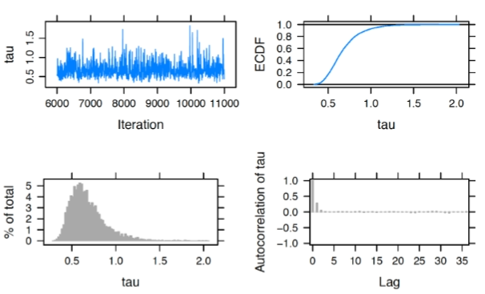
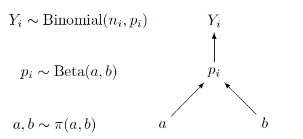
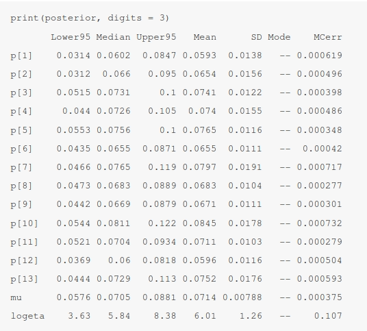

Thanks to how little I understand the source book I will use other sources in order to properly understand Bayesian Hierarchical Modeling, the contents on the following chapter explains how hierarchical Bayesian models came to be and its appeal. Then on section 2 it lays out Hierarchical Nolmal Modeling followed by an explanation on hierarchical Beta-Binomial modeling on section 3.

[Bayesian Hierarchical Modeling](https://bayesball.github.io/BOOK/bayesian-hierarchical-modeling.html)

## Introduction

### Separate estimates?

One approach for handling this group estimation problem is find separate estimates for each school. One focuses on the observations in school $j$, $\{Y_{1j}, \cdots, Y_{n_jj}\}$, choose a prior distribution $\pi(\mu_j, \sigma_j)$ for the mean and the standard deviation parameters.

This "separate estimates" approach may be reasonable, especially if the researcher thinks the means and the standard deviations from the five Normal models are completely unrelated to each other. That is, one’s prior beliefs about the parameters of the SAT score distribution in one school are unrelated to the prior beliefs about the distribution parameters in another school.

### Combined estimates?

Another way to handle this group estimation problem is to ignore the fact that there is a grouping variable and estimate the parameters in the combined sample. In our school example, one ignores the school variable and simply assumes that the SAT scores $Y_i$'s are distributed from a single Normal population with mean $\mu$ and standard deviation $\sigma$ where $i = 1, \cdots, n$ is the total number of students from all five schools. Using this approach, one is effectively ignoring any differences between the five schools.

### A two-stage prior

Is there an alternative approach that compromises between the separate and combined estimate methods?

For simplicity of discussion it is assumed the standard deviation $\sigma_j$ of the $j$th school is known. Consider the collection of five mean parameters, $\{\mu_1, \mu_2, \mu_3, \mu_4, \mu_5\}$ representing the means of the five schools' SAT scores. One believes that the $\mu_j$'s are distinct, because each $\mu_j$ depends on the characteristics of school $j$. One wishes to construct a prior distribution for the five mean parameters that reflects the belief that $\{\mu_1, \mu_2, \mu_3, \mu_4, \mu_5\}$ are related or similar in size.

The prior belief in similarity of the means is constructed in two stages:

1. [Stage 1] The prior distribution for the $j$th mean $\mu_j$ is Normal, where the mean and standard deviation parameters are shared among all $\mu_j$:

$$
\begin{aligned}
\mu_j | \mu, \tau \sim \text{Normal}(\mu, \tau), j = 1, \cdots, 5
\end{aligned}
$$

2. [Stage 2] In Stage 1, the parameters $\mu$ and $\tau$ are unknown. So this stage assigns the parameters a prior density $\pi$ (hyperprior):

$$
\begin{aligned}
\mu, \tau \sim \pi(\mu, \tau)
\end{aligned}
$$

Stage 1 indicates that the $\mu_j$'s a priori are related and thus come from the same distribution.

If one considers the limit of the Stage 1 prior as the standard deviation $\tau$ approaches zero, the group means $\mu_j$ will be identical. Then one is in the combined groups' situation where one is pooling the SAT data to learn about a single population.

At the other extreme, if one allows the standard deviation $\tau$ of the Stage 1 prior to approach infinity, then one is saying that the group means are unrelated and that leads to the separate estimates situation.

Since $\mu$ and $\tau$ are parameters in the prior distribution, they are called hyperparameters. Learning about $\mu$ and $\tau$ provides information about the population of $\mu_j$. In Bayesian inference, one learns about $\mu_j$ and $\tau$ by specifying a hyperprior distribution and performing inference based on the posterior distribution.

It will be seen that the hierarchical model posterior estimates for one school borrows information from other schools. This process is often called partial pooling information among groups.

From the structural point of view, due to the two stages of the model, this approach is called hierarchical or multilevel modeling. In essence, hierarchical modeling takes into account information from multiple levels, acknowledging differences and similarities among groups. In the posterior analysis, one learns simultaneously about each group and learns about the population of groups by pooling information across groups.

## Hierarchical Normal Modeling

### Example: ratings of animation movies

MovieLens is a website which provides personalized movie recommendations from users who create accounts and rate movies that they have seen. Based on such information, MovieLens works to build a custom preference profile for each user and provide movie recommendations.

### A hierarchical Normal model with random $\sigma$

In this situation it is reasonable to develop a model for the movie ratings where the grouping variable is the movie title. We index a rating by two subscripts, where $Y_{ij}$ denotes the $i$th rating for the $j$th movie title, with $j = 1, \cdots, 8$.

Since the ratings are continuous, it is reasonable to use the Normal data model. For simplicity and ease of illustration, a common and shared unknown standard deviation $\sigma$ is assumed for all Normal models (however it could also be modeled). Therefore we define the sampling distribution as:

$$
\begin{aligned}
Y_{ij} | \mu_j, \sigma \sim \text{Normal}(\mu_j, \sigma)
\end{aligned}
$$

Since these movies are all animations, it is reasonable to believe that the mean ratings are similar across movies. So one assigns each mean rating the same Normal prior distribution at the first stage:

$$
\begin{aligned}
\mu_j | \mu, \tau \sim \text{Normal}(\mu, \tau)
\end{aligned}
$$

The hyperparameters $\mu$ and $\tau$ are treated as random since we are unsure about the degree of pooling of the eight sets of ratings. After observing data, inference is performed about $\mu$ and $\tau$ based on their posterior distributions.

Treating $\mu$ and $\tau$ as random, one arrives at the following hierarchical model:

- **Sampling** for $j = 1, \cdots, 8$ and $i = 1, \cdots, n_j$:

$$
\begin{aligned}
Y_{ij} | \mu_j, \sigma \sim \text{Normal}(\mu_j, \sigma)
\end{aligned}
$$

- **Prior** for $\mu_j$, Stage 1, $j = 1, \cdots, 8$:

$$
\begin{aligned}
\mu_j | \mu, \tau \sim \text{Normal}(\mu, \tau)
\end{aligned}
$$

- **Prior** for $\mu_j$, Stage 2, the hyperprior:

$$
\begin{aligned}
\mu, \tau \sim \pi(\mu, \tau)
\end{aligned}
$$

To complete the model, one needs to specify a prior distribution for the standard deviation parameter, $\sigma$:

$$
\begin{aligned}
\frac{1}{\sigma^2} | a_{\sigma}, b_{\sigma} \sim \text{Gamma}(a_{\sigma}, b_{\sigma})
\end{aligned}
$$

One assigns a known Gamma prior distribution for $\frac{1}{\sigma^2}$, with fixed hyperparameter values $a_{\sigma}$ and $b_{\sigma}$. In some situations, one may consider the situation where $a_{\sigma}$ and $b_{\sigma}$ are random and assign hyperprior distributions for these unknown hyperparameters.

It is helpful to contrast the two-stage prior distribution for $\{\mu_j\}$ and the one-stage prior distribution for $\sigma$.

For the means $\{\mu_j\}$, we have discussed that specifying a common prior distribution for different $j$ pools information across the movies. One is simultaneously estimating both a mean for each movie (the $\mu_j$'s) and the variation among the movies ($\mu$ and $\tau$). For the standard deviation, the hierarchical model also pools information across movies. However, all of the observations are combined in the estimation of $\sigma$. Since separate values of $\sigma_j$, one cannot learn about the differences and similarities among the $\sigma_j$'s.

#### Graphical representation of the hierarchical model

An alternative way of expressing this hierarchical model uses the following graphical representation.


In the middle section of the graph, $Y_{ij}$ represents the collection of random variables for all ratings of movie $j$. The upper section of the graph focuses on the $\mu_j$'s. All means follow the same prior, a Normal distribution with mean $\mu$ and standard deviation $\sigma$.

Since $\mu$ and $\tau$ are random, these second-stage parameters are associated with the prior label $\pi(\mu, \tau)$.

#### Second-stage prior

The hierarchical Normal model presented in Equations (10.6) through (10.9) has not specified the hyperprior distribution $\pi(\mu, \tau)$. How does one construct a prior on these second-stage hyperparameters?

A typical approach for Normal models is to assign two independent prior distributions — a Normal distribution for the mean $\mu$ and a Gamma distribution for the precision $\frac{1}{\tau^2}$. Such a specification facilitates the use of the Gibbs sampling. Using this approach, the density $\pi(\mu, \tau)$ is replaced by the two hyperprior distributions below:

$$
\begin{aligned}
\mu | \mu_0, \gamma_0 \sim \text{Normal}(\mu_0, \gamma_0)
\end{aligned}
$$

$$
\begin{aligned}
\frac{1}{\tau^2} | a, b \sim \text{Gamma}(a_{\tau}, b_{\tau})
\end{aligned}
$$

The task of choosing a prior for $(\mu, \tau)$ reduces to the problem of choosing values for the four hyperparameters $\mu_0, \gamma_0, a_{\tau}$ and $b_{\tau}$. If one believes that $mu$ is located around the value of $3$ and she is not very confident of this choice, the set of values $\mu_0 = 3$ and $\gamma_0 = 1$ could be chosen. As for $\tau$, one chooses a weakly informative prior with $a_{\tau} = b_{\tau} = 1$ as $\text{Gamma}(1, 1)$. Moreover, to choose a prior for $\sigma$, let $a_{\sigma} = b_{\sigma} = 1$ to have the weakly informative $\text{Gamma}(1, 1)$ prior.

### Inference through MCMC

With the specification of the prior, the complete hierarchical model is described as follows:

- **Sampling** for $j = 1, \cdots, 8$ and $i = 1, \cdots, n_j$:

$$
\begin{aligned}
Y_{ij} | \mu_j, \sigma \sim \text{Normal}(\mu_j, \sigma)
\end{aligned}
$$

- **Prior** for $\mu_j$, Stage 1, $j = 1, \cdots, 8$:

$$
\begin{aligned}
\mu_j | \mu, \tau \sim \text{Normal}(\mu, \tau)
\end{aligned}
$$

- **Prior** for $\mu_j$, Stage 2: the hyperpriors:

$$
\begin{aligned}
\mu \sim \text{Normal}(3, 1)
\end{aligned}
$$

$$
\begin{aligned}
\frac{1}{\tau^2} \sim \text{Gamma}(1, 1)
\end{aligned}
$$

- **Prior** for $\sigma$

$$
\begin{aligned}
\frac{1}{\sigma^2} \sim \text{Gamma}(1, 1)
\end{aligned}
$$

#### Describe the model by a script

The first step in using the [JAGS](https://mcmc-jags.sourceforge.io/) software is to write the following script defining the hierarchical model. The model is saved in the character string modelString.

```R
modelString <-"
model {
### sampling
for (i in 1:N){
   y[i] ~ dnorm(mu_j[MovieIndex[i]], invsigma2)
}
### priors
for (j in 1:J){
   mu_j[j] ~ dnorm(mu, invtau2)
}
invsigma2 ~ dgamma(a_s, b_s)
sigma <- sqrt(pow(invsigma2, -1))
### hyperpriors
mu ~ dnorm(mu0, g0)
invtau2 ~ dgamma(a_t, b_t)
tau <- sqrt(pow(invtau2, -1))
}
"
```

In the sampling part of the script, note that the loop goes from `1` to `N`, where `N` is the number of observations with index `i`. However, because now `N` observations are grouped according to movies, indicated by `j`, one needs to create one vector, `mu_j` of length eight, and use `MovieIndex[i]` to grab the corresponding `mu_j` based on the movie index.

In the priors part of the script, the loop goes from `1` to `J`, and `J = 8` in the current example. Inside the loop, the first line corresponds to the prior distribution for `mu_j`. Due to a commonly shared `sigma`, `invsigma2` follows `dgamma(a_g, b_g)` outside of the loop. In addition, `sigma <- sqrt(pow(invsigma2, -1))` is added to help tracksigma directly.

Finally in the hyperpriors section of the script, one specifies the Normal hyperprior for `mu`, a Gamma hyperprior for `invtau2`. Keep in mind that the arguments in the `dnorm` in JAGS are the mean and the precision (std). If one is interested instead in the standard deviation parameter `tau`, one could return it in the script by using `tau <- sqrt(pow(invtau2, -1))`, enabling the tracking of its MCMC chain in the posterior inferences.

#### Define the data and prior parameters

After one has defined the model script, the next step is to provide the data and values for parameters of the prior.

In the R script below, a list `the_data` contains the vector of observations, the vector of movie indices, the number of observations, and the number of movies. It also contains the Normal hyperparameters `mu0` and `g0`, and two sets of Gamma hyperparameters (`a_t` and `b_t`) for `invtau2`, and (`a_s` and `b_s`) for `invsigma2`.

```R
y <- MovieRatings$rating
MovieIndex <- MovieRatings$Group_Number
N <- length(y)
J <- length(unique(MovieIndex))
the_data <- list("y" = y, "MovieIndex" = MovieIndex,
                 "N" = N, "J" = J,
                 "mu0" = 3, "g0" = 1,
                 "a_t" = 1, "b_t" = 1,
                 "a_s" = 1, "b_s" = 1)
```

One uses the `run.jags()` function in the runjags R package to generate posterior samples by using the MCMC algorithms in JAGS.

The script below runs one MCMC chain with $1000$ iterations in the adapt period (preparing for MCMC), $5000$ iterations of burn-in and an additional set of $5000$ iterations to be run and collected for inference. By using `monitor = c("mu", "tau", "mu_j", "sigma")`, one collects the values of all parameters in the model. In the end, the output variable `posterior` contains a matrix of simulated draws.

```R
posterior <- run.jags(modelString,
                      n.chains = 1,
                      data = the_data,
                      monitor = c("mu", "tau", "mu_j", "sigma"),
                      adapt = 1000,
                      burnin = 5000,
                      sample = 5000)
```

#### MCMC diagnostics and summarization

To perform some MCMC diagnostics in our example, one uses the `plot()` function, specifying the variable to be checked by the vars argument. For example, the script below returns four diagnostic plots (trace plot, empirical PDF, histogram, and autocorrelation plot) for the hyperparameter $\tau$.

```R
plot(posterior, vars = "tau")
```



In practice MCMC diagnostics should be performed for all parameters to justify the overall MCMC convergence. In our example, the above diagnostics should be implemented for each of the eleven parameters in the model: $\mu, \tau, \mu_1, \cdots, \mu_8$ and $\sigma$.

Once diagnostics are done, one reports posterior summaries of the parameters using `print()`. Note that these summaries are based on the 5000 iterations from the sample period, excluding the adapt and burn-in iterations.

```R
print(posterior, digits = 3)
        Lower95 Median Upper95  Mean     SD Mode   MCerr
mu         3.19   3.78    4.34  3.77  0.286   -- 0.00542
tau       0.357  0.638    1.08 0.677    0.2   -- 0.00365
mu_j[1]    2.96   3.47    3.99  3.47  0.262   -- 0.00376
mu_j[2]    3.38   3.81    4.25  3.82  0.221   -- 0.00313
mu_j[3]    3.07   3.91    4.75  3.91  0.425   -- 0.00677
mu_j[4]    3.21   3.74    4.31  3.74  0.285   -- 0.00428
mu_j[5]    3.09   4.15    5.43  4.18  0.588   --  0.0115
mu_j[6]     2.7   3.84    4.99  3.85  0.576   -- 0.00915
mu_j[7]    2.74   3.53    4.27  3.51  0.388   -- 0.00595
mu_j[8]    3.58   4.12    4.66  4.12  0.276   -- 0.00423
sigma     0.763   0.92    1.12  0.93 0.0923   -- 0.00142
```

For example, the movies "How to Train Your Dragon" (corresponding to $\mu_1$) and "Megamind" (corresponding to $\mu_7$) have the lowest average ratings with short $90\%$ credible intervals, $(2.96, 3.99)$ and $(2.74, 4.27)$ respectively, whereas "Legend of the Guardians: The Owls of Ga’Hoole" (corresponding to $μ_6$) also has a low average rating but with a wider $90\%$ credible interval $(2.70, 4.99)$. The differences in the width of the credible intervals stem from the sample sizes: there are eleven ratings for "How to Train Your Dragon", four ratings for "Megamind", and only a single rating for "Legend of the Guardians: The Owls of Ga’Hoole". The smaller the sample size, the larger the variability in the inference, even if one pools information across groups.

#### Shrinkage

Recall that the two-stage prior specifies a shared prior Normal $(\mu, \tau)$ for all $\mu_j$'s which facilitates simultaneous estimation of the movie mean ratings (the $\mu_j$'s), and estimation of the variation among the movie mean ratings through the parameters $\mu$ and $\tau$. The posterior mean of the rating for a particular movie $\mu_j$ shrinks the observed mean rating towards an average rating. The following figure displays a shrinkage plot which illustrates the movement of the observed sample mean ratings towards an average rating.


The left side plots the sample movie rating means and lines connect the sample means to the corresponding posterior means (i.e. means of the posterior draws of $\mu_j$). The shrinkage effect is obvious for the movie "Batman: Under the Red Hood" which corresponds to the dot at the value $5.0$ on the left. This movie only received one rating of $5.0$ and its mean rating $\mu_5$ shrinks to the value $4.178$ on the right, which is still the highest posterior mean among the nine movie posterior means.

A large shrinkage is desirable for a movie with a small number of ratings such as "Batman: Under the Red Hood". For a movie with a small sample size, information about other ratings of similar movies helps to produce a more reasonable estimate at the true average movie rating. The amount of shrinkage is more modest for movies with larger sample sizes.

#### Sources of variability

We know that the prior distribution $\text{Normal}(\mu, \tau)$ is shared among the means $\mu_j$'s of all groups in a hierarchical Normal model, and the hyperparameters $\mu$ and $\tau$ provide information about the population of $\mu_j$'s. Specifically, the standard deviation $\tau$ measures the variability among the $\mu_j$'s. When the hierarchical model is estimated through MCMC, summaries from the simulation draws from the posterior of $\tau$ provide information about this source of variation after analyzing the data.

There are actually two sources for the variability among the observed $Y_{ij}$'s:

- **Sampling level**: within-group variability:

$$
\begin{aligned}
Y_{ij} \sim \text{Normal}(\mu_j, \sigma)
\end{aligned}
$$

- **Group level** between-group variability:

$$
\begin{aligned}
\mu_{j} | \mu, \tau \sim \text{Normal}(\mu, \tau)
\end{aligned}
$$

When the hierarchical model is fit through MCMC, summaries from the marginal posterior distributions of $\sigma$ and $\tau$ provide information about the two sources of variability.

The Bayesian posterior inference in the hierarchical model is able to compare these two sources of variability, taking into account the prior belief and the information from the data. One initially provides prior beliefs about the values of the standard deviations $\sigma$ and $\tau$ through Gamma distributions.

What can be said about these two sources of variability after the estimation of the hierarchical model? As seen in the output of `print(posterior, digits = 3)`, the $90\%$ credible interval for $\sigma$ is $(0.763, 1.12)$ and the $90\%$ credible interval for $\tau$ is $(0.357, 1.08)$. After observing the data, the within-group variability in the measurements is estimated to be larger than the between-group variability.

To compare both variability sources we compute:

$$
\begin{aligned}
R = \frac{\tau^2}{\tau^2 + \sigma^2}
\end{aligned}
$$

It represents the fraction of the total variability in the movie ratings due to the differences between groups. If the value of $R$ is close to $1$, most of the total variability is attributed to the between-group variability. On the other side, if $R$ is close to $0$, most of the variation is within groups and there is little significant differences between groups.

A $95\%$ credible interval for $R$ is $(0.149, 0.630)$. Since much of the posterior probability of $R$ is located below the value $0.5$, this confirms that the variation between the mean movie rating titles is smaller than the variation of the ratings within the movie titles in this example.


## Hierarchical Beta-Binomial Modeling

### Example: Deaths after heart attack

The New York State (NYS) Department of Health collects and releases data on mortality after a heart attack. We focus on 13 hospitals in Manhattan, New York City, with the goal of learning about the percentages of resulted deaths from heart attack for hospitals in this sample.


### A Hierarchical Beta-Binomial Model

Treating “cases” as trials and “deaths” as successes, the Binomial sampling model is a natural choice for this data, and the objective is to learn about the death probability $p$ of the hospitals.

If one creates thirteen separate Binomial sampling models, one for each hospital, and conducts separate inferences, one loses the ability to use potential information about the death rate from hospital $i$ when making inference about that of a different hospital $j$. Since these are all hospitals in Manhattan, New York City, they may share attributes in common related to death rates from heart attack.

Therefore, one builds a hierarchical model based on a common Beta distribution that generalizes the Beta-Binomial conjugate model described in [Chapter 7](https://bayesball.github.io/BOOK/proportion.html).

Let $Y_i$ denote the number of resulted deaths from heart attack, $n_i$ the number of heart attack cases, and $p_i$ the death rate for hospital $i$. So the sampling and first stage of the prior of our model is written as follows:

- Sampling for $i = 1, \cdots, 13$:

$$
\begin{aligned}
Y_i \sim \text{Binomial}(n_i, p_i)
\end{aligned}
$$

- Prior for $p_i$, $i = 1, \cdots, 13$:

$$
\begin{aligned}
p_i \sim \text{Beta}(a, b)
\end{aligned}
$$

Note that the hyperparameters $a$ and $b$ are shared among all hospitals. If $a$ and $b$ are known values, then the posterior inference for $p_i$ of hospital $i$ is simply another Beta distribution by conjugacy (refer to [Beta-binomial conjugate prior (page 7)](https://compcogsci-3016.djnavarro.net/technote_betabinomial.pdf)):

$$
\begin{aligned}
p_i | y_i \sim \text{Beta}(a + y_i, b + n_i - y_i)
\end{aligned}
$$

In the general situation where the hyperparameters $a$ and $b$ are unknown, a second stage of the prior $\pi(a, b)$ needs to specified for these hyperparameters, such that the model is now defined as:

- Sampling for $i = 1, \cdots, 13$:

$$
\begin{aligned}
Y_i \sim \text{Binomial}(n_i, p_i)
\end{aligned}
$$

- Prior for $p_i$, Stage 1: $i = 1, \cdots, 13$:

$$
\begin{aligned}
p_i \sim \text{Beta}(a, b)
\end{aligned}
$$

- Prior for $p_i$, Stage 2: the hyperprior:

$$
\begin{aligned}
a, b \sim \pi(a, b)
\end{aligned}
$$

When we start analyzing the New York State heart attack death rate dataset, the specification of this hyperprior distribution $\pi(a, b)$ will be described.

#### Graphical Representation

One sees that the upper section of the graph represents the sampling density, with the arrow directing from $p_i$ to $Y_i$. Here the start of the arrow is the parameter and the end of the arrow is the random variable. The lower section of the graph represents the prior, with arrows directing from $a$ and $b$ to $p_i$.



### Inference through MCMC

#### Second-stage prior

For a $\text{Beta}(a, b)$ prior distribution for a proportion $p$, one considers the parameter $a$ as the prior count of “successes”, the parameter $b$ as the prior count of "failures", and the sum $a + b$ represents the prior sample size. Also the expectation is given by $\frac{a}{a + b}$. From these facts a more natural parametrization of the hyperprior distribution $\pi(a, b)$ is $\pi(\mu, \eta)$ where $\mu = \frac{a}{a + b}$ is the hyperprior mean and $\eta = a + b$ is the hyperprior sample size. Therefore:

$$
\begin{aligned}
\mu, \eta \sim \pi(\mu, \eta)
\end{aligned}
$$

where $a = \mu\eta$ and $b = (1 - \mu)\eta$.

Assume $\mu$ and $\eta$ are independent which means that one's beliefs about the prior mean are independent of the beliefs about the prior sample size. The hyperprior expectation $\mu$ is the mean measure for $p_i$, the average death rate across $13$ hospitals. If one has little prior knowledge about the expectation $\mu$, one assigns this parameter a Uniform prior which is equivalent to a $\text{Beta}(1, 1)$ prior.

To motivate the prior choice for the hyperparameter sample size $\eta$, consider the case where the hyperparameter values are known. If $y^\ast$ and $n^\ast$ are respectively the number of deaths and number of cases for one hospital, then the posterior mean of death rate parameter $p^\ast$ is given by (refer to the Beta-binomial conjugate definition):

$$
\begin{aligned}
\mathbb{E}[p^\ast|y^\ast] = \frac{y^\ast + \mu\eta}{n^\ast + \eta}
\end{aligned}
$$

With a little algebra, the posterior mean is rewritten as

$$
\begin{aligned}
\mathbb{E}[p^\ast|y^\ast] = (1 - \lambda)\frac{y^\ast}{n^\ast} + \lambda\mu
\end{aligned}
$$

where $\lambda$ is the shrinkage fraction:

$$
\begin{aligned}
\lambda = \frac{\eta}{n^* + \eta}
\end{aligned}
$$

The parameter $\lambda$ falls in the interval $(0, 1)$ and represents the degree of shrinkage of the posterior mean away from the sample proportion $\frac{y^\ast}{n^\ast}$ towards the prior mean $\mu$.

Suppose one believes a priori that, for a representative sample size $n^\ast$, the shrinkage $\lambda$ is Uniformly distributed on $(0, 1)$. By performing a transformation, this implies that the prior density for the prior sample size $\eta$ has the form:

$$
\begin{aligned}
\pi(\eta) = \frac{n^\ast}{(n^\ast + \eta)^2}, \eta > 0
\end{aligned}
$$

Equivalently, the logarithm of $\eta$, $\theta = \log(\eta)$, has a Logistic distribution with location $\log(n^\ast)$ and scale $1$. We represent this distribution as $Logistic(\log(n^\ast), 1)$, with pdf:

$$
\begin{aligned}
\pi(\theta) = \frac{e^{-(\theta - \log(n^\ast))}}{(1 + e^{-(\theta - \log(n^\ast))})^2}
\end{aligned}
$$

With this specification of the hyperparameter distribution, one writes down the complete hierarchical model as follows:

- Sampling for $i = 1, \cdots, 13$:

$$
\begin{aligned}
Y_i \sim \text{Binomial}(n_i, p_i)
\end{aligned}
$$

- Prior for $p_i$, Stage 1: $i = 1, \cdots, 13$:

$$
\begin{aligned}
p_i \sim \text{Beta}(a, b)
\end{aligned}
$$

- Prior for $p_i$, Stage 2: the hyperpriors:

$$
\begin{aligned}
\mu, \eta \sim \pi(\mu, \eta)
\end{aligned}
$$

$$
\begin{aligned}
\log \eta \sim \text{Logistic}(\log n^*, 1)
\end{aligned}
$$

where $a = \mu\eta$ and $b = (1 - \mu)\eta$

#### MCMC diagnostics and summarization

After the diagnostics are performed, one reports posterior summaries of the parameters:



From the posterior output, one evaluates the effect of information pooling in the hierarchical model. See Figure 10.6 displays a shrinkage plot showing how the sample proportions are shrunk towards the overall death rate.


To compare the posterior densities of the different $p_i$, one displays the density estimates in a single graph as in the following figure:


