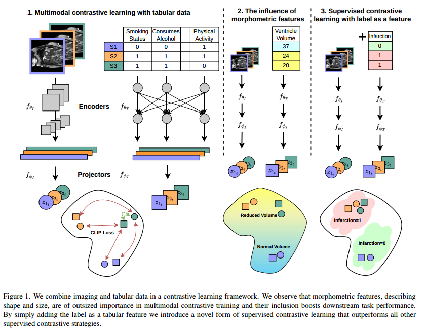
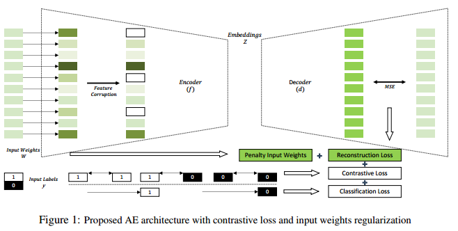
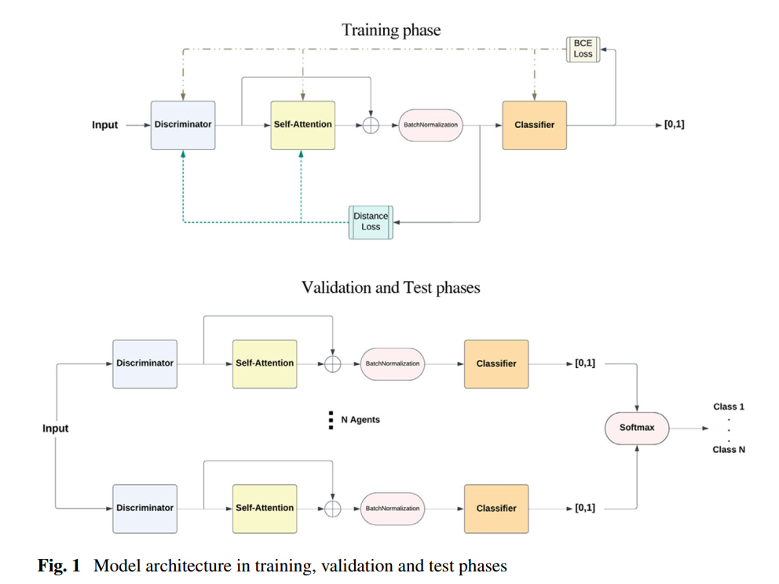
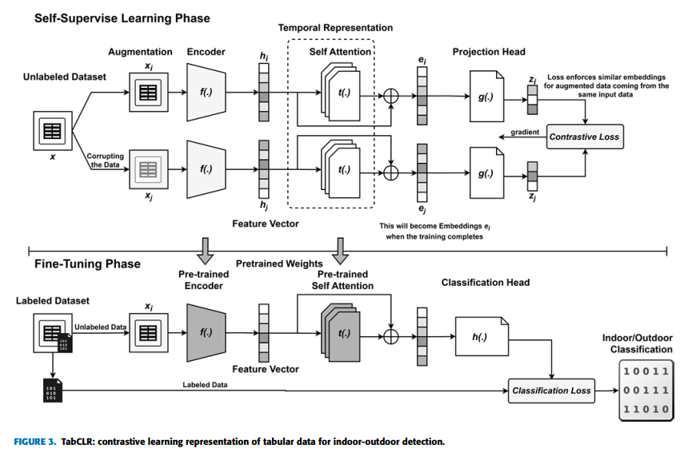
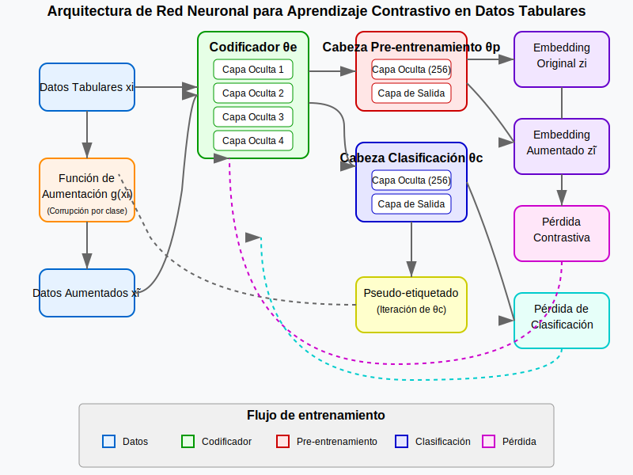
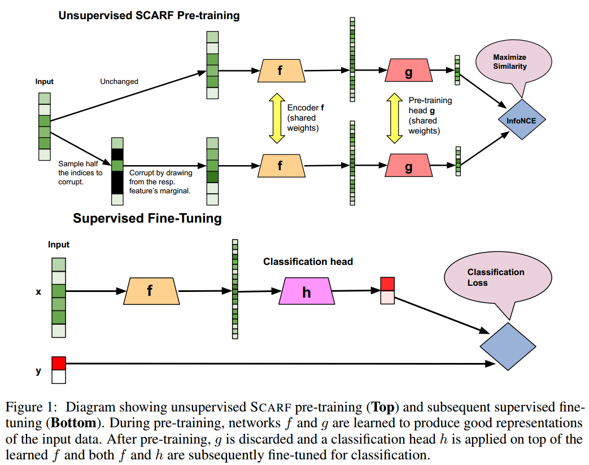

## Deep Learning on Small Tabular Dataset: Using Transfer Learning and Image Classification

**Date:** 2021

### Abstract

Deep learning methods are generally avoided for small datasets because they tend to overfit.
In the case of tabular datasets, their heterogeneous nature makes transfer learning algorithms inapplicable. This paper aims to discuss a few approaches using a literature review to convert tabular data into images to overcome such limitations.

We provide a detailed study of different techniques available to convert tabular data into images for image classification such as SuperTML, IGTD, and REFINED approach

### Introduction

In **transfer learning**, information is transferred from a pre-trained model of a related domain and then by fine-tuning that knowledge on a relatively small dataset of the current task.

However, for tabular datasets, the transfer learning and deep learning methods become inapplicable. Hence, researchers tried to develop methods to create image representations of tabular datasets: IGTD, REFINED or SuperTML.

### Deep Learning on Tabular Datasets

#### IGTD

Image Generator for Tabular Data (IGTD), transforms tabular data into images by assigning features to pixel positions so that similar features are closer in the image. Their algorithm minimizes the difference between the ranking of distances between features and the ranking of distances between their assigned pixels in the image

1. The distance between each two features is calculated.
2. All the distances are ranked in ascending order.
3. A $N \times N$ matrix is formed. Here, $N$ represents the number of features, in which at the $i$th row and $j$th column of the matrix represents rank of the distance between $i$th and $j$th features. The larger the rank is, the darker the point in the plot.
4. Similarly, a $N \times N$ matrix for pixel pairwise distances is formed
5. The error function given below is used to calculate the difference between these matrices

$$
err(R, Q) = \sum_{i = 2}^N \sum_{j=1}^{i - 1} \text{diff}(r_{ij}, q_{ij})
$$

6. The algorithm reorders the features to reduce $err(R, Q)$, keeping similar features closer in the image. For this, it selects two features using an iterative process and swaps the position of these two features.

#### REFINED

The authors have proposed to create image datasets by minimizing the pairwise distance values using a Bayesian Metric Multidimensional Scaling Approach for each datapoint.

1. First, it calculates how similar or different each feature (column) in the dataset is from the others using the Euclidean Distance. This creates a distance matrix.
2. It uses a technique called Multidimensional Scaling (MDS) to convert the distance matrix into a 2D layout. The goal is to place features that are more similar closer together in a 2D image. However, in regular MDS, some points might overlap.
3. To fix overlaps, it uses Bayesian MDS (BMDS), which adjusts the placement so that each feature gets a unique pixel in the final image. Then, it fine-tunes the layout by slightly moving features around to minimize a cost function, ensuring an optimal representation.

#### SuperTML

This method is inspired by Super Characters, a technique used in Natural Language Processing (NLP), which converts text into images of characters.

1. Instead of treating the dataset as a table with numbers, SuperTML maps each feature (column) into a specific location in an image. This means that each sample (row of the dataset) is transformed into an image representation.

> For example, SuperTML might create an 8×8 pixel image, where:
>
> - Pixel (0,0) stores Age
> - Pixel (0,1) stores Height
> - Pixel (1,0) stores Weight
> - Pixel (1,1) stores Blood Pressure
>
> And so on...

2. The generated images are then fed into a Convolutional Neural Network (CNN), a deep learning model commonly used for image recognition. Pretrained CNN models, such as ResNet or EfficientNet, are used to extract patterns and features from these images.

## Best of Both Worlds: Multimodal Contrastive Learning with Tabular and Imaging Data

**Date:** 2023

### Abstract

We propose the first selfsupervised contrastive learning framework that takes advantage of images and tabular data to train unimodal encoders. Our solution combines SimCLR and SCARF, two leading contrastive learning strategies.

We also introduce a novel form of supervised contrastive learning, label as a feature (LaaF), by appending the ground truth label as a tabular feature during multimodal pretraining.

### Related Work

#### Contrastive learning

Contrastive learning trains encoders by generating augmented views of a sample and maximizing their projected embedding similarity while minimizing the similarity between the projected embeddings of other samples.

#### Multimodal Learning

Multimodal learning is a type of machine learning that combines multiple types of data (modalities) to improve learning and prediction. Instead of relying on just one type of input (like only images or only text), multimodal learning can process and learn from two or more different data types simultaneously.

A modality is just a type of data. Some common examples of modalities include:

- Text (articles, reviews, chat messages)
- Images (photos, medical scans)
- Audio (speech recordings, music)
- Videos (a combination of images and audio)
- Tabular Data (structured numerical data, like spreadsheets)
- Sensor Data (signals from IoT devices, temperature, motion)

### Methods

Each batch contains pairs of imaging $x_{j_i}$ and tabular $x_{j_t}$ samples which are augmented.

Each augmented imaging sample $x_{j_i}$ is passed through an imaging encoder $f_{\theta_I}$ to generate the embedding $\hat{x_{j_i}}$.

Each augmented tabular sample $x_{j_t}$ is passed through a tabular encoder $f_{\theta_T}$ to generate the embedding $\hat{x_{j_t}}$.

The embeddings are propagated through separate projection heads $f_{\phi_I}$ and $f_{\phi_T}$ and brought into a shared latent space as projections $z_{j_i}$ and $z_{j_t}$ which are then L2 normalized onto a unit hypersphere.

$$
z_{j_i} = f_{\phi_I}(f_{\theta_I}(x_{j_i}))
$$

The projections are pulled and pushed in the shared latent space according to the “CLIP” loss, which maximizes the cosine similarity of projections from the same sample and minimizes the similarity of projections from different samples.

$$
l_{i, t} = - \sum_{j \in \mathcal{N}} \log \frac{\exp(\cos(z_{j_i}, z_{j_t})/\tau)}{\sum_{k \in \mathcal{N}, k \neq j} \exp(\cos(z_{k_i}, z_{k_t})/\tau)}
$$

Then $l_{t, i}$ is calculated analagously and the total loss is

$$
\mathcal{L} = \lambda l_{i, y} + (1 - \lambda) l_{t, i}
$$

See Figure 1 for an illustration of this framework

## Contrastive clustering of tabular data

**Date:** 2023

### Introduction

In this paper, we investigate the adaptation of the recent contrastive clustering approach in the case of tabular data.

The efficacy of contrastive self-supervised models relies heavily on data augmentation, i.e., applying transformations that do not alter the class labels in the target task.

Applying contrastive methods to domain-agnostic tabular data presents unique challenges due to the lack of a regular internal structure and pre-defined relationships such as spatial dependencies.

Drawing on new ideas of contrastive learning in computer vision, we present the application of contrastive clustering methods for tabular data. Specifically, we examine three types of augmentation techniques.

### Method

#### Contrastive Clustering Base

The fundamental structure of our model is built on the Contrastive Clustering technique, utilizing all of its three main components:

- The backbone network
- The instance-level contrastive head
- The clusterlevel contrastive head

A feature extractor $f: \mathbb{R}^D \leftarrow \mathbb{R}^N$, represented by backbone component, returns the representation $h = f(x)$ for a given input $x$. Think of this as transforming raw data into a more useful representation for clustering.

Once we have the feature vector $h$, it goes through two separate heads:

- **Instance-Level Contrastive Head** ($g_I$): This head learns to make each data point unique, so that the model can recognize individual examples even if they are slightly changed (data augmentations). It uses NTXent loss (a contrastive loss function) to ensure that the feature representations stay consistent even when data is transformed.
- **Cluster-Level Contrastive Head** ($g_C$) This head groups similar feature vectors together into clusters. Instead of looking at individual points, it focuses on ensuring that entire clusters of data points are well separated. Uses softmax activation to assign each point to a cluster.

The model uses NTXent loss (Normalized Temperature-scaled Cross-Entropy Loss) at both levels. This pushes apart different clusters and pulls together similar points, improving clustering quality.

#### Data Augmentation for Tabular Data

We propose to use the following augmentations:

- **Gaussian noise**, generated from a standard normal distribution, is incorporated into the original data. This method involves the addition of randomly selected values derived from this distribution.
- **Swap** introduces permutations within the dataset’s features. Specifically, values from one data instance are interchanged with values from another instance.
- **Zero** is introduced by applying a dropout operation to the initial layer of the backbone network. This technique involves zeroing out a fraction of the input features.

## HyperTab: Hypernetwork Approach for Deep Learning on Small Tabular Datasets

### Abstract

HyperTab, a hypernetwork-based approach to solving small sample problems on tabular datasets. By combining the advantages of Random Forests and neural networks, HyperTab generates an ensemble of neural networks, where each target model is specialized to process a specific lower-dimensional view of the data. Since each view plays the role of data augmentation, we virtually increase the number of training samples while keeping the number of trainable parameters unchanged.

### Introduction

To meet the requirement that the augmentation is a classinvariant transformation (the class label does not change after applying the augmentation), we use the feature subsetting as the admissible augmentations. HyperTab follows the hypernetwork approach, in which a single hypernetwork builds an ensemble of target networks. Given the augmentation identifier (subset of features), the hypernetwork generates the parameters of the target network.

Each target network operates on a lower-dimensional view, where data are represented by the subset of features. Moreover, since the parameters of target networks are not optimized but returned by the hypernetwork (the hypernetwork is trained to generate the weights for each target netwrok) we significantly reduce the number of trainable parameters compared to the size of the ensemble. The only trainable parameters are the weights of the hypernetwork.

### Model

HyperTab consists of two main components: hypernetwork $H$ and an ensemble of target networks $T_j$, for $j = 1, \cdots k$. The hypernetwork takes the type of augmentation as input and returns the parameters of the target network, which is designed to use such an augmented view of data.

Let $X = \\{x_1, x_2, \cdots, x_n\\} \subset \mathbb{R}^d$ be a tabular dataset. By $c \subset \\{1, \cdots, d\\}$, where $|c| = l$, we denote the subset of $l$ selected indices. Applying the augmentation defined by $c$ to a sample $x \in \mathbb{R}^d$ produces a vector $x[c] \in \mathbb{R}^l$, which represents a lower-dimensional view of the data point $x$.

#### Construction of the ensemble

Every target network is designed to process a specific augmented view of the data. More precisely, the target network $T_c: \mathbb{R}^l \leftarrow Z$ takes a lower-dimensional representation $x[c]$ and returns a vector $z \in Z$, e.g. logits in the case of classification. The vector $z$ can be converted to the final target value, e.g. a class label $y \in Y$. The augmentation $c$ determines the form of the target network $T_c$.

We construct a central mechanism to generate the whole ensemble. That is, a hypernetwork $H$, which returns the parameters of the target network for a given type of augmentation. The augmentation $c \subset \\{1, \cdots, d\\}$ can be encoded as a binary mask $m \in \\{0, 1\\}^d$, where

$$
m_j = \begin{cases}
1, & \text{ for } j \in c \\
0, & \text{ otherwise }
\end{cases}
$$

The hypernetwork is thus a neural network $H_{\psi}: \\{0, 1\\}^d$, which transforms a binary mask $m$ representing the augmentation $c$ to the weights $\theta_c$ of the target network $T_{\theta_c}$

$$
\theta_c = H_{\psi}(m)
$$

Every target network returns:

$$
z_c = T_{\theta_c}(x[c])
$$

#### Training

To train HyperTab, we optimize the weights $\psi$ of the hypernetwork $H_\psi$.

- We take a minibatch of augmentations $B_c = \\{c_1, \cdots, c_a\\}$ and define the corresponding masks $m_j \in \\{0, 1\\}^d$.
- Using the hypernetwork, we generate the weights of the target networks $\theta_j = H_\psi(m_j)$.
- Every target network is then applied to the minibatch of data points $B_x = \\{x_1, \cdots, x_b\\}$ producing partial predictions $z_{ij} = T_{\theta_j}(x_i[c_j])$, for example $i = 1, \cdots, b$ and augmentation $j = 1, \cdots, a$.
- Vectors $z_{ij}$ are compared to true targets $y_i$ via a given loss function $L(y_i, z_{ij})$. The loss is minimized by changing the parameters $\psi$ of the hypernetwork $H_\psi$ using gradient descent.

As can be seen, a training sample is a pair of augmentation and data point. As a consequence, we have as many training samples as the number of data points times the number of augmentations.

#### Inference

Once trained, the hypernetwork $H$ can produce the ensemble of weak learners $\theta_j = H_\psi(m_j)$, where $m_j$ is a mask corresponding to the augmentation $c_j$, for $j = 1, \cdots, a$. The final prediction for a given sample $x \in \mathbb{R}^d$ is calculated as the average of the predictions of the target networks taken over all augmentations:

$$
z = \frac{1}{a} \sum_{j = 1}^a T_{\theta_j}(x[c_j])
$$

We emphasize that $z_c = T(x[c])$ is the result of the last layer of the target network, for example, logits in the case of classification.

## ReConTab: Regularized Contrastive Representation Learning for Tabular Data

**Date:** 2023

### Abstract

ReConTab is a deep automatic representation learning framework with regularized contrastive learning. It constructs an asymmetric autoencoder based on the same raw features from model inputs, producing low-dimensional representative embeddings.

Our framework consists of an asymmetric autoencoder (AE) architecture, which is able to extract the most critical information from raw features. Moreover, ReConTab can be effectively trained in both self- and semi-supervised modes.

### Related Work

The first category of deep representation learning methods is rooted in generative models, particularly autoencoders The second category predominantly revolves around the contrastive learning paradigm and strategically employs data augmentation techniques.

### Method

#### Regularization

The input weights $W$ are applied to the input features before they enter the encoder. Their purpose is to prevent similar features from weighing too much in the loss objective. They help learn more robust representations, especially when highly correlated features are present.

We apply regularization on the input layer by introducing a penalty term $\lambda ||W||_p$ into the loss function, where $W$ represents the input weights, $\lambda$ is the regularization parameter and $p$ is the specific norm for the penalty.

#### Feature Corruption

Considering the original dataset $X \subseteq \mathbb{R}^M$, given any tabular data point $x_i$, we have its $j$-th feature as $x_{ij}$. In our approach, for each sample, we stochastically select $t$ features from the pool of $M$ features and replace them with corrupted features denoted as $c$. We generate $c$ from the distribution $\hat{\mathcal{X}i_j}$, where $\hat{\mathcal{X}i_j}$ represents the uniform distribution over \(\mathcal{X}_{i_j} = \{x_{i_j} : x_i \in \mathcal{X}\}\). That is we select "randomly" any value under the $j$th column.

#### Self-supervised Learning

For each of the two data samples, $x_1$ and $x_2$, we apply input weights and add feature corruption to obtain corrupted data. Then we encode the corrupted data using an encoder, $f$, resulting
in two features, $z_1$ and $z_2$. The decoder $d$ will decode the learned embeddings to reconstruct $\hat{x}_1$ and $\hat{x}_2$ respectively, from where we can define the reconstruction loss

$$
\mathcal{L}_{\text{reconstruction}} = \frac{1}{M} \sum_{j = 1}^M (x_{1_j} - \hat{x}_{1_j})^2 + \frac{1}{M} \sum_{j = 1}^M (x_{2_j} - \hat{x}_{2_j})^2
$$

Therefore, the loss function for self-supervised learning can be defined as:

$$
\mathcal{L}_{\text{self}} = \mathcal{L}_{\text{reconstruction}} + \lambda ||W||_p
$$

**The encoder and decoder are NOT pretrained models but rather trained during the ReConTab training process itself.**

#### Semi-supervised Learning

With labels introduced, we can pose additional constraints to the encoded embeddings $z_1$ and $z_2$. We can to compute the prediction loss: $z_1$ and $z_2$ are fed to the a multi-layer perceptron (MLP) that maps from the embedding space to the label space. We define the cross-entropy loss for classification task as:

$$
\mathcal{L}_{\text{classification}} = -(y_1 \log(\hat{y}_1) + y_2 \log(\hat{y}_2))
$$

where

$$
\hat{y}_1 = MLP(z_1)\\
\hat{y}_2 = MLP(z_2)
$$

#### Contrastive Loss

We further introduce the contrastive loss Lcontrastive in the loss function by forming contrastive pairs $(z_1, z_2)$ of embeddings with respect to the classification labels $(y_1, y_2)$. With this loss function, the model is optimized to maximize the similarity between embeddings with the same label and minimize the similarity between embeddings with different labels.

During the optimization stage, we combine the two additional losses with the self-supervised learning as follows:

$$
\mathcal{L}_{\text{semi}} = \mathcal{L}_{\text{self}} + \alpha \mathcal{L}_{\text{classification}} + \beta \mathcal{L}_{\text{contrastive}}
$$

The parameters being optimized in ReConTab include:

- Input weights ($W$): Applied to the input features and regularized with a penalty term
- Encoder ($f$) parameters: Updated to minimize various loss components
- Decoder ($d$) parameters: Updated alongside the encoder
- MLP parameters (in semi-supervised learning): Used to map embeddings to labels

See Figure 1 for an illustration of the models architecture.

## TabContrast: A Local-Global Level Method for Tabular Contrastive Learning

**Date:**: 2023

### Introduction

With the challenges of obtaining labeled data, self-supervised learning, particularly contrastive learning, has gained traction. The essence of contrastive learning lies in crafting a discriminative embedding space. This is predominantly achieved by amplifying the similarity of positive pairs and emphasizing the dissimilarity of negative pairs. Positive pairs are usually different augmented views of the same sample, while negative pairs consist of distinct samples.

We introduce "TabContrast". This method adopts a local-global contrast approach, segmenting features into subsets and subsequently performing tailored clustering to unveil inherent data patterns. By aligning samples with cluster centroids and emphasizing clear semantic distinctions.

### Local-Global Method for Positive and Negative Pair Construction

Given a tabular dataset represented as $D = {x_i, y_i}^N_{i=1}$, each $x_i$ stands as a $d$-dimensional feature vector with $y_i$ as its associated label, and $N$ as the total sample count. The feature set is expressed as $F = {f_1, \cdots, f_d}$.

For each batch of samples, we first randomly partition the feature set $F$ into $k$ non-overlapped subsets $F_1, \cdots, F_k$.

Then, we perform clustering according to each feature subset $F_j$, and will obtain clustering groups $G = {G_1, \cdots, G_k}$, where $G_j$ is the set clustering results from $j$-th feature subset. We denote the $i$-th group in $G_j$ as $g_j^i$, and denote the clustering center of $g_j^i$ as $c^i_j = MEAN(x), \forall x \in g_j^i$.

For a given sample $x_i$, suppose the groups it belongs to are denoted as ${g_j^p}^k_{j=1}$. Formulating positive pairs for a given sample $x_i$ is achieved by local-global matching.

$$
P = \{(x_i, c_j^p) | j \in (1, k), x_i \in g_j^p\}
$$

That is, the $p$ positive pairs for $x_i$ are defined as the centroids of groups $g_j^p$.

To construct negative pairs, in order to avoid including false negatives, we propose to exclude the samples that are highly correlated with the sample $x_i$. Given the possible variation in clustering outcomes across feature subsets, samples cohabitating in at least $\lfloor \frac{k}{2} \rfloor$ groups with $x_i$ are considered highly correlated. Denote the set of these highly correlated samples as $X_p$ and the entire samples in the current batch as $X_b$, the negative pairs are represented as:

$$
N = \{(x_i, x_n) | x_n \in X_b \setminus X_P\}
$$

That is the negative pairs for $x_i$ are defined as any sample that is not assignated to the same cluster as $x_i$ more than $\lfloor \frac{k}{2} \rfloor$ times, where $k$ is the number of feature subsets we clustered.

## Attention Versus Contrastive Learning of Tabular Data: A Data-Centric Benchmarking

### Introduction

This article extensively evaluates state-of-the-art attention and contrastive learning methods on a wide selection of 28 tabular data sets (14 easy and 14 hard-to-classify) against traditional deep and machine learning.

This paper identifies four deep tabular data learning strategies: 1) attention, 2) contrastive learning, 3) traditional deep learning, and 4) autoencoder with pretraining.

### Background

The SCARF (Self-Supervised Contrastive Learning with Random Feature Corruption) method is a constrastive learning method that masks $60\%$ of the features of each data sample and replaces masked values with those obtained from a random sample, termed random feature corruption.

While Value Imputation and Mask Estimation (VIME) creates a mask using a Bernoulli distribution. Furthermore, VIME optimizes two loss terms: one to reconstruct the corrupted features and the other to estimate mask vectors

### Methods

This section presents thirteen methods we test on tabular datasets. These methods are grouped into four categories:

- Baseline neural networks
  - Fully connected Deep Neural Networks (DNN)
  - DNN with Autoencoder pretraining (DNN-AE)
- Attention-based neural networks:
  - TabNet
  - FT-Transformer (FTT)
  - Non-Parametric Transformer (NPT)
  - Self-Attention and Intersample Attention Transformer (SAINT)
- Contrastive Learning methods (SCARF) using five corruption strategies
  - Pass
  - Additive noise
  - Sampling from feature distribution
  - Random Feature Corruption (RF)
  - CutMix
- Traditional machine learning:
  - Logistic Regression (LR)
  - Gradient Boosting Decision Trees (GBT).

#### DNN with Autoencoder pretraining

In a self-supervised pertaining setting, an autoencoder maps input data to a low-dimensional latent space, which is then trained to decode or reconstruct the input from the latent space. This self-supervised learning provides an effective initialization of the model’s trainable parameters.

How does this pre-training work?

You train the autoencoder on your data by making it learn how to reconstruct the input as accurately as possible. This process forces the encoder to learn useful features of the data. After pretraining, the decoder is no longer needed. You replace the decoder with a classifier (a layer that predicts categories).

Instead of training a DNN from scratch, you start with a model that already understands the data structure.

#### Attention-based learning

**Attention-based training** is a way for neural networks to focus on the most important parts of the input data, rather than treating everything equally. Instead of processing all the input equally, they assign different importance (weights) to different parts based on how relevant they are. This helps models make better predictions, especially when dealing with long sequences (like sentences, time-series data, or images).

A **Transformer** is made up of layers of attention and other operations. The two main parts are:

- Encoder: Processes the input (e.g., a sentence in English).
- Decoder: Generates the output (e.g., a translation in French).

Each layer contains:

- Self-Attention: Helps the model focus on the right words in a sentence.
- Feedforward Layers: Adjusts and refines the attention-based results.

Transformers were originally designed for text (like sentences), where words are turned into word embeddings—special numerical representations that help the model understand relationships between words. But when dealing with tabular data (like spreadsheets with columns and rows), we don’t have "words"—we have features (columns like "age," "salary," or "height").

For Transformers to work well with tabular data, we need to convert these features into embeddings, just like words in text processing.

**Feature-Tokenization** is a method where:

- Each column (feature) is treated like a "word" in a sentence.
- Each feature gets a special trainable embedding (numerical representation).
- This changes the data shape from (rows $\times$ columns) → (rows $\times$ columns $\times$ embedding size).

#### Contrastive Learning

For contrastive methods, we investigate the effectiveness of five corruption strategies

- Pass: No values are altered.
- Noise: A value sampled from Gaussian distribution $\mathcal{N}(0, 1^2)$ is added to each masked value.
- Sample: Features are assumed to be normally distributed with feature mean ($\mu$) and standard deviation ($\sigma$). Each masked value is replaced by a value sampled from corresponding feature distribution $\mathcal{N}(\mu, \sigma)$.
- CutMix: Masked values of a sample are replaced using corresponding feature values of another random sample.
- Random Feature Corruption (RFC): Each masked value in a sample is replaced with the same feature value taken from another random sample. The difference between RFC and CutMix is that CutMix selects a random sample to replace all the masked values of a given sample. In contrast, RFC replaces masked values of a sample using values taken from different random samples.
- Proposed Within Cluster Replace (WCR): Given a data set with $K$ classes, k-mean clustering is used to obtain $K$ clusters. Instead of using a mask, all feature values of a sample are replaced using the corresponding feature values of another random sample within the same cluster.

### Conclusion

Leveraging the strength of attention and contrastive learning yields the best performance by far (SAINT), followed by NPT and FTT methods.

## Explainable Multi-agent Network for Multi-classification in Small Tabular Data

### Introduction

We present an explainable multi-agent network for multi-classification of small tabular datasets, that uses a discrimination network, an attention block, and a classification network.

### Method

For each agent in training phase, the input consists of $n$ pairs that includes: $x_1$, instance
that we want to classify, and $\hat{x}_i$, instance that will be used to measure the similarity
to $x_1$, so that the input is: $(x_1, \hat{x}_i)$ with $i$ from $1$ to $n$.

This input will be used by the first part of the network called **discriminator** to create an embedding representation $\text{emb}_1$ and $\hat{\text{emb}}_i$ for $x_1$ and $\hat{x}_i$ respectively. This part of the network uses cosine distance as a loss function.

The second part of the network called classifier takes only $\text{emb}_1$ as input to predict if it belongs to the specific class of the agent or not. Essentially each agent will be trained to differentiate between one class and the rest, meaning that the model will have $N$ agents where $N$ is the number of classes in the dataset.

All agents are trained in parallel, at the start of an episode the input

$$
\{x_1, \hat{x}_i\}_{i=1}^n
$$

the similarity label $_i$, and the class label $y_i$ are extracted. The similarity label is equal to $1$ if pairs are from the same class and $–1$ if not. Also, class label $y_i$ equals $1$ if the class is specific to the agent and $0$ if not.

An episode has an inner epoch where the discriminator network will compare $x_1$ to each $\hat{x}_i$ , and the cosine loss is calculated using similarity labels and embedding outputs. Finally,
the classification network uses the embedding output of $x_i$ to predict the class label $\hat{y}_i$ and the classification loss is calculated between $y_i$ and $\hat{y}_i$. The model is optimized using both classifier and discriminator losses.

For validation and test phases, all agents work jointly with the same input $x$ and output a probability of $x$ being from the agent’s class, then a SoftMax function is performed on the joint probability tensor to predict the actual class of the input.

## TabCLR: Contrastive Learning Representation of Tabular Data Classification for Indoor-Outdoor Detection

### Introduction

TabCLR utilizes contrastive learning representation tailored for tabular data classification using smartphone inertial sensors. It comprises data augmentation, a novel encoder network with self-attention, and an optimized contrastive loss function.

Notably, TabCLR outperforms SCARF by $6\\%-7\\%$, indicating its effectiveness in capturing temporal feature representation patterns.

TabCLR encapsulates three important steps in contrasting learning representation.

- Firstly, in the augmentation phase, we randomly add corrupted features in the unlabeled dataset to generate positive pairs, fostering semantic similarity, while forming negative pairs by contrasting corrupted data with the remaining batch components.
- Secondly, a novel encoder model incorporates self-attention for temporal representation extraction and spatial features from the base encoder.
- Thirdly, we encapsulate a modified form of NXENT contrastive loss function from simCLR, called spatial-context contrastive loss (SCCL).
- Finally, we also present a fine-tuning phase, where labeled inertial sensor data is classified into indoor-outdoor classification using a lightweight DNN-based classifier after getting feature representation from the pre-trained novel encoder.

### Methodology

#### Problem Formulation and Objective

Given a dataset $D = \\{(x_i, y_i)\\}_{i=1}^N$ where $x_i$ represents the unlabeled inertial sensors data for the ith sample and $y_i$ is the corresponding label indicating whether the sample is from an indoor or outdoor environment ($y_i \in \\{I, O\\}$), which will used for fine-tuning after self-supervised learning. Our goal is to learn the inertial representation $f(x_i)$ that captures the spatio-temporal features crucial for indooroutdoor classification. Our objective is to optimize the following:

$$
\min_{\theta, \phi} \frac{1}{N} \sum_{i=1}^N \left[\log \frac{\exp(\text{sim}(f_\theta(x_i), f_\theta(x_j)))}{\sum_{k=1}^N \exp(\text{sim}(f_\theta(x_i), f_\theta(x_k)))}\right]
$$

Here $f_\theta$ denotes the encoding function parameterized by $\theta$, and $\text{sim}(\cdot)$ represents the similarity measure between representations.

The dataset is divided into an unlabelled contrastive self-supervised learning phase and a labeled fine-tuning phase. During self-supervised learning, the objective is to minimize intra-cluster distances (dintra) between semantically similar data points and maximize inter-cluster distances (dinter ) between dissimilar points:

$$
d_{\text{intra}}(x_i, x_j) = ||f(x_i) - f(x_j)||_2 (\text{Intra-cluster distance})
$$

$$
d_{\text{intra}}(x_i, x_k) = ||f(x_i) - f(x_k)||_2 (\text{Inter-cluster distance})
$$

The model aims to minimize the ratio of intra-cluster distance to inter-cluster distance:

$$
\text{Minimize} \frac{d_{\text{intra}}}{d_{\text{inter}}}
$$

#### Random Permutation Feature Corruption

To create positive pairs, this mechanism corrupts a subset of features within the sensor data to generate positive pairs, while contrasting corrupted data within the remaining batch yields negative pairs. Then it utilizes empirical marginal distributions of features to guide the data augmentation process. Sampling from these distributions ensures the realism and representativeness of the augmented data, enhancing the quality of learned representations. The empirical sampling is mathematically represented as:

$$
x_{\text{augmented}} \sim \text{Uniform}(\text{features\_low}, \text{features\_high})
$$

Let $x$ be the input tensor of size $B \times M$ where $B$ is the batch size, and $M$ is the length of the input tensor. The corrupted tensor $x_c$ is expressed as:

$$
x_c = x \odot M_c + R \odot (1_{B \times M} - M_c)
$$

where $\odot$ represents elemt-wise multiplication and $1_{B \times M}$ is a tensor of ones with the same size as $x$.

#### Proposal of SCCL Loss Function

We propose spatial-context contrastive loss (SCCL). Incorporates a spatial consistency term, enhancing its effectiveness in capturing spatial relationships:

$$
\mathcal{L}_{\text{SCCL}} = - \frac{1}{2B} \sum_{i=1}^{2B} \log \left(\frac{e^{\text{sim}_{ii} / \tau}}{\sum_{j \neq i} e^{\text{sim}_{ij} / \tau}}\right) \\ + \alpha \frac{1}{B} \sum_{k=1}^B ||z_{ik} - z_{jk}||_2
$$

where $z_{ik}$ and $z_{jk}$ are embeddings of anchor and positive samples, and $\alpha$ is the weight parameter for the spatial consistency term.

The first term aims to maximize the similarity between positive pairs (\(\text{sim}_{ii}\)) and minimize the similarity between negative pairs ($\text{sim}_{ij}$). The second term enforces consistency in feature representations across augmentations, promoting robustness and discriminative feature learning.

#### TabCLR Framework

For each mini-batch of examples from the unlabeled training data, a corrupted version $\hat{x}(i)$ is generated for each example $x(i)$. Both the original $x(i)$ and corrupted $\hat{x}(i)$ instances are passed through the encoder network ($f$), which incorporates self-attention ($t$) for temporal representation. The encoder network’s output is then processed through the pre-train head network ($g$), which normalizes the outputs to lie on the unit hypersphere.

The resulting representations are denoted as $z(i)$ and $\hat{z}(i)$ for the original and corrupted instances, respectively. The training objective involves optimizing the parameters of both the encoder ($f $) with self-attention ($t$) and the pre-train head ($g$) networks through stochastic gradient descent (SGD).

To facilitate downstream tasks, a classifier is fine-tuned. The encoder network ($f$) with self-attention ($t$) is retained, and a classification head ($h$) is attached to predict labels based on the output of the encoder. Crossentropy classification loss is optimized, and the parameter of both the encoder and classifier are tuned.

Figure 3 provides a visual representation.

## Tabular Data Contrastive Learning via Class-Conditioned and Feature-Correlation Based Augmentation

### Introduction

We propose a simple yet powerful improvement to this augmentation technique: corrupting tabular data conditioned on class identity. In recent years, contrastive learning has emerged as a highly popular pre-training technique frequently adapted in the self-supervised learning and semisupervised learning settings. Contrastive learning is mainly used to pre-train an encoder block. So it learns a lower-dimensional encoding using a contrastive strategy which is the used as the input for the encoder.

To perform contrastive learning, as the first step, researchers engineer data augmentation techniques to create similar views on top of each original data point (often referred to as the anchor). A contrastive loss is then optimized, which minimizes a distance metric (i.e., cosine similarity) in the embedding space between the anchor and its corresponding views.

We first propose an easy yet powerful improvement to the feature-value corruption technique, by
incorporating the class information into the corruption procedure. Specifically, when corrupting a feature value on the anchor row, instead of sampling uniformly across the entire table for the replacement, we restrict the sampling within rows that belong to the same class as the anchor row. We refer to this improvement as **class-conditioned corruption**.

Note that, as we do not have the target information for every row under the semi-supervised setting, we adopt the pseudolabeling technique to obtain estimations of targets.

We further explore into another dimension of corruption strategy: where to corrupt. Specifically, to improve upon the current approach, we exploit feature correlations, and attempt to sample the subset of features based on the correlation structure, which we refer to as correlation-basedfeature masking.

### Problem Formulation and Background

Consider a tabular dataset $D = (D_{\text{train}}, D_{\text{test}})$, where

$$
D_{\text{train}} = \{(x_i, y_i)\}_{i=1}^{N_i} \cup \{x_i\}_{i=N_l + 1}^{N_l + N_u}
$$

such that it consists of $N_l$ labeled samples and $N_u$ unlabeled samples for training; and

$$
D_{\text{test}} = \{(x_i, y_i)\}_{i = N_l + N_u + 1}^{N_l + N_u + N_t}
$$

such that it consists of $N_t$ labeled samples for testing, with the testing labels $\\{y_i\\}_{i=N_l + N_u + 1}^{N_l + N_u + N_t}$ unknown to the model. Each sample input $x_i$ consists of $M$ features.

We aim to learn a parametrized mapping $f_\theta(\cdot)$ that solves the classification task by mapping each input in the testing set to its class. We explore the use of a neural network for modeling $f_\theta$ which consists of three parts:

- An encoder, with parameters denoted as $\theta_e$.
- A pre-train head, with parameters denoted as $\theta_p$.
- A classification head, with parameters denoted as $\theta_c$.

We then have $\theta = \\{\theta_e, \theta_p, \theta_c\\}$ as the model parameters. The pre-train head $\theta_p$ is only included in the pre-training stage to allow for extra flexibility in the learned representations. It will be discarded in the down-stream fine-tuning stage.

#### Contrastive Learning

Contrastive learning is the process of pre-training the model to learn an embedding space which will be further used for down-stream classification or regression tasks. Let $g(\cdot)$ denote the data augmentation function. Given an anchor $x_i$ from the training set, a view is generated as follows:

$$
\hat{x}_i = g(x_i)
$$

With $g(\cdot)$ intended to be a semantic preserving operation, $\hat{x}_i$ should be highly similar to $x_i$. Therefore, their corresponding representations in the embedding space should also be close. After obtaining views as above, we compute the embeddings for the original data points as well as the views:

$$
z_i = f_{\theta_p}(f_{\theta_e}(x_i))
$$

$$
\hat{z}_i = f_{\theta_p}(f_{\theta_e}(\hat{x}_i))
$$

Consider a sampled training batch $\\{x_i\\}^N_{i=1}$ with batch size $N$. We can obtain two sets of embeddings: $\\{z_i\\}^N_{i=1}$ and \(\{\hat{z}_i\}^N_{i=1}\). We denote the cosine similarity between any pair of embeddings $z_i$ and $z_j$ as follows:

$$
s_{i, j} = \frac{z_i^Tz_j}{||z_i||||z_j||}
$$

A contrastive loss is then defined on this training batch as follows:

$$
\mathcal{L} = \frac{1}{2N} \sum_{i=1}^{2N} - \log \left(\frac{e^{s_{i, i'} / \tau}}{\sum_{j = 1}^{2N} 1_{[j \neq i]}e^{s_{i, j} / \tau}}\right)
$$

where $i'$ is the index of the pairing view (or anchor) embedding to the index $i$. By minimizing this equation, we gradually push closer pairs of anchor and view, and push away anchors and views across different pairs.

After optimizing the model we will proceed to discard the pretrain head $\theta_p$, freeze the encoder portion $\theta_e$, and train the classification head $\theta_c$ taking the outputs from the encoder as inputs on the labeled training set.

#### Data Augmentation via Random Corruption

To describe the corruption procedure in details, let $p$ be the percentage of features to be corrupted, which is a hyperparameter. We would then have $\lceil M_p \rceil$ features to be corrupted. Let $M_{\text{crpt}}$ denote the subset of features to be corrupted. In the current literature, the $M_{\text{crpt}}$ features are randomly selected from the $M$ features for each anchor to be corrupted. Furthermore, for each feature within the $M_{\text{crpt}}$ features, the replacement value is also randomly selected from the feature column from the entire table.

### Method

We formally propose two improvements over the existing tabular data augmentation procedure.

#### How to Corrupt: Class-Conditioned Corruption

When corrupting each selected feature in the anchor, we only sample the feature value from rows that are under the same class as the anchor. The main challenge within the class-conditioned corruption process is to obtain class labels over the entire table. Conventionally, contrastive learning is a self-supervised learning approach that does not require any label. But, the assumption of semi-supervised learning, where a small set of labels is available, is more realistic.

Under the semi-supervised learning setting, we adapt the popular pseudo labeling approachfor obtaining labels on the unlabeled training set. Specifically, a model is first trained on the small labeled set, and then utilized to run inference on the remaining unlabeled set. The model outputs are regarded as the pseudo targets for the unlabeled data.

#### Where to Corrupt: Correlation-Based Feature Masking

Instead of randomly selecting the subset of features to corrupt on each anchor, we hypothesize that incorporating the correlation information among features can improve the performance of contrastive learning. This technique can be regarded as selecting a subset of features that are highly correlated for corruption. The rationale behind this strategy follows that with each feature being corrupted, there exists correlated features left intact. Through reconstructing the corrupted features based on their correlated features, the model is encouraged to learn and utilize the knowledge of feature correlations.

In this paper, we adopt a more general and flexible correlation measure, which is through fitting an XGBoost model and obtaining the feature importance scores as a proxy for feature correlation. Specifically, given the entire training set of tabular data, for each feature, we fit an XGBoost model to predict this feature (classification for categorical features; regression for numerical features) based on the remaining features. We then utilize the normalized feature importance scores as the indicator on how each of the remaining feature correlates to the feature to be predicted.

## VIME: Extending the Success of Self- and Semi-supervised Learning to Tabular Domain

### Introduction

In this paper, we fill this gap by proposing novel self- and semi-supervised learning frameworks for tabular data, which we refer to collectively as VIME (Value Imputation and Mask Estimation).

### Problem Formulation

Suppose we have a small labeled dataset \(\mathcal{D}_l = \{x_i, y_i\}^{N_l}_{i = 1}\) and a large unlabeled dataset

$$
\mathcal{D}_u = \{x_i\}^{N_l + N_u}_{i = N_l + 1}
$$

where $N_u >> N_l, x_i \in \mathcal{X} \subseteq \mathbb{R}^d$ and $y_i \in \mathcal{Y}$. The label $y_i$ is a scalar in single-task learning while it can be given as a multi-dimensional vector in multi-task learning. We assume every input feature $x_i$ in $\mathcal{D}_l$ and $\mathcal{D}_u$ is sampled i.i.d. from a feature distribution $p_X$, and the labeled data pairs $(x_i, y_i)$ in $\mathcal{D_l}$ are drawn from a joint distribution

$$
p_{X, Y}
$$

#### Self-supervised learning

Self-supervised learning aims to learn informative representations from unlabeled data. We define various self-supervised/pretext tasks for a pretext model to solve. In general, self-supervised learning constructs an encoder function $e: \mathcal{X} \leftarrow \mathcal{Z}$ that takes a sample $x \in \mathcal{X}$ and returns an informative representation $z = e(x) \in \mathcal{Z}$. The representation $z$ is optimized to solve a pretext task defined with a pseudo-label

$$
y_s \in \mathcal{Y}\_s
$$

and a self-supervised loss function $l_{ss}$. We define the pretext predictive model as

$$
h: \mathcal{Z} \rightarrow \mathcal{Y}_{s}
$$

which is trained jointly with the encoder function $e$ by minimizing the expected self-supervised loss function $l_{ss}$ as follows,

$$
\min_{e, h} \mathbb{E}_{(x_s, y_s) \sim p_{X_s, Y_s}}\left[l_{ss}(y_s, (h \circ e)(x_s))\right]
$$

where $p_{X_s, Y_s}$ is a pretext distribution that generates pseudo-labeled samples $(x_s, y_s)$.

#### Semi-supervised learning

Semi-supervised learning optimizes the predictive model $f$ by minimizing the supervised loss function jointly with some unsupervised loss function defined over the output space $\mathcal{Y}$.

$$
\min_{f} \mathbb{E}_{(x, y) \sim p_{XY} \left[l(y, f(x))\right]} + \beta \cdot \mathbb{E}_{x \sim p_X, x' \sim \hat{p}_X(x', x)} \left[l_u (f(x), f(x'))\right]
$$

where $l_u: \mathcal{Y} \times \mathcal{Y} \leftarrow \mathbb{R}$ is an unsupervised loss function, and a hyperparameter $\beta \leq 0$ is introduced to control the trade-off between the supervised and unsupervised losses. $x'$ is a perturbed version of $x$ assumed to be drawn from a conditional distribution $\hat{p}_X(x'|x)$.

The first term is estimated using the small labeled dataset $\mathcal{D}_l$, while the second term is estimated using all input features in $\mathcal{D}_u$.

### Method

#### Self-supervised learning for tabular data

We introduce two pretext tasks: feature vector estimation and mask vector estimation. Our goal is to optimize a pretext model to recover an input sample (a feature vector) from its corrupted variant, at the same time as estimating the mask vector that has been applied to the sample.

In our framework, the two pretext tasks share a single pretext distribution $p_{X_s, Y_s}$. First, a mask vector generator outputs a binary mask vector $m = [m_1, \cdots, m_d]^T \in \\{0, 1\\}^d$ where $m_j$ is randomly sampled from a Bernoulli distribution with probability $p_m$ (i.e. $p_m = \prod_{j=1}^d \text{Bern}(m_j|p_m)$). Then a pretext generator $g_m: \mathcal{X} \times \\{0, 1\\}^d \leftarrow \mathcal{X}$ takes a sample $x$ from $D_u$ and a mask vector $m$ as input, and generates a masked sample $\hat{x}$.

$$
\hat{x} = g_m(x, m) = m \odot \hat{x} + (1 - m) \odot x
$$

where the $j$-th feature of $\hat{x}$ is sampled from the empirical distribution

$$
\hat{p}_{X_j} = \frac{1}{N_u} \sum_{i=N_l + 1}^{N_l + N_u} \delta (x_j = x_{i, j})
$$

where $x_{i, j}$ is the $j$-th feature of the $i$-th sample in $D_u$. The equation above ensures the corrupted sample $\hat{x}$ is not only tabular but also similar to the samples in $\mathcal{D}_u$.

The level of difficulty can be adjusted by changing the hyperparameter $p_m$, the probability in $\text{Bern}(\cdot|p_m)$, which controls the proportion of features that will be masked and corrupted.

Following the convention of self-supervised learning, the encoder $e$ first transforms the masked and corrupted sample $\hat{x}$ to a representation $z$, then a pretext predictive model will be introduced to recover the original sample $x$ from $z$.

To solve such a challenging task, we first divide it into two sub-tasks (pretext tasks):

- _Mask vector estimation_: predict which features have been masked;
- _Feature vector estimation_: predict the values of the features that have been corrupted.

Both models operate on top of the representation $z$ given by the encoder $e$ and try to estimate $m$ and $x$ collaboratively.

## Scarf: Self-supervised Contrastive Learning Using Random Feature Corruption

### Introduction

We propose SCARF, a simple, widely-applicable technique for contrastive learning, where views are formed by corrupting a random subset of features. We generate a view for a given input by selecting a random subset of its features and replacing them by random draws from the features’ respective empirical marginal distributions.

Within the contrastive learning framework, the choice of loss function is significant. InfoNCE which can be interpreted as a non-parametric estimation of the entropy of the representation.

Lastly, also similar to our work is VIME, which proposes the same corruption technique for tabular data that we do. They pre-train an encoder network on unlabeled data by attaching “mask estimator” and “feature estimator” heads on top of the encoder state and teaching the model to recover both the binary mask that was used for corruption as well as the original uncorrupted input, given the corrupted input. The pre-trained encoder network is subsequently used for semisupervised learning via attachment of a task-specific head and minimization of the supervised loss as well as an auto-encoder reconstruction loss. The key differences with our work is that we pre-train using a contrastive loss, which we show to be more effective than the denoising auto-encoder loss. Furthermore, after pre-training we fine-tune all model weights, including the encoder (unlike VIME, which only fine-tunes the task head), and we do so using task supervision only.

### Method

For each mini-batch of examples from the unlabeled training data, we generate a corrupted version $\hat{x}^{(i)}$ for each example $x^{(i)}$. To do so:

1. We sample some fraction of the features uniformly at random and replace each of those features by a random draw from that feature’s empirical marginal distribution, which is defined as the uniform distribution over the values that feature takes on across the training dataset.
2. We pass both $x^{(i)}$ and $\hat{x}^{(i)}$ through the encoder network $f$, whose output we pass through the pre-train head network $g$, to get $z^{(i)}$ and $\hat{z}^{(i)}$ respectively. Note that the pre-train head network $\mathcal{l}_2$-normalizes the outputs so that they lie on the unit hypersphere – **this has been found to be crucial in practice**.
3. We train on the InfoNCE contrastive loss, encouraging $z^{(i)}$ and $\hat{z}^{(i)}$ to be close for all $i$ and $z^{(i)}$ and $\hat{z}^{(j)}$ to be far apart for $i \neq j$, and we optimize over the parameters of $f$ and $g$ via SGD.

Then, to train a classifier for the task via fine-tuning, we take the encoder network $f$ and attach a classification head h which takes the output of $f$ as its input and predicts the label of the example. We optimize the cross-entropy classification loss and tune the parameters of both $f$ and $h$.

See Figure 1 for a visual representation of the architecture.

## SAINT: Improved Neural Networks for Tabular Data via Row Attention and Contrastive Pre-Training

### Introduction

SAINT (Self-Attention and Intersample Attention Transformer), performs attention over both rows and columns, and it includes an enhanced embedding method. We also study a new contrastive self-supervised pre-training method for use when labels are scarce.

It projects all features (categorical and continuous) into a combined dense vector space. These projected values are passed as tokens into a transformer encoder which uses attention in the following two ways. First, there is "self-attention," which attends to individual features within each data sample. Second, we use "intersample attention,"" which enhances the classification of a row by relating it to other rows in the table. We also leverage self-supervised contrastive pre-training to boost performance for semi-supervised problems.

### Model

Suppose $\\{x_i, y_i\\}^m_{i = 1}$ is a tabular dataset with $m$ points, where each $x_i$ is a $n$-dimensional feature vector and $y_i$ is a label or target variable. We append a `[CLS]` token with a learned embedding to each data sample. Let $x_i = [\texttt{[CLS]}, f_i^{1}, f_i^{2}, \cdots, f_i^n]$ be a single data point with categorical or continuous features $f_i^j$, and let $\textbf{E}$ be the embedding layer that embeds each faeture into a $d$-dimensional space. Note that $\textbf{E}$ may use different embedding functions for different features. For a given $x_i \in \mathbb{R}^{(n + 1)}$, we get $\textbf{E}(x_i) \in \mathbb{R}^{(n + 1) \times d}$.

In the tabular domain, different features can come from distinct distributions, necessitating a heterogeneous embedding approach. We use a separate single fully-connected layer with a ReLU nonlinearity for each continuous feature, thus projecting the $1$−dimensional input into $d$−dimensional space.

#### Architecture

SAINT is composed of a stack of $L$ identical stages. Each stage consists of one self-attention
transformer block and one intersample attention transformer block. The self-attention transformer block has a multi-head self-attention layer (MSA) (with $h$ heads), followed by two fully-connected feed-forward (FF) layers with a GELU non-linearity. Each layer has a skip connection and layer normalization (LN). The intersample attention transformer block is similar to the self-attention transformer block, except that the self-attention layer is replaced by an intersample attention layer (MISA).

The SAINT pipeline with a single stage $L = 1$ is as follows:

$$
z_i^{(1)} = LN(MSA(\textbf{E}(x_i))) + \textbf{E}(x_i)
$$

$$
z_i^{(2)} = LN(FF_1(z_i^{(1)})) + z_i^{(1)}
$$

$$
z_i^{(3)} = LN(MISA(\{z_i^{(2)}\}^b_{i=1})) + z_i^{(2)}
$$

$$
r_i = LN(FF_2(z_i^{(3)})) + z_i^{(3)}
$$

where $r_$ is SAINT's contextual representation output corresponding to data point $x_i$. A graphical overview of SAINT is presented in Figure 1(a).

#### Intersample Attention

We introduce intersample attention (a type of row attention) where the attention is computed across different data points. Specifically, we concatenated the embeddings of each feature for a single data point, then compute attention over samples. Intersample attention allows all features from different samples to communicate with each other. An illustration on how this works is shown on Figure 2.

### Pre-training & Finetuning

Standard contrastive methods in vision craft different “views” of images using crops and flips. We instead use CutMix to augment samples in the input space and we use mixup in the embedding space. Assume that only $l$ of $m$ data points are labeled. We denote the embedding layer by $\textbf{E}$, the SAINT network by $S$, and 2 projection heads as $g_1(\cdot)$ and $g_2(\cdot)$. The CutMix augmentation probability is denoted $p_{\text{cutmix}}$ and the mixup parameter is $\alpha$. Given point $x_i$, the original embedding is $p_i = \textbf{E}(x_i)$ while the augmented representation is generated as follows:

$$
x'_i=x_i \odot m + x_a \odot (1 - m)
$$

$$
p'_i = \alpha \textbf{E}(x'_i) + (1 - \alpha) \textbf{E}(x'_b)
$$

where $x_a$, $x_b$ are random samples from the current batch, $x'_b$ is the CutMix version of $x_b$, $m$ is the binary mask vector sampled from a Bernoulli distribution with probability $p_{\text{cutmix}}$, and $\alpha$ is the mixup parameter.

Now that we have both the clean $p_i$ and mixed $p'_i$ embeddings, we pass them through SAINT, then through two projection heads to reduce dimensionality which improves results on tabular data.

We consider two losses for the pre-training phase

1. The first is a contrastive loss that pushes the latent representations of two views of the same data point ($z_i$ and $z'_i$) close together and encourages different points ($z_i$ and $z_j$, $i \neq j$) to lie far apart. For this we use the InfoCNE loss.
2. The second loss comes from a denoising task. For denoising, we try to predict the original data sample from a noisy view. We are given $r'_i$ and we reconstruct the inputs as $x''_i$ to minimize the difference between the original and the reconstruction.

The combined pre-training loss is:

$$
\mathcal{L}_{\text{pre-training}} = - \sum={i=1}^m \log \frac{\exp(\frac{z_i \cdot z'_i}{\tau})}{\sum^m_{k=1}\exp(\frac{z_i \cdot z'_k}{\tau}} + \lambda_{pt} \sum_{i=1}^m \sum_{j=1}^m [\mathcal{L}_j(MLP(r'_i), x_i)]
$$

where $r_i = S(p_i)$, $r'_i = S(p'_i)$, $z_i = g_1(r_i)$, $z'_i = g_2(r'_i)$. $L_j$ is cross-entropy loss or mean squared error depending on the $j$th feature being categorical or continuous.

Once SAINT is pre-trained on all unlabeled data, we finetune the model on the target prediction task using the $l$ labeled samples. The pipeline of this step is shown in Figure 1(b). For a given point $x_i$ , we learn the contextual embedding $r_i$. For the final prediction step, we pass the embedding corresponding only to the `[CLS]` token through a simple MLP with a single hidden layer with ReLU activation to get the final output. We evaluate cross-entropy loss on the outputs for classification tasks and mean squared error for regression tasks.
