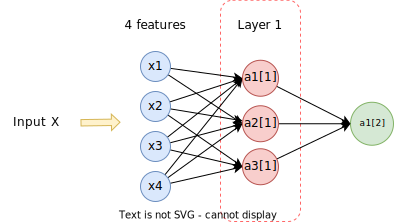
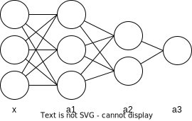

## Architecture

**Input**: Given any input $X$ the first thing we do is flatten it. For example if $X$ is a rgb image of $64 \times 64$, then $X \in \mathbb{R}^{64 \times 64 \times 3}$ (for each of the $64 \times 64$ pixels we have three color channels: red, green, blue), is flattened into a vector in $\mathbb{R}^{(64\*\*64*3) \times 1}$
**Neuron**: is an operation that has two parts:

- Linear part: we denote the linear part like $z^{[i]}$, where $i$ is the current layer.


- Activation part


**Layer**: a layer is a compound of neurons that are not connected with each other.



### Algorithm

The principal steps of the algorithm are:

1. Initialize the weights $w$ and biases $b$ randomly
2. Find the optimal $w, b$
3. Use the optimized $w, b$ to predict the output by using the formula $\hat{y} = \sigma(wx +b)$

### Output Layer

#### Sigmoid

The output layer will be different depending on the problem we are tackling. For example if we want to discriminate between 3 classes then the output layer could be as follows:


So now the output is a vector $\hat{y} \in \mathbb{R}^{c \times 1}$ where $c$ is the number of classes.

#### Softmax

The previous classifier allows for outputting multiples classes in the result, that is we can obtain a predicted output of the form $\hat{y} = \begin{bmatrix} 1 \\ 1 \\ 0 \end{bmatrix}$. What if we want to add a constraint such that only one class can be predicted. Then we use the softmax function as the activation function on the output layer:


Thus, instead of a probability for each class what we obtain is a probability distribution for all the classes.

#### ReLU

On linear regression we do not want the activation function to be linear, because then the whole network becomes a very large linear regression. Instead we use as an activation function the ReLU function (Rectified Linear Unit), whose output is zero if the input value is negative and linear otherwise.


#### Loss Function

The loss function when using the sigmoid function on the output layer is as follows:

$$
\begin{aligned}
\mathcal{L} = - \frac{1}{Q} \sum_{k=1}^Q [y^{(k)} \log(\hat{y}^{(k)}) + (1- y^{(k)})\log(1-\hat{y}^{(k)})]
\end{aligned}
$$

Where $\hat{y}^{(k)}$ are the predicted values and $Q$ is the total number of neurons on the output layer.

However, if we use the softmax function as the activation function on the last layer we have to use a different derivative because this function does depend on the outputs of the other neurons. Thus, we make use of a function called cross entropy loss:

$$
\begin{aligned}
\mathcal{L}_{CE} = - \sum_{k=1}^Q y^{(k)} \log(\hat{y}^{(k)})
\end{aligned}
$$

For linear regression we use as the loss function the L1-Norm or the L2-Norm. The latter is defined as follows:

$$
\begin{aligned}
\mathcal{L} = || \hat{y} - y ||_2^2
\end{aligned}
$$

## Forward Propagation

The forward propagation equations are the following:

$$
\begin{aligned}
z^{[i]} = w^{[i]} a^{[i-1]} + b^{[i]} \tag{1}
\end{aligned}
$$

Where $i$ is the layer with $i \geq 1$, and the first layer equals the input matrix, that is $a^{[0]} = X$. By applying the activation function over $(1)$:

$$
\begin{aligned}
a^{[i]} = g(z^{[i]})
\end{aligned}
$$

Where $g$ is the activation function (e.g $\sigma(z^{[i]})$).

Now, what are the shapes of these matrices?

- $z^{[i]} \in \mathbb{R}^{S_i \times m}$
- $a^{[i]} \in \mathbb{R}^{S_i \times m}$

Where $S_i$ is the number of neurons on the ith layer and $m$ is the number of examples. Note that the shape of the final layer changes depending on the task. So if $K$ is the number of layers:

- In linear regression: $\hat{y} = a^{[K]} \in \mathbb{R}^{1 \times m}$
- In multi-class classification: $\hat{y} = a^{[K]} \in \mathbb{R}^{c \times m}$, where $c$ is the number of classes.

Also the shape of the weights are $w[i] \in \mathbb{R}^{S_i \times S_{i-1}}$, that is, this matrix is compatible with the outputs of the previous layer ($a^{[i-1]} \in \mathbb{R}^{S_{i-1} \times m}$) and the linear part of the next layer ($z^{[i]} \in \mathbb{R}^{S^i \times m}$).

However, the bias are $b^{[i]} \in \mathbb{R}^{S^i \times 1}$, therefore we cannot perform an element wise summation because the shape of $(w^{[i]} a^{[i-1]}) \in \mathbb{R}^{S_i \times m}$ and $b^{[i]}$ are not compatible. To avoid this problem we apply a technique called broadcasting to $b$, such that we replicate $b^{[i]}$ $m$ times:

$$
\begin{aligned}
\hat{b}^{[i]} = \begin{bmatrix}
| &  | & \cdots & | \\
b^{[i]} & b^{[i]} & \cdots & b^{[i]} \\
| & | & \cdots & | \\
\end{bmatrix} \in \mathbb{R}^{S_i \times m}
\end{aligned}
$$

To sum up, the shapes of the data and the parameters on each layer $i$ are:

#### Parameters

$$
\begin{aligned}
\hat{b}^{[i]} = \begin{bmatrix}
| &  | & \cdots & | \\
b^{[i]} & b^{[i]} & \cdots & b^{[i]} \\
| & | & \cdots & | \\
\end{bmatrix} \in \mathbb{R}^{S_i \times m}
\end{aligned}
$$

$$
\begin{aligned}
w^{[i]} = \begin{bmatrix}
| & | & \cdots & | \\
w^{[i](1)} & w^{[i](2)} & \cdots & w^{[i](S_{i-1})} \\
| & | & \cdots & | \\
\end{bmatrix} \in \mathbb{R}^{S_i \times S_{i-1}}
\end{aligned}
$$

#### Outputs

Note that for each example $j$ on layer $i$ $z^{[i](j)} = (w^{[i]} a^{[i-1](j)} + \hat{b}^{[i]})$, then:

$$
\begin{aligned}
z^{[i]} = \begin{bmatrix}
| &  | & \cdots & | \\
z^{[i](1)} & z^{[i](2)} & \cdots & z^{[i](m)} \\
| &  | & \cdots & | \\
\end{bmatrix} \in \mathbb{R}^{S_i \times m}
\end{aligned}
$$

$$
\begin{aligned}
a^{[i]} = \begin{bmatrix}
| &  | & \cdots & | \\
g(z^{[i](1)}) & g(z^{[i](2)}) & \cdots & g(z^{[i](m)}) \\
| &  | & \cdots & | \\
\end{bmatrix} \in \mathbb{R}^{S_i \times m}
\end{aligned}
$$

#### Graphical Representation

Now we present a small example of how forward propagation works on neural networks:


## Optimization Problem

What we want to do is find the parameters $w^{[i]}, b^{[i]}$ for each layer $i$ that minimize the cost.

### Loss Function

So first of all we define a cost function for the objective $\mathcal{L}(\hat{y}, y)$, where $\hat{y}$ is the predicted output and $y$ is the real output. The cost function will depend on the type of problem (classification, regression).

### Optimization

The we optimize the loss function we defined by using backward propagation. For each layer $l=1, \cdots, K$, where $K$ is the number of layers, we apply Batch Gradient Descent (not mandatory, but here it is convenient as we can vectorize the derivatives) as follows:

$$
\begin{aligned}
w^{[l]} = w^{[l]} - \alpha \frac{\delta \mathcal{L}(\hat{y}, y)}{\delta w^{[l]}}
\end{aligned}
$$

$$
\begin{aligned}
b^{[l]} = b^{[l]} - \alpha \frac{\delta \mathcal{L}(\hat{y}, y)}{\delta b^{[l]}}
\end{aligned}
$$

### Back-propagation

To compute the derivatives of the cost function with respect to $w^{[l]}$ and $b^{[l]}$ we use the chain rule.

#### Output Layer

Suppose we have $K$ layers, then we start by calculating $\frac{\delta \mathcal{L}(\hat{y}, y)}{\delta w^{[K]}}$ and $\frac{\delta \mathcal{L}(\hat{y}, y)}{\delta b^{[K]}}$, that is, the derivatives on the last layer. Thus, to update $w^{[K]}$ (we apply the same logic for $b^{[K]}$):

$$
\begin{aligned}
\frac{\delta \mathcal{L}(\hat{y}, y)}{\delta w^{[K]}} = \sum_{i=1}^m \frac{\delta \mathcal{L}(\hat{y^{(i)}}, y^{(i)})}{\delta w^{[K]}} =
\end{aligned}
$$

Because $\hat{y^{(i)}} = (a^{[K]})^{(i)}$:

$$
\begin{aligned}
 = \sum_{i=1}^m \frac{\delta \mathcal{L}((a^{[K]})^{(i)}, y^{(i)})}{\delta w^{[K]}}
\end{aligned}
$$

We apply the chain rule on the derivative, therefore:

$$
\begin{aligned}
 = \sum_{i=1}^m \frac{\delta \mathcal{L}((a^{[K]})^{(i)}, y^{(i)})}{\delta (a^{[K]})^{(i)}} \frac{\delta (a^{[K]})^{(i)}}{\delta w^{[K]}}
\end{aligned}
$$

Because $(a^{[K]})^{(i)} = g((z^{[K]})^{(i)})$, where $g$ is the activation function:

$$
\begin{aligned}
 = \sum_{i=1}^m \frac{\delta \mathcal{L}((a^{[K]})^{(i)}, y^{(i)})}{\delta (a^{[K]})^{(i)}} \frac{\delta g((z^{[K]})^{(i)})}{\delta w^{[K]}}
\end{aligned}
$$

We apply the chain rule on the last derivative, therefore:

$$
\begin{aligned}
 = \sum_{i=1}^m \frac{\delta \mathcal{L}((a^{[K]})^{(i)}, y^{(i)})}{\delta (a^{[K]})^{(i)}} \frac{\delta g((z^{[K]})^{(i)})}{\delta (z^{[K]})^{(i)}} \frac{\delta (z^{[K]})^{(i)}}{\delta w^{[K]}}
\end{aligned}
$$

#### Hidden Layers

What about the previous layer $K-1$?

$$
\begin{aligned}
\frac{\delta \mathcal{L}(\hat{y}, y)}{\delta w^{[K-1]}} = \sum_{i=1}^m \frac{\delta \mathcal{L}(\hat{y^{(i)}}, y^{(i)})}{\delta w^{[K-1]}} =
\end{aligned}
$$

Because $\hat{y^{(i)}} = (a^{[K]})^{(i)}$:

$$
\begin{aligned}
 = \sum_{i=1}^m \frac{\delta \mathcal{L}((a^{[K]})^{(i)}, y^{(i)})}{\delta w^{[K-1]}}
\end{aligned}
$$

We apply the chain rule on the derivative, therefore:

$$
\begin{aligned}
 = \sum_{i=1}^m \frac{\delta \mathcal{L}((a^{[K]})^{(i)}, y^{(i)})}{\delta (a^{[K]})^{(i)}} \frac{\delta (a^{[K]})^{(i)}}{\delta w^{[K-1]}}
\end{aligned}
$$

Because $(a^{[K]})^{(i)} = g((z^{[K]})^{(i)})$, where $g$ is the activation function:

$$
\begin{aligned}
 = \sum_{i=1}^m \frac{\delta \mathcal{L}((a^{[K]})^{(i)}, y^{(i)})}{\delta (a^{[K]})^{(i)}} \frac{\delta g((z^{[K]})^{(i)})}{\delta w^{[K-1]}}
\end{aligned}
$$

We apply the chain rule on the last derivative, therefore:

$$
\begin{aligned}
 = \sum_{i=1}^m \frac{\delta \mathcal{L}((a^{[K]})^{(i)}, y^{(i)})}{\delta (a^{[K]})^{(i)}} \frac{\delta g((z^{[K]})^{(i)})}{\delta (z^{[K]})^{(i)}} \frac{\delta (z^{[K]})^{(i)}}{\delta w^{[K-1]}}
\end{aligned}
$$

$$
\begin{aligned}
 = \sum_{i=1}^m \frac{\delta \mathcal{L}((a^{[K]})^{(i)}, y^{(i)})}{\delta (a^{[K]})^{(i)}} \frac{\delta (a^{[K]})^{(i)}}{\delta (z^{[K]})^{(i)}} \frac{\delta (z^{[K]})^{(i)}}{\delta w^{[K-1]}}
\end{aligned}
$$

As you can see the first two derivatives are the same as the derivatives on the layer $K$, let's denote $(\Delta^{[K]})^{(i)} = \frac{\delta \mathcal{L}((a^{[K]})^{(i)}, y^{(i)})}{\delta (a^{[K]})^{(i)}} \frac{\delta (a^{[K]})^{(i)}}{\delta (z^{[K]})^{(i)}}$ the accumulated gradient on layer $K$ for example $i$, then:

$$
\begin{aligned}
 = \sum_{i=1}^m (\Delta^{[K]})^{(i)} \frac{\delta (z^{[K]})^{(i)}}{\delta w^{[K-1]}}
\end{aligned}
$$

Because $(z^{[K]})^{(i)} = w^{[K]} (a^{[K-1]})^{(i)} + b^{[k]}$:

$$
\begin{aligned}
 = \sum_{i=1}^m (\Delta^{[K]})^{(i)} \frac{\delta (w^{[K]} (a^{[K-1]})^{(i)} + b^{[k]})}{\delta w^{[K-1]}}
\end{aligned}
$$

$$
\begin{aligned}
 = \sum_{i=1}^m (\Delta^{[K]})^{(i)} \frac{\delta (z^{[K-1]})^{(i)}}{\delta (a^{[K-1]})^{(i)}} \frac{\delta (a^{[K-1]})^{(i)}}{\delta w^{[K-1]}}
\end{aligned}
$$

Because $(a^{[K-1]})^{(i)} = g((z^{[K-1]})^{(i)})$

$$
\begin{aligned}
 = \sum_{i=1}^m (\Delta^{[K]})^{(i)} \frac{\delta (z^{[K-1]})^{(i)}}{\delta (a^{[K-1]})^{(i)}} \frac{\delta g((z^{[K-1]})^{(i)})}{\delta (z^{[K-1]})^{(i)}} \frac{\delta (z^{[K-1]})^{(i)}}{\delta w^{[K-1]}}
\end{aligned}
$$

We apply the chain rule on the last derivative, hence:

$$
\begin{aligned}
 = \sum_{i=1}^m (\Delta^{[K]})^{(i)} \frac{\delta (z^{[K-1]})^{(i)}}{\delta (a^{[K-1]})^{(i)}} \frac{\delta g((z^{[K-1]})^{(i)})}{\delta (z^{[K-1]})^{(i)}} \frac{\delta (z^{[K-1]})^{(i)}}{\delta w^{[K-1]}}
\end{aligned}
$$

$$
\begin{aligned}
 = \sum_{i=1}^m (\Delta^{[K]})^{(i)} \frac{\delta (z^{[K-1]})^{(i)}}{\delta (a^{[K-1]})^{(i)}} \frac{\delta (a^{[K-1]})^{(i)}}{\delta (z^{[K-1]})^{(i)}} \frac{\delta (z^{[K-1]})^{(i)}}{\delta w^{[K-1]}}
\end{aligned}
$$

### Vectorization

#### Output Layer

1. Accumulated gradient for layer $K$: $\Delta_w^{[K]} = \frac{\delta \mathcal{L}(\hat{y}, y)}{\delta a^{[K]}} \frac{\delta a^{[K]}}{\delta z^{[K]}}$
2. Gradient for layer $K$: $\frac{\delta \mathcal{L}(\hat{y}, y)}{\delta w^{[K]}} = \Delta_w^{[K]} \frac{\delta z^{[K]}}{\delta w^{[K]}}$

#### Hidden Layer

1. Accumulated gradient for layer $K-1$: $\Delta_w^{[K-1]} = \Delta_w^{[K]} \frac{\delta z^{[K]}}{\delta a^{[K-1]}} \frac{\delta a^{[K-1]}}{\delta z^{[K-1]}}$
2. Gradient for layer $K-1$: $\frac{\delta \mathcal{L}(\hat{y}, y)}{\delta w^{[K-1]}} = \Delta_w^{[K-1]} \frac{\delta z^{[K-1]}}{\delta w^{[K-1]}}$

### Graphical Representation

On the following image we show how to obtain the gradient of the first element of the first layer's first neuron's weights $w^{[1]}_{11}$ on the first layer:


## Improving a Neural Network

### Activation Functions

Why do we need activation functions? Well, suppose you have the following network where the activation function is the identity function. That is $a^{[i]} = g(z^{[i]}) = z^{[i]}$:



Then:

$$
\begin{aligned}
\hat{y} = a^{[3]} = z^{[3]} = w^{[3]} a^{[2]} + b^{[3]} = w^{[3]} z^{[2]} + b^{[3]} = w^{[3]} (w^{[2]} a^{[1]} + b^{[2]}) + b^{[3]}
\end{aligned}
$$

$$
\begin{aligned}
= w^{[3]} (w^{[2]} z^{[1]} + b^{[2]}) + b^{[3]} = w^{[3]} (w^{[2]} (w^{[1]} x + b^{[1]}) + b^{[2]}) + b^{[3]}
\end{aligned}
$$

$$
\begin{aligned}
= w^{[3]} (w^{[2]} w^{[1]} x + w^{[2]} b^{[1]} + b^{[2]}) + b^{[3]}
\end{aligned}
$$

$$
\begin{aligned}
= w^{[3]} w^{[2]} w^{[1]} x + w^{[3]} w^{[2]} b^{[1]} + w^{[3]} b^{[2]} + b^{[3]}
\end{aligned}
$$

If

$$
\begin{aligned}
W = w^{[3]} w^{[2]} w^{[1]}
\end{aligned}
$$

$$
\begin{aligned}
B = w^{[3]} w^{[2]} b^{[1]} + w^{[3]} b^{[2]} + b^{[3]}
\end{aligned}
$$

Then:

$$
\begin{aligned}
\hat{y} = WX + B
\end{aligned}
$$

As you can see if we do not use activation functions, it does not mater how deep your network is, it is going to be equivalent to a linear regression.

Depending on the task at hand we use different activation functions:

- Sigmoid: $\sigma(z) = \frac{1}{1 + e^{-z}}$, it maps $z \in (-\infty, \infty)$ to $(0, 1)$
  - It is good for classification
  - Works well when the values are in the linear region of the function
  - However when the values are on the extremes the gradient (slope) is very small, therefore it ends up vanishing in the network.


- ReLU: $ReLU(z) = \begin{cases}0 & z \leq 0 \\ 1 & z > 0\end{cases}$
- tanh: $tanh(z) = \frac{e^z - e^{-z}}{(e^z + e^{-z})}$

### Initialization Techniques

Usually we normalize the input to avoid having saturated activation functions. To normalize:

$$
\begin{aligned}
x^{(i)}_j = \frac{x^{(i)}_j - \mu_j}{\sigma_j}
\end{aligned}
$$

For every example $i$ and feature $j$. Where:

- $\mu_j$ is the mean of the $j$ feature, thus: $\mu_j = \frac{1}{m} \sum_{i=1}^m x^{(i)}_j$
- $\sigma_j^2$ is the variance of the $j$ feature, thus: $\sigma_j^2 = \frac{1}{m} \sum_{i=1}^m (x^{(i)}_j - \mu_j)^2$

### Vanishing/Exploding Gradients

Suppose you have the following network, where the activation function is the identity function and $b=0$.


Then $\hat{y} = w^{[L]} a^{[L-1]} = w^{[L]} w^{[L-1]} a^{[L-2]} = \cdots = w^{[L]} w^{[L-1]} \cdots w^{[1]} x$

Therefore, if:

$$
\begin{aligned}
w^{[L]} = \begin{bmatrix}
1.5 & 0 \\
0 & 1.5 \\
\end{bmatrix}
\end{aligned}
$$

then:

$$
\begin{aligned}
\hat{y} = \begin{bmatrix}
1.5^L & 0 \\
0 & 1.5^L \\
\end{bmatrix}
\end{aligned}
$$

Which means we end up with an exploding gradient. The inverse happens when:

$$
\begin{aligned}
w^{[L]} = \begin{bmatrix}
0.5 & 0 \\
0 & 0.5 \\
\end{bmatrix}
\end{aligned}
$$

then:

$$
\begin{aligned}
\hat{y} = \begin{bmatrix}
0.5^L & 0 \\
0 & 0.5^L \\
\end{bmatrix}
\end{aligned}
$$

Which results in a vanishing gradient.

To avoid this somewhat, we need to initialize the weights properly. What we want is for the weights to be very close to one to avoid the exploding/diminishing problem.

#### Intuition

Given a single neuron:


Then $a = g(z)$ and $z = w_1 x_1 + \cdots + w_n x_n$. We can see that $z$ will increase if $n$ increases, therefore we would want $w_i$ to be as small as $n$ is large, that is:

$$
\begin{aligned}
w_i = \frac{1}{n}
\end{aligned}
$$

#### Initialization Techniques

- If we want the value of $w^{[L]}$ to be proportional to the number of inputs coming from the layer $L$ ($n^{[L-1]}$). It works very well for sigmoid activation:

```python
w[k] = np.random.randn(shape)*np.sqrt(1/n[L-1])
```

- For ReLU:

```python
w[k] = np.random.randn(shape)*np.sqrt(2/n[L-1])
```

- Xavier initialization (used with tanh): $w^{[L]} \sim \sqrt{\frac{1}{n^{[L-1]}}}$
- Her initialization: $w^{[L]} \sim \sqrt{\frac{2}{n^{[L]} + n^{[L-1]}}}$

Also you need to initialize the weights randomly, else you will run into the symmetry problem, where all neurons learn the same thing (that is they update very similarly).

### Optimization

#### Mini Batch Gradient Descent

Mini Batch Gradient Descent is a trade off between batch gradient descent and stochastic gradient descent. Also, because Mini Batch Gradient Descent is an approximation it introduces some noise on the loss function:


However Mini Batch Gradient Descent is more used because Batch Gradient Descent can be very computationally expensive.

#### Momentum Algorithm

This algorithm combines Gradient Descent and momentum. Suppose you have the following contour plot, where the horizontal axis is much more extended that the vertical axis. By default on Gradient Descent the gradient of the loss will be orthogonal to the contour at the given point, as we can see:


However, what we would like, so it would converge faster, is to make it move more horizontally than vertically. In order to do that we use a technique called momentum. It takes intro account past updates to find the right way to go. If you take an average of past updates, then:

- Vertical axis: it practically cancels itself because it oscillates a lot
- Horizontal axis: its value it's maintained because the past and present gradients go in the same direction


To update the weights we apply the following equation:

$$
\begin{aligned}
\upsilon = \beta \upsilon + (1 - \beta) \frac{\delta \mathcal{L}(\hat{y}, y)}{\delta w}
\end{aligned}
$$

Where:

- $\upsilon$: stores past updates
- $\frac{\delta \mathcal{L}(\hat{y}, y)}{\delta w}$: stores the current update
- We average with $\beta$ and $(1 - \beta)$

Finally we update the weights:

$$
\begin{aligned}
w = w - \alpha \upsilon
\end{aligned}
$$

## Gradient Checking

Consiste en la estimación numérica de los gradientes, tal que:

$$
\begin{aligned}
\frac{\delta J(\Theta)}{\delta \Theta} \approx \frac{J(\Theta - \epsilon) - J(\Theta + \epsilon)}{2 \cdot \epsilon}
\end{aligned}
$$

$$
\begin{aligned}
\frac{\delta J(\Theta)}{\delta \theta_j} \approx \frac{J(\theta_0, ..., \theta_j - \epsilon, ..., \theta_n) - J(\theta_0, ..., \theta_j + \epsilon, ..., \theta_n)}{2 \cdot \epsilon}
\end{aligned}
$$


## Inicialización aleatoria

Cuando creamos una red neuronal, si inicializamos todos los pesos $\theta$ a cero, entonces todos los nodos serán iguales. Por ello se inicializa $\theta$ con valores aleatorios dentro de un rango $[- \epsilon, \epsilon]$

## Anexo

For more info about cost function and how to derive them:

[Anexo](../05_appendix)
