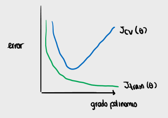
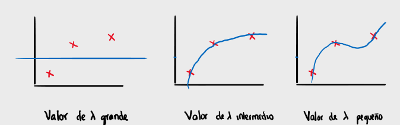

## Separación de datos

A la hora de entrenar un modelo, separamos los datos en dos conjuntos:

- Conjunto de entrenamiento: $70\%$ - $80\%$
- Conjunto de test: $30\%$ - $20\%$

## Entrenamiento en regresión lineal

El proceso de entrenamiento en la regresión lineal consiste en:

- Entrenar el modelo sobre el conjunto de entrenamiento y obtener la matriz de pesos $\Theta$ minimizando el coste $J(\Theta)$
- Calcular el coste sobre el conjunto de test $J_{test}(\Theta)$

$$
J_{test}(\Theta) = \frac{1}{2m} \sum_{i=1}^{m_{test}} (h*\Theta(x^{(i)}*{test}) - y^{(i)}\_{test})^2
$$

## Entrenamiento en regresión logística

El proceso de entrenamiento en la regresión logística consiste en:

- Entrenar el modelo sobre el conjunto de entrenamiento y obtener la matriz de pesos $\Theta$ minimizando el coste $J(\Theta)$
- Calcular el coste sobre el conjunto de test $J_{test}(\Theta)$

$$
J_{test}(\Theta) = - \frac{1}{m} \sum_{i=1}^{m_{test}} \left[y^{(i)}_{test} \log(h_\Theta(x^{(i)}_{test})) + (1-y^{(i)}_{test})\log(1-h_\Theta(x^{(i)}_{test})) \right]
$$

El error de clasificación en la regresión logística se define como sigue:

$$
\begin{aligned}
error(h_\Theta(x), y) =
\begin{cases}
1, & \text{ si } h_\Theta(x) \geq 0.5 \rightarrow \log(h_\Theta(x)) = 1 \text{ e } y = 0 \\
1, & \text{ si } h_\Theta(x) < 0.5 \rightarrow \log(h_\Theta(x)) = 0 \text{ e } y = 1 \\
0, \text{ en cualquier otro caso } \\
\end{cases}
\end{aligned}
$$

## Selección de modelos

Supongamos que tenemos $n$ modelos, tal que cada modelo es equivalente al anterior pero con una característica más en sus datos:

- Modelo 1: $h_\Theta(x) = \theta_0 + \theta_1 \cdot x_1$
- Modelo 2: $h_\Theta(x) = \theta_0 + \theta_1 \cdot x_1 + \theta_2 \cdot x_2$
- Modelo n: $h_\Theta(x) = \theta_0 + \theta_1 \cdot x_1 + \theta_2 \cdot x_2 + \cdots + \theta_n \cdot x_n$

Para evaluar los modelos lo que hacemos es escoger el que menor coste obtenga sobre el conjunto de test, tras ser entrenado sobre el conjunto de entrenamiento.

$$
\begin{aligned}
\begin{bmatrix}
\Theta^{(1)} \\
\Theta^{(2)} \\
\vdots \\
\Theta^{(n)} \\
\end{bmatrix} \rightarrow
\begin{bmatrix}
J_{test}(\Theta^{(1)}) \\
J_{test}(\Theta^{(2)}) \\
\vdots \\
J_{test}(\Theta^{(n)}) \\
\end{bmatrix}
\end{aligned}
$$

Sin embargo, se puede dar el **problema** de que el mejor simplemente produzca overfitting sobre el conjunto de test (lo cual es probable cuando el vector de pesos tiene dimensiones grandes). Para solventar este problema:

### Cross Validation

Separaremos el conjunto de datos en tres conjuntos:

- Conjunto de entrenamiento: $60\%$
- Conjunto de validación cruzada (Cross validation): $20\%$
- Conunto de test: $20\%$

Por lo tanto ahora la función de coste para cada conjunto tiene la forma:

- Función de coste para el conjunto de entrenamiento:
  $$
  \begin{aligned}
  J_{train}(\Theta) = \frac{1}{2m_{train}} \sum_{i=1}^{m_{train}} error(h_\Theta(x^{(i)}), y^{(i)})
  \end{aligned}
  $$
- Función de coste para el conjunto de test:
  $$
  \begin{aligned}
  J_{test}(\Theta) = \frac{1}{2m_{test}} \sum_{i=1}^{m_{test}} error(h_\Theta(x^{(i)}), y^{(i)})
  \end{aligned}
  $$
- Función de coste para el conjunto de validación cruzada:
  $$
  \begin{aligned}
  J_{cv}(\Theta) = \frac{1}{2m_{cv}} \sum_{i=1}^{m_{cv}} error(h_\Theta(x^{(i)}), y^{(i)})
  \end{aligned}
  $$

#### Proceso de selección

Entonces ahora para seleccionar un modelo lo que hacemos que para cada modelo $q$:

1. Minimizamos $J_{train}(\Theta^{(q)})$ para obtener los pesos $\Theta^{(q)}$ óptimos.
2. Calculamos el coste sobre el conjunto de validación cruzada $J_{cv}(\Theta^{(q)})$

Una vez hecho esto para todos, escogemos el modelo que ofrezca el mejor coste sobre el conjunto de validación cruzada y calculamos $J_{test}(\Theta^{(q)})$ para evaluar la capacidad de generalización del modelo.

## Diagnóstico: Sesgo vs Varianza

- Underfitting: cuando se produce underfitting el coste de entrenamiento y el coste de validación tienen valores similares y ambos tiene valores bastante altos
- Overfitting: cuando se produce overfitting el coste de entrenamiento es mucho menor que el coste de validación cruzada.

## Regresión lineal con regularización

También es importante observar cómo afecta el parámetro de regularización a nuestros modelos. Por ejemplo, en la regresión linear, la función de coste tiene la forma:

$$
\begin{aligned}
J(\Theta) = \frac{1}{2m}\sum_{j=1}^m (h_\Theta(x_j) - y_j)^2 + \frac{1}{2m} \lambda \sum_{i=1}^n \theta_i^2
\end{aligned}
$$

Por lo tanto, el aumentar o reducir $\lambda$ es directamente proporcional al coste.

- Si el parámetro de regularización $\lambda$ es muy grande entonces los pesos van a tender a ser muy pequeños (ya que el coste aumenta al aumentar el valor de $\lambda$)
- Si el parámetro de regularización $\lambda$ es muy pequeño entonces los pesos van a poder ser grandes (ya que el coste se reduce al reducir el valor de $\lambda$)

### Escoger el parámetro de regularización

Para escoger el parámetro de regularización seguimos el mismo proceso que para escoger el mejor modelo, para cada modelo $q$:

1. Minimizamos $J_{train}(\Theta^{(q)})$ para obtener los pesos $\Theta^{(q)}$ óptimos.
2. Calculamos el coste sobre el conjunto de validación cruzada $J_{cv}(\Theta^{(q)})$

Una vez hecho esto para todos, escogemos el modelo que ofrezca el mejor coste sobre el conjunto de validación cruzada y calculamos $J_{test}(\Theta^{(q)})$ para evaluar la capacidad de generalización del modelo.

## Curva de aprendizaje

A continuación vamos a estudiar cómo afecta el tamaño del conjunto de datos $m$, el sesgo y la varianza a nuestro modelo:

- Cuanto mayor es el tamaño, más difícil es encontrar una hipótesis que se adapte ($J_{train}(\Theta)$ es mayor), pero el modelo generaliza mejor ($J_{cv}(\Theta)$ es menor)

- Cuando el sesgo (bias) es grande, entonces se produce underfitting y las predicciones de nuestro modelo son malas:
  - El error del modelo es elevado, tanto sobre el conjunto de entrenamiento como sobre el conjunto de validación cruzada
  - Tener más ejemplos ayuda al modelo
- Cuando la varianza (variance) es grande, entonces se produce overfitting, tal que el error en el conjunto de validación cruzada es muy alto:
  - El modelo se adapta al conjunto de datos, por lo que el error de entrenamiento es menor
  - Tener más muestras ayuda al modelo

## Debugging un algoritmo de aprendizaje

Para arreglar el overfitting que se produce cuando la varianza es elevada:

- Obtener más datos de entrenamiento
- Utilizar menos características (reducir el grado del vector de pesos), pero tras un proceso de selección de aquellas más relevantes
- Intentar aumentar el parámetro de regularización

Para arregar el underfitting que se produce cuando el sesgo es elevado:

- Añadir más características
- Añadir características polinómicas
- Intentar reducir el parámetro de regularización

En las redes neuronales:

- Las redes pequeñas tienden a producir underfitting pero son menos costosas computacionalmente
- Las redes grandes tienen más características, por lo tanto hay una mayor probabilidad de overfitting

Gestionar datos sesgados:

- Hay que ser consciente que a veces, por ejemplo en problemas de clasificación, hay categorías que con más comunes que el resto

## Medidas de evaluación

La precisión y el recall son medidas de evaluación que se complementan:

|            |     | Resultado               | Resultado               |
| ---------- | --- | ----------------------- | ----------------------- |
|            |     | 1                       | 0                       |
| Predicción | 1   | Verdadero positivo (TP) | Falso positivo (FP)     |
| Predicción | 0   | Falso negativo (FN)     | Verdadero negativo (TN) |

- Precisión

  $$
  \frac{TP}{\text{ \# positivos predichos }} = \frac{TP}{TP + FP}
  $$

- Recall

$$
\frac{TP}{\text{ \# positivos reales }} = \frac{TP}{TP + FN}
$$

### Balance entre precisión y recall

Cuánto mayor es la precisión menor es el recall y viceversa. Entonces

- Si queremos un modelo más preciso:

$$
\begin{aligned}
\begin{cases}
\text{Predecir } 1, \text{ si } h_\Theta(x) \geq 0.7 \\
\text{Predecir } 0, \text{ si } h_\Theta(x) < 0.7 \\
\end{cases}
\end{aligned}
$$

Entonces, la precisión es mayor ya que el número de $FP$ es menor, pero el recall es menor, ya que el número de $FN$ es mayor.

- Lo mismo pasa si queremos evitar falsos negativos, entonces hacemos:

$$
\begin{aligned}
\begin{cases}
\text{Predecir } 1, \text{ si } h_\Theta(x) \geq 0.5 \\
\text{Predecir } 0, \text{ si } h_\Theta(x) < 0.5 \\
\end{cases}
\end{aligned}
$$

Tal que se reduce el número de $FN$, y se aumenta el recall, pero el número de $FP$ es mayor, por lo que se reduce la precisión.

Entonces, para encontrar un punto de balance entre las dos medidas tenemos que seleccionar un valor límite, tal que hacemos la predicción en base a $h_\Theta(x) \geq \text{ limite }$.

Para calibrar ese límite podemos utilizar dos métricas de evaluación:

1. La media de ambas métricas: $\frac{P + R}{2}$, funciona mal cuando $P >> R$ o $R >> P$, ya que el valor va a ser alto, pero no se ha encontrado un equilibrio.
2. La puntuación $F_1 = 2 \cdot \frac{P\cdot R}{(P + R)}$, tal que cuanto mayor sea esta puntuación mejor
3. Ahora
   $$
     \begin{cases}
       F_1 \approx 0, && P >> R \\
       F_1 \approx 0, && R >> P \\
     \end{cases}
   $$

Para escoger el límite lo que se hace es calcular la puntuación $F_1$ sobre el conjunto de validación cruzada, y se escoge aquel límite que ofrezca la mayor puntuación.
