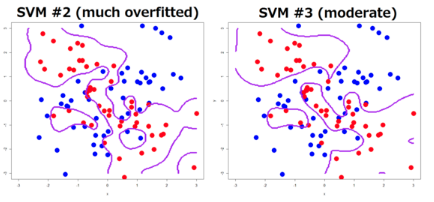
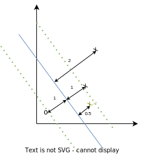
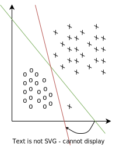

## Notation

- Labels: $y^{(i)} \in \{-1, +1\}$
- Now the hypothesis outputs a $1$ or a $-1$, which means:

$$
\begin{aligned}
g(z) =
\begin{cases}
1, & \text{ if } z \geq 0 \\
0, & \text{ otherwise } \\
\end{cases}
\end{aligned}
$$

That is, now instead of a smooth transition of probabilities from zero to one, we have a hard transition between $1$ and $-1$.

- Weights: now the weights $\Theta \in \mathbb{R}^{(n+1)}$, where $\theta_0 = 1$ are divided into: $w \in \mathbb{R}^{(n)}$ and $b \in \mathbb{R}$. Thus we drop the convention of assigning $x_0 = 1$.
- Also now the hypothesis function is defined as: $h_{w,b}(x) = g(w^Tx + b) = g((\sum_{i=1}^n w_i x) + b)$

## Functional Margin

### Intuition

The **Functional Margin** describes how accurately do we classify an example. For example, for binary classification, given an example x:

$$
\begin{aligned}
h_\Theta(x) = g(\Theta x) =
\begin{cases}
\text{ predict } 1 & \text{ if } \Theta^T x \geq 0, \text{ that is } h_\Theta(x)=g(\Theta x) \geq 0.5\\
\text{ predict } 0 & \text{ otherwise } \\
\end{cases}
\end{aligned}
$$

Let's distinguish between the two cases when classifying an example $x^{(i)}$:

- (1) If $y^{(i)} = 1$, then we want $h_\Theta(x) = g(\Theta x) \approx 1$, which means we want $\Theta \cdot x >> 0$.
- (2) If $y^{(i)} = 0$, then we want $h_\Theta(x) = g(\Theta x) \approx 0$, which means we want $\Theta \cdot x << 0$.

As we can see in the following graph, the bigger $z = \Theta x$ the closer $g(z)$ is to one and vice versa.

### Formal Definition

The functional margin of the hyperplane defined by $(w, b)$ with respect to the example $(x^{(i)}, y^{(i)})$ is defined as:

$$
\begin{aligned}
\hat{\gamma}^{(i)} = y^{(i)}(w^Tx^{(i)}+b)
\end{aligned}
$$

So, if we modify slightly the two statements above and use the new notation for SVMs:

- If $y^{(i)} = 1$, then we want $w^T \cdot x + b >> 0$.
- If $y^{(i)} = 0$, then we want $w^T \cdot x + b << 0$.

The combination of these two declarations yields the definition of the functional margin. Why?, well:

- When $y^{(i)}$ is positive, we want to have $w^Tx^{(i)} + b >> 0$ by (1), so $\hat{\gamma}^{(i)}$ will be large, because both values are positive
- When $y^{(i)}$ is negative, we want to have $w^Tx^{(i)} + b << 0$ by (2), so $\hat{\gamma}^{(i)}$ will be large, because both values are negative

So, given an example $x^{(i)}$, if $\hat{\gamma}^{(i)} > 0$ that means either

- $y^{(i)} = 1$ and $w^Tx + b > 0$ or
- $y^{(i)} = -1$ and $w^Tx + b < 0$

which shows that the classification is correct.

### Evaluation

To evaluate the functional margin with respect to the training set we make use of the worst case notion:

$$
\begin{aligned}
\hat{\gamma} = \underset{i}{\min} \hat{\gamma}^{(i)}
\end{aligned}
$$

That is, we evaluate how well we are doing in the worst example.

### Normalizing the Functional Margin

Note that the functional margin is very easy to cheat (to increase its value with any meaningful change to the decision boundary). Given our definition for $g$:

$$
\begin{aligned}
g = \begin{cases}
1, & \text{ if } z \geq 0 \\
-1, & \text{ otherwise }
\end{cases}
\end{aligned}
$$

It follows that $h_{w,b}(x^{(i)}) = g(2w^Tx^{(i)} + 2b) = g(w^Tx^{(i)} + b)$, because what matters is the sign, not the magnitude.

However, if you scale $w$ and $b$ by a factor of $n$ where $n$ is a positive number then $\gamma $ increases because:

$$
\begin{aligned}
\hat{\gamma}^{(i)} = (w^Tx + b)
\end{aligned}
$$

so,

$$
\begin{aligned}
n \cdot \hat{\gamma}^{(i)} = n \cdot (w^Tx + b)
\end{aligned}
$$

where,

$$
\begin{aligned}
\hat{\gamma}^{(i)} < n \cdot \hat{\gamma}^{(i)}
\end{aligned}
$$

One way to avoid this is to normalize the length of the parameters, that is either:

- Add a constraint where $||w|| = 1$ or
- Set $(w, b)$ to be $(\frac{w}{||w||}, \frac{b}{||b||})$

In both cases we are re-scaling the parameters.

## Geometric Margin

### Intuition

First of all, let's assume we have a dataset that is linearly separable like:

Here we have two examples of two decision boundaries that do classify correctly all of the samples. However the red one looks worse than the green one.

That is because for the red one there are some examples that are very close to the boundary compared to the rest. Whereas for the green one there is a bigger separation.

So, first we define a line by the equation $w^Tx + b = 0$, therefore:

- every example $x$ that lies to the left of the line satisfies $w^Tx + b < 0$ and
- every example $x$ that lies to the right of the line satisfies $w^Tx + b > 0$

Furthermore the geometric margin with respect to a single example $(x^{(i)}, y^{(i)})$ is the euclidean distance between the point $(x^{(i)}, y^{(i)})$ and the line we have defined as $w^Tx + b = 0$.

### Euclidean distance to the decision boundary

The decision boundary corresponding to (w, b) is shown, along with the vector w. Note that w is orthogonal (at 90º) to the separating hyperplane.

Consider the point at $A$, which represents the example $x^{(i)}$ with $y^{(i)} = 1$. Its distance to the decision boundary, denoted by $\gamma^{(i)}$, is given by the line segment $AB$.

How do we find $\gamma^{(i)}$:

- We know $\frac{w}{||w||}$ is a unit length vector pointing to the same direction as $w$.
- Also $A = x^{(i)}$

We also know that the vector between points $A$ and $B$ is defined like $A - B$, in this scenario, $A - B = \gamma^{(i)}\frac{w}{||w||}$, where $\gamma^{(i)}$ is the length of the vector and $\frac{w}{||w||}$ is the direction of the vector.

- Thus if we solve for $B$, $B = x^{(i)} - \gamma^{(i)}\frac{w}{||w||}$
- Furthermore, $B$ lies on the decision boundary, therefore:

$$
\begin{aligned}
w^T(B) + b = 0 \rightarrow w^T\left(x^{(i)} - \gamma^{(i)}\frac{w}{||w||}\right) + b = 0
\end{aligned}
$$

Solving for $y^{(i)}$ yields:

$$
\begin{aligned}
\gamma^{(i)} = \frac{w^Tx^{(i)} + b}{||w||} = \left(\frac{w}{||w||}\right)^Tx(i) + \frac{b}{||w||}
\end{aligned}
$$

### Formal definition

The geometric margin of the hyperplane $(w, b)$ with respect to $(x^{(i)}, y^{(i)})$ is defined as:

$$
\begin{aligned}
\gamma^{(i)} = \frac{w^T x^{(i)} + b}{||w||}
\end{aligned}
$$

This is the definition for a positive example ($y^{(i)} = 1$), and measures the euclidean distance from the decision boundary to the example $(x^{(i)}, y^{(i)})$.

If we generalize, as to compute the geometric margin for both positive and negative examples:

$$
\begin{aligned}
\gamma^{(i)} = \frac{y^{(i)} (w^T x^{(i)} + b)}{||w||}
\end{aligned}
$$

### Evaluation

To evaluate the geometric margin with respect to the training set we make use of the worst case notion:

$$
\begin{aligned}
\gamma = \underset{i}{\min} \gamma^{(i)}
\end{aligned}
$$

That is, we evaluate how well we are doing in the worst example.

## Relationship between Functional Margin and Geometric Margin

As you may have picked up we can stablish an equality between both margins:

$$
\begin{aligned}
\gamma^{(i)} = \frac{\hat{\gamma}^{(i)}}{||w||}
\end{aligned}
$$

## Optimal Margin Classifier

### Train the Classifier

To train the `SVM` we have to solve the optimization problem for $\alpha$

### Classify an example

To predict an example $x$:

$$
\begin{aligned}
h_{w,b} = g(w^Tx + b) = g\left(\left(\sum_{i=1}^m \alpha_i y^{(i)}x^{(i)}\right)^Tx + b\right) = g\left(\left(\sum_{i=1}^m \alpha_i y^{(i)} \langle x^{(i)}, x^{(j)} \rangle\right) + b\right)
\end{aligned}
$$

## SVM

### Kernels

#### Kernel Trick

To apply kernels first we will lay out the kernel trick:

- Write the algorithm in terms of the inner products of the training examples $\langle x^{(i)}, x^{(j)} \rangle=(\langle x, z \rangle)$
- Let there be a mapping $x \rightarrow \phi(x)$, where $\phi(x)$ is a high dimensional feature vector.
- Find a way to compute $K(x, z) = \phi(x)^T\phi(z)$, even if $x, z$ are very high dimensional features vectors (which would be very computationally expensive). Where $K(x, z)$ is denoted as the kernel function
- Replace $\langle x, z \rangle$ with $K(x, z)$

#### Applying Kernels

- Given $x, z \in \mathbb{R}^n$, where:

$$
\begin{aligned}
x = \begin{bmatrix}
x_1 \\
\vdots \\
x_n \\
\end{bmatrix}
\end{aligned}
$$

We define the mapping $\phi(x) \in \mathbb{R}^{n^2}$ as follows:

$$
\begin{aligned}
\phi(x) = \begin{bmatrix}
x_ix_i \\
\end{bmatrix}
\end{aligned}
$$

$\forall i, j$ with $1 \leq i,j \leq n$

So we have

$$
\begin{aligned}
K(x, z) = \phi(x)^T \phi(z) = \sum_{i=1}^{n^2} \phi(x)_i \phi(z)_i = \sum_{i=1}^n \sum_{j=1}^n (x_ix_j) (z_iz_j)
\end{aligned}
$$

Which would take $O(n^2)$ time to compute. But, observe that:

$$
\begin{aligned}
(x^Tz)^2 = (x^Tz)^T(x^Tz) = \sum_{i=1}^n\sum_{j=1}^n (x_iz_i)(x_jz_j) = \sum_{i=1}^n\sum_{j=1}^n (x_ix_j)(z_iz_j)
\end{aligned}
$$

whick takes $O(n)$ time to compute.

So we conclude that the kernel can be defined as $K(x, z) = (x^Tz)^n$

- Given $x, z \in \mathbb{R}^n$
  - $K(x, z) = (x^Tz + c)^2$
  - Where the mapping function $\phi$ is defined as: given

$$
\begin{aligned}
x = \begin{bmatrix}
x_1 \\
x_2 \\
\end{bmatrix}
\end{aligned}
$$

Then:

$$
\begin{aligned}
\phi(x) = \begin{bmatrix}
x_1x_1 \\
x_1x_2 \\
x_2x_1 \\
x_2x_2 \\
\sqrt{2c}x_1 \\
\sqrt{2c}x_2 \\
\end{bmatrix}
\end{aligned}
$$

- Given $x, z \in \mathbb{R}^n$
  - $K(x, z) = (x^Tz+ c)^d$
  - Where $\phi(x)$ contains the $\binom{n+d}{d}$ combinations of monomials of degree d. (Note: a monomial of degree 3 could be $x_1x_2x_3$ or $x_1x_2^2$, etc)

#### Validity of Kernels

To test is a Kernel is valid we use Mercer's Theorem that says:

K is a valid kernel function (i.e. $\exists \phi$ such that $K(x, z) = \phi(x)^T\phi(z)$) if and only if for any $d$ points $\{x^{(1)}, \cdots , x^{(d)}\}$ the corresponding kernel matrix $K$ is positive semi-definite, that is $K \geq 0$

We are going to prove the first part of this theorem:

Given examples $\{x^{(1)}, \cdots , x^{(d)}\}$, let $K \in \mathbb{R}^{d\times d}$, be the kernel matrix, such that

$$
\begin{aligned}
K_{ij} = K(x^{(i)}, x^{(j)})
\end{aligned}
$$

Then, if $K$ is a valid kernel:

$$
\begin{aligned}
z^TKz = \sum_{i=1}^d \sum_{j=1}^d z_i^T K_{ij} z_j = \sum_{i=1}^d \sum_{j=1}^d z_i^T \phi(x^{(i)})^T \phi(x^{(j)}) z_j =
\end{aligned}
$$

We expand $\phi(x^{(i)})^T \phi(x^{(j)})$ as follows:

$$
\begin{aligned}
\sum_{i=1}^d \sum_{j=1}^d z_i^T \left[\sum_{k=1}^d (\phi(x^{(i)}))_k (\phi(x^{(j)}))_k\right] z_j
\end{aligned}
$$

Now, if we rearrange the sums:

$$
\begin{aligned}
= \sum_{k=1}^d \left[\sum_{i=1}^d z_i (\phi(x^{(i)}))_k\right]^2
\end{aligned}
$$

So, because the power of two of any real number is a positive number, and the sum of positive numbers is positive we derive:

$$
\begin{aligned}
\sum_{k=1}^d \left[\sum_{i=1}^d z_i (\phi(x^{(i)}))_k\right]^2 \geq 0
\end{aligned}
$$

Which means that $K \geq 0$, hence $K$ is a positive, semi-definite matrix

### Generality of the Kernel Trick

The kernel trick can be applied to more algorithms, not only in `SVM`. Because, if you have any algorithm written in terms of $\langle x^{(i)}, x^{(j)} \rangle$, you can apply the kernel trick to it.

Some of the algorithms that can be re-written like this are:

- Lineal Regression
- Logistic Regression
- GDM
- PCA
- etc.

## L1-Norm Soft Margin SVM

It may be the case where you map your data to a very high dimensional space, but it is still not linearly separable, or the decision boundary becomes too complex:

In order to avoid this we will use a modification of the basic algorithm called `L1-Norm Soft Margin SVM`. With this new algorithm the optimization problem becomes

$$
\begin{aligned}
\underset{w,b,\xi_i}{min} \frac{1}{2}||w||^2 + C \sum_{i=1}^m \xi_i
\end{aligned}
$$

subject to

$$
\begin{aligned}
y^{(i)}(w^Tx^{(i)} + b) \geq 1 - \xi_i
\end{aligned}
$$

$$
\begin{aligned}
\xi_i \geq 0, i = 1, \cdots, m
\end{aligned}
$$

Note that if $x^{(i)}$ is classified correctly then $y^{(i)}(w^Tx^{(i)} + b) \geq 0$ and therefore satisfies $y^{(i)}(w^Tx^{(i)} + b) \geq 1 - \xi_i$, because $\xi_i \geq 0$

Before the modification, the restriction forced the functional margin to be at least 1, however after the modification, because $\xi_i$ is positive we relax the restriction.

Also, we do not want $\xi_i$ to be too big, that is why it is added to the optimization objective as a cost.

### Graphical representation

With the addition of $\xi_i$ we are allowing some examples to have a functional margin less than 1, by setting $\xi_i \geq 0$. For example look at the example $x^{(i)}$ which has $\xi_i = 0.5$

### Outliers

This relaxation on the restriction upong the geometric margin also avoids the following problem. If you have a lot of data that is linearly separable, but you have one outlier the optimal margin classifier allows for the decision boundary to be drastically changed because its optimization is based on the word performing example (which would be the outlier in this case). Thus:

However, the `L1-Norm Soft Margin SVM` allows for this example to be classified incorrectly of be close to the decision boundary without changing the boundary which makes it more robuts to outliers.

### Optimization

[Picking up the Optimal Margin Classifier optimization problem](#optimal-margin-classifier), after applying the insight derived from the representer theorem, we have that the only addition needed to implement this algorithm is:

$$
\begin{aligned}
\underset{\alpha}{max} \sum_{i=1}^m \alpha_i - \frac{1}{2} \sum_{i=1}^m\sum_{j=1}^m y^{(i)}y^{(j)}\alpha_i\alpha_j\langle x^{(i)}, x^{(j)}\rangle
\end{aligned}
$$

subject to

$$
\begin{aligned}
\sum_{i=1} y^{(i)}\alpha_i = 0
\end{aligned}
$$

$$
\begin{aligned}
0 \leq \alpha_i \leq C, i = 1, \cdots , m
\end{aligned}
$$

The parameter $C$ is a parameter your choose and it determines the level of strictness you want your model to have about some examples being misclassified.

## Kernel Examples

- The Gaussian Kernel: $K(x, z) = \exp\left(\frac{||x-z||^2}{2\sigma}\right)$
- Linear Kernel: $K(x, z) = \phi(x)^T\phi(z)$, where $\phi(x) = x$
- Polynomial Kernel: $K(x, z) = (x^Tz)^d$
