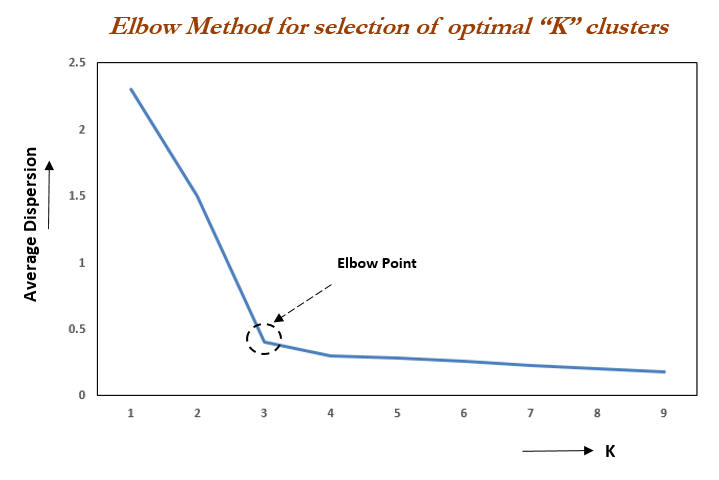

## K-Means

1. Escogemos e inicializamos $K$ centroides que servirán para hacer de clústers.
2. Para cada ejemplo $j$: asignamos el centroide más cercano
3. Una vez asignados todos los ejemplos, resituamos cada centroide en función de los ejemplos asignados al mismo.
4. Volvemos al paso 2.

## Algoritmo

Entrada:

- Número de clústers $K$
- Conjunto de entrenamiento: $\{x^{(0)}, \cdots, x^{(m)}\}$, con $x^{(i)} \in \mathbb{R}^n$

1. Inicializamos los $K$ centroides $(\mu_1, \cdots, \mu_k) \in \mathbb{R}^n$ de forma aleatoria.
2. Repetimos:
3. Para cada ejemplo $x^{(j)}$, $C^{(j)}$ es el índice del centroide más cercano a $x^{(j)}$: $\underset{i}{min}||x^{(j)} - \mu_i||$
4. Para cada clúster:
5. $\mu_i$ es la media de los puntos $x^{(j)}$ asignados al centroide $i$: $\mu_i = \frac{1}{t} \left[\sum_{j=1}^t x^{(j)} \text{ donde } C^{(j)} = i\right]$, donde $t$ es el número de ejemplos asignados al centroide $i$.
6. Si el centroide no tiene puntos, se elimina o se vuelve a inicializar de forma aleatoria.

## Clústers no claramente separables

Cuando los datos contienen mucho ruido lo que se hace es resolver el siguiente problema de optimización:

$$
\begin{aligned}
\underset{C^{(1)}, \cdots, C^{(m)}, \mu_1, \cdots, \mu_k}{min} J(C^{(1)}, \cdots, C^{(m)}, \mu_1, \cdots, \mu_k)
\end{aligned}
$$

Donde la función de coste $J$ se define como:

$$
\begin{aligned}
J(C^{(i)}, \mu_i) = \frac{1}{m} \sum_{i=1}^m ||x^{(i)} - \mu_{C^{(i)}}||^2
\end{aligned}
$$

Es decir, el coste es equivalente a la suma de la distancia entre el ejemplo $x^{(i)}$ y su clúster asignado $\mu_{C^{(i)}}$, para cada ejemplo.

El algoritmo de optimización lo que hace es:

1. Minimiza el coste con respecto a $C$
2. Minimiza el coste con respecto a $\mu$

## Inicialización aleatoria

1. Debemos escoger un número de centroides $K$ menor que el número de ejemplos $m$.
2. Inicializamos cada centroide equivalente a un ejemplo aleatorio del conjunto de entrenamiento: $\mu_i = x^{(j)}$

Hay que tener en cuenta que, en función de la inicialización de los centroides, se pueden obtener distintos resultados en el problema de optimización, por ello lo que se hace es:

1. Aplicar el algoritmo muchas veces
2. Escoger el modelo que obtuvo menor coste

Este proceso es viable si el número de clústers es pequeño.

## Parametrización de Clústering

Una forma de escoger el número de clústers $K$ es utilizando el método del codo:

1. Se aplica el modelo con un número distinto de clústers
2. Se evalúa con alguna métrica el rendimiento (coste) del modelo y
3. Se elige el ofrece una mayor mejora con respecto a un número de clústers menor

