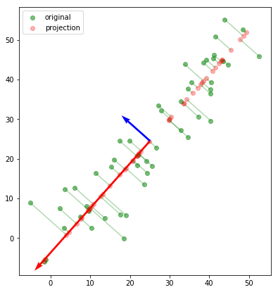
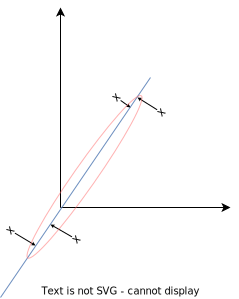
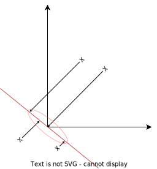
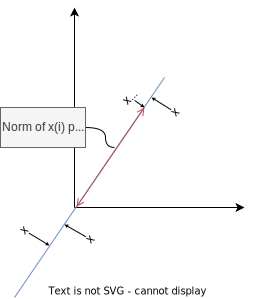
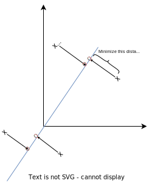
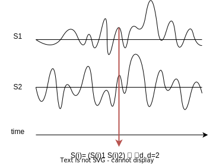
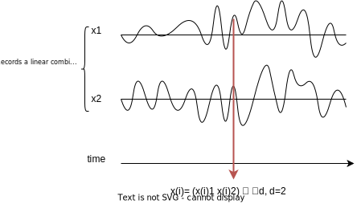
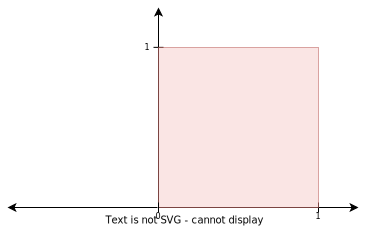
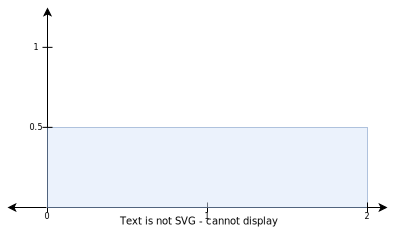

## Standardize Data

A lot of the times the units of each feature in the data make the values in one column (feature) be much bigger than the values in another column. Thus, the first step is to standardize your data:

- Center data
- Have it have variance equal to one

So we transform our data as follows:

$$
\begin{aligned}
x_j^{(i)} = \frac{x_j^{(i)} - \mu_j}{\sigma_j}
\end{aligned}
$$

Where:

- $u_j$ is the mean of the feature $j$ over the $n$ examples, such that $u_j = \frac{1}{n}\sum_{i=1}^nx^{(i)}_j$
- $\sigma_j$ is the standard deviation of the feature $j$ over the $n$ examples, where $\sigma_j^2 = \frac{1}{n}\sum_{i=1}^n(x^{(i)}_j - \mu_j)^2$

## PCA

### Find Underlying Space

To reduce the dimensionality of our data we first define a subspace and then we project each point onto the subspace.

This projection is the closes point in the subspace to the point we are trying to project, this has as a consequence that the "line" connecting the point to its projection is always perpendicular to the subspace:

The goal is to choose the subspace that maximizes the variance of the projected points, to retain the maximum possible variance of the data. As you can see if we choose the blue line as the subspace the variance
is much bigger that if we choose the red line:

### Represent the Subspace

Let us suppose the subspace is defined by a basis vector $u \in \mathbb{R}^d$ where $u$ is a unit vector, then projection of $\overrightarrow{x^{(i)}}$ on to the space spanned by $u$ will be:

$$
\begin{aligned}
Proj(u)\overrightarrow{x^{(i)}}
\end{aligned}
$$

Where $Proj(u)$ is the projection matrix and $x^{(i)} \in \mathbb{R}^d$. So, because $Proj(u) = \frac{uu^T}{u^Tu}$, then the projected point is defined as:

$$
\begin{aligned}
Proj(u)\overrightarrow{x^{(i)}} = \frac{uu^T}{u^Tu} \overrightarrow{x^{(i)}} = ((x^{(i)})^Tu)u
\end{aligned}
$$

Where $((x^{(i)})^Tu)$ is an scalar.

So, now our goal is to find a $u$ that maximizes the variance across the $n$ examples. That is, we want to maximize the sum of the square of the norms of the projected points:

More formally:

$$
\begin{aligned}
u = \underset{u}{\arg \max} \frac{1}{n}\sum_{i=1}^n ||Proj(u)x^{(i)}||^2 = \frac{1}{n}\sum_{i=1}^n ||((x^{(i)})^Tu)u||^2
\end{aligned}
$$

Because the norm of a unit vector multiplied by a scalar is just the square of the scalar (for $3 \cdot \begin{pmatrix} 1 & 0 & 0 \end{pmatrix}$: $||\begin{pmatrix} 3 & 0 & 0 \end{pmatrix}|| = (\sqrt{3^2 + 0^2 + 0^2})^2 = 3^2$):

$$
\begin{aligned}
u = \underset{u}{\arg \max} \frac{1}{n}\sum_{i=1}^n ((x^{(i)})^Tu)^2 = \frac{1}{n}\sum_{i=1}^n ((x^{(i)})^Tu)^T((x^{(i)})^Tu) = \frac{1}{n}\sum_{i=1}^n u^T x^{(i)} (x^{(i)})^T u
\end{aligned}
$$

Because $u, u^T$ are a common factor in the sum:

$$
\begin{aligned}
u = \underset{u}{\arg \max} \left[u^T \left(\frac{1}{n}\sum_{i=1}^n x^{(i)} (x^{(i)})^T \right) u\right]
\end{aligned}
$$

Now, we know that given the optimization problem of the form $\underset{u}{\arg \max} \left[u^T A u\right]$, the solution $u$ is the eigenvector corresponding to the largest eigenvalue of $A$.

In this scenario, $A = \left(\frac{1}{n}\sum_{i=1}^n x^{(i)} (x^{(i)})^T \right)$, which equals the sample covariance matrix, which is defined as:

$$
\begin{aligned}
\frac{1}{n} \sum_{i=1}^n (x^{(i)} - \mu)^T (x^{(i)} - \mu) = \frac{1}{n} \sum_{i=1}^n (x^{(i)} - 0)^T (x^{(i)} - 0) = \frac{1}{n} \sum_{i=1}^n (x^{(i)})^T x^{(i)}
\end{aligned}
$$

Note that, because our data is now centered after standardizing it, the mean $\mu$ equals zero.

Hence, we want to calculate the eigenvectors of the sample covariance matrix of x.

Mind you, we have derived this solution for a space defined by only one vector $u$. However given basis vectors $(u_1, \cdots, u_k)$ the optimization problem holds and the solution are the $k$ eigenvectors corresponding to the $k$ largest eigenvalues of $A$.

### Algorithm Layout

The steps of `PCA` are the following:

- Calculate the sample covariance matrix as $x^Tx$
- Calculate the eigenvector and eigenvalues of $x^Tx$, such that:

$$
\begin{aligned}
\begin{matrix}
(\lambda_1, u_1) \\
(\lambda_2, u_2) \\
\vdots \\
(\lambda_d, u_d) \\
\end{matrix}
\end{aligned}
$$

Are the $d$ eigenvectors ($u_i$) and eigenvalues ($\lambda_i$). We assume the tuples are ordered in decreasing order with respect to the eigenvalues, such that if $i > j$ then $\lambda_i > \lambda_j$.

- Find $k$ such that we satisfy a confidence level with respect to the variance, i.e. suppose you want to preserve 95% of the variance of the original data then:

$$
\begin{aligned}
\frac{\sum_{i=1}^k \lambda_i}{\sum_{j=1}^d \lambda_j} = 95\%
\end{aligned}
$$

- Choose the $k$ eigenvectors with the largest corresponding eigenvalues.

### Performing Eigen-decomposition

First of all, let us present two properties regarding eigen-decompositions of a matrix $X$:

- If $X$ is a square matrix and symmetric then $X$ has orthogonal eigenvectors and real eigenvalues.
- If $X$ is also positive semi-definite then the eigenvalues are positive.

In our case, the eigen-decomposition is done over $x^Tx$, therefore this matrix is guaranteed to be a square matrix, symmetric and positive semi-definite.

Then, performing the eigen decomposition of $x^Tx$ is equivalent to performing singular value decomposition (`SVD`) over $x$, such that the single values equal the square root of the eigenvalues.

#### Large Datasets

To perform `PCA` on large datasets we use a technique called _Power Iteration_, which consists on:

- For $i=0$, initialize $U^{(i)}$ to random values other than zero
- Set $i = i+1$, and $U^{(i)} = (X^TX)U^{(i-1)}$
- Re-scale $U^{(i)}$ to have unit length such that: $U^{(i)}=\frac{(X^TX)U^{(i-1)}}{||(X^TX)U^{(i-1)}||}$
- Go to step 2.

Eventually it will converge to the largest eigenvector.

### Rephrasing PCA

Another way to describe the problem solved by `PCA`, equivalent to the maximization variance perspective, is:

Find a subspace such that the projection of the points are as close to the original data as possible, that is minimize the sum of the distances between the projected points and the original points.

## ICA

This algorithm pretends to solve what is commonly known as the source separation problem, where we are given a dataset $X$ that is a mixture of some source data $S$. We then use these mixed sources $X$ to construct a unmixing matrix $W$ to recover the source $S$.

### Intuition

Imagine there are $d$ speakers and $d$ microphones randomly distributed in a room, such that:

- $s \in \mathbb{R}^d$ is the representation of what a speaker says. So $S_j^{(i)}$ is what the $j$ speaker said in moment $i$.
- $x \in \mathbb{R}^d$ is the representation of what a microphone records. So $x_j^{(i)}$ is what the $j$ microphone recorded in moment $i$.

For example, given two speaker, what they say is represented as follows:

Meanwhile the recordings of the microphones are the following:

We are only given $X$, and the goal is to recover the original speech signal spoken by each speaker. We assume that $X$ is a linear combination of what each speaker says, thus $X = AS$, where $A$ is a quare matrix $d \times d$ and is called the mixing matrix.

What we want to do is to compute the inverse of $A$, $W$ such that $W = A^{-1}$, where $W$ is called the unmixing matrix.

Then:

$$
\begin{aligned}
A^{-1}X = A^{-1}AS \rightarrow A^{-1}X = S \rightarrow WX = S \rightarrow S = WX
\end{aligned}
$$

### Solution

To solve this problem we make the following assumptions:

1. The number of sources $S$ are equal to the number of "examples" in the mixed dataset $X$
2. $X$ is a linear combination of $S$, such that $S = WX$
3. $S_j$ is independent of $S_k$, whenever $j \neq k$. That is to say, each belongs to a different probability distribution, and are two independent random variables.
4. Each $S_j$ is not Gaussian.

#### Intuition

Suppose we are given a random variable $X$ such that $X ~ Unif [0,1]$, then the probability density function is:

Let us define a new distribution as follows $y=2x$, then the probability density function is:

Note, that the function is "stretched" as to always satisfy the condition that the integral of $PDF$ must equal 1, which is the same as saying the area under the function is 1. So now, $P_y (y) = P_x(x) \cdot \frac{1}{2} = P_x(\frac{y}{2})\cdot\frac{1}{2}$, because $x = \frac{y}{2}$.

But what happens in a higher dimension? That is, what happens when we multiply $x \in \mathbb{R}^d$ by a mixing matrix $W \in \mathbb{R}^{d \times d}$. Well, given $y \in \mathbb{R}^{d \times d}$, such that $y=WX$, then to perform a change of random variable we use the Jacobian:

$$
\begin{aligned}
P_y(y) = P_x(X)\frac{1}{|W|} = P_x(W^{-1}Y)\frac{1}{|W|}
\end{aligned}
$$

Where $|W|$ is the determinant of $W$.

First of all we define the distribution of the mixed dataset as follows:

$$
\begin{aligned}
P_X(x) = \prod_{j=1}^d P_S (S_j) |W| = \prod_{j=1}^d P_S (W_j^TX) |W|
\end{aligned}
$$

Note that $S_j=(W_j)^TX$.

We also assume that $P_S$ is distributed according to a logistic distribution, thus:

- Cumulative Distribution Function (CDF): $\frac{1}{1+e^{-x}} = \sigma(x)$
- Probability Density Function (pdf): $\sigma(x)\sigma(1-x)$

So, we obtain the likelihood of $W$ as follows:

$$
\begin{aligned}
l(W) = \sum_{i=1}^n \left[\left(\sum_{j=1}^d \log[\sigma(x^{(i)})(1-\sigma(x^{(i)}))]\right) + \log{|W|}\right]
\end{aligned}
$$

Where $W$ is the parameter we are trying to obtain. So, to solve the optimization problem:

- We define the maximization of the likelihood as the objective
- We compute the derivative of $l(W)$ and perform gradient descent, such that the update step is as follows:

$$
\begin{aligned}
W = W - \alpha \left\{\begin{bmatrix}
(1- 2\sigma(W_1^Tx^{(i)})) \\
(1- 2\sigma(W_2^Tx^{(i)})) \\
\vdots \\
(1- 2\sigma(W_d^Tx^{(i)})) \\
\end{bmatrix} (x^{(i)})^T + (W^T)^{-1}
\right\}
\end{aligned}
$$
