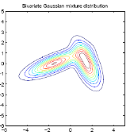

## Introduction

This technique is employed in Density Estimation problems and Anomaly Detection.

Such problems aim to represent data in a compact form using a statistical distribution, e.g., Gaussian, Beta, or Gamma. You can think of those problems as a clustering task but from a probabilistic point of view. This is what makes the EM algorithm a probabilistic generative model.

Thus, if we are given $n$ samples, we model them with $P(x)$, such that if $P(x) < \epsilon$, where $\epsilon$ is some threshold, then we detect an anomaly.

However, you may expect that a single Gaussian with its mean and variance cannot map thousands of instances in a dataset into a set of $K$ clusters accurately, so we may assume that there are $K$ distributions that describe the data, hence we use **Mixture Models**.

For example, imagine you have the following dataset:

It looks like the data comes from two different Gaussian distributions:

So to model this data we use a Mixture of Gaussian Models.

Note that if we knew by which distribution each sample was generated, we would simply use MLE, however we do not know this information, therefore we use the Expectation Maximization Algorithm and we introduce the latent variable $z$ in place of the predicted output $y$ we had in supervised learning algorithms.

To model the data, first of all, we suppose that there is a latent (hidden/unobserved) random variable $z$, and $x^{(i)}, z^{(i)}$ are distributed (by a joint distribution) like so

$$
\begin{aligned}
P(x^{(i)},z^{(i)}) = P(x^{(i)}|z^{(i)}) P(z^{(i)})
\end{aligned}
$$

Where $z^{(i)} \sim Multinomial(\phi)$, that is $z^{(i)}$ is distributed according to a multinomial distribution. This distribution models for each $z^{(i)}$ the probability of it being equal to $1, 2, ..., K$, where $K$ is the number of clusters. This will denote the probability of a point $x^{(i)}$ being drawn from each of the distributions.

And $P(x^{(i)}|z^{(i)}=j)$ is the probability of $x^{(i)}$ being generated by the cluster $j$. Where $x^{(i)}|z^{(i)} = j$ is drawn from a normal distribution $\mathcal{N}(\mu_j, \Sigma_j)$.

## Gaussian Mixture Models

To build a density estimator model, we cannot rely on a simple distribution. Mixture models try to tackle this limitation by combining a set of distributions to create a convex space where we can search for the optimal parameters for such distributions using Maximum Likelihood Estimation (MLE).

A Mixture Model is expressed by the following equations:

$$
\begin{aligned}
p(x^{(i)}) = \sum_{j=1}^K \phi^{(i)}_j p_j(x^{(i)}) \tag{1}
\end{aligned}
$$

$$
\begin{aligned}
0 \leq \phi^{(i)}_j \leq 1, \sum_{j=1}^K \phi^{(i)}_j = 1
\end{aligned}
$$

Where $K$ is the number of mixture components (clusters), $\phi^{(i)}_j$'s are the mixture weights, and $p_j(x^{(i)})$'s are members of a family of distributions (Gaussian, Poisson, Bernoulli, etc). So for each example $x^{(i)}$ and for each distribution $j$, each weight $\phi^{(i)}_j$ is between 0 and 1, and the sum over $k$ of the weights $\phi_j^{(i)}$ for every example $x^{(i)}$ equals one.

Consequently, a GMM is a Mixture Model where the $p_j(x^{(i)})$ is a finite combination of Gaussian Distributions. Therefore, a GMM can be precisely defined by the following set of equations:

$$
\begin{aligned}
p(x^{(i)};\theta) = \sum_{j=1}^K \phi^{(i)}_j \mathcal{N}(x^{(i)};\mu_j,\,\Sigma_j)
\end{aligned}
$$

$$
\begin{aligned}
0 \leq \phi^{(i)}_j \leq 1, \sum_{j=1}^K \phi^{(i)}_j = 1
\end{aligned}
$$

Where $\theta$ is the collection of all the parameters of the model (mixture weights, means, and covariance matrices):

$$
\begin{aligned}
\theta = \{\phi_1, \cdots, \phi_K, \mu_1, \cdots, \mu_K, \Sigma_1, \cdots, \Sigma_K\}
\end{aligned}
$$

For example, the following plot shows what a GMM derived from 3 mixture components looks like:

As a consequence, for each data point, $x^{(i)}$ (in red), we can compute the probability that it belongs to each component ($P(x^{(i)}|z^{(i)} = j)$, where $j = 1, 2, 3$)(make a “soft” assignment). This quantity is called “responsibility”.

## EM Algorithm with GMM's

The Expectation Maximization Algorithm is comprised of two steps:

1. Guess the value of the responsibilities $w^{(i)}_j$, that represent the "amount" of each $x^{(i)}$ that was generated from the distribution $j$ (or the probability that the $j$th distribution generated the point $x^{(i)}$).
2. Compute the values of the parameters of the distributions: $\theta = \{\phi, \mu, \Sigma\}$ according to the $MLE$ (Maximum Likelihood Estimation) with respect to the parameters. Thus, we want to maximize $\mathcal{L}(\Phi, \mu, \Sigma)$.

### E-Step

In this step, as we have said, we will compute the value of the responsibilities with the given parameters $\phi, \mu, \Sigma$. So for each example $i$ and each component (distribution) $j$, the amount of $x^{(i)}$ that is generated by the component $j$ is given by:

$$
\begin{aligned}
w^{(i)}_j = P(z^{(i)} = j | x^{(i)}; \phi_j, \mu_j, \Sigma_j)
\end{aligned}
$$

By Bayes' Rule, we can rewrite the equation as follows:

$$
\begin{aligned}
w^{(i)}_j = \frac{P(x^{(i)}|z^{(i)} = j)P(z^{(i)} = j)}{\sum_{l=1}^K \left[P(x^{(i)}|z^{(i)} = l)P(z^{(i)} = l)\right]}
\end{aligned}
$$

Note that the likelihood $P(x^{(i)}|z^{(i)} = j)$ and each likelihood $P(x^{(i)}|z^{(i)} = l)$ come from a Gaussian distribution, therefore:

$$
\begin{aligned}
P(x^{(i)}|z^{(i)} = j) = \frac{1}{(2\pi)^{\frac{n}{2}}|\Sigma_j|^{\frac{1}{2}}} \exp\left(-\frac{1}{2}(x^{(i)} - \mu_j)^T \Sigma_j^{-1} (x^{(i)} - \mu_j)\right) \tag{2}
\end{aligned}
$$

To simplify notation we will denote $P(x^{(i)}|z^{(i)} = j)$ as $\mathcal{N}(\mu_j, \Sigma_j)$. On the other hand, the prior $P(z^{(i)} = j)$ comes from a Multinomial distribution, hence:

$$
\begin{aligned}
P(z^{(i)} = j) = \phi_j \tag{3}
\end{aligned}
$$

Combining all the expressions:

$$
\begin{aligned}
w^{(i)}_j = \frac{\phi_j\mathcal{N}(\mu_j, \Sigma_j)}{\sum_{l=1}^K \left[\phi_l\mathcal{N}(\mu_l, \Sigma_l)\right]} \tag{4}
\end{aligned}
$$

All that is left to do is plug all of the values into each equation $(2)$ and $(3)$ (this values are known, given the equations are written in terms of the distributions' parameters) and compute each $w^{(i)}_j$ given $(4)$.

### M-Step

In this step what we do is maximize the log likelihood of the distributions' parameters $\theta$, that is we maximize $\mathcal{L}(\phi, \mu, \sigma)$. But first, let us see how do we maximize the parameters in `GMM`.

#### Optimal Parameters of a GMM

We are going to show how to maximize the log likelihood of the parameters of a Gaussian Mixture Model. The goal of the GMM is to represent the distribution of the data as accurately as possible using a linear combination of Gaussian Distributions.

Given a dataset $X$ of $m$ data points, we assume they are i.i.d (independent and identically distributed), therefore the maximum likelihood estimator over $X$ can be expressed as the product of the individual likelihoods. To simplify the equations, we are going to directly apply the logarithm to the MLE function:

$$
\begin{aligned}
\log \mathcal{L}(X|\theta) = \log p(X|\theta) = \log \prod_{i=1}^m p(x^{(i)}|\theta) = \sum_{i=1}^m \log p(x^{(i)}|\theta)
\end{aligned}
$$

By $(1)$ we know that $p(x^{(i)}|\theta)$ is a linear combination of Gaussian distributions, therefore:

$$
\begin{aligned}
\log \mathcal{L}(X|\theta) = \sum_{i=1}^n \log \sum_{j=1}^K \phi_j^{(i)}\mathcal{N}(x^{(i)}|\mu_j, \Sigma_j)
\end{aligned}
$$

This equation is not tractable, so we won't get an analytical solution by just taking the its derivative with respect to $\theta$ and setting it to 0. The following set of equations outline how we would evaluate it:

$$
\begin{aligned}
\frac{\delta \mathcal{L}}{\delta \mu_j} \sum_{i=1}^m \frac{\delta \log p(x^{(i)}|\theta)}{\delta \mu_j} = 0^T
\end{aligned}
$$

$$
\begin{aligned}
\frac{\delta \mathcal{L}}{\delta \Sigma_j} \sum_{i=1}^m \frac{\delta \log p(x^{(i)}|\theta)}{\delta \Sigma_j} = 0
\end{aligned}
$$

$$
\begin{aligned}
\frac{\delta \mathcal{L}}{\delta \phi_j} \sum_{i=1}^m \frac{\delta \log p(x^{(i)}|\theta)}{\delta \phi_j} = 0
\end{aligned}
$$

Observe that the computation of each parameter from $\theta (\mu, \Sigma, \phi)$ depends on the other parameters in a complex way. To solve those equations, we can use the strategy of optimizing some parameters while keeping the others fixed.

Going back to the Expectation Maximization Algorithm, there is a way of updating the individual parameters of a GMM given prior (initialized at random) parameters $\mu, \Sigma, \phi$. This approach works by updating some parameters while keeping the others fixed. So, by solving the derivatives presented above we derive the three following updating rules:

$$
\begin{aligned}
\hat{\mu}_j = \frac{\sum_{i=1}^m w^{(i)}_jx^{(i)}}{\sum_{l=1}^m w^{(l)}_j}
\end{aligned}
$$

$$
\begin{aligned}
\hat{\Sigma}_j = \frac{\sum_{i=1}^m w^{(i)}_j (x^{(i)} - \hat{\mu}_j)(x^{(i)} - \hat{\mu}_j)^T}{\sum_{l=1}^m w^{(l)}_j}
\end{aligned}
$$

$$
\begin{aligned}
\hat{\phi}_j = \frac{1}{m} \sum_{i=1}^m w^{(i)}_j
\end{aligned}
$$

To simplify a bit the notation, if $N_j = \sum_{l=1}^m w^{(i)}_l$:

$$
\begin{aligned}
\hat{\mu}_j = \frac{1}{N_j} \sum_{i=1}^m w^{(i)}_jx^{(i)}
\end{aligned}
$$

$$
\begin{aligned}
\hat{\Sigma}_j = \frac{1}{N_j}\sum_{i=1}^m w^{(i)}_j (x^{(i)} - \hat{\mu}_j)(x^{(i)} - \hat{\mu}_j)^T
\end{aligned}
$$

$$
\begin{aligned}
\hat{\phi}_j = \frac{N_j}{m}
\end{aligned}
$$

Note that the update of $\mu, \Sigma, \phi$, all depend on the responsibilities ($w^{(i)}_j$), which by its turn, depends on $\mu, \Sigma, \phi$. That’s why there's not a closed-form solution to equations.

Furthermore these equations do not aim to precisely maximize over $\theta$ the actual log likelihood. Instead they maximize a proxy function of the log-likelihood over $\theta$, namely, the expected log-likelihood, which can be derived from the log-likelihood using Jensen's Inequality as follows:

$$
\begin{aligned}
\hat{\mathcal{L}}(X|\theta) = \sum_{i=1}^m\sum_{j=1}^K w^{(i)}_j \log \left( \frac{\phi_j \mathcal{N}(x^{(i)} | \mu_j, \Sigma_j)}{w^{(i)}_j} \right) \tag{5}
\end{aligned}
$$

### Iterative Process

The process consists of an iterative process that alternates between two steps. The first step is to compute the responsibilities (E step) of each mixture component for each data point using the current parameters ($\mu, \Sigma, \phi$). The second step consists of updating the parameters (M step) in order to maximize the expected log-likelihood given by $(5)$

The E and M steps are repeated until there is no significant progress in the proxy function of the log-likelihood computed after the M step.

## Recap: Anomaly Detection

Thus, when the parameters $\theta$ are optimized, we can compute $P(x) = \sum_{j=1}^K P(x|z = j)$ and if $P(x) < \epsilon$ you can flag $x$ as an anomaly.

## Generalized EM Algorithm

### Jensen's Inequality

#### Convex function

We are going to show what Jensen's Inequality is about. So:

- Let $f$ be a convex function (e.g. $f''(x) > 0$) and
- Let $x$ be a random variable, then

$$
\begin{aligned}
f(E[x]) \leq E[f(x)]
\end{aligned}
$$

where $E$ is the expected value.

Further, if $f''(x) > 0$ (we say f is strictly convex, that is f is not a straight line), then:

$$
\begin{aligned}
E[f(x)] = f(E[x]) \leftrightarrow \text{ x is a constant, more formally } X = E[X] \text{ with probability 1}
\end{aligned}
$$

#### Concave function

We are going to apply the same arguments with a concave function. Note that a concave function equals the negative of a convex function, thus:

- Let $f$ be a concave function (e.g. $f''(x) < 0$) and
- Let $x$ be a random variable, then

$$
\begin{aligned}
f(E[x]) \geq E[f(x)]
\end{aligned}
$$

where $E$ is the expected value.

Further, if $f''(x) < 0$ (we say f is strictly concave), then:

$$
\begin{aligned}
E[f(x)] = f(E[x]) \leftrightarrow \text{ x is a constant, more formally } X = E[X] \text{ with probability 1}
\end{aligned}
$$

#### Some Intuition

Given any convex function (the inverse also applies to concave functions), if we draw a chord between any two points, its middle point (that is the expected value of the function or $E[f(x)]$) is always above that the value of the expected value under the function (that is $f(E[x])$). Graphically:

### Motivation

Given a model for $P(x, z , \theta)$ where $\theta$ are the parameters of the model. We only observe $X = \{x^{(1)}, \cdots, x^{(m)}\}$.

The goal is to obtain by the **Maximum Likelihood Estimation** the value of $\theta$ that maximizes the log likelihood, defined as:

$$
\begin{aligned}
\theta = \underset{\theta}{\arg \max{l(\theta)} }  = \sum_{i=1}^m \log (P(x^{(i)}; \theta))
\end{aligned}
$$

If we marginalize $z^{(i)}$:

$$
\begin{aligned}
\theta = \underset{\theta}{\arg \max{l(\theta)} } = \sum_{i=1}^m \log \sum_{z^{(i)}} (P(x^{(i)}, z^{(i)}; \theta))
\end{aligned}
$$

### E-Step

In the `E-Step` we construct a lower bound from a given `theta`: so, let's say $l(\theta)$ is the log likelihood.

On the first iteration, the graph would be as follows:

And on the second iteration:

We iterate until there are no significant changes in the lower bound, that is the algorithm converges to a local optimum (it should be noted the optimum is local not absolute, and it depends on the initialization of the distributions' parameters).

### M-Step

Now, in the M-Step we maximize the log likelihood as follows:

$$
\begin{aligned}
\underset{\theta}{\max{ }} \sum_{i=1}^m \log P(x^{(i)}; \theta)
\end{aligned}
$$

By marginalizing $z^{(i)}$:

$$
\begin{aligned}
\underset{\theta}{\max{ }} \sum_{i=1}^m \log \sum_{z^{(i)}} P(x^{(i)}, z^{(i)}; \theta)
\end{aligned}
$$

We now introduce a probability distribution over $z^{(i)}$ (thus $\sum_{z^{(i)}}Q(z^{(i)}) = 1$), and we multiply by $\frac{Q(z^{(i)})}{Q(z^{(i)})}$:

$$
\begin{aligned}
\underset{\theta}{\max{ }} \sum_{i=1}^m \log \sum_{z^{(i)}} Q(z^{(i)}) \frac{P(x^{(i)}, z^{(i)}; \theta)}{Q(z^{(i)})}
\end{aligned}
$$

Now, by the definition of expected value (Given a sequence of real values $a_1, \cdots, a_n$ with probabilities $p_1, \cdots, p_n$, the expected value is defined as: $e = \sum_{i=1}^n p_i a_i$), if $p_i = Q(z^{(i)})$ and $a_i = \frac{P(x^{(i)}, z^{(i)}; \theta)}{Q(z^{(i)})}$

$$
\begin{aligned}
\underset{\theta}{\max{ }} \sum_{i=1}^m \log E_{z^{(i)}\sim Q} \left[\frac{P(x^{(i)}, z^{(i)}; \theta)}{Q(z^{(i)})}\right]
\end{aligned}
$$

If we apply the concave version of Jensen's Inequality we obtain a lower bound of the form:

$$
\begin{aligned}
\sum_{i=1}^m \log E_{z^{(i)}\sim Q} \left[\frac{P(x^{(i)}, z^{(i)}; \theta)}{Q(z^{(i)})}\right] \geq \sum_{i=1}^m E_{z^{(i)} \sim Q} \left[\log \frac{P(x^{(i)}, z^{(i)}; \theta)}{Q(z^{(i)})}  \right]
\end{aligned}
$$

If $\log (x) = f(x)$, then this equation can be mapped to the inequality:

$$
\begin{aligned}
f(E[x]) \geq E[f(x)]
\end{aligned}
$$

Note that $log$ is a concave function. If we "unpack" the expected value:

$$
\begin{aligned}
\sum_{i=1}^m E_{z^{(i)} \sim Q} \left[\log \frac{P(x^{(i)}, z^{(i)}; \theta)}{Q(z^{(i)})}  \right] = \sum_{i=1}^m \sum_{z^{(i)}} \log Q(z^{(i)}) \left[\frac{P(x^{(i)}, z^{(i)}; \theta)}{Q(z^{(i)})}\right]
\end{aligned}
$$

### Make Log Likelihood and Lower Bound Equal on Theta

For each $\theta$ on the E-Step you wan the value of $\theta$ under the lower bound function to be equal to $l(\theta)$, which is what guarantees that when you optimize the lower bound you optimize $l(\theta)$.

So, for a given iteration the current value of $\theta$, denoted by $\hat{\theta}$, we want:

$$
\begin{aligned}
\sum_{i=1}^m \log E_{z^{(i)}\sim Q} \left[\frac{P(x^{(i)}, z^{(i)}; \hat{\theta})}{Q(z^{(i)})}\right] = \sum_{i=1}^m E_{z^{(i)} \sim Q} \left[\log \frac{P(x^{(i)}, z^{(i)}; \hat{\theta})}{Q(z^{(i)})}  \right]
\end{aligned}
$$

Remember, by the extension on Jensen's Inequality we know that $E[f(x)] = f(E[x])$ if and only if $x$ is a constant. In this case

$$
\begin{aligned}
x = \frac{P(x^{(i)}, z^{(i)}; \hat{\theta})}{Q(z^{(i)})} = constant
\end{aligned}
$$

For this to hold, we need $Q(z^{(i)})$ to be directly proportional to $P(x^{(i)}, z^{(i)}; \hat{\theta})$ (so when one is bigger the other is bigger and vice versa, so the ratio between the two remains constant). So:

$$
\begin{aligned}
Q(z^{(i)}) \propto P(x^{(i)}, z^{(i)}; \hat{\theta})
\end{aligned}
$$

Because $\sum_{z^{(i)}}Q(z^{(i)}) = 1$, a way to ensure this is to set each $Q^{(i)} = P(x^{(i)}, z^{(i)}; \hat{\theta})$ and then normalize it to make sure the sum of $Q$ over $z^{(i)}$ equals one. Hence:

$$
\begin{aligned}
Q(z^{(i)}) = \frac{P(x^{(i)}, z^{(i)}; \hat{\theta})}{\sum_{z^{(i)}} P(x^{(i)}, z^{(i)}; \hat{\theta})}
\end{aligned}
$$

It turns out you can further derive this equation to be:

$$
\begin{aligned}
Q(z^{(i)}) = P(z^{(i)}|x^{(i)}; \hat{\theta})
\end{aligned}
$$

### Putting Everything Together

So, after everything we have seen, we can summarize the EM generalized algorithm as follows: If $\theta$ is the value of the parameters in the current iteration:

- _E-Step_: set
  $$
  \begin{aligned}
  Q_i(z^{(i)}) = P(z^{(i)}|x^{(i)}; \theta)
  \end{aligned}
  $$
- _M-Step_: set
  $$
  \begin{aligned}
  \theta := \underset{\theta}{\arg \max} \sum_{i=1}^m \sum_{z^{(i)}} Q_i(z^{(i)}) \log \left[\frac{P(x^{(i)}, z^{(i)};\theta)}{Q_i(z^{(i)})}\right]
  \end{aligned}
  $$

## Derive EM for GMM from the Generalized Algorithm

Given a model described by:

- $P(x^{(i)}, z^{(i)}) = P(x^{(i)}|z^{(i)}) P(z^{(i)})$
- where $z^{(i)} \sim Multinomial(\phi)$ (which means $P(z^{(i)} = j) = \phi_j$)
- and $x^{(i)} | z^{(i)} \sim \mathcal{N}(\mu_j, \Sigma_j)$

### E-Step

On the `E-Step` we compute:

$Q_i(z^{(i)}) P(z^{(i)} = j | x^{(i)}; \phi, \mu, \Sigma)$

If we look at [E-Step from GMM's](#e-step) we can see that the expression above equals $w^{(i)}_j$.

### M-Step

Now on the `M-Step` what we do is maximize the lower bound we have constructed in the `E-Step`. For that we need to compute the value of the parameters $\phi, \mu, \Sigma$ that maximize this function, that is:

$$
\begin{aligned}
\underset{\phi, \mu, \Sigma}{\max} \sum_{i=1}^m \sum_{z^{(i)}} Q_i(z^{(i)}) \log \left( \frac{P(x^{(i)}, z^{(i)}; \phi, \mu, \Sigma)}{Q_i(z^{(i)})} \right) =
\end{aligned}
$$

As we know $Q_i(z^{(i)}) = w^{(i)}_j$ and $P(x^{(i)}, z^{(i)}) = P(x^{(i)}|z^{(i)}) P(z^{(i)})$, thus:

$$
\begin{aligned}
= \sum_{i=1}^m \sum_{j}^K w^{(i)}_j \log \left( \frac{P(x^{(i)}|z^{(i)} = j, \mu_j, \Sigma_j) P(z^{(i)} = j)}{w^{(i)}_j} \right)
\end{aligned}
$$

We also know that $P(z^{(i)} = j) = \phi_j$ and $x^{(i)} | z^{(i)} \sim \mathcal{N}(\mu_j, \Sigma_j)$, therefore:

$$
\begin{aligned}
= \sum_{i=1}^m \sum_{j}^K w^{(i)}_j \log \left( \frac{\mathcal{N}(x^{(i)}; \mu_j, \Sigma_j) \phi_j}{w^{(i)}_j} \right)
\end{aligned}
$$

Where:

$$
\begin{aligned}
\mathcal{N}(x^{(i)}; \mu_j, \Sigma_j) = \frac{1}{(2\pi)^{1/2}|\Sigma_j|^{1/2}} \exp \left( -\frac{1}{2}(x^{(i)} - \mu_j)^T \Sigma_j^{-1}(x^{(i)} - \mu_j)\right)
\end{aligned}
$$

From now on we denote $\sum_{i=1}^m \sum_{j}^K w^{(i)}_j \log \left( \frac{\mathcal{N}(x^{(i)}; \mu_j, \Sigma_j) \phi_j}{w^{(i)}_j} \right)$ as $\mathcal{L}(\phi, \mu, \Sigma)$:

To maximize this formula over $\phi, \mu$ and $\Sigma$ you have to compute the derivatie of the function with respect to each parameter, such that:

1. $\Delta_{\mu_j} (\mathcal{L}(\phi, \mu, \Sigma)) = 0$, then: $\mu_j = \sum_{i}^m \frac{w^{(i)}_j x^{(i)}_j}{w^{(i)}_j}$ (same as in [M-Step in GMM's](#m-step))
2. $\Delta_{\Sigma_j} (\mathcal{L}(\phi, \mu, \Sigma)) = 0$ and
3. $\Delta_{\phi_j} (\mathcal{L}(\phi, \mu, \Sigma)) = 0$
