## Markov Model

In [Histogram Localization](../01_localization) we assigned a probability to each cell in the world:

[$0.2$][$0.1$][$0.5$][$0.1$][$0.2$]

What we did is we divided the continuous space into a finite number of cells, that approximates the posterior distribution (which is continuous: red line) by a histogram (blue bars) over the original distribution.

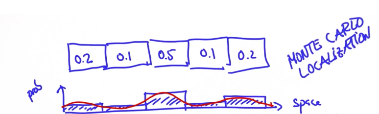

However in Kalman Filters this distribution is given by a Gaussian Distribution.

### Gaussian Distribution

A Gaussian Distribution is a continuous function which is described in $\mathbb{R}$ by the mean $\mu$ and the variance $\sigma^2$.

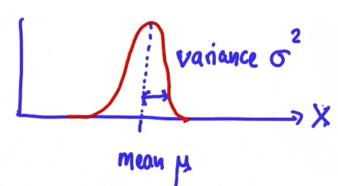

The formula is the following:

$$
\begin{aligned}
f(x) = \frac{1}{\sqrt{2\pi\sigma^2}} \exp^{-\frac{1}{2}\frac{(x-\mu)}{\sigma^2}}
\end{aligned}
$$

Where $\frac{1}{\sqrt{2\pi\sigma^2}}$ is a constant that normalizes $\exp^{-\frac{1}{2}\frac{(x-\mu)}{\sigma^2}}$

_Remark_ The bigger the covariance $\sigma^2$ the wider the distribution, which means we are less certain of the state. If it is narrow, that means we are confident about our location.

## Measurement and Motion

Like with localization Kalman Filters operate within a cycle, that is, it iterates like so:


1. **Motion** (or prediction): where we predict the position of the car based on data we know. To perform this prediction we sum the location distribution and the distribution that describes the motion.
2. **Measurement** (or measurement update/correction): where we combine the prediction with the measurement made by the sensors. To perform this update we multiply the motion prediction with the distribution that describes the measurement.

This is illustrated in the following image:

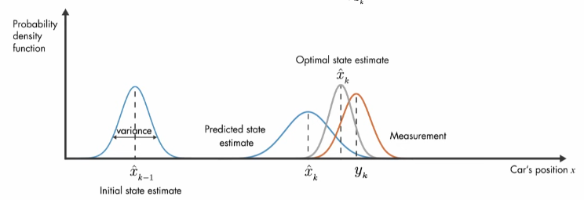

Here the predicted state estimate corresponds to the Motion Step, and the measurement distribution corresponds to the measurement. The result of the product between the two eausl the optimal state estimate.

## Motion Step

Suppose, at moment $t$, your location is represented as follows:

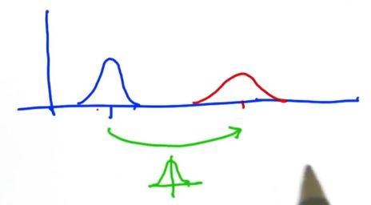

Where:

- The blue gaussian distribution represents your best guess (prediction) at where your are at $t$, and is characterized by $(\mu, \sigma^2)$
- The green gaussian distribution represents the motion of $\nu$ units, which has its own uncertainty, and is characterized by $(\nu, r^2)$
- The red gaussian distribution represents you location at time $t+1$ after the motion

Where this last distribution equals the sum of the other two distributions and is characterized by:

$$
\begin{aligned}
\hat{\mu} = \mu + \nu
\end{aligned}
$$

$$
\begin{aligned}
\hat{\sigma}^2 = \sigma^2 + r^2
\end{aligned}
$$

So, basically the mean is shifted $\nu$ units and the covariance is made larger by summing $\sigma^2$ and $r^2$, as a result of summing the distributions.

### Motion Noise

Note that the movement may not be certain, that is why we introduce some gaussian noise. This noise is drawn from a Normal Distribution where the variance is given by a co-variance matrix $Q$ (this matrix describes the uncertainty for the initial state). We define this noise as follows:

$$
\begin{aligned}
u \sim \mathcal{N}(0, Q)
\end{aligned}
$$

## Measurement Step

As we have already said, the update is the result of multiplying the prediction distribution (after Motion step), which was characterized in the previous section, by the measurement distribution. This would mean "creating" a new distribution that models the robot's current state. We now show how the multiplication of two distributions is performed:

### Updating the Mean

We are going to show how to the mean is computed when multiplying two distributions. Suppose the prior distribution is as follows:

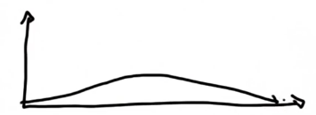

Where the covariance is very large, so we are very uncertain about a location. And we recieve a measurement of the form:


Which is much more certain about the location. Then the mean will shift accordingly (green line):

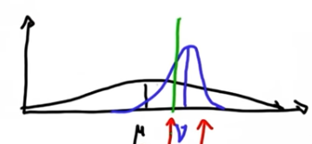

### Updating the Variance

We are going to show how to the variance is computed when multiplying two distributions. So, after multiplying the prior and the measurement shown previously, the resulting gaussian y more certain than both of the prior and the measurement gaussians. That is the covariance of this new gaussian is smaller, so the more measurements we have the more certain the are.


Why does this happen? Well, given these two distributions:

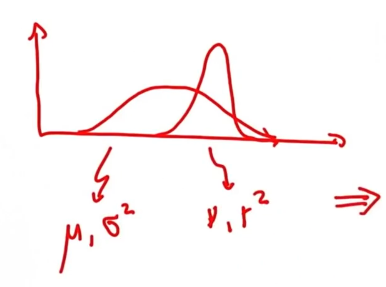

Where the first distribution is characterized by $(\mu, \sigma^2)$ and the second distribution is characterized by $(\nu, r^2)$. The product of the two is a distribution characterized by $(\hat{\mu}, \hat{\sigma}^2)$, computed as follows:

$$
\begin{aligned}
\hat{\mu} = \frac{r^2\mu + \sigma^2\nu}{r^2 + \sigma^2}
\end{aligned}
$$

Observe, because $\sigma^2 >> r^2$ in our example, then $\hat{\mu}$ will be closer to the second distribution's mean $\nu$. Also:

$$
\begin{aligned}
\hat{\sigma}^2 = \frac{1}{\frac{1}{r^2} + \frac{1}{\sigma^2}} = \frac{\sigma^2 r^2}{\sigma^2 + r^2}
\end{aligned}
$$

Thus, the updated covariance is not affected by the means and will always be smaller than $\sigma^2$ and $r^2$. We illustrate this is the following image, where the updated distribution is the one drawn in blue:

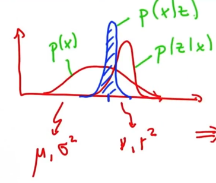

Note that the wider distribution represents the prior, the measurement represents the likelihood and the updated distribution represents the posterior.

### Measurement Noise

However, note that the measurement might also be noisy. So we again introduce gaussian noise $v$ that is modeled after a Normal distribution with known variance. That is $v \sim \mathcal{N}(0, R)$. This indicates how much we trust the measurements provided by the sensors. This variable is called measurement noise covariance matrix

## States

Kalman Filters are made up from what it's called states, and we differentiate two different kinds of states:

- Observables (in our case the location)
- Hidden (in our case the velocity, which i can never observe)

These two types of states interact with each other in the sense that a sequence of observable variables gives us information about the hidden variables. Thus we can estimate what these hidden variables are. Applied to our case scenario, multiple observations of where we are, that is, our location, we can estimate how fast we are moving, that is, our velocity.

## Predicting Velocity

Given the following graph:

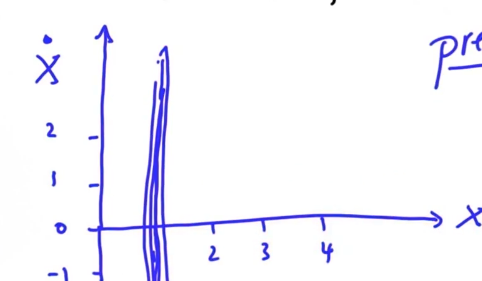

Where $\hat{x}$ represents the velocity and $x$ represents the location. In this first instance, we represent the measurement at with an elongated gaussian because the measurement does not tell us anything about the velocity. However, if we now draw our predicition, given by our motion model which is represented by the red gaussian distribution, we obtain:


Suppose we take a new measurement (a second observation) represeted by the green normal distribution (remember, it tells us nothing about the velocity), it only gives us information about the location as the first observation did. Then:


Multiply the prior (the red Gaussian) and the measurement (the green Gaussian) to obtain a really good estimate of an object's velocity and location (black distribution):

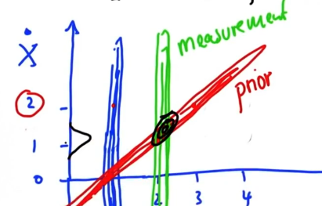

So we were able to infer the velocity by only observing the location.

## High Dimensional Spaces

Up until now we have generally been operating in a one dimensional space, however if we were to work withing higher dimensional spaces we would need to make use of Multivariate Gaussians. So a multivariate gaussian in a D-dimensional space is characterized as follows:

$$
\begin{aligned}
\mu = \begin{bmatrix}
\mu_0 \\
\vdots \\
\mu_D \\
\end{bmatrix},
\Sigma = \begin{bmatrix}
\sigma_{11} & \cdots & \sigma_{1D}\\
\vdots \\
\sigma_{D1} & \cdots & \sigma_{DD}\\
\end{bmatrix}
\end{aligned}
$$

Also de density function is now, for $x \in \mathbb{R}^D$:

$$
\begin{aligned}
f(x) = (2\pi)^{-\frac{D}{2}}|\Sigma|^{-\frac{1}{2}} \exp^{-\frac{1}{2}(x - \mu)^T\Sigma^{-1}(x-\mu)}
\end{aligned}
$$

Here are some [examples](#examples) of how the Kalman filter works for spaces with higher dimension:

## Put Everything Together

### Motion

At a given time $k-1$, we have the following prediction:

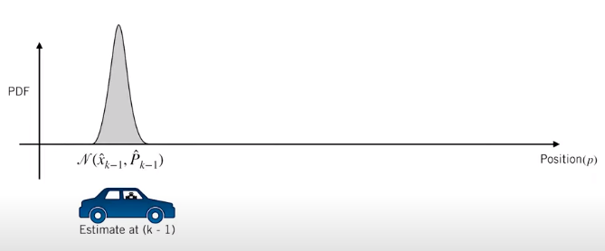

We use a motion model (in our case a gaussian that represents the movement) to update our prediction as follows:

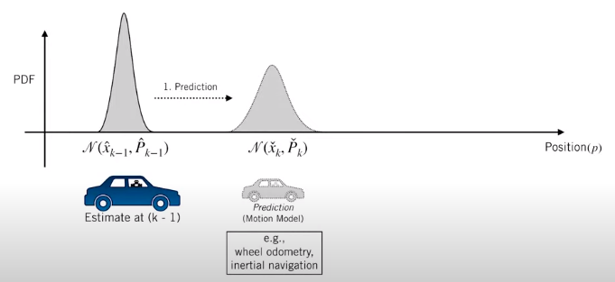

The motion model is described as follows:

$$
\begin{aligned}
x_k = F_{k-1}x_{k-1} + u_{k-1}
\end{aligned}
$$

Where:

- $F_{k-1}$ represents the transition function at time $k-1$
- $u_{k-1}$ represents the noise at time $k-1$

### Measurement

Then, we use the following observation model:

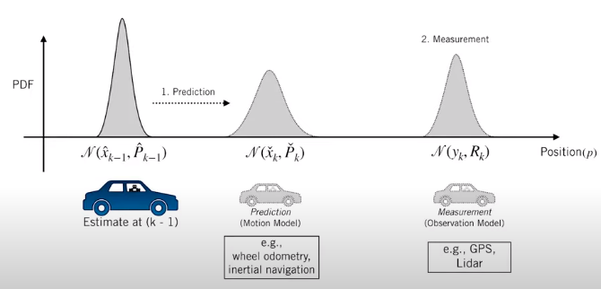

We correct our prediction with this observation model as follows:

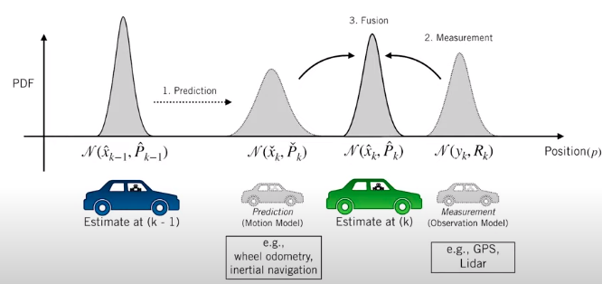

The measurement model is described as follows:

$$
\begin{aligned}
y_k = H_k x_k + v_k
\end{aligned}
$$

Where:

- $H_k$ is the measurement function at time $k$. This function maps the state into the observable state, that does not have to be the same (refer to [States](#states))
- $v_k$ is the noise at time $k$

### Iterative Process

First we make a prediction as to where the robot is at time $k$:

$$
\begin{aligned}
\check{x}_k = F_{k-1}x_{k-1}
\end{aligned}
$$

$$
\begin{aligned}
\check{P}_k = F_{k-1}\hat{P}_{k-1}F_{k-1}^T + Q_{k-1}
\end{aligned}
$$

Then we compute the optimal gain $K$ as follows:

$$
\begin{aligned}
K_k = \check{P}_kH_k^T(H_k\check{P}_kH^T+R_k)^{-1}
\end{aligned}
$$

This gain basically represents how much we trust our motion estimation versus our measurement estimation. Finally we obtain the correction using the measurement model:

- Shift the mean:

$$
\begin{aligned}
\hat{x}_k = \check{x}_k + K_k(y_k - H_k\check{x}_k)
\end{aligned}
$$

Where $y_k - H_k\check{x}_k$ represents the difference between the measurement and the prediction we made. Lastly, we update the covariance of our motion model:

- Update the variance:

$$
\begin{aligned}
\hat{P}_k = (1-K_kH_k)\check{P}_k
\end{aligned}
$$

## Algorithm

So in the Kalman Filter cycle what we do is: first we perform the prediction and the correction or measurement update. More concretely:

### Prediction

We apply the same formulas we defined in [Motion Model](#motion) and [Iterative Process](#iterative-process) to make a prediction:

$$
\begin{aligned}
x = Fx + u
\end{aligned}
$$

$$
\begin{aligned}
P = F \cdot P \cdot F^T
\end{aligned}
$$

### Measurement Update

Now, for the correction:

- First we compute the intermediate $S$ matrix, which equals the second part of the formula for $K$, $H_k\check{P}_kH^T+R_k$:

$$
\begin{aligned}
S = H \cdot P \cdot H^T + R
\end{aligned}
$$

- Then we compute the Kalman gain (as we defined in [Iterative Process](#iterative-process)):

$$
\begin{aligned}
K = PH^TS^{-1}
\end{aligned}
$$

- Obtain difference between measurement ($z = y_k$) and our prediction $H \cdot x = H_k\check{x}_k$ (note where $\check{x}_k$ comes from, $H$ is usually a matrix that selects a concrete part of the kalman state like the position. See [Examples](#examples)):

$$
\begin{aligned}
y = z - H \cdot x
\end{aligned}
$$

- Finally obtain the correction:

$$
\begin{aligned}
x' = x + (K \cdot y)
\end{aligned}
$$

$$
\begin{aligned}
P' = (I- K\cdot H) \cdot P
\end{aligned}
$$

### Code

The filter algorithm follows the same steps laid out in the previous section:

```python
def filter(x, P):
    for n in range(len(measurements)):

        # prediction
        x = (F * x) + u
        P = F ** P ** F.transpose()

        # measurement update
        Z = matrix([measurements[n]])
        y = Z.transpose() - (H * x)
        S = H ** P ** H.transpose() + R
        K = P ** H.transpose() ** S.inverse()
        x = x + (K * y)
        P = (I - (K ** H)) ** P

    return x, P
```

## Examples

### Design Kalman Filters for 2D

To design a Kalman Filter in two dimensions (position, velocity) you need two things:

- A state transition function, which is usually a matrix $F$:

$$
\begin{aligned}
\begin{bmatrix}
x \\
\hat{x} \\
\end{bmatrix}
\leftarrow
F
\begin{bmatrix}
x \\
\hat{x} \\
\end{bmatrix}
\end{aligned}
$$

- A measurement function, represented by the matrix $H$:

$$
\begin{aligned}
z
\leftarrow
H
\begin{bmatrix}
x \\
\hat{x} \\
\end{bmatrix}
\end{aligned}
$$

For example, suppose we update the location and the velocity as follows:

$$
\begin{aligned}
x' = x + \hat{x}
\end{aligned}
$$

$$
\begin{aligned}
\hat{x}' = \hat{x}
\end{aligned}
$$

Then the transition function is represented as the following matrix:

$$
\begin{aligned}
F = \begin{bmatrix}
1 & 1 \\
0 & 1 \\
\end{bmatrix}
\end{aligned}
$$

And for the measurement function, we only observe the location not the velocity, therefore:

$$
\begin{aligned}
H = \begin{bmatrix}
1 & 0 \\
\end{bmatrix}
\end{aligned}
$$

#### 4D Example

##### Motion

Given a state $(x, y, \hat{x}, \hat{y})$, where $(x, y)$ is the position and $(\hat{x}, \hat{y})$ is the velocity.If in each iteration the motion update for the state is:

$$
\begin{aligned}
\begin{matrix}
x + dt\cdot \hat{x} \\
y + dt\cdot \hat{y} \\
\hat{x} \\
\hat{y} \\
\end{matrix}
\end{aligned}
$$

So the position moves with time and the velocity does not change with time. Then the state transition function is represented by the following matrix:

$$
\begin{aligned}
F =
\begin{bmatrix}
1 & 0 & dt & 0\\
0 & 1 & 0 & dt\\
0 & 0 & 1 & 0\\
0 & 0 & 0 & 1\\
\end{bmatrix}
\end{aligned}
$$

##### Measurement

And, because we can only measure the position the measurement update is of the form:

$$
\begin{aligned}
z \leftarrow
\begin{bmatrix}
x \\
y \\
\end{bmatrix}
\leftarrow
H \cdot
\begin{bmatrix}
x \\
y \\
\hat{x} \\
\hat{y} \\
\end{bmatrix}
\end{aligned}
$$

Therefore the measurement function is represented as follows:

$$
\begin{aligned}
H =
\begin{bmatrix}
1 & 0 & 0 & 0 \\
0 & 1 & 0 & 0 \\
\end{bmatrix}
\end{aligned}
$$

### Code Example

So for the following data, which deals with 4D data, that is we store a 2D location and a 2D velocity vector in the state. We will have to take this into account in the different update matrices and uncertainty matrix:

```python
## Location measurements
measurements = [5., 10.], [6., 8.], [7., 6.], [8., 4.], [9., 2.], [10., 0.](5.,&#32;10.],&#32;[6.,&#32;8.],&#32;[7.,&#32;6.],&#32;[8.,&#32;4.],&#32;[9.,&#32;2.],&#32;[10.,&#32;0.)
## Initial location
initial_xy = [4., 12.]

dt = 0.1

x = matrix([initial_xy[0](initial_xy[0), [initial_xy[1]], [0.], [0.]]) # initial state (location and velocity)
u = matrix([0.], [0.], [0.], [0.](0.],&#32;[0.],&#32;[0.],&#32;[0.)) # external motion

## initial uncertainty: 0 for positions x and y, 1000 for the two velocities
## P = 0     0   0       0
##     0     0   0       0
##     0     0   1000    0
##     0     0   0       1000
P = matrix([0., 0., 0., 0.], [0., 0., 0., 0.], [0., 0., 1000., 0.], [0., 0., 0., 1000.](0.,&#32;0.,&#32;0.,&#32;0.],&#32;[0.,&#32;0.,&#32;0.,&#32;0.],&#32;[0.,&#32;0.,&#32;1000.,&#32;0.],&#32;[0.,&#32;0.,&#32;0.,&#32;1000.))
## next state function: generalize the 2d version to 4d
## F = 1     0   0.1     0
##     0     1   0       0.1
##     0     0   1       0
##     0     0   0       1
## So, velocity vector (x', y') does not change, and the position vector (x, y) is updated according to the velocity and dt
## F · x =   x + 0.1x'
##           y + 0.1y'
##           x'
##           y'
F = matrix([1., 0., dt, 0], [0, 1., 0, dt], [0, 0, 1., 0], [0, 0, 0, 1.](1.,&#32;0.,&#32;dt,&#32;0],&#32;[0,&#32;1.,&#32;0,&#32;dt],&#32;[0,&#32;0,&#32;1.,&#32;0],&#32;[0,&#32;0,&#32;0,&#32;1.))
## measurement function: reflect the fact that we observe x and y but not the two velocities
## H = 1     0   0       0
##     0     1   0       0
## So, for the measurement we only take into account the position vector (x,y) and not the velocity
## z = H · x =   x
##               y
H = matrix([1., 0., 0., 0.], [0., 1., 0., 0.](1.,&#32;0.,&#32;0.,&#32;0.],&#32;[0.,&#32;1.,&#32;0.,&#32;0.))
## measurement uncertainty: use 2x2 matrix with 0.1 as main diagonal
## R = 0.1   0
##     0     0.1
R = matrix([.1, 0.], [0., .1](.1,&#32;0.],&#32;[0.,&#32;.1))
## 4d identity matrix
## I = 1     0   0       0
##     0     1   0       0
##     0     0   1       0
##     0     0   0       1
I = matrix([1., 0., 0., 0.], [0., 1., 0., 0.], [0., 0., 1., 0.], [0., 0., 0., 1.](1.,&#32;0.,&#32;0.,&#32;0.],&#32;[0.,&#32;1.,&#32;0.,&#32;0.],&#32;[0.,&#32;0.,&#32;1.,&#32;0.],&#32;[0.,&#32;0.,&#32;0.,&#32;1.))
```

And we execute the filter:

```python
filter(x, P)
```

To obtain the following state $x$ and uncertainty matrix $P$:

```bash
x=
[9.999340731787717]
[0.001318536424568617]
[9.998901219646193]
[-19.997802439292386]

P=
[0.03955609273706198, 0.0, 0.06592682122843721, 0.0]
[0.0, 0.03955609273706198, 0.0, 0.06592682122843721]
[0.06592682122843718, 0.0, 0.10987803538073201, 0.0]
[0.0, 0.06592682122843718, 0.0, 0.10987803538073201]
```
