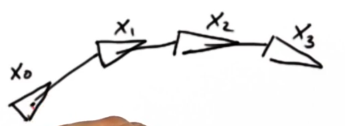
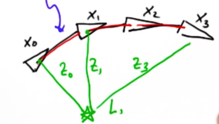

## Graph SLAM

Suppose we have a robot whose initial position is $x_0 = 0$ and $y_0 = 0$ at time $0$, then at time $1$ (because of how we mode our motion) the robot is at $x_1 = x_0 + 10$ and $y_1 = y_0$. However we know that our location is uncertain therefore the position at time $1$ is really described by a gaussian distribution centered around $10$ and with a given variance that signifies how certain we are about our position.

So to express this with a gaussian, that we do is define a distribution whose pdf peaks when $x_1 = x_0 + 10$ and $y_1 = y_0$, therefore we would like to maximize both the following equations:

$$
\begin{aligned}
\frac{1}{\sqrt{2\pi\sigma^2}}\exp{-\frac{1}{2}\frac{(x_1-x_0-10)^2}{\sigma^2}}
\end{aligned}
$$

$$
\begin{aligned}
\frac{1}{\sqrt{2\pi\sigma^2}}\exp{-\frac{1}{2}\frac{(y_1 - y_0)^2}{\sigma^2}}
\end{aligned}
$$

Here if $x_1 = x_0 + 10$, then $x_1 - x_0 - 10 = 0$ and if $y_1 = y_0$ ,then $y_1 - y_0 = 0$. These conditions we define are called constraints, so what Graph SLAM does is creating our probabilities defining a sequence of these constraints.

Suppose we have a robot that has followed the following path:

Where each $x_i$ is a vector (usually a three dimensional vector) Then Graph SLAM defines the following constraints:

- Initial position constraint: $x_0$
- Relative motion constraints: $(x-1 - x_0)$, $(x-2 - x_1)$, $(x-3 - x_2)$ (indicated by the red lines). Ideally these are the same as the robot motion (direction vector), however in reality it tends to bend to accommodate the map.
- Relative measurement constraints: these are the segment between each position vector (not necessarily every position vector) and each landmark defined in the map, and are also captured by gaussian distributions. In our case $z_0, z_1, z_2, z_3$, the lines colored in green.

After we have collected these constraints, what the algorithm does is it relaxes the position vectors $x_i$ to find the most likely configuration of robot path for the given landmarks (that is measurements of distance to the landmark).

## Constraint Matrix

To define our constraints, suppose we have 3 position vectors $x_0, x_1, x_2$ and two landmarks $L_0, L_1$, then we define the following matrix:

$$
\begin{array}{c}
  \begin{array}{c|ccccc}
    - & x_0 & x_1 & x_2 & L_0 & L_1
  \end{array} \\[5pt]
  \begin{matrix}
    x_0 \\ x_1 \\ x_2 \\ L_0 \\ L_1
  \end{matrix} \quad
  \begin{bmatrix}
    0.0 & 0.0 & 0.0 & 0.0 & 0.0 \\
    0.0 & 0.0 & 0.0 & 0.0 & 0.0 \\
    0.0 & 0.0 & 0.0 & 0.0 & 0.0 \\
    0.0 & 0.0 & 0.0 & 0.0 & 0.0 \\
    0.0 & 0.0 & 0.0 & 0.0 & 0.0
  \end{bmatrix} \quad
  \begin{bmatrix}
    0.0 \\ 0.0 \\ 0.0 \\ 0.0 \\ 0.0
  \end{bmatrix}
\end{array}
$$

We denote this structure as follows:

$$
\begin{aligned}
\Omega =
  \begin{bmatrix}
  0.0  &  0.0  &  0.0  &  0.0  &  0.0   \\
  0.0  &  0.0  &  0.0  &  0.0  &  0.0   \\
  0.0  &  0.0  &  0.0  &  0.0  &  0.0   \\
  0.0  &  0.0  &  0.0  &  0.0  &  0.0   \\
  0.0  &  0.0  &  0.0  &  0.0  &  0.0
  \end{bmatrix}
\end{aligned}
$$

and:

$$
\begin{aligned}
\xi =
  \begin{bmatrix}
  0.0 \\ 0.0 \\ 0.0 \\ 0.0 \\ 0.0
  \end{bmatrix}
\end{aligned}
$$

Suppose $x_0$ moves to $x_1$ by moving $5$ units to the right, that is $x_1 = x_0 + 5$, then we define this constrain in the matrix as follows:

$$
\begin{aligned}
\begin{array}{c}
  \begin{array}{c|ccccc}
    - & x_0 & x_1 & x_2 & L_0 & L_1
  \end{array} \\[5pt]
  \begin{matrix}
    x_0 \\ x_1 \\ x_2 \\ L_0 \\ L_1
  \end{matrix} \quad
  \begin{bmatrix}
    1.0  & -1.0  &  0.0  &  0.0  &  0.0 \\
   -1.0  &  1.0  &  0.0  &  0.0  &  0.0 \\
    0.0  &  0.0  &  0.0  &  0.0  &  0.0 \\
    0.0  &  0.0  &  0.0  &  0.0  &  0.0 \\
    0.0  &  0.0  &  0.0  &  0.0  &  0.0
  \end{bmatrix} \quad
  \begin{bmatrix}
    -5.0 \\ 5.0 \\ 0.0 \\ 0.0 \\ 0.0
  \end{bmatrix}
\end{array}
\end{aligned}
$$

Because given the initial constraint $x_1 = x_0 + 5$, if we move around the $x_i$ we get:

$$
\begin{aligned}
x_0 - x_1 = -5
\end{aligned}
$$

$$
\begin{aligned}
x_1 - x_0 = 5
\end{aligned}
$$

Now we add another constraint $x2 = x_1 - 4$, therefore:

$$
\begin{aligned}
x_2 - x_1 = -4
\end{aligned}
$$

$$
\begin{aligned}
x_1 - x_2 = 4
\end{aligned}
$$

So the constraint matrix is updated to:

$$
\begin{aligned}
\begin{array}{c}
  \begin{array}{c|ccccc}
    - & x_0 & x_1 & x_2 & L_0 & L_1
  \end{array} \\[5pt]
  \begin{matrix}
    x_0 \\ x_1 \\ x_2 \\ L_0 \\ L_1
  \end{matrix} \quad
  \begin{bmatrix}
    1.0  & -1.0  &  0.0  &  0.0  &  0.0 \\
   -1.0  &  1.0  &  0.0  &  0.0  &  0.0 \\
    0.0  &  0.0  &  0.0  &  0.0  &  0.0 \\
    0.0  &  0.0  &  0.0  &  0.0  &  0.0 \\
    0.0  &  0.0  &  0.0  &  0.0  &  0.0
  \end{bmatrix} \quad
  \begin{bmatrix}
    -5.0 \\ 5.0 \\ 0.0 \\ 0.0 \\ 0.0
  \end{bmatrix}
\end{array}
\end{aligned}
$$

We add a relative measurement constraint like $L_0 - x_1 = 9$, therefore:

$$
\begin{aligned}
L_0 - x_1 = 9
\end{aligned}
$$

$$
\begin{aligned}
x_1 - L_0 = -9
\end{aligned}
$$

So the constraint matrix is updated to:

$$
\begin{aligned}
\begin{array}{c}
  \begin{array}{c|ccccc}
    - & x_0 & x_1 & x_2 & L_0 & L_1
  \end{array} \\[5pt]
  \begin{matrix}
    x_0 \\ x_1 \\ x_2 \\ L_0 \\ L_1
  \end{matrix} \quad
  \begin{bmatrix}
    1.0  & -1.0  &  0.0  &  0.0  &  0.0 \\
   -1.0  &  3.0  & -1.0  & -1.0  &  0.0 \\
    0.0  & -1.0  &  1.0  &  0.0  &  0.0 \\
    0.0  & -1.0  &  0.0  &  1.0  &  0.0 \\
    0.0  &  0.0  &  0.0  &  0.0  &  0.0
  \end{bmatrix} \quad
  \begin{bmatrix}
    -5.0 \\ 0.0 \\ -4.0 \\ 9.0 \\ 0.0
  \end{bmatrix}
\end{array}
\end{aligned}
$$

Note that whenever we add a constraint to two parameters, let's say $x_1$ and $x_2$, we sum one to the diagonal element of the matrix corresponding to $x_1$ and $x_2$.

## Noise

Given the following motion:

We know that the localization of our robot is not an exact value, but is is modeled after a gaussian distribution, so $x_1 \sim \mathcal{N}(\mu_{x_1}, \sigma_{x_1})$ and $x_2 \sim \mathcal{N}(\mu_{x_2}, \sigma_{x_2})$. Suppose $\sigma_{x_1} = \sigma_{x_2}$. Then we want to maximize the expected value, which is given by the expressions:

$$
\begin{aligned}
\frac{1}{\sqrt{2\pi\sigma^2}}\exp{-\frac{1}{2}\frac{(x_1-x_0-10)^2}{\sigma^2}}
\end{aligned}
$$

$$
\begin{aligned}
\frac{1}{\sqrt{2\pi\sigma^2}}\exp{-\frac{1}{2}\frac{(x_2 - x_1 -5)^2}{\sigma^2}}
\end{aligned}
$$

To maximize both expressions means to maximize their product:

$$
\begin{aligned}
\max_{x_0, x_1, x_2} \frac{1}{\sqrt{2\pi\sigma^2}}\exp{-\frac{1}{2}\frac{(x_1-x_0-10)^2}{\sigma^2}} \cdot \frac{1}{\sqrt{2\pi\sigma^2}}\exp{-\frac{1}{2}\frac{(x_2 - x_1 -5)^2}{\sigma^2}}
\end{aligned}
$$

We also know that constants are irrelevant during maximization:

$$
\begin{aligned}
\max_{x_0, x_1, x_2} \exp{-\frac{1}{2}\frac{(x_1-x_0-10)^2}{\sigma^2}} \cdot \exp{-\frac{1}{2}\frac{(x_2 - x_1 -5)^2}{\sigma^2}}
\end{aligned}
$$

This maximization is equivalent to the maximization of its logarithm:

$$
\begin{aligned}
\max_{x_0, x_1, x_2} \log \left(\exp{-\frac{1}{2}\frac{(x_1-x_0-10)^2}{\sigma^2}} \cdot \exp{-\frac{1}{2}\frac{(x_2 - x_1 -5)^2}{\sigma^2}}\right)
\end{aligned}
$$

Because the logarithm of a product equal the sum of logarithms:

$$
\begin{aligned}
\max_{x_0, x_1, x_2} \left(\log \exp{-\frac{1}{2}\frac{(x_1-x_0-10)^2}{\sigma^2}}\right) + \left(\log \exp{-\frac{1}{2}\frac{(x_2 - x_1 -5)^2}{\sigma^2}}\right)
\end{aligned}
$$

Given $\log \exp (x) = x$:

$$
\begin{aligned}
\max_{x_0, x_1, x_2} \left(-\frac{1}{2}\frac{(x_1-x_0-10)^2}{\sigma^2}\right) + \left(-\frac{1}{2}\frac{(x_2 - x_1 -50)^2}{\sigma^2}\right)
\end{aligned}
$$

Again, constants are irrelevant:

$$
\begin{aligned}
\max_{x_0, x_1, x_2} \left(\frac{(x_1-x_0-10)^2}{\sigma^2}\right) + \left(\frac{(x_2 - x_1 -5)^2}{\sigma^2}\right)
\end{aligned}
$$

So, we end up with equations of the form:

$$
\begin{aligned}
\frac{1}{\sigma} x_1 - \frac{1}{\sigma} x_0 = \frac{10}{\sigma}
\end{aligned}
$$

Where now $\sigma$ symbolizes how confident you are in your location/measurement. Usually we define a $\sigma$ for the location and another $\sigma_{measurement}$ for the measurement (distance to the landmark).
