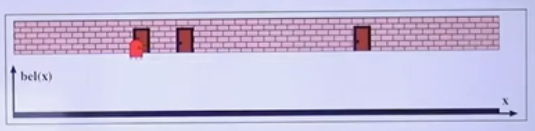
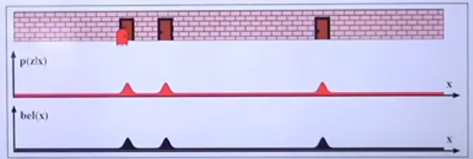
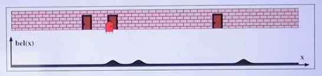
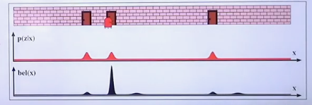
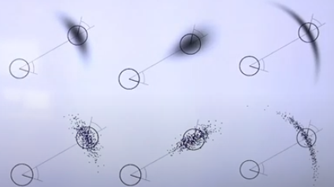
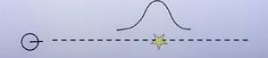

## State Estimation

State Estimation means we want to estimate the state of the system based on sensor measurements and control commands.

Thus, given observations $z$ and control commands $u$, estimate the current state $x$ at time $t$:

$$
\begin{aligned}
p(x_t|z_{1:t}, u_{1:t})
\end{aligned}
$$

## Recursive State Estimation

Recursive State Estimation means we want to update our belief based on the observation that comes in reusing the previous distribution that we had.

Therefore, using the previous definition of the current state, we would introduce recursion by computing $x_t$ based on the current measurement $z_t$, the current control command $u_t$ and the previous state $x_{t-1}$. The latter is in itself also defined recursively.

## Recursive Bayes Filter

### Intuition

We start with no knowledge of the environment, so our state is described by a uniform distribution, indicating we could be located at any point in space.

After receiving a measurement $z$, we update our belief. In this case we have sensed a door, and we know there are three doors in our map. Therefore the probability of obtaining the measurement $z$ given we are in front of that door is larger than in the other possible positions. So if we combine our previous belief with this measurement's probability distribution, our belief becomes:

Now we move forward, so we also have to shift our belief forward. Note, however, that our movement is not exact, there is also a level of uncertainty, so we describe it by using a distribution. Hence, when combining our previous belief with the probability distribution for the motion our certainty about our state decreases, and our belief becomes:

We receive yet another measurement $z$, again we have that $p(z|x)$ is larger on the locations where there is a door, because this measurement has sensed a door. So if we combine this probability distribution for this measurement with our previous state we increase our certainty about our current state. Therefor, our belief becomes:

### Derivation

The belief at time $t$ is given by:

$$
\begin{aligned}
bel(x_t) = p(x_t | z_{1:t}, u_{1:t})
\end{aligned}
$$

That is, where am I at moment $t$, given all previous observations $z_{1:t}$ and control commands $u_{1:t}$. We now apply Bayes rule, to swap $x_t$ and $z_t$ on the conditional probability:

$$
\begin{aligned}
= \eta \cdot p(z_t | x_t, z_{1:t-1}, u_{1:t}) \cdot p(x_t|z_{1:t-1}, u_{1:t})
\end{aligned}
$$

Where $\eta$ is a normalization constant. Now, let's pay attention to $p(z_t | x_t, z_{1:t-1}, u_{1:t})$. By the Markov assumption we are going to assume that the current state $x_t$ and the previous observations and control commands are conditionally independent. That is, they do not give any information about the likelihood of the observation $z_t$. Thus, we drop them from the equation:

$$
\begin{aligned}
= \eta \cdot p(z_t | x_t) \cdot p(x_t|z_{1:t-1}, u_{1:t})
\end{aligned}
$$

For $p(x_t|z_{1:t-1}, u_{1:t})$ we are going to use the law of Total Probability to add a new variable, so we integrate over this new variable. More concretely to add $x_{t-1}$, which will allow us to introduce recursion to our expression:

$$
\begin{aligned}
= \eta \cdot p(z_t | x_t) \cdot \int p(x_t | x_{t-1}, z_{1:t-1}, u_{1:t}) \cdot p(x_{t-1}|z_{1:t-1},u_{1:t}) dx_{t-1}
\end{aligned}
$$

We could interpret this rewritten expression as:

For each previous state $x_{t-1}$ we multiply

- $p(x_t | x_{t-1}, z_{1:t-1}, u_{1:t})$, the probability of being in the new state $x_t$ given the previous state $x_{t-1}$, observations $z_{1:t-1}$ and control commands $u_{1:t}$
- by $p(x_{t-1}|z_{1:t-1},u_{1:t})$, the probability of being in the state $x_{t-1}$ given the previous observations $z_{1:t-1}$ and control commands $u_{1:t}$

Once again we apply the Markov assumption over $p(x_t | x_{t-1}, z_{1:t-1}, u_{1:t})$, because knowing where I am at moment $t-1$, we assume the observations $z_{1:t-1}$ do not add any information. However note the control command does indeed hold valuable information, as it tells us action last executed that moved us from $x_{t-1}$ to $x_t$. So we simplify the expression as follows:

$$
\begin{aligned}
= \eta \cdot p(z_t | x_t) \cdot \int p(x_t | x_{t-1}, u_{1:t}) \cdot p(x_{t-1}|z_{1:t-1},u_{1:t}) dx_{t-1}
\end{aligned}
$$

We now suppose that knowing what action or command is executed in the future does not tell us anything about the present. Hence we ignore the latest control command $u_t$, so the expression becomes:

$$
\begin{aligned}
= \eta \cdot p(z_t | x_t) \cdot \int p(x_t | x_{t-1}, u_{1:t}) \cdot p(x_{t-1}|z_{1:t-1},u_{1:t-1}) dx_{t-1}
\end{aligned}
$$

Note that we have finally derived a recursive expression for our belief, given:

$$
\begin{aligned}
bel(x_{t-1}) = p(x_{t-1}|z_{1:t-1}, u_{1:t-1})
\end{aligned}
$$

We substitute this expression in the belief at time $t$:

$$
\begin{aligned}
= \eta \cdot p(z_t | x_t) \cdot \int p(x_t | x_{t-1}, u_{1:t}) \cdot bel(x_{t-1}) dx_{t-1}
\end{aligned}
$$

### Prediction and Correction Step

Usually the Bayes Filter is broken up into:

- Prediction step: estimates where the future state is based on the control command at time $t$ and makes use of the motion model.
  - Motion model: $p(x_t | x_{t-1}, u_{1:t})$
    $$
    \begin{aligned}
    \hat{bel}(x_t) = \int p(x_t | x_{t-1}, u_{1:t}) \cdot bel(x_{t-1}) dx_{t-1}
    \end{aligned}
    $$
- Correction step: we get an observation that we use to correct potential mistakes we make in the prediction step. This correction is made using the observation or measurement model.
  - Observation model: $p(z_t | x_t)$
    $$
    \begin{aligned}
    bel(x_t) = \eta \cdot p(z_t | x_t) \cdot \hat{bel}(x_t)
    \end{aligned}
    $$

### Implementation

In order to implement a Bayes Filter we need to define certain things:

- Specify the motion model
- Specify the observation model
- Specify the belief
- How do we move from one state to the next (i.e. linear model, non-linear model)

## Popular Filters

- Kalman Filters and EFK
  - Use Gaussians to represent the belief, motion model and observation model
  - They use linear or linearized models
- Particle Filter
  - The can use arbitrary models to represent state, motion model and observation model

## Model Examples

### Motion model

Given a current state $x_t$, the motion model could look like:

In the first case, let's suppose a point represents the next state $x_{t+1}$ after the control command is applied. If we execute our system $n$ times, we get $n$ estimations that are illustrated by the $n$ points in the graph. They represent an approximation of the distribution that describes our predicted state (illustrated by the graph in the upper left corner). This distribution is our motion model at time $t+1$.

For the two middle graphs, we can deduce that our system is certain about the angle of motion, however it shows more uncertainty about the distance. Finally in the last two graphs we see the opposite. The system knows how much we moved, that is the distance, but is uncertain about the angle of movement.

### Measurement model

Suppose we have a sensor that tell us the distance between us and the closest obstacle in front of us. We know that this sensor is noisy, so to mimic that noise we can describe the measurement model as a normal distribution.

In the previous image, the star represents the closest obstacle, and we use the Gaussian distribution to describe how likely it is of obtaining a given measurement. Observe that the further we move away from the actual obstacle the lower is the probability of that measurement taking place.
