## Introduction

Suppose your position on a 2D plane is given by the black dot:

Let's say you get your estimate as to where you are, inferred from a certain control command. For example if you are trying to move forward in the same direction you estimate your new position will be the cross:

This is will be the prediction step. Now suppose you get an observation about the distance to the nearest lighthouse:

So now we can perform our new state estimate by combining by the means of a weighted sum our prediction along with the measurement:

This weighted sum is performed trading off how certain you are about your prediction and how certain you are about your observation.

## Properties of Gaussian Distributions

In order to derive and prove some parts of the Kalman Filter we exploit the following properties:

- The product of two Gaussian is a Gaussian.
- A Gaussian stays Gaussian under linear transformations
- The marginal and conditional distribution of a Gaussian is a Gaussian

## Linear Model

What does it mean when we say the Kalman Filter uses linear models? This means that both the motion model and the observation model can be expressed through a linear function, that is:

$$
\begin{aligned}
f(x) = Ax + b
\end{aligned}
$$

One important property is that if a Gaussian distribution is transformed through a linear function it stays Gaussian.

Also, we introduce noise by using a zero mean Gaussian distribution.

### Models

The motion model is defined as follows:

$$
\begin{aligned}
\overline{x}_t = A_t x_{t-1} + B_tu_t + \epsilon_t
\end{aligned}
$$

Where $x_{t-1}$ is the previous state estimate, $u_t$ is the control command at time $t$ and $\epsilon_t$ is Gaussian noise. Let's dive a little deeper:

- $A_t$ is a matrix $n \times n$ (a mapping between the state space and the state space) which tells us how the state evolves from $t-1$ to $t$ without control commands or noise. We can use this matrix to encode information about velocity, acceleration, etc.
- $B_t$ is a matrix $n \times l$ (a mapping between the control space and the state space) that describes how the control command $u_t$ changes the state from $t_1$ to $t$.
- $\epsilon_t$ is a random variable that represents the motion noise with covariance $R_t$.

The observation model is defined as follows:

$$
\begin{aligned}
z_t = C_t \overline{x}_t + \delta_t
\end{aligned}
$$

Where $\overline{x}_t$ is the estimated state and $\delta_t$ is Gaussian noise.

- $C_t$ is a matrix $k \times n$ which describes a mapping between the state $\overline{x}_t$ to an observation $z_t$.
- $\delta_t$ is a random variable that represents the observation noise with covariance $Q_t$.

### Linear Motion Model

Now that we have defined our linear models, we are going to show how to express the motion under a Gaussian:

$$
\begin{aligned}
p(x_t|x_{t-1}, u_t) = \det(2\pi R_t)^{-\frac{1}{2}} \exp(-\frac{1}{2}(x_t - A_tx_{t-1} - B_tu_t)^TR^{-1}_t(x_t - A_tx_{t-1} - B_tu_t))
\end{aligned}
$$

Which means we are obtaining the value of a probability distribution that incorporates our linear model for the prediction:

$$
\begin{aligned}
p(x_t|x_{t-1}, u_t) \sim \mathcal{N}(A_tx_{t-1} + B_tu_t, R_t)
\end{aligned}
$$

### Linear Observation Model

We will apply the same reasoning to obtain the observation model under a Gaussian:

$$
\begin{aligned}
p(z_t|x_t) = \det(2\pi Q_t)^{-\frac{1}{2}} \exp(-\frac{1}{2}(z_t - C_t\overline{x}_t)^TQ^{-1}_t(z_t - C_t\overline{x}_t))
\end{aligned}
$$

Which means we are obtaining the difference between the observation $z_t$ and what I expect to observe $\overline{x}_{t}$ ($z_t - C\overline{x}_t$) while also taking the uncertainty into account $Q_t^{-1}$. We compute this incorporating our linear model for the correction step:

$$
\begin{aligned}
p(z_t|x_t) \sim \mathcal{N}(C_t\overline{x}_t, Q_t)
\end{aligned}
$$

## Gaussian World

As we have said, we are assuming everything is Gaussian. Up until now we have described our models by using Gaussian distributions, however we still have to make sure these are maintained when we are performing the prediction and the update. So, given the belief at time $t$:

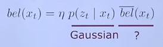

If we suppose $\overline{bel}(x_t)$ is Gaussian, then $bel(x_t)$ is Gaussian because the product of Gaussian distribution is a Gaussian distribution. Therefore we need to show that $\overline{bel}(x_t)$ is also Gaussian. That is:

$$
\begin{aligned}
\overline{bel}(x_t) = \int p(x_t|u_t,x_{t-1})bel(x_{t-1})dx_{t-1}
\end{aligned}
$$

We know, by its definition, that $p(x_t|u_t,x_{t-1})$ is Gaussian, and also we can prove by mathematical induction that $bel(xx_{t-1})$ is Gaussian. Because if we start from a Gaussian distributed belief and everything stays Gaussian then the belief at time $t-1$ will also be Gaussian.

Noting that the convolution of two Gaussian stays Gaussian we conclude that $\overline{bel}(x_t)$ is Gaussian and thus $bel(t)$ is also Gaussian. Let's show however that the integral preserves the Gaussian. Note that we can express the predicted belief by using our linear models as follows:

$$
\begin{aligned}
\overline{bel}(x_t) = \int p(x_t|u_t,x_{t-1}) bel(x_{t-1})dx_{t-1}
\end{aligned}
$$

$$
\begin{aligned}
= \int \det(2\pi R_t)^{-\frac{1}{2}} \exp(-\frac{1}{2}(x_t - A_tx_{t-1} - B_tu_t)^TR^{-1}_t(x_t - A_tx_{t-1} - B_tu_t))bel(x_{t-1})dx_{t-1}
\end{aligned}
$$

$$
\begin{aligned}
= \eta \int \exp(-\frac{1}{2}(x_t - A_tx_{t-1} - B_tu_t)^TR^{-1}_t(x_t - A_tx_{t-1} - B_tu_t))bel(x_{t-1})dx_{t-1}
\end{aligned}
$$

$$
\begin{aligned}
= \eta \int \exp(-\frac{1}{2}(x_t - A_tx_{t-1} - B_tu_t)^TR^{-1}_t(x_t - A_tx_{t-1} - B_tu_t)) exp(-\frac{1}{2}(x_{t-1} - \mu_{t-1})^T\Sigma_{t-1}^{-1}(x_{t-1} - \mu_{t-1}))
\end{aligned}
$$

Where $exp(-\frac{1}{2}(x_{t-1} - \mu_{t-1})^T\Sigma_{t-1}^{-1}(x_{t-1} - \mu_{t-1}))$ is the expected value of the Gaussian that describes our previous belief $bel(x_{t-1})$.

Now, we combine both exponentials, given $exp(x) \cdot exp(y) = exp(x + y)$:

$$
\begin{aligned}
\overline{bel}(x_t) = \eta \int \exp(-L_t)dx_{t-1}
\end{aligned}
$$

Given:

$$
\begin{aligned}
L_{t} = \frac{1}{2}(x_t - A_tx_{t-1} - B_tu_t)^TR^{-1}_t(x_t - A_tx_{t-1} - B_tu_t)
\end{aligned}
$$

$$
\begin{aligned}
+ \frac{1}{2}(x_{t-1} - \mu_{t-1})^T\Sigma_{t-1}^{-1}(x_{t-1} - \mu_{t-1})
\end{aligned}
$$

We can split $L_t$ up in a part that only depends on $x_t$ and another part that depends on $x_t, x_{t-1}$. Such that:

$$
\begin{aligned}
L_t = L_t(x_{t-1}, x_t) + L_t(x_t)
\end{aligned}
$$

Thus:

$$
\begin{aligned}
\overline{bel}(x_t) = \eta \int \exp(-L_t(x_{t-1}, x_t) -L_t(x_t))dx_{t-1}
\end{aligned}
$$

$$
\begin{aligned}
\overline{bel}(x_t) = \eta \exp(-L_t(x_t)) \int \exp(-L_t(x_{t-1}, x_t) )dx_{t-1}
\end{aligned}
$$

This way we have:

- $\exp(-L_t(x_t))$: Gaussian distribution
- $\int \exp(-L_t(x_{t-1}, x_t) )dx_{t-1}$: this is the marginalization of a Gaussian of the variable $x_{t-1}$, which happens to also be a Gaussian.

Therefore we have shown that everything stays Gaussian:

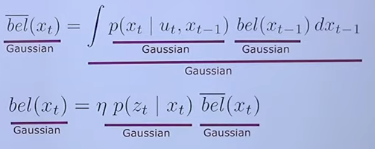

## Representing the Belief

We have said that everything is Gaussian, which includes our belief. This belief will be represented, like any other Gaussian is, by its mean $\mu$ and variance $\Sigma$. So our belief at time $t$ would be represented by $(\mu_t, \Sigma_t)$.

## Algorithm

The Kalman Filter algorithm is defined as follows:

- Inputs:
  - $\mu_{t-1}$: previous mean that describes our belief at time $t-1$
  - $\Sigma_{t-1}$: previous covariance that describes our uncertainty at time $t-1$
  - $z_t$: the observation at time $t$.
  - $u_t$: the control command at time $t$.

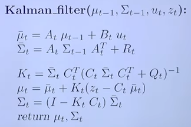

The algorithm is, as usual, divided into a prediction step and a correction step:

In the prediction step we estimate our next belief, described by a Gaussian $\overline{bel}(x_t) \sim \mathcal{N}(\overline{\mu_t}, \overline{\Sigma_t})$.

- First we compute our new estimated mean \(\overline{\mu}_t\) by multiplying our transformation function $A_t$ by the previous mean \(\mu_{t-1}\) which tells us how the state evolves generally without any motion added to it (i.e. velocity, acceleration, etc). To add the motion we add $B_t u_{t}$.

- Then we update our uncertainty. The estimate of the new covariance is derived from how a Gaussian changes through a linear transformation, thus we compute $A_t \Sigma_{t-1} A_t^T$. We also add additional noise that the motion adds to the new belief by adding $R_t$.

The we apply the correction step: what we mainly do is computing the weighted sum between two distributions

- First we obtain the weighting factor $K_t$, also known as the Kalman Gain. This equals a ratio between the prediction and the observation.
  - Here we use $C_t^T$ to map our uncertainty from the state space to the observation space.
  - On the denominator we map our uncertainty onto the observation space and we also add the measurement noise $Q_t$
  - Then we divide the two terms to obtain a factor that tells us if we trust more the prediction or the correction.
- Then we modify our estimated mean $\overline{\mu}_{t}$ with a weighted correction:
  - We compute the error between what we observed and what we predicted $z_t - C_t \overline{\mu}_t$ (again $C$ to map to the observation space).
  - Then we change the estimated state by this error pondered by $K$.
- We also update our uncertainty

## Assumptions

We can apply the Kalman Filter as long as the two following assumptions hold:

- Everything is Gaussian
- The motion and observation model are linear

However, what if this is not the case?

## Extended Kalman Filter

### Local Linearization

In order to perform local linearization what we do is approximate the non-linear functions $g$ and $h$ by the means of the Taylor Expansion. Thus we re-define our non-linear functions as follows:

The linearization for prediction step consists of linearizing around our previous state $x_{t-1} = (\mu_{t-1}, \Sigma_{t-1})$and is described as follows:

$$
\begin{aligned}
g(u_t, x_{t-1}) \approx g(u_t, \mu_{t-1}) + \frac{\delta g(u_t, \mu_{t-1})}{\delta x_{t-1}}(x_{t-1} - \mu_{t-1})
\end{aligned}
$$

- $g(u_t, \mu_{t-1})$ is the value of our non-linear model at the linearization point $\mu_{t-1}$, which corresponds to our previous belief.
- $G_t = \frac{\delta g(u_t, \mu_{t-1})}{\delta x_{t-1}}$ is the slope of the local linearization at $x_{t-1}$. This is a first partial derivative which constitutes a Jacobian.
- $(x_{t-1} - \mu_{t-1})$ tells us how far we are away from the linearization point $\mu_{t-1}$.

For the correction step we linearize around our predicted state $\overline{x}_t = (\overline{\mu}_t, \overline{\Sigma}_t)$:

$$
\begin{aligned}
h(x_t) \approx h(\overline{\mu}_t) + \frac{\delta h(\overline{\mu}_t)}{\delta x_t} (x_t - \overline{\mu}_t)
\end{aligned}
$$

- $h(\overline{\mu}_t)$ is the value of our non-linear observation model at the linearization point, which now is the predicted belief, that is the best estimate that I have.
- $H_t = \frac{\delta h(\overline{\mu}_t)}{\delta x_t}$ is the Jacobian that equals the slope at the linearization point.
- $(x_t - \overline{\mu}_t)$ signifies how far away is the variable $x_t$ to our linearization point $\overline{\mu}_t$.

#### Jacobian

Given a function $f: \mathbb{R}^n \rightarrow \mathbb{R}^m$, such that given $x \in \mathbb{R}^n$, $x \mapsto f(x) \in \mathbb{R}^{m}$. Then the Jacobian has the following shape:

$$
\begin{aligned}
J = \begin{bmatrix}
\frac{\delta f_1}{\delta x_1} & \frac{\delta f_1}{\delta x_2} & \cdots & \frac{\delta f_1}{\delta x_n}  \\
\vdots & \cdots & \cdots & \vdots \\
\frac{\delta f_m}{\delta x_1} & \frac{\delta f_m}{\delta x_2} & \cdots & \frac{\delta f_m}{\delta x_n}
\end{bmatrix} \in \mathbb{R}^{m \times n}
\end{aligned}
$$

And we can illustrate it graphically:

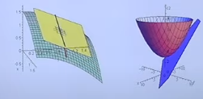

As you can see, for points close to the linearization point, it constitutes a good approximation, but the further we move away the bigger the error is.

So, let's revisit the transformation of our Gaussian belief. Remember we had, the following non-linear transformation:

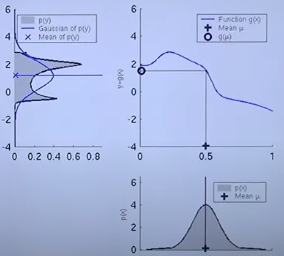

What we do now, is take the mean of our belief $\mu_t$ and approximate it locally with a linear function by using the Taylor Expansion as we have explained before. And then we transform our Gaussian belief with this linear approximation (represented by the red line) which results in the following transformation:

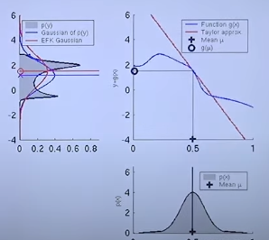

#### Error Under Local Linearization

When we perform local linearization the error depends on to factors:

- The difference between the non-linear function and its linear approximation
- The uncertainty of our original Gaussian distribution. Because the larger the uncertainty, more probability mass will fall farther from our linearization point (the mean of that same Gaussian distribution), and remember that the further we are from the linearization point the worse the approximation is, and thus the bigger the error is.

### Linearized Motion Model

We defined our linear motion model as follows:

$$
\begin{aligned}
p(x_t|x_{t-1}, u_t) = \det(2\pi R_t)^{-\frac{1}{2}} \exp(-\frac{1}{2}(x_t - A_tx_{t-1} - B_tu_t)^TR^{-1}_t(x_t - A_tx_{t-1} - B_tu_t))
\end{aligned}
$$

If our world is non-linear we substitute

$$
\begin{aligned}
x_t = A_tx_{t-1} + B_tu_t + \epsilon_t
\end{aligned}
$$

for

$$
\begin{aligned}
x_t = g(u_t, x_{t-1}) + \epsilon_t
\end{aligned}
$$

Therefore the motion model is expressed as follows:

$$
\begin{aligned}
p(x_t|x_{t-1}, u_t) = \det(2\pi R_t)^{-\frac{1}{2}} \exp(-\frac{1}{2}(x_t - g(u_t, x_{t-1}))^TR^{-1}_t(x_t - g(u_t, x_{t-1})))
\end{aligned}
$$

Finally we find a linear approximation, such that:

$$
\begin{aligned}
g(u_t, x_{t-1}) \approx g(u_t, \mu_{t-1}) + \frac{\delta g(u_t, \mu_{t-1})}{\delta x_{t-1}}(x_{t-1} - \mu_{t-1}) = g(u_t, \mu_{t-1}) + G_t(x_{t-1} - \mu_{t-1})
\end{aligned}
$$

And the linearized motion model becomes:

$$
\begin{aligned}
p(x_t|x_{t-1}, u_t) = \det(2\pi R_t) ^{-\frac{1}{2}} \cdot
\end{aligned}
$$

$$
\begin{aligned}
\cdot \exp(-\frac{1}{2}(x_t - g(u_t, \mu_{t-1}) - G_t(x_{t-1} - \mu_{t-1}))^TR^{-1}_t \cdot
\end{aligned}
$$

$$
\begin{aligned}
\cdot (x_t - g(u_t, \mu_{t-1}) - G_t(x_{t-1} - \mu_{t-1})))
\end{aligned}
$$

Where $R^{-1}_t$ describes the motion noise.

### Linearized Observation Model

We defined our linear observation model as follows:

$$
\begin{aligned}
p(z_t|x_t) = \det(2\pi Q_t)^{-\frac{1}{2}} \exp(-\frac{1}{2}(z_t - C_tx_t)^TQ^{-1}_t(z_t - C_tx_t))
\end{aligned}
$$

If our world is non-linear we substitute

$$
\begin{aligned}
z_t = C_t x_t + \delta_t
\end{aligned}
$$

for

$$
\begin{aligned}
z_t = h(x_t) + \delta_t = h(\overline{\mu}_t) + \delta_t
\end{aligned}
$$

Note that $x_t = \overline{\mu}_t$ here refers to our best estimation up until now, that comes from the prediction step. Therefore the observation model is expressed as follows:

$$
\begin{aligned}
p(z_t|x_t) = \det(2\pi Q_t)^{-\frac{1}{2}} \exp(-\frac{1}{2}(z_t - h(\overline{\mu}_{t}))^TQ^{-1}_t(z_t - h(\overline{\mu}_{t})))
\end{aligned}
$$

Finally we find a linear approximation, such that:

$$
\begin{aligned}
h(x_t) \approx h(\overline{\mu}_t) + \frac{\delta h(\overline{\mu}_t)}{\delta x_t} (x_t - \overline{\mu}_t) = h(\overline{\mu}_t) + H_t (x_t - \overline{\mu}_t)
\end{aligned}
$$

And the linearized observation model becomes:

$$
\begin{aligned}
p(z_t|x_t) = \det(2\pi Q_t)^{-\frac{1}{2}} \cdot
\end{aligned}
$$

$$
\begin{aligned}
\cdot \exp(-\frac{1}{2}(z_t - h(\overline{\mu}_t) - H_t (x_t - \overline{\mu}_t))^TQ^{-1}_t \cdot
\end{aligned}
$$

$$
\begin{aligned}
\cdot (z_t - h(\overline{\mu}_t) - H_t (x_t - \overline{\mu}_t)))
\end{aligned}
$$

Where $Q^{-1}_t$ describes the measurement noise.

### Algorithm

To take into account the linearized models, we have to make a few changes to the Kalman Filter Algorithm:

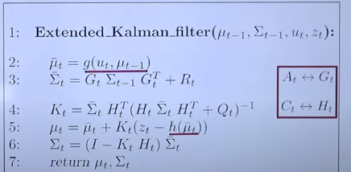

- The first thing that changes is that we use our linearized moition model $g(u_t, \mu_{t-1})$ to obtain our predicted estate $\overline{x}_t = (\overline{\mu}_t, \overline{\Sigma}_t)$
- We use the Jacobian $G_t$ to transform our previous uncertainty $\Sigma_{t-1}$, given the Jacobian is the linear transformation that approximates the non-linear transformation we defined originally for our motion model.
- Same thing goes for the correction step. We use the Jacobian $H_t$ to apply a linear transformation that allows us to map $\overline{\Sigma}_t$ from the state space to the observation space, and thus calculate the Kalman Gain taking into account the measurement noise.
- Then we compute the corrected mean of the estimated state $x_t$ by obtaining the weighted sum of the mean of the predicted state $\overline{\mu}_t$ and the correction factor. This correction factor equals the difference between the actual measurement $z_t$ and the mapping of the predicted state to the observation space given by our linearized function $h(\overline{\mu}_t)$. This mapping equals the expected measurement given our state is $\overline{\mu}_t$.
- We do the same thing for the uncertainty $\Sigma_t$.

#### Kalman Gain

Suppose you have a perfect sensor, that is we trust completely the values given by this sensor and thus we set the measurement noise to be equal to zero ($Q_t = 0$). Then, the Kalman Gain becomes:

$$
\begin{aligned}
K_t = \overline{\Sigma}_t H_t^T \cdot (H_t \overline{\Sigma}_t H_t^T + Q_t)^{-1}
\end{aligned}
$$

$$
\begin{aligned}
K_t = \overline{\Sigma}_t H_t^T \cdot (H_t \overline{\Sigma}_t H_t^T + 0)^{-1}
\end{aligned}
$$

$$
\begin{aligned}
K_t = \overline{\Sigma}_t H_t^T \cdot (H_t^T)^{-1} \overline{\Sigma}_t^{-1} H_t^{-1}
\end{aligned}
$$

$$
\begin{aligned}
K_t = \overline{\Sigma}_t I \overline{\Sigma}_t^{-1} H_t^{-1}
\end{aligned}
$$

$$
\begin{aligned}
K_t = I H_t^{-1} = H_t^{-1}
\end{aligned}
$$

So, when we perform the correction over the mean of our belief:

$$
\begin{aligned}
\mu_t = \overline{\mu}_t + K_t (z_t - h(\overline{\mu}_t))
\end{aligned}
$$

$$
\begin{aligned}
\mu_t = \overline{\mu}_t + H_t^{-1} (z_t - h(\overline{\mu}_t))
\end{aligned}
$$

$$
\begin{aligned}
\mu_t = \overline{\mu}_t + H_t^{-1} z_t - H_t^{-1}h(\overline{\mu}_t)
\end{aligned}
$$

With $H_t^{-1}h(\overline{\mu}_t)$ what we are doing is, first computing $h(\overline{\mu}_t)$ to map $\overline{\mu}_t$ to the observation space, and the undoing this mapping with $H_t^{-1}$, which means:

$$
\begin{aligned}
\mu_t = \overline{\mu}_t + H_t^{-1} z_t - \overline{\mu}_t
\end{aligned}
$$

$$
\begin{aligned}
\mu_t = \overline{\mu}_t - \overline{\mu}_t + H_t^{-1} z_t
\end{aligned}
$$

$$
\begin{aligned}
\mu_t = H_t^{-1} z_t
\end{aligned}
$$

Where $H_t^{-1}$ maps $z_t$ from the observation space to the state space, and this means in this update we trust our observation completely, and therefore our estate equals the observation.

On the contrary, suppose the sensor is very unreliable, and so the noise is set to be infinity. Then the correction step is executed as follows:

$$
\begin{aligned}
K_t = \overline{\Sigma}_t H_t^T \cdot (H_t \overline{\Sigma}_t H_t^T + Q_t)^{-1}
\end{aligned}
$$

$$
\begin{aligned}
K_t = \overline{\Sigma}_t H_t^T \cdot (H_t \overline{\Sigma}_t H_t^T + \infty)^{-1}
\end{aligned}
$$

Because we are dividing by infinity, $K_t = 0$. So the mean of our belief is computed as follows:

$$
\begin{aligned}
\mu_t = \overline{\mu}_t + K_t (z_t - h(\overline{\mu}_t))
\end{aligned}
$$

$$
\begin{aligned}
\mu_t = \overline{\mu}_t + 0 (z_t - h(\overline{\mu}_t))
\end{aligned}
$$

$$
\begin{aligned}
\mu_t = \overline{\mu}_t
\end{aligned}
$$

Hence, if the measurement is too noisy, we only take into account our predicted state.

### Localization Example

Localization Example using Extended Kalman Filter (from 11'):



## Unscented Kalman Filter

### Numerical solution

- Generate $N$ samples from the original distribution

$$
\begin{aligned}
x_i \sim \mathcal{N}(\overline{X}, \Sigma_X)
\end{aligned}
$$

$$
\begin{aligned}
i=1, \cdots, N
\end{aligned}
$$

- For each sample $x_i$ apply the non-linear transformation to find the corresponding $y_i$

$$
\begin{aligned}
y_i = f(x_i)
\end{aligned}
$$

- Fit a gaussian to the transformed points

$$
\begin{aligned}
\overline{Y} = \frac{1}{N}\sum^N y_i
\end{aligned}
$$

$$
\begin{aligned}
\Sigma_y = \frac{1}{N} \sum^N (y_i - \overline{Y}) (y_i - \overline{Y})^T
\end{aligned}
$$

### Selecting less points to sample

Let $x$ be a $n \times 1$ random vector with mean $\overline{x}$ and covariance $P$, that is $x \sim \mathcal{N}(\overline{x}, P)$

We choose $2n$ sigma points as follows:

$$
\begin{aligned}
x^{(i)} = \overline{x} + \Delta x^{(i)}
\end{aligned}
$$

$$
\begin{aligned}
i=1, \cdots, 2n
\end{aligned}
$$

Where:

$$
\begin{aligned}
\Delta x^{(i)} = (\sqrt{nP})_i
\end{aligned}
$$

$$
\begin{aligned}
i=1, \cdots, n
\end{aligned}
$$

which means $\Delta x^{(i)}$ is the i-th column of the covariance matrix multiplied by $\sqrt{n}$. For a $2\times 1$ state vector, this gives us the two following points:

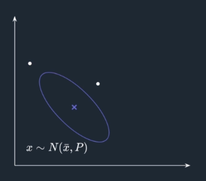

We do the same, but inversing, for the remaining $n$ points:

$$
\begin{aligned}
\Delta x^{(n+i)} = -(\sqrt{nP})_i
\end{aligned}
$$

$$
\begin{aligned}
i=1, \cdots, n
\end{aligned}
$$

Such that we obtain:

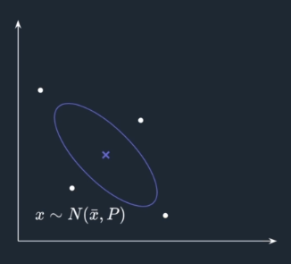

From the following image we can see the $4$ points we obtained seem to be a good approximation of the shape of the ellipse:

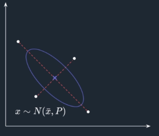

So we can use these points to obtain the new ellipse which resulted from applying the transformation.

#### Mean approximation

- We apply the non-linear transformation to the sigma points:

$$
\begin{aligned}
y^{(i)} = h(x^{(i)}), i = 1, \cdots, 2n
\end{aligned}
$$

Such that we have the following situation:

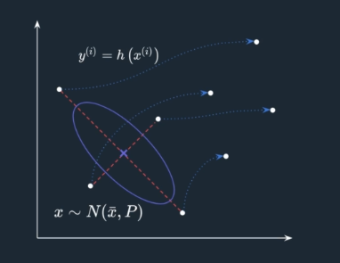

We obtain the weighted mean of the transformed sigma points:

$$
\begin{aligned}
\overline{y} = \sum_{i=1}^{2n} W^{(i)} y^{(i)}
\end{aligned}
$$

Where $W^{(i)} = \frac{1}{2n}$. Such that:

$$
\begin{aligned}
\overline{y} = \frac{1}{2n} \sum_{i=1}^{2n} y^{(i)}
\end{aligned}
$$

And so, we obtain the following estimated mean:

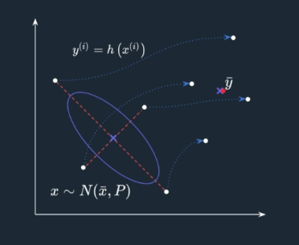

#### Covariance approximation

We apply this same methodology for the covariance, given the transformed points $y^{(i)}$ we obtain the weighted covariance:

$$
\begin{aligned}
P_y = \sum_{i=1}^{2n} W^{(i)} (y^{(i)} - \overline{y})(y^{(i)} - \overline{y})^T
\end{aligned}
$$

$$
\begin{aligned}
= \frac{1}{2n} \sum_{i=1}^{2n}(y^{(i)} - \overline{y})(y^{(i)} - \overline{y})^T
\end{aligned}
$$

Which given us the following estimated covariance:

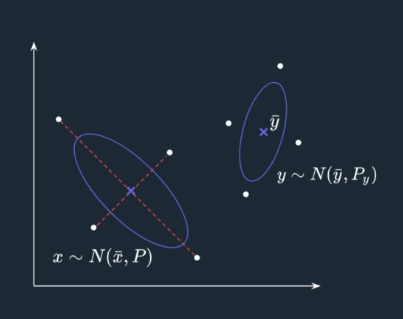

### General Unscented Transformation

We now show a general definition which allows for more accuracy:

#### Sigma points generation

We generate $2n+1$ instead of $2n$ and we define $x^{(0)}$ such that it equals the mean:

$$
\begin{aligned}
x^{(i)} = \overline{x} + \Delta x^{(i)}, i=0, \cdots, 2n
\end{aligned}
$$

$$
\begin{aligned}
\Delta x^{(0)} = 0
\end{aligned}
$$

$$
\begin{aligned}
\Delta x^{(i)} = \left(\sqrt{(n+k)P}\right)_i, i=1, \cdots, n
\end{aligned}
$$

$$
\begin{aligned}
\Delta x^{(n+i)} = -\left(\sqrt{(n+k)P}\right)_i, i=1, \cdots, n
\end{aligned}
$$

#### Weight definition

The weights are now defined as follows:

$$
\begin{aligned}
W^{(0)} = \frac{k}{n+k}
\end{aligned}
$$

$$
\begin{aligned}
W^{(i)} = \frac{1}{2(n+k)}
\end{aligned}
$$

Where $k=3-n$ has shown to help improve accuracy. Note that $(n+k)\neq 0$

#### Mean and covariance approximation

Finally we approximate the mean and the covariance of the transformed distribution the same way we did before:

- For the mean:

$$
\begin{aligned}
\overline{y} = \sum_{i=1}^{2n} W^{(i)} y^{(i)}
\end{aligned}
$$

- For the covariance:

$$
\begin{aligned}
P_y = \sum_{i=1}^{2n} W^{(i)} (y^{(i)} - \overline{y})(y^{(i)} - \overline{y})^T
\end{aligned}
$$
