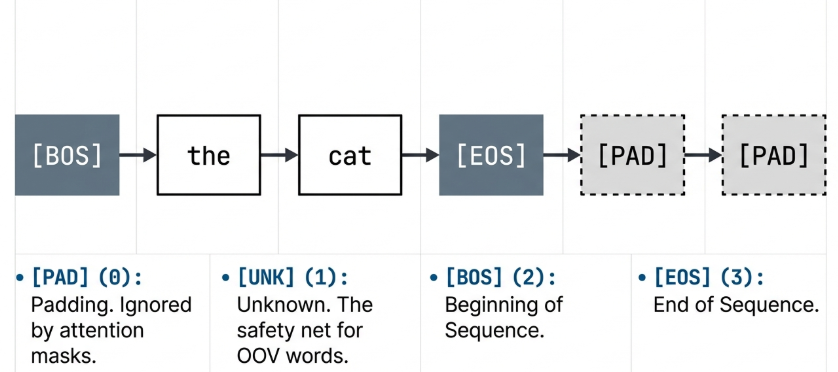
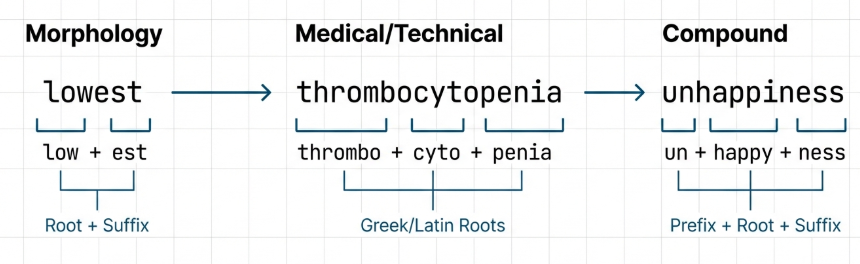
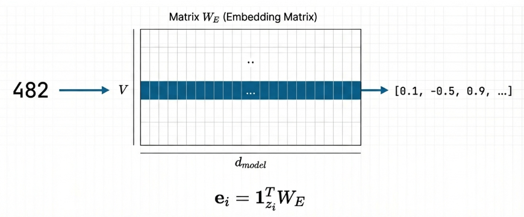

## Tokenization

### Part 1: Foundations

#### 1. What Is Tokenization?

Tokenization is the process of converting raw text into a sequence of discrete symbols that a neural network can process. It is the very first step in any natural language processing pipeline, and its design has profound effects on everything downstream: vocabulary size, sequence length, model capacity, and generalization ability.

A neural network cannot operate on raw strings of characters. It requires numerical inputs, typically integer indices that map into an embedding table. Tokenization provides this mapping: from human-readable text to machine-readable integers, and back again.

---

#### 2. Why Tokenization Matters

The choice of tokenization strategy affects nearly every aspect of a language model:

- **Vocabulary size** determines the size of the embedding matrix and the output projection layer. A vocabulary of $V$ tokens with embedding dimension $d$ requires $V \times d$ parameters just for the input embeddings alone.

- **Sequence length** determines the computational cost of attention, which scales quadratically with sequence length. Finer-grained tokenization (e.g., character-level) produces longer sequences, increasing both memory and compute.

- **Out-of-vocabulary handling** determines what happens when the model encounters a word it has never seen. A tokenizer that cannot represent new words will map them all to a single unknown token, losing all information about them.

- **Semantic granularity** determines how much meaning each token carries. Whole words carry rich semantics, individual characters carry almost none, and subwords sit in between.

> [!NOTE] **Key insight:**
>
> The tension between these four factors is the central design challenge of tokenization.

---

### Part 2: Word-Level Tokenization

#### 3. Word-Level Tokenization

The simplest approach splits text on whitespace (and optionally punctuation) to produce one token per word.

###### Building the Vocabulary

Given a collection of training texts, word-level tokenization:

1. Splits each text into individual words
2. Collects all unique words across the entire corpus
3. Assigns each unique word a unique integer ID
4. Adds special tokens for structural purposes

The **vocabulary** is a bidirectional mapping:

- A **word-to-ID** dictionary that converts words into integers during encoding
- An **ID-to-word** dictionary that converts integers back to words during decoding

$$\text{word\_to\_id}: \text{String} \rightarrow \mathbb{Z}$$

$$\text{id\_to\_word}: \mathbb{Z} \rightarrow \text{String}$$

These two mappings must be consistent inverses of each other: for every word $w$ in the vocabulary:

$$\text{id\_to\_word}(\text{word\_to\_id}(w)) = w$$

###### Vocabulary Construction

Building the vocabulary involves several key design decisions:

**How to split text into words?**

- **Whitespace splitting:** The simplest approach. Split on spaces, tabs, and newlines. Words like "don't" stay as one token.
- **Punctuation splitting:** Separate punctuation from words. "hello!" becomes `["hello", "!"]`.
- **Lowercasing:** Convert everything to lowercase. Reduces vocabulary size but loses case information (e.g., "Apple" the company vs "apple" the fruit).

**What order for the vocabulary?**

- Special tokens always come first (PAD, UNK, BOS, EOS)
- Remaining words can be sorted alphabetically (deterministic ordering) or by frequency (most common words get smaller IDs)

**What vocabulary size?**

- A corpus of English text might contain 100,000+ unique words
- Many of these are rare: misspellings, proper nouns, technical jargon
- Including all of them creates a very large embedding matrix
- Common practice is to keep only the top $V$ most frequent words and map everything else to UNK

---

#### 4. Special Tokens

Every tokenizer needs a set of special tokens that serve structural roles beyond representing words. These are typically assigned the lowest integer IDs in the vocabulary:

| Token   | ID  | Purpose                                                                                                                                 |
| ------- | --- | --------------------------------------------------------------------------------------------------------------------------------------- |
| **PAD** | 0   | Makes all sequences in a batch the same length. The model learns to ignore padding positions via attention masks.                       |
| **UNK** | 1   | Represents any word not found in the vocabulary. The "safety net" for unseen words — but loses all information about the original word. |
| **BOS** | 2   | Marks the start of a sequence. In generation, the model is often given just the BOS token and asked to generate the rest.               |
| **EOS** | 3   | Marks the end of a sequence. In generation, the model produces tokens until it generates the EOS token.                                 |

> [!NOTE] **Note**
>
> Special tokens are added to the vocabulary before any real words, ensuring they always have the same IDs regardless of the training corpus.

---

### Part 3: Encoding & Decoding

#### 5. The Encoding Process

Encoding converts a string of text into a list of integer IDs:

$$\text{encode}: \text{String} \rightarrow [z_1, z_2, \ldots, z_n]$$

where each $z_i \in \{0, 1, \ldots, V-1\}$ is a valid token ID. The process involves four steps:

1. **Normalization:** Convert the text to a standard form (e.g., lowercasing)
2. **Splitting:** Break the text into individual words
3. **Lookup:** Map each word to its ID using the word-to-ID dictionary
4. **Unknown handling:** If a word is not in the vocabulary, replace it with the UNK token ID

###### Example

Given vocabulary: `{PAD: 0, UNK: 1, BOS: 2, EOS: 3, cat: 4, sat: 5, the: 6}`

| Input           | Output      | Notes                          |
| --------------- | ----------- | ------------------------------ |
| `"the cat sat"` | `[6, 4, 5]` | All words known                |
| `"the dog sat"` | `[6, 1, 5]` | "dog" is unknown → maps to UNK |

---

#### 6. The Decoding Process

Decoding is the inverse of encoding — it converts a list of integer IDs back into human-readable text:

$$\text{decode}: [z_1, z_2, \ldots, z_n] \rightarrow \text{String}$$

The process involves two steps:

1. **Lookup:** Map each integer ID to its corresponding word using the ID-to-word dictionary
2. **Joining:** Concatenate the words with spaces between them

###### The Roundtrip Property

For any text $t$ that contains only known vocabulary words:

$$\text{decode}(\text{encode}(t)) = t$$

However, this property breaks when unknown words are present. If the original text contained "the dog sat" and "dog" is not in the vocabulary, encoding produces `[6, 1, 5]`, and decoding produces `"the UNK sat"` — losing the original word.

---

### Part 4: Worked Example

#### 7. Building a Complete Tokenizer

**Training corpus:**

- `"the cat sat on the mat"`
- `"the dog chased the cat"`

###### Step 1: Reserve special tokens

| Token | ID  |
| ----- | --- |
| PAD   | 0   |
| UNK   | 1   |
| BOS   | 2   |
| EOS   | 3   |

###### Step 2: Collect unique words (sorted alphabetically)

All words (lowercased): the, cat, sat, on, the, mat, the, dog, chased, the, cat

Unique words: `cat, chased, dog, mat, on, sat, the`

###### Step 3: Assign IDs to words

| Word   | ID  |
| ------ | --- |
| cat    | 4   |
| chased | 5   |
| dog    | 6   |
| mat    | 7   |
| on     | 8   |
| sat    | 9   |
| the    | 10  |

**Vocabulary size** $V = 11$.

###### Step 4: Encoding and decoding examples

| Operation             | Input                      | Output                        |
| --------------------- | -------------------------- | ----------------------------- |
| Encode (all known)    | `"the cat sat on the mat"` | `[10, 4, 9, 8, 10, 7]`        |
| Encode (unknown word) | `"the bird sat"`           | `[10, 1, 9]` — "bird" → UNK=1 |
| Decode                | `[10, 4, 9]`               | `"the cat sat"`               |

---

### Part 5: The OOV Problem & Subword Methods

#### 8. The Out-of-Vocabulary Problem

Word-level tokenization has a fundamental limitation: it cannot represent words it has not seen during training. This is known as the **out-of-vocabulary (OOV) problem**.

Consider a tokenizer trained on news articles encountering medical text for the first time. Words like "immunoglobulin" or "thrombocytopenia" would all become UNK, losing crucial information.

The severity of this problem depends on the application:

| Application Domain                              | OOV Exposure                                                       |
| ----------------------------------------------- | ------------------------------------------------------------------ |
| Closed-domain (e.g., customer service chatbots) | Low — fixed set of topics                                          |
| Open-domain (e.g., general-purpose LLMs)        | High — constant new words                                          |
| Multilingual                                    | Very high — vocabulary explosion across languages                  |
| Code / Scientific text                          | Extreme — variable names, chemical formulas, mathematical notation |

> [!NOTE] **Quantifying the problem:**
>
> In English, a vocabulary of 30,000 words covers approximately 95% of typical text. But the remaining 5% often carries the most important information: proper nouns, technical terms, and novel words.

---

#### 9. Beyond Word-Level: Subword Tokenization

The OOV problem motivated the development of subword tokenization methods, which split rare words into smaller, more common pieces while keeping frequent words intact.

###### Byte-Pair Encoding (BPE)

BPE starts with a character-level vocabulary and iteratively merges the most frequent adjacent pairs:

1. Initialize vocabulary with all individual characters
2. Count all adjacent character pairs in the training corpus
3. Merge the most frequent pair into a new token
4. Repeat steps 2–3 for a predetermined number of merges

###### WordPiece

Similar to BPE but uses a different merging criterion. Instead of frequency, WordPiece merges the pair that maximizes the likelihood of the training data:

$$\text{score}(a, b) = \frac{\text{freq}(ab)}{\text{freq}(a) \times \text{freq}(b)}$$

This tends to merge pairs where the combination is more informative than its individual parts. WordPiece marks continuation tokens with a special prefix (e.g., `###` in BERT):

- `"playing"` → `["play", "###ing"]`
- `"unhappiness"` → `["un", "###happy", "###ness"]`

###### SentencePiece

Treats the input as a raw character stream (including spaces) and applies BPE or unigram language model segmentation. This makes it language-agnostic and handles languages without clear word boundaries (like Chinese and Japanese).

---

### Part 6: Advanced Topics

#### 10. Vocabulary Size Trade-offs

Vocabulary size $V$ is one of the most important hyperparameters in a language model:

| Vocabulary Size        | Pros                                                | Cons                                                          |
| ---------------------- | --------------------------------------------------- | ------------------------------------------------------------- |
| **Small** (~8K–16K)    | Better rare-word handling; smaller embedding matrix | Longer sequences; higher attention compute cost               |
| **Large** (~50K–100K+) | Shorter sequences; faster inference                 | Larger embedding matrix; rare tokens may have poor embeddings |

**Vocabulary sizes of notable models:**

| Model                | Tokenizer     | Vocabulary Size |
| -------------------- | ------------- | --------------- |
| Original Transformer | BPE           | ~37,000         |
| BERT                 | WordPiece     | 30,522          |
| GPT-2                | BPE           | 50,257          |
| LLaMA                | SentencePiece | 32,000          |
| GPT-4                | BPE           | ~100,000        |

> [!TIP] **Trend:**
>
> Modern models move toward larger vocabularies, enabled by more training data that provides sufficient examples for each token.

---

#### 11. The Embedding Connection

Tokenization feeds directly into the embedding layer. After tokenization converts text to integer IDs, the embedding layer converts those IDs into dense vectors:

$$\text{Text} \xrightarrow{\text{tokenize}} [z_1, z_2, \ldots, z_n] \xrightarrow{\text{embed}} [\mathbf{e}_1, \mathbf{e}_2, \ldots, \mathbf{e}_n]$$

where each $\mathbf{e}\_{i} \in \mathbb{R}^{d_{model}}$. The vocabulary size determines the number of rows in the embedding matrix $W_E \in \mathbb{R}^{V \times d_{model}}$:

- Token ID $z_i$ selects row $z_i$ from $W_E$
- This is equivalent to multiplying a one-hot vector by the embedding matrix:

$$\mathbf{e}_i = W_E[z_i] = \mathbf{1}_{z_i}^T W_E$$

---

#### 12. Weight Tying

The original Transformer paper introduced an important trick: **sharing weights between the embedding layer and the output projection layer**.

In a language model, the output layer maps from hidden representations back to vocabulary-size logits:

$$\text{logits} = hW_{out} + b \quad \text{where } W_{out} \in \mathbb{R}^{d_{model} \times V}$$

With weight tying: $W_{out} = W_E^T$. This reduces parameters by $V \times d_{model}$ and forces the model to use consistent representations — words that are close in embedding space also compete for similar output probabilities.

---

#### 13. Normalization and Preprocessing

Before splitting text into tokens, most tokenizers apply normalization. These choices are **permanent and cannot be reversed**:

- **Lowercasing:** "The" and "the" become the same token. Reduces vocabulary size but loses case information.
- **Unicode normalization:** Ensures consistent encoding of characters across different systems (NFC, NFKC forms).
- **Whitespace normalization:** Collapse multiple spaces into one, trim leading/trailing spaces.
- **Special character handling:** Decide whether to keep or remove punctuation, emojis, and special characters.

> **Warning:** A tokenizer that lowercases cannot distinguish `"apple"` (fruit) from `"Apple"` (company).

---

#### 14. Tokenization for Different Modalities

While text tokenization is the most common, the concept extends to other domains. The Transformer architecture is agnostic to modality — all it needs is a sequence of discrete tokens with embeddings:

| Modality     | Tokenization Method                  | Token Unit                           |
| ------------ | ------------------------------------ | ------------------------------------ |
| Text         | BPE / WordPiece / SentencePiece      | Characters, subwords, or words       |
| Images (ViT) | Patch extraction + linear projection | 16×16 pixel patches                  |
| Audio        | Frame windowing                      | 25ms spectral feature frames         |
| Proteins     | Character-level                      | Individual amino acids (20 standard) |

---

#### 15. Handling Batches and Padding

Real training happens in batches, and sequences within a batch often have different lengths. Padding resolves this:

| Sequence        | Tokens   | Padded (length 3) | Attention Mask |
| --------------- | -------- | ----------------- | -------------- |
| `"the cat"`     | 2 tokens | `[10, 4, 0]`      | `[1, 1, 0]`    |
| `"the dog sat"` | 3 tokens | `[10, 6, 9]`      | `[1, 1, 1]`    |

The PAD token (ID 0) fills the gap. Attention masks indicate which positions contain real tokens (1) and which are padding (0), ensuring padding tokens do not influence the computation.

---

#### 16. Determinism and Reproducibility

A well-designed tokenizer must be deterministic:

- The same input text must always produce the same token IDs
- The same token IDs must always decode to the same text
- The vocabulary must be built in a deterministic order (e.g., sorting words alphabetically)

> **Critical:** Without determinism, models trained with one tokenizer cannot be evaluated with another, and saved models become unusable if the tokenizer changes. This is why vocabulary files are saved alongside model weights — **the tokenizer and the model are inseparable**.

---

### Part 7: Historical Context & Summary

#### 17. Historical Context

The evolution of tokenization in NLP reflects the broader evolution of the field:

| Era                     | Approach                       | Key Development                                           |
| ----------------------- | ------------------------------ | --------------------------------------------------------- |
| Early NLP (1990s–2000s) | Word-level, large vocabularies | Stemming and lemmatization to reduce vocabulary size      |
| Word2Vec era (2013)     | Word-level, fixed vocabularies | OOV words handled by ignoring or using random vectors     |
| BPE adoption (2016)     | Subword tokenization           | Sennrich et al. applied BPE to neural machine translation |
| Transformer era (2017)  | BPE ~37K tokens                | The original Transformer paper                            |
| BERT (2018)             | WordPiece, 30K tokens          | Introduced continuation prefix (`###`)                    |
| GPT-2 (2019)            | Byte-level BPE                 | No UNK token needed — every byte sequence is encodable    |
| Modern LLMs (2023+)     | 100K+ token BPE                | Multilingual coverage and efficiency optimization         |

The trend is clear: from simple word splitting to sophisticated subword algorithms that balance vocabulary size, sequence length, and language coverage.

---

#### 18. Summary of Key Concepts

| Concept                   | Summary                                                                                     |
| ------------------------- | ------------------------------------------------------------------------------------------- |
| **Core purpose**          | Tokenization maps text to integers and back, bridging human language and neural computation |
| **Vocabulary**            | A bidirectional mapping between tokens and integer IDs                                      |
| **Special tokens**        | PAD, UNK, BOS, EOS serve structural roles beyond representing words                         |
| **Word-level limitation** | Suffers from the OOV problem — unseen words all collapse to UNK                             |
| **Subword methods**       | BPE, WordPiece, and SentencePiece address OOV by splitting rare words into common pieces    |
| **Vocabulary size**       | Trades off between sequence length (compute) and parameter count (memory)                   |
| **Inseparability**        | The tokenizer and model are inseparable — changing one invalidates the other                |
