## Tokenization

### Foundations

Tokenization is the process of converting raw text into a sequence of discrete symbols that a neural network can process. It is the very first step in any natural language processing pipeline, and its design has profound effects on everything downstream: vocabulary size, sequence length, model capacity, and generalization ability.

A neural network cannot operate on raw strings of characters. It requires numerical inputs, typically integer indices that map into an embedding table. Tokenization provides this mapping: from human-readable text to machine-readable integers, and back again.

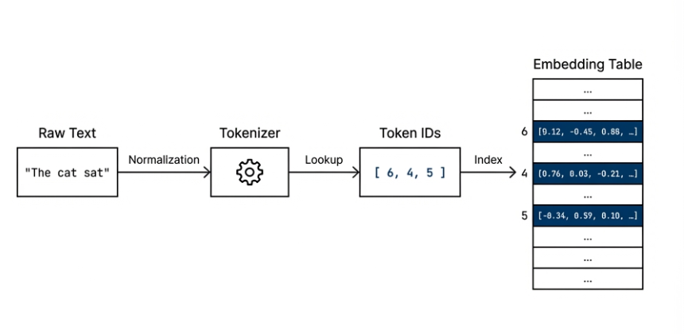

The choice of tokenization strategy affects nearly every aspect of a language model:

- **Vocabulary size** determines the size of the embedding matrix and the output projection layer. A vocabulary of $V$ tokens with embedding dimension $d$ requires $V \times d$ parameters just for the input embeddings alone.

- **Sequence length** determines the computational cost of attention, which scales quadratically with sequence length. Finer-grained tokenization (e.g., character-level) produces longer sequences, increasing both memory and compute.

- **Out-of-vocabulary handling** determines what happens when the model encounters a word it has never seen. A tokenizer that cannot represent new words will map them all to a single unknown token, losing all information about them.

- **Semantic granularity** determines how much meaning each token carries. Whole words carry rich semantics, individual characters carry almost none, and subwords sit in between.

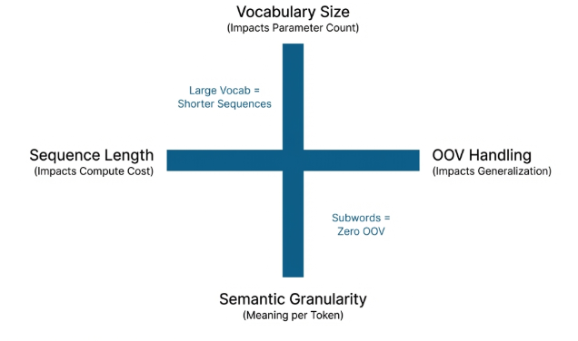

> [!NOTE] **Key insight:**
>
> The tension between these four factors is the central design challenge of tokenization.

---

### Word-Level Tokenization

The simplest approach splits text on whitespace (and optionally punctuation) to produce one token per word.

#### Building the Vocabulary

Given a collection of training texts, word-level tokenization:

1. Splits each text into individual words
2. Collects all unique words across the entire corpus
3. Assigns each unique word a unique integer ID
4. Adds special tokens for structural purposes

The **vocabulary** is a bidirectional mapping:

- A **word-to-ID** dictionary that converts words into integers during encoding
- An **ID-to-word** dictionary that converts integers back to words during decoding

$$\text{word\_to\_id}: \text{String} \rightarrow \mathbb{Z}$$

$$\text{id\_to\_word}: \mathbb{Z} \rightarrow \text{String}$$

These two mappings must be consistent inverses of each other: for every word $w$ in the vocabulary:

$$\text{id\_to\_word}(\text{word\_to\_id}(w)) = w$$

Building the vocabulary involves several key design decisions:

**How to split text into words?**

- **Whitespace splitting:** The simplest approach. Split on spaces, tabs, and newlines. Words like "don't" stay as one token.
- **Punctuation splitting:** Separate punctuation from words. "hello!" becomes `["hello", "!"]`.
- **Lowercasing:** Convert everything to lowercase. Reduces vocabulary size but loses case information (e.g., "Apple" the company vs "apple" the fruit).

**What order for the vocabulary?**

- Special tokens always come first (PAD, UNK, BOS, EOS)
- Remaining words can be sorted alphabetically (deterministic ordering) or by frequency (most common words get smaller IDs)

**What vocabulary size?**

- A corpus of English text might contain 100,000+ unique words
- Many of these are rare: misspellings, proper nouns, technical jargon
- Including all of them creates a very large embedding matrix
- Common practice is to keep only the top $V$ most frequent words and map everything else to UNK

#### Special Tokens

Every tokenizer needs a set of special tokens that serve structural roles beyond representing words. These are typically assigned the lowest integer IDs in the vocabulary:

| Token   | ID  | Purpose                                                                                                                                 |
| ------- | --- | --------------------------------------------------------------------------------------------------------------------------------------- |
| **PAD** | 0   | Makes all sequences in a batch the same length. The model learns to ignore padding positions via attention masks.                       |
| **UNK** | 1   | Represents any word not found in the vocabulary. The "safety net" for unseen words — but loses all information about the original word. |
| **BOS** | 2   | Marks the start of a sequence. In generation, the model is often given just the BOS token and asked to generate the rest.               |
| **EOS** | 3   | Marks the end of a sequence. In generation, the model produces tokens until it generates the EOS token.                                 |


> [!NOTE] **Note**
>
> Special tokens are added to the vocabulary before any real words, ensuring they always have the same IDs regardless of the training corpus.

---

### Encoding & Decoding

#### The Encoding Process

Encoding converts a string of text into a list of integer IDs:

$$\text{encode}: \text{String} \rightarrow [z_1, z_2, \ldots, z_n]$$

where each $z_i \in \{0, 1, \ldots, V-1\}$ is a valid token ID. The process involves four steps:

1. **Normalization:** Convert the text to a standard form (e.g., lowercasing)
2. **Splitting:** Break the text into individual words
3. **Lookup:** Map each word to its ID using the word-to-ID dictionary
4. **Unknown handling:** If a word is not in the vocabulary, replace it with the UNK token ID

###### Example

Given vocabulary: `{PAD: 0, UNK: 1, BOS: 2, EOS: 3, cat: 4, sat: 5, the: 6}`

| Input           | Output      | Notes                          |
| --------------- | ----------- | ------------------------------ |
| `"the cat sat"` | `[6, 4, 5]` | All words known                |
| `"the dog sat"` | `[6, 1, 5]` | "dog" is unknown → maps to UNK |

---

#### The Decoding Process

Decoding is the inverse of encoding — it converts a list of integer IDs back into human-readable text:

$$\text{decode}: [z_1, z_2, \ldots, z_n] \rightarrow \text{String}$$

The process involves two steps:

1. **Lookup:** Map each integer ID to its corresponding word using the ID-to-word dictionary
2. **Joining:** Concatenate the words with spaces between them

**The Roundtrip Property**

For any text $t$ that contains only known vocabulary words:

$$\text{decode}(\text{encode}(t)) = t$$

However, this property breaks when unknown words are present. If the original text contained "the dog sat" and "dog" is not in the vocabulary, encoding produces `[6, 1, 5]`, and decoding produces `"the UNK sat"` — losing the original word.

---

#### Worked Example

**Training corpus:**

- `"the cat sat on the mat"`
- `"the dog chased the cat"`

**Step 1**: Reserve special tokens

| Token | ID  |
| ----- | --- |
| PAD   | 0   |
| UNK   | 1   |
| BOS   | 2   |
| EOS   | 3   |

**Step 2**: Collect unique words (sorted alphabetically)

All words (lowercased): the, cat, sat, on, the, mat, the, dog, chased, the, cat

Unique words: `cat, chased, dog, mat, on, sat, the`

**Step 3**: Assign IDs to words

| Word   | ID  |
| ------ | --- |
| cat    | 4   |
| chased | 5   |
| dog    | 6   |
| mat    | 7   |
| on     | 8   |
| sat    | 9   |
| the    | 10  |

_Vocabulary size_ $V = 11$.

**Step 4**: Encoding and decoding examples

| Operation             | Input                      | Output                        |
| --------------------- | -------------------------- | ----------------------------- |
| Encode (all known)    | `"the cat sat on the mat"` | `[10, 4, 9, 8, 10, 7]`        |
| Encode (unknown word) | `"the bird sat"`           | `[10, 1, 9]` — "bird" → UNK=1 |
| Decode                | `[10, 4, 9]`               | `"the cat sat"`               |

### The OOV Problem & Subword Methods

Word-level tokenization has a fundamental limitation: it cannot represent words it has not seen during training. This is known as the **out-of-vocabulary (OOV) problem**.

Consider a tokenizer trained on news articles encountering medical text for the first time. Words like "immunoglobulin" or "thrombocytopenia" would all become UNK, losing crucial information.

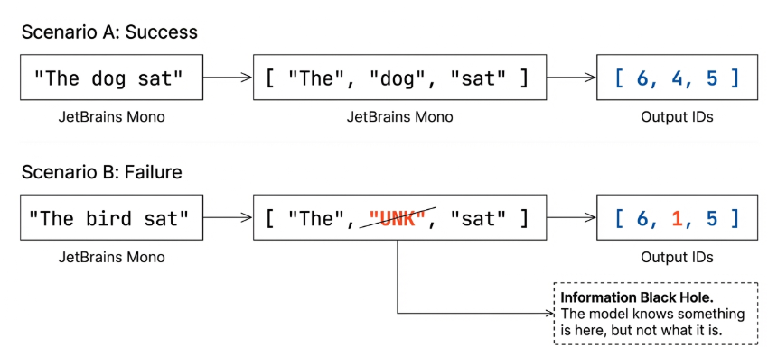

The severity of this problem depends on the application:

| Application Domain                              | OOV Exposure                                                       |
| ----------------------------------------------- | ------------------------------------------------------------------ |
| Closed-domain (e.g., customer service chatbots) | Low — fixed set of topics                                          |
| Open-domain (e.g., general-purpose LLMs)        | High — constant new words                                          |
| Multilingual                                    | Very high — vocabulary explosion across languages                  |
| Code / Scientific text                          | Extreme — variable names, chemical formulas, mathematical notation |

> [!NOTE] **Quantifying the problem:**
>
> In English, a vocabulary of 30,000 words covers approximately 95% of typical text. But the remaining 5% often carries the most important information: proper nouns, technical terms, and novel words.

The OOV problem motivated the development of subword tokenization methods, which split rare words into smaller, more common pieces while keeping frequent words intact.


**Byte-Pair Encoding (BPE)**

BPE starts with a character-level vocabulary and iteratively merges the most frequent adjacent pairs:

1. Initialize vocabulary with all individual characters
2. Count all adjacent character pairs in the training corpus
3. Merge the most frequent pair into a new token
4. Repeat steps 2–3 for a predetermined number of merges

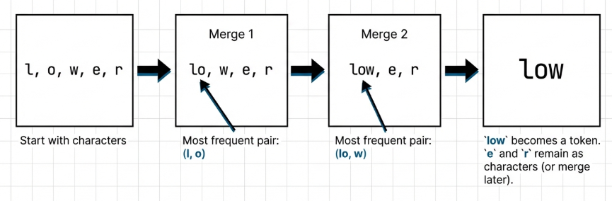

**WordPiece**

Similar to BPE but uses a different merging criterion. Instead of frequency, WordPiece merges the pair that maximizes the likelihood of the training data:

$$\text{score}(a, b) = \frac{\text{freq}(ab)}{\text{freq}(a) \times \text{freq}(b)}$$

This tends to merge pairs where the combination is more informative than its individual parts. WordPiece marks continuation tokens with a special prefix (e.g., `###` in BERT):

- `"playing"` → `["play", "###ing"]`
- `"unhappiness"` → `["un", "###happy", "###ness"]`

**SentencePiece**

Treats the input as a raw character stream (including spaces) and applies BPE or unigram language model segmentation. This makes it language-agnostic and handles languages without clear word boundaries (like Chinese and Japanese).

### Advanced Concepts

**Vocabulary Size Trade-offs**

Vocabulary size $V$ is one of the most important hyperparameters in a language model:

| Vocabulary Size        | Pros                                                | Cons                                                          |
| ---------------------- | --------------------------------------------------- | ------------------------------------------------------------- |
| **Small** (~8K–16K)    | Better rare-word handling; smaller embedding matrix | Longer sequences; higher attention compute cost               |
| **Large** (~50K–100K+) | Shorter sequences; faster inference                 | Larger embedding matrix; rare tokens may have poor embeddings |

_Vocabulary sizes of notable models:_

| Model                | Tokenizer     | Vocabulary Size |
| -------------------- | ------------- | --------------- |
| Original Transformer | BPE           | ~37,000         |
| BERT                 | WordPiece     | 30,522          |
| GPT-2                | BPE           | 50,257          |
| LLaMA                | SentencePiece | 32,000          |
| GPT-4                | BPE           | ~100,000        |

> [!TIP] **Trend:**
>
> Modern models move toward larger vocabularies, enabled by more training data that provides sufficient examples for each token.

**The Embedding Connection**

Tokenization feeds directly into the embedding layer. After tokenization converts text to integer IDs, the embedding layer converts those IDs into dense vectors:

$$\text{Text} \xrightarrow{\text{tokenize}} [z_1, z_2, \ldots, z_n] \xrightarrow{\text{embed}} [\mathbf{e}_1, \mathbf{e}_2, \ldots, \mathbf{e}_n]$$


where each $\mathbf{e}\_{i} \in \mathbb{R}^{d_{model}}$. The vocabulary size determines the number of rows in the embedding matrix $W_E \in \mathbb{R}^{V \times d_{model}}$:

- Token ID $z_i$ selects row $z_i$ from $W_E$
- This is equivalent to multiplying a one-hot vector by the embedding matrix:

$$\mathbf{e}_i = W_E[z_i] = \mathbf{1}_{z_i}^T W_E$$

**Weight Tying**

The original Transformer paper introduced an important trick: **sharing weights between the embedding layer and the output projection layer**.

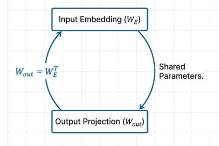

In a language model, the output layer maps from hidden representations back to vocabulary-size logits:

$$\text{logits} = hW_{out} + b \quad \text{where } W_{out} \in \mathbb{R}^{d_{model} \times V}$$

With weight tying: $W_{out} = W_E^T$. This reduces parameters by $V \times d_{model}$ and forces the model to use consistent representations — words that are close in embedding space also compete for similar output probabilities.

**Normalization and Preprocessing**

Before splitting text into tokens, most tokenizers apply normalization. These choices are **permanent and cannot be reversed**:

- **Lowercasing:** "The" and "the" become the same token. Reduces vocabulary size but loses case information.
- **Unicode normalization:** Ensures consistent encoding of characters across different systems (NFC, NFKC forms).
- **Whitespace normalization:** Collapse multiple spaces into one, trim leading/trailing spaces.
- **Special character handling:** Decide whether to keep or remove punctuation, emojis, and special characters.

> **Warning:**
>
> A tokenizer that lowercases cannot distinguish `"apple"` (fruit) from `"Apple"` (company).

**Tokenization for Different Modalities**

While text tokenization is the most common, the concept extends to other domains. The Transformer architecture is agnostic to modality — all it needs is a sequence of discrete tokens with embeddings:

| Modality     | Tokenization Method                  | Token Unit                           |
| ------------ | ------------------------------------ | ------------------------------------ |
| Text         | BPE / WordPiece / SentencePiece      | Characters, subwords, or words       |
| Images (ViT) | Patch extraction + linear projection | 16×16 pixel patches                  |
| Audio        | Frame windowing                      | 25ms spectral feature frames         |
| Proteins     | Character-level                      | Individual amino acids (20 standard) |

**Handling Batches and Padding**

Real training happens in batches, and sequences within a batch often have different lengths. Padding resolves this:

| Sequence        | Tokens   | Padded (length 3) | Attention Mask |
| --------------- | -------- | ----------------- | -------------- |
| `"the cat"`     | 2 tokens | `[10, 4, 0]`      | `[1, 1, 0]`    |
| `"the dog sat"` | 3 tokens | `[10, 6, 9]`      | `[1, 1, 1]`    |

The PAD token (ID 0) fills the gap. Attention masks indicate which positions contain real tokens (1) and which are padding (0), ensuring padding tokens do not influence the computation.

**Determinism and Reproducibility**

A well-designed tokenizer must be deterministic:

- The same input text must always produce the same token IDs
- The same token IDs must always decode to the same text
- The vocabulary must be built in a deterministic order (e.g., sorting words alphabetically)

> **Critical:** Without determinism, models trained with one tokenizer cannot be evaluated with another, and saved models become unusable if the tokenizer changes. This is why vocabulary files are saved alongside model weights — **the tokenizer and the model are inseparable**.

### Historical Context & Summary

The evolution of tokenization in NLP reflects the broader evolution of the field:

| Era                     | Approach                       | Key Development                                           |
| ----------------------- | ------------------------------ | --------------------------------------------------------- |
| Early NLP (1990s–2000s) | Word-level, large vocabularies | Stemming and lemmatization to reduce vocabulary size      |
| Word2Vec era (2013)     | Word-level, fixed vocabularies | OOV words handled by ignoring or using random vectors     |
| BPE adoption (2016)     | Subword tokenization           | Sennrich et al. applied BPE to neural machine translation |
| Transformer era (2017)  | BPE ~37K tokens                | The original Transformer paper                            |
| BERT (2018)             | WordPiece, 30K tokens          | Introduced continuation prefix (`###`)                    |
| GPT-2 (2019)            | Byte-level BPE                 | No UNK token needed — every byte sequence is encodable    |
| Modern LLMs (2023+)     | 100K+ token BPE                | Multilingual coverage and efficiency optimization         |

The trend is clear: from simple word splitting to sophisticated subword algorithms that balance vocabulary size, sequence length, and language coverage.

### Code Example

```python
import numpy as np
from typing import List, Dict

class SimpleTokenizer:
    """
    A word-level tokenizer with special tokens.
    """

    def __init__(self):
        self.word_to_id: Dict[str, int] = {}
        self.id_to_word: Dict[int, str] = {}
        self.vocab_size = 0

        # Special tokens
        self.pad_token = "<PAD>"
        self.unk_token = "<UNK>"
        self.bos_token = "<BOS>"
        self.eos_token = "<EOS>"

    def build_vocab(self, texts: List[str]) -> None:
        """
        Build vocabulary from a list of texts.
        Add special tokens first, then unique words.
        """
        def add_token(token: str):
            if token in self.word_to_id:
                return
            self.word_to_id[token] = self.vocab_size
            self.id_to_word[self.vocab_size] = token
            self.vocab_size += 1

        add_token(self.pad_token)
        add_token(self.unk_token)
        add_token(self.bos_token)
        add_token(self.eos_token)

        for text in texts:
            for word in text.split(" "):
                add_token(word)

    def encode(self, text: str) -> List[int]:
        """
        Convert text to list of token IDs.
        Use UNK for unknown words.
        """

        return [
            self.word_to_id[word] if word in self.word_to_id else self.word_to_id[self.unk_token]
            for word in text.split(" ")
        ]

    def decode(self, ids: List[int]) -> str:
        """
        Convert list of token IDs back to text.
        """

        return " ".join([self.id_to_word[id] for id in ids])
```

## Embedding Layer

The embedding layer bridges the gap between human language and machine computation. While humans communicate through discrete symbols, neural networks operate exclusively with numbers. The embedding layer lies is essential given its ability to map these discrete token IDs into dense, learnable vector representations, providing the basis upon which all subsequent layers perform their complex reasoning.

Traditional NLP methods like one-hot encoding represent language through sparse, high-dimensional vectors. For a vocabulary of 30,000 tokens, a one-hot vector would have 30,000 dimensions with only a single "1" and 29,999 zeros. This approach is computationally inefficient and semantically "blind." Dense embeddings offer four advantages:

- **Compactness**: Information is condensed into a significantly smaller space (e.g., 512 dimensions), allowing a single vector to carry richer data than a massive sparse one.
- **Similarity**: Because they are continuous, dense vectors can capture semantic similarity. Words with related meanings point in similar directions in the vector space.
- **Generalization**: If "cat" and "dog" have similar vectors, the model can partially transfer knowledge learned about one to the other.
- **Composability**: Dense vectors can be mathematically manipulated enabling the model to perform complex logic across different concepts.

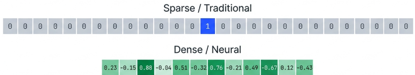

The [distributional hypothesis](https://en.wikipedia.org/wiki/Distributional_semantics) suggests that "you shall know a word by the company it keeps." This hypothesis states that similar words cluster together because they appear in similar contexts (e.g., "petted the dog" vs. "petted the cat"). Furthermore, abstract concepts emerge as "semantic directions." Relationships like gender, tense, or geography manifest as geometric parallelograms:

$$
\mathbf{e}_{queen} - \mathbf{e}_{king} \approx \mathbf{e}_{woman} - \mathbf{e}_{man}
$$

$$
\mathbf{e}_{Paris} - \mathbf{e}_{France} \approx \mathbf{e}_{Berlin} - \mathbf{e}_{Germany}
$$

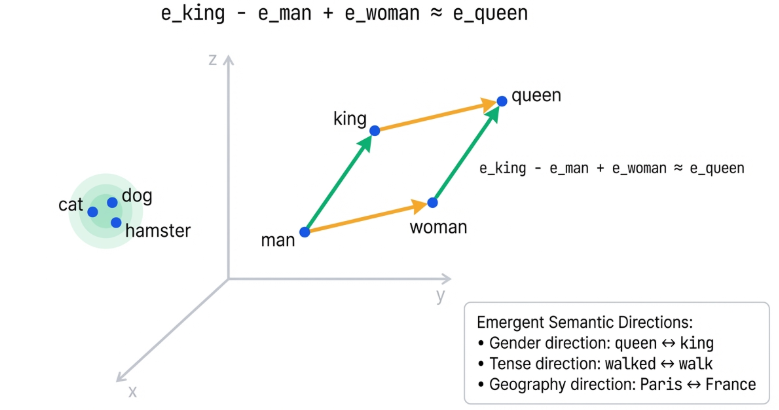

In multilingual models, words with similar meanings across different languages end up near each other in the same vector space. This enables **[zero-shot](https://en.wikipedia.org/wiki/Zero-shot_learning) cross-lingual transfer**, where a model trained on English data can perform tasks in French because the embeddings occupy aligned regions of the space. The key requirement is that the model sees enough parallel or comparable text across languages during training to align the embedding spaces.

### The Embedding Matrix

The main concept of the Embedding Layer is the **Embedding Matrix** ($W_E$). This matrix acts as a "lookup table" that stores a unique vector for every token in the model's vocabulary. The matrix is defined as $W_E \in \mathbb{R}^{V \times d_{model}}$, where $V$ represents the vocabulary size and $d_{\text{model}}$ is the embedding (or model) dimension. The relationship between a Token ID and its vector is a direct mapping where the Token ID acts as the row index:

| Token ID | Matrix Row Index | Vector Representation (Size $d_{\text{model}}$)      |
| -------- | ---------------- | ---------------------------------------------------- |
| 0        | Row 0            | $[w_{0,1}, w_{0,2}, \ldots, w_{0,d_{\text{model}}}]$ |
| 1        | Row 1            | $[w_{1,1}, w_{1,2}, \ldots, w_{1,d_{\text{model}}}]$ |
| i        | Row i            | $[w_{i,1}, w_{i,2}, \ldots, w_{i,d_{\text{model}}}]$ |

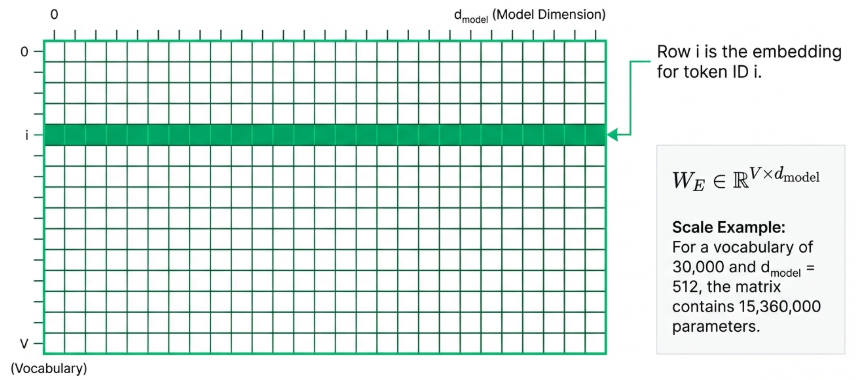

Mathematically, retrieving an embedding is equivalent to a one-hot multiplication

$$
\mathbf{e} = \mathbf{1}_z^T \cdot W_E
$$

where a vector with a "$1$" at position $z$ acts as a selector. However, in practice, models use direct indexing

$$
\mathbf{e} = W_E[z]
$$

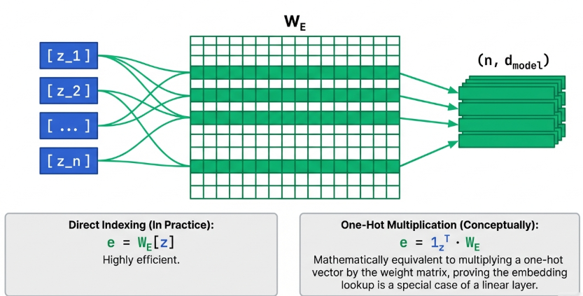

This is the industry standard for performance, as it avoids the massive memory and computational overhead of multiplying large, sparse vectors.

As data flows through the pipeline, it undergoes specific shape transformations:

- **Input**: A tensor of token IDs with shape $(B, L)$
  - $B$ is the batch size
  - $L$ is the sequence length
  - Each element is an integer in $\{0, 1, \ldots, V-1\}$
- **Embedding matrix**: Shape $(V, d_{model})$
- **Output (before scaling)**: Shape $(B, L, d_{model})$
  - Each token ID has been replaced by its $d_{model}$-dimensional embedding vector
- **Output (after scaling)**: Shape $(B, L, d_{model})$
  - Same shape, but each value multiplied by $\sqrt{d_{model}}$

The $d_{\text{model}}$ dimension is always the last dimension (the feature dimension). This is a crucial detail for understanding how data is sliced and processed by attention heads and feed-forward modules. The choice of $d_{model}$ significantly impacts the model’s representational capacity and memory footprint:

- $d_{\text{model}} = 256$: Small models, fast experimentation.
- $d_{\text{model}} = 512$: Original Transformer "Base."
- $d_{\text{model}} = 768$: BERT-Base, GPT-2 Small.
- $d_{\text{model}} = 1024$: BERT-Large, Transformer "Big."
- $d_{\text{model}} = 4096$: LLaMA-7B, GPT-3.
- $d_{\text{model}} = 12288$: GPT-3 (175B).

In a BERT-Base model ($V=30,522$, $d_{\text{model}}=768$), the embedding matrix accounts for approximately $89$ MB, representing roughly 21% of the model’s total parameters.

### Scaling and Weight Tying

Raw embeddings are rarely sent directly into the Transformer. They require mathematical balancing to ensure that the token's identity remains clear when combined with positional encodings. Embeddings are typically initialized with small random values to facilitate training. Common strategies include:

- **Normal Distribution**:

$$
W_{E_{ij}} \sim \mathcal{N}(0, 1/d_{\text{model}}) or \mathcal{N}(0, 0.02)
$$

- **Uniform Distribution**:

$$
W_{E_{ij}} \sim \mathcal{U}(-1/\sqrt{d_{\text{model}}}, 1/\sqrt{d_{\text{model}}})
$$

The [Transformer paper](https://arxiv.org/abs/1706.03762) specifies that embeddings must be multiplied by $\sqrt{d_{\text{model}}}$ before being added to positional encodings:

$$
E(x) = W_E[x] \cdot \sqrt{d_{\text{model}}}
$$

This scaling is necessary because the random initialization results in a vector magnitude ($\|\mathbf{e}\|$) of approximately $1$. However, Positional Encodings (PE) have a magnitude of roughly $\sqrt{d_{\text{model}}/2}$. Without scaling, the position information would overwhelm the token's identity. Scaling the embeddings brings their magnitude to $\approx \sqrt{d_{\text{model}}}$, creating parity between meaning and position.

#### The Weight Tying Technique

To optimize efficiency, the Transformer shares the same embedding matrix across the Input Embedding, Output Embedding, and Output Projection. By tying these weights, the Output Projection ($W_{\text{out}}$) becomes the transpose of the Embedding Matrix ($W_E$):

$$
W_{\text{out}} = W_E^T
$$

The model computes logits for a hidden state $h$ using the dot product:

$$
\text{logits}_j = h \cdot W_E[j]^T
$$

Intuitively, the model is asking: "Which token's embedding is most similar to the current hidden state?" This reduces parameters by millions and improves generalization by forcing consistency between how the model "reads" and "writes" tokens.

> _Worked Example_
>
> Consider a tiny vocabulary where $V=5$ and $d_{\text{model}}=4$.
>
> Initial Matrix
>
> $$W_E = \begin{pmatrix} 0.1 & -0.2 & 0.3 & -0.1 \\ -0.3 & 0.4 & 0.1 & 0.2 \\ 0.2 & 0.1 & -0.4 & 0.3 \\ -0.1 & -0.3 & 0.2 & 0.4 \\ 0.4 & 0.2 & -0.1 & -0.2 \end{pmatrix}$$
>
> For input tokens $[2, 0, 4]$, we perform a lookup and then scale by $\sqrt{4} = 2$:
>
> 1. Lookup Results ($W_E[2], W_E[0], W_E[4]$):
>
> - $[0.2, 0.1, -0.4, 0.3]$
> - $[0.1, -0.2, 0.3, -0.1]$
> - $[0.4, 0.2, -0.1, -0.2]$
>
> 2. Scaled Embeddings: $$\begin{pmatrix} 0.4 & 0.2 & -0.8 & 0.6 \\ 0.2 & -0.4 & 0.6 & -0.2 \\ 0.8 & 0.4 & -0.2 & -0.4 \end{pmatrix}$$

### Practical Considerations

Embeddings are learned features shaped by backpropagation from random noise into a structured semantic map. During training, gradients only update the rows of $W_E$ corresponding to tokens present in the current batch. This leads to the **"Rare Token Problem"**: infrequent words receive fewer updates and remain poorly defined.

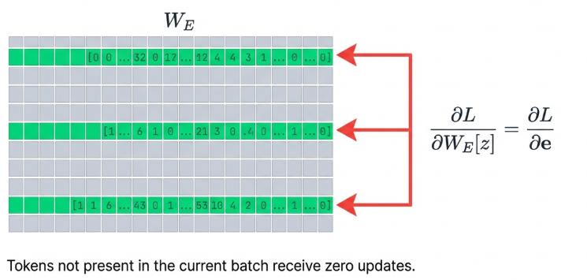

This is why subword tokenization is a fundamental implementation choice. By breaking "uncommon" words into "common" subword pieces, we ensure that every row in the embedding matrix is updated frequently, preventing "dead" or untrained vectors.

There are some other things to note on the training process:

- **Padding Tokens**: The `PAD` token should not influence the model's math. Implementations typically either initialize the `PAD` embedding to all zeros and freeze it or, more commonly, use attention masks to ensure the model never "looks" at the padding during computation.
- **Numerical Precision**: While lookup is numerically exact (indexing), scaling and subsequent layers often use float16 or bfloat16 to save memory.

#### Pre-trained vs. Learned from Scratch

- **Learned from Scratch**: Standard for LLMs (GPT, LLaMA). Optimized specifically for the target task but requires massive data.
- **Pre-trained** (Word2Vec, GloVe): Useful for small datasets.

If using pre-trained embeddings, one must decide whether to freeze them (no updates) or fine-tune them. Freezing preserves the original semantic space but can prevent the model from adapting to the specific nuances of your data.

#### Static vs. Contextual Embeddings

The embedding lookup layer produces **static embeddings**: each token always maps to the same vector, regardless of context.

- The word "bank" gets the same embedding whether it means a financial institution or a river bank
- The word "play" gets the same embedding whether it is a noun or a verb

However, once these static embeddings pass through the Transformer layers (attention + feed-forward), they become **contextual embeddings**. The attention mechanism allows each token's representation to incorporate information from surrounding tokens, resolving ambiguity.

$$
\mathbf{h}_{\text{bank}}^{(0)} = W_E[\text{bank}] \cdot \sqrt{d_{model}} \quad \text{(static, same for all contexts)}
$$

$$
\mathbf{h}_{\text{bank}}^{(L)} = \text{TransformerLayers}(\mathbf{h}^{(0)}) \quad \text{(contextual, different for each context)}
$$

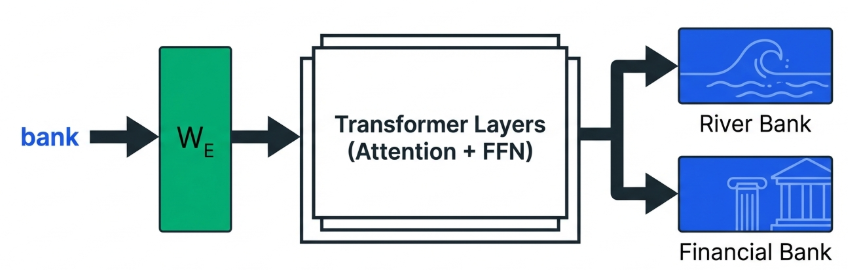

#### The Complete Pipeline

The embedding layer sits at the very beginning of the Transformer:

$$
\text{Text} \xrightarrow{\text{tokenize}} \text{Token IDs} \xrightarrow{\text{embed + scale}} \text{Vectors} \xrightarrow{+ \text{PE}} \text{Input to Encoder}
$$

After the embedding layer:

1. Positional encodings are added to give the model position information
2. The result enters the first encoder (or decoder) layer
3. From this point forward, everything operates on continuous vectors of dimension $d_{model}$

The embedding layer is the last place where the discrete nature of language is visible. Once tokens become vectors, the Transformer operates in a purely continuous mathematical space.

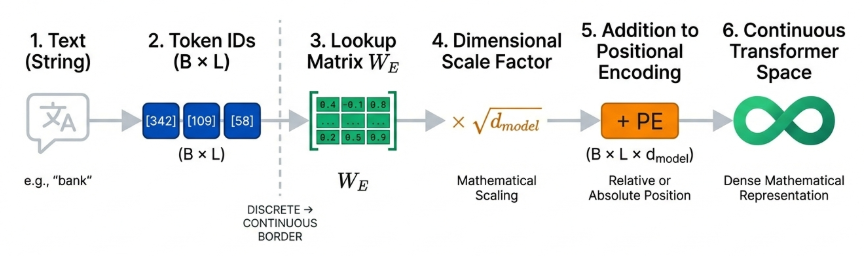

### Code Example

```python
import torch
import torch.nn as nn
import math

"""
Given a vocabulary size and embedding dimension, implement an embedding layer that converts
token indices into dense vector representations.

The embedding layer maps each token index to a learnable vector.
For an input sequence of token indices, return the corresponding embedding matrix
scaled by the square root of the model dimension.
"""

def create_embedding_layer(vocab_size: int, d_model: int) -> nn.Embedding:
    """
    Create an embedding layer.
    """
    # Torch provides a class that does exactly what we want, it creates a V x d_model matrix
    #
    # You can "execute" this class by passing it a list of indices (tokens), the Embedding class
    # will automatically perform the lookup operation.
    #
    # See https://docs.pytorch.org/docs/stable/generated/torch.nn.Embedding.html
    return nn.Embedding(vocab_size, d_model)

def embed_tokens(embedding: nn.Embedding, tokens: torch.Tensor, d_model: int) -> torch.Tensor:
    """
    Convert token indices to scaled embeddings.
    """
    # Does the W_E[z] indexing thing for an input of tokens  as a tensor that could look as follows
    # torch.LongTensor([[1, 2, 4, 5], [4, 3, 2, 9]])
    E_x = embedding(tokens)

    # Now we apply scaling :)
    return E_x * math.sqrt(d_model)
```

## Positional Encoding

### RNNs vs. Transformers

The evolution of natural language processing reached a pivotal turning point with the transition from Recurrent Neural Networks (RNNs) to Transformers. RNNs are inherently sequential; they process tokens one by one, maintaining a hidden state that naturally captures the passage of time. In an RNN, the model knows "this is the fifth word" simply because it is the fifth computation step. Transformers, however, abandoned this recurrence in favor of massive parallelization. By utilizing matrix operations to process all tokens in a sequence simultaneously, **Transformers achieved unprecedented training efficiency but at a significant cost: the loss of inherent order**.

Without a dedicated mechanism for spatial awareness, the Transformer attention mechanism is permutation equivariant. If you shuffle the input tokens, the attention mechanism, which relies on dot products between token embeddings, simply shuffles the output tokens with no change to their underlying values.

Consider the sentences "The dog bit the man" and "The man bit the dog." Because dot products are symmetric with respect to ordering, the attention mechanism views these as an identical set of embeddings. To the model, these two distinct scenarios are indistinguishable, representing a "bag of words" rather than a structured sentence. Positional Encoding is the introduction of order into this sequence-agnostic system, breaking the symmetry and allowing the model to distinguish position 1 from position 7.

### The Order Problem

To restore order, we must synthesize "what" a token is with "where" it resides. This requires us to assign every token a unique geographic coordinate within the model's high-dimensional vector space.

That we, we will add a positional vector to the semantic embedding:

$$
\mathbf{x}_i = \mathbf{e}_i + \text{PE}(i)
$$

In this equation, $\mathbf{e}_i$ represents the token embedding (with semantic meaning) and $\text{PE}(i) \in \mathbb{R}^{d\_{model}}$ is the positional encoding for position $i$. While one might consider concatenation, the original Transformer architecture opted for addition due to its superior efficiency.

A critical detail in this synthesis is the $\sqrt{d_{model}}$ scaling factor applied to the token embeddings before addition (see [Scaling and Weight Tying](/datascience/tensortonic/01_attention/#scaling-and-weight-tying)).

This is necessary as semantic embeddings grow in magnitude with the dimensionality, while positional encodings are bounded between $[-1, 1]$. Without this scaling, the semantic signal would overwhelm the positional signal, rendering the "geography" of the token invisible to the model.

### Sinusoidal Encoding

The original Transformer designers chose deterministic sine and cosine functions over simple integers or learned embeddings. A simple integer-based counter (0, 1, 2...) would lead to numerical instability as sequences grew longer, with position 1000 having a magnitude vastly larger than position 1. By contrast, sinusoidal functions provide bounded, periodic signals that create a unique "fingerprint" for every position.

The formulas for generating these encodings are defined as:

$$
\text{PE}(pos, 2i) = \sin\left(\frac{pos}{10000^{2i / d_{model}}}\right)
$$

$$
\text{PE}(pos, 2i+1) = \cos\left(\frac{pos}{10000^{2i / d_{model}}}\right)
$$

Where:

- $pos$: The absolute position in the sequence ($0, 1, 2, \dots$).
- $i$: The dimension index, ranging from $0$ to $d_{model}/2 - 1$.
- $d_{model}$: The total dimensionality of the model.

This formulation has the ability to represent relative position. For any fixed offset $k$, the encoding at position $pos + k$ can be expressed as a linear transformation of the encoding at $pos$ via a rotation matrix:

$$
\begin{pmatrix}
\text{PE}(pos+k, 2i) \\
\text{PE}(pos+k, 2i+1)
\end{pmatrix} =
\begin{pmatrix}
\cos(k\omega_i) & \sin(k\omega_i) \\
-\sin(k\omega_i) & \cos(k\omega_i)
\end{pmatrix}
\begin{pmatrix}
\text{PE}(pos, 2i) \\
\text{PE}(pos, 2i+1)
\end{pmatrix}
$$

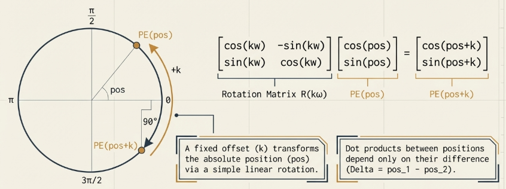

This property ensures that the attention mechanism can learn distance-based relationships (e.g., "the word 3 positions to the left") through simple dot products, regardless of the tokens' absolute positions in the sequence. By using both sine and cosine, the model effectively maps each position to a point on a multidimensional circle that can be rotated to find relative neighbors.

### Frequency Signals

The positional encoding vector is a composite of signals with varying frequencies, capturing positional information at multiple scales simultaneously.

- **Binary Counting Analogy**: Much like bits in a binary number, the low-index dimensions of the vector flip rapidly (like the least significant bit), while high-index dimensions change slowly.
- **Clock Hand Analogy**: Each sine-cosine pair acts as a "clock hand" rotating at a different speed. The "fast hands" in the low dimensions ($i=0$) complete a cycle every $2\pi$ positions, distinguishing immediate neighbors. The "slow hands" in the high dimensions ($i = d_{model}/2 - 1$) rotate at a frequency of 1/10000, providing coarse-grained data.

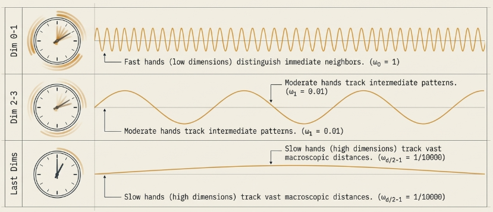

The choice of 10,000 as the base for the frequency denominator is a decision that determines the range of the "clock." With this base, the longest wavelength is approximately $10,000 \times 2\pi \approx 62,832$ positions.

What if we changed the base?

- Base $100$: The frequency range would compress. The slowest dimensions would cycle too quickly, and the model would lose the ability to distinguish between tokens separated by long distances.
- Base $1,000,000$: The frequencies would spread too far apart. While this provides a massive range, the change in the slow dimensions might become so infinitesimal that the model struggles to learn meaningful position-dependent patterns during training.

#### Example: A $d_{model} = 4$ Case Study

To demystify these mechanics, consider a sequence where $d_{model} = 4$. We calculate the frequencies as $\omega_0 = 1/10000^{0/4} = 1$ and $\omega_1 = 1/10000^{2/4} = 0.01$.

**Calculated Encodings for $d_{model}=4$**

```
Position 0: [ 0.000,  1.000,  0.000,  1.000] (sin(0), cos(0), sin(0), cos(0))
Position 1: [ 0.841,  0.540,  0.010,  1.000] (sin(1), cos(1), sin(0.01), cos(0.01))
Position 2: [ 0.909, -0.416,  0.020,  1.000] (sin(2), cos(2), sin(0.02), cos(0.02))
```

In this example, dimensions 0 and 1 (high frequency) change dramatically as we move from position 0 to 2. However, dimensions 2 and 3 (low frequency) remain nearly static, shifting only by $0.01$ and less than $0.001$ respectively.

This demonstrates the multi-scale nature of the vector: the first half provides high-resolution local tracking, while the second half provides a stable anchor for the broader context.

### Fixed vs. Learned Encodings

While the original Transformer used fixed sinusoidal encodings, the field has continuously debated the merits of Learned Positional Embeddings, where a unique vector for every position is treated as a learnable parameter.

- **Sinusoidal (Fixed)**: These require no extra parameters and allow for "extrapolation"—the ability to handle sequences longer than those seen in training.
- **Learned**: Used by models like BERT and GPT-2, these are highly flexible but are strictly limited to a maximum sequence length ($L_{max}$) defined at training.

Interestingly, the original Transformer paper found that fixed and learned encodings produced nearly identical results. However, as models have scaled, more sophisticated alternatives have emerged to solve the extrapolation problem:

- **Rotary Position Embeddings (RoPE)**: Used in LLaMA, RoPE rotates the query and key vectors during the attention step, making the dot product naturally relative.
- **ALiBi (Attention with Linear Biases)**: This adds a penalty to attention scores that increases with distance, controlled by a head-specific slope m.
- **Relative Position Encodings**: These explicitly model the distance between every pair of tokens rather than their absolute coordinates.

### What About Semantics

The intuitive concern that adding position vectors might "corrupt" the semantic meaning of a word is addressed by the Information-Theoretic Perspective. In a high-dimensional space (e.g., $d_{model} = 512$), there is an immense amount of "geometric room."

Token embeddings typically occupy a low-dimensional subspace of the available space. Because the positional encodings are designed with specific periodicities, they generally occupy a different, non-overlapping subspace. Through training, the Transformer layers learn to disentangle these signals, treating some dimensions as content carriers and others as context markers.

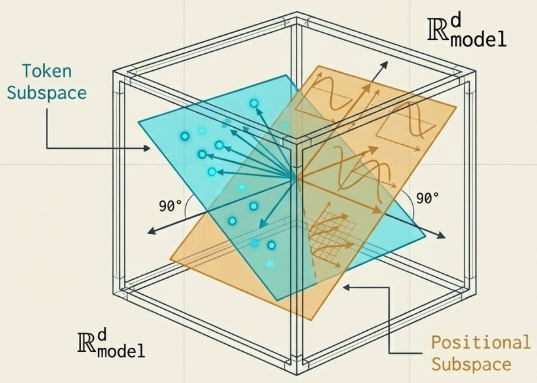

Furthermore, these encodings introduce a beneficial local attention bias. Because nearby positions have high dot-product similarity in their encodings, the attention mechanism naturally favors local context.
