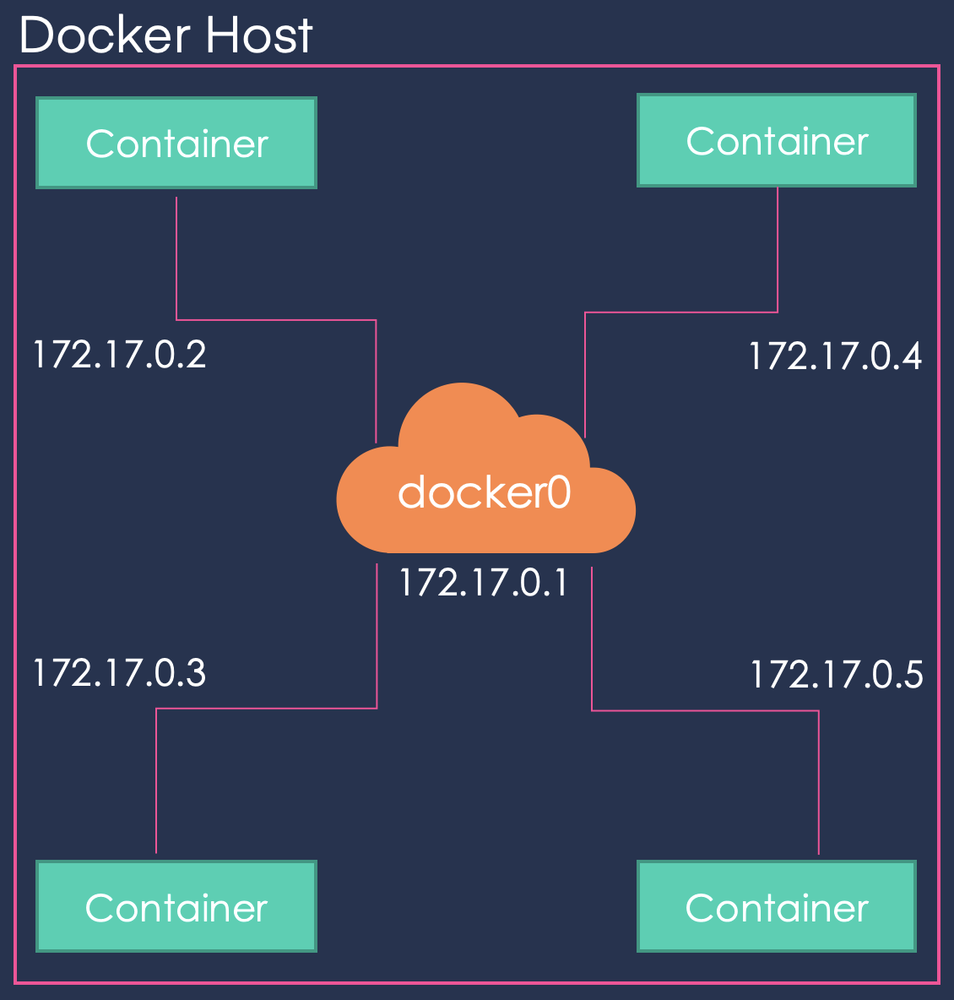

## Networking

### `Bridge`

This is a private internal network created by `Docker` on the host. All containers can access each other using their internal IP (usually subnets of `172.17.0.3`).

To access from outside you have to map a port of the container to a port of the host.



### `host`

Another way to configure the network is to associate the container to the host's network, removing all kind of network isolation between the `Docker` host and the `Docker` container.

This way when you run a server on port `5000` it would automatically accessible from the host on the port `5000` without needing to map it to a host's port.

This prevents you from using the same ports for different applications.

### `none`

The containers are not attached to any network and are, therefore, isolated from any other containers so they do not have any access to the external network or other containers.

### User defined networks

Because with the default internal network, the containers can access each other, it is sometimes desirable to create new internal networks:

```console
$ docker network create --drive bridge --subnet 172.18.0.0/16 <network_name>
```

To list the created networks:

```console
$ docker network ls
```

### Inspect network

In order to see the network configuration use inspect and head to the `Networks` section:

```console
$ docker inspect ( container_name | container_id )
```

```json
.
.
.
          "MacAddress": "aa:bb:cc:dd:ee:ff",
            "Networks": {
                "bridge": {
                    "IPAMConfig": null,
                    "Links": null,
                    "Aliases": null,
                    "NetworkID": "24af0d...",
                    "EndpointID": "3449a29...",
                    "Gateway": "172.17.0.1",
                    "IPAddress": "172.17.0.3",
                    "IPPrefixLen": 16,
                    "IPv6Gateway": "",
                    "GlobalIPv6Address": "",
                    "GlobalIPv6PrefixLen": 0,
                    "MacAddress": "02:42:ac:11:00:03",
                    "DriverOpts": null
                }
            }
.
.
.
```

### Embedded DNS

When containers in the same subnet may want to access each other, for that you could hard code the internal IP assigned to the containers. However this is not advisable, as this IP may change when the container is started in another occasion in the future.

Because of that all containers in a `Docker` host can resolve each other using their names. This is possible has a built-in DNS server for this purpose that runs at `172.0.0.11`.

## Storage

### Layers

Because of `Docker`'s layered architecture when creating very similar images that share a lot of instructions, it uses the cached layers and is, therefore more efficient by not building each image from scratch.

For example, when you update your application's source code, only the instructions after the `COPY` instruction, this one included, from your `Dockerfile` is run.

#### Image and Container Layers

The layers created from each instruction on the `Dockerfile` constitute the image layers and are all read-only files.

When you run your image a new layer is created, denoted by `Container Layer` which is a writable file which is a writable file. However, when the container is destroyed, this layer is removed. This is the reason why we use volumes for permanent storage.

This is needed because all the containers use the same image, so the changes made in the image by the different containers should not affect the image.

#### Copy-on-write

Also, the changes made on files stored in the image are not made on the original file. The file is copied to the `Container Layer` and the changes are made onto this copy.

### Volumes

As we have said, we need volumes to store permanent data. So, first we create the volume:

```console
$ docker volume <volume_name>
```

Which is stored in `/var/lib/docker/volumes`

#### Volume mounting

Once we have created the volume, we specify that we want to mount this volume within our container:

```console
$ docker run -v <volume_name>:/var/lib/mysql mysql
```

If you run this same command, without creating the volume first, `Docker` will automatically create the volume for you.

#### Bind mounting

If you want to mount another directory that is not inside `/var/lib/docker/volumes`, then you have to specify the whole directory's (may be an absolute or relative path).

```console
$ docker run -v /data/mysql:/var/lib/mysql mysql
```

#### Mount

This is the new way to mount:

```console
$ docker run --mount type=bind,source=/data/mysql,target=/var/lib/mysql
```

Which is preferred as it is more verbose.

### Storage Administration

The responsible for all of these operations that happen under the hood are the storage drivers, which are chosen depending on the hosts' OS:

- `AUFS`
- `ZFS`
- `BTRFS`
- `Device Mapper`
- `Overlay`
- `Overlay2`

## Docker Compose

### Build

If we would like to tell `Docker Compose` to build a `Docker` build instead of pulling an image we use the `build` keyword inside a service instead of the `image` keyword. And we specify the location of the directory which contains the application code and a `Dockerfile`.

```yaml
vote:
  build: ./vote
  ports:
    - 5000:80
  links:
    - redis
```

### Versions

Different `Docker Compose` versions have different formats and functionality.

#### Version 2

From version 2 on, you must specify the `Docker Compose` version by adding to the top of the file:

```yaml
version: 2
```

Also, all of the different containers should be listed under a `sevices` section.

And now, `links` are no longer needed as `Docker` creates a virtual network and attaches all of the services to this network with the name of the service.

Finally, a `depends_on` keyword is introduced to force a order of startup.

## Docker Compose Networks

Let's start with an example application, which is made up of five services:

- `voting-app`: a front-end application for the user to vote.
- `redis`: and in-memory database to store the vote.
- `worker`: application in the back-end that processes the vote and stores it in the database.
- `db`: database in which the vote is stored.
- `result-app`: front-end application that shows the voting results.

In this architecture we have two networks:

- `front-end`: `voting-app` and `result-app`
- `back-end`: all the services.

Therefore it is desirable to define two networks in our `docker-compose` and attach the networks to the services:

```yaml
version: 2
services:
  redis:
    image: redis
    networks:
      - back-end
  db:
    image: postgres
    networks:
      - front-end
  vote:
    image: voting-app
    networks:
      - front-end
      - back-end
  result:
    image: result
    networks:
      - front-end
      - back-end
  worker:
    image: worker
    networks:
      - front-end
      - back-end

networks:
  - front-end:
  - back-end:
```

As you can see we define two networks: `front-end` and `back-end` (note that we have omitted the configuration of the networks) and then for each service we specify the network to which the service has access (also, observe that the configuration of the services has been trimmed down for readability purposes).

## Docker Registry

### Public Registry

In the following example you are pulling the `nginx` image, which in reality is stored as `nginx/nginx` where the first `nginx` corresponds to the user name, and the second to the image name.

```yaml
image: nginx
```

This is a public image so it is stored in a public registry, usually in `docker.io` which is the default registry. So a more verbose configuration file would be:

```yaml
image: docker.io/nginx/nginx
```

### Private Registry

When you have applications that should no be made available to the public private registries are used.

To pull or use an image from a private registry:

1. Register into the private registry:

```console
$ docker login private-registry.io
```

2. Run the image indicating the registry:

```console
$ docker run private-registry.io/apps/internal-app
```

#### Deploy Private Registry

A private registry is in itself a docker image, so first you have to have your registry image running:

```console
$ docker run -p 5000:5000 --name registry registry:2
```

So now you have your registry running on port 5000. The next step is to assign a tag to your image as follows:

```console
$ docker image tag my-image localhost:5000/my-image
```

Where `my-image` is the name of the image and `localhost:5000/my-image` is the tag assigned.

Finally you push your image to your registry

```console
$ docker push localhost:5000/my-image
```

Now you can pull your image:

```console
$ docker pull localhost:5000/my-image
$ docker pull 192.168.56.100:5000/my-image
```

## Docker Engine

### Containerization

As we have seen all of our containers run on top of the same operative system, so it is a given that the processes will be handled by the same kernel. This means that the processes of our containers are run along with the rest of processes in the host machine, in other words the `PIDs` of all the processes must be different.

What `Docker` does to isolate these processes is the container is using namespaces and maps the process id to another process id within the container, and that is visible only on this container.

### cgroups

Because all docker containers share the hosts resources it could be possible that a container takes up all of the machine's resources. So, to restrict the amount of resources used by a container `Docker` uses `cgroups`. You can specify the amount of CPU or RAM that the container is allowed to have:

```
$ docker run --cpus=.5 ubuntu
$ docker run --memory=100m ubuntu
```

## Docker on Windows and Mac

### Windows Containers

The options just discussed will only work for `Linux` applications and containers. In 2016 Microsoft announced support for Windows containers, there are two types:

- `Windows Server Container`: the containers share the kernel, as regular `Linux` containers do.
- `Hyper-V isolation`: each container is run within a highly optimized virtual machine, so complete kernel isolation between the containers and the underline host is guaranteed.

#### Base Images

Where in `Linux` we had the `debian`, `ubuntu` or `alpine` base images in windows we have two options:

- `Windows Server Core`
- `Nano Server`: this is a headless deploy of the `Windows Server`, that is, the lightweight option.
