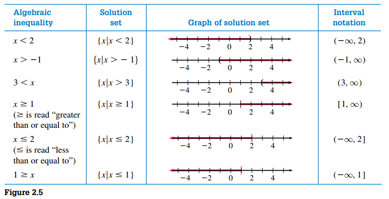

## Inequalities

**Solving an inequality** is the process of finding the numbers that make an algebraic inequality a true numerical statement. We call such numbers the solutions of the inequality; the solutions satisfy the inequality.

There are various ways to display the solution set of an inequality. The three most common ways to show the solution set are **set builder notation**, a **line graph** of the solution, or **interval notation**.

### Solving Inequalities

#### Addition Property of Inequality

> [!NOTE] **Property**
>
> For all real numbers \(a\), \(b\), and \(c\)
>
> $$ a > b \text{ if and only if } a + c > b + c $$

This property is analogous for \(<\), \(\leq\) and \(\geq\).

#### Multiplication Property of Inequality

> [!NOTE] **Property**
>
> For all real numbers \(a\), \(b\), and \(c\) with \(c > 0\)
>
> $$ a > b \text{ if and only if } ac > bc $$

> [!NOTE] **Property**
>
> For all real numbers \(a\), \(b\), and \(c\) with \(c > 0\)
>
> $$ a > b \text{ if and only if } ac < bc $$

## Equations and Inequalities Involving Absolute Value

> [!NOTE] **Property 2.1**
>
> \(|x| = k\) is equivalent to \(x = - k\) or \(x = k\), where \(k\) is a positive number.

### Solving Inequalities That Involve Absolute Value

> [!NOTE] **Property 2.2**
>
> \(|x| < k\) is equivalent to \(x > - k\) or \(x < k\), where \(k\) is a positive number.

Remember that we can write a conjunction such as \(x > -k\) and \(x < -k\) in the compact form \(-k < x < k\).

> [!NOTE] **Property 2.3**
>
> \(|x| > k\) is equivalent to \(x < - k\) or \(x > k\), where \(k\) is a positive number.
