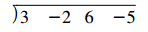
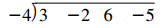
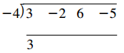
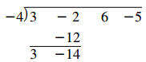
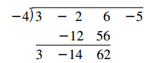
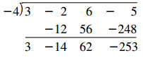

## Simplifying Rational Expressions

> [!NOTE] **Property 4.1**
>
> $$ \frac{-a}{b} = \frac{a}{-b} = -\frac{a}{b}, \text{ where } b \neq 0 $$
>
> $$ \frac{-a}{-b} = \frac{a}{b}, \text{ where } b \neq 0 $$

> [!NOTE] **Property 4.2 Fundamental Principle of Fractions**
>
> If \(b\) and \(k\) are nonzero integers and \(a\) is any integer, then
>
> $$ \frac{a \cdot k}{b \cdot k} = \frac{a}{b} $$

## More on Rational Expressions and Complex Fractions

### Simplifying Complex Fractions

> [!TIP] **Definition**
>
> **Complex fractions** are fractional forms that contain rational numbers or rational expressions in the numerators and/or denominators.

## Dividing Polynomials

Given a polynomial \(p(x)\) and a divisor of the form \(x - k\) the division process can be simplified by a procedure called **synthetic division**. This procedure is a shortcut for this type of polynomial division.

First, let’s consider an example and use the usual division process. Then, in step-by-step fashion, we can observe some shortcuts that will lead us into the synthetic-division procedure. Consider the division problem

$$
(3x^3 - 2x^2 + 6x - 5) / (x + 4)
$$

1. Write the coefficients of the dividend as follows

2. In the divisor, \(x + 4\), use \(-4) instead of \(4) so that later we can add rather than subtract.

3. Bring down the first coefficient of the dividend \((3)\).

4. Multiply \((3)(-4)\), which yields \(-12\); this result is to be added to the second coefficient of the dividend \(-2\).

5. Multiply \((-14)(-4)\), which yields \(56\); this result is to be added to the third coefficient of the dividend \((6)\).

6. Multiply \((62)(-4)\), which yields \(-248\); this result is added to the last term of the dividend \((-5)\).

The last row indicates a quotient of \(3x^2 - 14x + 62\) and a remainder of \(-253\).

## Fractional Equations

> [!TIP] **Defitinion**
>
> A statement of equality between two ratios is called a **proportion**.
