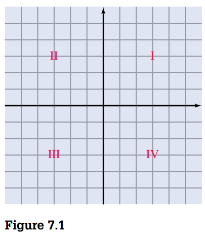
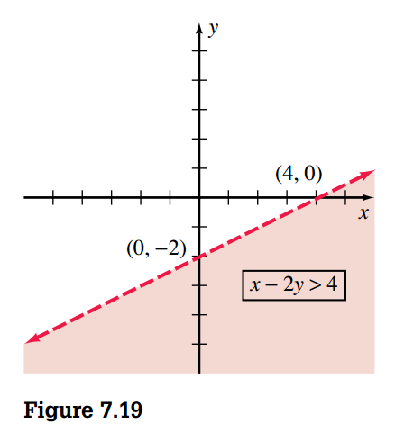
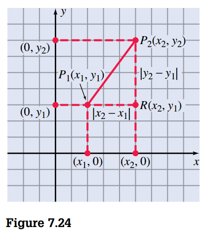
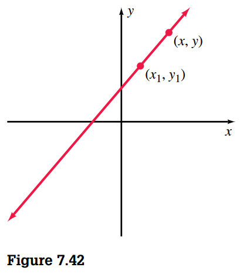

## Rectangular Coordinate System and Linear Equations

### Review of the Rectangular Coordinate System

Consider two number lines, one vertical and one horizontal, perpendicular to each other at the point we associate with zero on both lines (Figure 7.1). We refer to these number lines as the **horizontal and vertical axes** or, together, as the **coordinate axes**. They partition the plane into four regions called **quadrants**.

In general we refer to the real numbers a and b in an ordered pair \((a, b)\) associated with
a point as the coordinates of the point. The first number, \(a\), called the **abscissa**. The second number, \(b\), called the **ordinate**.

This system of associating points in a plane with pairs of real numbers is called the **rectangular coordinate system** or the **Cartesian coordinate system**.

### Graphing Linear Equations by Locating the \(x\) and \(y\) Intercepts

The \(x\) coordinates of the points that a graph has in common with the \(x\) axis are called the \(x\) **intercepts** of the graph. (To compute the \(x\) intercepts, let \(y = 0\) and solve for \(x\).)

The \(y\) coordinates of the points that a graph has in common with the \(y\) axis are called the \(y\) intercepts of the graph. (To compute the \(y\) intercepts, let \(x = 0\) and solve for \(y\).)

In general, any equation of the form \(Ax + By = C\), where \(A\), \(B\), and \(C\) are constants (\(A\) and \(B\) not both zero) and \(x\) and \(y\) are variables, is a **linear equation**.

## Linear Inequalities in Two Variables

Linear inequalities in two variables are of the form \(Ax + By > C\) or \(Ax + By < C\), where \(A\), \(B\), and \(C\) are real numbers. (Combined linear equality and inequality statements are of the form \(Ax + By \geq C\) or \(Ax + By \leq C\).)

To graph a linear inequality, we suggest the following steps:

1. First, graph the corresponding equality. Use a solid line if equality is included in the original statement. Use a dashed line if equality is not included.
2. Choose a “test point” not on the line and substitute its coordinates into the inequality. (The origin is a convenient point to use if it is not on the line.)
3. The graph of the original inequality is
   - the half-plane that contains the test point if the inequality is satisfied by that point, or
   - the half-plane that does not contain the test point if the inequality is not satisfied
     by the point.

For example, let's graph \(x - 2y > 4\)

## Distance and Slope

The basis for a general distance formula for finding the distance between any two points in a coordinate plane is as follows:

1. Let \(P_1(x_1, y_1)\) and \(P_2(x_2, y_2)\) represent any two points in a coordinate plane.
2. Form a right triangle as indicated in Figure 7.24. The coordinates of the vertex of the
   right angle, point \(R\), are \(x_2, y_1\)

The length of \(\overline{P_1R}\) is \(|x_2 - x_1|\) and the length of \(\overline{RP_2}\) is \(|y_2 - y_1|\). Let \(d\) represetn the length of \(\overline{P_1P_2}\) and apply the Pythagorean theorem to obtain

$$
d^2 = |x_2 - x_1|^2 + |y_2 - y_1|^2
$$

Because \(|a|^2 = a^2\) the **distance formula** can be stated as

$$
d = \sqrt{(x_2 - x_1)^2 + (y_2 - y_1)^2}
$$

### Finding the Slope of a Line

In coordinate geometry, the concept of slope is used to describe the “steepness” of lines. The **slope** of a line is the ratio of the vertical change to the horizontal change.

> [!TIP] **Definition 7.1 Slope of a Line**
>
> If points \(P_1\) and \(P_2\) with coordinates \(x_1, y_1\) and \(x_2, y_2\), respectively, are any two different points on a line, then the slope of the line (denoted by \(m\)) is
>
> $$ m = \frac{y_2 - y_1}{x_2 - x_1}, x_2 \neq x_1 $$

"e need to realize that _the concept of slope is undefined for vertical lines_. This is due to the fact that for any vertical line, the horizontal change as we move from one point on the line to another is zero.

## Determining the Equation of a Line

### Using the Point-Slope Form to Write Equations of Lines

Choosing a point \((x, y)\) to represent any other point on the line (Figure 7.42) and using the given point \((x_1, y_1)\), we can determine the slope to be

$$
m = \frac{y - y_1}{x - x_1}, x \neq x_1 \\
y - y_1 = m(x - x_1)
$$

We refer to this equation as the **point-slope form**.

### Applying the Slope-Intercept Form of an Equation

A \(y\) intercept of \(b\) means that the line contains the point \((0, b)\). Therefore, we can use the point-sloper form as follows:

$$
y - y_1 = m (x - x_1) \\
y - b = m(x - 0) \\
y - b = mx \\
y = mx + b
$$

We refer to this equation as the **slope-intercept form**.

We use two forms of equations of straight lines extensively. They are the standard form and the slope-intercept form, and we describe them as follows.

**Standard Form**: \(Ax + By = C\), where \(B\) and \(C\) are ingers and \(A\) is a nonnegative integer (\(A\) and \(B\) are not both zero).
**Slope-Intercept Form** \(y = mx + b\), where \(m\) is a real number representing the slope, and \(b\) is a real number representing the \(y\) intercept.

### Finding Equations for Parallel and Perpendicular Lines

If two lines have slopes \(m_1\) and \(m_2\), respectively, then

1. The two lines are parallel if and only if \(m_1 = m_2\)
2. The two lines are perpendicular if and only if \(m_1 m_2 = -1\)

## Graphic Nonlinear Equations

> [!INFO] **\(y\) Axis Symmetry**
>
> The graph of an equation is symmetric with respect to the \(y\) axis if replacing \(x\) with \(-x\) results in an equivalent equation.

> [!INFO] **\(x\) Axis Symmetry**
>
> The graph of an equation is symmetric with respect to the \(x\) axis if replacing \(y\) with \(-y\) results in an equivalent equation.

> [!INFO] **Origin Axis Symmetry**
>
> The graph of an equation is symmetric with respect to the origin if replacing \(x\) with \(-x\) and \(y\) with \(-y\) results in an equivalent equation.
