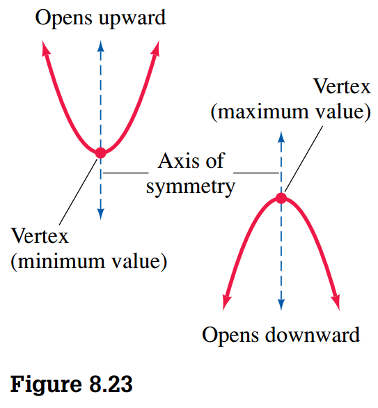
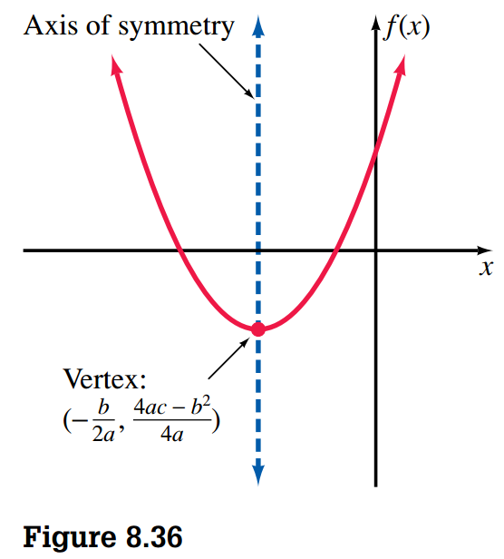

## Concept of a Function

> [!NOTE] **Vertical Line Test**
>
> If each vertical line intersects a graph in no more than one point, then the graph represents a function.

### Finding the Difference Quotient

The quotient \(\frac{f(a + h) - f(a)}{h}\) is often called a **difference quotient**.

## Linear Functions and Applications

Any function that can be written in the form

$$
f(x) = ax + b
$$

where \(a\) and \(b\) are real numbers, is called a **linear function**.

The linear function \(f(x) = x\) is often called the **identity function**. Any linear function of the form \(f(x) = ax + b\), where \(a = 0\), is called a **constant function**.

A property of plane geometry states that if two or more lines are perpendicular to the same line, then they are parallel lines.

## Quadratic Functions

Any function that can be written in the form

$$
f(x) = ax^2 + bx + c
$$

where \(a\), \(b\) and \(c\) are real numbers and \(a \neq 0 \) is called a **quadratic function**. The graph of any quadratic function is a **parabola** (See Figure 8.23).

> [!NOTE] **Vertical Translation of a Quadratic Function**
>
> In general, the graph of a quadratic function of the form \(f(x) = x^2 + k\) is the same as the
> graph of \(f(x) = x^2\), except that it is moved up or down \(|k|\) units, depending on
> whether \(k\) is positive or negative. We say that the graph of \(f(x) = x^2 + k\) is a
> **vertical translation** of the graph of \(f(x) = x^2\).

> [!NOTE] **Stretching a Quadratic Function**
>
> In general, the graph of a quadratic function of the form \(f(x) = ax^2\) has its vertex at the origin and opens upward if
> \(a\) is positive and downward if \(a\) is negative. The parabola is narrower than the basic parabola if \(|a| > 1\) and wider if \(|a| > 1\).

> [!NOTE] **Horizontal Translation of a Quadratic Function**
>
> In general, the graph of a quadratic function of the form \(f(x) = (x - h)^2\) is the same as
> the graph of \(f(x) = x^2\), except that it is moved to the right \(h\) units if \(h\) is positive or
> moved to the left \(|h|\) units if \(h\) is negative. We say that the graph of \(f(x) = (x - h)^2\)
> is a **horizontal translation** of the graph of \(f(x) = x^2\).

> [!NOTE] **Transformation of a Quadratic Function**
>
> In general, the graph of a quadratic function of the form \(f(x) = a(x - h)^2 + k\) has its
> vertex at \((h, k)\) and opens upward if \(a\) is positive and downward if \(a\) is negative.
> The parabola is narrower than the basic parabola if \(|a| > 1\) and wider if \(|a| < 1>\).

### Graphing Quadratic Functions of the Form \(f(x) = ax^2 + bx + c\)

The general approach is to change from the form \(f(x) = ax^2 + bx + c\) to the form \(f(x) = a(x - h)^2 + k\)
by [completing the square](../06_quadratic_equations#completing-the-square). The we apply what we
saw about the transformation of quadratic functions to graph them.

## More Quadratic Functions and Applications

In general, if we complete the square on:

$$
f(x) = ax^2 + bx + c
$$

we obtain:

$$
f(x) = a\left(x^2 + \frac{b}{a}x\right) + c
$$

$$
= a\left(x^2 + \frac{b}{a}x + \frac{b^2}{4a^2}\right) + c - \frac{b^2}{4a}
$$

$$
= a\left(x + \frac{b}{2a}\right)^2 + \frac{4ac - b^2}{4a}
$$

Therefore the parabola associated with the function has its vertex at:

$$
\left(-\frac{b}{2a}, \frac{4ac - b^2}{4a}\right)
$$

and the equation of its axis of symmetry is:

$$
x = -\frac{b}{2a}
$$

We now have another way of graphing quadratic functions of the form \(f(x) = ax^2 + bx + c\),
as indicated by the following steps:

- Determine whether the parabola opens upward or downward.
- Find \(-\frac{b}{2a}\), which is the \(x\) coordinate of the vertex
- Find \(f(-\frac{b}{2a})\), which is the \(y\) coordinate o the vertex. You can also find it by evaluating:

$$
\frac{4ac - b^2}{4a}
$$

- Locate another point on the parabola, and also locate its image across the axis of symmetry, which is the line with equation \(-\frac{b}{2a}\).

### Transformations of Some Basic Curves

If we know the shapes of a few basic curves, then it is easy to sketch numerous
variations of these curves by using the concepts of translation and reflection.

- Determine the domain of the function.
- Find the \(y\) intercept by evaluating \(f(0)\). Find the x intercept by finding the value(s) of \(x\) such that \(f(x) = 0\).
- Determine any types of symmetry that the equation possesses.
- Set up a table of ordered pairs that satisfy the equation.
- Plot the points associated with the ordered pairs and connect them with a smooth curve.

> [!NOTE] **Vertical Translation**
>
> The graph of \(y = f(x) + k\) is the graph of \(y = f(x)\) shifted \(k\) units upward if
> \(k > 0\) or shifted \(|k|\) units downward if \(k < 0\).

> [!NOTE] **Horizontal Translation**
>
> The graph of \(y = f(x - h)\) is the graph of \(y = f(x)\) shifted \(h\) units to the right if
> \(k > 0\) or shifted \(|k|\) units to the left if \(h < 0\).

### Reflections of the Basic Curves

> [!NOTE] **\(x\) Axis Reflection**
>
> The graph of \(y = -f(x)\) is the graph of \(y = f(x)\) reflected through the \(x\) axis.

> [!NOTE] **\(y\) Axis Reflection**
>
> The graph of \(y = f(-x)\) is the graph of \(y = f(x)\) reflected through the \(y\) axis.

### Vertical Stretching and Shrinking

Translations and reflections are called **rigid transformations** because the basic shape of the
curve being transformed is not changed. In other words, only the positions of the graphs are
changed.

> [!NOTE] **Vertical Stretching and Shrinking**
>
> The graph of \(y = cf(x)\) is obtained from the graph of \(y = f(x)\) by multiplying
> the \(y\) coorindate for \(y = f(x)\) by \(c\). If \(|c|> 1\), the graph is said to be
> **stretched** by a factor of \(c\), and if \(0 < |c| < 1\), the graph is said to be
> **shrunk** by a factor of \(|c|\).

## Combining Functions

In general, if \(f\) and \(g\) are functions, and \(D\) is the intersection of their domains,
then the following definitions can be made:

**Sum**

$$
(f + g)(x) = f(x) + g(x)
$$

**Difference**

$$
(f - g)(x) = f(x) - g(x)
$$

**Product**

$$
(fg)(x) = f(x)g(x)
$$

**Quotient**

$$
\left(\frac{f}{g}\right)(x) = \frac{f(x)}{g(x)}, g(x) \neq 0
$$

### Composition of Functions

> [!TIP] **Definition 8.2**
>
> The **composition** of functions \(f\) and \(g\) is defined by
>
> $$ (f \circ g)(x) = f(g(x)) $$
>
> for all \(x\) is the domain of \(g\) such that \(g(x)\) is in the domain of \(f\).

_The composition of functions is not a commutative operation_.

## Direct and Inverse Variation

### Direct Variation

The statement \(y\) varies directly as \(x\) means:

$$
y = kx
$$

where \(k\) is a nonzero constant called the **constant of variation**
or **constant of proportionality**.

### Inverse Variation

The statement \(y\) varies inservely as \(x\) means:

$$
y = \frac{k}{x}
$$

where \(k\) is a nonzero constant.
