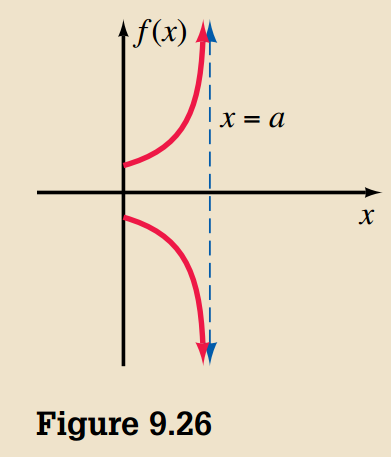
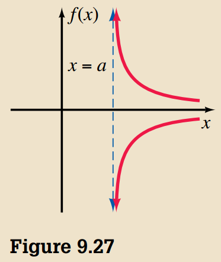
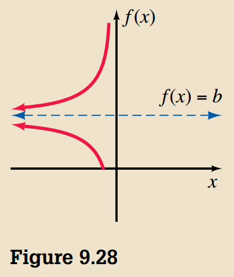
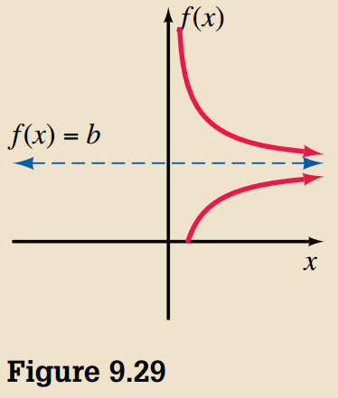
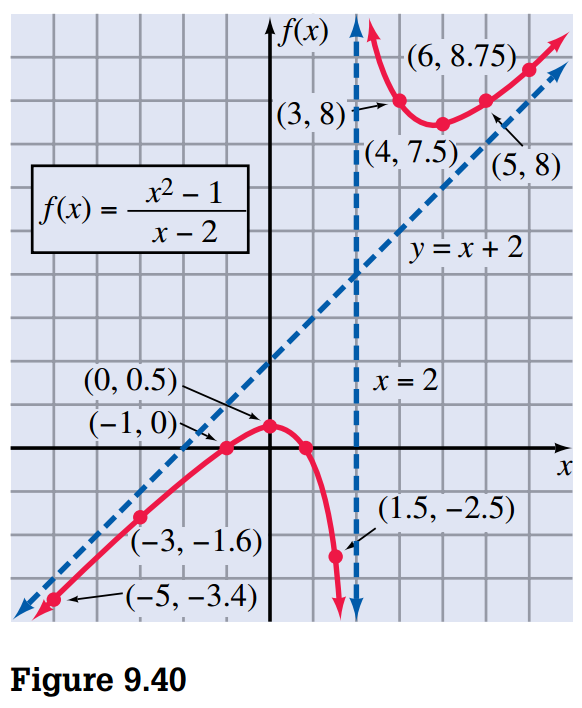

## Synthetic Division

> [!INFO] **Division Algorithm for Polynomials**
>
> If \(f(x)\) and \(d(x)\) are polynomials and \(d(x) \neq 0\),then there exist unique polynomials \(q(x)\) and \(r(x)\) such that
>
> $$ f(x) = d(x)q(x) + r(x) $$
>
> where \(r(x) = 0\) or the degree of \(r(x)\) is less than the degree of \(d(x)\).

## Remainder and Factor Theorems

Let’s consider the division algorithm:

$$
f(x) = d(x)q(x) + r(x)
$$

can be rewritten as:

$$
f(x) = (x - c)q(x) + r(x)
$$

when the divisor is a linear polinomial, \(d(x) = (x - c\).

Because the degree of the remainder \(r(x)\) must be less than the degree of the divisor we conclude that the degree of \(r(x)\) is zero, and therefore it is a constant value, \(R\):

$$
f(x) = (x - c)q(x) + R
$$

If we evaluate at \(c\) then:

$$
f(c) = (c - c)q(x) + R = R
$$

> [!NOTE] **Property 9.1 Remainder Theorem**
>
> If the polynomial \(f(x)\) is divided by \(x - c\), then the remainder is equal to \(f(c)\).

### Factor Theorem

> [!NOTE] **Property 9.2 Factor Theorem**
>
> A polynomial \(f(x)\) has a factor \(x - c\) if and only if \(f(c) = 0\).

As we saw before when we divide \(f(x)\) by \(x - c\) we obtain \(f(c) = R\). For \(c\) to be the remainder \(R\) must be zero.

## Polynomial Equations

The equation

$$
a_nx^{n} + a_{n-1}x^{n-1} + \cdots + a_1 x + a_0 = 0
$$

is called a **polynomial euqation of degree \(n\)**.

> [!NOTE] **Propertry 9.3**
>
> A polynomial equation of degree \(n\) has \(n\) solutions, and any solution of multiplicity \(p\) is counted \(p\) times.

### Finding Rational Solutions

> [!NOTE] **Property 9.4 Rational Root Theorem**
>
> Consider the polynomial equation
>
> $$ a_nx^{n} + a_{n-1}x^{n-1} + \cdots + a_1 x + a_0 = 0 $$
>
> in which the coefficientes \(a_0, a_1, \cdots, a_n\) are integers. If the rational number \frac{c}{d}, reduced to lowest terms, is a solution of the equation, then \(c\) is a factor of the constant term \(a_0\), and \(d\) is a factor of the leading coefficient \(a_n\).

> [!NOTE] **Property 9.5**
>
> Nonreal complex solutions of polynomial equations with real coefficients, if they exist, must occur in conjugate pairs.

> [!NOTE] **Property 9.6 Decartes' Rule of Signs**
>
> Let \(a_nx^{n} + a_{n-1}x^{n-1} + \cdots + a_1 x + a_0 = 0\) be a polynomial equation with real coefficients.
>
> 1. The number of positive real solutions of the given equation either is equal to the number of variations in sign of the polynomial or is less than the number of variations by a positive even integer.
> 2. The number of negative real solutions of the given equation either is equal to the number of variations in sign of the polynomial \(a_n(-x)^n + a_{n-1}(-x)^{n-1} + \cdots + a_1(-x) + a_0\) or is less than the number of variations by a positive even integer.

## Graphing Rational Functions

A function of the form

$$
f(x) = \frac{p(x)}{q(x)}, q(x) \neq 0
$$

where \(p(x)\) and \(q(x)\) are polynomials is called a **rational function**.

> [!NOTE] **Vertical Asymptote**
>
> A line \(x = a\) is a vertical asymptote for the graph of a function \(f\) if:
>
> 1. \(f(x)\) either increases or decreases without bound as \(x\) approaches \(a\) from the left (see Figure 9.26).
> 2. \(f(x)\) either increases or decreases without bound as \(x\) approaches \(a\) from the right (see Figure 9.27).

> [!NOTE] **Horizontal Asymptote**
>
> A line \(y = b\) is a horizontal asymptote for the graph of a function \(f\) if:
>
> 1. \(f(x)\) approaches \(b\) from above or below as \(x\) get infinitely small (see Figure 9.28).
> 2. \(f(x)\) approaches \(b\) from above or below as \(x\) get infinitely large (see Figure 9.29).

Following are some suggestions for graphing rational functions of the type we are considering in this section.

1. Check for \(y\) axis and origin symmetry.
2. Find any vertical asymptote by setting the denominator equal to zero and solving for \(x\).
3. Find any horizontal asymptote by studying the behavior of \(f(x)\) as \(x\) gets infinitely large or as \(x\) gets infinitely small.
4. Study the behavior of the graph when it is close to the asymptotes.
5. Plot as many points as necessary to determine the shape of the graph.

## More on Graphing Rational Functions

If the degree of the numerator of a rational function is exactly one more than the degree of its denominator, then the graph of the function has an **oblique asymptote**.

