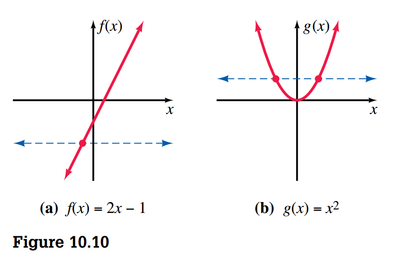

## Exponents and Exponential Functions

> [!NOTE] **Property 10.1**
>
> If \(a\) and \(b\) are positive real number, and \(m\) and \(n\) are real numbers, then
>
> 1. _Product of two powers_ \(b^n b^m = b^{m + 1}\)
> 2. _Power of a power_ \((b^n)^m = b^{mn}\)
> 3. _Power of a product_ \((ab)^n = a^n b^n\)
> 4. _Power of a quotient_ \(\left(\frac{a}{b}\right)^n = \frac{a^n}{b^n}\)
> 5. _Quotient of two powers_ \(\frac{b^n}{b^m} = b^{n - m}\)

> [!NOTE] **Property 10.2**
>
> If \(b > 0, b \neq 1\), and \(m\) and \(n\) are real numbers, then \(b^n = b^m\) if and only if \(n = m\).

### Exponential Functions

> [!TIP] **Definition 10.1**
>
> If \(b> 0\) and \(b \neq 1\), then the function \(f\) defined by:
>
> $$ f(x) = b^x $$
>
> when \(x\) is any real number, is called the **exponential function with base \(b\)**.

## Inverse Functions

In Figure 10.10(a), any horizontal line will intersect the graph in no more than one point. Any function that has this property of having exactly one value of \(x\) associated with each value of \(f(x)\) is called a **one-to-one function**.

> [!TIP] **Definition 10.2**
>
> Let \(f\) be a one-to-one function with a domain of \(X\) and a range of \(Y\). A function \(g\) with a domain of \(Y\) and a range of \(X\) is called the **inverse function** of \(f\) if
>
> $$ (f \circ g)(x) = x \text{ for every } x \in Y $$
>
> and
>
> $$ (g \circ f)(x) = x \text{ for every } x \in X $$

In Definition 10.2, note that for \(f\) and \(g\) to be inverses of each other, the domain of \(f\) must equal the range of \(g\), and the range of \(f\) must equal the domain of \(g\).

### Finding Inverse Functions

A more formal and systematic technique for finding the inverse of a function can be described as follows:

1. Replace the symbol \(f(x)\) with \(y\)
2. Interchange \(x\) and \(y\)
3. Solver the equation for \(y\) in terms of \(x\)
4. Replace \(y\) with the symbol \(f^{-1}(x)\)

### Increasing and Decreasing Functions

> [!TIP] **Definition 10.3**
>
> Let \(f\) be a function, with the interval \(I\) a subset of the domain of \(f\). Let \(x_1\) and \(x_2\) be in \(I\). Then:
>
> 1. \(f\) is increasing on \(I\) if \(f(x_1) < f(x_2)\) whenever \(x_1 < x_2\)
> 2. \(f\) is decreasing on \(I\) if \(f(x_1) > f(x_2)\) whenever \(x_1 > x_2\)
> 3. \(f\) is constant on \(I\) if \(f(x_1) = f(x_2)\) for every \(x_1\) and \(x_2\)

## Logarithms

> [!TIP] **Definition 10.4**
>
> If \(r\) is any positive real number, then the unique exponent \(t\) such that \(b^t = r\) is called the **logarithm of \(r\) with base \(b\)** and is denoted \(\log_b r\).

$$
\log_b r = t \text{ is equivalent to } b^t = r
$$

### Properties of Logarithms

> [!NOTE] **Property 10.3**
>
> For \(b > 0\) and \(b \neq 0\),
>
> $$ \log_b b = 1 $$
> $$ \log_b 1 = 0 $$

> [!NOTE] **Property 10.4**
>
> For \(b > 0\), \(b \neq 0\), and \(r > 0\),
>
> $$ b^{\log_b r} = r $$

> [!NOTE] **Property 10.5**
>
> For positive numbers \(b\), \(r\) and \(s\), where \(b \neq 1\),
>
> $$ \log_b rs = \log_b r + \log_b s $$

To verify Property 10.5, we can proceed as follows. Let \(m = \log_b r\) and \(n = \log_b s\). Change each of these equations to exponential form:

$$ r = b^m $$

$$ s = b^n $$

Thus the product of \(rs\) becomes:

$$
rs = b^m b^n = b^{m + n}
$$

Now, by chanding \(rs = b^{m + n}\) back to logarithmic form, we obtain:

$$
\log_b rs = m + n = \log_b r + \log_b s
$$

> [!NOTE] **Property 10.6**
>
> For positive numbers \(b\), \(r\) and \(s\), where \(b \neq 1\),
>
> $$ \log_b \frac{r}{s} = \log_b r - \log_b s $$

> [!NOTE] **Property 10.7**
>
> If \(r\) is a positive real number, \(b\) is a positive real number other than \(1\), and \(p\) is any real number, then:
>
> $$ \log_b r^p = p(\log_b r) $$

## Logarithmic Functions

> [!TIP] **Definition 10.5**
>
> If \(b > 0\) and \(b \neq 1\), then the function defined by
>
> $$ f(x) = \log_b x $$
>
> where \(x\) is any positive real number, is called the **logarithmic function with base \(b\)**.

### Common Logarithms - Base 10

Base-10 logarithms are called **common logarithms**. The **common logarithmic function** is defined by the equation:

$$
f(x) = \log x
$$

### Natural Logarithms - Base \(e\)

Logarithms with a base of \(e\) are called **natural logarithms**. The **natural logarithmic function** is defined by the equation:

$$
f(x) = \ln x
$$

## Exponential Equations, Logarithmic Equations and Problem Solving

> [!NOTE] **Property 10.8**
>
> If \(x > 0, y > 0, b > 0\) and \(b \neq 1\), then \(x = y\) if and only if \(\log_b x = \log_b y\)

> [!NOTE] **Property 10.9**
>
> If \(a, b\) and \(r\) are positive numbers, with \(a \neq 1\) and \(b \neq 1\), then
>
> $$ \log_a r = \frac{\log_b r}{\log_b a} $$
