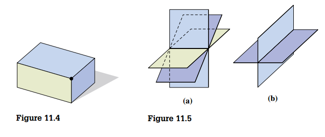

## Systems of Two Linear Equations in Two Variables

Two linear equations in two variables considered together form a **system of two linear equations in two variables**. To solve such a system means to find all of the ordered pairs that simultaneously satisfy both equations. Because the graph of a linear equation in two variables is a straight line, three possible situations can occur.

1. The graphs of the two equations are two lines intersecting in one point. There is exactly **one solution**, and the system is called a **consistent system**.
2. The graphs of the two equations are parallel lines. There is **no solution**, and the system is called an **inconsistent system**.
3. The graphs of the two equations are the same line, and there are **infinitely many solutions** of the system.

These situations are shown in Figure 11.2

### The Substitution Method

1. Solve one of the equations for one variable in terms of the other.
2. Substitute the expression obtained in step 1 into the other equation.
3. Solve the equation obtained in step 2.
4. Use the solution obtained in step 3, along with the expression obtained in step 1, to determine the solution of the system.

### The Elimination-by-Addition Method

The method involves replacing systems of equations with simpler equivalent systems until we obtain a system in which the solutions are obvious. **Equivalent systems** of equations are systems that have exactly the same solution set.

The following operations or transformations can be applied to a system of equations to produce an equivalent system:

1. Any two equations of the system can be interchanged.
2. Both sides of any equation of the system can be multiplied by any nonzero real number.
3. Any equation of the system can be replaced by the sum of that equation and a nonzero multiple of another equation.

## Systems of Three Linear Equations in Three Variables

From a solution set viewpoint, a system of three linear equations in three variables produces one of the following possibilities:

- There is **one ordered triple** that satisfies all three equations. The three planes have a common point of intersection, as indicated in Figure 11.4.
- There are **infinitely many ordered triples** in the solution set, all of which are coordinates of points on a line common to the three planes. This can happen if the three planes have a common line of intersection as in Figure 11.5(a), or if two of the planes coincide and the third plane intersects them as in Figure 11.5(b)

- There are **infinitely many ordered triples** in the solution set, all of which are coordinates of points on a plane. This can happen if the three planes coincide, as illustrated in Figure 11.6.

- The solution set is empty; thus we write \(\emptyset\). This can happen in various ways, as illustrated in Figure 11.7.

## Matrix Approach to Solving Linear Systems

With every system of linear equations, we can associate a matrix that consists of the coefficients and constant terms. For example, with the system:

$$
\begin{pmatrix}
a_1 x + b_1 y + c_1 z = d_1 \\
a_2 x + b_2 y + c_2 z = d_2 \\
a_3 x + b_3 y + c_2 z = d_3 \\
\end{pmatrix}
$$

we can associate the matrix

$$
\begin{bmatrix}
a_1 & b_1 & c_1 & d_1 \\
a_2 & b_2 & c_2 & d_2 \\
a_3 & b_3 & c_2 & d_3 \\
\end{bmatrix}
$$

which is commonly called the **augmented matrix** of the system of equations.

For any augmented matrix of a system of linear equations, the following elementary row operations will produce a matrix of an equivalent system:

1. Any two rows of the matrix can be interchanged.
2. Any row of the matrix can be multiplied by a nonzero real number.
3. Any row of the matrix can be replaced by the sum of a nonzero multiple of another row plus that row

## Determinants

> [!TIP] **Definition 11.1**
>
> If
>
> $$\begin{bmatrix} a_{11} & a_{12} \\ a_{21} & a_{22}\end{bmatrix}$$
>
> then
>
> $$|A| = \begin{vmatrix} a_{11} & a_{12} \\ a_{21} & a_{22}\end{vmatrix} = a_{11}a_{22} - a_{12}a_{21}$$

> [!TIP] **Definition 11.2**
>
> If \(A\) is a \(3 \times 3\) matrix, then the **minor** (denoted by $M_{ij}$) of the $a_{ij}$ element is the determinant of the \(2 \times 2\) matrix obtained by deleting the row \(i\) nd the column \(j\) of \(A\).

> [!TIP] **Definition 11.3**
>
> If \(A\) is a \(3 \times 3\) matrix, then the **cofactor** (denoted by $C_{ij}$) of the $a_{ij}$ element is defined by
>
> $$C_{ij} = (-1)^{i + j} M_{ij}$$

> [!TIP] **Definition 11.4**
>
> If
>
> $$\begin{bmatrix} a_{11} & a_{12} & a_{13} \\ a_{21} & a_{22} & a_{23} \\ a_{31} & a_{32} & a_{33}\end{bmatrix}$$
>
> then
>
> $$|A| = a_{11}C_{11} + a_{21}C_{21} + a_{31}C_{31}$$

When we use Definition 11.4, we often say that "the determinant is being expanded about the first column." It can also be shown that any row or column can be used to expand a determinant.

### Properties of Determinants

> [!NOTE] **Property 11.1**
>
> If any row (or column) of a square matrix \(A\) contains only zeros, then \(|A| = 0\).

> [!NOTE] **Property 11.2**
>
> If square matrix \(B\) is obtained from square matrix \(A\) by interchanging two rows (or two columns), then \(|B| = -|A|\).

> [!NOTE] **Property 11.3**
>
> If square matrix \(B\) is obtained from square matrix \(A\) by multiplying each element of any row (or column) of \(A\) by some real number \(k\), then \(|B| = k|A|\).

> [!NOTE] **Property 11.4**
>
> If square matrix \(B\) is obtained from square matrix \(A\) by adding \(k\) times a row (or column) of \(A\) to another row (or column) of \(A\), then \(|B| = |A|\).

> [!NOTE] **Property 11.5**
>
> If two rows (or columns) of a square matrix \(A\) are identical, then \(|A| = 0\).

## Cramer's Rule

### Cramer's Rule \(2 \times 2\)

Given the system

$$
\begin{pmatrix}
a_1 x + b_1 y = c_1 \\
a_2 x + b_2 y = c_2 \\
\end{pmatrix}
$$

with

$$
D =
\begin{vmatrix}
a_1 & b_1 \\
a_2 & b_2 \\
\end{vmatrix}
\neq 0
$$

$$
D_x =
\begin{vmatrix}
c_1 & b_1 \\
c_2 & b_2 \\
\end{vmatrix}
\neq 0
$$

$$
D_y =
\begin{vmatrix}
a_1 & c_1 \\
a_2 & c_2 \\
\end{vmatrix}
\neq 0
$$

then the solution for this system is given by

$$
x = \frac{D_x}{D}
$$

and

$$
y = \frac{D_y}{D}
$$

### Cramer's Rule \(3 \times 3\)

Given the system

$$
\begin{pmatrix}
a_1 x + b_1 y + c_1 z = d_1 \\
a_2 x + b_2 y + c_2 z = d_2 \\
a_3 x + b_3 y + c_3 z = d_3 \\
\end{pmatrix}
$$

with

$$
D =
\begin{vmatrix}
a_1 & b_1 & c_1\\
a_2 & b_2 & c_2 \\
a_3 & b_3 & c_3 \\
\end{vmatrix}
\neq 0
$$

$$
D_x =
\begin{vmatrix}
d_1 & b_1 & c_1\\
d_2 & b_2 & c_2 \\
d_3 & b_3 & c_3 \\
\end{vmatrix}
\neq 0
$$

$$
D_y =
\begin{vmatrix}
a_1 & d_1 & c_1\\
a_2 & d_2 & c_2 \\
a_3 & d_3 & c_3 \\
\end{vmatrix}
\neq 0
$$

$$
D_z =
\begin{vmatrix}
a_1 & b_1 & d_1\\
a_2 & b_2 & d_2 \\
a_3 & b_3 & d_3 \\
\end{vmatrix}
\neq 0
$$

then the solution for this system is given by

$$
x = \frac{D_x}{D}
$$

$$
y = \frac{D_y}{D}
$$

and

$$
z = \frac{D_z}{D}
$$

## Partial Fractions

The process of expressing a rational expression as the sum of two simpler rational expressions called **partial fractions** is called **partial fraction decomposition**.

> [!NOTE] **Property 11.6**
>
> Let \(f(x)\) and \(g(x)\) be polynomials with real coefficients, such that the degree of \(f(x)\) is less than the degree of \(g(x)\). The indicated quotient \(\frac{f(x)}{g(x)}\) can be decomposed into partial fractions as follows.
>
> 1. If \(g(x)\) has a linear factor of the form \(ax + b\), then the partial fraction decomposition will contain a term of the form
>
> $$\frac{A}{ax + b}, \text{ where } A \text{ is a constant }$$
>
> 2. If \(g(x)\) has a linear factor of the form \(ax + b\) raised to the \(k\)th power, then the partial fraction decomposition will contain terms of the form
>
> $$\frac{A_1}{ax + b} + \frac{A_2}{(ax+ b)^2} + \cdots + \frac{A_k}{(ax + b)^k}$$
>
> where $A_1, A_2, \cdots, A_k$ are constants.
>
> 3. If \(g(x)\) has a quadratic factor of the form \(ax^2 + bx + c\), where \(b^2 - 4ac < 0\), then the partial fraction decomposition will contain a term of the form
>
> $$\frac{Ax + B}{ax^2 + bx + c} \text{ where } A \text{ and } B \text{ are constants.}$$
>
> 4. If \(g(x)\) has a quadratic factor of the form \(ax^2 + bx + c\) raised to the \(k\)th power, where \(b^2 - 4ac < 0\), then the partial fraction decomposition will contain a term of the form
>
> $$\frac{A_1}{(ax^2 + bx + c)} + \frac{A_2}{(ax^2 + bx + c)^2} + \cdots + \frac{A_k}{(ax^2 + bx + c)^k}$$
>
> where $A_1, A_2, \cdots, A_k$ and $B_1, B_2, \cdots, B_k$ are constants.

Note that Property 11.6 applies only to **proper fractions**—that is, fractions in which the degree of the numerator is less than the degree of the denominator
