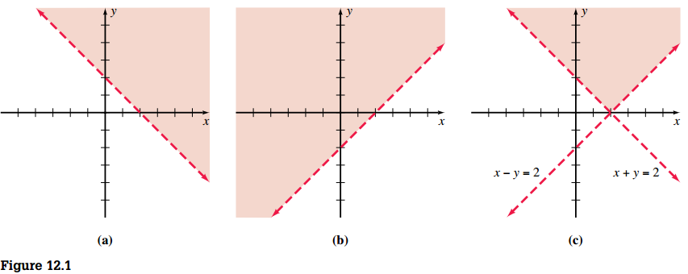
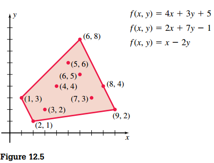
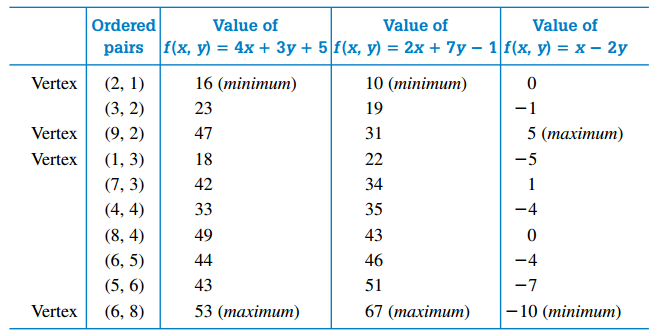

## Systems of Linear Inequalities: Linear Programming

Finding solution sets for systems of linear inequalities relies heavily on the graphing approach. The solution set of a system of linear equations is the intersection of the solution sets of the individual inequalities (See Figure 12.1).

### Linear Programming: Another Look at Problem Solving

Many applied problems involve the idea of maximizing or minimizing a certain function that is subject to various constraints; these can be expressed as linear inequalities. **Linear programming** was developed as one method for solving such problems.

Suppose that we need to find the maximum value and the minimum value achieved by each of the functions in the indicated region on Figure 12.5.

The following chart summarizes the values for the ordered pairs indicated in the figure. Note that for each function, the maximum and minimum values are obtained at vertices of the region.

We claim that for linear functions, maximum and minimum functional values are always obtained at vertices of the region.

To substantiate this, let’s consider the family of lines \(x - 2y = k\), in which \(k\) is an arbitrary constant. In Figure 12.6, we sketched some of these lines so that each line has at least onepoint in common with the given region. Note that \(x - 2y = k\) reaches a minimum value of \(-10\) at the vertex \((6, 8)\) and a maximum value of \(5\) at the vertex \((9, 2)\).

In general, suppose that \(f\) is a linear function in two variables \(x\) and \(y\) and that \(S\) is a region of the \(xy\) plane. If \(f\) attains a maximum (minimum) value in \(S\), then that maximum (minimum) value is obtained at a vertex of \(S\).
