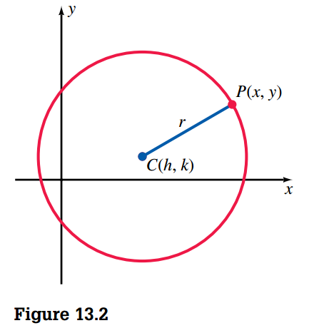

## Circles

> [!TIP] **Definition 13.1**
>
> A **circle** is the set of all points in a plane equidistant from a given fixed point called the **center**. A line segment determined by the center and any point on the circle is called a **radius**.

Now let's consider a circle with a radius of length \(r\) and a center at \((h, k)\) on a coordinate system, as shown in Figure 13.2. For any point \(P\) on the circle with coordinates \((x, y)\), the length of a radius, denoted by \(r\), can be expressed as Thus squaring both sides of the equation, we obtain the **standard form of the equation of a circle**:

$$
(x - h)^2 + (y - k)^2 = r^2
$$

$$
x^2 + y^2 = r^2
$$

is the standard form of the equation of a circle that has its **center at the origin**.

It should be evident that to determine the equation of a specific circle, we need the values of \(h\), \(k\), and \(r\). To determine these values from a given set of conditions often requires the use of some of the following concepts from elementary geometry.

1. A tangent to a circle is a line that has one and only one point in common with the circle. This common point is called a _point of tangency_.
2. A radius drawn to the point of tangency is perpendicular to the tangent line.
3. Three noncollinear points in a plane determine a circle
4. A chord of a circle is a line segment with endpoints that lie on the circle.
5. The perpendicular bisector of a chord contains the center of a circle.

## Parabolas

> [!TIP] **Definition 13.2**
>
> A **parabola** is the set of all points in a plane such that the distance of each point from a fixed point \(F\) (the **focus**) is equal to its distance from a fixed line \(d\) (the **directrix**) in the plane.

Using Definition 13.2, we can sketch a parabola by starting with a fixed line \(d\) (directrix) and a fixed point \(F\) (focus) not on \(d\). The dashed curved line in Figure 13.8 indicates the possible positions of \(P\); it is the parabola. The line \(l\), through \(F\) and perpendicular to the directrix, is called the axis of symmetry. The point \(V\), on the **axis of symmetry** halfway from \(F\) to the directrix \(d\), is the **vertex** of the parabola.

We can derive a standard form for the equation of a parabola by superimposing coordinates on the plane such that the origin is at the vertex of the parabola and the \(y\) axis is the axis of symmetry (Figure 13.9). If the focus is at \((0, p)\), where \(p \neq 0\), then the equation of the directrix is \(y = -p\). Therefore, for any point \(P\) on the parabola, \(PF = PP'\), and using the distance formula yields:

$$
\sqrt{(x - 0)^2 + (y - p)^2} = \sqrt{(x - x)^2 + (y + p)^2}
$$

$$
(x - 0)^2 + (y - p)^2 = (x - x)^2 + (y + p)^2
$$

$$
x^2 + y^2 + p^2 - 2py = y^2 + p^2 + 2py
$$

$$
x^2 - 2py = 2py
$$

$$
x^2 = 4py
$$

Thus the standard form for the equation of a parabola with its vertex at the origin and the \(y\) axis as its axis of symmetry is:

$$
x^2 = 4py
$$

If \(p > 0\), the parabola opens upward; if \(p < 0\), the parabola opens downward.

A line segment that contains the focus and has endpoints on the parabola is called a **focal chord**. The specific focal chord that is parallel to the directrix we shall call the **primary focal chord**.

In a similar fashion, we can develop the standard form for the equation of a parabola with its vertex at the origin and the x axis as its axis of symmetry.

$$
y^2 = 4px
$$

If \(p > 0\), the parabola opens to the right, as in Figure 13.11; if \(p < 0\), it opens to the left

### Other Parabolas

The standard form of the equation of a parabola that has its vertex at \((h, k)\) and is symmetric with respect to the line \(x = h\) is as follows:

$$
(x - h)^2 = 4p(y - k)
$$

If \(p > 0\), the parabola opens upward; if \(p < 0\), the parabola opens downward.

In a similar fashion, we can show that the standard form of the equation of a parabola that has its vertex at \((h, k)\) and is symmetric with respect to the line \(y = k\) is:

$$
(y - k)^2 = 4p(x - h)
$$

If \(p > 0\), the parabola opens to the right; if \(p < 0\), it opens to the left.

## Ellipses

> [!TIP] **Definition 13.3**
>
> An ellipse is the set of all points in a plane such that the sum of the distances of each point from two fixed points \(F\) and \(F'\) (the foci) in the plane is constant.

We can derive a standard form for the equation of an ellipse by superimposing coordinates on the plane such that the foci are on the x axis, equidistant from the origin (Figure 13.21). If \(F\) has coordinates \((c, 0)\), where \(c > 0\), then \(F'\) has coordinates \((c, 0)\), and the distance between \(F\) and \(F'\) is \(2c\) units. We will let \(2a\) represent the constant sum of \(FP + F'P\). Note that \(2a > 2c\) and therefore \(a > c\). For any point \(P\) on the ellipse,

$$
FP + F'P = 2a
$$

By using the distance formula:

$$
\sqrt{(x - c)^2 + (y - 0)^2} + \sqrt{(x + c)^2 + (y - 0)^2} = 2a
$$

$$
\sqrt{(x - c)^2 + (y - 0)^2} = 2a - \sqrt{(x + c)^2 + (y - 0)^2}
$$

We square both sides:

$$
(x - c)^2 + y^2 = 4a^2 - 4a\sqrt{(x + c)^2 + y^2} + (x + c)^2 + y^2
$$

$$
x^2 + c^2 - 2cx = 4a^2 - 4a\sqrt{(x + c)^2 + y^2} + x^2 + c^2 + 2cx
$$

$$
-4cx = 4a^2 - 4a\sqrt{(x + c)^2 + y^2}
$$

$$
-4cx = 4a^2 - 4a\sqrt{(x + c)^2 + y^2}
$$

$$
a^2 + cx = a\sqrt{(x + c)^2 + y^2}
$$

We square both sides again:

$$
a^4 + c^2x^2 + 2a^2cx = a^2[(x + c)^2 + y^2]
$$

$$
a^4 + c^2x^2 + 2a^2cx = a^2x^2 + a^2c^2 + 2a^2xc + a^2y^2
$$

$$
a^4 + c^2x^2 = a^2x^2 + a^2c^2 + a^2y^2
$$

$$
-a^2x^2 + c^2x^2 - a^2y^2 = -a^4 + a^2c^2
$$

$$
a^2x^2 - c^2x^2 + a^2y^2 = a^4 - a^2c^2
$$

which can be written as:

$$
x^2(a^2 - c^2) + a^2y^2 = a^2(a^2 - c^2)
$$

If we divide both sides by \(a^2(a^2 - c^2)\):

$$
\frac{x^2}{a^2} + \frac{y^2}{(a^2 -c^2)}= 1
$$

Letting \(b^2 = a^2 - c^2\), where \(b > 0\) given \(a > c\):

$$
\frac{x^2}{a^2} + \frac{y^2}{b^2}= 1
$$

This equation that we have derived is called the **standard form of the equation of an ellipse** with its foci on the \(x\) axis and its center at the origin.

The \(x\) intercepts are \(A(a, 0)\) and \(A'(a, 0)\), and the line segment \(\overline{A'A}\) which is of length \(2a\), is called the **major axis** of the ellipse. The endpoints of the major axis are also referred to as the **vertices** of the ellipse.

The \(y\) intercepts are \(B(0, b)\) and \(B'(0, -b)\), and the line segment \(\overline{BB'}\) which is of length \(2b\), is called the **minor axis**.

Because \(a > b\), the major axis is always longer than the minor axis. The point of intersection of the major and minor axes is called the center of the ellipse.

And ellipse is symmetric with respect to the \(x\) axis, the \(y\) axis, and the origin.

### Ellipses with Foci on the \(y\) Axis

The standard equation of an ellipse with its center at \((0, 0)\) and its major axis on the y axis is

$$
\frac{x^2}{a^2} + \frac{y^2}{b^2} = 1, \text{ where } b > a
$$

The vertices are \((0, b)\) and \((0, b)\), and the length of the major axis is \(2b\). The endpoints of the minor axis are \((a, 0)\) and \((a, 0)\), and the length of the minor axis is \(2a\). The foci are at \((0, c)\) and \((c, 0)\), where \(c^2 = b^2 - a^2\).

## Hyperbolas

> [!TIP] **Definition 13.4**
>
> A **hyperbola** is the set of all points in a plane such that the difference of the distances of each point from two fixed points \(F\) and \(F'\) (the **foci**) in the plane is a positive constant.

To develop a standard form for the equation of a hyperbola, let’s superimpose coordinates on the plane such that the foci are located at \(F(c, 0)\) and \(F'(c, 0)\), as indicated in Figure 13.33. Using the distance formula and setting \(2a\) equal to the difference of the distances from any point \(P\) on the hyperbola to the foci, we have the following equation:

$$
|\sqrt{(x - c)^2 + (y - 0)^2} - \sqrt{(x + c)^2 + (y - 0)^2}| = 2a
$$

(The absolute-value sign is used to allow the point P to be on either branch of the hyperbola.) Using the same type of simplification procedure that we used [for deriving the standard form for the equation of an ellipse](#ellipses), we find that this equation simplifies to

$$
\frac{x^2}{a^2} - \frac{y^2}{c^2 - a^2} = 1
$$

Letting \(b^2 = c^2 - a^2\), where \(b > 0\) we obtain the standard form:

$$
\frac{x^2}{a^2} - \frac{y^2}{b^2} = 1
$$

By letting \(y = 0\), we the x intercepts, which are \(A(a, 0)\) and \(A'(a, 0)\), these are the **vertices** of the hyperbola, and the line segment \(\overline{AA'}\) is called the **transverse axis**; it is of length \(2a\) (see Figure 13.34). The midpoint of the transverse axis is called the **center** of the hyperbola; it is located at the origin. By letting \(x = 0\) we obtain \(y^2 = b^2\). This implies that there are no \(y\) intercepts.

