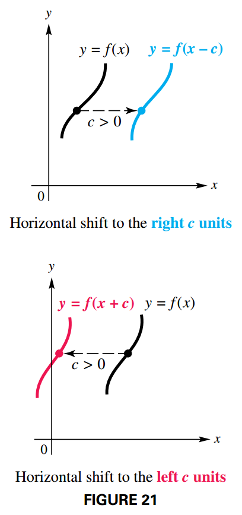
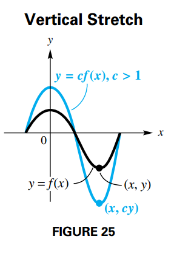
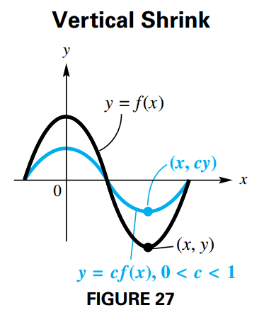
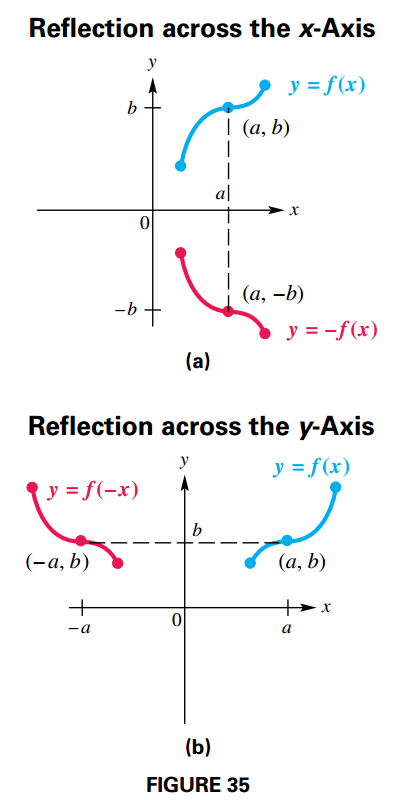
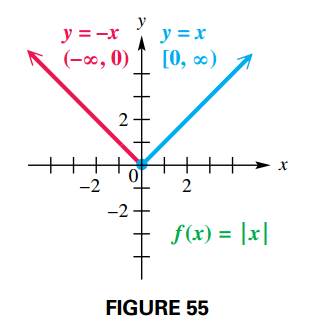
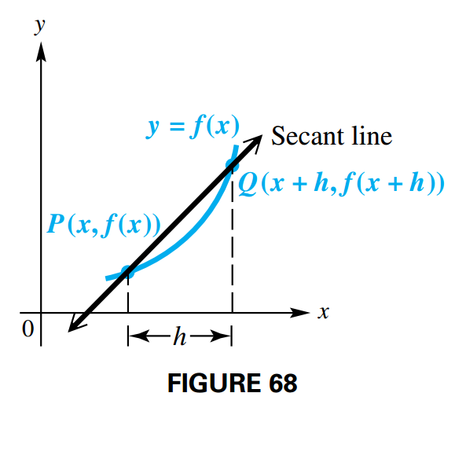
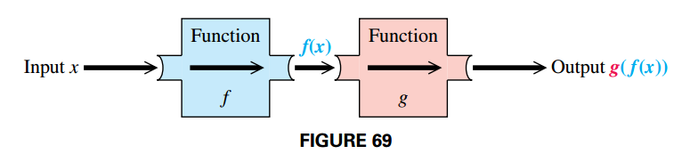

## Graphs of Basic Functions and Relations: Symmetry

### Increasing, Decreasing, and Constant Functions

Suppose that a function $f$ is defined over an open interval $I$.

- $f$ **increases** on $I$ if, whenever $x_1 < x_2$, $f(x_1) < ƒ(x_2)$
- $f$ **decreases** on $I$ if, whenever $x_1 < x_2$, $f(x_1) > ƒ(x_2)$
- $f$ is **constant** on $I$ if for every $x_1$, $x_2$, $f(x_1) = ƒ(x_2)$

### Symmetry with Respect to the $y$-Axis

If a function $f$ is defined so that:

$$
\begin{aligned}
f(-x) = f(x)
\end{aligned}
$$

for all $x$ in its domain, then the graph of $f$ is **symmetric with respect to the** $y$-axis.

### Symmetry with Respect to the Origin

If a function $f$ is defined so that:

$$
\begin{aligned}
f(-x) = -f(x)
\end{aligned}
$$

for all $x$ in its domain, then the graph of $f$ is **symmetric with respect to the origin**.

### Symmetry with Respect to the $x$-Axis

If replacing $y$ with $-y$ in an equation results in the same equation, then the graph is **symmetric with respect to the** $x$-axis.

### Even and Odd Functions

A function $f$ is called an **even function** if $f(-x) = f(x)$ for all $x$ in the domain of $f$. (Its graph is symmetric with respect to the y-axis.)

A function $f$ is called an **odd function** if $f(-x) = -f(x)$ for all $x$ in the domain of $f$. (Its graph is symmetric with respect to the origin.)

### The Absolute Value Function

On a number line, the absolute value of a real number x, denoted $|x|$, represents its undirected distance from the origin, $0$. The absolute value function, $f(x) = |x|$, pairs every real number with its absolute value and is defined as follows:

$$
\begin{aligned}
f(x) = |x| = \begin{cases}
x & \text{ if } x \geq 0 \\
-x & \text{ if } x < 0 \\
\end{cases}
\end{aligned}
$$

## Vertical and Horizontal Shifts of Graphs

### Vertical Shifts

If $c > 0$, then the graph of $y = f(x) + c$ is obtained by shifting the graph of $y = f(x)$ upward a distance of $c$ units. The graph of $y = f(x) - c$ is obtained by shifting the graph of $y = f(x)$ downward a distance of $c$ units.

### Horizontal Shifts

If $c > 0$, then the graph of $y = f(x - c)$ is obtained by shifting the graph of $y = f(x)$ to the right a distance of $c$ units. The graph of $y = f(x + c)$ is obtained by shifting the graph of $y = f(x)$ to the left a distance of $c$ units.

## Vertical and Horizontal Shifts of GraphsStretching, Shrinking and Reflecting Graphs

### Vertical Stretching

If $c > 1$, then the graph of $y = cf(x)$ is a **vertical stretching** of the graph of $y = f(x)$ by applying a factor of $c$.

In FIGURE 25, we graphically interpret the preceding statement. Notice that the graphs have the same $x$-intercepts

### Vertical Shrinking

If $0 < c < 1$, then the graph of $y = cf(x)$ is a **vertical shrinking** of the graph of $y = f(x)$ by applying a factor of $c$.

FIGURE 27 shows a vertical shrink graphically. Vertical stretching or shrinking does not change the $x$-intercepts of the graph but it can change the $y$-intercept.

### Horizontal Stretching and Shrinking

If $0 < c < 1$, then the graph of $y = f(cx)$ is a horizontal stretching of the graph of $y = f(x)$.

If $c > 1$, then the graph of $y = f(cx)$ is a horizontal shrinking of the graph of $y = f(x)$.

Notice in FIGURE 32 that horizontal stretching or shrinking can change the $x$-intercepts, but not the $y$-intercept.

### Reflecting across an Axis

For a function $y = f(x)$, the following are true.

- The graph of $y = −f(x)$ is a reflection of the graph of $f$ across the $x$-axis.
- The graph of $y = f(−x)$ is a reflection of the graph of $f$ across the $y$-axis.

### Combining Transformations of Graphs

We can create infinitely many functions from a basic function by stretching or shrinking, shifting upward, downward, left, or right, and reflecting across an axis. To determine the order in which the transformations are made, follow the conventional order of operations as they would be applied to a particular $x$-value.

## Absolute Value Functions

### The Graph of $y = ∣f(x)∣$

The domain of $y = |f(x)|$ is the same as the domain of $f$, while the range of $y = |f(x)|$ will be a subset of $[0, \infty)$.

### Properties of Absolute Value

For all real numbers $a$ and $b$:

1. $|ab| = |a| |b|$
2. $|\frac{a}{b}| = \frac{|a|}{|b|}$
3. $|a| = |-a|$
4. $|a| + |b| \geq |a + b|$

### Equations and Inequalities Involving Absolute Value

Let $k$ be a positive number.

- To solve $|ax + b| = k$, solve:

$$
\begin{aligned}
a x + b = k, \text{ or } ax + b = -k
\end{aligned}
$$

- To solve $|ax + b| > k$, solve:

$$
\begin{aligned}
a x + b > k, \text{ or } ax + b < -k
\end{aligned}
$$

- To solve $|ax + b| < k$, solve:

$$
\begin{aligned}
a x + b < k, \text{ or } ax + b > -k
\end{aligned}
$$

Inequalities involving $\leq$ or $\geq$ are solved similarly.

If two quantities have the same absolute value, they must either be equal to each other or be negatives of each other. This fact allows us to solve absolute value equations (and related inequalities) of the form $|ax + b| = |cx + d|$ by solving:

$$
\begin{aligned}
ax + b = cx + d, \text{ or } ax + b = -(cx + d)
\end{aligned}
$$

## Piecewise-Defined Functions

### Graphing Piecewise-Defined Functions

The absolute value function is a simple example of a function defined by different rules (formulas) over different subsets of its domain. Such a function is called a **piecewise-defined function**. See FIGURE 55.

## Operations and Composition

### Operations on Functions

Given two functions $ƒ$ and $g$, for all values of $x$ for which both $f(x)$ and $g(x)$ are defined:

$$
\begin{aligned}
(f + g)(x) = f(x) + g(x)
\end{aligned}
$$

$$
\begin{aligned}
(f - g)(x) = f(x) - g(x)
\end{aligned}
$$

$$
\begin{aligned}
(fg)(x) = f(x)g(x)
\end{aligned}
$$

$$
\begin{aligned}
\left(\frac{f}{g}\right)(x) = \frac{f(x)}{g(x)}, g(x) \neq 0
\end{aligned}
$$

The domains of $f + g$, $f - g$, and $fg$ include all real numbers in the intersection of the domains of $f$ and $g$, while the domain of $\frac{f}{g}$ includes those real numbers in the intersection of the domains of $f$ and $g$ for which $g(x) \neq 0$.

### The Difference Quotient

Suppose that the point $P$ lies on the graph of $y = f(x)$ as in FIGURE 68, and suppose that $h$ is a positive number. If we let $(x, f(x))$ denote the coordinates of $P$ and $(x + h, f(x + h))$ denote the coordinates of $Q$, then the line joining $P$ and $Q$ has slope:

$$
\begin{aligned}
m = \frac{f(x + h) - f(x)}{(x + h) - x} = \frac{f(x + h) - f(x)}{h}
\end{aligned}
$$

This expression, called the **difference quotient**. FIGURE 68 shows the graph of the line PQ (called a secant line. This slope is equal to the average rate of change of $f$ from $x$ to $x + h$.

### Composition of Functions

The diagram in FIGURE 69 shows a function $ƒ$ that assigns, to each $x$ in its domain, a value $ƒ(x)$. Then another function $g$ assigns, to each $f(x)$ in the domain of $g$, a value $g(f(x))$. This two-step process takes an element $x$ and outputs an element $g(f(x))$.

The function with $y$-values $g(f(x))$ is called the composition of function $g$ and $f$, written $g \circ f$ and read "$g$ of $f$".

