## Complex Numbers

### The Imaginary Unit i

The imaginary unit is defined as:

$$
\begin{aligned}
i = \sqrt{-1}
\end{aligned}
$$

and therefore

$$
\begin{aligned}
i^2 = -1
\end{aligned}
$$

### Complex Numbers

Numbers of the form $a + bi$, where $a$ and $b$ are real numbers, are called **complex numbers**. In the complex number $a + bi$, $a$ is the **real** part and $b$ is the **imaginary** part.

Two complex numbers $a + bi$ and $c + di$ are equal provided that their real parts are equal and their imaginary parts are equal.

For a complex number $a + bi$, if $b = 0$, then $a + bi =$ a, which is a real number.

If $a = 0$ and $b \neq 0$, the complex number is a **pure imaginary number**.

### Simplifying Powers of i

By definition, $i^1 = i$ and $i^2 = -1$. Now, observe the following pattern.

$$
\begin{aligned}
i^1 = i
\end{aligned}
$$

$$
\begin{aligned}
i^2 = -1
\end{aligned}
$$

$$
\begin{aligned}
i^3 = i^2 i^1 = -i
\end{aligned}
$$

$$
\begin{aligned}
i^4 = i^2 i^2 = 1
\end{aligned}
$$

Such that:

$$
\begin{aligned}
(i^4)^n = 1
\end{aligned}
$$

We can then simplify powers of $i$ by considering the other factor. For example,

$$
\begin{aligned}
i^53 = i^52 i^1 = (i^4)^13 i^1 = i
\end{aligned}
$$

### Complex Conjugates

The **conjugate** of the complex number $a + bi$ is $a - bi$. Their product is the sum of the squares of their real and imaginary parts.

To find the quotient of two complex numbers in standard form, we multiply numerator and denominator by the conjugate of the denominator.

## Quadratic Functions and Graphs

### Quadratic Function

The function:

$$
\begin{aligned}
P(x) = ax^2 + bx + c
\end{aligned}
$$

where $a$, $b$, and $c$ are real numbers, with $a \neq 0$, is called a **quadratic function**.

Quadratic functions, as well as linear functions, are examples of **polynomial functions**.

### Completing the Square

To transform the quadratic function $P(x) = ax^2 + bx + c$ into the form $P(x) = a(x - h)^2 + k$, follow these steps.

- Divide each side of the equation by $a$ so the coefficient of $x^2$ is $1$.

$$
\begin{aligned}
\frac{P(x)}{a} = x^2 + \frac{b}{a}x + \frac{c}{a}
\end{aligned}
$$

- Add $-\frac{c}{a}$ to each side

$$
\begin{aligned}
\frac{P(x)}{a} - \frac{c}{a} = x^2 + \frac{b}{a}x
\end{aligned}
$$

- **Completing the squares**: Add to each side the square of hald the coefficient of $x$: $\left(\frac{b}{2a}\right)^2$

$$
\begin{aligned}
\frac{P(x)}{a} - \frac{c}{a} + \left(\frac{b}{2a}\right)^2 = x^2 + \frac{b}{a}x + \left(\frac{b}{2a}\right)^2
\end{aligned}
$$

- Factor the right side as the square of a binomial and combine terms on the left.

$$
\begin{aligned}
\frac{P(x)}{a} - \frac{c}{a} + \left(\frac{b}{2a}\right)^2 = (x + \frac{b}{a})^2
\end{aligned}
$$

- Isolate the term involving $P(x)$ on the left.

$$
\begin{aligned}
\frac{P(x)}{a} = (x + \frac{b}{a})^2 + \frac{c}{a} - \left(\frac{b}{2a}\right)^2
\end{aligned}
$$

$$
\begin{aligned}
= (x + \frac{b}{a})^2 + \frac{c}{a} - \frac{b^2}{4a^2}
\end{aligned}
$$

- Multiply each side by $a$.

$$
\begin{aligned}
P(x) = a(x + \frac{b}{a})^2 + c - \frac{b^2}{4a}
\end{aligned}
$$

$$
\begin{aligned}
= a(x + \frac{b}{a})^2 + \frac{4ac - b^2}{4a}
\end{aligned}
$$

### Graphs of Quadratic Functions

Recall from [Intercepts](../01_linear_functions#intercepts) that the $y$-intercept of the graph of an equation is the point that has $x$-coordinate 0. For a parabola given in the form $P(x) = ax^2 + bx + c$, the $y$-value of the $y$-intercept is $P(0) = c$.

Consider the graph of $P(x) = a(x - h)^2 + k (a \neq 0)$, then:

- The graph is a parabola with vertex $(h, k)$ and vertical line $x = h$ as its axis of symmetry.
- The graph opens upward if $a > 0$ and downward if $a < 0$.
- The graph is wider than the graph of $y = x^2$ if $0 < |a| < 1$ and narrower if $|a| > 1$.

### Vertex Formula

We can determine the coordinates of the vertex of the graph of a quadratic function by completing the square, as shown earlier. Given the standard form of the quadratic function $P(x) = ax^2 + bx + c, where a \neq 0$, then:

$$
\begin{aligned}
P(x) = a\left(x - \left(-\frac{b}{a}\right)\right)^2 + + \frac{4ac - b^2}{4a}
\end{aligned}
$$

This equation shows that the vertex $(h, k)$ can be expressed in terms of $a, b$ and $c$, such that:

$$
\begin{aligned}
h = \left(-\frac{b}{a}\right)
\end{aligned}
$$

and

$$
\begin{aligned}
k = \frac{4ac - b^2}{4a}
\end{aligned}
$$

### Extreme Values

The vertex of the graph of

$$
\begin{aligned}
P(x) = ax^2 + bx + c
\end{aligned}
$$

is the lowest point on the graph of the function if $a > 0$ and the highest point if $a < 0$. Such points are called **extreme points** (also **extrema**; singular, **extremum**).

1. If $a > 0$ then the vertex $(h, k)$ is called the **minimum point** of the graph. The **minimum value** of the function is $P(h) = k$.
2. If $a < 0$ then the vertex $(h, k)$ is called the **maximum point** of the graph. The **maximum value** of the function is $P(h) = k$.

FIGURE 14 illustrates these ideas.

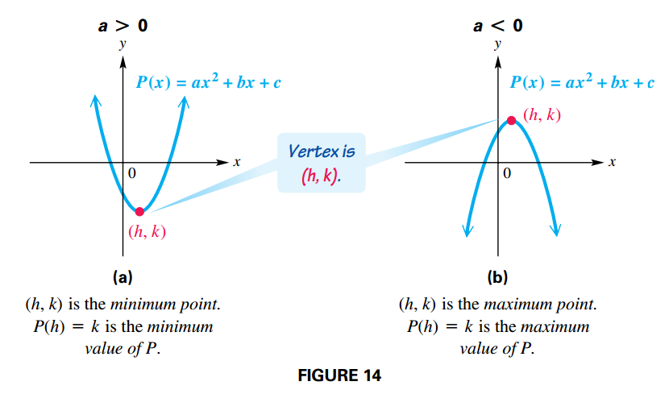

## Quadratic Equations and Inequalities

### Quadratic Equation in One Variable

An equation that can be written in the form:

$$
\begin{aligned}
ax^2 + bx + c = 0
\end{aligned}
$$

where $a$ and $b$ are real numbers, with $a \neq 0$ is a **quadratic equation in standard form**.

FIGURE 25 shows possible numbers of $x$-intercepts of the graph of a quadratic function that opens upward

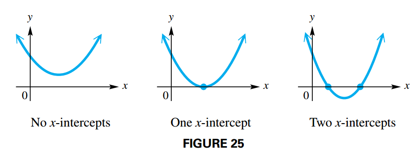

Similarly, FIGURE 26 shows possible numbers of x-intercepts of the graph of a quadratic function that opens downward.

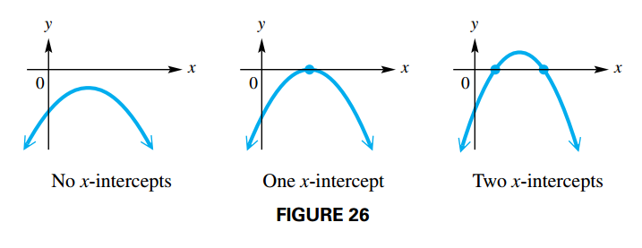

Thus, a quadratic equation can have zero, one, or two real solutions.

#### Square Root Property

The solution set of $x^2 = k$ is one of the following

- $\{\pm \sqrt{k}\}$ if $k > 0$
- $\{0\}$ if $k = 0$
- $\{\pm i\sqrt{|k|}\}$ if $k < 0$

### Quadratic Formula and the Discriminant

There is a formula that can be used to solve any quadratic equation. To find it, we complete the square on the standard form of $ax^2 + bx + c = 0$.

$$
\begin{aligned}
ax^2 + bx + c = 0
\end{aligned}
$$

$$
\begin{aligned}
x^2 + \frac{b}{a}x + \frac{c}{a} = 0
\end{aligned}
$$

$$
\begin{aligned}
x^2 + \frac{b}{a}x = -\frac{c}{a}
\end{aligned}
$$

$$
\begin{aligned}
x^2 + \frac{b}{a}x + \left(\frac{b}{2a}\right)^2= -\frac{c}{a} + \left(\frac{b}{2a}\right)^2
\end{aligned}
$$

$$
\begin{aligned}
(x + \frac{b}{2a})^2 = -\frac{c}{a} + \frac{b^2}{4a^2}
\end{aligned}
$$

$$
\begin{aligned}
x + \frac{b}{2a} = \sqrt{-\frac{c}{a} + \frac{b^2}{4a^2}}
\end{aligned}
$$

$$
\begin{aligned}
x + \frac{b}{2a} = \pm \sqrt{\frac{b^2 - 4ac}{4a^2}}
\end{aligned}
$$

$$
\begin{aligned}
x + \frac{b}{2a} = \pm \frac{\sqrt{b^2 - 4ac}}{2a}
\end{aligned}
$$

$$
\begin{aligned}
x = - \frac{b}{2a} \pm \frac{\sqrt{b^2 - 4ac}}{2a}
\end{aligned}
$$

$$
\begin{aligned}
x = \frac{-b \pm \sqrt{b^2 - 4ac}}{2a}
\end{aligned}
$$

The expression $b^2 − 4ac$ under the radical in the quadratic formula is called the **discriminant**.

- If $b^2 - 4ac > 0$ then there are two real solutions.
- If $b^2 - 4ac = 0$ then there is one real solutions.
- If $b^2 - 4ac < 0$ then there are two non-real complex solutions.

### Solving Quadratic Inequalities

A **quadratic inequality** is an inequality that can be written in the form:

$$
\begin{aligned}
ax^2 + bx + c < 0
\end{aligned}
$$

where $a$, $b$ and $c$ are real numbers with $a \neq 0$.

We can solve a quadratic inequality graphically, using the ideas shown in the following table.

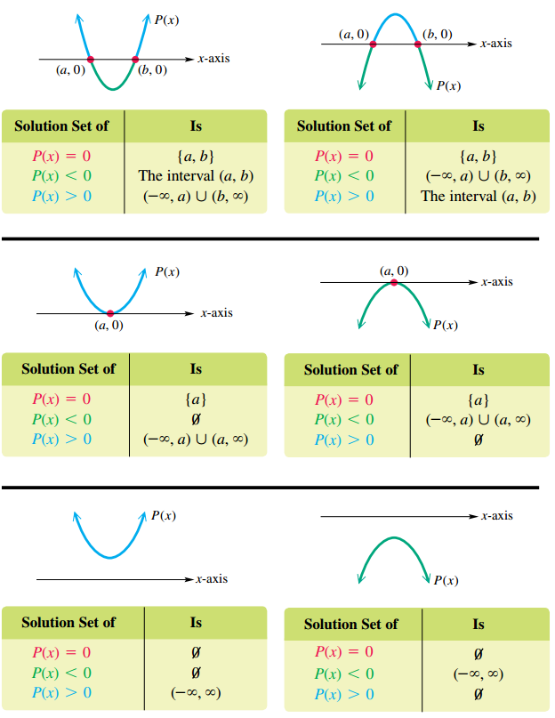

To solve a quadratic inequality analytically, follow these steps.

1. Solve the corresponding quadratic equation.
2. Identify the intervals determined by the solutions of the equation
3. Use a test value from each interval to determine which intervals form the solution set.

## High-Degree Polynomial Functions and Graphs

### Polynomial Function

A **polynomial function of degree** $n$ **in the variable** $x$ is a function of the form:

$$
\begin{aligned}
P(x) = a_nx^n + a_{n-1}x^{n-1} + \cdots + a_1 x + a_0
\end{aligned}
$$

where each $a_1$ is a real number, $a_n \neq 0$ and $n$ is a whole number.

The behavior of the graph of a polynomial function is due largely to the value of the coefficient $a_n$ and the parity of the exponent $n$ on the term of greatest degree. For this reason, we will refer to $a_n$ as the **leading coefficient** and to $a_n x_n$ as the **dominating term**.

The term $a_0$ is the **constant term** of the polynomial function, and since $P(0) = a_0$, it is the $y$-value of the $y$-intercept of the graph.

### Cubic Functions

A polynomial function of the form:

$$
\begin{aligned}
P(x) = ax^3 + bx^2 + cx + d, a \neq 0
\end{aligned}
$$

is a **cubic function**.

### Quartic Functions

A polynomial function of the form:

$$
\begin{aligned}
P(x) = ax^4 + bx^3 + cx^2 + dx + e, a \neq 0
\end{aligned}
$$

is a **quartic function**.

### Extrema

The graphs for polynomial may have **turning points** where the function changes from increasing to decreasing or vice versa.

Let $c$ be in the domain of $P$, then the following hold:

1. $P(c)$ is an **absolute maximum** if $P(c) \geq P(x)$ for all $x$ in the domain of $P$
2. $P(c)$ is an **absolute minimum** if $P(c) \leq P(x)$ for all $x$ in the domain of $P$
3. $P(c)$ is an **local maximum** if $P(c) \geq P(x)$ when $x$ is near $c$
4. $P(c)$ is an **local minimum** if $P(c) \leq P(x)$ when $x$ is near $c$

#### Number of Turning Points

The number of turning points of the graph of a polynomial function of degree $n \geq 1$ is at most $n - 1$.

### End Behaviour

Suppose that $ax^n$ is the dominating term of a polynomial function $P$ of odd degree.

1. If $a > 0$, then as $x \rightarrow \infty$, $P(x) \rightarrow \infty$, and as $x \rightarrow -\infty$, $P(x) \rightarrow -\infty$. Therefore, the end behavior of the graph is of the type shown in FIGURE 52(a).
2. If $a < 0$, then as $x \rightarrow \infty$, $P(x) \rightarrow -\infty$, and as $x \rightarrow -\infty$, $P(x) \rightarrow \infty$. Therefore, the end behavior of the graph is of the type shown in FIGURE 52(b).

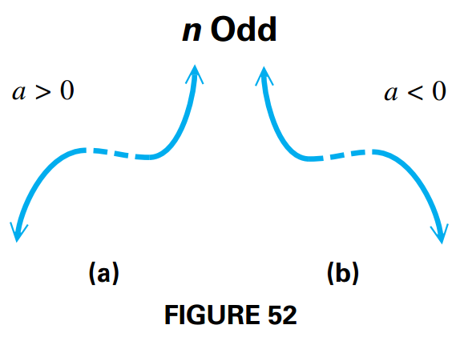

Suppose that $ax^n$ is the dominating term of a polynomial function $P$ of even degree.

1. If $a > 0$, then as $|x| \rightarrow \infty$, $P(x) \rightarrow \infty$. Therefore, the end behavior of the graph is of the type shown in FIGURE 53(a).
2. If $a < 0$, then as $|x| \rightarrow \infty$, $P(x) \rightarrow -\infty$. Therefore, the end behavior of the graph is of the type shown in FIGURE 53(b).

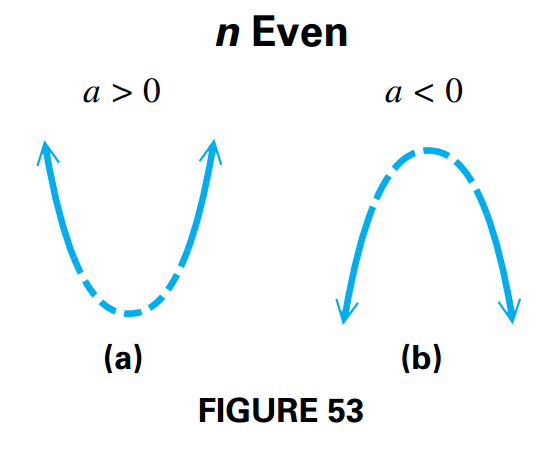

### x-Intercepts (Real Zeros)

The graph of a polynomial function of degree $n$ will have at most $n$ $x$-intercepts (real zeros).

### Comprehensive Graphs

The most important features of the graph of a polynomial function are its intercepts, extrema, and end behavior. For this reason, a comprehensive graph of a polynomial function will exhibit the following features.

1. All $x$-intercepts (if any)
2. The $y$-intercept
3. All extreme points (if any)
4. Enough of the graph to reveal the correct end behavior

## Topics in the Theory of Polynomial Functions (I)

### Intermediate Value Theorem

If $P(x)$ defines a polynomial function with only real coefficients, and if, for real numbers $a$ and $b$, the values $P(a)$ and $P(b)$ are opposite in sign, then there exists at least one real zero between $a$ and $b$.

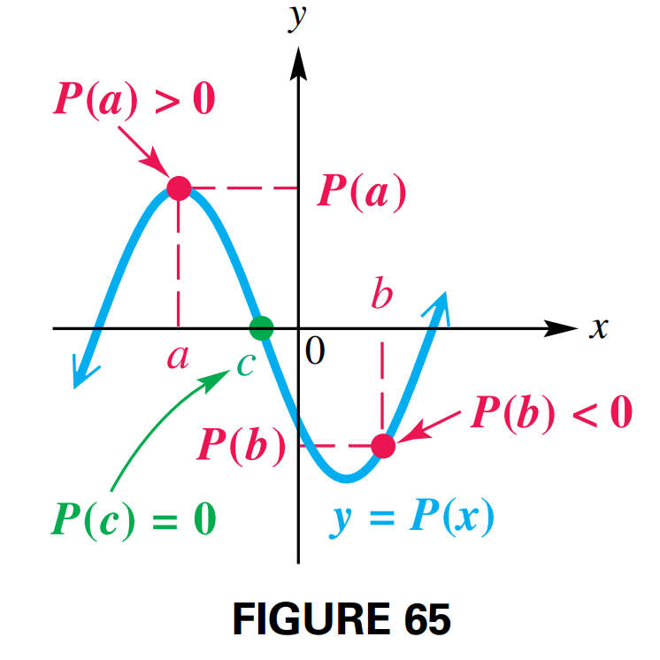

### Division of Polynomials by x − k and Synthetic Division

We can use long division to determine whether one whole number is a factor of another.

If the degree $n$ polynomial $P(x)$ (where $n \geq 1$) is divided by $x - k$, then the quotient polynomial, $Q(x)$, has degree $n - 1$.

The remainder $R$ is a constant (and may be $0$). The complete quotient for $\frac{P(x)}{x - k}$ may be written as:

$$
\begin{aligned}
\frac{P(x)}{x - k} = Q(x) + \frac{R}{x - k}
\end{aligned}
$$

Long division of a polynomial by a binomial of the form $x - k$ can be condensed

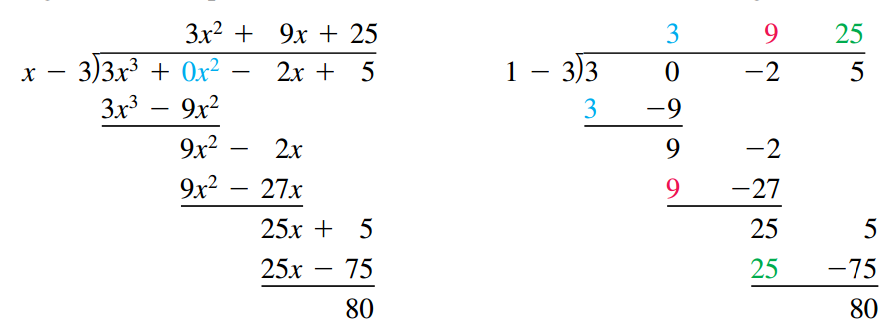

On the right, exactly the same division is shown without the variables. All the numbers in color on the right are repetitions of the numbers directly above them, so they can be omitted, as shown below on the left. Since the coefficient of $x$ in the divisor is always $1$, it can be omitted, too

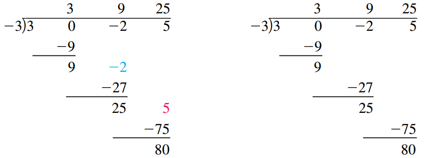

The numbers in color on the left are again repetitions of the numbers directly above them. They may be omitted, as shown on the right. Now the problem can be condensed. If the 3 in the dividend is brought down to the beginning of the bottom row, the top row can be omitted, since it duplicates the bottom row

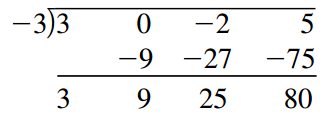

To simplify the arithmetic, we replace subtraction in the second row by addition and compensate by changing the $-3$ at the upper left to its additive inverse, $3$.

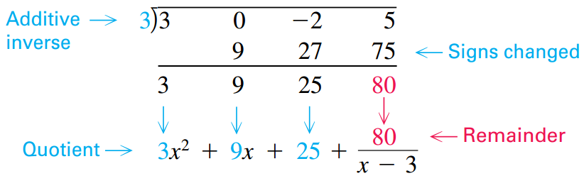

### Remainder Theorem

If a polynomial $P(x)$ is divided by $x - k$, the remainder is equal to $P(k)$. By the division algorithm for polynomials:

$$
\begin{aligned}
P(x) = Q(x)(x-k) + R
\end{aligned}
$$

$$
\begin{aligned}
P(k) = Q(k)(k-k) + R = R
\end{aligned}
$$

### Factor Theorem

A polynomial $P(x)$ has a factor $x - k$ if and only if $P(k) = 0$. By the remainder theorem:

$$
\begin{aligned}
P(k) = R
\end{aligned}
$$

where $R$ is the remainder, which is necessarily $0$.

### Division of Any Two Polynomials

Let $P(x)$ and $D(x)$ be two polynomials, with the degree of $D(x)$ greater than zero and less than the degree of $P(x)$. Then there exist unique polynomials $Q(x)$ and $R(x)$ such that:

$$
\begin{aligned}
\frac{P(x)}{D(x)} = Q(x) + \frac{R(x)}{D(x)}
\end{aligned}
$$

## Topics in the Theory of Polynomial Functions (II)

### Conjugate Zeros Theorem

If $P(x)$ is a polynomial function having only real coefficients, and if $a + bi$ is a zero of $P(x)$, then the conjugate $a - bi$ is also a zero of $P(x)$.

### Fundamental Theorem of Algebra

Every function defined by a polynomial of degree $1$ or more has at least one complex zero.

### Number of Zeros Theorem

A function defined by a polynomial of degree $n$ has at most $n$ distinct (unique) complex zeros.

### Multiplicity

The number of times a zero appears is referred to as the multiplicity of the zero.

A zero $k$ of a polynomial function has as multiplicity the exponent of the factor $x - k$.

1. If the zero has multiplicity one, the graph crosses the $x$-axis at the corresponding $x$-intercept as seen in FIGURE 74(a) on the next page.
2. If the zero has even multiplicity, the graph is tangent to the $x$-axis at the corresponding $x$-intercept (see FIGURE 74(b)).
3. If the zero has odd multiplicity greater than one, the graph crosses the $x$-axis and is tangent to the $x$-axis at the corresponding $x$-intercept. (See FIGURE 74(c)).

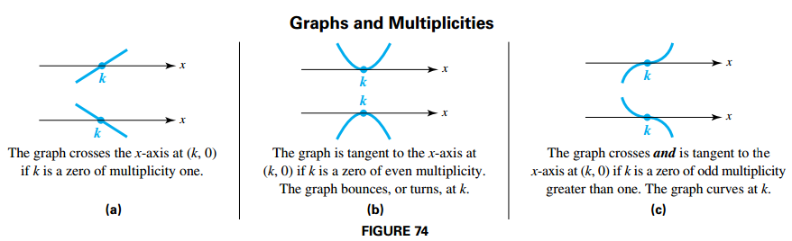

### Rational Zeros Theorem

Let $P(x) = a_nx^n + a_{n-1}x^{n - 1} + \cdots + a_1x + a_0$, where $a_n \neq 0$ and $a_0 \neq 0$, be a polynomial function with integer coefficients. If $\frac{p}{q}$ is a rational number written in lowest terms, and if $\frac{p}{q}$ is a zero of $P(x)$, then $p$ is a factor of the constant term $a_0$, and $q$ is a factor of the leading coefficient $a_n$.

**Proof** $P(\frac{p}{q}) = 0$ since $\frac{p}{q}$ is a zero of $P(x)$:

We substitute $x$ by $\frac{p}{q}$

$$
\begin{aligned}
a_n \left(\frac{p}{q}\right)^n + a_{n-1} \left(\frac{p}{q}\right)^{n - 1} + \cdots + a_{1} \left(\frac{p}{q}\right) + a_0 = 0
\end{aligned}
$$

$$
\begin{aligned}
a_n \left(\frac{p^n}{q^n}\right) + a_{n-1} \left(\frac{p^{n-1}}{q^{n-1}}\right) + \cdots + a_{1} \left(\frac{p}{q}\right) + a_0 = 0
\end{aligned}
$$

We multiply by $q^n$ and we add $-a_0q^n$

$$
\begin{aligned}
a_n p^n + a_{n-1} p^{n-1}q + \cdots + a_{1} p q^{n-1} = -a_0 + q^{n}
\end{aligned}
$$

We factor out $p$

$$
\begin{aligned}
p(a_n p^{n-1} + a_{n-1} p^{n-2}q + \cdots + a_{1} q^{n-1}) = -a_0 + q^{n}
\end{aligned}
$$

Thus, $-a_0q^n$ equals the product of the two factors, $p$ and $(a_np^{n-1} + \cdots + a_1q^{n-1})$. For this reason, $p$ must be a factor of $-a_0q^n$.

Since it was assumed that $\frac{p}{q}$ is written in lowest terms, $p$ and $q$ have no common factor other than $1$, so $p$ is not a factor of $q^n$. Thus, $p$ must be a factor of $a_0$.

### Descartes' Rule of Signs

Let $P(x)$ be a polynomial function with real coefficients and a nonzero constant term, with terms in descending powers of $x$.

- The number of positive real zeros either equals the number of variations in sign occurring in the coefficients of $P(x)$ or is less than the number of variations by a positive even integer.
- The number of negative real zeros either equals the number of variations in sign occurring in the coefficients of $P(-x)$ or is less than the number of variations by a positive even integer.

### Boundedness Theorem

Let $P(x)$ be a polynomial function of degree $n \geq 1$ with real coefficients and with a positive leading coefficient. Suppose $P(x)$ is divided synthetically by $x - c$.

- If $c > 0$ and all numbers in the bottom row of the synthetic division are nonnegative, then $P(x)$ has no zero greater than $c$.
- If $c < 0$ and the numbers in the bottom row of the synthetic division alternate in sign (with $0$ considered positive or negative, as needed), then $P(x)$ has no zero less than $c$.

## Polynomial Equations and Inequalities; Further Applications and Models

### Complex nth Roots

If $n$ is a positive integer and $k$ is a nonzero complex number, then a solution of $x^n = k$ is called an $n$th root of $k$.

#### Complex nth Roots Theorem

If $n$ is a positive integer and $k$ is a nonzero complex number, then the equation $x^n = k$ has exactly $n$ complex roots.
