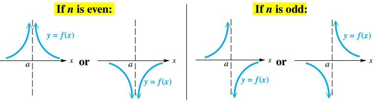
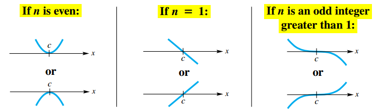
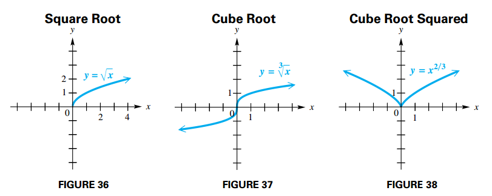

## Rational Functions and Graphs (I)

### Rational Function

A function $f$ of the form:

$$
\begin{aligned}
f(x) = \frac{p(x)}{q(x)}
\end{aligned}
$$

where $p(x)$ and $q(x)$ are polynomials, with $q(x) \neq 0$, is called a **rational function**.

### The Reciprocal Function

The simplest rational function with a variable denominator is the **reciprocal function**, defined as:

$$
\begin{aligned}
f(x) = \frac{1}{x}
\end{aligned}
$$

## Rational Functions and Graphs (II)

### Vertical and Horizontal Asymptotes

Let $p(x)$ and $q(x)$ be polynomials. For the rational function $f(x) = \frac{p(x)}{q(x)}$, written in lowest terms, and for real numbers $a$ and $b$,

1. If $|f(x)| \rightarrow \infty$ as $x \rightarrow a$, then the line $x = a$ is a **vertical asymptote**
2. If $|f(x)| \rightarrow b$ as $x \rightarrow \infty$, then the line $y = b$ is a **horizontal asymptote**

To find asymptotes of a rational function defined by a rational expression in
lowest terms, use the following procedures:

- **Vertical asymptotes** are found by determining the values of $x$ that make the denominator, but not the numerator, equal to $0$.
- **Other asymptotes**:
  - If the numerator has lesser degree than the denominator, then there is a horizontal asymptote $y = 0$ .
  - If the numerator and denominator have the same degree and the function is of the form:

$$
\begin{aligned}
f(x) = \frac{a_nx^n + \cdots + a_0}{b_nx^n + \cdots + b_0}, \text{ where } b_n \neq 0
\end{aligned}
$$

then dividing by $x_n$ in the numberator and denominator produces de horizontal asymptote $y = \frac{a_n}{b_n}$.

- If the numerator is of degree exactly one greater than the denominator, then there may be an **oblique** (or **slant**) asymptote. To find it, divide the numerator by the denominator and disregard any remainder. Set the (linear) polynomial portion of the quotient equal to $y$ to find the equation of the asymptote.

### Graphic a Rational Function

Let $f(x) = \frac{p(x)}{q(x)}$ be a function with the rational expression in lowest terms. To sketch its graph, follow these steps.

1. Find the domain and all vertical asymptotes.
2. Find any horizontal or oblique asymptote.
3. Find the $y$-intercept, if possible, by evaluating $f(0)$
4. Find the $x$-intercepts, if any, by solving $f(x) = 0$.
5. Determine whether the graph will intersect its nonvertical asymptote $y = b$ by solving $f(x) = b$, where $b$ is the $y$-value of the horizontal asymptote, or by solving $f(x) = mx + b$, where $y = mx + b$ is the equation of the oblique asymptote.
6. Plot selected points as necessary.

### Behavior of Graphs of Rational Functions Near Vertical Asymptotes

Suppose that $f(x)$ is a rational expression in lowest terms. If $n$ is the largest positive integer such that $(x - a)^n$ is a factor of the denominator of $f(x)$, the graph will behave in the manner illustrated near $a$.

### Behavior of Graphs of Rational Functions Near x-Intercepts

Suppose that $f(x)$ is a rational expression in lowest terms. If $n$ is the largest positive integer such that $(x - c)^n$ is a factor of the numerator of $f(x)$, the graph will behave in the manner illustrated near $c$.

### Graphs with Points of Discontinuity

A rational function that has a common variable factor in the numerator and denominator is not in lowest terms. Its graph usually has a **hole**, or **point of discontinuity**.

## Rational Equations, Inequalities, Models and Applications

### Solving Rational Equations and Inequalities

A **rational equation** (or rational inequality) is an equation (or inequality) with at least one term having a variable expression in a denominator or at least one term having a variable expression raised to a negative integer power.

#### Solving Rational Equations

1. Determine all values for which the rational equation has undefined expressions.
2. To clear fractions, multiply each side of the equation by the least common denominator of all rational expressions in the equation.
3. Solve the resulting equation.
4. Reject any values found in Step 1.

#### Solving Rational Inequalities

1. Rewrite the inequality, if necessary, so that $0$ is on one side and there is a single rational expression on the other side.
2. Determine the values that will cause either the numerator or the denominator of the rational expression to equal $0$. These values determine the intervals on the number line to consider.
3. Use a test value from each interval to determine which intervals form the solution set.

### Inverse Variation

When two quantities vary inversely, an increase in one quantity results in a decrease in the other.

Let $x$ and $y$ denote two quantities and $n$ be a positive number. Then $y$ is **inversely proportional to the nth power** of $x$, or $y$ **varies inversely with the nth power** of $x$, if there exists a nonzero number $k$ such that:

$$
\begin{aligned}
y = \frac{k}{x^n}
\end{aligned}
$$

If $y = \frac{k}{x}$, then $y$ is **inversely proportional** to $x$, or $y$ **varies inversely** with $x$.

### Joint Variation

Let $m$ and $n$ be real numbers. Then $z$ **varies jointly** with the $n$th power of $x$ and the $m$th power of $y$ if a nonzero real number $k$ exists such that

$$
\begin{aligned}
z = kx^ny^m
\end{aligned}
$$

## Functions Defined by Powers and Roots

### Power and Root Functions

A function $f$ of the form:

$$
\begin{aligned}
f(x) = x^b
\end{aligned}
$$

where $b$ is a constant, is a **power function**.

If $b = \frac{1}{m}$, for some integer $n \geq 2$, then $f$ is a **root function**

Frequently, the domain of a power function $f$ is restricted to nonnegative numbers. Suppose the rational number $\frac{p}{q}$ is written in lowest terms. Then the domain of $f(x) = x^{\frac{p}{q}}$ is all real numbers whenever $q$ is odd and all nonnegative real numbers whenever $q$ is even. If $b$ is a positive irrational number, the domain of $f(x) = x^b$ is all nonnegative real number.

### Graphs of $f(x) = \sqrt[n]{ax + b}$

When $n$ is even, the graph of the root function $f(x) = \sqrt[n]{x}$ resembles the graph of the square root function.

When $n$ is odd, the graph of the root function $f(x) = \sqrt[n]{x}$ resembles the graph of the cube root function.

To determine the domain of a root function of the form:

$$
\begin{aligned}
f(x) = \sqrt[n]{ax + b}
\end{aligned}
$$

we must note the parity of $n$:

1. If $n$ is even in $\sqrt[n]{ax + b}$, then $ax + b$ must be greater than or equal to $0$.
1. If $n$ is odd in $\sqrt[n]{ax + b}$, then $ax + b$ can be any real number.

## Equations, Inequalities, and Applications Involving Root Functions

### Equations and Inequalities

#### Power Property

If $P$ and $Q$ are algebraic expressions, then every solution of the equation $P = Q$ is among the solutions of the equation $P^n = Q^n$, for any positive integer $n$.

When the power property is used to solve equations, the new equation may have more solutions than the original equation. We call these **proposed solutions** of the original equation. After applying the power property on equations that contain radicals or rational exponents, it is essential to check all proposed solutions in the original equation.

To solve equations involving roots, follow these steps.

1. Isolate a term involving a root on one side of the equation
2. Raise each side of the equation to a positive integer power that will eliminate the radical or rational exponent.
3. Solve the resulting equation. (If a root is still present after Step 2, repeat Steps 1 and 2.)
4. Check each proposed solution in the original equation
