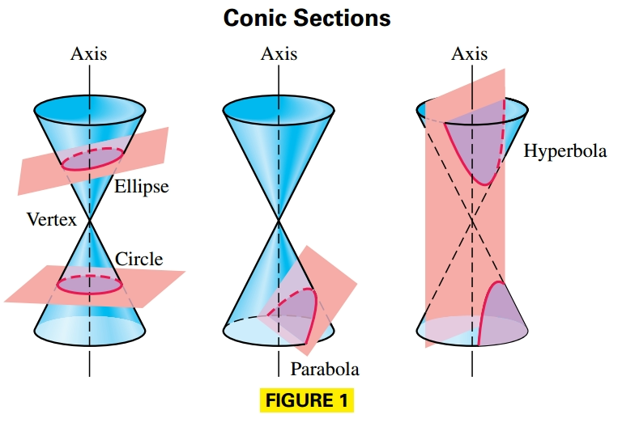
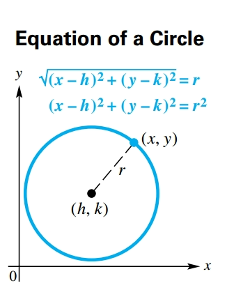
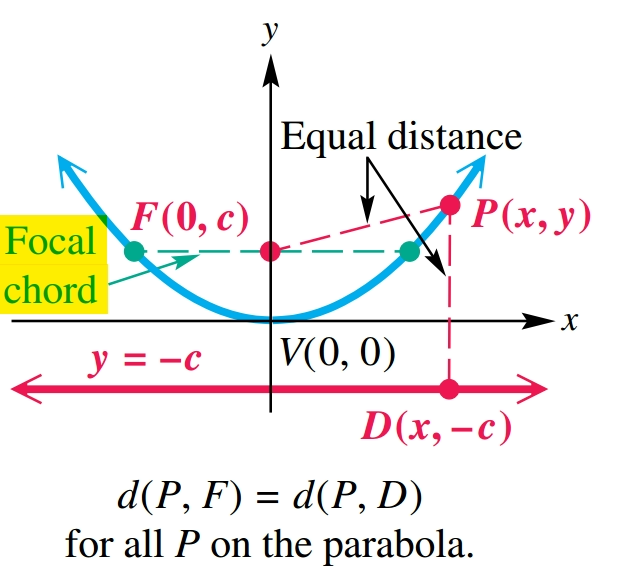
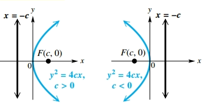
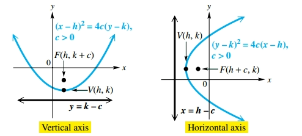
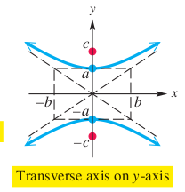

## Circles and Parabolas

### Conic Sections

**Parabolas, circles, ellipses**, and **hyperbolas** form a group of curves known as the **conic sections**, because they are the result of intersecting a cone with a plane.

### Circle

A **circle** is a set of points in a plane that are equidistant from a fixed point. The distance is called the **radius** of the circle, and the fixed point is called the **center**.

Suppose a circle has center $(h, k)$ and radius $r > 0$. Then the distance between the center $(h, k)$ and any point $(x, y)$ on the circle must equal $r$. Thus, an equation of the circle is as follows:

$$
\begin{aligned}
\sqrt{(x - h)^2 + (y - k)^2} = r
\end{aligned}
$$

$$
\begin{aligned}
(x - h)^2 + (y - k)^2 = r^2
\end{aligned}
$$

Therefore the **center–radius** form of the equation of a circle with center $(h, k)$ and radius $r$ is:

$$
\begin{aligned}
(x - h)^2 + (y - k)^2 = r^2
\end{aligned}
$$

**Notice that a circle is the graph of a relation that is not a function**.

A circle with center $(0, 0)$ and radius $r$ has equation:

$$
\begin{aligned}
x^2 + y^2 = r^2
\end{aligned}
$$

#### General Form of the Equation of a Circle

For real numbers $c$, $d$, and $e$, the equation:

$$
\begin{aligned}
x^2 + y^2 + cx + dy + e = 0
\end{aligned}
$$

can have a graph that is a circle, that is a point, or that is empty (contains no points.)

Starting with an equation in this general form, we can work in reverse by completing the square to get an equation of the form:

$$
\begin{aligned}
(x - h)^2 + (y - k)^2 = m \text{ for some } m
\end{aligned}
$$

There are three possibilities for the graph, based on the value of $m$:

1. If $m > 0$, then $r^2 = m$, and the equation represents a circle with radius $\sqrt{m}$.
2. If $m = 0$, the equation represents the single point $(h, k)$.
3. If $m < 0$, no points satisfy the equation and the graph is empty.

### Parabola

A **parabola** is a set of points in a plane equidistant from a fixed point and a fixed line. The fixed point is called the **focus**, and the fixed line the **directrix**, of the parabola.

We can find an equation of a parabola from the preceding definition. Let the directrix be the line $y = -c$ and the focus be the point $F$ with coordinates $(0, c)$. Given a point $P$ on the parabola, with coordinates $(x, y)$, using the distance formula gives the following result:

$$
\begin{aligned}
d(P, F) = d(P, D)
\end{aligned}
$$

$$
\begin{aligned}
\sqrt{(x - 0)^2 + (y - c)^2} = \sqrt{(x - x)^2 + [y - (-c)]^2}
\end{aligned}
$$

$$
\begin{aligned}
x^2 + (y - c)^2 = [y +c]^2
\end{aligned}
$$

$$
\begin{aligned}
x^2 + (y - c)^2 = (y + c)^2
\end{aligned}
$$

$$
\begin{aligned}
x^2 + y^2 + c^2 - 2cy = y^2 + c^2 + 2cy
\end{aligned}
$$

$$
\begin{aligned}
x^2 = 4cy
\end{aligned}
$$

The focal chord through the focus and perpendicular to the axis of symmetry of a parabola is called the **latus rectum**, and has length $|4c|$.

To see this, note in the previous image that the endpoints of the chord are $(-x, c)$ and $(x, c)$. Let $y = c$ in the equation of the parabola and solve for $x$.

$$
\begin{aligned}
x^2 = 4cy
\end{aligned}
$$

$$
\begin{aligned}
x^2 = 4c^2
\end{aligned}
$$

$$
\begin{aligned}
x = |2c|
\end{aligned}
$$

The length of half the focal chord is |2c| (from x = 0 to x = 2c or x = -2c) , so its full length is |4c|.

#### Parabola with a Horizontal Axis and Vertex $(0, 0)$

The parabola with focus $(c, 0)$ and directrix $x = -c$ has equation:

$$
\begin{aligned}
y^2 = 4cx
\end{aligned}
$$

The parabola has vertex $(0, 0)$, horizontal axis $y = 0$, and opens to the right if $c > 0$ or to the left if $c < 0$.

**Notice that the graph of a parabola with a horizontal axis is not a function.**

#### Equation Forms for Translated Parabolas

A parabola with vertex $(h, k)$ has an equation of the form:

Vertical axis:

$$
\begin{aligned}
(x - h)^2 = 4c(y - k)
\end{aligned}
$$

Horizontal axis:

$$
\begin{aligned}
(y - k)^2 = 4c(x - h)
\end{aligned}
$$

where the focus is a distance $|c|$ from the vertex:

## Ellipses and Hyperbolas

### Ellipse

An **ellipse** is the set of all points in a plane, the sum of whose distances from two fixed points is constant. Each fixed point is called a **focus** (plural, foci) of the ellipse.

An ellipse has two axes of symmetry: the **major axis** (the longer one) and the **minor axis** (the shorter one). **The foci are always located on the major axis**. The midpoint of the major axis is the **center** of the ellipse, and the endpoints of the major axis are the **vertices** of the ellipse.

A chord through a focus and perpendicular to the major axis is called a **latus rectum**. **The graph of an ellipse is not the graph of a function.**

Given an ellipse with center at the origin, foci $F(c, 0)$ and $F′(-c, 0)$, and vertices $V(a, 0)$ and $V′(-a, 0)$. From the previous image we know that the distance from $V$ to $F$ is $a - c$ and the distance from $V$ to $F′$ is $a + c$. The sum of these distances is $2a$. Since $V$ is on the ellipse, all othe points must satisfy this distance, such that for any point $P(x, y)$ on the ellipse:

$$
\begin{aligned}
d(P, F) + d(P, F') = 2a
\end{aligned}
$$

$$
\begin{aligned}
\sqrt{(x - c)^2 + y^2} + \sqrt{(x + c)^2 + y^2} = 2a
\end{aligned}
$$

$$
\begin{aligned}
\sqrt{(x - c)^2 + y^2}  = 2a - \sqrt{(x + c)^2 + y^2}
\end{aligned}
$$

We now square each side:

$$
\begin{aligned}
(x - c)^2 + y^2  = 4a^2 - 4a\sqrt{(x + c)^2 + y^2} + (x + c)^2 + y^2
\end{aligned}
$$

$$
\begin{aligned}
x^2 + c^2 - 2xc + y^2  = 4a^2 - 4a\sqrt{(x + c)^2 + y^2} + x^2 + c^2 + 2xc + y^2
\end{aligned}
$$

$$
\begin{aligned}
- 4xc = 4a^2 - 4a\sqrt{(x + c)^2 + y^2}
\end{aligned}
$$

$$
\begin{aligned}
- xc = a^2 - a\sqrt{(x + c)^2 + y^2}
\end{aligned}
$$

$$
\begin{aligned}
xc + a^2 = a\sqrt{(x + c)^2 + y^2}
\end{aligned}
$$

We square both sides again:

$$
\begin{aligned}
(xc + a^2)^2 = a^2\left((x + c)^2 + y^2\right)
\end{aligned}
$$

$$
\begin{aligned}
x^2c^2 + a^4 + 2xca^2 = a^2\left(x^2 + c^2 + 2xc + y^2\right)
\end{aligned}
$$

$$
\begin{aligned}
x^2c^2 + a^4 + 2xca^2 = a^2x^2 + a^2c^2 + 2xca^2 + a^2y^2
\end{aligned}
$$

$$
\begin{aligned}
x^2c^2 + a^4 = a^2x^2 + a^2c^2 + a^2y^2
\end{aligned}
$$

$$
\begin{aligned}
x^2c^2 - a^2x^2 - a^2y^2 = - a^4 + a^2c^2
\end{aligned}
$$

$$
\begin{aligned}
x^2(c^2 - a^2)- a^2y^2 = a^2 (-a^2 + c^2)
\end{aligned}
$$

We multiply both sides by $-1$:

$$
\begin{aligned}
x^2(a^2 - c^2) + a^2y^2 = a^2 (a^2 - c^2)
\end{aligned}
$$

We divide both sides by $a^2(a^2 - c^2)$:

$$
\begin{aligned}
\frac{x^2}{a^2} + \frac{y^2}{(a^2 - c^2)} = 1
\end{aligned}
$$

Which gives us the standard form equation for the ellipse with center on the origin, vertices $(\pm a, 0)$ and foci $(\pm c, 0)$.

Since $B(0, b)$ is on the ellipse, then:

$$
\begin{aligned}
d(B, F) + d(B + F') = 2a
\end{aligned}
$$

$$
\begin{aligned}
\sqrt{(-c)^2 + b^2} + \sqrt{c^2 + b^2} = 2a
\end{aligned}
$$

$$
\begin{aligned}
2\sqrt{c^2 + b^2} = 2a
\end{aligned}
$$

We square both sides

$$
\begin{aligned}
4(c^2 + b^2) = 4a^2
\end{aligned}
$$

$$
\begin{aligned}
c^2 + b^2 = a^2
\end{aligned}
$$

$$
\begin{aligned}
b^2 = a^2 - c^2
\end{aligned}
$$

Therefore, by sustuting on the ellipse formula we obtain:

$$
\begin{aligned}
\frac{x^2}{a^2} + \frac{y^2}{b^2} = 1
\end{aligned}
$$

#### Standard Forms of Equations for Ellipses

The ellipse with center at the origin and equation:

$$
\begin{aligned}
\frac{x^2}{a^2} + \frac{y^2}{b^2} = 1, (a > b > 0)
\end{aligned}
$$

has vertices $(\pm a, 0)$, endpoints of the minor axis $(0, \pm b)$ and foci $(\pm c, 0)$ where $c^2 = a^2 - b^2$

The ellipse with center at the origin and equation

$$
\begin{aligned}
\frac{x^2}{b^2} + \frac{y^2}{a^2} = 1, (a > b > 0)
\end{aligned}
$$

has vertices $(0, \pm a)$, endpoints of the minor axis $(\pm b, 0)$ and foci $(0, \pm c)$ where $c^2 = a^2 - b^2$

#### Translations of Ellipses

An ellipse with center at $(h, k)$ where $b^2 = a^2 - c^2$ with $a > b > 0$ and $c > 0$ satisfies one of the following equations:

- Major axis: horizontal, foci $(h \pm c, k)$ and vertices $(h \pm a, k)$:

$$
\begin{aligned}
\frac{(x - h)^2}{a^2} + \frac{(y - k)^2}{b^2} = 1
\end{aligned}
$$

- Major axis: vertical, foci $(h, k \pm c)$ and vertices $(h, k \pm a)$:

$$
\begin{aligned}
\frac{(x - h)^2}{b^2} + \frac{(y - k)^2}{a^2} = 1
\end{aligned}
$$

### Hyperbola

A **hyperbola** is the set of all points in a plane such that the absolute value of the difference of the distances from two fixed points is constant. The two fixed points are called the **foci** of the hyperbola.

Suppose a hyperbola has center at the origin and foci at $F'(- c, 0)$ and $F(c, 0)$. The midpoint of the segment $F′F$ is the center of the hyperbola, and the points $V'(- a, 0)$ and $V(a, 0)$ are the **vertices** of the hyperbola. The line segment **V'V** is the **transverse axis** of the hyperbola.

A chord through a focus and perpendicular to an extension of the transverse axis is a **latus rectum**.

#### Standard Forms of Equations for Hyperbolas

The hyperbola with center at the origin and equation

$$
\begin{aligned}
\frac{x^2}{a^2} - \frac{y^2}{b^2} = 1
\end{aligned}
$$

has vertices $(\pm a, 0)$, asymptotes $y = \pm \frac{b}{a}x$ and foci $(\pm c, 0)$ where $c^2 = a^2 + b^2$.

The hyperbola with center at the origin and equation

$$
\begin{aligned}
\frac{y^2}{a^2} - \frac{x^2}{b^2} = 1
\end{aligned}
$$

has vertices $(0, \pm a)$, asymptotes $y = \pm \frac{a}{b}x$ and foci $(0, \pm c)$ where $c^2 = a^2 + b^2$.

To explain the concept of asymptotes, we can start with the first equation for a hyperbola, where the foci are on the x-axis, and solve for $y$:

$$
\begin{aligned}
\frac{x^2}{a^2} - \frac{y^2}{b^2} = 1
\end{aligned}
$$

$$
\begin{aligned}
\frac{y^2}{b^2} = \frac{x^2}{a^2} - 1
\end{aligned}
$$

$$
\begin{aligned}
\frac{y^2}{b^2} = \frac{x^2 - a^2}{a^2}
\end{aligned}
$$

$$
\begin{aligned}
\frac{y}{b} = \pm \frac{1}{a} \sqrt{x^2 - a^2}
\end{aligned}
$$

$$
\begin{aligned}
y = \pm \frac{b}{a} \sqrt{x^2 - a^2}
\end{aligned}
$$

$$
\begin{aligned}
y = \pm \frac{b}{a} \frac{x}{x} \sqrt{x^2 - a^2}
\end{aligned}
$$

$$
\begin{aligned}
y = \pm \frac{b}{a} x \sqrt{\frac{x^2 - a^2}{x^2}}
\end{aligned}
$$

$$
\begin{aligned}
y = \pm \frac{b}{a} x \sqrt{\frac{x^2}{x^2} - \frac{a^2}{x^2}}
\end{aligned}
$$

$$
\begin{aligned}
y = \pm \frac{b}{a} x \sqrt{1 - \frac{a^2}{x^2}}
\end{aligned}
$$

So when $x \rightarrow \infty$ we know that $\frac{a^2}{x^2} \rightarrow 0$ and thus:

$$
\begin{aligned}
y = \pm \frac{b}{a} x \sqrt{1}
\end{aligned}
$$

$$
\begin{aligned}
y = \pm \frac{b}{a} x
\end{aligned}
$$

Which defines the asymptotes of the hyperbola. The lines are the extended diagonals of the rectangle whose vertices are $(a, b)$, $(- a, b)$, $(a, - b)$, and $(- a, - b)$. This rectangle is called the **fundamental rectangle** of the hyperbola.

If the foci are on the y-axis the hyperbola is defined as follows:

$$
\begin{aligned}
y = \pm \frac{a}{b} x
\end{aligned}
$$

#### Translations of Hyperbolas

A hyperbola with center $(h, k)$, where $c^2 = a^2 + b^2$ is defined in one of two ways:

- Traverse axis is horizontal, vertices are $(h \pm a, k)$, foci are $(h \pm c, k)$ and asymptotes are $y = \pm \frac{b}{a}(x - h) + k$

$$
\begin{aligned}
\frac{(x - h)^2}{a^2} - \frac{(y - k)^2}{b^2}  = 1
\end{aligned}
$$

- Traverse axis is verticsl, vertices are $(k, h \pm a)$, foci are $(k, h \pm c)$ and asymptotes are $y = \pm \frac{a}{b}(x - h) + k$

$$
\begin{aligned}
\frac{(y - k)^2}{a^2} - \frac{(x - h)^2}{b^2}  = 1
\end{aligned}
$$

## The Conic Sections and Nonlinear Systems

### Characteristics

The **conic sections** in this chapter have equations that can be written in the form:

$$
\begin{aligned}
Ax^2 + Dx + Cy^2 + Ey + F = 0
\end{aligned}
$$

where either $A$ or $C$ must be nonzero.

The special characteristics of each conic section are summarizeed in the following table.

The chart summarizes our work with conic sections:

### Eccentricity

A conic is the set of all points $P(x, y)$ in a plane such that the ratio of the distance from $P$ to a fixed point and the distance from $P$ to a fixed line is constant.

The constant ratio is called the ecccentricity of the conic, written $e$.

#### Parabola

If the conic is a parabola, then by definition, the distances $d(P, F)$ and $d(P, D)$ are equal, thus every parabola has eccentricity $1$.

#### Ellipse

For an ellipse, eccentricity is a measure of its "roundness". The constant ratio in the definition is $e = \frac{c}{a}$, where $c$ is the distance from the center of the figure to a focus and $a$ is the distance from the center to a vertex.

By the definition of an ellipse, $a^2 > b^2$ and $c = \sqrt{a^2 - b^2}$. Thus, for the ellipse:

$$
\begin{aligned}
0 < c < a
\end{aligned}
$$

Divide by $a$:

$$
\begin{aligned}
0 < \frac{c}{a} < 1
\end{aligned}
$$

Where $e = \frac{c}{a}$:

$$
\begin{aligned}
0 < e < 1
\end{aligned}
$$

#### Circle

In the circle the foci coincide with the center such that $a = b$ and $c = \sqrt{a^2 - b^2} = 0$ and therefore $e = \frac{c}{a} = 0$.

#### Hyperbola

The hyperbola also has eccentricity $e = \frac{c}{a}$. By definition $c = \sqrt{a^2 + b^2} > a$, so:

$$
\begin{aligned}
0 < a < c
\end{aligned}
$$

Divide by $a$:

$$
\begin{aligned}
0 < 1 < \frac{a}{c}
\end{aligned}
$$

$$
\begin{aligned}
0 < 1 < e
\end{aligned}
$$

Therefore $e > 1$. Such that narrow hyperbolas have $e$ near $1$ and wide hyperbolas have a large value of $e$.

### Nonlinear Systems

A nonlinear system of equations can have any number of solutions.

## Parametric Equations

### Graphing a Parabola Defined Parametrically

Graph the plane curve $x = t^2, y = 2t + 3$ for $t \in [-3, 3]$.

Make a table of corresponding values of $t$, $x$, and $y$ over the domain of $t$.

| $t$  | $x$ | $y$  |
| ---- | --- | ---- |
| $-3$ | $9$ | $-3$ |
| $-2$ | $4$ | $-1$ |
| $-1$ | $1$ | $1$  |
| $0$  | $0$ | $3$  |
| $1$  | $1$ | $5$  |
| $2$  | $4$ | $7$  |
| $3$  | $9$ | $9$  |

Then plot the points.

To find an equivalent rectangular equation, we eliminate the parameter $t$.

$$
\begin{aligned}
y = 2t + 3
\end{aligned}
$$

$$
\begin{aligned}
y - 3 = 2t
\end{aligned}
$$

$$
\begin{aligned}
\frac{y - 3}{2} = t
\end{aligned}
$$

Now we substitute the result in the first equation $x = t^2$:

$$
\begin{aligned}
x = t^2 = \left(\frac{y - 3}{2}\right)^2 = \frac{(y - 3)^2}{4} = \frac{1}{4}(y-3)^2
\end{aligned}
$$

This is indeed an equation of a horizontal parabola that opens to the right.

Because $t$ is in $[3, -3]$, $x$ is in $[3, 0]$, and $y$ is in $[-3, 9]$. The rectangular equation must be given with its restricted domain as:

$$
\begin{aligned}
x = \frac{1}{4}(y-3)^2, \text{ for } x \in [0, 9]
\end{aligned}
$$
